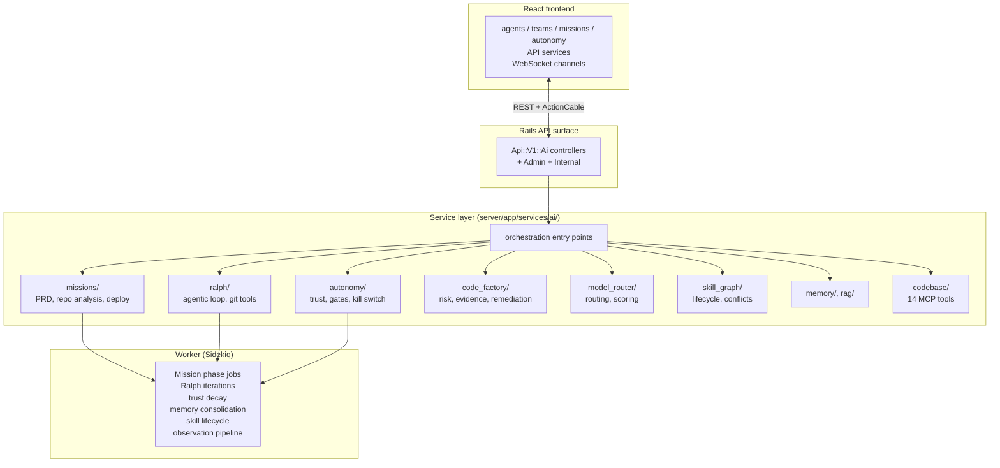
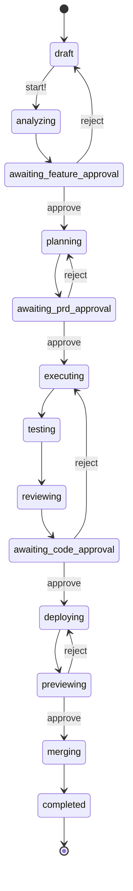
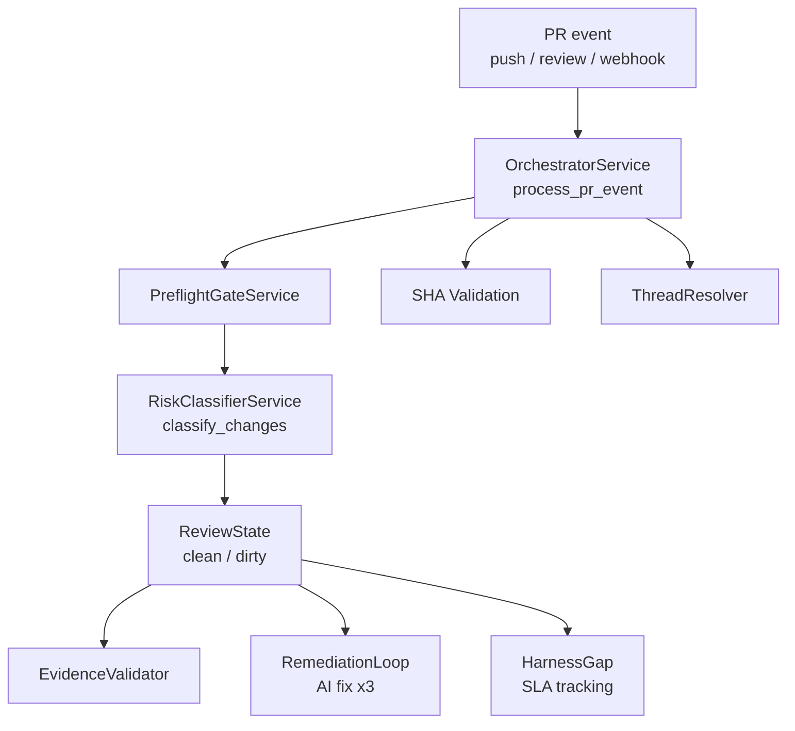
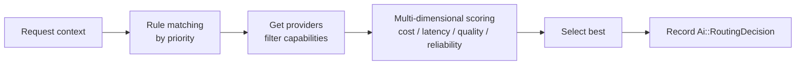
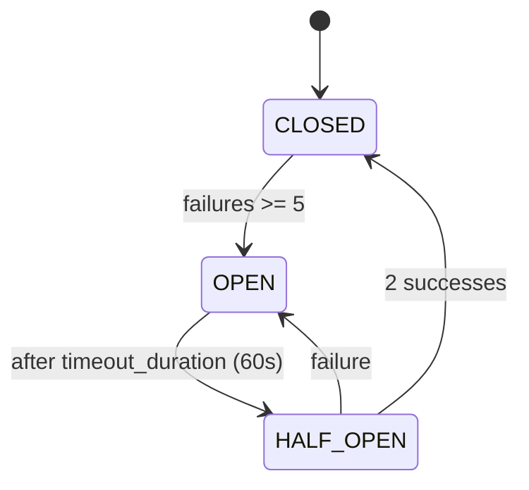
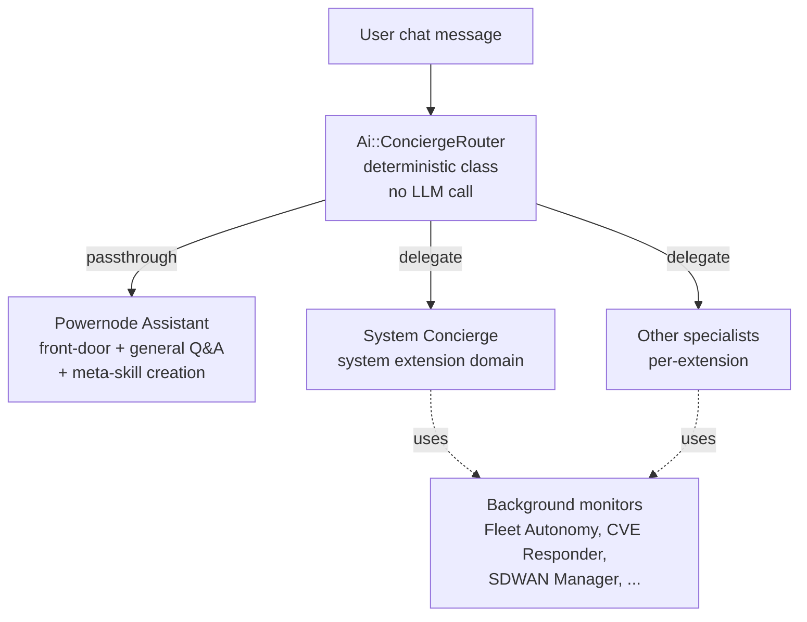

# Agents and Autonomy

> Status: active

> How Powernode runs AI agents — orchestration, missions, Ralph Loops, trust scoring, governance gates, provider routing, and concierge delegation.

## Table of Contents

- [What this concept covers](#what-this-concept-covers)
- [Orchestration overview](#orchestration-overview)
- [Agents and teams](#agents-and-teams)
- [Missions](#missions)
- [Ralph Loops](#ralph-loops)
- [Code Factory](#code-factory)
- [Model Router](#model-router)
- [Provider routing and resilience](#provider-routing-and-resilience)
- [Intervention Policies & Approval Gates](#intervention-policies--approval-gates)
- [Concierge routing and meta-skills](#concierge-routing-and-meta-skills)
- [Agent autonomy (trust and governance)](#agent-autonomy-trust-and-governance)
- [Operational autonomy](#operational-autonomy)
- [Quick start](#quick-start)
- [Related concepts](#related-concepts)
- [Materials previously at](#materials-previously-at)

## What this concept covers

This is the longest concept doc in the platform because it covers the whole AI surface — agents, teams, the multi-step Mission pipeline, the recursive Ralph execution engine, the Code Factory review gate, the Model Router, provider load-balancing, the chat concierge that routes between specialists, and the trust/autonomy machinery that decides what agents are allowed to do without asking.

Read this first if you're contributing to anything under `server/app/services/ai/` or `worker/app/jobs/Ai*`. After this, jump to [`concepts/knowledge-and-memory.md`](./knowledge-and-memory.md) for how agents persist and recall context, and [`concepts/mcp-and-tools.md`](./mcp-and-tools.md) for how their tool calls are executed.

The agent system is designed around a graduated trust model: every agent starts under supervision and earns capabilities through reliable execution, cost discipline, safety compliance, and high-quality output. The governance machinery — execution gates, behavioral fingerprinting, conformance rules, kill switches — exists so the platform can grant real autonomy without losing the ability to halt it instantly.

## Orchestration overview



**Orchestration entry points** (services that anchor each subsystem):

| Service | Subsystem |
|---------|-----------|
| `Ai::Agents::ExecutionService` | Agent execution |
| `Ai::Missions::OrchestratorService` | Mission lifecycle |
| `Ai::Ralph::ExecutionService` | Ralph Loop execution |
| `Ai::CodeFactory::OrchestratorService` | Code review pipeline |
| `Ai::ModelRouterService` | Provider routing |
| `Ai::ConciergeRouter` | Chat concierge front-door routing |

**WebSocket channels** for real-time updates:

| Channel | Purpose |
|---------|---------|
| `MissionChannel` | Mission status, phase, and approval events |
| `CodeFactoryChannel` | Code review pipeline events |
| `AiOrchestrationChannel` | Unified stream for executions, Ralph Loops, worktree sessions, circuit breakers, monitoring alerts, system health |
| `TeamChannel` | Team execution events |
| `AiAgentExecutionChannel` | Per-agent execution lifecycle |
| `AiConversationChannel` | Conversation message broadcasts |
| `AiStreamingChannel` | LLM token streaming |

See [`concepts/chat-and-realtime.md`](./chat-and-realtime.md) for the full channel reference.

## Agents and teams

The agent hierarchy starts with `Ai::Agent` (configuration) and extends through specialized association models that record execution, trust, capability, and observation state:

```
Ai::Agent                    # Core agent configuration
├── Ai::AgentExecution       # Execution records
├── Ai::AgentTrustScore      # 5-dimensional trust scoring
├── Ai::AgentSkill           # Skill assignments
├── Ai::AgentBudget          # Hierarchical budgets
├── Ai::AgentShortTermMemory # STM entries
├── Ai::BehavioralFingerprint # Anomaly baselines
├── Ai::DelegationPolicy     # Delegation rules
├── Ai::AgentIdentity        # Identity verification
├── Ai::AgentGoal            # Self-directed goals
├── Ai::AgentObservation     # Environmental observations
├── Ai::AgentProposal        # Proposals for human review
├── Ai::AgentEscalation      # Structured escalations
└── Ai::AgentFeedback        # Human-to-agent feedback
```

### Agent teams

Multi-agent collaboration is modeled by `Ai::AgentTeam` with members joined through `Ai::AgentTeamMember` and `Ai::TeamRole`. Execution is tracked by `Ai::TeamExecution` and `Ai::TeamTask`; team communications run through `Ai::TeamChannel` and `Ai::TeamMessage`.

**Execution strategies:**

| Strategy | Description |
|----------|-------------|
| `hierarchical` | Coordinator delegates to members based on capability |
| `sequential` | Members run in priority order, each seeing prior output |
| `parallel` | All members run concurrently; results merged |
| `mesh` | Bidirectional agent-to-agent communication |

## Missions

A Mission is a high-level development lifecycle that takes a feature request from analysis through deployment and merge. It orchestrates repo analysis, PRD generation, Ralph Loop execution, code review, testing, deployment preview, and merge — with human approval gates at key checkpoints.



### Mission types and phases

`MISSION_TYPES = %w[development research operations infrastructure agent_fleet custom]`.

| Type | Pipeline |
|------|----------|
| `development` | Full 12-phase pipeline with all approval gates |
| `research` | Subset of phases for investigation and analysis tasks |
| `operations` | Subset of phases for infrastructure and operational tasks |
| `infrastructure` | Provisioning/operational missions (has dedicated `infrastructure?` logic and provisioning-conversation tagging) |
| `agent_fleet` | Fleet-oriented missions for launching/coordinating agent fleets |
| `custom` | User-defined mission with a custom phase set |

### Approval gates

| Gate | Phase | Decision |
|------|-------|----------|
| `feature_selection` | `awaiting_feature_approval` | Approve which feature to build |
| `prd_review` | `awaiting_prd_approval` | Approve the generated PRD |
| `code_review` | `awaiting_code_approval` | Approve the code changes |
| `merge_approval` | `previewing` | Approve merge after preview |

### Phase-to-job mapping

| Phase | Worker Job |
|-------|-----------|
| `analyzing` | `AiMissionAnalyzeJob` |
| `planning` | `AiMissionPlanJob` |
| `executing` | `AiMissionExecuteJob` |
| `testing` | `AiMissionTestJob` |
| `reviewing` | `AiMissionReviewJob` |
| `deploying` | `AiMissionDeployJob` |
| `merging` | `AiMissionMergeJob` |

Jobs dispatch through `WorkerJobService` to the `ai_execution` queue. When an approval is rejected, the orchestrator routes back to the appropriate earlier phase and redispatches the job.

### Mission services

| Service | Responsibility |
|---------|---------------|
| `OrchestratorService` | Lifecycle transitions, phase dispatch, approval handling |
| `PrdGenerationService` | AI-generated PRD from objective + repo context |
| `RepoAnalysisService` | Repo structure analysis and feature suggestion |
| `AppLaunchService` | Preview deployment allocation and cleanup |
| `PrManagementService` | Branch creation and pull request management |
| `TestRunnerService` | Test triggering and status polling |

### Mission API

| Method | Path | Permission |
|--------|------|-----------|
| `GET` | `/api/v1/ai/missions` | `ai.missions.read` |
| `POST` | `/api/v1/ai/missions` | `ai.missions.manage` |
| `POST` | `/api/v1/ai/missions/:id/start` | `ai.missions.manage` |
| `POST` | `/api/v1/ai/missions/:id/approve` | `ai.missions.manage` |
| `POST` | `/api/v1/ai/missions/:id/reject` | `ai.missions.manage` |
| `POST` | `/api/v1/ai/missions/:id/pause` / `resume` / `cancel` / `retry` (action: `retry_phase`) | `ai.missions.manage` |
| `POST` | `/api/v1/ai/missions/:id/{analyze_repo,generate_prd,create_branch,run_tests,deploy,create_pr,cleanup_deployment,advance}` | `ai.missions.manage` |

Full endpoint list in [`reference/api/ai.md`](../reference/api/ai.md).

## Ralph Loops

Ralph (Recursive Agent Learning & Planning Harness) is the core agentic execution engine. A Ralph Loop takes a PRD, decomposes it into tasks, and executes each task using agents, pipelines, or human reviewers. Each iteration produces learnings that feed back into the system.

```mermaid
flowchart TB
    PRD[PRD JSON]
    Loop[RalphLoop<br/>parse_prd → tasks]
    Task1[RalphTask #1<br/>depends: []]
    Task2[RalphTask #2<br/>depends: #1]
    Executor[TaskExecutor<br/>routes by execution_type]
    Agent[AgenticLoop<br/>max 15 tool rounds]
    Git[GitToolExecutor<br/>file ops + git ops]
    MCP[MCP tools<br/>platform.*]
    Iter[RalphIteration<br/>output, tokens, learning]

    PRD --> Loop
    Loop --> Task1
    Loop --> Task2
    Task1 --> Executor
    Task2 --> Executor
    Executor --> Agent
    Agent --> Git
    Agent --> MCP
    Agent --> Iter
```

### Models

| Model | Purpose |
|-------|---------|
| `Ai::RalphLoop` | Container — holds tasks, iterations, scheduling mode (`manual`, `scheduled`, `continuous`, `event_triggered`, `autonomous`) |
| `Ai::RalphTask` | Individual task with dependency tracking and executor routing |
| `Ai::RalphIteration` | Single execution attempt — records output, tokens, learnings, commit SHA |

### Execution types

Tasks route to executors by `execution_type`:

| Type | Executor | Description |
|------|----------|-------------|
| `agent` | `AgenticLoop` | Tool-calling agent with git + MCP tools |
| `pipeline` | `PipelineExecution` | Triggers CI/CD pipeline |
| `a2a_task` | `A2A::Service` | Agent-to-agent task submission |
| `container` | `ContainerOrchestrationService` | Container-based execution |
| `human` | Notification | Creates notification for human review |
| `community` | A2A external | External agent federation |

The six execution types map to `RalphTask::EXECUTION_TYPES` (`agent pipeline a2a_task container human community`).

### AgenticLoop

The tool-calling loop that powers `execution_type: agent`. It calls `client.send_message` iteratively (max 15 rounds), extracts tool calls from each response, routes git tools to `GitToolExecutor` and MCP tools to `Mcp::SyncExecutionService`, and accumulates content + tool results.

### Git tools

`GitToolExecutor` handles repository operations inside a worktree:

| Category | Tools |
|----------|-------|
| `file_ops` | `read_file`, `write_file`, `delete_file`, `list_files` |
| `code_intel` | `search_code`, `get_file_info` |
| `repo_context` | `get_repo_info`, `list_branches`, `get_branch_diff`, `list_commits` |

`write_file` and `delete_file` commit automatically with the provided message. Tool definitions are formatted per-provider (Anthropic `input_schema` vs OpenAI/Ollama `function` shape).

### PRD format

```json
{
  "title": "Add User Profile Page",
  "description": "Create a user profile page with avatar upload and settings",
  "tasks": [
    {
      "key": "task_1",
      "name": "Create User Profile Model",
      "description": "Add profile fields to User model with migration",
      "priority": 1,
      "acceptance_criteria": "Migration runs, model validates presence of display_name",
      "dependencies": [],
      "execution_type": "agent"
    },
    {
      "key": "task_2",
      "name": "Create Profile API Endpoint",
      "description": "Add GET/PATCH /api/v1/profile endpoint",
      "priority": 2,
      "acceptance_criteria": "Returns profile data, updates display_name and bio",
      "dependencies": ["task_1"],
      "execution_type": "agent"
    }
  ]
}
```

## Code Factory

The Code Factory is a risk-aware code review pipeline that classifies PR changes by risk tier, enforces evidence requirements, manages review states, and orchestrates remediation loops. It integrates with Ralph Loops for automated fixes and tracks harness gaps for test coverage enforcement.



### Risk tiers

Defined per repository by `RiskContract`. Priority: critical (4) > high (3) > standard (2) > low (1).

| Tier | Required For |
|------|--------------|
| `critical` | Payment, auth, encryption, multi-tenancy isolation |
| `high` | Migrations, controller behavior changes, public API contracts |
| `standard` | Internal service changes, feature flags, model behavior |
| `low` | Documentation, type refinements, formatting |

### Review state lifecycle

```
pending → reviewing → clean | dirty | stale
```

- `mark_stale!` invalidates state when a new push arrives
- `mark_clean!` / `mark_dirty!` records review outcome
- `merge_ready?` returns true only when clean + all checks passed + evidence satisfied

### Evidence and harness gaps

`EvidenceManifest` captures proof that a PR works correctly — browser tests, screenshots, video, assertions. `HarnessGap` tracks incidents where test coverage is missing, with default 72-hour SLA enforcement.

### Remediation loop

`RemediationLoopService` makes up to 3 AI-powered fix attempts on review findings, using `Ai::McpAgentExecutor` to execute remediation agents. Extracts `CompoundLearning` on completion.

### Integration with Missions and Ralph

```
1. Mission creates a Ralph Loop  — tasks generated from PRD
2. Ralph Loop executes tasks     — code changes committed to a branch
3. Code Factory reviews the PR    — risk classification, evidence validation
4. Remediation Loop runs         — AI fixes findings (up to 3 attempts)
5. Merge gate enforces           — only when merge_ready? returns true
```

## Model Router

The Model Router selects the optimal AI provider and model for each request based on configurable rules, task classification, provider scoring, and cost optimization.

### Routing strategies

```ruby
STRATEGIES = %w[cost_optimized latency_optimized quality_optimized
                round_robin weighted hybrid ml_based]

DEFAULT_WEIGHTS = { cost: 0.4, latency: 0.3, quality: 0.2, reliability: 0.1 }
```

| Strategy | Optimizes For | Best When |
|----------|--------------|-----------|
| `cost_optimized` | Lowest cost per token | Budget is primary concern |
| `latency_optimized` | Fastest response time | Real-time user-facing requests |
| `quality_optimized` | Highest output quality | Complex reasoning, code generation |
| `round_robin` | Even distribution | Load testing, fair distribution |
| `weighted` | Performance-based distribution | Balanced production workloads |
| `hybrid` | Multi-factor weighted score | Default production strategy |
| `ml_based` | ML-driven optimization | High-volume with historical data |

### Provider scoring



| Dimension | Default Weight | Source |
|-----------|----------------|--------|
| Cost | 0.4 | `Ai::ModelPricing` + estimated tokens |
| Latency | 0.3 | `Ai::ProviderMetric` average response time |
| Quality | 0.2 | Historical success rate + task-specific quality |
| Reliability | 0.1 | Circuit breaker state + recent error rate |

Scores normalize to 0–1 and combine using configurable weights.

### Model tiers and task classification

```ruby
MODEL_TIERS = {
  economy:  { /* smaller, cheaper models */ },
  standard: { /* balanced models */ },
  premium:  { /* largest, most capable models */ }
}

TASK_TIER_MAP = {
  "simple_query"     => :economy,
  "text_generation"  => :standard,
  "code_generation"  => :premium,
  "complex_reasoning"=> :premium
  # ...
}
```

The `TaskClassification` concern classifies incoming requests by explicit `task_type` in request context, estimated token count, required capabilities (vision, function calling), and historical performance data.

### Routing rules

`Ai::ModelRoutingRule` is account-level configuration that maps request conditions to target providers:

```ruby
Ai::ModelRoutingRule.create!(
  account: account,
  name: "Route code tasks to premium",
  rule_type: "capability_based",
  priority: 10,
  conditions: { task_type: "code_generation", min_quality: 0.8 },
  target: { provider_ids: [anthropic.id], strategy: "quality_optimized" }
)
```

Rules expose `matches?(request_context)`, `record_match!(succeeded:)`, and `success_rate`.

### Routing decisions audit

Every routing decision is recorded in `Ai::RoutingDecision` with strategy, selected provider, scoring breakdown, and outcome.

```ruby
Ai::RoutingDecision.stats_for_period(account: account, period: 30.days)
# => { total_decisions, success_rate, avg_cost, avg_latency,
#      by_strategy: {...}, by_provider: {...} }
```

## Provider routing and resilience

The Model Router selects WHICH provider; this section describes WHAT happens after selection — load balancing across instances, circuit breaker state machines, and fallback handling.

### Load balancing strategies

`Ai::ProviderLoadBalancerService` supports five strategies:

| Strategy | Selection Logic |
|----------|----------------|
| `round_robin` | Redis-backed counter rotation |
| `weighted_round_robin` | Performance-weighted rotation (weight 1–10) |
| `least_connections` | Lowest current active connections |
| `cost_optimized` | Lowest cost per token |
| `performance_based` | Composite: response_time × 0.5 + error_rate × 0.3 + load × 0.2 |

### Weight calculation

```ruby
# Weight = success_rate/10 - response_time/1000 - load/10, clamped 1..10
weight = (success_rate / 10.0) - (avg_response_time / 1000.0) - (current_load / 10.0)
weight.clamp(1, 10).round
```

### Circuit breaker state machine



| Parameter | Default | Description |
|-----------|---------|-------------|
| `failure_threshold` | 5 | Failures before opening |
| `timeout_duration` | 60_000 ms (60s) | Time before half-open probe |
| `success_threshold` | 2 | Successes to close from half-open |

### Provider metrics

`Ai::ProviderMetric` records per-provider performance at configurable granularity:

```ruby
GRANULARITIES = %w[minute hour day week month]
CIRCUIT_STATES = %w[closed open half_open]
```

Key methods: `calculate_success_rate`, `calculate_error_rate`, `calculate_avg_cost_per_request`, `calculate_cost_per_1k_tokens`, `health_status` (returns `healthy`, `degraded`, or `unhealthy`), `self.aggregate_to_hourly`, `self.provider_comparison`.

### Fallback handling

On provider failure the system:

1. Records the failure
2. Tries the next provider by score
3. Skips any providers in circuit-open state
4. Raises `NoProvidersAvailableError` after max retries

| Fallback Strategy | Description |
|------------------|-------------|
| Next provider | Try next best by score |
| Cached response | Return cached response if available |
| Degraded mode | Return simplified response |
| Queue request | Defer for later processing |

For provider pricing and cost portions of routing, see [`concepts/cost-and-finops.md`](./cost-and-finops.md).

### Provider credentials

`Ai::ProviderCredential` manages encrypted API keys per provider:

- Encrypted storage with `encryption_key_id`
- One default credential per provider (auto-set on first creation)
- Health tracking via `record_success!` / `record_failure!(error_message)`
- Expiration monitoring (`expired?`, `expires_soon?`)
- Connection testing (`test_connection`)

## Intervention Policies & Approval Gates

Intervention policies bind action categories to one of five outcomes, letting operators tune how aggressively the platform pauses for human review without rewiring service code. Every autonomous action — agent execution, proposal creation, escalation, fleet module assignment, infrastructure adaptation — passes through `Ai::InterventionPolicyService#resolve` before it fires, and the resolver's verdict determines whether the work proceeds, queues for approval, blocks outright, or runs silently. Categories are open-ended: core ships the `STATIC_CATEGORIES` set in `Ai::InterventionPolicy`, and extensions append more at boot via `Ai::InterventionPolicy.register_category!`.

### Policy outcomes

- `auto_approve` — executes without operator interaction; the action is still audited but no notification fires
- `notify_and_proceed` — fires a notification on the configured channels (default `notification`) then executes immediately
- `require_approval` — queues the action for operator approval via `Ai::ApprovalChain` (the matched policy's `approval_chain` association picks the chain definition; the resolver returns the matched `record` so callers can read the chain)
- `silent` — executes without notification; audit log only (overridden to `require_approval` when severity is `critical`)
- `block` — refuses to execute; records the rejection in the audit log

The five values are validated by `Ai::InterventionPolicy::POLICIES`.

### Resolution flow

```ruby
# frozen_string_literal: true

resolver = Ai::InterventionPolicyService.new(account: account)
verdict = resolver.resolve(
  action_category: "system.module_assign",
  agent: agent,
  user: user,
  severity: "warning"
)
# => { policy: "require_approval", channels: [...], conditions: {...}, record: <InterventionPolicy> }
```

`#resolve` selects the **most specific** matching policy. Specificity is `InterventionPolicy#specificity_key`, an array compared **lexicographically** — element by element, most significant first:

| Position | Match dimension | Value |
|----------|-----------------|-------|
| 1 | `user_id` present | 1 / 0 |
| 2 | `ai_agent_id` present | 1 / 0 |
| 3 | `action_category` not `*` | 1 / 0 |
| 4 | `priority` column | the column |

Effective precedence: **user+agent > user > agent > global**, and it holds at any priorities, because `priority` is the last element — it orders rows of otherwise identical shape and can never promote one into a tier above its own. Agent-scoped policies therefore always win over global ones when an agent is in context. Wildcard `*` policies act as fallbacks.

Until IMP-6430e3a8c4a1 these were additive *weights* (+10/+5/+2, then `+ priority`), so an unbounded `priority` outranked the hierarchy instead of breaking ties within it and the precedence above stopped holding once two rows' priorities differed by 5. The verdict also carries two automatic overrides: `critical` severity escalates `silent` → `require_approval`, and `notify_and_proceed` falls back to `silent` once the user's daily notification cap (from `conditions.max_daily_notifications`) is exhausted.

### Where policies fire

Every autonomous action routes through the resolver before execution. The pre-execution path goes:

1. Service-level call site picks an `action_category` string
2. `InterventionPolicyService#resolve` (or `#auto_approve?` / `#blocked?` shortcut) decides the outcome
3. `Ai::Autonomy::ExecutionGateService` consults the verdict and either proceeds, queues an `Ai::ApprovalRequest` against the matched `approval_chain`, dispatches a notification, or records a block
4. `AiInterventionPolicyTuningJob` (runs weekly) inspects approval-rate trends and proposes policy adjustments — operators see the suggestions in the autonomy dashboard

The policy table also supports `conditions` JSON for trust-tier minimums (`trust_tier_minimum`) and quiet hours, which the resolver evaluates against the agent's current `Ai::AgentTrustScore.tier` before declaring a match. The existing intervention-policy subsection under [Agent autonomy](#agent-autonomy-trust-and-governance) documents the underlying scope/policy enums and the weekly tuning job.

For authoring policies, see [`guides/intervention-policies-guide.md`](../guides/intervention-policies-guide.md). For day-2 ops, see [`operations/agent-autonomy-operations.md`](../operations/agent-autonomy-operations.md).

## Concierge routing and meta-skills

Powernode's chat surface — the Powernode Assistant — acts as a front-door router that delegates platform-aware questions to domain specialists (System Concierge, Fleet Autonomy, SDWAN Manager, etc.) rather than answering from general training data. The router is deterministic Ruby that consults skill metadata; the meta-skill creator lets operators compose new skills from existing tool surfaces at runtime.

### Routing tiers



### Skill routing metadata

Every `Ai::Skill` carries two routing-relevant fields:

```ruby
metadata: {
  "domain" => "system" | "marketing" | "supply_chain" | "business" | "platform",
  "invocation_mode" => "one_shot" | "workflow_step"
}
```

- `domain` is the extension that owns the skill; `"platform"` is the always-present built-in domain
- `invocation_mode` is binary: `one_shot` skills return a useful answer in one call; `workflow_step` skills are part of a multi-step procedure best handled by a domain specialist

Extensions register their own domains via `Ai::Skill.register_domain(name:, executor_namespace_pattern:)` in their engine's `after_initialize` hook. A `before_update` callback auto-bumps `Ai::Skill.version` when routing metadata changes.

### Router outcomes

| Mode | When | Behavior |
|------|------|----------|
| `:invoked` | Top candidate is `one_shot` and auto-invokable (single free-text input like `intent`, `query`, `task_context`) | Router calls the executor directly; result injected into the LLM's system prompt as authoritative addendum |
| `:delegated` | Top candidate is `workflow_step` AND has a chat-facing specialist | `ConciergeService` swaps `@agent` for the specialist for the current turn only |
| `:passthrough` | No skill surfaced, or top match is `platform` domain and not auto-invokable | Default chat flow runs as before |

Discovery uses `nearest_neighbors` against the skill knowledge graph with a router-tuned 0.85 cosine distance threshold (looser than the autonomous-agent traversal's 0.6). Top-5 candidates pulled, classified by domain + invocation_mode.

### Tiebreaker algorithm — `Ai::Skill#specialist_agent`

For a given skill, identifies the canonical chat-facing specialist:

1. Keep only `agent_type="assistant"` bindings (monitors aren't chat participants)
2. Prefer agents whose `autonomy_config["extension"]` matches the skill's domain
3. Prefer the highest-priority `AgentSkill` binding
4. Deterministic last resort: earliest binding by `created_at`

Returns `nil` for `domain="platform"` skills — they're never delegated, only invoked directly.

### Hand-back semantics

Single-turn delegation: each turn the router fires, specialists handle one turn, control snaps back to Powernode Assistant for the next user message. Sticky delegation (specialist stays in control until explicit handoff) is a future enhancement.

### Meta-skill creation (recipe-based)

Operators describe a need in chat ("I need a skill that finds the cheapest provider in a region and provisions an instance there"). The concierge invokes a skill that builds a tool recipe — a declarative ordered list of MCP tool invocations with variable interpolation. No Ruby code generation; execution happens via a runtime interpreter.

```yaml
# metadata.recipe (stored as JSON in DB)
recipe:
  version: "1"
  inputs:
    - name: region
      type: string
      required: true
    - name: max_monthly_cost
      type: number
      default: 100

  steps:
    - id: list_providers
      tool: system_list_providers
      params: {}
      capture: providers

    - id: find_cheapest
      tool: system_query_provider_pricing
      params:
        region: "{{ inputs.region }}"
        max_monthly_cost: "{{ inputs.max_monthly_cost }}"
      capture: cheapest

    - id: provision
      tool: system_provision_instance
      params:
        provider_id: "{{ cheapest.results[0].provider_id }}"
        region: "{{ inputs.region }}"
      capture: instance
      require_approval: true

  output:
    instance_id: "{{ instance.data.id }}"
    provider: "{{ cheapest.results[0].provider_name }}"
    monthly_cost_estimate: "{{ cheapest.results[0].monthly_cost }}"
```

### Recipe runtime semantics

| Concept | Behavior |
|---------|----------|
| Variable scope | Each step's `capture` name becomes a top-level variable accessible to later steps as `{{ varname.field }}` |
| Input variables | Available as `{{ inputs.* }}` |
| Conditional steps | `condition: "{{ providers.results.size > 0 }}"` skips if false |
| Loops | NOT supported — keep recipes linear |
| `require_approval` | Step pauses, surfaces as pending action, runs only after operator confirms |
| Failure handling | Step failure halts recipe; chat agent surfaces failure with step ID + error |
| Audit trail | Every step's invocation + result persisted to `Ai::SkillRecipeRun` |

### Recipe security

| Concern | Mitigation |
|---------|-----------|
| Operator creates destructive recipe | Same permission gates apply per-tool — recipes can't bypass tool-level permissions |
| Recipes loop or spawn other recipes | Recipes cannot call other recipes (no recipe-in-recipe) |
| Recipes burn token budgets | Each recipe step counts against the user's `Ai::AgentBudget` |
| AI generates bad logic | `require_approval: true` on mutating steps; operators see full proposed recipe before any tool runs |
| Recipe runtime crashes leave inconsistent state | Each step is independent; partial state is the same as manual tool invocation stopped halfway |

### Meta-team creation

Operators can also compose teams from chat. Meta-teams stay account-scoped and reuse `Ai::Team.composition_rules` for storage. Workflow modes: `parallel` and `sequential` (supervisor mode deferred). New agents created during team design each require individual operator approval before team creation — agents have trust scores + cost ceilings, and bulk approval hides per-agent decisions.

## Agent autonomy (trust and governance)

The Agent Autonomy system governs what agents can do based on earned trust. Agents start in the `supervised` tier and progress through `monitored`, `trusted`, and `autonomous` as they demonstrate reliability, safety, and cost efficiency. Every execution passes through a multi-layered governance gate before being allowed to proceed.

### Trust tiers

```ruby
TIERS = %w[supervised monitored trusted autonomous]
TIER_THRESHOLDS = {
  "supervised" => 0.0,
  "monitored"  => 0.4,
  "trusted"    => 0.7,
  "autonomous" => 0.9
}
```

| Tier | Score Range | Capabilities |
|------|------------|--------------|
| `supervised` | 0.0–0.39 | All actions require human approval |
| `monitored` | 0.4–0.69 | Most actions logged, some require approval |
| `trusted` | 0.7–0.89 | Most actions auto-approved, high-risk requires approval |
| `autonomous` | 0.9–1.0 | Full autonomy, emergency demotion on violations |

### Trust dimensions

| Dimension | Weight | Description |
|-----------|--------|-------------|
| `reliability` | 0.25 | Execution success rate |
| `cost_efficiency` | 0.15 | Budget adherence and cost optimization |
| `safety` | 0.30 | Security compliance and guardrail adherence |
| `quality` | 0.20 | Output quality and task completion accuracy |
| `speed` | 0.10 | Response time and throughput |

### Trust engine

`TrustEngineService` evaluates agents after each execution and manages tier transitions:

```ruby
engine = Ai::Autonomy::TrustEngineService.new(account: account)

result = engine.evaluate(agent: agent, execution: execution)
# => { success: true, overall_score: 0.82, tier: "trusted",
#      tier_change: nil, dimensions: { reliability: 0.9, safety: 0.85, ... } }

assessment = engine.assess(agent: agent)
# => { tier: "trusted", score: 0.82, promotable: false, demotable: false, ... }

engine.emergency_demote!(agent: agent, reason: "Security policy violation")
```

**Promotion requirements:**

- Score meets next tier threshold
- Minimum 10 evaluations
- Minimum 5 consecutive successes
- At least 24 hours since last promotion
- At least 12 hours at current tier

**Demotion triggers:**

- Score drops below current tier threshold
- Emergency demotion for critical violations (bypasses all cooldowns)

**Temporal decay:** Trust scores decay toward 0.5 baseline after a 7-day grace period (2% per week). Prevents stale high-trust scores for inactive agents.

### Trust inheritance

```ruby
engine.inherit_trust(parent_agent, child_agent, policy: "conservative")
```

| Policy | Multiplier |
|--------|-----------|
| `conservative` | 0.5 (child gets 50% of parent's score) |
| `moderate` | 0.7 |
| `permissive` | 0.9 |

### Execution gate

`ExecutionGateService` runs 5 pre-execution checks before allowing an agent action:

```ruby
gate = Ai::Autonomy::ExecutionGateService.new(account: account)
gate.check(agent: agent, action_type: "execute")
# => { decision: :proceed, ... }
# => { decision: :requires_approval, reason: "Agent below trust threshold" }
# => { decision: :denied, reason: "Agent quarantined" }
```

| Check | Blocks If |
|-------|-----------|
| `check_capability` | Agent lacks required capability for action |
| `check_budget` | Agent budget exhausted or nearly exhausted |
| `check_conformance` | Conformance rule violation (high severity) |
| `check_behavioral_anomaly` | Anomalous behavior detected via fingerprinting |
| `check_trust_freshness` | Trust score not evaluated in 7+ days |

### Behavioral fingerprinting

Statistical anomaly detection based on per-agent baselines. `Ai::BehavioralFingerprint` tracks rolling mean and stddev per `metric_name` per agent with a configurable z-score `deviation_threshold` (default 2.0) over a `rolling_window_days` (default 7).

```ruby
service = Ai::Autonomy::BehavioralFingerprintService.new(account: account)

result = service.record_observation(
  agent: agent,
  metric_name: "response_time_ms",
  value: 5200
)

is_anomalous = service.detect_anomaly(agent: agent, metric_name: "token_usage", value: 50000)
service.update_baseline(fingerprint)
```

Anomaly detection: z-score = `(value - baseline_mean) / baseline_stddev`. If z-score > `deviation_threshold`, the observation is flagged.

### Conformance engine

Rule-based validation that ensures proper event sequencing. Default rules:

| Rule | Trigger | Required Prior Event | Window |
|------|---------|---------------------|--------|
| `approval_before_execution` | `action_executed` | `action_approved` | 1 hour |
| `trust_check_before_spawn` | `agent_spawned` | `trust_evaluated` | 24 hours |
| `budget_check_before_spend` | `budget_spent` | `budget_checked` | 5 minutes |
| `anomaly_scan_regular` | `action_executed` | `anomaly_scanned` | 1 hour |

Custom rules defined per account via `GuardrailConfig`.

### Delegation policy

`Ai::DelegationPolicy` controls agent-to-agent task delegation:

| Field | Purpose |
|-------|---------|
| `max_depth` | Maximum delegation chain depth (1–10) |
| `budget_delegation_pct` | Fraction of budget delegatable (0.0–1.0) |
| `inheritance_policy` | Trust inheritance policy (`conservative`, `moderate`, `permissive`) |
| `allowed_delegate_types` | Array of agent types allowed as delegates |
| `delegatable_actions` | Array of action types that can be delegated |

```ruby
service = Ai::Autonomy::DelegationAuthorityService.new(account: account)
result = service.validate_delegation(
  delegator: parent_agent,
  delegate: child_agent,
  task: { action_type: "code_review", budget_required: 5.0 }
)
# => { allowed: true } | { allowed: false, reason: "Depth exceeds maximum (3/3)" }
```

### Privilege policies

`Ai::AgentPrivilegePolicy` provides fine-grained access control for actions, tools, and resources:

```ruby
POLICY_TYPES = %w[system trust_tier custom]
```

Matching order: system defaults → trust tier policies → custom agent policies. Higher priority wins on conflict. Access checks: `action_allowed?(action)`, `tool_allowed?(tool_name)`, `resource_allowed?(resource)`, `communication_allowed?(from_agent_id, to_agent_id)`.

## Operational autonomy

These features complement the governance layer by giving agents the ability to set goals, observe their environment, propose changes, escalate issues, and receive feedback — all under human oversight.

### Kill switch

Emergency halt mechanism that immediately suspends all AI activity across the platform.

```ruby
service = Ai::Autonomy::KillSwitchService.new(account: account)
service.halt!(user: current_user, reason: "Security incident detected")
service.resume!(user: current_user, reason: "Incident resolved")
service.halted?
```

`Ai::KillSwitchEvent` records `event_type` (`halt`, `resume`), with `metadata` capturing system snapshot, impact, and resume mode.

Worker jobs include `AiSuspensionCheckConcern` which checks kill switch status before executing AI operations. When halted, jobs exit gracefully.

### Agent goals

Self-directed goal system. `Ai::AgentGoal` tracks `goal_type` (`maintenance`, `improvement`, `creation`, `monitoring`, `feature_suggestion`, `reaction`) and `status` (`pending`, `active`, `paused`, `achieved`, `abandoned`, `failed`).

**Constraints:** Max 5 active goals per agent, max nesting depth 3.

State transitions:

```ruby
goal.activate!            # pending → active
goal.pause!               # active → paused
goal.achieve!             # active → achieved
goal.abandon!(reason:)    # any → abandoned
goal.fail!(reason:)       # active → failed
goal.update_progress!(50) # Update completion percentage
```

`AiGoalMaintenanceJob` runs daily (04:30 UTC) to auto-abandon stale goals (inactive for 30+ days).

### Observation pipeline

Environmental sensing system that collects data from multiple sensors and feeds it to agents.

`Ai::AgentObservation` records observations with `sensor_type` (`knowledge_health`, `platform_health`, `recommendation`, `peer_agent`, `workspace`, `code_change`, `budget`, `goal_progress`, `stigmergic_signal`, `governance`), `observation_type` (`anomaly`, `degradation`, `opportunity`, `recommendation`, `request`, `alert`), and `severity` (`info`, `warning`, `critical`).

**Rate limiting:** 100 observations/hour/agent. Deduplication fingerprint prevents duplicates within 15-minute windows.

Ten sensors in `server/app/services/ai/autonomy/sensors/`:

| Sensor | Monitors |
|--------|----------|
| `KnowledgeHealthSensor` | Knowledge system staleness, conflicts, decay |
| `PlatformHealthSensor` | Service availability, error rates |
| `RecommendationSensor` | Optimization and improvement opportunities |
| `PeerAgentSensor` | Peer agent activity, collaboration signals |
| `WorkspaceActivitySensor` | Workspace messages, user requests |
| `CodeChangeSensor` | Repository changes, CI/CD events |
| `BudgetSensor` | Budget utilization, spending anomalies |
| `GoalProgressSensor` | Agent goal progress and stalls |
| `GovernanceSensor` | Governance findings and policy violations |
| `StigmergicSignalSensor` | Stigmergic coordination signals from shared memory |

`AiObservationPipelineJob` runs every 30 minutes; `AiObservationCleanupJob` runs daily.

### Intervention policies

`Ai::InterventionPolicy` configures how agent actions are handled:

```ruby
enum :scope, { global: "global", agent: "agent", action_type: "action_type" }
enum :policy, {
  auto_approve: "auto_approve",
  notify_and_proceed: "notify_and_proceed",
  require_approval: "require_approval",
  silent: "silent",
  block: "block"
}
```

Resolution by specificity: user+agent > user > agent > global, decided lexicographically and independent of `priority` (see "Intervention Policies & Approval Gates" above). `policy.matches?(context)` checks trust tier, quiet hours, action category.

`AiInterventionPolicyTuningJob` runs weekly to analyze approval patterns and suggest adjustments (e.g., switch trusted-agent proposal flow from `require_approval` to `auto_approve` after high approval rates).

### Agent proposals

Structured change proposals from agents that require human review.

`Ai::AgentProposal` types: `feature`, `knowledge_update`, `code_change`, `architecture`, `process_improvement`, `configuration`, `sweep_execution`. Statuses: `pending_review`, `approved`, `rejected`, `implemented`, `withdrawn`. Priorities: `low`, `medium`, `high`, `critical`.

**Review deadline:** Defaults to 72 hours. `AiProposalExpiryJob` runs hourly to expire unreviewed proposals.

```ruby
proposal.approve!(reviewed_by: user, feedback: "Looks good")
proposal.reject!(reviewed_by: user, feedback: "Needs more detail")
proposal.withdraw!
proposal.implement!
```

### Agent escalations

Structured escalation mechanism with severity-based timeouts:

```ruby
SEVERITY_TIMEOUTS = { critical: 1, high: 4, medium: 12, low: 24 }  # hours
```

Types: `stuck`, `error`, `budget_exceeded`, `approval_timeout`, `quality_concern`, `security_issue`. Statuses: `open`, `acknowledged`, `in_progress`, `resolved`, `auto_resolved`.

```ruby
escalation.acknowledge!(user: current_user)
escalation.resolve!(resolution: "Fixed the configuration issue")
escalation.escalate_to_next_level!
```

`AiEscalationTimeoutJob` runs every 15 minutes to auto-escalate overdue escalations.

### Agent feedback

Human-to-agent feedback loop. `Ai::AgentFeedback` types: `execution_quality`, `proposal_quality`, `communication_quality`. After `TRUST_THRESHOLD = 20` feedbacks accumulate, ratings begin influencing the agent's trust score dimensions.

### Duty cycle

Agent activity scheduling that controls when autonomous agents are active.

```ruby
service = Ai::Autonomy::DutyCycleService.new(account: account)
service.active?(agent: agent)
service.next_window(agent: agent)
```

Controlled by the `ai.autonomy.manage` permission.

### Shadow mode

Risk-free evaluation of agent actions without side effects.

```ruby
service = Ai::Autonomy::ShadowModeService.new(account: account)
result = service.shadow_execute(agent: agent, action: action_params)
# => { shadow: true, would_have: "created proposal", estimated_cost: 0.003 }
```

Used for: evaluating newly promoted agents before granting full autonomy, testing intervention policy changes before deploying them, comparing agent decision quality across configurations.

### Self-healing

`AiSelfHealingMonitorJob` runs on `ai_orchestration` queue, checking for:

1. **Stuck executions** — agent executions stuck in `running` past the expected timeframe
2. **Degraded providers** — providers with elevated error rates
3. **Orphaned executions** — executions without active workers
4. **Anomalies** — behavioral fingerprint anomalies across agents

Each check calls a separate server API endpoint and triggers recovery actions (restart, failover, cleanup, or escalation).

## Quick start

This section is a compact orientation for first-time agent developers. For an executable tutorial, see [`getting-started/02-first-agent.md`](../getting-started/02-first-agent.md).

### Permission check (frontend)

```typescript
// Always use permission-based access control
const canManage = currentUser?.permissions?.includes('ai.missions.manage');
// Never role-based:
// const canManage = currentUser?.roles?.includes('admin');
```

### Create and start a mission

```typescript
const mission = await missionsApi.createMission({
  name: 'Add daily summaries feature',
  objective: 'Implement admin UI and scheduled job for daily operational summaries',
  mission_type: 'development',
  repository_id: repoId,
});

await missionsApi.startMission(mission.id);

useWebSocket({
  channel: 'MissionChannel',
  params: { type: 'mission', id: mission.id },
  onMessage: (msg) => {
    // msg.event: status_changed | phase_changed | approval_required | error
    updateMissionState(msg.payload);
  }
});
```

### Handle an approval gate

```typescript
await missionsApi.approveMission(mission.id, {
  gate: 'prd_review',
  feedback: 'Looks good'
});

await missionsApi.rejectMission(mission.id, {
  gate: 'code_review',
  feedback: 'Needs more tests'
});
```

### Frontend imports (canonical paths)

```typescript
import { MissionsPage } from '@/features/missions/pages/MissionsPage';
import { MissionDetailModal } from '@/features/missions/components/MissionDetailModal';
import { useMissions } from '@/features/missions/hooks/useMissions';

import { AutonomyDashboardPage } from '@/features/ai/autonomy/pages/AutonomyDashboardPage';
import { KillSwitchPanel } from '@/features/ai/autonomy/components/KillSwitchPanel';
import { TrustScoreCard } from '@/features/ai/autonomy/components/TrustScoreCard';

import { LearningsList } from '@/features/ai/learning/components/LearningsList';
import { compoundLearningApi } from '@/features/ai/learning/services/compoundLearningApi';
```

### AI permission catalog (concept-level summary)

| Permission | Description |
|------------|-------------|
| `ai.agents.create/execute/read/manage` | Agent management and execution |
| `ai.teams.create/execute/read/manage` | Team operations |
| `ai.missions.read/manage` | Mission operations |
| `ai.providers.read/create/update/delete` | Provider management |
| `ai.routing.read/manage/optimize` | Model router |
| `ai.code_factory.read/manage` | Code Factory |
| `ai.monitoring.read` / `ai.analytics.read` | Dashboards |
| `ai.autonomy.manage` | Kill switch, intervention policies, duty cycles |
| `ai.knowledge.read/manage` | Knowledge base, learnings, shared knowledge |
| `ai.kill_switch.manage` | Emergency halt — auto-assigned to `owner` + `admin` roles |
| `ai.goals.manage` / `ai.intervention_policies.manage` | Goal and policy lifecycle |
| `ai.proposals.view` / `ai.proposals.review` | Proposal workflow |
| `ai.escalations.view` / `ai.escalations.resolve` | Escalation workflow |
| `ai.feedback.submit` / `ai.feedback.view` | Feedback loop |
| `ai_orchestration.read` | WebSocket orchestration streams |

See [`concepts/permissions.md`](./permissions.md) for the full permission system.

### Troubleshooting

| Symptom | Most Likely Cause | Fix |
|---------|------------------|-----|
| WebSocket not connecting | Permission missing (`ai_orchestration.read`) | Check `currentUser.permissions` includes the channel's read perm |
| Mission stuck in a phase | Sidekiq worker not running, or phase job failed | `systemctl status powernode-worker@default`; `journalctl -u powernode-worker@default -f` |
| Circuit breakers always open | Provider unreachable or failure threshold too low | Check `/api/v1/internal/ai/providers/:id/health`; reset via `Ai::CircuitBreaker.find(id).attempt_reset!` (or `.close!` to force-close) |
| API calls 401-ing | Token expired | Frontend auto-refreshes; if persistent, re-login |
| Permission denied | User missing required permission | `console.log(currentUser?.permissions)` to verify |

## Related concepts

- [`concepts/knowledge-and-memory.md`](./knowledge-and-memory.md) — what agents remember and retrieve
- [`concepts/cost-and-finops.md`](./cost-and-finops.md) — provider cost portion of routing, budgets
- [`concepts/permissions.md`](./permissions.md) — `ai.*` permission catalog
- [`concepts/mcp-and-tools.md`](./mcp-and-tools.md) — how agent tool calls dispatch
- [`concepts/chat-and-realtime.md`](./chat-and-realtime.md) — WebSocket channels for agent events
- [`reference/api/ai.md`](../reference/api/ai.md) — full AI API endpoint reference
- [`reference/auto/mcp-tools.md`](../reference/auto/mcp-tools.md) — live MCP tool catalog
- [`guides/backend.md`](../guides/backend.md) — backend implementation patterns

For the live skill registry, query `platform.list_skills` / `platform.discover_skills` — it is account-scoped and not committed to git.

## Materials previously at

This concept consolidates content from:

- `docs/platform/AGENT_AUTONOMY_GUIDE.md`
- `docs/platform/AI_ORCHESTRATION_GUIDE.md`
- `docs/platform/AI_ORCHESTRATION_QUICK_START.md`
- `docs/platform/AI_PROVIDER_ROUTING.md` (routing logic primary; cost portions live in `cost-and-finops.md`)
- `docs/platform/CODE_FACTORY_GUIDE.md`
- `docs/platform/CONCIERGE_ROUTING_AND_META_SKILLS.md`
- `docs/platform/MISSIONS_GUIDE.md`
- `docs/platform/MODEL_ROUTER_GUIDE.md`
- `docs/platform/RALPH_LOOPS_GUIDE.md`

_Last verified: 2026-06-04_
