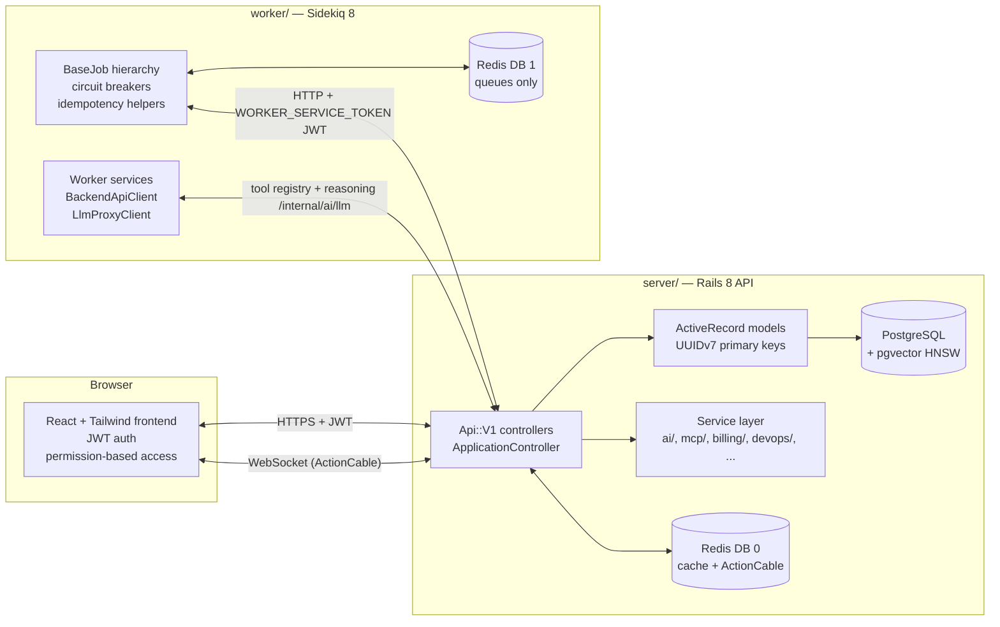
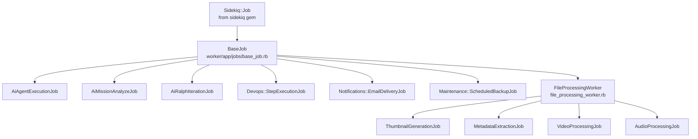
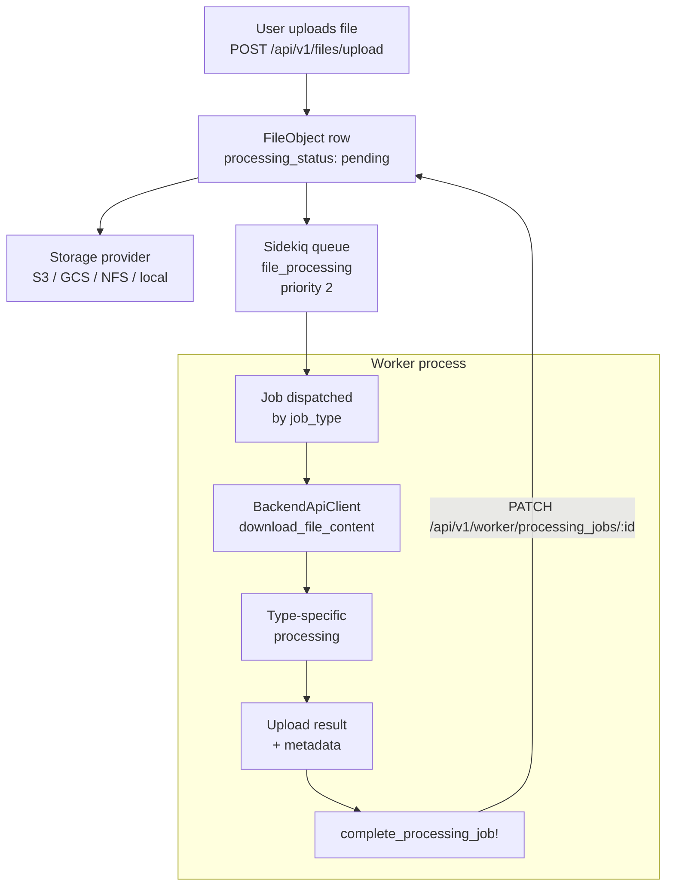
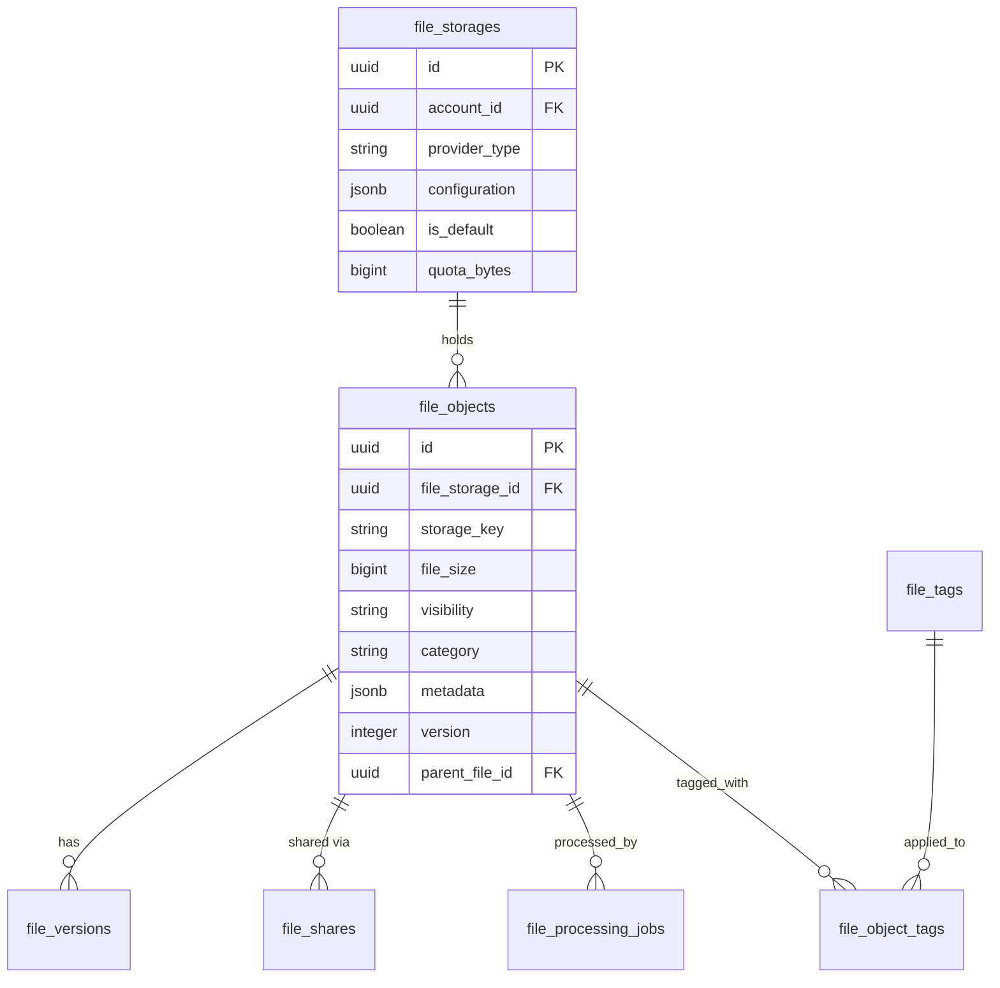

# Platform Architecture

> Status: active

> How the Rails API, Sidekiq worker, and React frontend compose into mission control for AI agent fleets.

## Table of Contents

- [What this concept covers](#what-this-concept-covers)
- [Three-process model](#three-process-model)
- [Backend service layer](#backend-service-layer)
- [Worker isolation](#worker-isolation)
- [File processing subsystem](#file-processing-subsystem)
- [File management subsystem](#file-management-subsystem)
- [Service patterns](#service-patterns)
- [Platform patterns](#platform-patterns)
- [Cross-cutting conventions](#cross-cutting-conventions)
- [Related concepts](#related-concepts)
- [Materials previously at](#materials-previously-at)

## What this concept covers

Powernode is a three-process platform: a Rails 8 API (`server/`), a standalone Sidekiq worker (`worker/`), and a React TypeScript frontend (`frontend/`). The two backend processes communicate exclusively over HTTP and a shared Redis instance — they share no database connections, no ActiveRecord models, and no gems. This isolation is the platform's most important architectural rule and the one most often violated in early contributions.

Around the three core processes orbit optional extensions, each a self-contained git submodule that mounts into the parent and can be disabled without affecting the core. The public extensions are `extensions/system`, `extensions/supply-chain`, and `extensions/marketing` — mirrored on GitHub and listed in `.gitmodules`; the private commercial extension `extensions/private/business` is remote-only. The core platform itself runs in **core mode** — single-user self-hosted with all core features unlocked — when `business` is absent; extensions add node lifecycle management, supply-chain workflows, content marketing, or multi-tenant billing respectively.

This document is the canonical reference for how the processes relate, where services live, what conventions controllers and jobs must follow, and how files flow between user uploads and the worker.

## Three-process model



**Critical rules** (apply to every contributor):

| Rule | Reason |
|------|--------|
| Job files live in `worker/app/jobs/` — never `server/app/jobs/` | The server is API-only; it does not run Sidekiq |
| Worker uses HTTP only — no `ActiveRecord`, no direct SQL | The worker has no database connection; `BackendApiClient` is the only path |
| Server `Gemfile` excludes Sidekiq gems | Prevents accidental in-process job dispatch |
| Worker fixes never touch `server/` | And vice versa — bugs are localized to one process |

## Backend service layer

The Rails service layer is organized by domain under `server/app/services/`. The directory layout reflects the platform's capability surface; new services should fit into an existing namespace rather than creating new top-level directories.

### Top-level service namespaces

| Namespace | Responsibility |
|-----------|---------------|
| `ai/` | Agent orchestration, missions, autonomy, codebase intelligence, providers, knowledge, memory, RAG, skills, teams |
| `mcp/` | Model Context Protocol execution engine and tool registry |
| `devops/` | CI/CD pipelines, Git, deployment, container registry |
| `a2a/` | Agent-to-Agent protocol |
| `chat/` | Conversation management and platform adapters |
| `security/` | Authentication, encryption, security guardrails |
| `cost_optimization/` | Budget tracking, recommendations, provider optimization |
| `storage_providers/` | S3, GCS, NFS, SMB, local-disk backends |
| `provider_testing/` | Provider health checks and connection testing |
| `shared/` | Cross-cutting utilities including `FeatureGateService` |
| `billing/` | Subscription lifecycle, payments (business extension) |
| `baas/` | Billing-as-a-Service multi-tenant API (business extension) |
| `data_management/` | Data sanitization, retention, GDPR exports |
| `monitoring/` | Health monitoring and service status |
| `permissions/` | Permission management |
| `rate_limiting/` | Request rate limiting |
| `audit/` | Audit log services |
| `admin/` | Admin panel services (daily summaries, maintenance) |
| `accounts/` | Account management |
| `analytics/` | Analytics processing (business extension) |
| `notification_service.rb` | Notification delivery (single top-level file, not a namespace directory) |
| `marketplace/` | Marketplace services — community agents (business extension) |
| `system/` | System-level services (when system extension active) |

Live counts of services and models live in the auto-generated reference: see [`reference/auto/mcp-tools.md`](../reference/auto/mcp-tools.md) for the tool catalog and `cd server && rails stats` for service file counts.

### Notable service classes (entry points)

| Service | File | Purpose |
|---------|------|---------|
| `Ai::Agents::ExecutionService` | `ai/agents/execution_service.rb` | Primary agent execution orchestrator with provider selection, token tracking, streaming |
| `Ai::McpAgentExecutor` | `mcp_agent_executor.rb` | Executes agents through the MCP protocol |
| `Ai::ProviderLoadBalancerService` | `provider_load_balancer_service.rb` | Load balancing across providers with five strategies |
| `Ai::ProviderCircuitBreakerService` | `provider_circuit_breaker_service.rb` | Circuit breaker pattern for provider resilience |
| `Ai::Missions::OrchestratorService` | `ai/missions/orchestrator_service.rb` | Mission lifecycle, phase dispatch, approval handling |
| `Ai::Ralph::ExecutionService` | `ai/ralph/execution_service.rb` | Recursive agentic task execution from PRDs |
| `Ai::CodeFactory::OrchestratorService` | `ai/code_factory/orchestrator_service.rb` | Risk-aware code review pipeline |
| `Ai::ModelRouterService` | `ai/model_router_service.rb` | Intelligent provider routing with multi-dimensional scoring |

See [`concepts/agents-and-autonomy.md`](./agents-and-autonomy.md) for the orchestration concepts these services implement.

## Worker isolation

The worker is a Sidekiq 8 process with zero direct database access — every data operation goes through the Rails API. The isolation provides three benefits: crashes in job processing cannot corrupt the database, the worker can scale independently of the API, and the API surface itself becomes the contract that gates every state mutation.

### Job hierarchy



### BaseJob features

Every worker job inherits from `BaseJob` and implements `execute(*args)`:

```ruby
class MyJob < BaseJob
  sidekiq_options queue: 'default', retry: 3

  def execute(*args)
    result = api_client.get("/api/v1/resource/#{args[0]}")
    api_client.post("/api/v1/resource", { data: result })
  end
end
```

`BaseJob` provides:

| Feature | Behavior |
|---------|---------|
| `api_client` | Pre-configured `BackendApiClient` with JWT auth |
| `logger` | Structured logging with metadata |
| Runaway loop detection | >5 executions/minute → job disabled for 5 minutes |
| Execution tracking | Records timing in Redis (last 20 per job) |
| Exponential backoff | API errors: 30s/60s/180s; other: `count^4 + 15 + random` |
| Idempotency helpers | `already_processed?(key)` / `mark_processed(key)` |
| Metrics tracking | `increment_counter()`, `track_performance_metric()` |
| API retry wrapper | `with_api_retry(max_attempts: 3)` |

Retryable HTTP status codes: `408, 429, 500, 502, 503, 504`.

### API clients

The worker authenticates with the server using JWTs signed by `WORKER_SERVICE_TOKEN`. Four client classes specialize on different surfaces:

| Client | Purpose |
|--------|---------|
| `BackendApiClient` | Primary CRUD client — accounts, subscriptions, analytics, AI, DevOps |
| `WebAuthApiClient` | Sidekiq Web UI authentication (isolated circuit breaker) |
| `LlmProxyClient` | Calls LLM providers **directly** for completions/structured output (`complete`, `complete_with_tools`, `complete_structured`); only `tool_definitions`, `dispatch_tool`, and `execute_with_reasoning` (reasoning orchestration) route through the server's `internal/ai/llm` endpoints |

Two auth helpers distinguish normal worker calls from elevated system operations: `PrimaryServiceAuth` (worker → server) and `SystemWorkerAuth` (system-level).

### Circuit breakers

| Circuit | Timeout | Use Case |
|---------|---------|----------|
| Backend API | 120s | Standard server communication |
| AI Provider | 600s | AI model calls (long-running) |
| Mission Execution | 600s | Mission phase jobs |
| Web Auth | Separate | Sidekiq Web (isolated from job processing) |

### Scheduled work

The worker uses `sidekiq-scheduler` (config: `worker/config/sidekiq.yml`). Schedules are grouped by cadence:

- Every minute: Docker host sync, swarm cluster sync
- Every 5–10 minutes: health checks (Docker, Swarm, Git runner, AI providers)
- Hourly: DevOps approval expiry, AI proposal expiry, AI budget rollover
- Every 6 hours: AI provider model sync, account termination, chat session cleanup
- Daily 1–5 AM: pricing sync, trust decay, backup, retention enforcement, memory pool cleanup, compound-learning maintenance, memory maintenance, shared-knowledge maintenance, skill lifecycle, knowledge graph maintenance, event cleanup, knowledge doc sync
- Weekly (Sunday) / Monthly (1st): backup schema sync, skill lifecycle weekly/monthly passes

## File processing subsystem

> **Status: not yet implemented** — Today only the server-side dispatch (`FileStorageService` building job-class name strings) and the worker's `FileProcessing::VirusScanJob` exist. The `ThumbnailGenerationJob`, `MetadataExtractionJob`, `VideoProcessingJob`, `AudioProcessingJob`, and the `FileProcessingWorker` base class described below are **not yet built** in the worker — the dispatch contract is in place but has no executor for these types. The section below documents the planned design.

The file processing pipeline is a worker subsystem that handles thumbnail generation, metadata extraction, and audio/video processing for user uploads. It illustrates how the worker boundary is enforced even for high-bandwidth binary data.



### Job types

| Job | Triggers For | Tooling |
|-----|--------------|---------|
| `ThumbnailGenerationJob` | JPEG/PNG/GIF/WebP/BMP/TIFF | `mini_magick` + ImageMagick — generates 150x150, 300x300, 600x600 |
| `MetadataExtractionJob` | Any file | `mini_exiftool` + ExifTool — dimensions, EXIF, document properties |
| `VideoProcessingJob` | MP4/AVI/MOV/MKV/WebM/FLV/WMV/M4V | `streamio-ffmpeg` + FFmpeg/FFprobe — duration, codec, poster frame |
| `AudioProcessingJob` | MP3/WAV/FLAC/AAC/OGG/M4A/WMA | `streamio-ffmpeg` + FFmpeg/FFprobe — duration, bitrate, channels |

### Required system binaries

```bash
sudo apt-get install imagemagick                  # ThumbnailGenerationJob
sudo apt-get install libimage-exiftool-perl       # MetadataExtractionJob (>= 7.65)
sudo apt-get install ffmpeg                       # VideoProcessingJob, AudioProcessingJob
```

### `FileProcessingWorker` base class

Subclasses receive helper methods for the common pipeline:

```ruby
download_file_content(file_object_id)              # → Tempfile
upload_processed_file(file_id, file_path, metadata)# Base64 encoded
update_file_metadata(file_id, metadata_updates)
update_file_processing_status(file_id, status)

load_processing_job(processing_job_id)
load_file_object(file_object_id)
start_processing_job!(processing_job_id)
complete_processing_job!(processing_job_id, result_data)
fail_processing_job!(processing_job_id, error, error_data)

with_working_directory { |dir| ... }
cleanup_temp_file(temp_file)
```

### Retry and failure handling

`file_processing` queue has priority 2 and `BaseJob`'s standard 3-attempt exponential backoff. After all retries exhausted, jobs move to the Sidekiq dead queue for manual review. Status flows are:

- `FileObject.processing_status`: `pending → processing → completed | failed`
- `FileProcessingJob.status`: `pending → processing → completed | failed`

## File management subsystem

The file management subsystem provides universal storage across multiple providers with versioning, sharing, tagging, and lifecycle controls. Storage providers implement a common `StorageProviders::Base` interface.

### Supported backends

| Backend | Class | Notable Features |
|---------|-------|------------------|
| Local filesystem | `StorageProviders::LocalStorage` | Configurable root path, automatic directory layout |
| AWS S3 | `StorageProviders::S3Storage` | Multipart uploads, presigned URLs, server-side encryption, CDN integration |
| Google Cloud Storage | `StorageProviders::GcsStorage` | Similar to S3 with GCP credential handling |
| Azure Blob | `StorageProviders::AzureStorage` | Container-scoped with account key auth |

### Data model (key tables)



Sensitive storage credentials are encrypted with `Security::CredentialEncryptionService`; credentials marked with the `encrypted:` prefix are auto-decrypted on provider instantiation.

### `FileStorageService` interface

```ruby
service = FileStorageService.new(account, storage_config: storage)

file_object = service.upload_file(file, filename:, content_type:, category:,
                                  visibility:, metadata:, processing_tasks: [...])
content = service.download_file(file_object)
service.stream_file(file_object) { |chunk| ... }
service.delete_file(file_object, permanent: false)
new_version = service.create_version(file_object, data, created_by_user:, change_description:)
share = service.create_share(file_object, created_by_id:, expires_at:, max_downloads:, password:)
url = service.share_url(share)
service.add_tags(file_object, ["important", "project-alpha"])
url = service.file_url(file_object, signed: true, expires_in: 1.hour)
```

### File permissions

| Permission | Scope |
|------------|-------|
| `files.read` / `create` / `update` / `delete` / `download` / `share` / `version` / `tag` | User-facing operations |
| `storage.read` / `create` / `update` / `delete` / `test` | Storage backend configuration |
| `admin.files.*` | Cross-account admin operations (read, manage, delete, recover, audit) |
| `admin.storage.*` | Cross-account storage admin (read, create, edit, delete, manage_quota, health) |

## Service patterns

### Standard service structure

```ruby
# frozen_string_literal: true

class DomainName::ServiceName
  def initialize(required_dependency:, optional_dependency: nil)
    @required_dependency = required_dependency
    @optional_dependency = optional_dependency
    @logger = Rails.logger
  end

  def primary_action(params)
    validate_params!(params)
    result = perform_action(params)
    { success: true, data: result }
  rescue StandardError => e
    @logger.error "#{self.class.name} error: #{e.message}"
    { success: false, error: e.message }
  end

  private

  def validate_params!(params)
    raise ArgumentError, "Required param missing" unless params[:required]
  end

  def perform_action(params)
    # Implementation
  end
end
```

### Return value convention

```ruby
# Success
{ success: true, data: result_data }
{ success: true, data: result_data, meta: { pagination: ... } }

# Failure
{ success: false, error: "Error message" }
{ success: false, errors: ["Error 1", "Error 2"] }
```

### Service concerns

| Concern | Purpose |
|---------|---------|
| `AgentBackedService` | Adds AI agent backing to a service class |
| `AiMonitoringConcern` | AI monitoring helpers |
| `BaseAiService` | Base AI service functionality |
| `CircuitBreakerCore` | Circuit breaker implementation |
| `Ai::ToolCallExtraction` | Extract structured tool calls from LLM output |
| `Ai::LlmCallable` | Mixin for services that call LLM providers |

### Service best practices

1. **Single responsibility.** `PaymentProcessingService` handles payments; not user profiles, not preferences.
2. **Dependency injection.** Take collaborators in `initialize`; default them only if cheap to construct.
3. **Graceful error handling.** Catch domain-specific errors first, log unexpected ones, return structured failure hashes.
4. **Log appropriately.** `Rails.logger.info` for milestones, `.debug` for params, `.warn` for thresholds, `.error` for failures.
5. **Use transactions.** Wrap multi-row writes in `ActiveRecord::Base.transaction`.

## Platform patterns

These conventions are normative — every contribution must follow them. Pattern compliance was measured at 95%+ across the codebase as of the most recent audit; the goal is to maintain that ratio.

### Controller pattern

```ruby
class Api::V1::UsersController < ApplicationController
  include UserSerialization

  before_action :set_user, only: [:show, :update, :destroy]
  before_action -> { require_permission('admin.user.view') }, only: [:index, :stats]

  def index
    render_success(data: users.map { |user| user_data(user) })
  end
end
```

**Required elements:**

- Namespace: `Api::V1` for all API controllers
- Inheritance: `ApplicationController` base class
- Concerns: factor reusable serialization, query, and authorization logic into includes
- Permission checks: lambda-based `require_permission('...')` in `before_action`
- Response helpers: MANDATORY `render_success(data:)` and `render_error(message:, status:)`
- Status codes: semantic HTTP statuses (`:ok`, `:created`, `:unprocessable_content`, `:forbidden`, ...)
- Controller size: stay under 300 lines — extract query logic to services, serialization to concerns

### Model pattern

Models are organized in a consistent order so reviewers can scan unfamiliar classes quickly:

```ruby
class User < ApplicationRecord
  # 1. Authentication
  has_secure_password

  # 2. Concerns
  include PasswordSecurity

  # 3. Associations
  belongs_to :account
  has_many :user_roles, dependent: :destroy
  has_many :roles, through: :user_roles

  # 4. Validations
  validates :email, presence: true, format: { with: URI::MailTo::EMAIL_REGEXP }
  validates :status, inclusion: { in: %w[active inactive suspended] }

  # 5. Scopes
  scope :active, -> { where(status: 'active') }

  # 6. Callbacks
  before_create :set_defaults

  # 7. Public Methods
  def full_name
    "#{first_name} #{last_name}"
  end

  # 8. Private Methods
  private

  def set_defaults
    # ...
  end
end
```

Section order: **Authentication → Concerns → Associations → Validations → Scopes → Callbacks → Methods → Private**.

### Frontend component architecture

```
src/features/[domain]/
├── components/     # Feature-specific components
├── hooks/          # Custom hooks
├── services/       # API services
├── types/          # TypeScript definitions
└── utils/          # Utility functions
```

**Component conventions:**

- TypeScript interfaces with proper prop typing — never `any`
- `forwardRef` for DOM-attached components
- Default props with sensible defaults
- Theme classes only: `bg-theme-*`, `text-theme-*`, `btn-theme` — see [reference/theme-system.md](../reference/theme-system.md)
- Flat navigation structure (no submenus)
- All actions live in `PageContainer`, not in page content
- Global notifications only (no local success/error UI)
- Imports via path aliases for cross-feature: `@/shared/`, `@/features/`
- Logging via `import { logger } from '@/shared/utils/logger'` — never `console.log` in production

### API service pattern

```typescript
const api: AxiosInstance = axios.create({
  baseURL: getAPIBaseURL(),
  timeout: 10000,
});

export const usersApi = {
  getUsers: async () => {
    const response = await api.get('/users');
    return response.data;
  },
  createUser: async (userData: CreateUserData) => {
    const response = await api.post('/users', userData);
    return response.data;
  }
};
```

**Service conventions:**

- Axios-based HTTP client with dynamic backend URL resolution
- Centralized error interceptors handle 401 token refresh
- Full TypeScript type safety end-to-end
- Consistent `{ success, data, error }` response shape

### Worker job pattern

```ruby
class SubscriptionRenewalJob < BaseJob
  sidekiq_options queue: 'billing'

  def execute(subscription_id)
    api_client.renew_subscription(subscription_id)
  end
end
```

**Worker conventions:**

- All jobs inherit `BaseJob`
- Use `execute(*args)`, never override `perform`
- API communication only — no direct database access
- Configure queue per workload type
- Set `sidekiq_options retry:` explicitly when default of 3 is wrong

### Configuration management

| Layer | Source |
|-------|--------|
| Backend | `Rails.application.credentials` for secrets, environment for endpoint URLs |
| Worker | Environment variables (`WORKER_SERVICE_TOKEN`, `BACKEND_API_URL`, `REDIS_URL`) |
| Frontend | Build-time `import.meta.env.VITE_*` (Vite), with `REACT_APP_*` as a legacy fallback |

### Error handling

**Backend:**

```ruby
def render_validation_errors(exception)
  render json: {
    success: false,
    error: exception.message,
    details: exception.record.errors.full_messages
  }, status: :unprocessable_content
end
```

**Frontend:**

```typescript
try {
  const result = await api.post('/users', userData);
  showNotification('User created successfully', 'success');
} catch (error) {
  showNotification(error.response?.data?.error || 'Operation failed', 'error');
}
```

## Cross-cutting conventions

### Ruby file pragmas

Every `.rb` file starts with `# frozen_string_literal: true`.

### Logging

| Process | Logger |
|---------|--------|
| Rails server | `Rails.logger` — no `puts` or `print` |
| Worker | `log_info`, `log_warn`, `log_error` helpers on `BaseJob` |
| Frontend | `import { logger } from '@/shared/utils/logger'` |

### Migrations

- `t.references` automatically creates an index — never add `add_index` for reference columns
- Customize via the declaration: `t.references :account, index: { unique: true }`
- All primary keys are UUIDv7 — see [`concepts/data-model.md`](./data-model.md)
- JSON columns must use lambda defaults: `attribute :config, :json, default: -> { {} }`

### Namespaced classes and foreign keys

Foreign key prefixes for namespaced models follow a strict convention:

| Namespace | FK Prefix | Example |
|-----------|-----------|---------|
| `Ai::` | `ai_` | `ai_agent_id`, `ai_provider_id` |
| `Devops::` | `devops_` | `devops_pipeline_id`, `devops_runner_id` |
| `BaaS::` | `baas_` | `baas_customer_id`, `baas_tenant_id` |

When declaring a `belongs_to` on a namespaced model, pair `class_name:` with `foreign_key:`:

```ruby
belongs_to :provider, class_name: "Ai::Provider", foreign_key: "ai_provider_id"
```

Always use the `::` separator in `class_name:` strings: `"Ai::AgentTeam"` not `"AiAgentTeam"`.

### Webhook receivers

Inbound webhook controllers MUST return `200` or `202` on processing errors. Returning `500` triggers provider retry storms.

### Eager loading

Always use `.includes()` when iterating associations. Never `.all.map`/`.each` over association accessors — that pattern guarantees an N+1.

### Seed verification

After modifying seed files, run `cd server && rails db:seed` and watch for association or validation errors. Seeds are part of the test substrate.

## Related concepts

- [`concepts/agents-and-autonomy.md`](./agents-and-autonomy.md) — what runs on top of this architecture
- [`concepts/data-model.md`](./data-model.md) — UUIDv7 and namespace details
- [`concepts/permissions.md`](./permissions.md) — `require_permission` / `has_permission?` semantics
- [`concepts/chat-and-realtime.md`](./chat-and-realtime.md) — ActionCable channel layout
- [`concepts/mcp-and-tools.md`](./mcp-and-tools.md) — how MCP tool calls land in services
- [`concepts/data-sources.md`](./data-sources.md) — the governed external-fetch subsystem (catalog, adapters/decoders, QueryService)
- [`reference/auto/mcp-tools.md`](../reference/auto/mcp-tools.md) — live MCP tool catalog
- [`reference/database-schema.md`](../reference/database-schema.md) — full table reference
- [`guides/backend.md`](../guides/backend.md) — backend implementation how-to
- [`guides/devops.md`](../guides/devops.md) — operating these processes in production

## Materials previously at

This concept consolidates content from:

- `docs/backend/BACKEND_SERVICE_ARCHITECTURE.md`
- `docs/worker/WORKER_ARCHITECTURE_OVERVIEW.md`
- `docs/worker/FILE_PROCESSING_ARCHITECTURE.md`
- `docs/platform/FILE_MANAGEMENT_SYSTEM.md`
- `docs/platform/PLATFORM_PATTERNS_AND_STANDARDS.md` (normative parts; residual content slated for archive)

_Last verified: 2026-06-04_
