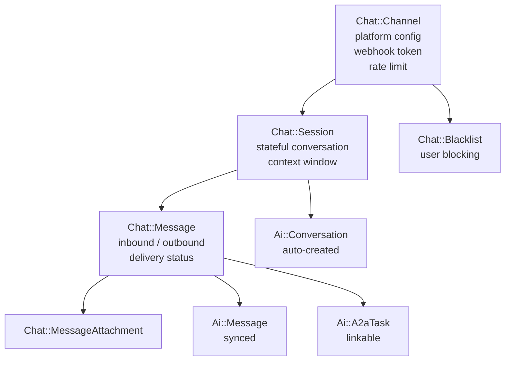
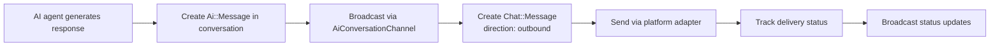
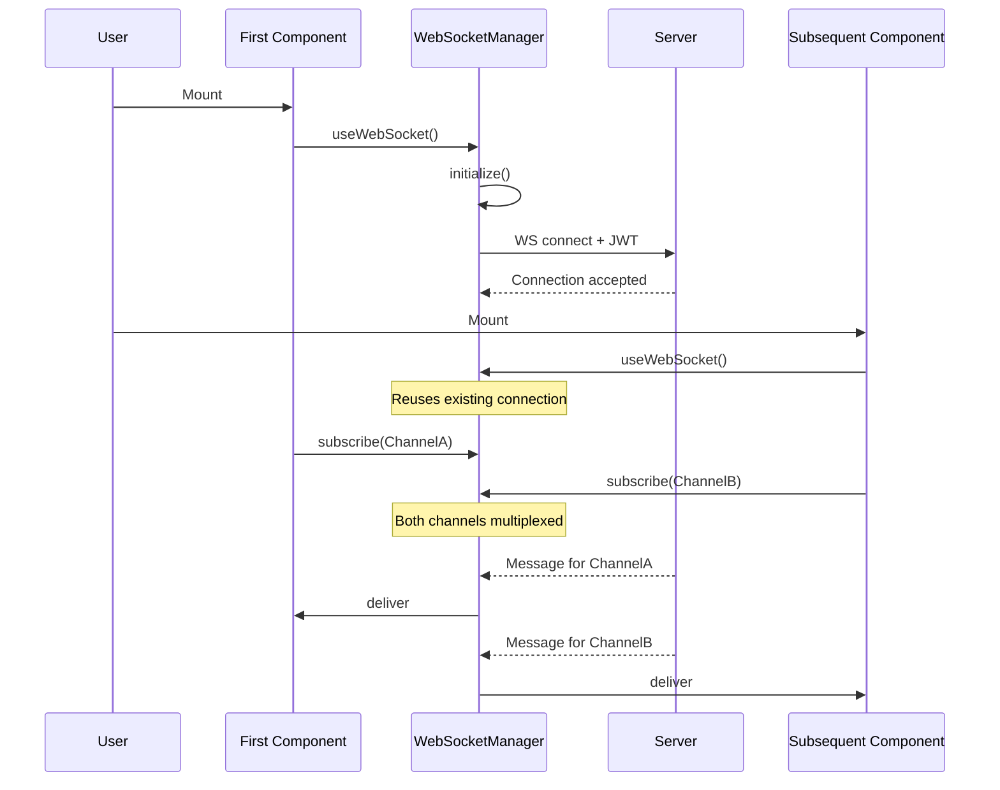
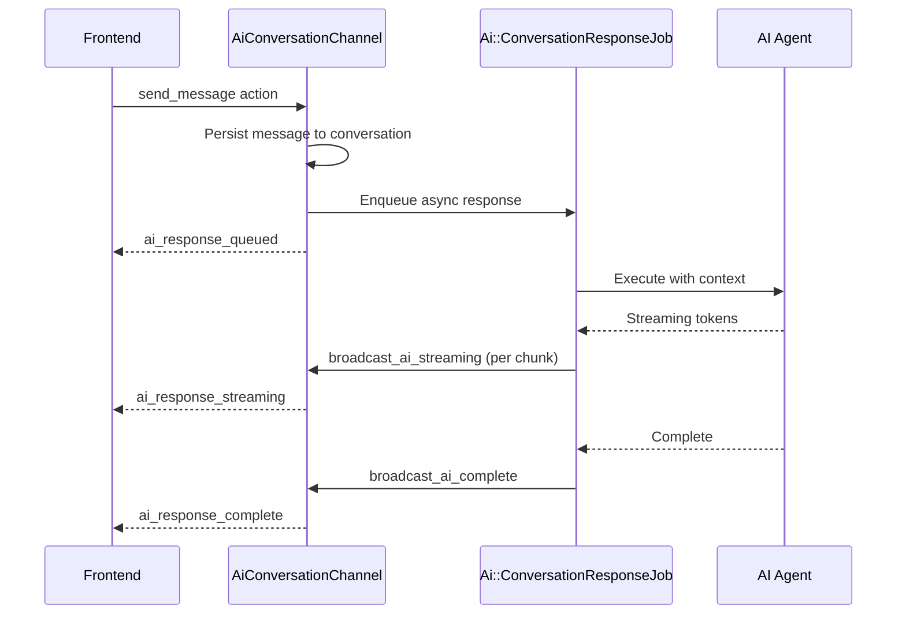

# Chat and Real-Time

> Multi-platform chat, the singleton WebSocket pattern, and the ActionCable channel layout.

## Table of Contents

- [What this concept covers](#what-this-concept-covers)
- [Chat system](#chat-system)
- [Real-time architecture](#real-time-architecture)
- [Singleton WebSocket pattern](#singleton-websocket-pattern)
- [ActionCable channel layout](#actioncable-channel-layout)
- [AiOrchestrationChannel deep dive](#aiorchestrationchannel-deep-dive)
- [AiConversationChannel deep dive](#aiconversationchannel-deep-dive)
- [Testing and debugging](#testing-and-debugging)
- [Troubleshooting](#troubleshooting)
- [Related concepts](#related-concepts)
- [Materials previously at](#materials-previously-at)

## What this concept covers

Powernode runs two intertwined real-time systems: a **multi-platform chat** that bridges external messaging platforms (WhatsApp, Telegram, Discord, Slack, Mattermost) to AI agents, and an **ActionCable layer** that pushes execution updates from missions, Ralph Loops, workflows, agents, and pipelines to the React frontend.

The chat system is operator-facing: messages flow inbound through platform webhooks, get sanitized and routed to AI agents, then flow outbound back to the platform with delivery tracking. The ActionCable layer is engineer-facing: every long-running operation broadcasts status changes, progress updates, streaming tokens, and completion events.

Both share a singleton WebSocket connection on the frontend — one connection per logged-in user, all channels multiplexed — which cut frontend WebSocket overhead by 70–80% when the consolidation landed. This document covers both surfaces and the connection pattern that makes them efficient.

A summary of every channel appears below; the exhaustive per-channel reference (every subscription param, every event, every payload shape) lives at [`reference/api/websocket.md`](../reference/api/websocket.md).

## Chat system

The chat system bridges external messaging platforms with Powernode's AI agents:

- **Multi-platform support** — Unified chat across 5 platforms (WhatsApp, Telegram, Discord, Slack, Mattermost)
- **AI agent routing** — Automatic routing to appropriate AI agents
- **Real-time messaging** — WebSocket communication via ActionCable
- **Session management** — Stateful conversations with context windows
- **Content moderation** — Blacklisting, rate limiting, prompt injection protection
- **A2A integration** — Chat messages bridge to the Agent-to-Agent task system

### Models (`server/app/models/chat/`)



#### `Chat::Channel`

Multi-platform messaging channel configuration.

**Platforms:** `whatsapp`, `telegram`, `discord`, `slack`, `mattermost`
**Statuses:** `connected`, `disconnected`, `connecting`, `error`

Features:

- Default AI agent assignment per channel
- Team channel bridging (`ai_team_channel_id`)
- Webhook-based message ingestion with unique tokens
- Rate limiting (configurable per minute, max 1000)
- Platform-specific configuration (JSON)
- Per-channel and account-wide blacklisting
- Vault credential integration for platform API keys
- Real-time status change broadcasting

#### `Chat::Session`

Stateful conversation session between a platform user and an AI agent.

**Statuses:** `active`, `idle`, `closed`, `blocked`

Features:

- Context window management (max 50 messages)
- Automatic AI conversation creation on session start
- Agent assignment with handoff tracking
- Human escalation support
- Prompt injection sanitization on inbound messages
- Activity-based status transitions (idle detection)
- A2A task integration

**Session lifecycle:**

1. Platform user sends first message → Session created
2. AI conversation auto-created and linked
3. Default agent assigned from channel config
4. Context window builds as messages flow
5. Agent handoff possible via `transfer_to_agent!`
6. Session auto-idles after inactivity
7. Session closes when conversation ends

#### `Chat::Message`

Individual messages within a session.

| Field | Values |
|-------|--------|
| `direction` | `inbound` (from platform user), `outbound` (from AI/system) |
| `message_type` | `text`, `image`, `audio`, `video`, `document`, `location`, `sticker` |
| `delivery_status` | `pending`, `sent`, `delivered`, `read`, `failed` |

Features:

- Automatic sync to linked AI conversation
- Delivery status tracking with timestamps
- Media attachment support
- Voice message transcription
- A2A message format conversion (`to_a2a_message`)
- Platform metadata preservation
- Real-time delivery status broadcasting

### Controllers (`server/app/controllers/api/v1/chat/`)

| Controller | Actions |
|-----------|---------|
| `ChannelsController` | CRUD + connect, disconnect, test, metrics, platforms, cleanup |
| `SessionsController` | CRUD + transfer, close, messages, active sessions, stats |
| `WebhooksController` | Inbound webhook receiver + platform verification |

**Webhook verification** handles platform-specific handshake protocols:

- **Discord** — PING/PONG verification
- **Slack** — URL challenge verification
- **WhatsApp** — Token verification endpoint

### Services (`server/app/services/chat/`)

| Service | Purpose |
|---------|---------|
| Gateway | Stateless, per-request gateway adapter pattern — each inbound webhook normalizes through a platform-specific adapter |
| Platform adapters | Platform-specific message handling for each of the 5 supported platforms (`server/app/services/chat/adapters/`) |

### Message flow

**Inbound (Platform → Powernode):**

```mermaid
flowchart LR
    A[Platform webhook]
    B[WebhooksController]
    C[Validate token]
    D[Check blacklist]
    E[Check rate limit]
    F[Find/create session]
    G[Create Chat::Message<br/>direction: inbound]
    H[Sanitize content]
    I[Sync to AI conversation]
    J[Trigger AI agent response]
    K[Broadcast via ActionCable]

    A --> B --> C --> D --> E --> F --> G --> H --> I --> J --> K
```



**Outbound (Powernode → Platform):**



### Security

#### Prompt injection protection

Inbound messages are sanitized before AI processing:

1. Dangerous control patterns stripped (`[SYSTEM]`, `[INSTRUCTION]`, `[IGNORE]`)
2. Content wrapped in safe delimiters:

   ```
   [USER_MESSAGE_START]
   <user content>
   [USER_MESSAGE_END]
   ```

3. Original content preserved in `content` field
4. Sanitized version stored in `sanitized_content`

#### Rate limiting

Per-channel rate limiting using Redis-backed counters:

- Configurable `rate_limit_per_minute` (1–1000)
- 1-minute sliding window via Rails cache
- Requests rejected with appropriate error when exceeded

#### Blacklisting

Two-tier system:

| Tier | Scope |
|------|-------|
| Channel-level | Block user on specific channel |
| Account-level | Block user across all channels |

Optional expiration for temporary bans.

#### Authentication

| Endpoint type | Auth |
|---------------|------|
| Webhook endpoints | Unique `webhook_token` per channel |
| WebSocket connections | JWT token |
| API endpoints | Standard bearer token |

## Real-time architecture

The Powernode frontend uses a **singleton WebSocket connection pattern** — one WebSocket connection per logged-in user, shared across all components. This reduces resource usage by 70–80% versus per-component connections and improves reliability through centralized reconnection.

### Core components

1. **WebSocketManager** (`frontend/src/shared/services/WebSocketManager.ts`)
   - Singleton service managing the WebSocket connection
   - Handles connection lifecycle (connect, disconnect, reconnect)
   - Routes messages to appropriate subscribers
   - Cross-tab message synchronization via BroadcastChannel API

2. **useWebSocket Hook** (`frontend/src/shared/hooks/useWebSocket.ts`)
   - React hook providing WebSocket functionality
   - Uses WebSocketManager singleton internally
   - 100% backward compatible API

3. **Specialized hooks** (all use `useWebSocket` internally)
   - `useSubscriptionWebSocket` — Subscription management
   - `useCustomerWebSocket` — Customer channel
   - `useAnalyticsWebSocket` — Analytics events
   - `useSettingsWebSocket` — Settings updates
   - `useWorkflowExecution` — Workflow execution updates
   - `useConversationSocket` — Chat conversation streaming

### Performance impact

| Metric | Before | After | Improvement |
|--------|--------|-------|-------------|
| Connections per user | 3–5 | 1 | 70–80% reduction |
| Memory per user | 6–10 MB | 2 MB | 70% reduction |
| Backend connections (500 users) | 1,500–2,500 | 500 | 75% reduction |

## Singleton WebSocket pattern

### Connection flow



### Basic usage

```typescript
import { useWebSocket } from '@/shared/hooks/useWebSocket';

function MyComponent() {
  const { isConnected, subscribe, sendMessage } = useWebSocket();

  useEffect(() => {
    const unsubscribe = subscribe({
      channel: 'MyChannel',
      params: { user_id: userId },
      onMessage: (data) => {
        console.log('Received:', data);
      },
      onError: (error) => {
        console.error('Channel error:', error);
      }
    });

    return unsubscribe;
  }, [subscribe]);

  return <div>Status: {isConnected ? 'Connected' : 'Disconnected'}</div>;
}
```

### Subscription management

```typescript
// Internal structure
subscriptions: Map<string, Set<ChannelSubscription>>

// Key format: "channel::params"
// Example: "CustomerChannel::{"user_id":"123"}"
```

Multiple components can subscribe to the same channel; each receives the same messages.

### Connection lifecycle

**Initialization:**

- First component calls `wsManager.initialize(config)`
- Manager creates WebSocket connection
- Manager stores config for reconnections

**Reconnection:**

- Automatic exponential backoff (1s, 2s, 4s, 8s, ...)
- Maximum 10 reconnection attempts
- Resubscribes to all channels on reconnect

**Token refresh:**

- Manager detects 401 response
- Triggers token refresh via Redux
- Reconnects with new token (transparent to components)

**Cleanup:**

- User logs out → Manager calls `disconnect()`
- Closes connection cleanly
- Clears all subscriptions

## ActionCable channel layout

The platform exposes 17 ActionCable channels. The summary table below covers subscription params and purpose; full per-channel detail (every event name, every payload shape, every authorization rule) is in [`reference/api/websocket.md`](../reference/api/websocket.md).

| Channel | Subscription Params | Purpose |
|---------|---------------------|---------|
| `AiAgentExecutionChannel` | `execution_id` | Agent execution monitoring |
| `AiConversationChannel` | `conversation_id` | AI chat messaging |
| `AiOrchestrationChannel` | `type`, `id` | Unified AI orchestration |
| `AiStreamingChannel` | `execution_id` / `conversation_id` | Token streaming |
| `AiWorkflowMonitoringChannel` | `workflow_id` | Workflow analytics |
| `AiWorkflowOrchestrationChannel` | — | Account workflow events |
| `AnalyticsChannel` | `account_id` | Real-time analytics |
| `CodeFactoryChannel` | `type`, `id` | Code Factory updates |
| `CustomerChannel` | `account_id` | Customer data (admin) |
| `DevopsPipelineChannel` | `account_id`, `pipeline_id` | CI/CD pipeline status |
| `GitJobLogsChannel` | `repository_id`, `pipeline_id`, `job_id` | Live log streaming |
| `McpChannel` | — | MCP protocol transport |
| `MissionChannel` | `type`, `id` | Mission progress |
| `NotificationChannel` | `account_id` | Notifications |
| `SubscriptionChannel` | `account_id` | Subscription changes |
| `TeamChannelChannel` | `channel_id` | Team messaging |
| `TeamExecutionChannel` | `team_id` | Team execution monitoring |

## AiOrchestrationChannel deep dive

This is the most heavily used channel — it broadcasts a unified stream covering executions, Ralph Loops, worktree sessions, circuit breakers, monitoring alerts, and system health.

### Subscription types

The channel accepts a `type` param identifying the subscription scope:

| Type | Resource Scoped To |
|------|---------------------|
| `account` | All events for an account |
| `agent` | Per-agent execution lifecycle |
| `monitoring` | Health and metric updates |
| `system` | System-level health events |
| `circuit_breaker` | Circuit breaker state changes |
| `ralph_loop` | Per-Ralph-Loop events |
| `worktree_session` | Per-worktree session events |
| `workflow` | Workflow-level events |
| `workflow_run` | Run-level events |

### Multi-stream broadcasting

Single events broadcast to multiple stream levels so all UI components receive updates:

1. `ai_orchestration:workflow_run:{run_id}` — Run-specific updates
2. `ai_orchestration:workflow:{workflow_id}` — Workflow-level updates
3. `ai_orchestration:account:{account_id}` — Account-wide monitoring

### Event types

**Workflow lifecycle:**

```
workflow.run.created
workflow.run.status.changed
workflow.run.completed
workflow.node.execution.updated
```

**Mission lifecycle (`MissionChannel`):**

- `status_changed`
- `phase_changed`
- `approval_required`
- `approval_resolved`
- `error`

**Agent execution:**

- `agent.created` / `agent.updated` / `agent.deleted`
- `agent.execution.started`
- `agent.execution.completed`
- `agent.execution.failed`

**Ralph Loop:**

- `ralph_loop.started`
- `ralph_loop.progress`
- `ralph_loop.iteration_completed`
- `ralph_loop.task_status_changed`
- `ralph_loop.learning_added`
- `ralph_loop.completed` / `failed` / `paused` / `cancelled`

**Circuit breaker:**

- `circuit_breaker.state_changed`
- `circuit_breaker.opened` / `closed` / `half_opened`
- `circuit_breaker.failure` / `success` / `reset`

**Monitoring and system:**

- `monitoring.alert.triggered`
- `monitoring.metrics.updated`
- `system.health.changed`

**Worktree sessions (Code Factory / Ralph):**

- `worktree_session.status_changed` / `provisioning` / `active` / `merging` / `completed` / `failed` / `cancelled` / `conflicts_detected`
- `worktree.created` / `ready` / `task_started` / `completed` / `failed`
- `merge.started` / `completed` / `conflict` / `resolved` / `failed`

### Unified message format

```json
{
  "event": "workflow.run.status.changed",
  "resource_type": "workflow_run",
  "resource_id": "run-id",
  "payload": {
    "workflow_run": { "..." : "..." },
    "workflow_stats": { "..." : "..." }
  },
  "timestamp": "2025-10-11T21:07:00Z"
}
```

### Node execution update example

```json
{
  "event": "workflow.node.execution.updated",
  "resource_type": "node_execution",
  "resource_id": "execution-id",
  "payload": {
    "id": "execution-id",
    "execution_id": "execution-id",
    "status": "completed",
    "node_name": "Start",
    "node_type": "start",
    "started_at": "2025-10-11T21:07:00Z",
    "completed_at": "2025-10-11T21:07:01Z",
    "duration_ms": 1000
  }
}
```

WebSocket payloads MUST match API response format exactly. Missing fields break frontend state management.

### Frontend integration

```typescript
// Workflow-level
subscribe({
  channel: 'AiOrchestrationChannel',
  params: { type: 'workflow', id: workflowId },
  onMessage: handleWorkflowUpdate
});

// Run-level
subscribe({
  channel: 'AiOrchestrationChannel',
  params: { type: 'workflow_run', id: runId },
  onMessage: handleRunUpdate
});
```

## AiConversationChannel deep dive

Primary WebSocket channel for AI conversation streaming.

**Subscription:** `{ conversation_id: <id> }`

**Inbound actions:**

| Action | Payload | Behavior |
|--------|---------|----------|
| `send_message` | `{ content }` | User sends a message |
| `typing_indicator` | `{ status }` | User typing status |

**Broadcast events:**

| Event | Description |
|-------|-------------|
| `subscription.confirmed` | Successfully subscribed to conversation |
| `message_created` | New message added to conversation |
| `ai_response_streaming` | AI response being streamed |
| `ai_response_complete` | AI response finished |
| `message_updated` | Message content/metadata changed |
| `ai_response_queued` | AI response job queued |
| `typing_indicator` | User typing status change |
| `error` | Error notification |

### Message serialization

The channel translates backend model format to frontend-compatible format:

- `role` → `sender_type` mapping: `user` → `user`, `assistant` → `ai`, `system` → `system`
- Per-message agent attribution (message's agent, then conversation's agent)
- Token/cost metadata inclusion
- Action context from `content_metadata` (concierge actions, mentions)

### Authorization

Users can only subscribe to conversations they have access to (checked via `can_access?` or account matching).

### AI response flow



### Frontend chat components

The frontend chat interface is built as part of the AI feature module.

**`ChatWindowReducer`** — manages window state with modes:

| Mode | Behavior |
|------|----------|
| `closed` | Chat hidden |
| `floating` | Floating overlay window |
| `maximized` | Full-screen chat |
| `detached` | Separate browser window |

**`ConversationSidebar`** — Resizable (200–400px) with sections:

- Channels, Workspaces, Pinned, Recent conversations

**`ChannelConversationComponent`** — Renders 10+ message types including standard text/media, `task_assignment`, `synthesis`, `escalation`, system messages.

**Concierge mode** — AI-driven concierge actions with embedded action context in messages. See [`concepts/agents-and-autonomy.md`](./agents-and-autonomy.md) for the concierge routing system.

**State persistence** — Window position, sidebar state, and section preferences persisted to `localStorage`.

### State management stack

| Layer | Purpose |
|-------|---------|
| React Query | Conversation list, message history fetching (`chatApi`) |
| WebSocket state | Real-time updates via `useConversationSocket` hook |
| Local context + reducer | Per-conversation UI state (`ChatWindowReducer`) |
| Optimistic rendering | Messages rendered immediately, replaced by server confirmation |

## Testing and debugging

### Backend monitoring

```bash
# Tail broadcast logs
journalctl -u powernode-backend@default -f | grep -E "Broadcasting|workflow.run|node.execution"
```

### Browser DevTools snippet

```javascript
// In DevTools console
console.log('Monitoring WebSocket...');
const original = WebSocket.prototype.onmessage;
WebSocket.prototype.onmessage = function(event) {
  try {
    const data = JSON.parse(event.data);
    if (data.message?.event) {
      console.log('event:', data.message.event, data.message.payload);
    }
  } catch(e) {}
  return original?.call(this, event);
};
```

### Workflow test expectations

When executing a workflow:

- New run appears immediately in history
- Status badges update: `pending` → `running` → `completed`
- Node badges change: pending → running → completed
- Progress bar fills as nodes complete

Expected console output:

```
WORKFLOW RUN UPDATE
  event: "workflow.run.status.changed"
  status: "running"
  progress: "0/5"

NODE EXECUTION UPDATE
  nodeId: "start_1"
  nodeName: "Start"
  status: "running"

NODE EXECUTION UPDATE
  nodeId: "start_1"
  status: "completed"
```

Expected backend logs:

```
[STATE_MACHINE] Broadcasting status change: pending -> initializing
[STATE_MACHINE] Broadcasting status change: initializing -> running
BROADCASTING STATUS CHANGE: [execution-id] pending -> running
Broadcasting node status change: [node-id] -> running (Start)
[ActionCable] Broadcasting to ai_orchestration:workflow_run:[id]
[ActionCable] Broadcasting to ai_orchestration:workflow:[id]
```

### Single-connection verification

```javascript
// In browser console BEFORE login
window.wsConnectionCount = 0;
const OriginalWebSocket = window.WebSocket;
window.WebSocket = function(...args) {
  window.wsConnectionCount++;
  console.log('WebSocket connection #' + window.wsConnectionCount);
  return new OriginalWebSocket(...args);
};

// Login and navigate — should only see 1 connection
```

## Troubleshooting

### Node badges not updating

1. **Check WebSocket connection** — `wsDebugSummary()` should show `Active Connections: 1` with status `OPEN`
2. **Verify subscription** — Look for `SUBSCRIPTION CONFIRMED`; channel must be `AiOrchestrationChannel`; params must include workflow ID
3. **Check backend broadcasts** — Logs should show `Broadcasting node status change`; if missing, check `ai_workflow_node_execution.rb` callbacks
4. **Verify frontend handler** — `WorkflowExecutionDetails.tsx` should handle `workflow.node.execution.updated`

### Execution history not updating

1. **Check workflow-level subscription** — Should use `{ type: 'workflow', id: workflowId }`, NOT `workflow_${id}` (old format)
2. **Verify broadcast stream** — Backend should broadcast to `ai_orchestration:workflow:[id]`

### Common issues

| Symptom | Likely Cause | Fix |
|---------|--------------|-----|
| No WebSocket messages | Not subscribed | Refresh page, check subscription |
| Broadcasts sent but not received | Wrong channel/params | Verify `AiOrchestrationChannel` |
| Node badges static | Missing `id` in payload | Check `serialize_node_execution` |
| History list static | Wrong subscription format | Use `AiOrchestrationChannel` |
| "Connection lost unexpectedly" | Network issue | Check backend, CORS errors |
| "Session expired" | Token refresh failed | Re-login |
| Messages not received | Wrong channel name | Verify matches backend |

### Critical insights

1. **Channel class requirement** — Clients MUST subscribe to actual channel classes (`AiOrchestrationChannel`), not arbitrary stream names
2. **Payload consistency** — WebSocket payloads MUST match API response format exactly
3. **Multi-stream strategy** — Broadcasting to multiple stream levels (run, workflow, account) ensures all UI components receive updates
4. **Event unification** — Consistent event names (`workflow.run.*`) reduces complexity
5. **Manual broadcast requirement** — When using `update_columns` to bypass callbacks, manual broadcasting is essential

## Related concepts

- [`concepts/agents-and-autonomy.md`](./agents-and-autonomy.md) — what generates events on these channels
- [`concepts/architecture.md`](./architecture.md) — process model and Redis layout
- [`concepts/mcp-and-tools.md`](./mcp-and-tools.md) — workflow engine that drives many of these events
- [`reference/api/websocket.md`](../reference/api/websocket.md) — full per-channel reference
- [`guides/frontend.md`](../guides/frontend.md) — frontend WebSocket integration patterns

## Materials previously at

This concept consolidates content from:

- `docs/platform/CHAT_SYSTEM_ARCHITECTURE.md`
- `docs/platform/WEBSOCKET_AND_REALTIME.md`
- `docs/platform/ACTIONCABLE_CHANNELS_REFERENCE.md` (summary only; full reference relocated to `reference/api/websocket.md`)

_Last verified: 2026-05-17_
