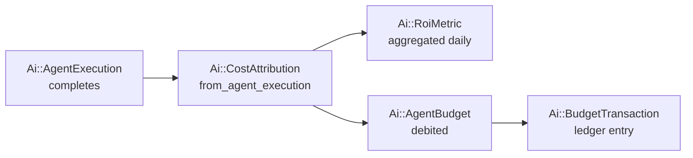
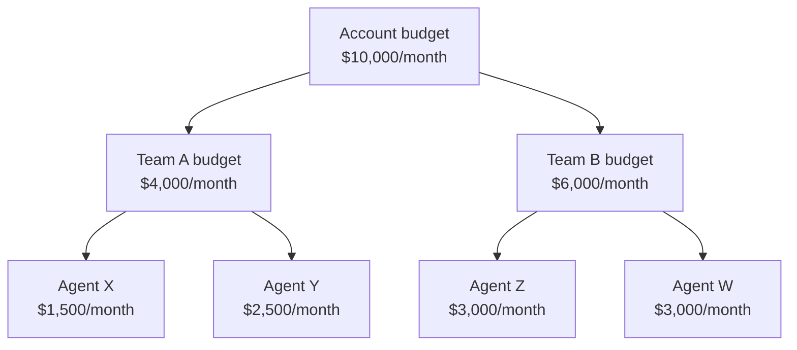
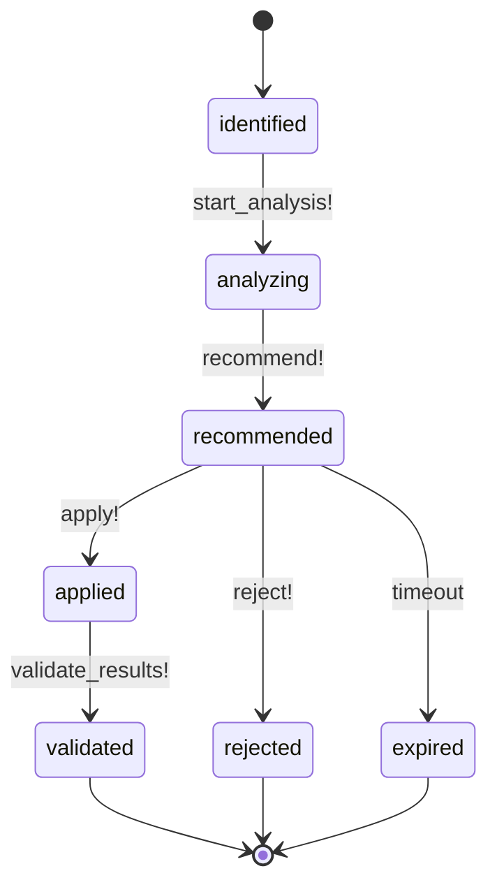
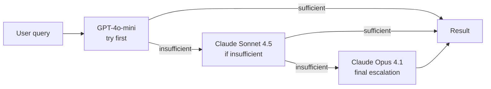

# Cost and FinOps

> AI cost tracking, hierarchical budgets with transaction locking, ROI metrics, provider pricing reference, and optimization automation.

## Table of Contents

- [What this concept covers](#what-this-concept-covers)
- [Cost attribution](#cost-attribution)
- [Budget management](#budget-management)
- [ROI metrics](#roi-metrics)
- [Cost optimization](#cost-optimization)
- [Provider pricing reference](#provider-pricing-reference)
- [Optimization strategies](#optimization-strategies)
- [Dashboard data](#dashboard-data)
- [Related concepts](#related-concepts)
- [Materials previously at](#materials-previously-at)

## What this concept covers

The Cost Attribution System provides comprehensive cost tracking, budget management, and optimization across the AI platform. Every LLM call, embedding request, and storage operation is attributed to a source (workflow, agent, provider, team, execution) and category (`ai_inference`, `embedding`, `storage`, ...). Budgets enforce ceilings with pessimistic locking so concurrent agent executions cannot race past their allocation. ROI metrics convert spending into business outcomes — time saved, value generated — so operators can decide whether autonomous work is paying off.

This document also covers provider pricing comparisons and proven cost-optimization strategies (model cascading, parallel execution, batch APIs, prompt caching). The routing logic that *chooses* which provider to use lives in [`concepts/agents-and-autonomy.md`](./agents-and-autonomy.md) — this doc focuses on what happens to the cost data after the call lands.

Pricing data drifts as providers publish new rates. The table here reflects a known-good snapshot; for current rates run `platform.get_api_reference` or check the provider's official pricing page. The list of supported providers and their capabilities is fixed in code; the *numbers* on each row are what change.

## Cost attribution

`Ai::CostAttribution` records cost for every AI operation with source and category breakdown.

```ruby
SOURCE_TYPES = %w[workflow agent provider team execution]
COST_CATEGORIES = %w[ai_inference ai_training embedding storage compute api_calls bandwidth other]

belongs_to :account
belongs_to :roi_metric, optional: true
belongs_to :provider, class_name: "Ai::Provider", optional: true
```

### Attribution flow



### Key methods

```ruby
# Create attribution from an execution record
Ai::CostAttribution.from_agent_execution(execution)

# Aggregations
Ai::CostAttribution.cost_breakdown_by_category
Ai::CostAttribution.cost_breakdown_by_source_type
Ai::CostAttribution.cost_breakdown_by_provider

# Trends
Ai::CostAttribution.daily_cost_trend(account, days)
Ai::CostAttribution.top_cost_sources(account, limit)

# Roll-up
Ai::CostAttribution.aggregate_to_roi_metrics(account, date:)
```

## Budget management

`Ai::AgentBudget` provides per-agent budgets with hierarchical allocation and period tracking. All mutation methods use pessimistic locking to prevent race conditions across concurrent executions.

```ruby
PERIOD_TYPES = %w[daily weekly monthly total]
CURRENCIES = %w[USD EUR GBP]
UTILIZATION_THRESHOLDS = { warning: 75, danger: 90, exhausted: 100 }

belongs_to :agent, class_name: "Ai::Agent"
belongs_to :parent_budget, optional: true
has_many :child_budgets
has_many :budget_transactions
```

### Budget operations (with pessimistic locking)

```ruby
budget.debit!(amount_cents, execution:, metadata:)        # Debit budget
budget.credit!(amount_cents, reason:, metadata:)          # Credit/refund
budget.reserve!(amount_cents, metadata:)                  # Reserve (pre-execution)
budget.spend!(amount_cents, execution:, metadata:)        # Spend from reserved
budget.release_reservation!(amount_cents, metadata:)      # Release unused reservation
budget.auto_rollover!                                      # Roll unused to next period
budget.allocate_child(agent:, amount_cents:, period_type:) # Create child budget
```

### Budget checks

```ruby
budget.remaining_cents               # Available
budget.utilization_percentage        # Used vs total
budget.over_budget?                  # Threshold check
budget.exceeded?
budget.nearly_exceeded?
```

### Threshold alerts

Automatically fires alerts at:

| Level | Utilization |
|-------|-------------|
| Warning | 75% |
| Danger | 90% |
| Exhausted | 100% |

### Hierarchical allocation



Child budgets cannot collectively exceed their parent's allocation.

### `Ai::BudgetTransaction`

Ledger of all budget operations:

```ruby
TRANSACTION_TYPES = %w[debit credit reservation release rollover adjustment]

# Scopes
scope :debits
scope :credits
scope :reservations
scope :releases
scope :rollovers
scope :for_period
scope :by_model
scope :by_provider
```

## ROI metrics

`Ai::RoiMetric` calculates return on investment per agent, workflow, team, or account.

```ruby
METRIC_TYPES = %w[workflow agent provider team account_total department]
PERIOD_TYPES = %w[daily weekly monthly quarterly yearly]
DEFAULT_HOURLY_RATE = 75.0  # USD for time savings calculation

belongs_to :attributable, polymorphic: true, optional: true
has_many :cost_attributions
```

### Key methods

```ruby
metric.calculate_roi
# (value_generated - total_cost) / total_cost × 100

metric.calculate_net_benefit
# value_generated - total_cost

metric.time_saved_monetary_value(hourly_rate: 75)
# Converts time savings to USD

metric.positive_roi?            # ROI > 0
metric.break_even_analysis      # Days/operations to break even
metric.efficiency_metrics       # Cost per operation, time saved per dollar
```

### Aggregations

```ruby
Ai::RoiMetric.calculate_for_account(account, period_type:, period_date:)
Ai::RoiMetric.roi_trends(account, days:)
Ai::RoiMetric.aggregate_for_period(account, period_type:, period_date:)
```

## Cost optimization

`Ai::CostOptimizationLog` tracks optimization opportunities through their lifecycle:

```ruby
OPTIMIZATION_TYPES = %w[provider_switch model_downgrade caching batching rate_optimization usage_reduction]
STATUSES = %w[identified analyzing recommended applied validated rejected expired]
```

### Lifecycle



### Opportunity identification

`Ai::CostOptimizationLog.identify_opportunities_for(account)` runs three checks:

1. **Provider opportunities** — Cheaper alternatives for current usage patterns
2. **Usage opportunities** — Reduce unnecessary operations (idle agents, redundant calls)
3. **Caching opportunities** — Similar repeated requests that could be cached

### `CostOptimizationService`

Comprehensive cost analysis composed of 6 modules:

```ruby
service = Ai::CostOptimizationService.new(account: account, time_range: 30.days)
```

| Module | Methods |
|--------|---------|
| `CostTracking` | `track_real_time_costs`, `start_cost_tracking`, `update_cost_tracking` |
| `CostAnalysis` | `cost_breakdown`, `analyze_cost_trends` |
| `BudgetManagement` | `budget_status`, `generate_budget_recommendations` |
| `ProviderOptimization` | `compare_providers`, `suggest_provider_actions` |
| `UsagePatterns` | Usage pattern analysis and anomaly detection |
| `Recommendations` | `generate_recommendations` (provider, model, caching, usage) |

## Provider pricing reference

The platform supports multiple AI providers with distinct pricing models. Rates are validated against official sources and exposed via `Ai::ModelPricing`. To create or update a model price programmatically:

```ruby
Ai::ModelPricing.create!(
  model_id: "claude-3-opus",
  provider_type: "anthropic",
  input_per_1k: 0.015,
  output_per_1k: 0.075,
  source: "manual"
)
```

### Snapshot pricing table

> This table is a known-good snapshot, not a live source. For current rates run `platform.get_api_reference` or check the provider's official pricing page (links at the bottom of this section).

Cost per 1K Tokens (Input / Output):

| Provider | Model | Input | Output | Use Case |
|----------|-------|-------|--------|----------|
| OpenAI | gpt-4o | $0.0025 | $0.0100 | Multi-modal, general purpose |
| OpenAI | gpt-4o-mini | $0.00015 | $0.00060 | Cost-effective, high volume |
| OpenAI | gpt-4-turbo | $0.0100 | $0.0300 | Large context, complex tasks |
| OpenAI | gpt-3.5-turbo | $0.00050 | $0.00150 | Simple tasks, high speed |
| OpenAI | o1-preview | $0.0150 | $0.0600 | Advanced reasoning |
| OpenAI | o1-mini | $0.00110 | $0.00440 | Reasoning, coding, STEM |
| Claude | Opus 4.1 | $0.0150 | $0.0750 | Complex workflows, multi-hour |
| Claude | Sonnet 4.5 | $0.0030 | $0.0150 | Best coding, complex agents |
| Claude | Haiku 4.5 | $0.0010 | $0.0050 | Fast, cost-effective |
| Claude | 3.5 Sonnet | $0.0030 | $0.0150 | Legacy support |
| Grok | grok-beta | $0.0050 | $0.0150 | Real-time data |
| Grok | grok-vision-beta | $0.0050 | $0.0150 | Vision + real-time |
| Ollama | All models | $0.0000 | $0.0000 | Self-hosted (free) |

### Comparison at scale

**Small request (1K input, 500 output tokens):**

| Provider | Model | Cost |
|----------|-------|------|
| Ollama | any | $0.0000 |
| OpenAI | gpt-4o-mini | $0.0004 |
| OpenAI | gpt-3.5-turbo | $0.0013 |
| OpenAI | o1-mini | $0.0033 |
| Claude | Haiku 4.5 | $0.0035 |
| OpenAI | gpt-4o | $0.0075 |
| Claude | Sonnet 4.5 | $0.0105 |
| Grok | grok-beta | $0.0125 |
| OpenAI | gpt-4-turbo | $0.0250 |
| OpenAI | o1-preview | $0.0450 |
| Claude | Opus 4.1 | $0.0525 |

**Medium request (10K input, 5K output tokens):**

| Provider | Model | Cost |
|----------|-------|------|
| Ollama | any | $0.00 |
| OpenAI | gpt-4o-mini | $0.0045 |
| OpenAI | gpt-3.5-turbo | $0.0125 |
| OpenAI | o1-mini | $0.033 |
| Claude | Haiku 4.5 | $0.035 |
| OpenAI | gpt-4o | $0.075 |
| Claude | Sonnet 4.5 | $0.105 |
| Grok | grok-beta | $0.125 |
| OpenAI | gpt-4-turbo | $0.25 |
| OpenAI | o1-preview | $0.45 |
| Claude | Opus 4.1 | $0.525 |

**Large request (100K input, 50K output tokens):**

| Provider | Model | Cost |
|----------|-------|------|
| Ollama | any | $0.00 |
| OpenAI | gpt-4o-mini | $0.04 |
| OpenAI | gpt-3.5-turbo | $0.13 |
| OpenAI | o1-mini | $0.33 |
| Claude | Haiku 4.5 | $0.35 |
| OpenAI | gpt-4o | $0.75 |
| Claude | Sonnet 4.5 | $1.05 |
| Grok | grok-beta | $1.25 |
| OpenAI | gpt-4-turbo | $2.50 |
| OpenAI | o1-preview | $4.50 |
| Claude | Opus 4.1 | $5.25 |

### Best value by use case

| Use Case | Recommended |
|----------|-------------|
| Most cost-effective overall | Ollama (free), then GPT-4o-mini, then GPT-3.5-turbo |
| Best coding | Claude Sonnet 4.5, GPT-4o, Ollama CodeLlama |
| Best complex reasoning | Claude Opus 4.1, OpenAI o1-preview, Claude Sonnet 4.5 |
| Best high volume | Ollama (free), GPT-4o-mini, Claude Haiku 4.5 |
| Best vision | GPT-4o, Claude Sonnet 4.5, Grok Vision Beta |
| Best real-time data | Grok Beta (others use knowledge cutoffs) |

### When to use each provider

| Provider | Use When |
|----------|----------|
| OpenAI GPT-4o | Multi-modal needs (text + vision + audio); balanced cost/capability general-purpose |
| OpenAI GPT-4o-mini | High-volume; cost-primary; simple-to-moderate complexity; fast response |
| OpenAI o1 models | Complex reasoning; math/science/coding challenges; multi-step problem solving |
| Claude Sonnet 4.5 | Coding-primary tasks; complex agents; computer use capabilities; workflow orchestration |
| Claude Opus 4.1 | Multi-hour autonomous workflows; critical decisions; highest quality reasoning |
| Claude Haiku 4.5 | Parallel execution workers; fast response critical; cost-conscious but quality matters |
| Grok models | Real-time/current information; X platform integration; conversational AI with up-to-date data |
| Ollama | Privacy-critical (local-only); offline operation; zero API costs acceptable |

### Official pricing sources

- OpenAI: https://openai.com/api/pricing/
- Anthropic: https://www.anthropic.com/pricing
- Grok (X.AI): https://docs.x.ai/
- Ollama: https://ollama.ai/ (free)

## Optimization strategies

### 1. Model cascading

Start cheap, escalate only if needed:



### 2. Parallel execution (planner + workers)

```
Planner: Claude Sonnet 4.5 (multi-step planning)
Workers: Pool of Claude Haiku 4.5 (parallel execution)
```

Cost comparison: `$1.05 + (N × $0.35)` vs `(N × $1.05)` — roughly **67% savings** on worker tasks. Anthropic recommends this pattern explicitly.

### 3. Batch processing

| Provider | Discount | SLA |
|----------|----------|-----|
| OpenAI Batch API | 50% on all models | 24-hour |
| Anthropic Batch API | 50% on all models | 24-hour |

Use for non-urgent tasks where the 24-hour SLA is acceptable.

### 4. Prompt caching (Anthropic)

| Operation | Cost |
|-----------|------|
| Cache writes | 1.25× base price |
| Cache hits | 0.1× base price (90% savings) |

5-minute TTL. Ideal for repeated contexts (e.g., system prompts, document references) — write once, read many. The Anthropic SDK supports prompt caching natively; see the SDK docs for cache breakpoint placement.

### 5. Right-sizing context

- Don't send full context if not needed
- Use summarization for historical data
- Trim unnecessary context before each call

### 6. Self-hosting (Ollama)

- Zero API costs
- One-time hardware investment
- Best fit for privacy-sensitive or very high-volume workloads

## Dashboard data

```ruby
service = Ai::CostOptimizationService.new(account: account, time_range: 30.days)

dashboard = {
  real_time: service.track_real_time_costs,
  budget: service.budget_status(Time.current.beginning_of_month, Time.current),
  breakdown: service.cost_breakdown(30.days.ago, Time.current),
  recommendations: service.generate_recommendations,
  providers: service.compare_providers
}
```

### Provider cost comparison output

```ruby
comparison = service.compare_providers
# => [
#   { provider_name: "Anthropic", total_cost: 850.25, avg_cost_per_execution: 0.12,
#     success_rate: 99.2, cost_efficiency_score: 8.5 },
#   { provider_name: "OpenAI", total_cost: 300.15, avg_cost_per_execution: 0.08,
#     success_rate: 98.1, cost_efficiency_score: 9.1 }
# ]
```

### Cost efficiency formula

```
cost_efficiency_score = (success_rate × 0.5)
                      / (avg_cost × 0.3 + avg_response_time/10000 × 0.2)
```

## Related concepts

- [`concepts/agents-and-autonomy.md`](./agents-and-autonomy.md) — provider routing, load balancing, model router (the system that consumes pricing data)
- [`concepts/architecture.md`](./architecture.md) — service decomposition
- [`reference/api/ai.md`](../reference/api/ai.md) — FinOps and ROI API endpoints
- [`guides/devops.md`](../guides/devops.md) — operating cost dashboards in production

## Materials previously at

This concept consolidates content from:

- `docs/platform/COST_ATTRIBUTION_SYSTEM.md`
- `docs/platform/AI_PROVIDER_PRICING_REFERENCE.md`
- `docs/platform/AI_PROVIDER_ROUTING.md` (cost portions only; routing logic primary in `agents-and-autonomy.md`)

_Last verified: 2026-05-17_
