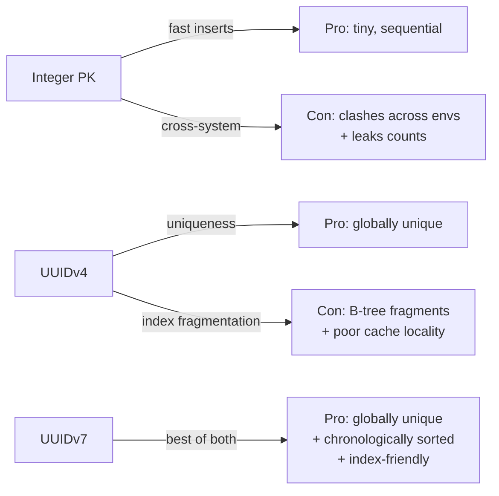
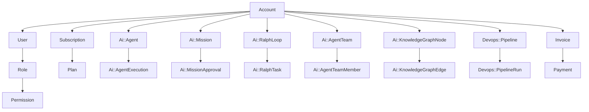

# Data Model

> Status: active

> UUIDv7 primary keys, PostgreSQL schema conventions, and the model namespaces that organize the codebase.

## Table of Contents

- [What this concept covers](#what-this-concept-covers)
- [UUIDv7 as the primary key](#uuidv7-as-the-primary-key)
- [UuidGenerator concern](#uuidgenerator-concern)
- [Database schema conventions](#database-schema-conventions)
- [Model namespaces](#model-namespaces)
- [Key relationships](#key-relationships)
- [Development guidelines](#development-guidelines)
- [Migration patterns](#migration-patterns)
- [Testing](#testing)
- [Performance](#performance)
- [Troubleshooting](#troubleshooting)
- [Related concepts](#related-concepts)
- [Materials previously at](#materials-previously-at)

## What this concept covers

Powernode uses **UUIDv7** as the primary key for every model and stores them as native PostgreSQL `uuid` columns. UUIDv7 embeds a millisecond-precision timestamp in the upper bits, so identifiers are chronologically sortable yet still cryptographically random in the lower bits. The platform standardized on this format because:

1. **Distributed safety** — UUIDs are globally unique without coordination
2. **Index performance** — chronological ordering keeps B-tree inserts compact, fixing the fragmentation problem that bit UUIDv4 deployments
3. **Debuggability** — the timestamp portion is human-readable as creation order
4. **Cross-system durability** — IDs survive database dumps, schema migrations, and cross-environment moves

This document is the canonical reference for how primary keys, foreign keys, schemas, and namespaces work. It's the second-most-cited concept after [`concepts/architecture.md`](./architecture.md) — everything else assumes UUIDv7 is operating correctly.

The exhaustive table-by-table reference (every column, every index) lives at [`reference/database-schema.md`](../reference/database-schema.md). Live model counts can be obtained via `cd server && rails runner "puts ApplicationRecord.descendants.size"`.

## UUIDv7 as the primary key

### Structure

```
0198ebd9-6018-7c94-ad91-9eb1cf7745d5
└─timestamp─┘ └ver┘ └────random─────┘
```

| Component | Bits | Description |
|-----------|------|-------------|
| Timestamp | 48 | Unix timestamp with millisecond precision |
| Version | 4 | Always `7` |
| Random | 74 | Cryptographically random data |

### Why UUIDv7 over alternatives



| Property | Integer | UUIDv4 | UUIDv7 |
|----------|---------|--------|--------|
| Globally unique | No | Yes | Yes |
| Chronologically sortable | Yes | No | Yes |
| B-tree index friendly | Yes | No | Yes |
| Leaks counts/timing | Yes | No | Partial (timestamp only) |
| Storage | 4–8 bytes | 16 bytes | 16 bytes |

## UuidGenerator concern

### Concern implementation

```ruby
# app/models/concerns/uuid_generator.rb
module UuidGenerator
  extend ActiveSupport::Concern

  included do
    self.primary_key = 'id'
    before_create :generate_uuid_v7, if: -> { id.blank? }
  end

  private

  def generate_uuid_v7
    self.id = UUID7.generate if id.blank?
  end
end
```

### ApplicationRecord integration

All models inherit UUIDv7 generation by default through `ApplicationRecord`:

```ruby
# app/models/application_record.rb
class ApplicationRecord < ActiveRecord::Base
  primary_abstract_class

  # Include UuidGenerator by default for all models
  # This ensures all models use UUIDv7 format for primary keys
  include UuidGenerator
end
```

**Benefits:**

- **Default behavior** — All new models automatically use UUIDv7
- **Consistency** — No need to remember to add UUID generation to new models
- **Platform-wide standard** — Ensures uniform ID format across all tables

### Gem dependency

```ruby
# Gemfile
gem 'uuid7', '~> 0.1'  # Pinned for Ruby 3.2 compat — SecureRandom.uuid_v7 needs Ruby 3.3+
```

`UUID7.generate` is the canonical way to obtain a UUIDv7 in the codebase. Do not use `SecureRandom.uuid_v7` (Ruby 3.3+ only; repo pins 3.2) or `SecureRandom.uuid` (UUIDv4).

## Database schema conventions

### ID columns

```ruby
create_table :example_table, id: :uuid do |t|
  # PostgreSQL native UUID type
  # No default value — Rails handles generation via UuidGenerator
  t.timestamps
end
```

### Foreign keys

```ruby
t.references :parent, null: false, foreign_key: true, type: :uuid
```

`t.references` automatically creates an index. **Never add `add_index` for reference columns** — customize via the declaration itself: `t.references :account, index: { unique: true }`.

### Column conventions

| Convention | Rule |
|------------|------|
| Primary keys | UUIDv7 via PostgreSQL native `uuid` type (not `string`) |
| Foreign keys | `t.references` with `type: :uuid` (index included automatically) |
| Timestamps | `created_at`, `updated_at` on all tables |
| Soft delete | `discarded_at` on applicable models (via Discard gem) |
| JSON columns | Lambda defaults: `attribute :config, :json, default: -> { {} }` |
| Vectors | pgvector with HNSW indexes for embedding columns |

### Namespaced foreign keys

Foreign key prefixes follow a strict convention so reviewers can recognize cross-namespace references at a glance:

| Namespace | FK Prefix | Example |
|-----------|-----------|---------|
| `Ai::` | `ai_` | `ai_agent_id`, `ai_provider_id` |
| `Devops::` | `devops_` | `devops_pipeline_id`, `devops_runner_id` |
| `BaaS::` | `baas_` | `baas_customer_id`, `baas_tenant_id` |

When declaring a `belongs_to` on a namespaced model, pair `class_name:` with `foreign_key:`:

```ruby
belongs_to :provider, class_name: "Ai::Provider", foreign_key: "ai_provider_id"
```

Use the `::` separator in `class_name:` strings: `"Ai::AgentTeam"` not `"AiAgentTeam"`.

## Model namespaces

The model layer is organized into 13 namespace directories (`account`, `ai`, `chat`, `database`, `data_management`, `devops`, `file_management`, `knowledge_base`, `mcp`, `monitoring`, `review`, `shared`, `supply_chain`) plus roughly 60 top-level models. The exact count of models per namespace changes constantly; treat this section as a structural map rather than a count source. For a live total, run `cd server && rails runner "puts ApplicationRecord.descendants.size"`.

```mermaid
flowchart TB
    Top[Top-level<br/>User, Account, Plan, Subscription, Invoice, Payment, Role, Permission, ...]
    Ai[Ai::<br/>Agent, Team, Mission, RalphLoop, Provider, KnowledgeGraph*, Skill, Memory, CodeFactory, Autonomy, ...]
    Devops[Devops::<br/>Pipeline, Repository, Runner, Deployment, DockerHost, SwarmService, ...]
    KB[KnowledgeBase::<br/>Article, Category, Tag, Comment, Attachment, Workflow]
    Chat[Chat::<br/>Conversation, Message, Channel, Session, Blacklist]
    FM[FileManagement::<br/>FileUpload, StorageBackend, FileVersion, FileShare, ...]
    Acct[Account::<br/>Delegation, Setting, Feature]
    DM[DataManagement::<br/>RetentionPolicy, SanitizationRule, DataExport]
    DB[Database::<br/>Connection, QueryHistory]
    Mon[Monitoring::<br/>HealthCheck, ServiceStatus]
    Mcp[Mcp::<br/>protocol infrastructure]
    Review[Review::<br/>code-review records]
    SC[SupplyChain::<br/>SBOM, attestations, signatures]
    Shared[Shared::<br/>FeatureGate]

    Top --> Ai
    Top --> Devops
    Top --> KB
    Top --> Chat
    Top --> FM
    Top --> Acct
    Top --> DM
    Top --> DB
    Top --> Mon
    Top --> Mcp
    Top --> Review
    Top --> SC
    Top --> Shared
```



`Mcp::` models also have a flat top-level alias group (`McpServer`, `McpTool`, `McpSession`, `McpToolExecution`, listed below) — both the namespaced directory and the top-level classes exist. `Review::` and `SupplyChain::` back the Code Factory review records and the supply-chain extension (SBOM / cosign / attestations) respectively.

### Top-level models

Core platform models not in a namespace include:

| Model | Description |
|-------|-------------|
| `User` | Platform users with authentication and permissions |
| `Account` | Multi-tenant account (one per organization) |
| `Role` | Permission grouping (`system.admin`, `account.manager`, ...) |
| `Permission` | Individual permission |
| `RolePermission` | Role-to-permission join table |
| `Plan` | Subscription plan with features/limits |
| `Subscription` | Account subscription (AASM state machine) |
| `Invoice` | Billing invoices with line items |
| `Payment` | Payment records |
| `Invitation` | User invitations with email workflow |
| `AuditLog` | Comprehensive activity tracking |
| `Notification` | User notifications |
| `ApiKey` / `ApiKeyUsage` | API key management and usage tracking |
| `AdminSetting` | System configuration key-value store |
| `BlacklistedToken` / `JwtBlacklist` | Token revocation |
| `PasswordHistory` | Password reuse prevention |
| `Page` | CMS content pages |
| `OauthApplication` | OAuth2 provider applications |
| `ImpersonationSession` | Admin impersonation tracking |
| `McpServer` / `McpTool` / `McpSession` / `McpToolExecution` | MCP protocol infrastructure |
| `CommunityAgent` / `CommunityAgentRating` / `CommunityAgentReport` | Agent marketplace |
| `ExternalAgent` / `FederationPartner` | A2A external agents |

### `Ai::` namespace

Largest namespace — covers the entire AI platform:

| Area | Examples |
|------|----------|
| Agents | `Agent`, `AgentExecution`, `AgentExecutionStep`, `AgentCapability`, `AgentConfiguration` |
| Teams | `AgentTeam`, `AgentTeamMember`, `TeamExecution`, `TeamChannel`, `TeamMessage` |
| Missions | `Mission`, `MissionApproval` |
| Ralph | `RalphLoop`, `RalphTask`, `RalphIteration`, `RalphLearning` |
| Providers | `Provider`, `ProviderModel`, `ModelRoutingRule`, `ProviderHealthCheck` |
| Data Sources | `DataSource`, `DataSourceCredential` |
| Knowledge | `KnowledgeGraphNode`, `KnowledgeGraphEdge`, `CompoundLearning`, `SharedKnowledge` |
| Memory | `MemoryEntry`, `MemoryPool`, `ContextEntry`, `ContextGroup`, `AgentShortTermMemory` |
| Skills | `Skill`, `SkillExecution`, `AgentSkill`, `SkillMutation`, `SkillChallenge` |
| Tools | `Tool`, `ToolExecution`, `ToolCategory` |
| Code Factory | `CodeFactoryRun`, `CodeFactoryContract`, `RiskContract`, `ReviewState` |
| Autonomy | `AgentTrustScore`, `DelegationPolicy`, `AgentPrivilegePolicy`, `BehavioralFingerprint`, `KillSwitchEvent`, `AgentGoal`, `AgentObservation`, `AgentProposal`, `AgentEscalation`, `InterventionPolicy`, `AgentFeedback` |
| Conversations | `Conversation`, `Message`, `Attachment` |
| Monitoring | `CostTracking`, `UsageMetric`, `BudgetAlert` |
| Templates | `SystemPromptTemplate` |
| Trust & Safety | `TrustScore`, `Guardrail`, `GuardrailEvaluation` |
| Worktree | `Worktree`, `WorktreeSession`, `WorktreeEvent` |

### `Devops::` namespace

| Area | Examples |
|------|----------|
| Pipelines | `Pipeline`, `PipelineRun`, `PipelineStep`, `PipelineStepExecution` |
| Git | `GitProvider`, `GitRepository`, `GitRunner`, `GitPipelineJob` |
| Docker | `DockerHost`, `DockerContainer`, `SwarmService`, `SwarmStack` |
| Deployments | `Deployment`, `DeploymentTarget`, `DeploymentEnvironment` |
| Templates | `IntegrationTemplate`, `ContainerTemplate` |

### Other namespaces

| Namespace | Purpose |
|-----------|---------|
| `KnowledgeBase::` | KB articles, categories, tags, comments, attachments, workflows |
| `Chat::` | Multi-platform chat — channels, sessions, messages, attachments, blacklists |
| `FileManagement::` | File uploads, storage backends, versioning, shares, virus scans, quotas |
| `Account::` | Delegations, settings, feature flags |
| `DataManagement::` | Retention policies, PII sanitization, GDPR data exports |
| `Database::` | External database connections, query history |
| `Monitoring::` | Health checks, service status |
| `Mcp::` | MCP protocol infrastructure (server, tool, session, execution records) |
| `Review::` | Code Factory review records |
| `SupplyChain::` | SBOM, cosign signatures, attestations (supply-chain extension) |
| `Shared::` | Feature gates for extension-aware code |

For exhaustive per-table detail, see [`reference/database-schema.md`](../reference/database-schema.md).

## Key relationships



Account is the multi-tenant boundary; almost every row in the database scopes to one account. See [`concepts/architecture.md`](./architecture.md) for the broader service decomposition.

## Development guidelines

### Creating new models

```bash
rails generate model BlogPost title:string content:text user:references
```

The generator automatically produces a UUIDv7-typed table:

```ruby
class CreateBlogPosts < ActiveRecord::Migration[8.0]
  def change
    create_table :blog_posts, id: :uuid do |t|
      t.string :title
      t.text :content
      t.references :user, null: false, foreign_key: true, type: :uuid
      t.timestamps
    end
  end
end
```

### Working with existing models

```ruby
user = User.create!(first_name: "John", last_name: "Doe", email: "john@example.com")
puts user.id
# => "0198ebd9-6018-7c94-ad91-9eb1cf7745d5"

# Associations work normally
plan = Plan.first
subscription = user.account.subscriptions.create!(plan: plan, quantity: 1)
puts subscription.id
# => "0198ebd9-6019-7a12-bb33-4ed2cf8845d3"
```

### UUID format recognition

```ruby
def uuid_version(uuid_string)
  uuid_string.split('-')[2][0].to_i(16)
end

uuid_version("0198ebd9-6018-7c94-ad91-9eb1cf7745d5") # => 7 (UUIDv7)
uuid_version("550e8400-e29b-41d4-a716-446655440000") # => 4 (UUIDv4)
```

### Chronological ordering

UUIDv7s can be sorted chronologically by ID:

```ruby
recent_articles = KnowledgeBase::Article.order(:id)  # oldest first
latest_first    = KnowledgeBase::Article.order(id: :desc)
```

However: **do not rely on ID ordering for business logic**. Use explicit timestamp columns when the ordering carries domain meaning.

```ruby
# Good — explicit business logic
def posts_by_publish_date
  BlogPost.order(:published_at)
end

# OK but not semantic
def posts_by_creation(limit = 10)
  BlogPost.order(:id).limit(limit)
end
```

### Manual ID assignment

```ruby
# Skip automatic generation (rare cases — external imports)
record = Model.new(id: imported_uuid, name: "Imported Record")
record.save!
```

## Migration patterns

### Creating tables

```ruby
class CreateNewFeature < ActiveRecord::Migration[8.0]
  def change
    create_table :new_feature, id: :uuid do |t|
      t.string :name, null: false
      t.text :description

      # Foreign keys — always type: :uuid
      t.references :account, null: false, foreign_key: true, type: :uuid
      t.references :user, null: true, foreign_key: true, type: :uuid

      t.timestamps
    end

    # Non-reference indexes
    add_index :new_feature, :name, unique: true
    add_index :new_feature, [:account_id, :created_at]
  end
end
```

### Adding foreign keys to existing tables

```ruby
class AddUserToExistingTable < ActiveRecord::Migration[8.0]
  def change
    add_reference :existing_table, :user, null: false, foreign_key: true, type: :uuid
  end
end
```

### Join tables

```ruby
class CreateJoinTable < ActiveRecord::Migration[8.0]
  def change
    create_table :article_tags, id: :uuid do |t|
      t.references :article, null: false,
                   foreign_key: { to_table: :knowledge_base_articles },
                   type: :uuid
      t.references :tag, null: false,
                   foreign_key: { to_table: :knowledge_base_tags },
                   type: :uuid
      t.timestamps
    end

    add_index :article_tags, [:article_id, :tag_id], unique: true
  end
end
```

## Testing

### Factories

```ruby
# spec/factories/blog_posts.rb
FactoryBot.define do
  factory :blog_post do
    title { "Sample Blog Post" }
    content { "This is the content" }
    user
  end
end

# Usage
blog_post = create(:blog_post)
puts blog_post.id     # UUIDv7
puts blog_post.user_id # UUIDv7
```

### Shared examples

```ruby
RSpec.shared_examples "has uuid primary key" do
  it "generates UUIDv7 format ID" do
    record = create(described_class.name.underscore.to_sym)
    version = record.id.split('-')[2][0].to_i(16)
    expect(version).to eq(7)
  end
end

RSpec.describe BlogPost do
  include_examples "has uuid primary key"
end
```

**Prefer factories over fixtures** for UUID models — fixtures with UUIDs are hard to maintain.

## Performance

### Indexing

- UUIDs are 16 bytes (same as UUIDv4)
- String representation is 36 characters
- UUIDv7s naturally cluster recent inserts together — composite indexes like `[user_id, id]` benefit from this
- pgvector HNSW indexes on embedding columns coexist cleanly with UUID primary keys

### Pagination

```ruby
# UUIDv7s are naturally ordered — use for time-based pagination
def recent_posts(limit: 10)
  BlogPost.order(id: :desc).limit(limit)
end
```

### Bulk operations

```ruby
# Bulk insert — IDs generated automatically by Rails callbacks
records = [
  { title: "Post 1", content: "Content 1", user_id: user.id },
  { title: "Post 2", content: "Content 2", user_id: user.id }
]
BlogPost.insert_all(records)

# Bulk update
BlogPost.where(user: user).update_all(status: 'published')
```

## Troubleshooting

| Issue | Fix |
|-------|-----|
| Model not generating UUIDv7 | Verify it inherits from `ApplicationRecord` and has a UUID `id` column |
| Foreign key type mismatch | Ensure `type: :uuid` on all references |
| Existing data with wrong UUID format | Run data migration to regenerate UUIDs for affected records |
| Invalid UUID format on `find` | Rescue `ActiveRecord::RecordNotFound`; validate input |
| Type mismatch on integer in UUID column | Rescue `ActiveRecord::StatementInvalid`; coerce to UUID string |

### Debug commands

```ruby
# Check UUID version for a record
record = BlogPost.first
puts record.id.split('-')[2][0]  # Should be "7"

# Verify chronological ordering
posts = BlogPost.limit(5).order(:id)
puts posts.map(&:id)  # Should be in chronological order

# Check database column type
ActiveRecord::Base.connection.columns('blog_posts').find { |c| c.name == 'id' }.sql_type
# => "uuid"

# Verify all models have UUID primary key
ApplicationRecord.descendants.select(&:table_exists?).each do |model|
  pk_column = model.columns_hash[model.primary_key]
  puts "#{model.name}: #{pk_column.sql_type}"
end
```

### Console helper

```ruby
def uuid_info(uuid_string)
  parts = uuid_string.split('-')
  version = parts[2][0].to_i(16)

  puts "UUID: #{uuid_string}"
  puts "Version: #{version}"
  puts "Timestamp portion: #{parts[0]}#{parts[1]}"
  puts "Is UUIDv7?: #{version == 7}"
end

uuid_info(User.first.id)
```

## Related concepts

- [`concepts/architecture.md`](./architecture.md) — service decomposition and namespace conventions
- [`concepts/permissions.md`](./permissions.md) — role/permission schema
- [`reference/database-schema.md`](../reference/database-schema.md) — exhaustive per-table reference
- [`guides/backend.md`](../guides/backend.md) — migration and model patterns

## Materials previously at

This concept consolidates content from:

- `docs/platform/UUID_SYSTEM_ARCHITECTURE.md`
- `docs/platform/UUID_SYSTEM_IMPLEMENTATION.md`
- `docs/platform/UUID_DEVELOPMENT_GUIDELINES.md`
- `docs/backend/DATABASE_SCHEMA_REFERENCE.md` (highlights only; full reference retained at `reference/database-schema.md`)

_Last verified: 2026-06-03_
