# Data Sources

> Status: active

> How a declarative catalog, a template-driven endpoint layer, and a governed fetch pipeline let agents pull from any external API — where adding a new source is configuration, not code — plus the Phase-2a layer that lets agents *discover* the right source by intent and *evaluate* how much to trust it, the Phase-2b layer that adds per-endpoint **data quality, schema-drift detection, and contracts** with zero overhead until you opt in, and the Phase-3 layer that turns one-shot fetches into **pull-based streaming & monitoring** — a server-side poll loop that change-detects, warms the cache, and signals agents on change, plus opt-in **stale-while-revalidate / stale-if-error** serving — and the Phase-4 layer that finishes the **generic framework**: a free-form `source_type` + `category` grouping, a protocol-keyed **adapter registry** (REST/custom, GraphQL, RSS/Atom), opt-in **outbound pagination**, and a nightly **schema-sync**.

## Table of Contents

- [What this concept covers](#what-this-concept-covers)
- [The generic protocol/adapter/decoder model](#the-generic-protocoladapterdecoder-model)
- [Data model](#data-model)
- [Catalog → endpoints](#catalog--endpoints)
- [The decode layer](#the-decode-layer)
- [Normalization](#normalization)
- [The QueryService pipeline](#the-queryservice-pipeline)
- [Response cache](#response-cache)
- [Security model](#security-model)
- [Credential brokering (Phase 4b-2a)](#credential-brokering-phase-4b-2a)
- [Query-time governance (Phase 4b-2b)](#query-time-governance-phase-4b-2b)
- [Transform & retrieval shaping (Phase 4b-3a)](#transform--retrieval-shaping-phase-4b-3a)
- [Onboarding portability (Phase 4b-3b)](#onboarding-portability-phase-4b-3b)
- [Multi-source coordination & RAG ingestion (Phase 4b-3c)](#multi-source-coordination--rag-ingestion-phase-4b-3c)
- [Provenance and the FetchEnvelope](#provenance-and-the-fetchenvelope)
- [Surfaces: REST + MCP](#surfaces-rest--mcp)
- [Frontend](#frontend)
- [Discovery & Evaluation (Phase 2)](#discovery--evaluation-phase-2)
- [Data quality, schema-drift & contracts (Phase 2b)](#data-quality-schema-drift--contracts-phase-2b)
- [Streaming & Monitoring (Phase 3)](#streaming--monitoring-phase-3)
- [Incremental sync & crawl politeness (Phase 5)](#incremental-sync--crawl-politeness-phase-5)
- [Generic framework (Phase 4)](#generic-framework-phase-4)
- [Phase boundaries](#phase-boundaries)
- [Related concepts](#related-concepts)
- [Materials previously at](#materials-previously-at)

## What this concept covers

A **data source** is a registered external API — NOAA, Open-Meteo, FRED, Yahoo Finance, ESPN, NewsAPI, a GraphQL/RSS endpoint, or any HTTP source under a free-form `source_type` label — that AI agents and workflows can pull from under platform governance. The data-source subsystem turns "an agent needs weather data" into a single audited, cached, SSRF-guarded, redacted fetch that returns canonical records plus a complete provenance record.

The defining design principle is **a new source is config, not code**. A source is described by rows in the database (a catalog entry, its endpoints, its credentials) and three generic registries — protocol adapters, response decoders, and auth signers — pick the right behavior at runtime from those rows. There is zero per-source Ruby in the common case: the `rest`/`custom` protocols, every JSON/XML/CSV/NDJSON response shape, and the `none`/`api_key`/`bearer`/`aws_sigv4`/`hmac` auth schemes are all driven by stored templates and config. **Phase 4** completes the generic-framework arc: `source_type` becomes a free-form label (no enum), purpose-built `graphql`/`rss`/`atom` adapters ship alongside the generic REST fallback, outbound pagination becomes an opt-in endpoint config, and a nightly schema-sync keeps endpoint baselines current — see [Generic framework (Phase 4)](#generic-framework-phase-4). Adding a further bespoke protocol still means registering one class name in a registry; until then every unrecognized source degrades safely to the generic REST adapter and JSON decoder.

This document is the canonical reference for how the catalog, endpoint templates, decoders, normalization, the fetch pipeline, the response cache, and the security model compose. The **operational** counterpart — how to register a source, rotate a credential, and troubleshoot a failing integration — lives in [`operations/data-sources.md`](../operations/data-sources.md).

All backend code lives under `server/app/services/ai/data_sources/` (plus the shared `server/app/services/security/http_signature.rb`). The models are in the `Ai::` namespace; the table prefix is `ai_data_source*`.

## The generic protocol/adapter/decoder model

Three registries make the subsystem source-agnostic. Each follows the same shape used elsewhere in the codebase (e.g. `Ai::Providers::Sync::Generic`): a small static map keyed by a normalized token, resolved via `constantize` to sidestep autoload-order issues, with a generic fallback that **never raises** on an unknown token.

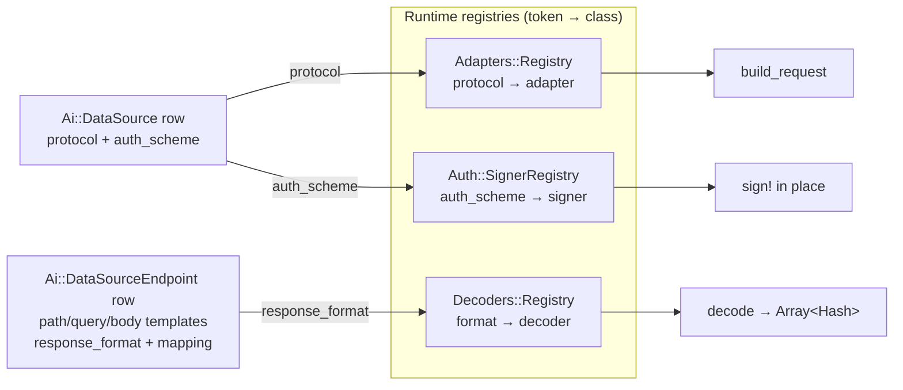

| Registry | Lookup key | Map | Generic fallback | Contract |
|----------|-----------|-----|------------------|----------|
| `Ai::DataSources::Adapters::Registry` | `data_source.protocol` | `rest`/`custom` → `RestAdapter`; `graphql` → `GraphqlAdapter`; `rss`/`atom` → `RssAdapter` | `RestAdapter` (any unknown/blank protocol) | `.for(data_source)` → adapter with `build_request(endpoint:, params:)` + `parse(raw_body, endpoint:)` |
| `Ai::DataSources::Auth::SignerRegistry` | `data_source.auth_scheme` | `none`, `api_key`, `bearer`, `aws_sigv4`, `hmac` | `NoneSigner` (no-op) | `.for(auth_scheme)` → signer with `sign!(conn_or_env, credential:, config:)` |
| `Ai::DataSources::Decoders::Registry` | `endpoint.response_format` (cross-checked against the sniffed bytes) | `json`, `ndjson`, `xml`, `rss`, `atom`, `html`, `csv` | `Json` (unknown bodies are most often JSON-ish) | `.for(format:, content_type:)` → decoder with `decode(raw_body, endpoint:)` |

"Custom" deliberately maps to the same generic `RestAdapter` as `rest` — it means "a REST source with a hand-rolled template", not "needs its own adapter class". The `graphql` and `rss`/`atom` protocols are the first purpose-built adapters registered this way (see [Generic framework (Phase 4)](#generic-framework-phase-4)); a further bespoke protocol (SOAP, gRPC-gateway) is the same opt-in: register a class name in `Adapters::Registry::ADAPTERS` and it takes over; absent that, the source still works via REST.

## Data model

Four models under the `Ai::` namespace, all UUIDv7-keyed (see [`concepts/data-model.md`](./data-model.md)), scoped to an `Account`. The namespaced foreign key is `ai_data_source_id` throughout (per the `Ai::` → `ai_` convention).

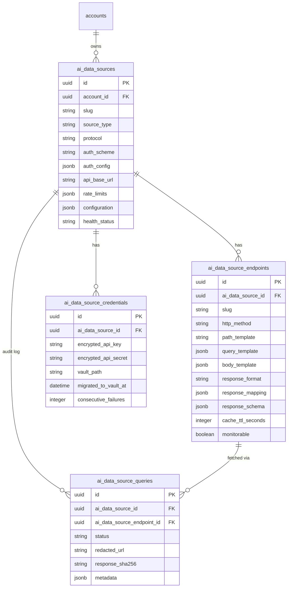

| Model | Table | Role |
|-------|-------|------|
| `Ai::DataSource` | `ai_data_sources` | The catalog entry. Carries `protocol`, `auth_scheme`, `auth_config`, the base URL, `rate_limits`, and `configuration`. `has_many :endpoints`, `:credentials`, `:queries`, `:subscriptions` (Phase 3, `dependent: :destroy`). Owns quota counting via `Powernode::Redis.client`. |
| `Ai::DataSourceEndpoint` | `ai_data_source_endpoints` | A declarative request template + response contract. Holds `path_template`/`query_template`/`body_template`, `response_format`, `response_mapping`, `response_schema`, `cache_ttl_seconds`, the `monitorable` + change-detection columns, the Phase-2b observability flags, and the Phase-3 `stale_while_revalidate_seconds` / `stale_if_error_seconds` columns (both nil = OFF). `has_many :subscriptions`. |
| `Ai::DataSourceSubscription` | `ai_data_source_subscriptions` | **(Phase 3)** A pull-based monitoring subscription binding a source + endpoint to a poll cadence. Carries `poll_frequency`, `status`, `next_poll_at`, `last_polled_at`, the change fingerprint (`last_checksum`/`last_etag`), and `consecutive_failures`. Polled by `MonitorService`. |
| `Ai::DataSourceCredential` | `ai_data_source_credentials` | Auth material. Rails-8 `encrypts` on `encrypted_api_key`/`encrypted_api_secret`, plus `vault_path` + `migrated_to_vault_at` for Vault-backed secrets. Tracks `consecutive_failures` for health. |
| `Ai::DataSourceQuery` | `ai_data_source_queries` | The **query/audit log**: one row per governed fetch (including cache hits and blocked/rate-limited attempts). Every operator-visible field is redacted before write; the row is hash-chained into the audit log. |

As of **Phase 4**, `source_type` is a **free-form** label, not an enforced enum — validated for presence + length (≤ 50) + lowercase format (`/\A[a-z0-9_-]+\z/`), with the old list kept only as UI hints (`SUGGESTED_SOURCE_TYPES`, aliased to `SOURCE_TYPES` for backward compatibility). A nullable `category` column gives a coarse grouping (`weather`/`finance`/`sports`/`news`/…), and `protocol` (default `rest`) selects the adapter. Scopes `by_type` and `by_category` filter on the two. `auth_scheme` defaults to `none`. JSON columns use lambda defaults per platform convention. See [Generic framework (Phase 4)](#generic-framework-phase-4).

## Catalog → endpoints

The catalog (`Ai::DataSource`) holds the connection-level facts: where the API lives (`api_base_url`), how to authenticate (`auth_scheme` + `auth_config` + credentials), and the rate budget (`rate_limits`). Each endpoint (`Ai::DataSourceEndpoint`) is a **declarative template** for one operation against that source plus the contract for interpreting its response.

The generic `RestAdapter` (`adapters/rest_adapter.rb`) builds the outbound request entirely from the endpoint's stored templates and the caller's params — no per-source code:

- **`path_template`** — a string like `"/v1/stations/{station_id}/obs"`. Placeholders use single-brace `{name}` syntax. Path placeholders are RFC-3986 path-escaped (via `ERB::Util.url_encode`) so a caller-supplied segment can never break out of its path.
- **`query_template`** — a Hash like `{ "limit" => "{limit}", "fmt" => "json" }`. Nil-resulting entries are dropped so optional params don't emit empty keys.
- **`body_template`** — a Hash, sent only for `POST`/`PUT`/`PATCH`.

Interpolation has two modes. A value that is **exactly** one placeholder (`"{ids}"`) is replaced with the *raw* typed param (preserving Integer/Array/Boolean so structured bodies keep their JSON types). Any other string is treated as an embedded template and produces a string. **Unknown placeholders are left intact** rather than blanked, so a misconfiguration surfaces visibly instead of silently producing a malformed request.

`build_request` returns the canonical request envelope every layer agrees on:

```ruby
{ method:, url:, headers:, query:, body: }
# method  : upper-case verb String ("GET")
# url     : path after substitution (relative to api_base_url; the
#           connection factory resolves it against the base)
# headers : Hash<String,String> (static endpoint headers; auth applied later)
# query   : Hash of query-string params
# body    : Hash (dispatcher encodes), String (raw), or nil
```

The response side of an endpoint is `response_format` (which decoder), `response_mapping` (where the records live + normalization rules), and `response_schema` (an optional JSON Schema the decoded payload is validated against).

## The decode layer

Decoding turns raw response bytes into **canonical records** — always `Array<Hash>` — independent of the source. Three pieces collaborate, all under `decoders/`.

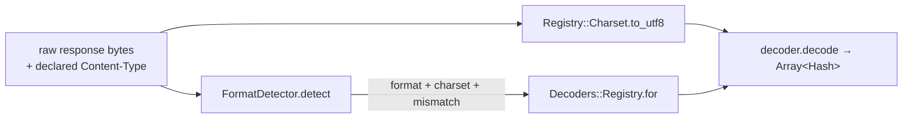

**`FormatDetector`** (`decoders/format_detector.rb`) sniffs the on-the-wire format from the leading bytes (BOM, leading token, XML root probe) and cross-checks it against the provider's declared `Content-Type` and the endpoint's `expected_content_type`. Detection precedence, highest-confidence first: (1) magic-byte/structural sniff, (2) XML root probe, (3) declared `Content-Type`, (4) `endpoint.expected_content_type`, (5) `application/octet-stream` fallback. It returns a stable envelope and **never raises**:

```ruby
FormatDetector.detect(raw_body, declared_content_type:, endpoint:)
# => { format:, content_type:, mismatch:, charset:,
#      declared_format:, detected_format:, source: }
```

The key output is `mismatch` — true when a confident byte-level format disagrees with the declared one (e.g. an HTML error page served with a JSON `Content-Type`). Compatible pairs are tolerated: JSON↔NDJSON, and XML↔RSS↔Atom↔HTML. Downstream, `QueryService` records a mismatch as a `content_type_mismatch` anomaly.

**`Registry::Charset.to_utf8(raw, charset:)`** centralizes encoding so transcoding is uniform across every decoder: it strips the BOM, transcodes the declared/detected charset to UTF-8 with `invalid:/undef: :replace`, and scrubs invalid bytes so a few bad octets never abort an otherwise-valid document.

**Decoders** each implement `decode(raw_body, endpoint:) → Array<Hash>` and are stateless. They degrade to an **empty record set** (logged) rather than raising on malformed input:

| Decoder | Format(s) | Record location & behavior |
|---------|-----------|----------------------------|
| `Decoders::Json` | `json` (also the generic fallback) | `response_mapping["records_path"]` (dotted path or JSON pointer, e.g. `data.items` / `/data/items`). No path → top-level Array = records, Hash = one record, scalar wrapped as `{ "value" => … }`. |
| `Decoders::Ndjson` | `ndjson` | One parsed value per non-blank line; a malformed line is skipped (line independence is the point); non-Hash lines wrapped as `{ "value" => … }`. |
| `Decoders::Xml` | `xml`, `rss`, `atom`, `html` | `record_xpath` or `record_node` from mapping; else auto-detect `<item>`/`<entry>` feeds; else the most-repeated sibling element; else the whole doc. Nokogiri in recover mode, namespaces stripped, attributes prefixed `@`, mixed text under `#text`. |
| `Decoders::Csv` | `csv` (also TSV/semicolon/pipe) | Delimiter sniffed (or pinned via `response_mapping`); header row sniffed (non-numeric, unique) or positional `column_N`; malformed rows skipped. `"city,temp\nNYC,72"` → `[{"city"=>"NYC","temp"=>"72"}]`. |

Because the registry's fallback is `Json` and every decoder fails soft, an unrecognized or malformed body never crashes a fetch — it yields `[]` and an anomaly.

## Normalization

After decoding, `NormalizationService` (`normalization_service.rb`) coerces values into a canonical form and emits a **provenance log** describing every conversion. It is driven by `endpoint.response_mapping` and is useful even with sparse/empty rules (value-shape heuristics still apply).

```ruby
normalized, provenance = NormalizationService.new(rules).apply(records)
```

Three normalization families:

| Family | Canonical form | Rule key |
|--------|----------------|----------|
| Dates/times | UTC ISO-8601 (RFC 3339) strings | `dates.fields` + optional `dates.assume_zone`; ISO-ish strings auto-coerced unless `infer_dates: false` |
| Strings | Unicode NFC (canonical composition) | `strings.normalize_all` (default on) + `strings.exclude` |
| Currency | ISO-4217 validation + canonical `{ amount, currency, minor_units }` via the money gem | `currency.fields.<field>` with `currency` (fixed) or `currency_field` (sibling) |

The provenance is an array of `{ record_index, field, type, from, to, currency, note }` entries — one per applied conversion — so downstream auditing can diff originals against canonical values. Callers redact at the log boundary; the service keeps raw originals.

## The QueryService pipeline

`Ai::DataSources::QueryService` (`query_service.rb`) is the Phase-1 integrator. It composes every data-source module (adapters, signers, decoders, format detection, normalization, the SSRF-guarded connection factory, the response cache) **and** every shared reuse service (per-source kill flag, quotas, circuit breaker, credential vault, JSON-schema validation, PII redaction, the audit hash chain, cost attribution) into one governed external-fetch pipeline.

```ruby
Ai::DataSources::QueryService
  .new(data_source:, endpoint:, params: {}, agent: nil, user: nil)
  .call   # => FetchEnvelope (Hash)
```

It **never raises**: every failure path is mapped to a `FetchEnvelope` with `success: false` and a redacted error message.

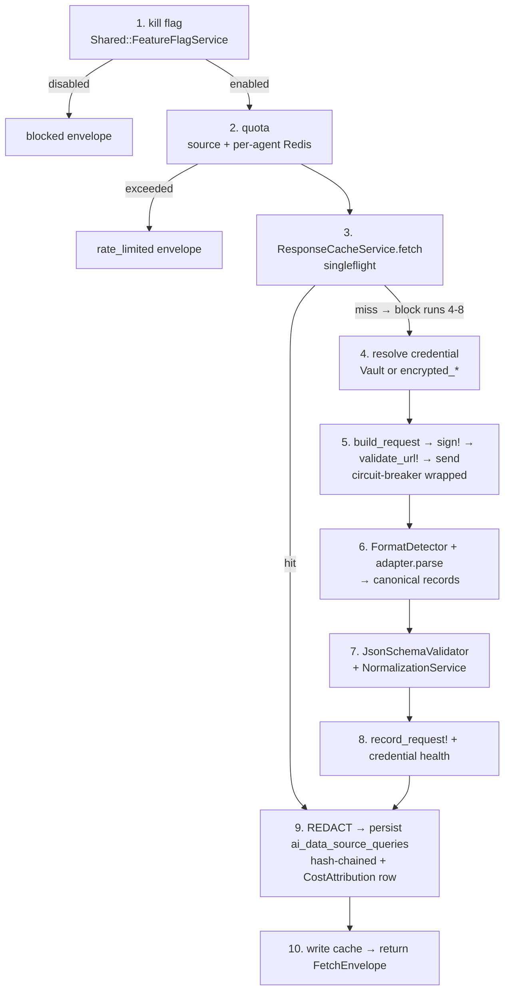

The ten stages, in order:

1. **Per-source kill flag.** `data_source.<slug>.enabled` via `Shared::FeatureFlagService` (Flipper). Fail-open: only a present-and-false flag disables; an unset flag is treated as enabled (it's a kill switch, not an opt-in).
2. **Quota.** The shared per-source `data_source.check_quota!` (Redis minute/hour/day windows) **plus** a per-agent counter namespaced under `data_source:<id>:quota:<agent_id>:*`, so one noisy agent can't exhaust the whole source's budget. Over-limit → `rate_limited`.
3. **Cache.** The live fetch (stages 4–8) is wrapped in `ResponseCacheService.fetch` (singleflight). A cache fault falls through to a direct fetch — Redis trouble never breaks a query.
4. **Credential.** Prefer Vault when the active credential carries a `vault_path` (via `Security::VaultCredentialProvider`, adapted to the signer contract by an internal `VaultCredentialView`); otherwise fall back to the Rails-encrypted `decrypted_*` accessors.
5. **Protected dispatch.** Inside `Ai::CircuitBreakerRegistry.protect(service_name: "data_source:<id>")`: `adapter.build_request` → `signer.sign!` → `HttpConnectionFactory.validate_url!` → send over the SSRF-guarded Faraday connection. Idempotent verbs (`GET/HEAD/PUT/DELETE/OPTIONS/TRACE`) get **one** transient-failure retry; **POST is never auto-retried** without an explicit idempotency key.
6. **Decode.** `FormatDetector.detect` (records a `content_type_mismatch` anomaly if needed) → `adapter.parse` → canonical records.
7. **Validate + normalize.** When `endpoint.response_schema` is set, `JsonSchemaValidator` yields `schema_valid` (true/false, or `nil`/"unknown" when no schema); then `NormalizationService` coerces values and produces normalization provenance.
8. **Accounting.** `data_source.record_request!(bytes:)` + the per-agent counter; credential `record_success!`/`record_failure!` (which also recomputes `health_status`). A breaker-open path deliberately leaves credential counters untouched.
9. **Persist + audit + cost.** Everything operator-visible is run through `Ai::Security::PiiRedactionService` **before** the row is written. A `Ai::DataSourceQuery` row is saved, then tied into the SHA256 audit hash chain via a companion `AuditLog` whose `before_create` integrity hook (`Audit::LogIntegrityService`) seals it — the resulting `integrity_hash`/`previous_hash`/`sequence_number` are mirrored back onto the query's `metadata["audit_chain"]` so the anchor is queryable without a join. Exactly one `Ai::CostAttribution` row is emitted via `from_data_source_query` (even cache hits — zero-byte egress is still attributed).
10. **Cache write + return.** Write the cacheable payload only on a **fresh success** (never re-write a hit, never cache an error), then return the `FetchEnvelope`.

A fetch maps to the audit action `api_request` on success/cache, `api_request_failed` otherwise (both members of `AuditActions::ALL_ACTIONS`, required so the hash-chained companion entry validates).

`Ai::DataSources::EndpointQueryRunner` is a thin wrapper the REST controller uses so the controller stays under its size budget — it just constructs `QueryService` with the request's agent/user context and returns the envelope verbatim.

## Response cache

`Ai::DataSources::ResponseCacheService` (`response_cache_service.rb`) is a Redis-backed cache (DB 0, via `Powernode::Redis.client`, SHA256 keys, `setex` TTL) that mirrors the access/metrics shape of `Ai::Learning::PromptCacheService` and adds two cache-stampede protections:

1. **Singleflight.** On a miss, only one caller recomputes, under a per-key Redis `SET NX PX` lock (with a 30s safety TTL so a crashed holder can't wedge the key). Concurrent callers poll briefly for the freshly written value, and serve the previous (stale) value if one is still around before falling back to their own recompute.
2. **Probabilistic early refresh (XFetch).** Each entry stores its recompute cost (`delta`) and hard-expiry epoch. A reader rolls `gamma = delta · BETA · -ln(random)` and treats the value as expired when `now + gamma ≥ expiry`, so exactly one early reader regenerates the value just before it would expire — and that regeneration is still single-flighted. Expensive entries refresh proportionally earlier.

TTL comes from `endpoint.cache_ttl_seconds` (fallback `DEFAULT_TTL` = 5 minutes). Cache keys are a human-readable `data_source_id:endpoint_slug` prefix plus a SHA256 of `[ds_id, slug, normalized_params]` — the prefix keeps invalidation cheap, the digest keeps param-variants bounded. `invalidate(data_source:, endpoint:)` does a SCAN-based prefix delete (endpoint-scoped or whole-source). A second per-source kill flag, `data_source_response_caching`, disables caching for a source without touching Redis. `.metrics` returns `{ hits, misses, total, hit_rate }`.

## Security model

The data-source pipeline is the platform's egress chokepoint for agent-initiated fetches. Four controls, applied at distinct stages:

### SSRF: resolve-and-pin

`Ai::DataSources::HttpConnectionFactory` (`http_connection_factory.rb`) builds an SSRF-guarded Faraday connection and exposes `validate_url!(url)`, which **resolves the host and rejects any resolved address** in a private / loopback / link-local / unique-local / reserved CIDR (IPv4 and IPv6, including IPv4-mapped IPv6 and 6to4/Teredo prefixes). The cloud metadata endpoint `169.254.169.254` is inside the blocked `169.254.0.0/16` link-local range — verified blocking. Disallowed schemes and DNS failures also raise `SsrfError`.

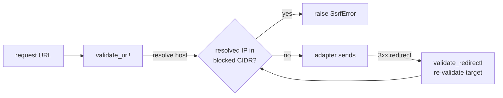

The guard runs in **two places**: `validate_url!` is called directly before dispatch (resolve-and-pin), and a `SsrfGuardMiddleware` re-validates the initial URL on the way out, while a `follow_redirects` callback re-validates **every redirect hop** — so a public host cannot 30x-bounce into the internal network. The factory also enforces bounded open/read timeouts and a hard response-size cap (`MAX_RESPONSE_BYTES` = 10 MiB; endpoints may lower it via `configuration["max_response_bytes"]` but never raise it), raising `ResponseTooLargeError` on oversized bodies. It advertises a contactable `User-Agent`: `Powernode/<ver> (+<contact>; agent:<slug>)`. (OWASP coverage: A10:2021 SSRF, ASI08 Excessive Agency.)

### Redaction chokepoint

Stage 9 of `QueryService` runs **every** operator/caller-visible string through `Ai::Security::PiiRedactionService` before it is persisted to `ai_data_source_queries` or cached in provenance — the URL, params, response snippet, and error message. Beyond the PII heuristics, a hard `SENSITIVE_QUERY_KEY` pattern unconditionally masks the *values* of query params whose key matches `api_key`/`key`/`token`/`access_token`/`refresh_token`/`secret`/`client_secret`/`auth`/`authorization`/`password`/`sig`/`signature`/`credential`/`session`/`cookie` (and common prefixed forms), so non-standard secret params never persist verbatim. On any redaction failure the URL's query string is stripped entirely rather than risk a leak.

### Request signing

Outbound auth is applied by the signer layer (`auth/`), resolved by scheme from `SignerRegistry`. Every signer mutates the request in place via `sign!(conn_or_env, credential:, config:)`:

| Scheme | Signer | Behavior |
|--------|--------|----------|
| `none` | `NoneSigner` | No-op (also the fallback for unknown schemes) |
| `api_key` | `ApiKeySigner` | Injects the key as a configurable header or query param |
| `bearer` | `BearerSigner` | `Authorization: Bearer <token>` |
| `aws_sigv4` | `Sigv4Signer` | **Wraps** `Aws::Sigv4::Signer` (gem `aws-sigv4`) — canonicalization is delegated to the SDK, never hand-rolled. Region/service from `auth_config`; signs the request-env Hash (per-request, not per-connection). |
| `hmac` | `HmacSigner` | RFC 9421 HTTP Message Signatures, emitting `Signature-Input` + `Signature` headers over configurable covered components. |

`HmacSigner` and the inbound webhook verification path share one audited HMAC implementation: `Security::HttpSignature` (`server/app/services/security/http_signature.rb`) — `hexdigest`/`base64digest`/`sign`/`verify` plus constant-time `secure_compare`. Signing failures are logged without echoing credential material and re-raised; the catch-all keeps secrets out of logs and exception traces.

### Vault + encryption

Credentials are encrypted at rest with Rails-8 `encrypts` on `encrypted_api_key`/`encrypted_api_secret`. The `vault_path` + `migrated_to_vault_at` columns support migrating a credential into Vault; when present, the pipeline reads the secret from Vault at fetch time (stage 4) and never touches the DB copy. Credential health is tracked via `consecutive_failures` — five consecutive failures deactivate the credential and drive `health_status` to `critical`.

## Credential brokering (Phase 4b-2a)

The Phase-1 signer layer assumes the stored secret *is* the credential you sign with. But the strongest auth schemes don't sign with a long-lived secret at all — they sign with a **short-lived** one minted just-in-time: an AWS STS role session, an OAuth2 `client_credentials` access token, a Vault dynamic-engine lease, a self-authenticating presigned URL. **Credential brokering** adds exactly that, *without* touching the signer contract: a broker **exchanges** the resolved base credential for a short-lived one immediately before the signed fetch, and returns an object the existing signers consume **unchanged**. It is **config, not code** (the brokering arc of the *new-source-is-config* principle), and it is **OFF by default** — a source with no `auth_config["broker"]` runs the byte-for-byte Phase-1 path.

All backend code lives under `server/app/services/ai/data_sources/credentials/`.

### The broker model

A broker slots into `QueryService#resolve_credential` **after** the base credential is resolved (static `decrypted_*` or Vault, stage 4) and **before** signing (stage 5). The hand-off is a single method on every broker:

```ruby
broker.acquire(data_source:, base_credential:, config:)
#   data_source     [Ai::DataSource]
#   base_credential [#decrypted_api_key/#decrypted_api_secret/#[](name)] the resolved
#                   STATIC/VAULT cred (or nil). Brokers read the BASE secret off this —
#                   e.g. OAuth client_id/secret, the low-priv AWS keys used to call
#                   AssumeRole. NEVER off config.
#   config          [Hash] data_source.auth_config["broker"] — broker-specific
#                   NON-secret knobs (token_url, role_arn, vault_path, region, ...).
# => a credential satisfying the SAME signer contract — either a BrokeredCredential
#    built from freshly-acquired material, OR base_credential unchanged (degrade/no-op).
```

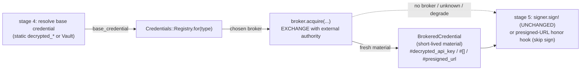

The returned `Ai::DataSources::Credentials::BrokeredCredential` is an **immutable value object** that mirrors `QueryService::VaultCredentialView`'s signer contract — `#decrypted_api_key` (primary key/token), `#decrypted_api_secret` (secret half, nil for token-only schemes like a bearer), and `#[](name)` for any other field a signer reads (`session_token`, `security_token`). It tolerates the same key-spelling fallbacks the Vault view does (`api_key`/`access_key_id`/`token`/`key`; `api_secret`/`secret_access_key`/`secret`), so a broker can return whatever the upstream named its fields. It additionally carries **lease metadata** (`#expires_at`, `#expired?(skew)`) and an optional `#presigned_url`. It is frozen on construction, the material Hash is duplicated read-only, and **`#inspect`/`#to_s` are redacted** so a token can never leak through an exception trace or a `pp cred`.

Because the brokered object satisfies the identical contract, **the signer layer, SSRF guard, decode/normalize, and provenance are all unchanged** — brokering is purely a credential-substitution step ahead of an otherwise-Phase-1 fetch.

### Config, not code

A source turns brokering on entirely through `auth_config["broker"]` — no Ruby:

```ruby
auth_config = {
  "broker" => {
    "type"     => "aws_sts",                                   # selects the broker
    "role_arn" => "arn:aws:iam::123456789012:role/ds-reader",  # broker-specific knobs
    "duration_seconds" => 3600
  }
}
```

`QueryService#broker_config` reads `auth_config["broker"]` (tolerating string OR symbol keys at both levels) and `#maybe_broker_credential` resolves the broker by its `type`, calls `acquire`, and uses the result. **The `config` hash carries NON-secret knobs only** — secrets always come off `base_credential`. A blank/absent `broker` config is the explicit no-op: the base credential flows straight to the signer exactly as in Phase 1.

### The registry + generic StaticBroker fallback

`Ai::DataSources::Credentials::Registry.for(type)` maps the configured `type` token to a broker class, **mirroring `Auth::SignerRegistry`'s `NoneSigner` fallback exactly**: a static map keyed by a normalized (stripped/down-cased) token, resolved lazily via `constantize` (so the concrete brokers needn't be loaded at definition time), with a generic fallback that **never raises**. An unknown or blank type resolves to **`StaticBroker`**, which returns the base credential unchanged — so a source configured with an unrecognized broker type degrades safely to the stored credential instead of crashing.

| `type` token | Broker class | Fallback |
|--------------|--------------|----------|
| `static`, *(unknown/blank)* | `StaticBroker` (no-op — returns base unchanged) | — (this *is* the fallback) |
| `oauth2_client_credentials` | `Oauth2ClientCredentialsBroker` | → base on any failure |
| `aws_sts` | `AwsStsBroker` | → base on any failure |
| `aws_sts_web_identity` | `AwsStsWebIdentityBroker` | → base on any failure |
| `vault_dynamic` | `VaultDynamicBroker` | → base on any failure |
| `presigned_url` | `PresignedUrlBroker` | → base on any failure |

`BaseBroker` is the contract + fail-safe template. Its public `#acquire` wraps the subclass's protected `#acquire!` (which performs the exchange and **may** raise) in a rescue that logs `e.class` only and **degrades to `base_credential`** — so a broker fault can never crash the fetch. Subclasses override `#acquire!`; shared helpers handle tolerant jsonb config reads, the SSRF-guarded HTTP connection, lease-seconds math, and the non-secret audit line.

### The six broker types, and when to use each

| Broker | Exchanges → | Signs with | Reach | Use when |
|--------|-------------|-----------|-------|----------|
| `static` | nothing (no-op) | the stored secret | none | The default. No brokering — the stored credential is the credential. Also the safe landing for an unknown `type`. |
| `oauth2_client_credentials` | stored `client_id`+`client_secret` → short-lived **bearer access token** (RFC 6749 `client_credentials` grant) | `BearerSigner` (`Authorization: Bearer <token>`), unchanged | **SSRF-guarded HTTP** POST to the config `token_url` | The source is an OAuth2-protected API you call machine-to-machine (Auth0/Okta/etc.). Knobs: `token_url` (required), `scope`, `audience`, `client_auth` (`basic` default / `body`). |
| `aws_sts` | stored **low-priv IAM keys** → short-lived STS session via **AssumeRole** | `Sigv4Signer` over the temporary session, unchanged | AWS STS SDK (fixed AWS endpoint) | A SigV4 source (private `execute-api`, S3) where you want to store only a key that can `sts:AssumeRole` into a scoped role rather than a broad IAM user. Knobs: `role_arn` (required), `session_name`, `duration_seconds` (900–43200), `external_id`, `region`. |
| `aws_sts_web_identity` | an **OIDC/JWT web-identity token** → short-lived STS session via **AssumeRoleWithWebIdentity** (**keyless** — no static AWS secret) | `Sigv4Signer`, unchanged | AWS STS SDK (unauthenticated — the token *is* the proof); the token may come **SSRF-guarded** from `token_url` | A workload with a federated identity (IRSA / EKS Pod Identity / GitHub-OIDC) — the canonical no-long-lived-AWS-secret pattern. Token source (first present wins): inline `web_identity_token` → `token_file` (projected on disk) → `token_url` (SSRF-guarded). `base_credential` is ignored for the exchange. |
| `vault_dynamic` | a Vault **dynamic-secrets engine** mount → short-lived material Vault mints on demand (DB `{username,password}` or AWS `{access_key,secret_key,security_token}`) | whichever signer the source uses — the engine-shape is normalized so DB **and** AWS leases are consumable unchanged | the **same** platform Vault path the credential provider uses (`::Security::VaultClient.read_secret`, `cache: false`) | The secret should be minted per-use by Vault rather than stored at all (a database read-role, a Vault-managed AWS engine). Knobs: `vault_path` (required), `skew_seconds`. Requires `data_source.account` (account-scoped, folded into the cache key). |
| `presigned_url` | stored cloud-storage keys → a **self-authenticating signed URL** (AWS S3 via `Aws::S3::Presigner`, default; or an Azure Blob **service SAS** via inline HMAC-SHA256, no SDK) | **nobody** — the URL's query string carries the signature; signing is **skipped** (see honor hook) | **no outbound HTTP** in acquisition — both are a local signing operation over a fixed cloud endpoint | The fetch target is a single object in S3/Azure Blob and you want a time-boxed read URL rather than a header credential. S3 knobs: `bucket`, `object_key`, `region`, `expires_in`. Azure knobs: `container`, `blob`, `account_name`, `expires_in`. |

The presigned-URL broker is the one shape that doesn't end in a signer call. Its `BrokeredCredential` carries the URL via `#presigned_url` (and `decrypted_api_key` is intentionally nil). `QueryService` has a tiny **presigned-URL honor hook** (stage 4c): when the resolved credential exposes a non-blank `#presigned_url`, that URL **is** the fetch target and `sign_request!` is **skipped** — but the request still runs through the **same SSRF-guarded connection**, so the presigned host is validated like any other. A nil/blank `presigned_url` leaves the normal sign-then-fetch path byte-for-byte.

### Security model

Brokering introduces an external exchange step, so it carries the data-source pipeline's egress and secret-handling discipline through to every broker:

- **SSRF guard on every config URL.** Any outbound HTTP a broker makes to a *config-supplied* URL — the OAuth2 `token_url`, the OIDC token-exchange `token_url` — goes through `BaseBroker#broker_http_connection`, which is the **same** SSRF-guarded Faraday connection a real fetch uses (`validate_url!` resolve-and-pin **plus** `SsrfGuardMiddleware` re-validation **plus** per-hop redirect re-pinning). A bare `Faraday.new` on a config URL would reopen the SSRF / DNS-rebinding hole (e.g. `token_url → 169.254.169.254`); the guard rejects it with `SsrfError`. The connection is dispatched against the **absolute** URL so the middleware validates the exact target.
- **No-redirect on token exchange.** The OAuth2 token POST is built with **`max_redirects: 0`** — a token endpoint must never 3xx, and following a 307/308 cross-host could replay a body-mode `client_secret` to the redirect target. A 3xx then simply parses as non-2xx and degrades.
- **Fixed AWS/cloud endpoints only.** The STS, S3-presigner, and Azure-SAS paths target the **fixed** (optionally regionalized) cloud endpoints; a **config-supplied endpoint override is deliberately NOT honored** (that would reintroduce SSRF through a different door). Region is honored where the service is regionalizable; the endpoint is not.
- **Short-lived creds cached in Redis, never logged.** Acquired material is cached by `BrokerCache` (Redis, namespace `ds_cred_broker:`) for **`lease − skew`** seconds — derived via `ttl_with_skew` so the cached credential is dropped slightly *before* the upstream actually expires it, never signing with a just-expired token. The cache is **singleflight** (a `SET NX` recompute lock so a swarm at expiry collapses onto ~one `AssumeRole` / token request / Vault read; the contended caller computes its own copy **without sleeping** rather than stampeding) and **fail-open** (any Redis fault just runs the exchange uncached). Cache keys fold in a **non-reversible SHA-256 fingerprint** of the base secret so rotating the base credential naturally busts the cache — the raw secret never appears in the key. The cached value is short-lived, account/source-scoped secret material; only the non-secret key and the outcome are ever logged.
- **NEVER logged.** No access token, secret, session token, `client_secret`, account key, or signed URL is ever logged, echoed, or placed in an exception message. Rescue blocks log `e.class` only. `BrokeredCredential#inspect`/`#to_s` are redacted.
- **Fail-safe degrade to base.** Every failure path — Vault sealed, STS error, token endpoint down, SSRF rejection, missing knob, malformed response — degrades to the **base credential** via `BaseBroker#acquire`'s rescue, and `QueryService#maybe_broker_credential` adds a second defense-in-depth rescue around the whole exchange. A brokering fault **cannot** break the fetch; it just falls back to the stored credential.
- **Audit line per acquisition.** Each acquisition emits one **non-secret** audit line via `BaseBroker#audit_log` — broker type, source slug, outcome (`acquired` / `cached` / `skipped` / `error`), and the lease expiry — never any material.

### Off by default

The whole capability is dormant until a source sets `auth_config["broker"]`. With no broker config, `broker_config` returns nil, `maybe_broker_credential` returns the base credential immediately, and the credential resolution + sign + fetch path is **byte-for-byte the Phase-1 behavior** — zero added overhead, no Redis touch, no external call. You pay only for what you turn on, per source.

## Query-time governance (Phase 4b-2b)

The Phase-1 [security model](#security-model) governs *how* a fetch leaves the process (SSRF, redaction, signing, encryption); credential brokering governs *what secret* it signs with. **Query-time governance** adds the orthogonal question that comes *before* either: *may **this agent** read **this source** right now, under **this account's** residency/consent rules — and if the bytes come back, **which of them is this caller allowed to see**?* It layers four controls onto the existing pipeline without inventing a new model or policy engine — it **reuses** the platform's per-agent ABAC (`Ai::AgentPrivilegePolicy`), account compliance (`Ai::CompliancePolicy`), PII masking (`Ai::Security::PiiRedactionService`), and the SSRF-guarded connection factory — and, like every layer above it, is **OFF by default**: a user/system fetch of a source with no governance config, no `metadata.governance`, and no `configuration.mtls` runs the **byte-for-byte** pre-2b path.

The four controls split into two stages of the fetch and two cross-cutting transport concerns:

1. **Authorization** (per-agent ABAC + data-residency/consent compliance) — an authz gate that runs **before** cache or upstream.
2. **Masking** (PII/secret redaction of the returned records) — applied **post-cache**, per-request, at envelope finalization.
3. **Outbound mTLS** (a Vault-sourced client certificate on the egress connection) — a transport control consumed by the connection factory.

`Ai::DataSources::GovernanceService` owns (1) and (2); the connection factory owns (3). Governance config is **migration-free** — it is read from *existing* jsonb columns: `data_source.metadata["governance"]` (classification / mask / region/residency) and `data_source.configuration["mtls"]` (the mTLS reference). String and symbol keys are tolerated at every level.

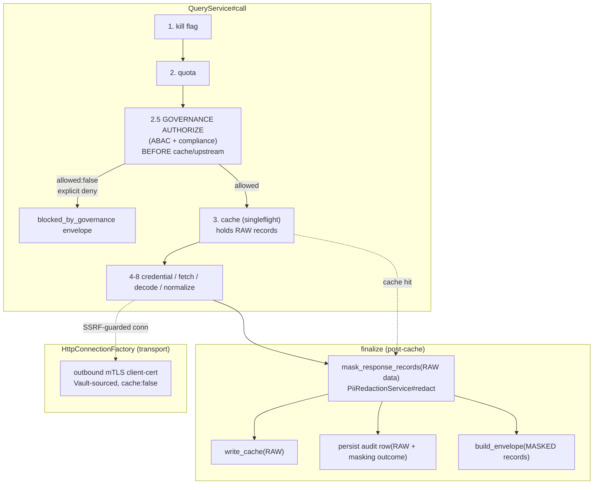

The governance backend lives in `server/app/services/ai/data_sources/governance_service.rb`; the mTLS path lives in `client_ssl_options`/`load_mtls_material` within `http_connection_factory.rb`.

### Authorization: per-agent ABAC + compliance

`GovernanceService#authorize(context:)` returns `{ allowed:, reason:, enforcement: }` and is wired into `QueryService#call` as **stage 2.5** — *after* the kill-flag and quota gates, *before* the cache lookup and any upstream dispatch — so a denied read never touches the cache or the network, exactly mirroring the kill-flag and SSRF blocked-before-dispatch short-circuits. On an explicit deny, `QueryService` returns a `blocked_by_governance` envelope (`status: "blocked"`, a `governance_blocked` anomaly). Authorize composes two checks in order — ABAC first, then compliance — and returns the first deny.

**(1) Per-agent ABAC** (`Ai::AgentPrivilegePolicy`). Each data source is addressed by the resource token `"data_source:<uuid>"` (`RESOURCE_PREFIX = "data_source"`). The service resolves the agent's trust tier, loads `Ai::AgentPrivilegePolicy.applicable_to(agent.id, trust_tier)`, and **denies only on an *explicit* deny** of the resource — when the token (or `"*"`) appears in a policy's `denied_resources`. The posture is deliberately **default-allow, deny-on-explicit**, *not* require-explicit-grant: if **no** applicable policy mentions `"data_source:<id>"` at all (absent from both `allowed_resources` and `denied_resources`, no wildcard), the request is **allowed**. This keeps every existing fetch working until an operator authors a resource-scoped policy. A **user/system context** (no agent) skips ABAC entirely — the controller already authorized the human via `ai.data_sources.*` permissions, and ABAC is a per-*agent* overlay.

**(2) Data residency / consent compliance** (`Ai::CompliancePolicy`). The service evaluates every `Ai::CompliancePolicy.active.by_type("data_access").ordered_by_priority` policy that `#applies_to?` the source, calling `policy.evaluate(context)` with a context carrying the source's `region`/`residency` and `classification` (read from `metadata.governance`), the agent's trust tier, the account id, and the **mTLS posture** (`mtls: present?`) so residency/consent conditions can match. The split between **blocking** and **advisory** is load-bearing:

| Policy kind | On `evaluate → allowed:false` |
|-------------|-------------------------------|
| **Blocking** (`policy.blocking?`) | **Denies** the read, **records the violation** (`record_violation!` with `source_type: "data_source"`, severity `high`), and returns `{ allowed: false, … }` |
| **Advisory** (non-blocking: log/warn/require_approval) | **Logged** as a non-blocking flag, **never denies** the read here |

Unlike ABAC, compliance is **account-wide** — a `data_access` block applies to *every* read of the source, agent-initiated or not. That is why a user/system fetch is short-circuited to allow **only** when the source *also* has no `metadata.governance` config; a governance-configured source still runs the full compliance check even for a human-initiated read.

### Posture: fail-OPEN on infra error, fail-CLOSED on explicit deny

The governance overlay sits on a read path the controller already authorized, so its failure semantics are asymmetric and deliberate:

- **An *explicit* policy decision is honored — fail-closed.** An applicable privilege policy that explicitly denies the resource, or a *blocking* compliance policy returning `allowed:false`, makes `authorize` return `allowed:false` and the read is blocked.
- **An *infra* fault fails open.** A raised exception while *resolving or evaluating* policies (a policy-engine bug, a malformed policy row) is rescued to `allowed:true` and logged **by class only** (never the message or material), so a governance fault degrades to "allow + log" rather than hard-failing every query. `QueryService` wraps the call in a second defense-in-depth rescue with the same fail-open contract. The principle is: *infra error ⇒ open; explicit deny ⇒ closed.*

### Masking: PII/secret redaction on fetch

`GovernanceService#mask_records(records)` returns `{ records:, masking_applied:, masked_count: }` and strips PII/secret material out of the **returned** records. Three properties define it:

- **Redact-all-detected, per value.** It deep-walks every Hash/Array and, for every **string value**, runs the shared `Ai::Security::PiiRedactionService#redact(text:, context:, log: false)` — the *redact-all-detected* primitive that strips **every** detected PII/secret pattern, not a classification-threshold subset. Keys are never masked; non-string scalars pass through untouched. (It deliberately uses `#redact`, **not** `#apply_policy`: `apply_policy` threshold-filters by classification — so a secret can slip through at a permissive level — **and** writes a policy-enforcement audit row *per value*, a write-amplification storm on a large response. `#redact` strips everything detected and is silent.) The redaction service is instantiated **once** per call, and a pathological payload is capped at `MAX_MASKED_VALUES = 50_000` (flagged, not blocked).
- **Post-cache, per-request — the cache holds RAW.** Masking is applied at the single envelope-finalization chokepoint (`QueryService#finalize`), computed **once on the RAW decoded data** *after* a cache hit or fresh decode. The cache write and the persisted audit row both consume the **RAW** records; only the **returned** envelope carries the **masked** records. So the cache stays **classification-agnostic** — the same cached payload can be masked differently per requester/policy without poisoning the shared entry — and the audit row records the *real* masking outcome (`masking_applied`, `masked_field_count`) rather than a hardcoded flag.
- **OFF by default, explicit opt-in.** Masking is enabled only when `metadata.governance` requests it — a truthy `"mask"`, or a configured `"mask_at_classification"` marker. A bare `"classification"` label (used only for the compliance context) does **not** by itself turn on egress masking: labeling a source's sensitivity and stripping values from its payload are separate decisions. A masking *fault* fails closed on availability the safe way — it logs the class and returns the records with `masking_applied:false` flagged, so provenance shows masking did not run rather than silently leaking or breaking the response.

### Outbound mTLS client certificate

A data source can require the platform to present a **client certificate** on the egress TLS handshake — mutual TLS to a partner API that pins clients. This is built in `HttpConnectionFactory.client_ssl_options` and is, again, **OFF by default**: when no `configuration["mtls"]` block is present (or it is disabled), the method returns `{}`, the Faraday options carry **no** `ssl:` key, and the connection is byte-for-byte identical to the pre-mTLS build.

- **Vault-sourced, never cached.** The cert/key/CA PEM bytes live **only in Vault** — the config carries a reference (`vault_path`, or a `credential_id` resolved via the account-scoped credential convention), never the material. The secret is read fresh from Vault on every connection build with **`cache: false`** — a client *private key* must never persist to `Rails.cache` (Redis / Solid Cache), honoring the absolute vault-only-storage rule for key material. mTLS is rare and the connection is short-lived, so a per-build read is cheap. The cert is parsed into `OpenSSL::X509::Certificate` + `OpenSSL::PKey` objects (an optional CA chain is written to a deduplicated, mutex-guarded per-process tempfile because Faraday's `ssl.ca_file` wants a path); the key is **never** logged or stringified.
- **Required vs optional — fail-closed vs degrade.** The `"required"` flag picks the failure mode when the material can't be loaded (Vault returned nothing usable, or the PEM is malformed): **`required: true` fails closed** — it raises `MtlsConfigError`, which `QueryService` turns into an error envelope, so a mandatory-mTLS source can never silently fall back to an unauthenticated TLS attempt. **`required: false` degrades** — it returns `{}` and proceeds with a normal (no client cert) handshake. Either way the `MtlsConfigError` message is deliberately **non-secret** (no path, no key, no cert) and the underlying exception is logged **by class only**, since it may embed PEM bytes or a Vault path.
- **mTLS posture surfaces into compliance.** `GovernanceService` reads only *whether* `configuration["mtls"]` is present (a boolean) into the compliance evaluation context (`mtls: present?`) — the cert material itself is never read there. A residency/consent policy can therefore condition on "this source is mutually authenticated" without the governance service ever touching the key.

### Off by default

The whole Phase-4b-2b layer is dormant until a source opts in. With **no agent** (user/system context) **and no** `metadata.governance` block, `authorize` short-circuits to allow before any policy resolution; with no `metadata.governance.mask` marker, `mask_records` is a passthrough; with no `configuration["mtls"]` block, `client_ssl_options` returns `{}`. So a default source runs the **byte-for-byte** Phase-1/4b-2a fetch path — no policy queries, no per-value redaction walk, no Vault read, no `ssl:` key on the connection. You pay only for what you turn on, per source.

## Transform & retrieval shaping (Phase 4b-3a)

The layers above decide *whether* a fetch happens (governance), *what secret* it signs with (brokering), and *which bytes the caller may see* (masking). **Retrieval shaping** is the orthogonal concern of controlling *the shape and the cost* of what comes back: reshape the canonical records into the projection an agent actually wants, preview a fetch's price before paying it, and surgically evict cache entries by what they describe rather than by key. Three independent capabilities — a config-driven **transform pipeline**, a **dry-run + cost estimate**, and **tag/surrogate-key cache invalidation** — and, like every layer before them, all three are **OFF / zero-overhead by default**: a source with no `endpoint.transforms`, a caller who doesn't pass `dry_run`, and a cache user who never calls `invalidate_by_tag` all run the byte-for-byte pre-4b-3a path.

### The transform pipeline — config-driven, pre-cache shaping

`Ai::DataSources::TransformService` (`transform_service.rb`) reshapes the canonical `Array<Hash>` records into the projection a caller wants — **without code**. It is the *shaping* arc of the *new-source-is-config* principle: a source declares an **ordered pipeline** of operations on the endpoint, and the service applies them in sequence, the output of each step feeding the next. Its surface mirrors `NormalizationService` exactly — `TransformService.new(transforms_config).apply(records)` — and a blank / non-Hash / pipelineless config is a **passthrough** (the records are returned unchanged).

The pipeline is a list under `"pipeline"`, each step a Hash declaring an `"op"` plus op-specific keys:

```ruby
endpoint.transforms = {
  "pipeline" => [
    { "op" => "flatten", "separator" => "." },                  # {"a"=>{"b"=>1}} -> {"a.b"=>1}
    { "op" => "unnest",  "field" => "items" },                   # one record per array element
    { "op" => "rename",  "map" => { "temp_c" => "temperature" } },
    { "op" => "computed", "as" => "label",                       # whitelisted derivation
      "fn" => "template", "template" => "{city}: {temperature}" },
    { "op" => "select",  "fields" => ["city", "temperature", "label"] }
  ]
}
```

The five structural ops:

| Op (aliases) | Effect |
|--------------|--------|
| `flatten` | Flatten nested hashes to dotted keys (`{"a"=>{"b"=>1}}` → `{"a.b"=>1}`). `separator` (default `.`); optional `only`/`except` **top-level** field lists scope which keys are descended into. Descent is depth-bounded (`MAX_FLATTEN_DEPTH = 32`) so a pathologically deep hash can't exhaust the stack. |
| `unnest` (`explode`) | Emit **one record per element** of the Array at `field`. A Hash element merges over the parent's other fields; a scalar lands under a `value` key. Records without an Array at `field` pass through. **Bounded** at `MAX_RECORDS = 50_000` — fan-out overflow is dropped and logged, never an OOM. |
| `select` (`project`) | Keep only `fields`, **or** remove `drop`. `fields` wins if both are given. |
| `rename` | Rename keys per the `map` `{from => to}`; unmatched keys are untouched. |
| `computed` | Write a derived value to the `as` field using a **whitelisted** computed op over existing fields (below). |

**The `computed` op is a whitelisted mini-interpreter, not code execution.** This is the load-bearing security property. Every computed operation dispatches through an **explicit `case` statement** — `concat`, `coalesce`, the arithmetic ops `+`/`-`/`*`/`/`, `upcase`/`downcase`/`strip`, `substring` (`slice`), and `template` (`format`) — each reading **only existing record fields by name**. There is **no** `eval` / `instance_eval` / `class_eval` / `send` / `public_send` to arbitrary methods or `Kernel`; an unrecognized computed op is skipped (returns nil), never executed. So a source can declare `{city}-{country}` string interpolation or a `price * quantity` total from config, but cannot smuggle arbitrary Ruby through a transform. (Numeric guards round out the safety: division by zero → nil; a non-finite Float result from huge operands → nil.)

The pipeline runs **PRE-CACHE**. `QueryService#decode_and_normalize` calls `apply_transforms` at **stage 7a** — *after* `NormalizationService` and *before* the cache write / persist / mask (see [The QueryService pipeline](#the-queryservice-pipeline)). Because the transform is deterministic given `(config, records)`, the **cached payload is already the transformed shape** — the reshape is computed once per fetch, never per read. This is the deliberate contrast with [masking](#masking-piisecret-redaction-on-fetch): masking runs **post-cache, per-request** (so the same cached bytes can be redacted differently per caller and the cache stays classification-agnostic), whereas transforms run **pre-cache, once** (the shape is a property of the source's contract, identical for every reader, so baking it into the cache is correct and cheaper). Provenance surfaces `transforms_applied` (true/false) and the post-transform `record_count` is honest because the count is read after the reshape.

**Resilience.** The service is pure / stateless — no DB, Redis, or network. A malformed step is logged and **skipped** (the records flow through unchanged), `apply` is fully rescued and returns best-effort records on any fault, and `QueryService#apply_transforms` adds a second defense-in-depth rescue that falls back to the **untransformed** records with `transforms_applied: false` and a `transform_error` anomaly — so a bad transform config can never break a fetch. Pipeline length is capped (`MAX_PIPELINE_STEPS = 100`; excess dropped) so an oversized config can't blow up per-request cost. **OFF by default:** gated on `endpoint.transforms?` — a blank pipeline means the records pass through byte-for-byte with zero transform code run.

### Dry-run + cost estimation — preview without an upstream call

A caller can ask "**what would this fetch cost, and would it even hit the upstream?**" without actually fetching. `QueryService.new(..., dry_run: true).call` short-circuits at **stage 2.6** — *after* the kill-flag, quota, and governance gates (so a dry-run respects the **same** permissions a live read would; a denied read never gets an estimate) but *before* any cache lookup, credential resolution, signing, upstream dispatch, or cache write. It returns a normal-shaped `FetchEnvelope` with `status: "dry_run"`, empty `data`, and a pre-execution **estimate** block on provenance.

The estimate (`build_cost_estimate`):

```ruby
provenance[:estimate] = {
  would_fetch:,          # FALSE when a fresh cache hit exists (the live call is served from cache)
  from_cache:,           # the inverse — a live call would be a cache hit
  source_url:,           # REDACTED — built via the SAME pure build_request path, never signed
  http_method:,
  estimated_cost_usd:,   # from source cost config, else historical avg, else 0.0
  estimated_rows:,       # avg rows over recent successful non-cached queries (nil when cold)
  cache_hit_available:
}
```

Three properties make it honest and side-effect-free:

- **No upstream call, no credentials.** The would-be `source_url` is resolved via the **same pure `adapter.build_request` → absolute-URL path** the live fetch uses, then **redacted** — but no credential is resolved or signed and nothing is dispatched. The cache is *probed* with `read_stale` (not `read`) deliberately: `read_stale` exposes the `hard_expired` flag needed to report `would_fetch` correctly **and** does not count a hit/miss, so a dry-run probe never pollutes cache metrics or mis-reports freshness. A grace-window (stale) entry is correctly reported as "a live call **would** still fetch".
- **`would_fetch` reflects the real decision.** It is **false** when a fresh (not-hard-expired) cache entry exists — the live call would be served from cache and skip the upstream — and **true** otherwise. So a caller can see, before committing, whether the fetch is free (cached) or will spend a request against the source's budget.
- **Cost from the same pricing path as a real fetch.** `estimated_cost_usd` prefers the source's declared `configuration["cost_per_request_usd"]` + `cost_per_gb_usd × avg_gb` — mirroring exactly how `Ai::CostAttribution.from_data_source_query` prices a *real* fetch — using the average historical transfer size (over the last `DRY_RUN_HISTORY_SAMPLE = 20` successful **non-cached** queries for this endpoint) for the GB term. With no cost config it falls back to the average historical `actual_cost_usd`, and finally to `0.0` on a cold source. Every history/cost helper is individually rescued and degrades to nil/0 rather than failing the preview.

Critically, the dry-run still **enforces the kill-flag and full governance gates** before producing an estimate — the gates run in `call` ahead of the stage-2.6 short-circuit — so a dry-run can never be used to probe a source the caller is forbidden to read. The `"dry_run"` status is deliberately **not** a `DataSourceQuery::STATUSES` member: the dry-run path **persists nothing** (no query row, no audit chain entry, no cost row, no cache write) — it is a pure no-side-effect preview. **OFF by default:** `dry_run` defaults to `false`, so the live path is byte-for-byte unchanged.

### Tag / surrogate-key cache invalidation

Beyond the prefix-based `invalidate(data_source:, endpoint:)` ([Response cache](#response-cache)), `ResponseCacheService` carries a **surrogate-key (tag)** index so entries can be evicted by *what they describe* rather than by key. Each cached entry's key is added to a Redis SET per tag (`data_source_cache:tag:<tag>`), and `invalidate_by_tag(tag)` deletes every cache key recorded in that tag's set in one shot — no keyspace `SCAN`.

- **Default tags on every write.** Unless a caller supplies explicit `tags:`, every entry is tagged with `default_tags`: `ds:<data_source_id>`, and (when an endpoint is present) `endpoint:<endpoint_id>` and `slug:<endpoint_slug>`. So **every** cached entry is already tag-addressable by source, endpoint, or slug without the writer doing anything — `invalidate_by_tag("slug:current_weather")` clears every param-variant cached under that endpoint slug across the source.
- **Best-effort, isolated, fail-open.** Tag indexing is decoupled from the payload write: a tag-index failure (e.g. Redis `SADD` unavailable) is swallowed and **never** fails the cache write it follows. Each tag set's TTL is (re)armed to outlive the longest entry it points at (EXPIRE only extends, never shortens). A blank/unknown tag invalidates nothing and returns 0, and any Redis error logs and returns 0 rather than raising — the same fail-open posture as the rest of the cache.

This is the surgical complement to prefix invalidation: prefix-delete evicts *a source or an endpoint's* variants by key structure; tag-delete evicts *everything sharing a surrogate key* (and a caller can mint cross-cutting custom tags at write time for finer-grained groupings). **OFF / zero-overhead by default** in the sense that nothing changes behavior until you *call* `invalidate_by_tag` — default tagging is a cheap `SADD` on writes that already happen, and the index self-expires.

### Off by default

All three retrieval-shaping capabilities are dormant until used. With **no** `endpoint.transforms` pipeline, `apply_transforms` returns the records with `transforms_applied: false` and runs zero transform code; with `dry_run` unset (`false`), the live fetch path is untouched; and `invalidate_by_tag` only does work when a caller invokes it. So a default source runs the **byte-for-byte** pre-4b-3a path — no reshape pass, no estimate computation, no extra Redis round-trips beyond the cheap default-tag `SADD` on a write that already occurs. You pay only for what you turn on.

## Onboarding portability (Phase 4b-3b)

Every layer above shapes one *live* fetch. **Onboarding portability** is the orthogonal concern of moving a source's **configuration** around — out of one account and into another, into a shared starter library, or backward in time to an earlier revision — *without ever moving a secret*. It is the **"config, not code"** principle applied to the source definition itself: a configured `Ai::DataSource` (plus its endpoints) round-trips through a **credential-free manifest**, a curated **template library** ships account-agnostic starters built from that same manifest shape, and an append-only **config-version history** lets any source be snapshotted and rolled back. The defining constraint is the one that makes all three safe to serialize, check into the repo, and replay: **the manifest is credential-free by construction — import never sets credentials.**

All backend code lives under `server/app/services/ai/data_sources/` (`config_portability_service.rb`, `template_library.rb`) plus the `Ai::DataSourceConfigVersion` model.

```mermaid
flowchart LR
    DS[(Ai::DataSource + endpoints<br/>+ credentials [NOT traversed])]
    CPS[ConfigPortabilityService]
    MAN["credential-free MANIFEST<br/>{manifest_version, source, endpoints}<br/>auth_scheme NAME only<br/>auth_config SANITIZED"]
    TL[TemplateLibrary<br/>seeded account-agnostic starters]
    CV[(Ai::DataSourceConfigVersion<br/>append-only snapshots)]
    DST[(Ai::DataSource in ANOTHER account<br/>credentials added SEPARATELY)]

    DS -->|export| CPS --> MAN
    MAN -->|import never sets credentials| CPS --> DST
    TL -->|install = import seeded manifest| CPS
    DS -->|snapshot!| CV
    CV -->|rollback! replays a prior manifest| CPS
```

### The credential-free manifest

`Ai::DataSources::ConfigPortabilityService.new(account:).export(data_source)` turns a source into a string-keyed manifest Hash:

```ruby
{
  "manifest_version" => 1,
  "source"    => { … SOURCE_EXPORT_KEYS only … "auth_scheme" => <NAME>, "auth_config" => { … sanitized … } },
  "endpoints" => [ { … ENDPOINT_EXPORT_KEYS only … }, … ],   # ordered by slug → byte-stable
  "exported_at" => nil   # left nil so the manifest is byte-stable / diffs cleanly across exports
}
```

The serialization is an **allowlist**, not a blocklist — only the columns named in `SOURCE_EXPORT_KEYS` / `ENDPOINT_EXPORT_KEYS` are copied, so a new secret-bearing column added later is excluded by default rather than leaking until someone remembers to redact it.

**What is included** — the portable *structure* and *non-secret config*: the source's `name`/`slug`/`source_type`/`category`/`protocol`/`api_base_url`/`description`, its crawl-politeness + priority + capability flags, and the free-form `configuration`/`rate_limits`/`default_parameters`/`metadata` jsonb; and per endpoint the full retrieval **contract** — `http_method`/`path_template`/`query_template`/`body_template`/`response_format`/`response_mapping`/`response_schema`, plus `pagination`/`incremental`/`transforms` and the `cache_ttl_seconds`/`monitorable`/`change_detection` knobs.

**What is excluded** — anything secret or non-portable. The **entire `credentials` association is never traversed** (no `Ai::DataSourceCredential` row, no encrypted column, no Vault handle that resolves to material is ever read). Identity + runtime/usage state is dropped too — `id`/`account_id`/timestamps, `health_status`/`last_health_check_at`/`last_used_at`, and the evaluation counters (`effectiveness_score`/`usage_count`/`positive_`/`negative_usage_count`) on the source; the runtime cursor/etag/last-modified/contract columns on each endpoint. A manifest is a *definition*, not a snapshot of a source's live state.

**Auth travels as a name, not a key.** The manifest carries the `auth_scheme` **NAME only** (`api_key`/`bearer`/`aws_sigv4`/…) — enough to describe *how* the source authenticates, never the secret it authenticates *with*. `auth_config` is exported only through a sanitizer (`sanitize_auth_config`) that keeps **non-secret broker knobs** (`token_url`, `role_arn`, `region`, `scope`, `vault_path`, …) and drops everything else. (Notably, an AWS STS `external_id` is deliberately **excluded** — it is a confused-deputy *shared secret* the importing operator re-supplies with the credential, not a portable structural knob.)

**Free-form jsonb is secret-scrubbed.** Because `configuration`/`metadata`/`default_parameters`/`query_template`/… are open Hashes a user could plant a secret into, every exported jsonb value is recursively walked (`scrub_value`) and any **secret-keyed** entry is dropped — nested Hashes and Arrays included. The same `secret_key?` denylist (exact names like a bare `token`/`key`/`apikey`, plus substrings like `secret`/`password`/`private`/`access_key`/`web_identity_token`) gates the auth_config allowlist as **defense in depth**: a knob must be both allowlisted *and* not flagged secret to survive. So a secret buried in a free-form column can never ride the manifest out.

### Export / import round-trip

The point of the manifest is **"config, not code" portability across accounts**: export a source from account A, hand the manifest to account B, and `import` re-materializes the same source definition there — with B's own credentials attached afterward, never A's.

`import(manifest, slug: nil, dry_run: false)` is scoped to the service's `@account` and is idempotent by slug: the source is `find_or_initialize_by(slug:)` (the manifest's slug, or an explicit override for cloning), and endpoints are upserted by slug — so importing the same manifest twice updates in place rather than duplicating. The whole apply runs in **one transaction** (a failed endpoint rolls the whole import back, never leaving a half-applied source), and a `dry_run` returns a preview of the create/update actions while persisting nothing.

Two invariants make import safe to feed a hand-edited or third-party manifest:

- **Import never sets credentials.** This is the contract's load-bearing half. `import` writes only the allowlisted source/endpoint attributes; it never touches the `credentials` association. After an import the source exists but is *unauthenticated* until an operator attaches a credential separately via the credentials API/UI — exactly mirroring `export`'s never-traverse-credentials half. A source moved between accounts therefore *cannot* carry account A's secret into account B.
- **The sanitizer re-runs on the way in.** Import does not trust an inbound manifest to already be clean — it re-applies the export allowlist (`source.slice(*SOURCE_EXPORT_KEYS)`) and re-runs `sanitize_auth_config`, so a hand-edited manifest cannot smuggle a secret-keyed value or a non-allowlisted column into the stored record. `account_id` is never assigned from the manifest (the account is pinned to `@account`), and on a clone under a new slug the source `name` is de-duplicated to respect per-account name uniqueness.

### The template library

`Ai::DataSources::TemplateLibrary` is a curated, **account-agnostic, credential-free** set of **seeded starter manifests** — the onboarding story made concrete. Each entry is a manifest in the *exact* shape `ConfigPortabilityService` emits and accepts, so installing a template is literally "import this seeded manifest into your account": `TemplateLibrary.install(slug, account:)` routes straight through `ConfigPortabilityService#import` (honoring the same `slug:`/`dry_run:` overrides).

A template is a **starting point, not a runnable source**: the `api_base_url` points at a documented *public* endpoint (no private host), `auth_scheme` is `none` or — to show the common case — `api_key` with **no key material** (just the scheme name), and the endpoints describe the retrieval contract only. Because installation goes through `import`, it inherits both guarantees: **installation never sets credentials** (the operator attaches one afterward when auth is required), and the **auth_config sanitizer re-runs** on the way in — a defense-in-depth promise that even a hand-edited template cannot land anything secret-ish in a stored record. The seeded starters cover the generic shapes (a REST/JSON scaffold, a public RSS/Atom feed, a GraphQL scaffold) plus a genuinely key-free working example (Open-Meteo) that doubles as a "this actually runs out of the box" reference.

### Config versioning + rollback

`Ai::DataSourceConfigVersion` is an **append-only** history of credential-free manifest snapshots, one row per `(source, version)` with a monotonically increasing `version` (mirroring the per-endpoint schema-version history, but scoped to the *whole source's* portable config). Each row stores the `export` manifest in a jsonb column and a `created_by_type` provenance tag — `manual` (an explicit operator snapshot), `auto` (captured automatically, e.g. before an automated config change), or `rollback` (the pre-rollback state preserved below). Because the stored manifest is the credential-free `export`, **a version row never contains secrets** — the history is as safe to retain and inspect as the manifest itself.

- **`snapshot!(data_source, created_by_type:, note:)`** persists the source's *current* `export` at the next sequential version (`next_version_for` is a `MAX(version)+1` check-then-act, so a concurrent snapshot that collides on the unique `(source, version)` index simply retries a couple of times).
- **`rollback!(data_source, version)`** returns a source's config to an earlier snapshot by **replaying that historical manifest through `import`** — which, being `import`, *still never touches credentials*: a rollback restores structure/endpoints/non-secret config, never re-introduces an old secret. Rollback is itself made reversible and audited: it captures the **pre-rollback** state first, but **persists that `rollback` snapshot only once the replay succeeds** — a failed replay (which `import` rolls back transactionally) leaves no spurious version behind. On success the pre-rollback snapshot is recorded with a note, so the rollback can itself be rolled back.

## Multi-source coordination & RAG ingestion (Phase 4b-3c)

Every layer up to here governs **one** fetch against **one** endpoint. **Phase 4b-3c** is the long tail that comes after the single-fetch contract is solid: an agent rarely wants *a* source — it wants *the right answer*, assembled from several sources, kept available when one is down, reproducible after the fact, and queryable long after the bytes arrived. Four small, independent coordinators add exactly that on top of the existing pipeline — **deterministic reconciliation** (merge overlapping results from many sources by canonical key), **failover** (re-query an ordered mirror list, first success wins), **deterministic replay** (re-serve a *recorded* fetch from its audit row + cache without an upstream call), and the **RAG ingestion bridge** (turn fetched records into embedded knowledge-base documents so the data can be *interpreted over time*).

The load-bearing invariant ties all four to everything above: **every byte they touch still comes through the full governed `QueryService`** ([The QueryService pipeline](#the-queryservice-pipeline)). Reconciliation, failover, and the ingestion bridge each call `QueryService` per source — so the kill-flag, per-source + per-agent quota, query-time ABAC/compliance governance, credential brokering, the response cache, SSRF egress validation, the circuit breaker, schema/quality, redacted+hash-chained audit persistence, and cost attribution **all apply independently per source**. These coordinators add **no fetch path of their own and no bypass**: reconciliation and failover only *sequence* `QueryService` calls and shape/annotate the results; replay deliberately performs **no** fetch at all (it reconstructs from what a prior governed fetch already sealed). Reconciliation is **pure/stateless** (no I/O); the others are individually rescued and **never raise** into the caller.

All backend code lives under `server/app/services/ai/data_sources/` (`reconciliation_service.rb`, `failover_service.rb`, `replay_service.rb`, `rag_ingestion_service.rb`).

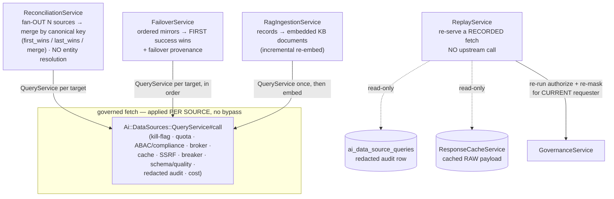

### Deterministic reconciliation — canonical-key merge

`Ai::DataSources::ReconciliationService.new(key:, strategy:).reconcile(record_sets)` collapses several `Array<Hash>` record sets — the records each governed fetch returned — into **one** list by **exact** canonical-key match. It is the merge half of the multi-source long tail: when the same logical entity is served by several endpoints or sources (a primary + mirrors, or complementary feeds), a caller ends up with N overlapping sets that share a canonical key field; this service deduplicates and combines them per a fixed strategy.

The three strategies decide how a group of same-key records collapses to one winner:

| Strategy | Collapse rule |
|----------|---------------|
| `first_wins` | Keep the **first** record seen for the key (earliest set, earliest index); later duplicates are discarded. |
| `last_wins` (**default**) | Keep the **last** record seen; each later duplicate **wholly replaces** the prior winner. |
| `merge` | **Shallow, one-level** field-merge: start from the first record, then overlay each later same-key record's **non-nil** fields on top (later non-nil wins per field; earlier values survive where the later record is nil/absent). Nested Hashes/Arrays are replaced wholesale, never deep-merged — which keeps the merge deterministic and unambiguous. |

Key semantics are **exact, never fuzzy**. The grouping value is the key field coerced to a String (so `1` and `"1"` reconcile, and the key may live under a String **or** Symbol field name), but `"Acme"` and `"ACME"` are **different keys** — the service never guesses two records are the same. Records **missing** the key entirely are not dropped; they pass through unmerged in first-appearance order, each tagged with an `_unreconciled` flag so a caller can tell a pass-through from a reconciled record. Output order is **stable**: the first appearance of each distinct key fixes its slot regardless of strategy (a `last_wins` winner stays in the key's original position, it does not move to the end). The result is bounded (`MAX_OUTPUT = 100_000`) — past the cap, new distinct keys/keyless rows stop being admitted while updates to already-admitted keys still apply, so the cap never yields a partially-merged winner.

> **Hard non-goal: this is NOT entity resolution, and NOT a join engine.** Reconciliation is deterministic canonical-key merge — an in-memory group/collapse — and nothing more. There is **no** cross-source SQL/join, **no** predicate pushdown or query plan, **no** query-plan IR, **no** migration FSM, and explicitly **no probabilistic / fuzzy entity resolution**. Matching is purely by the exact string form of the canonical key. This boundary is what keeps `reconcile` pure, stateless, and safe to call inline on a request: it touches no DB, network, Redis, or clock, never mutates its inputs (winners are duped before any in-place overlay), and the same inputs always yield the same output. A reconcile fault degrades to a flat pass-through of all input records (logged by class only) rather than breaking the caller.

### Failover / mirror — ordered governed re-query

`Ai::DataSources::FailoverService.new(account:, agent:, user:).query(targets, params:)` is the resilience half. Given an **ordered** list of equivalent `{ data_source:, endpoint: }` targets (primary first), it tries each **in order** through a complete `QueryService#call` and returns the **first** successful `FetchEnvelope` — stopping immediately, so no further mirrors are touched once one wins. Where reconciliation *merges* many sources, failover *picks one healthy source* from a preference list.

A target **succeeds** when its envelope has `success: true`. A target **fails** when its envelope is `success: false` (error / timeout / rate_limited / blocked) **or** the `QueryService` call raises (defensive — `QueryService` is documented never to raise, but a malformed target/construction fault is caught here and counted as a failure rather than aborting the whole failover). A failed attempt advances to the next target with **no sleep / backoff** — the per-source circuit breaker already governs upstream pressure. When **every** target fails, the service returns the **last** real failure envelope (audited per source), not a synthesized one, so the caller sees a true governed failure; only an empty target list yields a synthesized "nothing to try" error envelope.

Because each attempt is a full governed fetch, **every governance gate applies independently per mirror** — a denied or quota-throttled mirror simply counts as a failure and the loop moves on, and a mirror may legitimately win by serving a warm **cache** hit. The service stamps **failover provenance** onto the returned envelope without disturbing the rest of it:

| Provenance flag | Meaning |
|-----------------|---------|
| `failover_used` | Boolean — true when more than one target was attempted (the primary did not win on the first try) |
| `failover_attempts` | Integer — how many targets were actually tried |
| `failover_source` | String\|nil — slug of the target that **won**, or nil when all failed |

Every returned envelope — success, all-fail, or no-targets — carries the same three keys (routed through one `augment` step), so a caller can read failover bookkeeping off provenance unconditionally. The default single-source path is unaffected: a caller with exactly one target gets that source's envelope with `failover_used: false`, `failover_attempts: 1`. Caught exception messages are PII-redacted before they land in an envelope or log.

### Deterministic replay — re-serve a recorded fetch, no upstream call

`Ai::DataSources::ReplayService.new(account:, agent:).replay(query_ref, params:)` reconstructs a `FetchEnvelope`-shaped view of a **past** query from its already-redacted `Ai::DataSourceQuery` audit row — an auditor's reconstruction, **not** a re-execution. A replay **never** performs an upstream fetch, **never** re-signs a request, and **never** resolves credentials. The forensic provenance (slug, endpoint, `response_sha256`, the **already-redacted** URL, `schema_valid`, cached/served-stage, anomalies, the mirrored audit-chain anchor, the original live status, the recorded timestamp) is rebuilt straight from the row; the returned status is `"replayed"` (distinct from the original live status, preserved under `provenance.original_status`), and `duration_ms` is `0` because a replay does no work.

The audit row deliberately stores only a redacted **snippet** + the `response_sha256`, never the full body — so a replay can surface the **body** only when the **original** `(source, endpoint, params)` cache entry is *still present*. The row stores a one-way `params_hash`, not the params, so the cache key is otherwise unreconstructable; the cache lookup therefore runs **only** when the caller supplies the original `params:` *and* their digest (recomputed exactly as `QueryService` does) **matches** the recorded `params_hash` — reading the same entry, never a different param-variant's. Any miss (no params, hash mismatch, evicted entry, a row predating `params_hash`, a decode fault) degrades to `data: []` with a `payload_not_cached` provenance note — forensic metadata only. The cache read is read-only and never writes.

The defining security property is that **a replay can never leak more than a live read would today**. When the body *is* recovered, the replay re-runs **both** halves of `GovernanceService` for the **current** requester before returning anything:

- **Re-authorize.** It runs the same `GovernanceService#authorize` gate a live read would (ABAC + compliance) for the current account + agent. If the current requester is **not** authorized for this source now, the cached body is **withheld entirely** — the forensic provenance still returns. This gate **fails closed** (withhold on any error), which is safe precisely because the provenance is returned regardless.
- **Re-mask.** The recovered records are run back through `GovernanceService#mask_records` for the current requester (account + agent), so the per-request egress redaction of a live read still applies on replay. A masking fault degrades to passthrough-but-flagged (`masking_applied: false`), exactly like the live path's masking rescue — never leaking unmasked data and never breaking the replay.

Replay is **account-scoped** (a `query_ref` outside the account is treated as not-found; `query_ref` may be a row UUID **or** a `correlation_id`) and fully resilient — every failure path rescues to a safe error result Hash rather than raising.

### The RAG ingestion bridge — records → embedded KB documents

`Ai::DataSources::RagIngestionService.new(account:, user:).ingest(data_source:, endpoint:, knowledge_base:, records:, key:)` is the bridge from point-in-time fetched records to **semantically retrievable** knowledge. The `QueryService` returns canonical, normalized, masked records *now*; this bridge turns a batch of them into embedded `Ai::Document` rows in an `Ai::KnowledgeBase`, so the same data is queryable through the existing RAG retrieval path (vector / hybrid search) long after the fetch — the "interpret data over time" capability. It is a one-directional **PULL sink** (records in → embedded documents out): it **never** fetches (that is `QueryService`, run upstream of it) and **never** reconciles across sources (that is the coordinator above). It **invents no new model and no new embedding path** — it reuses `Ai::RagService` end to end: `create_document` (builds the `Ai::Document` + checksum) → `process_document` (chunks) → `embed_chunks` (embeds). Documents are stamped `source_type "api"` (the `Ai::Document` allow-list entry that fits an external-API-derived record).

The bridge is **incremental** when a canonical record-key field (`key:`) is supplied — it avoids re-embedding records that have not changed:

| Per record (vs the prior ingested doc for the same `record_key`) | Action |
|------------------------------------------------------------------|--------|
| **unchanged** — same `record_key` **and** same `content_sha256` | **skip** (no re-embed) |
| **changed** — same `record_key`, **different** `content_sha256` | **update** — create the new doc + re-embed first, *then* destroy the stale doc(s), so there is never a window with zero docs for that key |
| **brand new** — no prior doc with this `record_key` | **create** |

Dedup is **source-scoped**, not just KB-scoped: prior docs are located by the `record_key` stamped on each `Document`'s metadata **and** scoped to the same `(data_source, endpoint)` (`metadata->>'record_key'` + `data_source_id` + `endpoint_id`), so two **different** sources that happen to share a record-key value in the same knowledge base cannot clobber each other's documents. Without a `key:`, every record is created (no dedup is meaningful without a stable key). Embedding is **batched** — newly-created chunks are embedded in a **single** post-loop pass (so the KB's indexing finalizes once per ingest, not once per record). The bridge is **bounded** (`MAX_RECORDS_PER_CALL = 5_000`, overflow reported as `capped` and logged, never a runaway embed storm) and **resilient** (a per-record failure is logged + counted under `errors` and never aborts the batch). It is **account-scoped** — the knowledge base must belong to the account. It returns a tally: `{ ingested, updated, skipped, capped, errors, knowledge_base_id }`.

### Surface (MCP)

All four coordinators are exposed to agents through `Ai::Tools::DataSourceTool` (the `data_source_management` MCP tool), which grows from 18 to **22 actions**, each registered per-action in `PlatformApiToolRegistry`:

| Action | Backed by | Permission |
|--------|-----------|-----------|
| `data_source_reconcile` | governed-fetch every `{ data_source_id, endpoint_id }` target, then `ReconciliationService` (`key`, `strategy`); returns merged records + per-source status | `ai.data_sources.query` (it fetches) |
| `data_source_failover_query` | `FailoverService#query` over ordered targets; returns the winning `FetchEnvelope` + failover provenance | `ai.data_sources.query` (it fetches) |
| `data_source_replay` | `ReplayService#replay` by `query_id`/`correlation_id` (optional `params` to recover the re-masked body) | `ai.data_sources.read` |
| `data_source_ingest_to_kb` | governed-fetch a source+endpoint, then `RagIngestionService#ingest` into a KB; returns the ingest counts | `ai.data_sources.manage` (writes docs/embeddings); an agent lacking it **files a proposal** rather than mutating |

Because `reconcile` and `failover_query` fan out, the tool caps targets per call at `MAX_TARGETS = 25` to bound the outbound fan-out a single MCP request can trigger. `data_source_ingest_to_kb` follows the established managed-mutation pattern (mirroring `data_source_rollback_config` / `data_source_introspect`): when the acting agent's account lacks `ai.data_sources.manage`, it files an `Ai::AgentProposal` and returns `requires_approval: true` instead of writing documents.

### Off by default

Like every layer above, none of this changes behavior until a caller *invokes* it. There is no new column, no cron, no background loop, and no per-fetch overhead added to the single-source path — a plain `QueryService` fetch is byte-for-byte unchanged. Reconciliation runs only when you hand it record sets; failover only when you pass a target list; replay only when you ask for a recorded query (and even then performs **no** upstream work); and the ingestion bridge only when you point it at a knowledge base. You pay only for the coordination you actually request.

## Provenance and the FetchEnvelope

Every `QueryService.call` returns a `FetchEnvelope` — the single contract the REST and MCP surfaces both render:

```ruby
{
  success:,            # Boolean
  data:,               # Array<Hash> — canonical, normalized records
  provenance: {
    slug:, endpoint_id:, fetched_at:, from_cache:, cache_age_seconds:,
    response_sha256:,
    source_url:,        # REDACTED
    declared_vs_detected_content_type:,  # { declared, detected, content_type, mismatch }
    charset:, applied_encoding:,
    schema_valid:,      # true | false | nil (no schema)
    record_count:,
    anomalies: []       # e.g. content_type_mismatch, schema_invalid, http_4xx, decode_error
  },
  status:,             # success | error | timeout | rate_limited | blocked | cached
  duration_ms:,
  bytes:,
  error:               # nil on success; redacted message otherwise
}
```

Provenance answers "where did this data come from and can I trust it" without re-fetching: the `response_sha256` fingerprints the exact bytes, `from_cache`/`cache_age_seconds` say how fresh it is, `declared_vs_detected_content_type` exposes any format mismatch, `schema_valid` reports contract conformance, and `anomalies` lists everything that looked off. The same facts are mirrored into the persisted `ai_data_source_queries` row (with the URL/params/snippet redacted), which is itself sealed into the audit hash chain — so the provenance is both returned to the caller and durably auditable.

## Surfaces: REST + MCP

The capability is exposed two ways with 1:1 parity.

### REST

`Api::V1::Ai::DataSourcesController` (under the `Api::V1` namespace) provides catalog CRUD, `test_connection`, `quota_status`, **nested endpoint CRUD**, and the governed **query** action. Endpoint routes nest under a source (`/api/v1/ai/data_sources/:data_source_id/endpoints/...`); the query route is `POST .../endpoints/:endpoint_id/query`, which calls `EndpointQueryRunner` → `QueryService` and renders the envelope through `render_success`/`render_error` (mapping `rate_limited`→429, `blocked`→403, `timeout`→504, else 502). The nested-endpoint logic lives in the `Ai::DataSourceEndpoints` controller concern to keep the controller under 300 lines.

Permissions (checked in `validate_permissions`, skipped for `current_worker`):

| Action(s) | Permission |
|-----------|-----------|
| `index`, `show`, `quota_status`, `test_connection`, `endpoints_index` | `ai.data_sources.read` |
| `create` | `ai.data_sources.create` |
| `update` | `ai.data_sources.update` |
| `destroy` | `ai.data_sources.delete` |
| `endpoints_create`/`endpoints_update`/`endpoints_destroy` | `ai.data_sources.update` **or** `ai.data_sources.manage` |
| `endpoints_query` | `ai.data_sources.query` |

### MCP

`Ai::Tools::DataSourceTool` exposes the same surface to agents over MCP as `data_source_management`, registered per-action in `PlatformApiToolRegistry`. Actions: `data_source_{list, get, describe, query, health, validate_config, create, update, delete}`.

Authorization mirrors REST: read actions require `ai.data_sources.read`, `data_source_query` requires `ai.data_sources.query`, and the mutations require the matching `ai.data_sources.{create,update,delete}` grant (`ai.data_sources.manage` satisfies any mutation). The distinctive piece is the **proposal fallback**: when the acting agent's account lacks the mutation permission, the mutation actions do **not** mutate — they file an `Ai::AgentProposal` (via `Ai::ProposalService`) describing the intended change and return a `requires_approval: true` result for a human to review. This mirrors the established `AgentAutonomyTool`/`AgentManagementTool` pattern. `data_source_query` returns the `FetchEnvelope` verbatim; `data_source_health` reports the quota summary, `ResponseCacheService.metrics`, and the circuit-breaker state; `data_source_validate_config` checks the base URL is SSRF-safe, the auth scheme is known, and the protocol/formats are supported.

## Frontend

The React UI lives under `frontend/src/features/ai/data-sources/`. Two Phase-1 components surface the endpoint and query layers:

- **`DataSourceEndpointsTab.tsx`** — CRUD for a source's endpoints (templates, response format, mapping, schema, cache TTL, `monitorable`).
- **`DataSourceQueryConsole.tsx`** — runs a governed fetch against an endpoint and renders the returned `FetchEnvelope`, including the provenance panel (SHA256, cache age, content-type mismatch, schema validity, anomalies).

TypeScript contracts are in `frontend/src/shared/types/ai.ts`: `AiDataSourceEndpoint`, `DataSourceEndpointRequest`, `DataSourceQueryStatus`, `DataSourceQueryProvenance`, and `DataSourceFetchEnvelope` (which mirrors the backend `FetchEnvelope` exactly).

Phase 2a adds **`DataSourceDiscoveryPanel.tsx`** (a natural-language search box that calls `dataSourcesApi.discover()` → `POST /discover` and renders each ranked source with its four signal chips), mounted at the top of `AiDataSourcesPage.tsx`. `DataSourceCard.tsx` renders a **trust/effectiveness badge** (`Trusted` / `Reliable` / `Fair` / `Low Trust` tiers off `effectiveness_score`) once the serializer surfaces the score. The new TypeScript contracts are `DataSourceDiscoverySignals`, `DataSourceDiscoveryResult`, and `DataSourceDiscoveryResponse` (also in `frontend/src/shared/types/ai.ts`), and the serialized-source type carries `effectiveness_score`/`usage_count`/`positive_usage_count`/`negative_usage_count`/`usage_success_rate`.

Phase 2b adds three endpoint-level surfaces: **`DataSourceSchemaHistoryTab.tsx`** (the recorded schema versions with their drift classification + structural diff), **`DataSourceQualityTab.tsx`** (the latest quality outcome plus the endpoint's configured expectations), and **`DataSourceImportOpenApiModal.tsx`** (OpenAPI import via `spec`/`spec_url`, with a `dry_run` preview). The backing TypeScript contracts (in `frontend/src/shared/types/ai.ts`) are `AiDataSourceSchemaVersion`, `DataSourceSchemaHistoryResponse`, `AiDataSourceExpectation`, `DataSourceQualityResponse`, `DataSourceContractVerdict`, and `DataSourceOpenApiImportResult`, with matching `DataSourcesApiService` methods.

## Discovery & Evaluation (Phase 2)

Phase 1 answers *"fetch from a source I already named"*. **Phase 2a** answers the two questions that come before that — *"which source should I use for this need?"* (discovery) and *"how much should I trust what it returns?"* (evaluation) — by projecting every source into the knowledge graph as an embedded node and rolling each fetch outcome into a single effectiveness score. All of it is **merged, migrated, and smoke-tested**; it reuses the exact same `GraphService` + `EmbeddingService` + pgvector machinery that already backs skill discovery, so there is no new embedding infrastructure.

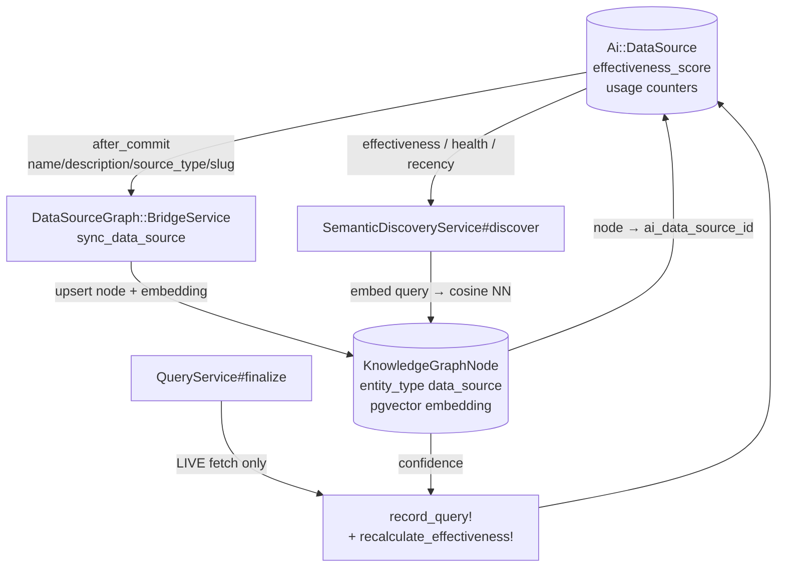

### The knowledge-graph node

`Ai::KnowledgeGraphNode::ENTITY_TYPES` now includes `"data_source"`, with scopes `.data_source_nodes` (`entity_type = "data_source"`) and `.for_data_source(id)`, a `belongs_to :data_source` (`class_name: "Ai::DataSource", foreign_key: "ai_data_source_id", optional: true`), and a new nullable `ai_data_source_id` UUID column. That column is deliberately **not** a `t.references` — it carries a single **partial index** (`WHERE ai_data_source_id IS NOT NULL`) so the overwhelming majority of graph nodes (which are not data sources) pay no write-amplification cost. `Ai::DataSource` closes the loop with `has_one :knowledge_graph_node` (`foreign_key: "ai_data_source_id", dependent: :nullify`).

### BridgeService: embedding sync

`Ai::DataSourceGraph::BridgeService.new(account)` mirrors `Ai::SkillGraph::BridgeService` one-for-one and reuses the **same** collaborators — `Ai::KnowledgeGraph::GraphService` and `Ai::Memory::EmbeddingService`:

- **`#sync_data_source(ds)`** upserts the source's `data_source` node: it generates the embedding from `name | description | category: <source_type> | endpoints: <endpoint names>`, sets `properties` to `{ source_type, protocol, auth_scheme, health_status, is_active, effectiveness_score, usage_count, endpoint_count }` (compacted), links the node via `ai_data_source_id`, and stamps `confidence: 1.0` / `status: "active"` / `last_seen_at`. It **returns `nil` on any `StandardError`** (logged) so a sync failure never propagates.
- **`#sync_all_data_sources`** bulk-syncs all active account sources, returning `{ synced:, failed: }`.

Because it leans on `EmbeddingService`, it **degrades gracefully**: with no embedding backend (test/CI) the embedding comes back nil and the node is still created/updated, just without a vector.

The sync is **wired off `Ai::DataSource`'s `after_commit :sync_to_knowledge_graph`** (on create/update), but **guarded** — it only fires when an embedding-relevant field actually changed:

```ruby
return unless saved_change_to_name? || saved_change_to_description? ||
              saved_change_to_source_type? || saved_change_to_slug?
```

This matters because the evaluation counters (next section) write back to the same row on every fetch; without the guard each fetch would trigger a needless re-embed. On `create` every `saved_change_to_*` is true, so the initial node is always built. (Accountless rows are skipped, and the whole callback degrades to a logged warning rather than raising out of the commit.)

### The effectiveness score

Each source carries an `effectiveness_score` (decimal, default `0.5`) plus `usage_count` / `positive_usage_count` / `negative_usage_count` (default `0`) and `last_used_at` — all added by the `AddEvaluationToAiDataSourcesAndKgLink` migration.

`Ai::DataSource#record_query!(outcome:, freshness: nil, agent: nil)` is the hot-path counter update. It does **one** `update_columns` write — bumping `usage_count`, the matching `positive_`/`negative_usage_count`, and `last_used_at` — that deliberately **bypasses the audit hash chain and the KG after_commit sync**, because counter churn on the fetch path must not flood the audit log or trigger re-embeds. It then calls `recalculate_effectiveness!` **only on every 5th recorded outcome** (`total.positive? && (total % 5).zero?`), amortizing the recompute. (`agent:` is accepted but reserved — counters are source-wide today.)

`recalculate_effectiveness!(freshness: nil)` blends three trust signals and writes the result via `update_columns` (same off-the-audit-path rationale):

```
effectiveness_score = (0.3 * kg_confidence
                     + 0.4 * usage_success_rate
                     + 0.3 * freshness).round(4)
```

| Term | Weight | Source |
|------|--------|--------|
| `kg_confidence` | 0.3 | `knowledge_graph_node&.confidence&.to_f`, defaulting to `0.5` when there is no node — the source's semantic standing in the graph |
| `usage_success_rate` | 0.4 | `positive / (positive + negative)`, a neutral `0.5` until there is at least one outcome (so brand-new sources aren't penalized) |
| `freshness` | 0.3 | the caller-supplied `freshness:` (clamped 0..1) when given, else the private `freshness_score` |

`freshness_score` is a **linear 7-day decay** off the most recent of `last_used_at` / `last_health_check_at`: `0.5` when neither is set, `1.0` when just touched, decaying to `0.0` at a week stale.

### Where the score gets fed: QueryService#finalize

`Ai::DataSources::QueryService#finalize` calls `data_source.record_query!(outcome:, freshness:, agent:)` on **live fetches only** — it is deliberately *not* called for cache hits, kill-flag blocks, or quota short-circuits, so the effectiveness score reflects real upstream behavior rather than cache/governance outcomes. This is the single write that turns each governed fetch into a scoring signal.

### SemanticDiscoveryService

`Ai::DataSources::SemanticDiscoveryService.new(account)` is the discovery front door, built in the **`Ai::ConciergeRouter` style** (embedding + `nearest_neighbors`), but ranking `Ai::DataSource` rows instead of skills:

```ruby
Ai::DataSources::SemanticDiscoveryService.new(account).discover(
  query:, agent: nil, limit: 10, rerank: false
)
# => [ { data_source:, score: 0.0..1.0,
#        signals: { semantic:, effectiveness:, health:, recency: } }, ... ]  (desc)
```

The pipeline:

1. **Embed the query** via `Ai::Memory::EmbeddingService` (the same instance the bridge uses).
2. **Nearest-neighbor** over `account.ai_knowledge_graph_nodes.data_source_nodes.active.with_embeddings.nearest_neighbors(:embedding, qemb, distance: "cosine")` (a candidate pool of 50), then map each node's `ai_data_source_id` back to its eager-loaded `Ai::DataSource`.
3. **Keyword fallback** — when there is no embedding backend (hermetic) or no nodes carry embeddings yet, fall through to `KnowledgeGraphNode.search_by_name`, with the semantic signal neutralized to a `0.5` baseline.
4. **Blend** a final 0..1 score from four signals with fixed `WEIGHTS`:

   | Signal | Weight | Definition |
   |--------|--------|-----------|
   | `semantic` | 0.55 | cosine similarity (`1 - distance`), or the `0.5` keyword baseline |
   | `effectiveness` | 0.25 | the source's rolled-up `effectiveness_score` |
   | `health` | 0.10 | `1.0` when `healthy?`, else `0.0` |
   | `recency` | 0.10 | linear 7-day decay of `last_used_at` (`0.5` when never used) |

5. **Optional rerank** — when `rerank: true`, the top candidates are routed through `Ai::Rag::RerankingService` (each adapted to a `:content` blob of name + description + endpoint names), and the returned relevance is folded back into the `semantic` signal before the final sort. It defaults to **off** because it consumes an LLM call when a scoring agent is present; absent an agent the reranker returns a heuristic ordering, keeping it hermetic-safe.

The blend **never raises on missing data** — absent signals fall back to neutral defaults, and both candidate paths rescue to `[]` with a logged warning.

### Provenance and the trust surface

Discovery picks a source; **provenance** answers "can I trust *this specific fetch*", and the **trust surface** answers "can I trust this source overall". Both ride on top of the Phase-1 audit log:

- **Provenance** of a recorded fetch is read straight from an already-redacted `ai_data_source_queries` row (the Phase-1 query/audit log) — `source`, `endpoint`, `fetched_at`, `response_sha256`, `redacted_url`, `schema_valid`, `cached` / `served_stage`, cost, `anomalies`, and the mirrored `audit_chain` anchor. Nothing is re-fetched and nothing new is redacted; Phase 2a only *exposes* what Phase 1 already sealed.
- **Trust signals** are the rolled-up evaluation facts surfaced alongside every source: `effectiveness_score`, `usage_count` / `positive_usage_count` / `negative_usage_count`, `usage_success_rate`, the KG node `confidence`, `last_used_at`, and `health_status` / `healthy?`. The `describe` and `health` MCP payloads now embed these so an agent can reason about reliability before committing to a fetch.

### Surfaces

The Phase-2a capability is exposed on the same REST + MCP surfaces with parity:

**REST.** `POST /api/v1/ai/data_sources/discover` → `DataSourcesController#discover` (guarded by `require_permission("ai.data_sources.read")`). Body `{ query:, limit?, rerank? }`; response `{ query, count, results: [ <serialized source> + score + signals ] }`. `serialize_data_source` now additionally emits `effectiveness_score` / `usage_count` / `positive_usage_count` / `negative_usage_count` / `usage_success_rate` / `last_used_at` on **every** source response, so the trust surface is visible across list/show/discover.

**MCP.** `Ai::Tools::DataSourceTool` grows from 9 to **12 actions** (all gated by `ai.data_sources.read`), registered in `PlatformApiToolRegistry`:

| Action | Purpose |
|--------|---------|
| `data_source_discover` | Semantic discovery via `SemanticDiscoveryService` (`query`, `limit?`, `rerank?`) — returns ranked sources + signals |
| `data_source_provenance` | Reads one `ai_data_source_queries` row's already-redacted provenance columns (by `query_id`, then `correlation_id`, else latest for a source) |
| `data_source_impact` | Usage summary: distinct requesting-agent count, total/successful/failed/cached query counts, `last_used_at`, `effectiveness_score`, health |

The `describe` and `health` payloads also now include `effectiveness_score` and the trust-signal block.

## Data quality, schema-drift & contracts (Phase 2b)

Phase 2a answers *"which source, and can I trust it overall"*. **Phase 2b** answers the per-fetch, per-endpoint question — *"is **this** endpoint's data **shaped** the way I expect, **clean** enough to use, and **fresh** enough to honor its contract?"* — by layering three opt-in observability stages onto the Phase-1 fetch and an OpenAPI importer onto endpoint setup. It is **merged, migrated (zeitwerk-clean), smoke-tested (drift confirmed), and the full suite is green.**

The defining design principle is **zero overhead when off**. The three observability stages are gated by three boolean columns on `Ai::DataSourceEndpoint` — `track_schema`, `quality_checks_enabled`, `quarantine_on_failure` — and **all three default `false`**. When none is set (the default for every endpoint), `QueryService#apply_observability_stages` is a no-op and the `FetchEnvelope` is byte-for-byte identical to its pre-2b form. You pay only for what you turn on, per endpoint.

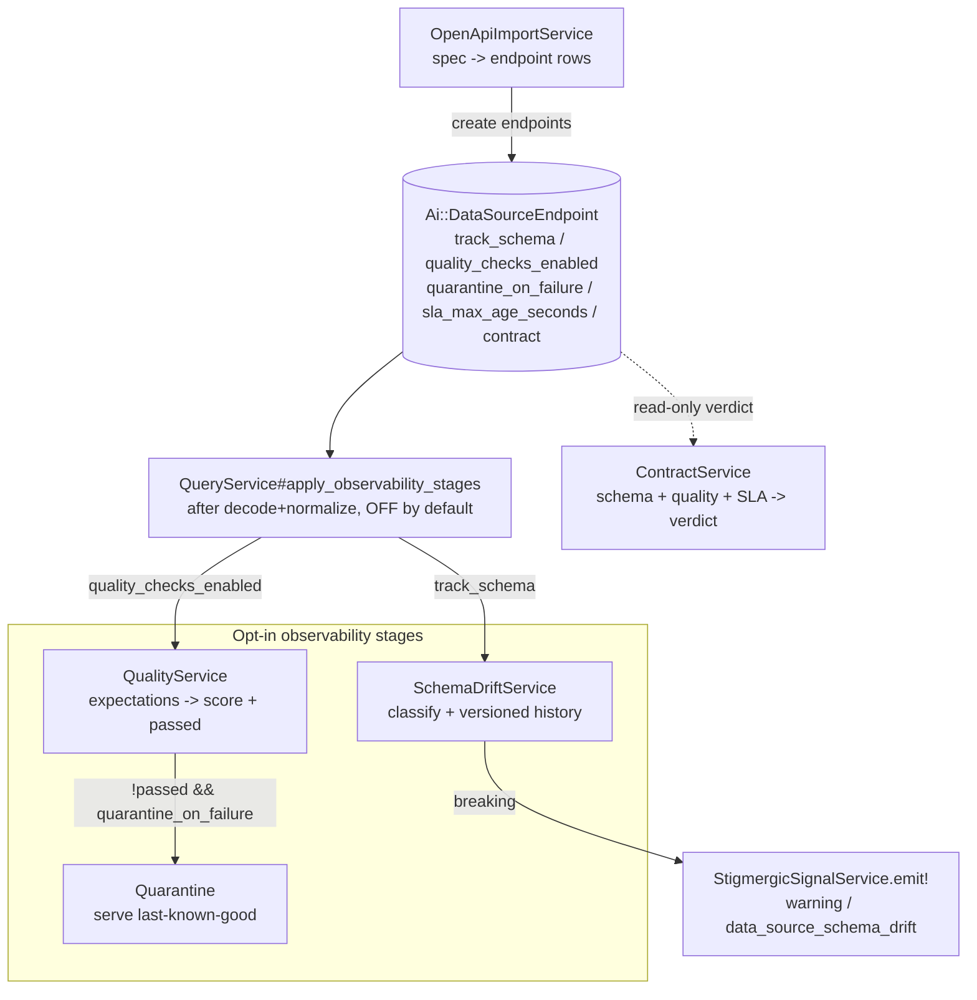

All Phase-2b backend code lives under `server/app/services/ai/data_sources/` alongside the Phase-1 modules; the new models are `Ai::DataSourceSchemaVersion` and `Ai::DataSourceExpectation`.

### New model + endpoint columns

`Ai::DataSourceEndpoint` gains the opt-in flags plus contract knobs:

| Column | Type | Default | Role |
|--------|------|---------|------|
| `track_schema` | boolean | `false` | Enables schema-drift tracking on each fetch |
| `quality_checks_enabled` | boolean | `false` | Enables the quality-expectations stage |
| `quarantine_on_failure` | boolean | `false` | On a quality failure, serve last-known-good instead of the bad batch |
| `sla_max_age_seconds` | integer | — | Freshness budget for the contract's SLA signal (unset ⇒ no SLA) |
| `owner` | string | — | Free-form endpoint owner label |
| `contract` | jsonb | `{}` | Free-form declarative contract metadata |

It also `has_many :schema_versions` and `:expectations` (both `dependent: :destroy`), and re-exports the enum tokens (`SCHEMA_DRIFT_CLASSIFICATIONS`, `EXPECTATION_RULE_TYPES`, `EXPECTATION_SEVERITIES`) so callers can branch off the endpoint without reaching into the child models.

Two new tables back the stages, plus four new columns on the Phase-1 query log:

- **`Ai::DataSourceSchemaVersion`** (`ai_data_source_schema_versions`): `ai_data_source_endpoint_id`, monotonic `version`, the `schema` jsonb snapshot, a `checksum`, the `classification` (`initial`/`none`/`additive`/`breaking`), and the structural `diff` jsonb. Scopes `for_endpoint` / `ordered` / `latest_first` / `breaking`; unique index on `[endpoint_id, version]`.
- **`Ai::DataSourceExpectation`** (`ai_data_source_expectations`): `ai_data_source_endpoint_id`, `name`, `rule_type` (one of `required_fields`/`min_records`/`max_records`/`non_null`/`allowed_values`/`distribution`), `config` jsonb, `severity` (`warn`/`error`), `is_active`. Scopes `active` / `errors`.
- **`ai_data_source_queries`** gains `quality_score` (decimal), `quality_passed` (boolean), `quarantined` (boolean, default `false`), and `schema_drift` (string) — the per-fetch outcomes of the opt-in stages, persisted on the audit row and mirrored onto provenance.

### SchemaDriftService — classify + versioned history

`Ai::DataSources::SchemaDriftService.new(account = nil)` detects and records response-schema drift for an endpoint. Two methods:

- **`#diff(old_schema, new_schema)`** — a pure structural diff (never persists), returning `{ classification:, added_fields: [], removed_fields: [], type_changes: [{ field:, from:, to: }] }`. It flattens both JSON-Schema-shaped Hashes into dotted property paths → declared type and compares those, so nested objects and array items are compared *structurally* rather than by raw equality.
- **`#record_version!(endpoint, schema)`** — diffs the supplied schema against the endpoint's latest recorded version, classifies, and appends the **next** `Ai::DataSourceSchemaVersion` (`version` = latest + 1). It is **idempotent**: when the schema's checksum is unchanged from the latest version, no row is created — it returns the existing latest version with classification `"none"` for *this* call (an in-memory, read-only override so consumers that branch on the returned token correctly see "no change" on repeat polls, without rewriting the version's true recorded classification).

**Classification semantics** (vs the immediately prior version), exposed as class consts `INITIAL`/`NONE`/`ADDITIVE`/`BREAKING`:

| Token | Meaning |
|-------|---------|
| `initial` | No prior schema (first version for the endpoint) |
| `none` | Structurally identical |
| `additive` | Fields added, none removed or retyped |
| `breaking` | A field was **removed** OR an existing field **changed type** |

Because the platform is on the **consume** side (it reads external APIs), any pure addition is backward-compatible and classified `additive` — the JSON-Schema `required` array is deliberately **not** consulted. The service handles **both** object-root schemas (`{ type: object, properties: {…} }`) **and** array-root schemas (`{ type: array, items: { type: object, properties: {…} } }`) — array-root is exactly what `QueryService#infer_schema` emits, so recursion at the root is load-bearing (guarding it on a non-empty prefix would make drift detection a permanent no-op). This is the path the merged smoke test exercised: added → `additive`, removed/retyped → `breaking`, identical → `none`.

### QualityService — expectations + scoring + quarantine

`Ai::DataSources::QualityService.new(endpoint)` evaluates an endpoint's **active** expectations over the canonical (normalized) records of a fetch. `#evaluate(records)` returns:

```ruby
{
  quality_score: Float,     # 0..1, weighted share of rules passed
  passed: Boolean,          # false ONLY when an ERROR-severity rule fails
  results: [{ name:, rule_type:, passed:, severity:, detail: }],
  anomalies: []             # rule_type tokens of the failed error-severity rules
}
```

It runs `endpoint.expectations.active` — each an `Ai::DataSourceExpectation` whose `rule_type` is one of `required_fields`, `min_records`, `max_records`, `non_null`, `allowed_values`, or `distribution`, with a `severity` of `warn` or `error`. When **no** expectations are configured, two built-in **WARN-severity** defaults run (a non-empty-batch check and a record-shape uniformity check) so a quality signal always exists.

Two scoring rules matter:

- **`passed` is `false` only when an ERROR-severity rule fails.** A failed WARN rule lowers the score but never fails the batch — so the built-in defaults shape the number without ever blocking data on their own.
- The `quality_score` is a **weighted** share of rules passed, with **error-severity rules weighted double** so a passing-but-warn-heavy batch can't mask a failed hard rule in the numeric score.

It **never raises** — a rule that itself blows up is recorded as a failed WARN result rather than aborting the evaluation.

**Quarantine.** When `quality_checks_enabled` is on and a quality check **fails** on an otherwise-successful fetch, and `quarantine_on_failure` is *also* on, `QueryService` swaps the bad batch for the **last-known-good** cached payload (`ResponseCacheService.read`), sets `quarantined: true` on provenance and the query row, and suppresses caching the bad payload (so the cache stays clean — the served data already *is* the last-known-good). With no prior good payload, the served batch falls back to empty. This keeps a downstream agent from ingesting a known-bad batch while the upstream recovers.

### ContractService — one verdict from schema + quality + SLA

`Ai::DataSources::ContractService.new` aggregates a single *"is the data contract met?"* verdict by combining three signals already present on a `FetchEnvelope` and its endpoint. `#validate(data_source:, endpoint:, envelope:)` returns:

```ruby
{ met: Boolean, schema_valid: (Boolean|nil), quality_passed: (Boolean|nil),
  within_sla: (Boolean|nil), violations: [<String>] }
```

The three signals (read with indifferent string/symbol access off the envelope/provenance):

| Signal | Source |
|--------|--------|
| `schema_valid` | The envelope provenance `schema_valid` (true/false, or `nil` "unknown" when the endpoint has no `response_schema`) |
| `quality_passed` | The envelope/provenance quality verdict when the quality stage ran; otherwise a **fresh** `QualityService` run over the envelope's canonical records (nil only when neither is available) |
| `within_sla` | Provenance `cache_age_seconds` ≤ `endpoint.sla_max_age_seconds`; **`true` when no SLA is configured** (an unset budget can't be exceeded), `nil` only when an SLA is set but the age is unknown |

The verdict is **assertion-based**: a `nil` signal is "not asserted" — it adds no violation, so a contract with no configured assertions is **vacuously met** (`met: true`). `met` is true exactly when every *asserted* signal holds; `violations` collects `schema_invalid` / `quality_failed` / `sla_exceeded` for the ones that were asserted-and-failed.

### OpenAPI introspection

`Ai::DataSources::OpenApiImportService.new(data_source)` turns a parsed OpenAPI 3 document into `Ai::DataSourceEndpoint` rows — there is no OpenAPI/JSON-Schema gem in play, so the spec is parsed **structurally**. `#import(spec, dry_run: false)` returns `{ created: [], preview: [], errors: [] }`.

It walks `paths × { get, post, put, patch, delete, head }` and maps each operation to endpoint attributes: `name` from `operationId` ‖ `summary` ‖ `"METHOD path"`, `http_method`, `path_template` = the path, and `response_schema` resolved from the operation's 2xx (then `default`) JSON content schema with **recursive `$ref` resolution** against `#/components` (depth-capped against cyclic refs, inlined so the stored schema is self-contained). On `dry_run` it returns the preview without persisting; a real import **skips duplicate slugs** (both already-present on the source and collisions produced within the same batch) and collects **per-path errors** so one bad operation never aborts the rest.

### How it wires into the fetch (opt-in, after normalization)

The three observability stages run in `QueryService`'s private `apply_observability_stages`, called immediately after decode + normalize and **only** for endpoints that opt in:

- **`track_schema`** → `infer_schema(records)` (a minimal array-root JSON Schema inferred from the first record's keys) → `SchemaDriftService.record_version!`. On a `"breaking"` classification it emits a stigmergic signal via `Ai::Coordination::StigmergicSignalService.emit!(signal_type: "warning", signal_key: "data_source_schema_drift", payload: { data_source_id, endpoint_id, schema_version, classification, diff, … })` so autonomous agents *perceive* the drift. A non-`none` classification also adds a `schema_drift_<token>` anomaly.
- **`quality_checks_enabled`** → `QualityService.evaluate` sets `@quality_score` / `@quality_passed`; failed-rule tokens are folded into `anomalies`. If `!passed` **and** `quarantine_on_failure` is on, the records are replaced with the last-known-good payload (quarantine, above).

The outcomes (`quality_score`, `quality_passed`, `quarantined`, `schema_drift`) are persisted on the `ai_data_source_queries` row **and** mirrored onto the `FetchEnvelope` provenance, so `ContractService` and callers can read the verdict straight off the envelope. Every stage is individually nil-safe: a stage failure is logged and skipped, never allowed to break the fetch.

**All three flags default `false`** — the no-op default path means the `FetchEnvelope` is identical to pre-2b and there is **zero added overhead** until an operator opts an endpoint in.

### Surfaces (REST + MCP)

The Phase-2b capability is exposed on both surfaces. The three read endpoints require `ai.data_sources.read`; introspection is a write surface requiring `ai.data_sources.manage`.

**REST** (in the `Ai::DataSourceEndpoints` concern):

| Route | Purpose | Permission |
|-------|---------|-----------|
| `GET /api/v1/ai/data_sources/:data_source_id/endpoints/:endpoint_id/schema_history` | The endpoint's recorded schema versions (newest-first) + the latest | `ai.data_sources.read` |
| `GET …/endpoints/:endpoint_id/quality` | The latest quality outcome (distilled from the most recent query row) + the configured expectations | `ai.data_sources.read` |
| `GET …/endpoints/:endpoint_id/contract` | The aggregate `ContractService` verdict built from the latest recorded query (a GET never triggers an outbound fetch) | `ai.data_sources.read` |
| `POST /api/v1/ai/data_sources/:id/introspect` | OpenAPI import — body `spec` (parsed) or `spec_url`/`url` (server-fetched through the SSRF-guarded factory), `dry_run` | `ai.data_sources.manage` |

**MCP.** `Ai::Tools::DataSourceTool` grows to **16 actions**, adding `data_source_schema_history`, `data_source_quality`, and `data_source_contract` (all `ai.data_sources.read`), plus `data_source_introspect` (`ai.data_sources.manage`, supports `dry_run`). All four are registered per-action in `PlatformApiToolRegistry`.

The REST response shapes mirror the frontend TypeScript contracts in `frontend/src/shared/types/ai.ts`: `DataSourceSchemaHistoryResponse` (+ `AiDataSourceSchemaVersion`), `DataSourceQualityResponse` (+ `AiDataSourceExpectation`), `DataSourceContractVerdict`, and `DataSourceOpenApiImportResult`. The UI surfaces them through `DataSourceSchemaHistoryTab.tsx`, `DataSourceQualityTab.tsx`, and `DataSourceImportOpenApiModal.tsx`, with matching `DataSourcesApiService` methods.

## Streaming & Monitoring (Phase 3)

Phase 1 fetches a source you name; Phase 2a finds it by intent; Phase 2b verifies one fetch's shape/quality. **Phase 3** answers the time dimension — *"keep watching this endpoint and tell me when its data changes"* — by adding a **pull-based subscription** with a poll cadence, a **server-side monitor loop** that walks due subscriptions and change-detects each one, and two opt-in **stale-serving** policies (stale-while-revalidate / stale-if-error) so a downstream agent keeps getting an answer while the upstream is slow or down. It is **merged and verified**: the migration is applied, the load is zeitwerk-clean, the regression suite is green, and the monitor loop was smoke-confirmed end to end.

The defining design principle is **pull, never push** (per the platform architecture rule): the worker only fires a thin cron tick, and the server-side `MonitorService` *pulls* due subscriptions and runs the **same** governed `QueryService` pipeline as an interactive query — no second fetch path, no upstream service pushing into the platform.

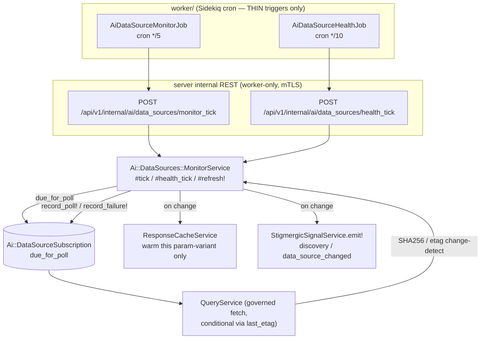

All Phase-3 backend code lives under `server/app/services/ai/data_sources/` (the monitor) and `server/app/models/ai/` (the subscription); the worker triggers are in `worker/app/jobs/`.

### The subscription model

`Ai::DataSourceSubscription` (table `ai_data_source_subscriptions`) is a pull-based subscription that binds a **data source + endpoint** to a poll cadence. It deliberately **mirrors `Ai::DataConnector`'s sync cadence** (the same `POLL_FREQUENCIES` shape, a `due_for_poll` scope, `schedule_next_poll!`, `needs_poll?`) so the monitor loop reuses an established pattern rather than inventing a new one.

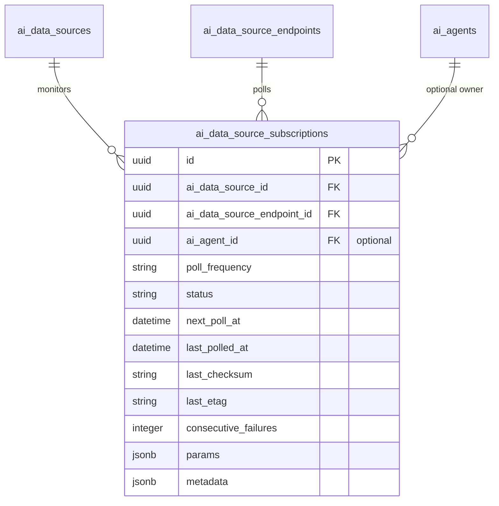

- **`belongs_to :data_source` / `:endpoint`** (required), **`belongs_to :agent`** (`ai_agent_id`, **optional** — a subscription can be system-owned or attributed to an agent). `Ai::DataSource has_many :subscriptions` (`dependent: :destroy`); `Ai::DataSourceEndpoint has_many :subscriptions` too.
- **`POLL_FREQUENCIES = %w[manual 5min hourly daily weekly monthly realtime]`** — DataConnector's set plus two monitor-grade fine tiers: `5min` and `realtime` (the latter polled on every tick, i.e. interval `0`). **`STATUSES = %w[active paused error]`**.
- `params` / `metadata` are jsonb with lambda defaults; `before_create` seeds `next_poll_at` for any non-`manual` cadence so the monitor picks it up without an explicit `activate!`.

**Scopes:**

| Scope | Definition |
|-------|-----------|
| `.active` | `status = "active"` |
| `.due_for_poll` | `status IN ("active", "error") AND next_poll_at IS NOT NULL AND next_poll_at <= now` |
| `.for_data_source(ds)` / `.for_endpoint(ep)` | by FK (accept a record or an id) |

The load-bearing detail is that **`due_for_poll` deliberately includes `"error"`, not just `"active"`**. A subscription that tripped the failure threshold keeps being polled — and `record_poll!` (a successful poll) is the *only* path that can clear `error → active`, so excluding error rows would make the documented auto-recovery unreachable and silently stop monitoring forever. Operator-set **`"paused"` stays excluded** (a human turned it off; the loop respects that).

**Lifecycle methods:**

- **`activate!`** — sets `active` and re-arms the cadence; **`pause!`** — sets `paused` and clears `next_poll_at`; **`active?`**.
- **`record_poll!(changed:, checksum: nil, etag: nil)`** — the success path: stamps `last_polled_at`, **resets `consecutive_failures` to 0**, clears a prior `error → active`, updates `last_checksum`/`last_etag` *only when supplied*, and schedules the next poll. Returns `changed`.
- **`record_failure!(error_message = nil)`** — the failure path: increments `consecutive_failures`, records the error in `metadata`, **flips `status` to `"error"` once failures `>= 5`**, and **still schedules the next attempt** (unless paused) so a transient upstream fault self-heals.
- **`schedule_next_poll!`** — `next_poll_at = now + poll_interval`; `manual` never schedules, `realtime` schedules immediately (interval 0). **`needs_poll?`** — active + due. **`poll_interval`** — an `ActiveSupport::Duration` (`0.seconds` for realtime, `5.minutes` / `1.hour` / `1.day` / `1.week` / `1.month`, defaulting to 1 hour).

### MonitorService — the server-side poll loop

`Ai::DataSources::MonitorService.new(account = nil)` is the engine. The worker contributes nothing but the cron tick — **every** poll/fetch/change-detect/cache/signal decision is server-side. Three entry points:

| Method | Returns | Role |
|--------|---------|------|
| `#tick(limit: 100)` | `{ polled:, changed:, errors: [{ subscription_id:, error: }] }` | Walk `due_for_poll` and poll each |
| `#health_tick` | `{ refreshed:, errors: [] }` | Refresh `health_status` for every active source (`update_health_status!`) |
| `#refresh!(data_source:, endpoint:, params: {})` | `Boolean` | Background SWR refresh hook (re-warms the cache on success) — called by `ResponseCacheService` |

**`#tick` per subscription**, in order:

1. **Quota gate.** Respect the parent source's `check_quota!` — a throttled source **defers** the poll to the next tick (re-schedules without counting a failure) rather than burning its budget on background monitoring.
2. **Governed fetch.** Run `Ai::DataSources::QueryService` (the identical kill-flag / quota / cache / circuit-breaker / SSRF / decode / normalize / redact / audit pipeline), passing the stored `last_etag` as a conditional hint via the reserved `__conditional_etag` param. Adapters that support conditional requests can translate it into `If-None-Match`; others ignore it (checksum detection still works).
3. **Change-detect.** Compute a canonical `Digest::SHA256` of the normalized payload (stable across hash-key ordering via deep-sort), **preferring** the provenance `response_sha256` (raw-body hash) when present, then compare against the subscription's `last_checksum`. When **both** sides expose an `etag` and they match, treat as unchanged regardless of checksum (handles 304-style revalidation). The **first** successful poll always registers as changed (no stored checksum yet), so the initial payload is cached + signalled.
4. **On change** (and only on change): **warm ONLY that param-variant's cache entry** via `ResponseCacheService.write` (an idempotent `setex`) — it deliberately does **not** blanket-invalidate the endpoint, which would cold-miss sibling subscriptions and interactive reads cached under different params — **and** emit a stigmergic signal: `Ai::Coordination::StigmergicSignalService.emit!(signal_type: "discovery", signal_key: "data_source_changed", agent: nil, …)` with payload `{ slug, data_source_id, endpoint, endpoint_id, subscription_id, checksum }`. The signal is **system-emitted (`agent: nil`)** — consistent with the QueryService schema-drift signal — so autonomous agents *perceive* the fresh upstream data without cross-account agent/signal mismatch.
5. **Record.** A successful poll → `record_poll!(changed:, checksum:, etag:)`; a failed/erroring fetch → `record_failure!`.

**Per-subscription failures never abort the batch** — each is rescued, logged, recorded via `record_failure!`, and collected into the `errors` array so the internal controller can surface partial failures while the tick still succeeds. The due scope eager-loads `:data_source`, `:endpoint`, `:agent` so the loop never N+1s, and is account-scoped when an account is supplied.

### Stale-while-revalidate / stale-if-error

Phase 3 adds two **per-endpoint, opt-in** stale-serving policies to the response cache, gated by two nullable integer columns on `Ai::DataSourceEndpoint` — `stale_while_revalidate_seconds` and `stale_if_error_seconds`. **Both default `nil` (OFF)**, and when both are nil the cache is **byte-for-byte the legacy behaviour**: the Redis TTL equals the hard TTL and the `FetchEnvelope` is unchanged. You pay only for what you turn on, per endpoint.

The mechanism is a split between a **hard-expiry epoch** (the freshness boundary) and the **Redis key lifetime**. `write_entry` stores a hard-expiry `now + ttl` but keeps the Redis key alive for `ttl + grace_window`, where `grace_window = max(stale_while_revalidate_seconds, stale_if_error_seconds)`. A new side-channel read, `ResponseCacheService.read_stale(data_source:, endpoint:, params:)`, returns a flagged descriptor (it does **not** touch hit/miss metrics):

```ruby
{ payload:, stale:, hard_expired:, age_seconds:, stale_age_seconds: } # or nil on miss
# hard_expired:false -> fresh (within hard TTL)
# hard_expired:true  -> stale (in the grace window); caller decides whether to serve
# stale_age_seconds  -> seconds elapsed PAST the hard expiry (the stale-* windows
#                       are measured from this, per HTTP Cache-Control stale-* semantics)
```

**Stale-while-revalidate** (read path). When `ResponseCacheService.fetch` finds a **hard-expired** entry still inside the SWR window, it serves the stale payload immediately (a recorded hit) and fires `schedule_background_refresh`: an **NX-locked** (one refresher per key per grace window) **detached `Thread`**, wrapped in `ActiveRecord::Base.connection_pool.with_connection` (so the refetch's DB work doesn't leak/exhaust the pool), that delegates to `MonitorService#refresh!` to repopulate the cache for the next caller. With SWR off, a hard-expired entry is treated as a miss and recomputed inline as before.

**Stale-if-error** (failure path, in `QueryService`). When a **live** fetch fails with `STATUS_ERROR` or `STATUS_TIMEOUT` — **not** `blocked` / `rate_limited`, which are governance outcomes, not staleness — and the endpoint opts into `stale_if_error_seconds`, `QueryService#maybe_serve_stale_if_error` swaps the failure for the last-known-good cached payload via `read_stale`, but **only** when the entry is hard-expired and within the configured window (measured from `stale_age_seconds`). The substituted result is flagged honestly — `success: true`, `status: cached`, `served_stage: "stale_if_error"`, `provenance.stale_if_error: true`, plus a `stale_if_error` anomaly — so persistence/provenance record a *degraded serve*, not a fresh success, and `finalize` (which gates cache writes on a **fresh** success) never re-writes the stale payload back.

### Surfaces (REST + MCP + internal)

The Phase-3 capability spans three surfaces.

**Internal REST (worker-only, mTLS)** — the cron triggers. `POST /api/v1/internal/ai/data_sources/monitor_tick` and `POST /api/v1/internal/ai/data_sources/health_tick` both dispatch into `MonitorService` (`#tick` / `#health_tick`). The worker jobs are deliberately **thin**: `worker/app/jobs/ai_data_source_monitor_job.rb` (cron `*/5 * * * *`) and `ai_data_source_health_job.rb` (cron `*/10 * * * *`) do nothing but POST those internal paths and log the batch summary.

**Public REST** (nested under a source, in the `Ai::DataSourceEndpoints` controller concern):

| Route | Action | Permission | Renders |
|-------|--------|-----------|---------|
| `GET /api/v1/ai/data_sources/:data_source_id/subscriptions` | `subscriptions_index` | `ai.data_sources.read` | `{ items: [summary], count }` |
| `POST .../subscriptions` | `subscriptions_create` | `ai.data_sources.stream` | `{ subscription: summary }` |
| `DELETE .../subscriptions/:subscription_id` | `subscriptions_destroy` | `ai.data_sources.stream` | confirmation message |

`subscriptions_create` takes a body of `endpoint_id` + `poll_frequency` + `params` and is **idempotent on the source+endpoint pair** (`find_or_initialize_by(ai_data_source_endpoint_id:)`, re-arming the cadence when the frequency changes). The `serialize_subscription` summary — kept in lockstep across REST, MCP, and the frontend type — is: `id`, `data_source_id`, `endpoint_id`, `poll_frequency`, `status`, `params`, `next_poll_at`, `last_polled_at`, `last_checksum`, `last_etag`, `consecutive_failures`, `agent_id`.

**MCP.** `Ai::Tools::DataSourceTool` grows to **18 actions**, adding the two streaming actions (both registered per-action in `PlatformApiToolRegistry`, both requiring **`ai.data_sources.stream`**):

| Action | Purpose |
|--------|---------|
| `data_source_subscribe` | Create/update a pull-based subscription — `endpoint_id` + `poll_frequency` + `params`; idempotent `find_or_initialize` on the endpoint (attributes the acting agent when present) |
| `data_source_unsubscribe` | Cancel a subscription by `subscription_id`, **or** every subscription matching a `data_source_id` + `endpoint_id` pair |

The new permission **`ai.data_sources.stream`** ("Subscribe to AI data source endpoints (pull-based monitoring)") is registered in `config/permissions.rb` and granted to the **member**, **manager**, and **ai_specialist** roles.

**Frontend.** `DataSourceMonitoringTab.tsx` surfaces a source's subscriptions (cadence, status, last poll, checksum/etag, failure count), backed by `DataSourcesApiService.getSubscriptions` / `createSubscription` / `deleteSubscription` and the `AiDataSourceSubscription` TypeScript type in `frontend/src/shared/types/ai.ts` (which mirrors the `serialize_subscription` summary).

## Incremental sync & crawl politeness (Phase 5)

Phase 3 watches an endpoint and re-fetches the **whole** payload every tick; the monitor is a polite-by-omission crawler that hits a host as fast as the cadence allows. **Phase 5** sharpens both along the monitor loop's two axes. **Incremental sync** turns the full re-fetch into a high-watermark *delta* fetch — the poll asks the upstream only for rows newer than the last cursor, and advances that cursor from each response. **Crawl politeness** makes the platform a well-behaved external client — it honors a host's `robots.txt` on the interactive query path and spaces its background polls by the host's `Crawl-delay`.

The defining design principle is the same one that governs every layer above: **OFF by default, zero overhead until opted in**. Incremental sync is dormant until an endpoint sets its `incremental` jsonb config; politeness is dormant until a source sets `respect_robots` or `crawl_delay_seconds`. With those blank/false (the default for every source and endpoint), the poll and the interactive fetch are **byte-for-byte the pre-Phase-5 path**. Both features extend the [Streaming & Monitoring](#streaming--monitoring-phase-3) monitor loop; the politeness gate additionally guards the interactive `QueryService`.

### Incremental sync

Incremental sync replaces a subscription's full re-fetch with a **high-watermark cursor** model: the platform remembers where it last read (the cursor), sends that cursor on the next poll so the upstream returns only newer rows, and extracts the *next* cursor from the response to advance the watermark. It is pure cursor plumbing in `Ai::DataSources::IncrementalSync` (stateless, no I/O) wired into `MonitorService#poll_subscription`; the watermark itself lives in the subscription's `sync_cursor` string column (nil ⇒ no watermark yet ⇒ a full fetch that *seeds* it).

An endpoint opts in via its `incremental` jsonb config (`Ai::DataSourceEndpoint#incremental?` is just `incremental.present?`):

```ruby
{
  "cursor_param" => "since",          # outbound query/body param that carries the cursor
  "cursor_path"  => "meta.next_cursor", # dotted path to the NEXT cursor in the response
  "mode"         => "cursor"          # "cursor" | "timestamp" (advisory; both dig the path)
}
```

The round-trip across one poll, inside `MonitorService#poll_subscription`:

```mermaid
flowchart LR
    SUB[(Ai::DataSourceSubscription<br/>sync_cursor)]
    AP[apply_cursor<br/>before fetch]
    QS[QueryService<br/>governed fetch]
    BODY[RAW response body<br/>before records_path unwrap]
    PROV["provenance[:incremental_cursor]"]
    EX[extract_cursor<br/>after fetch]
    RP["record_poll!(cursor:)"]

    SUB -->|stored cursor| AP
    AP -->|params[cursor_param] = cursor| QS
    QS -->|cursor_from_body| BODY
    BODY -->|dug at fetch time| PROV
    QS --> EX
    PROV --> EX
    EX -->|next watermark| RP
    RP -->|advance only when present| SUB
```

1. **Before the fetch — apply the stored cursor.** When the subscription already holds a `sync_cursor`, `IncrementalSync.apply_cursor` stamps it onto the outbound params under `cursor_param` (returning a shallow copy, never mutating the caller's params) so the upstream returns only rows past the high-watermark. With a blank cursor or no `cursor_param`, the params pass through unchanged — so the **first** incremental poll always runs a full fetch and seeds the watermark.
2. **After a successful fetch — extract the next cursor.** `IncrementalSync.extract_cursor` digs the next watermark out of the `FetchEnvelope` and `MonitorService` persists it via `record_poll!(cursor:)`. A blank/absent cursor leaves the existing `sync_cursor` untouched (`record_poll!` ignores a blank `cursor:`), so a response that omits the cursor never clobbers progress.

The **key subtlety** is *where* the next cursor comes from. Many APIs carry their paging token at the **top level** of the response body (e.g. `{"meta":{"next_cursor":"…"},"items":[…]}`), but the decode layer's `records_path` unwrap deliberately discards everything outside the records array — so by the time the canonical records reach the `FetchEnvelope`, a top-level paging token is **unreachable**. To solve this, `QueryService` digs the cursor out of the **RAW response body at fetch time**, *before* the unwrap: in `finalize` it calls `IncrementalSync.cursor_from_body(raw_body, endpoint.incremental)` (which JSON-parses the raw body and digs `cursor_path`) and stashes the result onto **`provenance[:incremental_cursor]`**. `extract_cursor` then **prefers** that pre-dug value, falling back to the configured `cursor_path` only for sources that carry the cursor *inline on the records themselves* — `timestamp` mode, e.g. the last row's `updated_at` — which survive the unwrap and can be read straight from the envelope `data`. This split is why both a top-level-token API and a record-embedded-timestamp API work through one config: the raw-body dig handles the former, the records dig handles the latter.

`IncrementalSync` is nil-safe and container-rejecting throughout: a malformed `cursor_path` digs to nil rather than raising, and a cursor that resolves to a Hash/Array is rejected (a high-watermark must be a scalar that persists into the `sync_cursor` string column). **OFF by default**: with a blank `incremental` config both helpers no-op (`apply_cursor` returns the params unchanged, `extract_cursor` returns nil), so a non-incremental subscription runs the exact full-fetch poll path from [Phase 3](#streaming--monitoring-phase-3).

### Crawl politeness

When the platform fetches from third-party hosts on a cadence it is, in effect, a crawler — and Phase 5 makes it a polite one along two independent dimensions, each its own opt-in flag on the source. Both default off, so an existing source pays nothing.

**robots.txt compliance** (`Ai::DataSources::RobotsService`) gates the **interactive query path**. When `data_source.respect_robots` is true, `QueryService#perform_fetch` resolves the request's absolute URL and asks `RobotsService#allowed?` *before any dispatch* — and on a disallow short-circuits with a **blocked** envelope (`status: "blocked"`, `error: "robots_disallowed"`, a `robots_disallowed` anomaly), exactly mirroring the kill-flag and SSRF blocked-before-dispatch short-circuits in the [security model](#security-model). `RobotsService` fetches `/robots.txt` through the **same SSRF-guarded connection** a real fetch uses (so robots fetches obey the identical egress pinning, size cap, and timeout), parses the rules for the platform's own contactable User-Agent (longest-matching UA group, then `*`) with longest-rule-wins / Allow-beats-Disallow-on-tie / `*`-wildcard / `$`-anchor semantics, and caches the parsed rules per host in Redis so repeated polls don't refetch every tick.

The governing rule is **default-ALLOW on every failure**. A missing `robots.txt` (404), an empty body, a fetch failure (timeout / transport / SSRF rejection / oversized), or a Redis fault all resolve to "allowed" — robots is advisory politeness, never a hard gate that could wedge a source on an unrelated network blip. The **only** thing that returns `false` is a `robots.txt` that successfully loads and *explicitly* disallows the path. The gate in `QueryService` fails open too: any error in the check is treated as "not disallowed" so robots can never break a fetch.

**Per-host pacing** (`Ai::DataSources::HostPacer`) honors a host's `Crawl-delay` on the **background monitor loop** — and the load-bearing design choice is that it paces by **deferring the poll, never by sleeping**. `HostPacer` is a stateless Redis timestamp check: `ready?(host, min_interval:)` answers "has at least `min_interval` elapsed since the last request to this host?" and `touch(host)` stamps "now" after a successful fetch. In `MonitorService#poll_subscription`, when a source opts into pacing (via `respect_robots` *or* a configured `crawl_delay_seconds`) and `HostPacer.ready?` returns false, the monitor **reschedules the poll for a later tick** (`schedule_next_poll!`, counted as a defer, not a failure) instead of issuing the request. Pacing is thus achieved by spreading work across ticks — the synchronous, interactive `QueryService` path is **never** slowed by pacing (it has no business sleeping inside a request). The effective interval is the max of the resolved `Crawl-delay` (the `robots.txt` value when `respect_robots`, else the configured `crawl_delay_seconds`) and `HostPacer`'s conservative floor. Like robots, pacing **fails open**: any Redis fault makes `ready?` return true and `touch` a no-op, degrading to "no pacing" rather than wedging the monitor.

Both controls are **OFF unless the source opts in**: a source with `respect_robots = false` and no `crawl_delay_seconds` skips the robots gate entirely on the query path and incurs zero pacing checks in the monitor loop.

## Generic framework (Phase 4)

Phases 1–3 made a source *config, not code* but kept three soft constraints: `source_type` was a fixed enum, the only adapter was REST, and every fetch was a single request. **Phase 4** removes all three — `source_type` goes free-form (with a `category` grouping), behavior is driven entirely by the **protocol-keyed adapter registry** (now with purpose-built GraphQL and RSS/Atom adapters beside the generic REST fallback), and pagination becomes an opt-in endpoint config. A nightly **schema-sync** rounds it out by keeping endpoint baselines current without an interactive fetch. It is **merged + verified** (877 specs green, smoke-confirmed) and, like every prior phase, **zero overhead until used** — a pre-4 source with the default `rest` protocol and no `pagination` config runs the byte-for-byte-identical single-request path.

### Free-form `source_type` + `category`

`Ai::DataSource#source_type` is no longer constrained to a known set. It is validated only for **presence**, **length** (≤ 50), and a lowercase **format** (`/\A[a-z0-9_-]+\z/`) so tokens stay normalized for the `by_type` scope and the knowledge-graph embedding text — but any new token (e.g. `crypto_prices`, `gov_data`) can be created without a code change. The legacy enum survives purely as UI guidance:

```ruby
SUGGESTED_SOURCE_TYPES = %w[noaa_ncei noaa_gfs noaa_observations open_meteo
                            fred yahoo_finance espn newsapi custom].freeze
SOURCE_TYPES = SUGGESTED_SOURCE_TYPES   # backward-compat alias for existing callers
```

A new nullable `category` column (string, ≤ 100) gives a coarse grouping orthogonal to the now-unbounded `source_type`. The migration (`20260606122000`) **backfills** it from the legacy tokens — `noaa_*` / `open_meteo` → `weather`, `fred` / `yahoo_finance` → `finance`, `espn` → `sports`, `newsapi` → `news` — and leaves `custom` (and any later free-form token) NULL. A **partial index** (`WHERE category IS NOT NULL`) keeps the `by_category` scope fast without indexing the unset tail. Both `scope :by_type` and `scope :by_category` are plain `where` filters; the REST list action filters on either.

### The protocol-keyed adapter registry

`Ai::DataSources::Adapters::Registry.for(data_source)` selects the adapter by the source's `protocol` column, normalize-with-fallback:

| Protocol token | Adapter | Behavior |
|----------------|---------|----------|
| `rest`, `custom`, *(any unknown/blank)* | `RestAdapter` (generic fallback — **never raises** on an unmapped token) | Template-driven REST request, format-detected decode |
| `graphql` | `GraphqlAdapter` | Single-URL `POST { query:, variables: }`; unwraps the GraphQL `data` envelope |
| `rss`, `atom` | `RssAdapter` (subclass of `RestAdapter`) | GET feed → canonical item records |

Both new adapters honor the same `build_request(endpoint:, params:)` / `parse(raw_body, endpoint:)` contract as `RestAdapter`, so the rest of the `QueryService` pipeline (signing, SSRF guard, decode/normalize, provenance) is unchanged.

**`GraphqlAdapter`** (`adapters/graphql_adapter.rb`, `< Base`). GraphQL is a single-endpoint POST-only protocol, so `build_request` always emits a `POST` to the endpoint's `path_template` with a JSON body of `{ "query" => …, "variables" => … }` and no query string. The operation document is sourced, in order, from `params["query"]` → `body_template["query"]` → `query_template["query"]` (legacy convenience); variables are the union of `body_template["variables"]` (interpolated like a REST body) ← every *other* caller param folded in as a top-level variable ← an explicit `params["variables"]` Hash (which wins). The reserved `__conditional_etag` monitor hint and the `query`/`variables` control keys never leak into the variables map. `parse` decodes the JSON envelope and locates records via `response_mapping["records_path"]` (a dotted path / JSON pointer against the whole document) when set; **otherwise** it applies the GraphQL convention — descend into top-level `data`, and when `data` is a single-key object (`{ data: { field: … } }`) unwrap that one field so the records are its value. The located node is coerced to `Array<Hash>` with the same rules as the JSON decoder. GraphQL `errors` never raise — a body with errors and null `data` yields `[]`, and `QueryService` records the HTTP/anomaly outcome.

**`RssAdapter`** (`adapters/rss_adapter.rb`, `< RestAdapter`). Feeds are ordinary HTTP GETs, so `build_request` is inherited from `RestAdapter` unchanged — the adapter only overrides `parse`. It delegates structural decoding to the shared XML decoder (which already auto-locates `<item>`/`<entry>` nodes and namespace-strips), then maps each raw feed item onto a **canonical record** with stable keys, regardless of RSS-vs-Atom dialect:

| Canonical key | Sourced from (first non-blank) |
|---------------|--------------------------------|
| `title` | `title` |
| `link` | RSS `<link>` text, or Atom `<link href="…">` — **`rel="alternate"` preferred** when multiple `<link>`s are present |
| `published` | `pubDate` / `published` / `updated` / `date` (namespaces already stripped, so `dc:date` arrives as `date`) |
| `summary` | `description` / `summary` / `content` |
| `guid` | RSS `<guid>`, or Atom `<id>` |
| `id` | alias of `guid` (for callers keying on `id`) |
| `raw` | the full decoded item — nothing is dropped |

An operator's explicit `response_mapping["record_node"]` / `["record_xpath"]` still flows through to the XML decoder, so a non-standard item element still yields canonical records. Fields a feed omits are simply absent (never a fabricated nil).

> **XML decoder fix (load-bearing for RSS/Atom).** Repeated sibling elements now aggregate via `Array.wrap` instead of `Array()`. `Array({"a"=>1})` *explodes* a Hash into `[["a",1]]`; `Array.wrap` keeps it `[{"a"=>1}]`. This is what lets multiple `<item>`s — or two Atom `<link rel=… href=…/>` elements on one entry — decode to a clean array of hashes (which the `rel="alternate"` link preference then walks).

### Outbound pagination (opt-in)

`Ai::DataSources::Paginator` (`paginator.rb`) walks an upstream's pages and concatenates the decoded canonical records into one set, so `QueryService` keeps returning **one** `FetchEnvelope` regardless of how many physical requests were needed. It is deliberately **I/O-free** — it never signs, dispatches, decodes, or touches quota itself; `QueryService` owns all of that and injects callbacks:

```ruby
Ai::DataSources::Paginator.new(
  endpoint:, base_params:, fetch_page:, decode_page:, check_quota:, logger:
).each_page
# => { records:, pages_fetched:, first_response:, last_response:, stopped_reason:, truncated: }
```

`SUPPORTED_TYPES` are `offset` / `page` / `cursor` / `link`:

| `pagination["type"]` | Advance | Stop |
|----------------------|---------|------|
| `offset` | `&<offset_param>=N&<limit_param>=L`; advance offset by limit | empty page / max pages |
| `page` | `&<page_param>=N`; advance from `start_page` (default 1) | empty page / max pages |
| `cursor` | `&<cursor_param>=C`, next cursor read from the decoded body at `cursor_path` | cursor absent/blank/unchanged |
| `link` | follow the RFC 5988 `Link` header `rel="next"` URL | no `rel="next"` |

Universal stop conditions: a page with zero records, the strategy's own terminator, the per-page **quota veto** (the partial result is kept), a failed page (non-2xx / transport — partial records returned, the real outcome surfaced), and a hard cap of **`HARD_MAX_PAGES = 20`** that clamps the endpoint's configured `max_pages` regardless of config.

`QueryService#perform_fetch` branches on `pagination_enabled?` — true only when `endpoint.pagination` is a **non-blank Hash with a supported `type`**:

- **OFF (the default):** `pagination` blank → the single-request path runs, producing a **byte-identical** `FetchEnvelope`.
- **ON:** `perform_paginated_fetch` drives the page walk (each page through the same governed build → sign → SSRF-validate → circuit-breaker dispatch, with `check_quota!` honored before each subsequent page), concatenates the canonical records, then runs the **same** decode/normalize/provenance path over the combined set so the envelope shape is unchanged — just more records. Aggregate `pagination_provenance` (`{ type, pages_fetched, stopped_reason, truncated }`) is folded into provenance, and a `paginated_<N>_pages` anomaly (plus `pagination_truncated` when the hard cap is hit) is recorded.

The endpoint column is jsonb default `{}` (migration `20260606122000`); a blank or garbage config is an explicit no-op rather than a single odd request.

### Nightly schema-sync

`Ai::DataSources::SchemaSyncService.new(account = nil)#sync(limit:)` is the **batch** counterpart to the inline `track_schema` drift recording: a cron tick that walks endpoints needing a schema refresh, samples each, infers a top-level-array JSON schema, and appends a version. It returns `{ synced:, errors: }`.

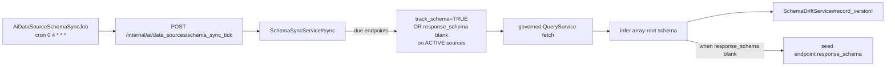

- **Due selection** (filtered in SQL): an endpoint qualifies when `track_schema = TRUE` **OR** `response_schema` is blank (`NULL`/`{}`), and its source is **active**; account-scoped when an account is supplied.
- **Sampling**: a **live governed `QueryService` fetch** (the same kill-flag / quota / cache / circuit-breaker / decode pipeline as any read) — the query log doesn't persist decoded payloads, so a real sample is required. The inferred schema (`{ type: array, items: { type: object, properties: {…} } }`, the same shape `QueryService#infer_schema` emits) feeds `SchemaDriftService#record_version!`, and when the endpoint has **no** `response_schema` yet the inferred schema is also **seeded** onto it (via `update_column`, off the audit/validation path) so subsequent fetches have a baseline.
- **A throttled / blocked / errored sample is a skip, not a hard error** — a busy source doesn't spam the error list (mirrors `MonitorService#tick`). Per-endpoint failures are collected and never abort the batch.

The cron path is **pull, never push** like the Phase-3 monitor: the standalone worker job `AiDataSourceSchemaSyncJob` (cron `0 4 * * *`, `worker/config/sidekiq.yml`) does nothing but POST the internal tick — all sampling/inference/recording is server-side. The internal route is `POST /api/v1/internal/ai/data_sources/schema_sync_tick` → `Api::V1::Internal::Ai::DataSourcesController#schema_sync_tick` (worker-only, mTLS), which calls `SchemaSyncService.new.sync(limit:)` across all accounts.

### Surfaces

Phase 4 wires the new fields through the existing REST surface without new routes:

- `data_source_params` permits `:category` and `:protocol`; `serialize_data_source` emits both on every source response; the list action filters via `by_category(params[:category])` (alongside the existing `source_type` filter).
- `endpoint_params` permits `pagination: {}`; `serialize_data_source_endpoint` emits `pagination`.
- The frontend (`frontend/src/features/ai/data-sources/`) gets a free-form `source_type` input, a `category` field, a `protocol` selector, a category filter, and a pagination editor in create/edit; `sourceTypeLabels` humanizes unknown tokens.

The full API contract for these fields, the pagination config shape, the `schema_sync_tick` route, and the GraphQL/RSS protocol behaviors is in [`reference/api/data-sources.md`](../reference/api/data-sources.md#phase-4-additions).

## Phase boundaries

**Phase 1** is the governed-fetch foundation: catalog + endpoint templates, the three generic registries, decode/normalize, the full `QueryService` pipeline, the response cache, the security model, and the REST + MCP surfaces — all merged, migrated, and smoke-tested.

**Phase 2a** (the [Discovery & Evaluation](#discovery--evaluation-phase-2) section above) adds the discovery + evaluation layer on top: the `data_source` knowledge-graph node + `BridgeService` embedding sync, the blended `effectiveness_score` fed by `record_query!` on live fetches, `SemanticDiscoveryService`, and the discovery / provenance / impact surfaces — also merged, migrated, and smoke-tested.

**Phase 2b** (the [Data quality, schema-drift & contracts](#data-quality-schema-drift--contracts-phase-2b) section above) adds the per-endpoint observability layer: opt-in `SchemaDriftService` versioned history + breaking-drift signal, `QualityService` expectations/scoring/quarantine, the aggregate `ContractService` verdict, and `OpenApiImportService` introspection — with all three endpoint flags defaulting off (zero overhead until opted in). Merged, migrated (zeitwerk-clean), full suite green, drift smoke-confirmed.

**Phase 3** (the [Streaming & Monitoring](#streaming--monitoring-phase-3) section above) adds the pull-based monitoring layer: the `Ai::DataSourceSubscription` cadence model (mirroring `DataConnector`, with `due_for_poll` including `"error"` for auto-recovery), the server-side `MonitorService` poll loop (worker `*/5` + `*/10` cron firing thin internal-tick triggers → governed `QueryService` fetch → checksum/etag change-detect → cache warm + `data_source_changed` stigmergic signal), and the opt-in per-endpoint stale-while-revalidate / stale-if-error serving (off by default). Merged and verified: migration applied, zeitwerk-clean, regression green, monitor loop smoke-confirmed.

**Phase 4** (the [Generic framework](#generic-framework-phase-4) section above) finishes the generic-framework arc: free-form `source_type` + a backfilled `category` grouping (migration `20260606122000`), the protocol-keyed adapter registry with purpose-built `GraphqlAdapter` and `RssAdapter` (+ the XML-decoder `Array.wrap` fix), opt-in outbound pagination (`Paginator`, `HARD_MAX_PAGES 20`), and the nightly `SchemaSyncService` (cron `0 4 * * *` → `schema_sync_tick`). Off by default throughout — a pre-4 `rest`/no-pagination source is byte-for-byte unchanged. Merged + verified: 877 specs green, smoke-confirmed.

Remaining out of scope:

- **Endpoint-level discovery (later Phase 2)** — Phase 2a discovers *sources* by intent; automatic discovery/suggestion of individual endpoints (and per-endpoint effectiveness) is not yet built.
- **True push / webhook ingestion** — Phase 3 is strictly **pull-based** (the platform polls on a cadence, per the pull-never-push rule). The standalone `change_detection` strategy enum on endpoints (`etag`/`last_modified`/`content_hash`/`polling`/`none`) and the `monitorable` flag remain persisted hints; the monitor loop today change-detects via checksum + etag against the subscription, not via a per-endpoint `change_detection` strategy dispatcher.

## Related concepts

- [`concepts/architecture.md`](./architecture.md) — the service layer and process model this subsystem lives in
- [`concepts/data-model.md`](./data-model.md) — UUIDv7 keys and the `Ai::` → `ai_` foreign-key convention
- [`concepts/permissions.md`](./permissions.md) — `require_permission` / `has_permission?` semantics behind the `ai.data_sources.*` grants
- [`concepts/mcp-and-tools.md`](./mcp-and-tools.md) — how the `data_source_management` MCP tool dispatches into the service
- [`concepts/cost-and-finops.md`](./cost-and-finops.md) — `Ai::CostAttribution` and the cost rows each fetch emits
- [`operations/data-sources.md`](../operations/data-sources.md) — operational runbook: register a source, rotate a credential, troubleshoot
- [`reference/database-schema.md`](../reference/database-schema.md) — full `ai_data_source*` table reference

## Materials previously at

This is a new concept document for the Phase 1 Data Source feature, extended in place for Phase 2a (discovery + evaluation), Phase 2b (data quality, schema-drift & contracts), Phase 3 (streaming & monitoring), Phase 4 (the generic framework — free-form `source_type` + category, the protocol adapter registry, outbound pagination, schema-sync), Phase 4b-2a (credential brokering), Phase 4b-2b (query-time governance — per-agent ABAC, residency/consent compliance, PII masking, outbound mTLS), Phase 4b-3a (transform & retrieval shaping), Phase 4b-3b (onboarding portability), and Phase 4b-3c (multi-source coordination — deterministic reconciliation, failover, deterministic replay, and the RAG ingestion bridge). It complements the pre-existing operational runbook at `docs/operations/data-sources.md` (which retains the register/rotate/troubleshoot procedures).

_Last verified: 2026-06-07 (Phase 4b-3c: multi-source coordination & RAG ingestion)_
