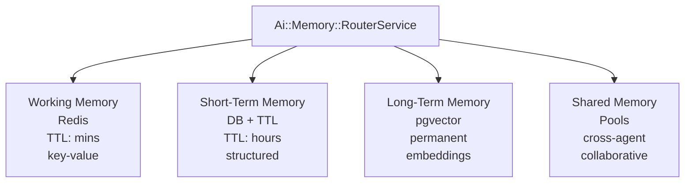
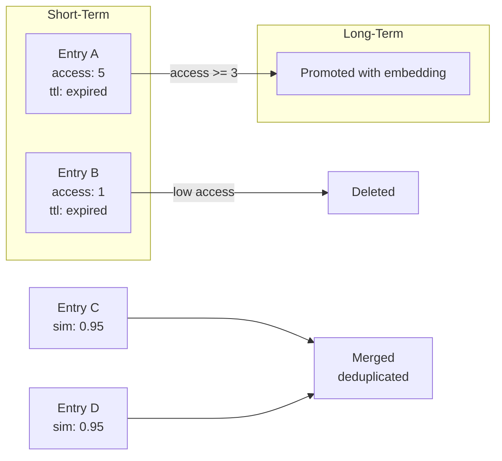
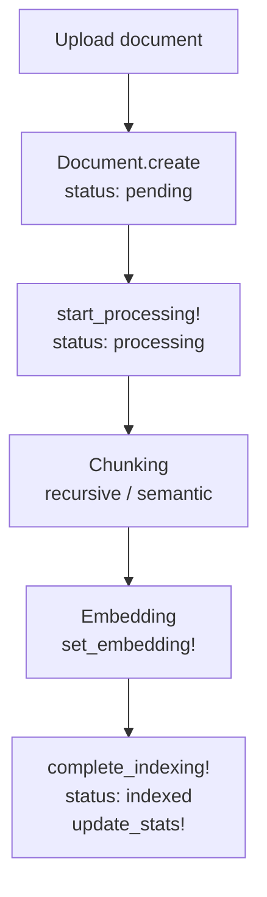
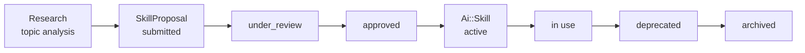

# Knowledge and Memory

> How Powernode agents persist context across executions, retrieve documents via RAG, manage skill capabilities, and link content through the knowledge graph.

## Table of Contents

- [What this concept covers](#what-this-concept-covers)
- [Memory tiers](#memory-tiers)
- [RAG system](#rag-system)
- [Skill graph](#skill-graph)
- [Content linking and the knowledge graph](#content-linking-and-the-knowledge-graph)
- [Automated maintenance](#automated-maintenance)
- [Related concepts](#related-concepts)
- [Materials previously at](#materials-previously-at)

## What this concept covers

Powernode agents need three kinds of persistent context: **working state** they can manipulate within a single task, **long-lived facts and experiences** they can recall semantically across sessions, and **reusable capabilities** they can discover, evolve, and share. Three subsystems handle these:

1. **Memory** — a four-tier hierarchy (working / short-term / long-term / shared) routed by `Ai::Memory::RouterService`
2. **RAG** — hybrid retrieval over knowledge bases, documents, and a knowledge graph
3. **Skill graph** — versioned, conflict-aware capability registry with proposal workflows

Content linking sits between them: pages and articles get knowledge-graph nodes with embeddings, so author-written wikilinks become typed edges that the same retrieval pipeline can traverse. The end result is that pages, KB articles, missions, agents, and skills coexist as nodes in one queryable graph.

This document covers the data models, services, and operational lifecycle. For how agents *use* this context, see [`concepts/agents-and-autonomy.md`](./agents-and-autonomy.md). For the MCP tool surface that exposes these capabilities to AI sessions, see [`concepts/mcp-and-tools.md`](./mcp-and-tools.md).

## Memory tiers

The memory system provides agents with persistent, searchable memory across multiple tiers. Working memory lives in Redis for fast access, short-term memory has TTL-based expiration, long-term memory uses pgvector for semantic search, and shared memory enables cross-agent knowledge exchange.



### Models

| Model | Tier | Purpose |
|-------|------|---------|
| Redis hash | Working | Session-scoped key-value, manipulated directly |
| `Ai::AgentShortTermMemory` | Short-term | TTL-based per-agent session entries (default 1 hour TTL) |
| `Ai::PersistentContext` + `Ai::ContextEntry` | Long-term | Long-lived containers with pgvector embeddings and access logs |
| `Ai::MemoryPool` | Shared | Cross-agent collaborative pools |
| `Ai::SharedContextPool` | Shared (workflow) | Workflow-scoped pools for multi-node data exchange |

### Short-term memory

```ruby
MEMORY_TYPES = %w[task_context conversation tool_result reflection observation]
DEFAULT_TTL = 3600  # 1 hour

# Per-agent session entries with TTL
ai_agent_short_term_memory:
  session_id, memory_key, memory_value (JSON), memory_type,
  ttl_seconds, expires_at, access_count, last_accessed_at
```

Key methods: `expired?`, `touch_access!`, `refresh_ttl!`, `self.cleanup_expired!`.

### Persistent context (long-term)

Long-lived context containers for agents and knowledge bases.

```ruby
CONTEXT_TYPES = %w[agent_memory knowledge_base shared_context tool_cache project_context]
SCOPES = %w[agent account team global]

# Container with snapshot/restore + access control
context.create_snapshot
context.restore_from_snapshot(snapshot_id)
context.archive!
context.grant_access(agent_id, level)
```

### Context entries (semantic search unit)

Individual entries within a `PersistentContext`, with pgvector embeddings:

```ruby
ENTRY_TYPES = %w[fact observation reflection decision plan tool_output conversation_summary]
SOURCE_TYPES = %w[agent user system tool workflow]
MEMORY_TYPES = %w[factual experiential working]

has_neighbors :embedding  # pgvector integration

# Versioned, importance-weighted, semantically searchable
entry.semantic_search(query_embedding, limit: 10)
entry.update_content(new_content, editor)  # creates new version
entry.boost_importance!
entry.effective_relevance_score  # combines importance, confidence, recency
```

### Memory pools (shared)

Cross-agent collaboration with access control:

```ruby
POOL_TYPES = %w[shared agent_private team_shared task_scoped]
SCOPES = %w[global account team agent task]

# Access control structure (stored as JSON)
{
  "read"        => ["agent-uuid-1", "agent-uuid-2"],
  "write"       => ["agent-uuid-1"],
  "public_read" => false
}

# Operations
pool.read_data
pool.write_data(data)
pool.merge_data(partial_data)
pool.accessible_by?(agent)
pool.grant_access(agent_id, level)
pool.revoke_access(agent_id)
pool.statistics  # entry count, size, access metrics
```

### Memory router

`Ai::Memory::RouterService` routes operations to the appropriate tier:

```ruby
router = Ai::Memory::RouterService.new(account: account, agent: agent)

value = router.read("session_context", session_id: "sess-123")
router.write("task_result", { output: "..." }, tier: :short_term, session_id: "sess-123")

results = router.semantic_search(query_embedding, limit: 10)

# Promote frequently-accessed short-term entries to long-term
router.consolidate!(session_id: "sess-123")

stats = router.stats
# => { working_memory: {...}, short_term: {...}, long_term: {...}, shared: {...} }
```

### Working memory service

Redis-backed fast key-value store for active sessions:

```ruby
wm = Ai::Memory::WorkingMemoryService.new(agent: agent, account: account, task: task)

# Basic ops
wm.store("key", value, ttl: 300)
wm.retrieve("key")
wm.exists?("key")
wm.remove("key")
wm.keys
wm.clear

# Specialized storage
wm.store_task_state(state_hash)
wm.store_intermediate_result(step_name, result)
wm.store_conversation_context(messages)
wm.append_to_conversation(message)
wm.store_tool_state(tool_name, state)
wm.store_scratch_pad(content)
wm.append_to_scratch_pad(content)

# Cross-agent sharing
wm.share_with_agent(target_agent_id, key, value)
shared_value = wm.retrieve_shared(source_agent_id, key)

# Persist Redis state to database
wm.persist_to_database
wm.load_from_database
```

### Consolidation pipeline



### Access control summary

Memory access is controlled at multiple levels:

1. **Account scope** — all memory is scoped to an account
2. **Agent scope** — private memory is only accessible to the owning agent
3. **Pool access control** — JSONB `access_control` field with read/write permissions
4. **Context access control** — per-agent grants on `PersistentContext`

## RAG system

The RAG (Retrieval-Augmented Generation) system provides document ingestion, chunking, embedding, and multi-modal retrieval. It supports vector search, keyword search, graph-based retrieval, and agentic iterative search with automatic query reformulation.

### Models

| Model | Purpose |
|-------|---------|
| `Ai::KnowledgeBase` | Container for documents with embedding configuration |
| `Ai::Document` | Source documents with processing lifecycle |
| `Ai::DocumentChunk` | Chunked document segments with pgvector embeddings |
| `Ai::RagQuery` | Query records with embedding and retrieval metadata |
| `Ai::HybridSearchResult` | Search result records across multiple modes |

### Document processing pipeline



**Chunking strategies:**

| Strategy | Behavior |
|----------|----------|
| `recursive` | Recursive character splitting with overlap |
| `semantic` | Semantic boundary detection |

Configurable via `chunk_size` and `chunk_overlap` on `KnowledgeBase`.

### Knowledge base configuration

```ruby
ai_knowledge_base:
  embedding_model      # e.g. "text-embedding-3-small"
  embedding_provider   # e.g. "openai"
  chunking_strategy    # recursive | semantic
  chunk_size           # target character count
  chunk_overlap        # overlap between adjacent chunks
  status               # active | indexing | paused | error | archived
```

Lifecycle: `start_indexing!`, `complete_indexing!`, `pause!`, `archive!`, `mark_error!`. Each query is logged via `record_query!`.

### Search modes

`Ai::Rag::HybridSearchService` combines multiple search strategies with result fusion:

```ruby
service = Ai::Rag::HybridSearchService.new(account: account)

results = service.search(
  query,
  mode: :hybrid,        # :vector, :keyword, :graph, :hybrid
  top_k: 10,
  knowledge_base_ids: [kb.id],
  rerank: true
)
```

| Mode | Description | Best For |
|------|-------------|----------|
| `:vector` | Semantic similarity via pgvector embeddings | Meaning-based queries |
| `:keyword` | Full-text search via PostgreSQL | Exact term matching |
| `:graph` | Knowledge graph traversal via `GraphRagService` | Entity relationship queries |
| `:hybrid` | Combines vector + keyword with fusion | General-purpose retrieval |

**Fusion methods:**

| Method | Description |
|--------|-------------|
| Reciprocal Rank Fusion (RRF, default) | Combines rankings using `1 / (k + rank)` formula with `k=60` |
| Weighted fusion | Weighted combination of normalized scores |

### Graph RAG

`Ai::Rag::GraphRagService` uses knowledge graph communities for retrieval:

```ruby
service = Ai::Rag::GraphRagService.new(account: account)
results = service.retrieve(query, top_k: 10, max_hops: 2, include_summaries: true)
context = service.build_context(query, token_budget: 4000, max_hops: 3)
```

Pipeline:

1. **Seed node discovery** — finds relevant graph nodes via embedding similarity
2. **Community detection** — discovers connected communities within max hops
3. **Chunk collection** — gathers document chunks linked to community nodes
4. **Scoring** — ranks results by relevance
5. **Summary building** — generates community summaries for context

Constants: `MAX_SEED_NODES = 5`, `SEED_DISTANCE_THRESHOLD = 0.8`, `MAX_COMMUNITIES = 10`, `COMMUNITY_MIN_SIZE = 3`.

### Agentic RAG

Iterative retrieval with LLM-driven query reformulation for complex queries:

```ruby
service = Ai::Rag::AgenticRagService.new(account: account)
result = service.retrieve(query, max_rounds: 3)
# => { answer: "...", sources: [...], rounds: 2, total_results: 15 }
```

Per-round pipeline:

1. **Search** — runs hybrid search
2. **Rerank** — re-scores results for relevance
3. **Sufficiency check** — `MIN_RELEVANT_RESULTS = 3`, `MIN_AVG_SCORE = 0.5`
4. **Gap identification** — what's missing from the results?
5. **Query reformulation** — LLM rewrites query to fill gaps
6. **Synthesis** — LLM generates answer from accumulated results

Max rounds: 3 (configurable via `MAX_ROUNDS`).

### Query and analytics

`Ai::RagQuery` records every query for analytics:

```ruby
has_neighbors :query_embedding

ai_rag_query:
  query_text, status, retrieval_strategy, top_k,
  similarity_threshold, results_count, avg_score,
  processing_time_ms

query.quality_score  # computed quality metric
```

`Ai::HybridSearchResult` records search results with mode and fusion metadata:

```ruby
SEARCH_MODES = %w[vector keyword graph hybrid]
FUSION_METHODS = %w[rrf weighted simple]

# Class method for optimization analysis
Ai::HybridSearchResult.avg_latency_for(mode)
```

### API and MCP surface

| Method | Path | Description |
|--------|------|-------------|
| `GET` | `/api/v1/ai/rag/query` | Query a knowledge base |
| `GET` | `/api/v1/ai/rag/search` | Search documents |
| `POST` | `/api/v1/ai/rag/knowledge_bases` | Create knowledge base |
| `POST` | `/api/v1/ai/rag/documents` | Upload document |
| `POST` | `/api/v1/ai/rag/documents/:id/process` | Trigger processing |

MCP tools expose RAG operations via `platform.query_knowledge_base`, `platform.search_documents`, `platform.add_document`, `platform.process_document`. See [`reference/auto/mcp-tools.md`](../reference/auto/mcp-tools.md) for the live catalog.

## Skill graph

The Skill Graph manages reusable capabilities that agents can possess and execute. Skills are versioned, categorized, and linked to agents via an assignment model. The system includes conflict detection, proposal workflows, gap detection, and automated lifecycle management.

### Models

| Model | Purpose |
|-------|---------|
| `Ai::Skill` | Core skill definition with category, status, execution context |
| `Ai::AgentSkill` | Many-to-many link between agents and skills |
| `Ai::SkillConflict` | Detected conflicts between overlapping skills |
| `Ai::SkillProposal` | Workflow for proposing new skills (submit → approve → create) |
| `Ai::SkillUsageRecord` | Tracks skill execution outcomes |
| `Ai::SkillVersion` | Version history with A/B testing support |

### Skill categories

```ruby
CATEGORIES = %w[
  code_generation code_review testing debugging deployment
  documentation analysis communication planning research
  data_processing security monitoring optimization
  integration automation design architecture
  project_management devops operations
]

STATUSES = %w[draft active deprecated archived]
```

### Skill lifecycle



### Lifecycle service

`Ai::SkillGraph::LifecycleService` provides end-to-end skill management:

```ruby
service = Ai::SkillGraph::LifecycleService.new(account: account)

# Research and propose a new skill
proposal = service.research_and_propose(
  "Kubernetes deployment automation",
  requesting_agent: agent,
  requesting_user: user
)

# Submit for review
service.submit_proposal(proposal.id)

# Approve and create
service.approve_proposal(proposal.id, reviewer: admin_user)
skill = service.create_skill_from_proposal(proposal.id)
```

Pipeline: research (via `ResearchService`) → propose (with inferred category + confidence) → submit → approve (auto-creates sub-proposals for dependencies) → create (builds `Skill`, initial `SkillVersion`, and dependency edges in knowledge graph).

### Conflict detection

`Ai::SkillConflict` records overlapping or contradictory skills:

```ruby
CONFLICT_TYPES = %w[overlap contradiction dependency version_mismatch naming]
SEVERITIES = %w[low medium high critical]
STATUSES = %w[detected acknowledged resolved dismissed]
SEVERITY_WEIGHTS = { "low" => 1, "medium" => 2, "high" => 4, "critical" => 8 }

conflict.resolve!
conflict.dismiss!
conflict.calculate_priority!
```

### Versioning

`Ai::SkillVersion` tracks version history with A/B testing:

```ruby
CHANGE_TYPES = %w[major minor patch hotfix experimental]

version.record_outcome!(success: true)
version.activate!  # Make this version active
```

### Support services

| Service | Purpose |
|---------|---------|
| `ConflictDetectionService` | Scans for overlapping skills daily at 4:15 AM |
| `HealthScoreService` | Calculates skill health from usage patterns and conflicts |
| `EvolutionService` | Tracks skill improvement over versions |
| `OptimizationService` | Suggests skill configuration improvements |
| `AutoRepairService` | Automatically resolves simple conflicts |
| `BridgeService` | Bridges skills to knowledge graph nodes |
| `TraversalService` | Graph traversal for skill dependency chains |
| `TeamCoverageService` | Analyzes skill coverage across agent teams |
| `ResearchService` | AI-powered skill research and analysis |
| `SelfLearningService` | Skill improvement from usage feedback |
| `ContextEnrichmentService` | Enriches skill execution context |

### Skill discovery

Skills are exposed to agents via MCP tools:

```ruby
platform.discover_skills(description: "deploy to kubernetes")
platform.get_skill_context(skill_id: "uuid")
platform.list_skills(category: "deployment", status: "active")
```

See [`reference/auto/skills.md`](../reference/auto/skills.md) for the live skill registry.

## Content linking and the knowledge graph

Content Linking extends `Page` and `KnowledgeBase::Article` with bidirectional linking on the knowledge graph. Authors reference other content with Obsidian-style wikilinks (`[[Title]]` or `[[Title|Display Text]]`), and the backend extracts those references into typed `references` edges on `Ai::KnowledgeGraphEdge`. Each referenced page can then render its backlinks panel, unlinked plain-text mentions, and semantically related pages.

The design goal is to give long-form content the same knowledge-graph surface area as structured entities, so pages, KB articles, missions, and agents all coexist as linkable nodes in one graph.

### Wikilink syntax

Inside `Page#content` (Markdown):

- `[[Feature Development Guide]]` — resolves to the `Page` or `KnowledgeBase::Article` with a matching title
- `[[Feature Development Guide|see the guide]]` — same resolution, custom display text
- Case-insensitive title matching, or exact match on a slug: `downcase.gsub(/[^a-z0-9\s-]/, "").gsub(/\s+/, "-")`

Resolution order:

1. `Page` scoped to the source page's `account`
2. `KnowledgeBase::Article` (not account-scoped)

Wikilinks that resolve to nothing are silently dropped from the edge set.

### ContentLinkService

```ruby
service = ContentLinkService.new(account: account)

# Extract wikilinks + persist as KG edges (idempotent per source node)
service.extract_links!(page)  # → Integer count of edges created

# Backlinks panel data
service.backlinks_for(page)  # → Array of Page | KB::Article records

# Plain-text mentions (not yet wikilinked)
service.unlinked_mentions_for(page)
# → Pages mentioning the title (excludes source, excludes already-wikilinked,
#    ordered by updated_at DESC, limit 20)

# Ensure KG node exists for a page
service.find_or_create_page_node(page)  # → Ai::KnowledgeGraphNode entity_type "page"

# Generate + store embedding for the page on its KG node
service.generate_page_embedding!(page)

# Find semantically similar pages via cosine similarity
service.related_pages_for(page, limit: 10)
# → Array of [content_record, similarity_float] pairs, DESC by similarity
```

### Edge model

```ruby
Ai::KnowledgeGraphEdge.create!(
  account: account,
  source_node: source_page_node,
  target_node: target_content_node,
  relation_type: "references",     # always "references" for wikilinks
  weight: 1.0,
  confidence: 1.0,
  bidirectional: false,
  metadata: { link_text: "[[Original Link Text]]" }
)
```

On re-extraction, `extract_links!` deletes all outgoing `references` edges from the source node first so the set stays canonical for the current content.

### Node model

Pages and articles get KG nodes with:

- `node_type: "entity"`
- `entity_type: "page"` or `"article"`
- `metadata: { content_type: "page" | "article", content_id: <uuid>, slug: <slug> }`

Nodes track `mention_count`, `status: "active"`, `confidence: 1.0` at creation. The node's name is kept in sync with the page title when `find_or_create_page_node` detects a mismatch.

### HTTP API

All endpoints require the `admin.access` permission.

| Method | Path | Purpose |
|--------|------|---------|
| `GET` | `/api/v1/admin/pages/:id/backlinks` | Pages/articles that `[[link]]` to this page |
| `GET` | `/api/v1/admin/pages/:id/unlinked_mentions` | Pages mentioning the title in plain text only |
| `GET` | `/api/v1/admin/pages/:id/related_pages?limit=N` | Semantic neighbors (default 10, max 50) |
| `POST` | `/api/v1/admin/pages/:id/extract_links` | Force re-extraction |
| `POST` | `/api/v1/admin/pages/:id/generate_embedding` | Force regeneration of the page's embedding |

Read endpoints respond:

```json
{
  "success": true,
  "data": {
    "backlinks": [
      { "id": "uuid", "title": "...", "slug": "...", "type": "page", "excerpt": "..." }
    ]
  }
}
```

`related_pages` entries additionally include `similarity` (0.0–1.0 cosine similarity).

### Integration points

- **Daily Summaries** — each summary is a `Page`, so wikilinks in a summary surface as backlinks on referenced pages. Daily reports become implicitly traversable through the graph
- **RAG** — page embeddings produced by `generate_page_embedding!` feed the same retrieval pipeline used by document search and KB RAG flows
- **Knowledge graph tooling** — all `references` edges show up under `platform.search_knowledge_graph` and `platform.get_graph_neighbors` when filtered on `relation_type: "references"`

## Automated maintenance

The knowledge, memory, and skill subsystems run on automated maintenance schedules. These are background jobs in `worker/`; see [`concepts/architecture.md`](./architecture.md) for the worker process model.

| Job | Schedule | Action |
|-----|----------|--------|
| Compound learning decay | 3:45 AM daily | `importance_score` decays exponentially on stale learnings |
| Memory consolidation | 4:00 AM daily | Promotes STM→long-term (`access_count >= 3`), deduplicates (`similarity >= 0.92`) |
| Rot detection | 4:00 AM daily | Auto-archives context entries with `staleness >= 0.9` |
| Trust score decay | 2:00 AM daily | Decays idle agent trust scores |
| Skill conflict scan | 4:15 AM daily | Detects new skill conflicts |
| Skill stale decay | 5:00 AM weekly | Reduces effectiveness of unused skills |
| Skill re-embedding | 5:00 AM weekly | Updates skill embeddings for discovery |
| Skill gap detection | 3:00 AM monthly | Identifies missing capabilities across teams |
| Shared knowledge maintenance | Daily | Import from learnings, recalculate quality scores, audit stale entries |
| Escalation timeout | Every 15 min | Auto-escalate overdue escalations |
| Goal maintenance | Every 6 hours | Auto-abandon stale goals |
| Observation pipeline | Every 30 min | Collect sensor data for autonomous agents |
| Observation cleanup | Daily | Delete expired and old processed observations |
| Proposal expiry | Every hour | Expire overdue unreviewed proposals |
| Intervention policy tuning | Weekly | Analyze approval patterns and suggest policy adjustments |

## Related concepts

- [`concepts/agents-and-autonomy.md`](./agents-and-autonomy.md) — how agents use this knowledge
- [`concepts/mcp-and-tools.md`](./mcp-and-tools.md) — MCP tool surface for memory/knowledge/skills
- [`reference/auto/knowledge-base.md`](../reference/auto/knowledge-base.md) — live KB content
- [`reference/auto/knowledge-graph.md`](../reference/auto/knowledge-graph.md) — live KG statistics
- [`reference/auto/learnings.md`](../reference/auto/learnings.md) — live compound learning registry
- [`reference/auto/skills.md`](../reference/auto/skills.md) — live skill registry
- [`guides/backend.md`](../guides/backend.md) — backend implementation patterns
- [`guides/content-management.md`](../guides/content-management.md) — content authoring workflow

## Materials previously at

This concept consolidates content from:

- `docs/platform/MEMORY_SYSTEM_ARCHITECTURE.md`
- `docs/platform/RAG_SYSTEM_GUIDE.md`
- `docs/platform/SKILL_GRAPH_REFERENCE.md`
- `docs/platform/CONTENT_LINKING.md`

_Last verified: 2026-05-17_
