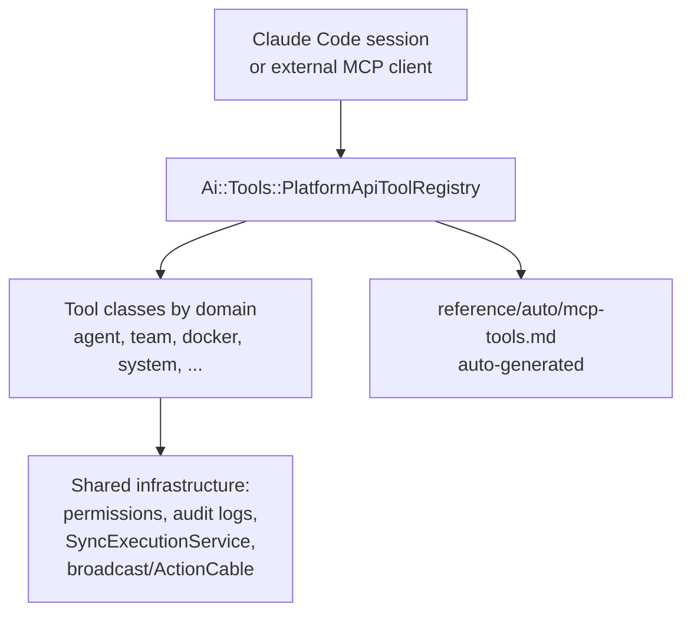

# MCP and Tools

> Status: active

> Model Context Protocol — how AI sessions invoke `platform.*` tools, how the MCP server dispatches them, and where the tool registry lives.

## Table of Contents

- [What this concept covers](#what-this-concept-covers)
- [`platform.*` tool registry](#platform-tool-registry)
- [Claude Code integration](#claude-code-integration)
- [Telemetry and monitoring](#telemetry-and-monitoring)
- [Adding a new tool](#adding-a-new-tool)
- [Tool catalog](#tool-catalog)
- [Related concepts](#related-concepts)
- [Extending the Tool Registry](#extending-the-tool-registry)
- [Materials previously at](#materials-previously-at)

## What this concept covers

MCP (Model Context Protocol) is how external AI sessions (Claude Code, custom agents, the chat concierge) reach into Powernode to invoke platform capabilities. The platform exposes its surface as `platform.*` tool actions — every action a session can take, from agent execution to Docker container lifecycle, is a registered tool with a JSON Schema, permission gate, and audit trail.

This document covers the tool registry and the MCP server that fronts it. For the live action catalog (every tool, every parameter, every example), see [`reference/auto/mcp-tools.md`](../reference/auto/mcp-tools.md) — that file is auto-generated from `Ai::Tools::PlatformApiToolRegistry.all_tools` (static core `TOOLS` plus any extension-registered tools) and is the only source of truth for what's currently registered. Do not inline counts; query the catalog.

## `platform.*` tool registry

The platform exposes its capability surface through `Ai::Tools::PlatformApiToolRegistry`, which maps action names (`platform.create_agent`, `platform.docker_list_containers`, etc.) to tool classes that handle parameter validation, permission checks, execution, and audit logging.



### Tool class structure

```ruby
# server/app/services/ai/tools/<domain>_tool.rb
class Ai::Tools::AgentTool
  ACTIONS = {
    "create_agent" => :create_agent,
    "list_agents"  => :list_agents,
    # ...
  }.freeze

  def action_definitions
    {
      "create_agent" => {
        description: "Create a new AI agent with provider and model config",
        parameters: { ... }  # JSON Schema
      },
      # ...
    }
  end

  def create_agent(params)
    # Permission check
    # Execute via service
    # Audit log
    # Return structured result
  end
end
```

### Registry composition

```ruby
# server/app/services/ai/tools/platform_api_tool_registry.rb
class Ai::Tools::PlatformApiToolRegistry
  TOOLS = {
    "agent"   => Ai::Tools::AgentTool,
    "team"    => Ai::Tools::TeamTool,
    "docker"  => Ai::Tools::DockerTool,
    "system"  => Ai::Tools::SystemTool,
    # ... etc
  }.freeze
end
```

### Tool categories

Tools are organized by domain. For the live catalog with full parameter schemas, see [`reference/auto/mcp-tools.md`](../reference/auto/mcp-tools.md). Categories include:

- **Discovery & context** — `search_knowledge`, `query_learnings`, `discover_skills`, `search_memory`, `get_api_reference`, `code_semantic_search`
- **Knowledge contribution** — `create_learning`, `create_knowledge`, `extract_to_knowledge_graph`, `create_skill`
- **Quality & reinforcement** — `verify_learning`, `reinforce_learning`, `rate_knowledge`, `resolve_contradiction`
- **Agent management** — `create_agent`, `list_agents`, `execute_agent`
- **Team management** — `create_team`, `add_team_member`, `execute_team`
- **Knowledge graph** — `get_graph_node`, `search_knowledge_graph`, `reason_knowledge_graph`
- **Memory** — `write_shared_memory`, `read_shared_memory`, `consolidate_memory`
- **RAG** — `query_knowledge_base`, `add_document`, `process_document`
- **AI autonomy & safety** — `emergency_halt`, `kill_switch_status`, `create_proposal`, `escalate`
- **Codebase intelligence** — `code_context_tree`, `code_blast_radius`, `code_static_analysis`
- **DevOps & CI/CD** — `dispatch_to_runner`, `trigger_pipeline`, `get_pipeline_status`
- **Docker management** — `docker_list_containers`, `docker_deploy_stack`, `docker_node_promote`
- **System extension** — `system_*` actions when the system extension is enabled

### Regenerating the catalog

```bash
cd server
bundle exec rails mcp:generate_tool_catalog
```

This rake task introspects `Ai::Tools::PlatformApiToolRegistry.all_tools`, calls `action_definitions` on each tool class, and writes `docs/reference/auto/mcp-tools.md`. The catalog regenerates automatically on tool-class change and is the only source for action counts and parameter shapes.

## Claude Code integration

Claude Code invokes `platform.*` tools directly via the streamable-HTTP MCP server registered in `.claude/settings.json`. The relevant entry points at `http://localhost:3000/api/v1/mcp/message`. No external daemon, no helper scripts — Claude Code calls the tool by name and the Rails MCP controller dispatches through the registry.

The session lifecycle:

| Phase | Behavior |
|-------|----------|
| Connect | Claude Code opens streamable-HTTP session; server creates `McpSession` row |
| Authenticate | OAuth handshake; session bound to a Powernode `User` and `Account` |
| Discovery | Claude Code lists available tools via `tools/list` MCP method — one-line descriptions; `platform.describe_tool` returns a tool's full entry on demand |
| Invocation | Claude Code calls `tools/call` with action name and params; server validates permission, dispatches to tool class, returns structured result |
| Reconnect | Lost connections reuse the same session if within the 10-minute grace window — agent state survives reconnects |
| Cleanup | A daily job at 3 AM cleans up expired sessions |

For configuring Claude Code itself, see [`getting-started/01-quickstart.md`](../getting-started/01-quickstart.md) and the `.claude/settings.json` reference in [`guides/devops.md`](../guides/devops.md).

## Telemetry and monitoring

Tool invocations emit structured audit and metric events so operators can trace which session called which action, with what parameters, and to what effect.

### Audit logging

Every tool action writes an `AuditLog` row capturing the action name, invoking `User`/`Account`, parameters, and a result summary. This is the authoritative record of MCP-driven changes and feeds the governance surfaces.

### Real-time broadcasts

State changes triggered by tool actions push to subscribed UI components over ActionCable:

```ruby
ActionCable.server.broadcast(
  "ai_orchestration:account:#{account.id}",
  {
    event: 'tool.executed',
    payload: {
      action: action_name,
      status: status,
      executed_at: Time.current.iso8601
    }
  }
)
```

See [`concepts/chat-and-realtime.md`](./chat-and-realtime.md) for the channel layout.

## Adding a new tool

1. **Create the tool class** in `server/app/services/ai/tools/`:

   ```ruby
   class Ai::Tools::MyDomainTool
     ACTIONS = { "my_action" => :my_action }.freeze

     def action_definitions
       {
         "my_action" => {
           description: "What this does",
           parameters: { /* JSON Schema */ }
         }
       }
     end

     def my_action(params)
       # validation
       # permission check
       # execution
       # audit log
     end
   end
   ```

2. **Add action→class mapping** to `PlatformApiToolRegistry::TOOLS`

3. **Define `action_definitions`** with descriptions and parameter schemas

4. **Regenerate the catalog**:

   ```bash
   cd server && bundle exec rails mcp:generate_tool_catalog
   ```

5. **Update relevant concept docs** if the tool is part of a documented capability

6. **Create a learning** via `platform.create_learning` category `pattern` documenting the new tool — feeds future agent sessions

### Deprecating a tool

1. Add a deprecation notice to the `action_definitions` description
2. Create a learning via `platform.create_learning` category `best_practice` documenting the replacement
3. Remove from concept docs after the migration period

### Best practices for tool implementation

```ruby
class Ai::Tools::MyTool
  def my_action(params)
    # 1. Validate configuration
    validate_params!(params)

    # 2. Permission check
    require_permission(current_user, "my.domain.action")

    # 3. Execute via service
    result = MyDomainService.new(account: account).execute(params)

    # 4. Audit log
    AuditLog.create!(action: "my.action", payload: params, result: result.summary)

    # 5. Return structured format
    {
      success: true,
      data: result,
      metadata: { action: "my_action", executed_at: Time.current.iso8601 }
    }
  end

  private

  def validate_params!(params)
    raise ArgumentError, "Required field missing" unless params[:required_field]
  end
end
```

## Tool catalog

The live tool catalog — every action, parameter, example, and permission — lives at [`reference/auto/mcp-tools.md`](../reference/auto/mcp-tools.md). It is auto-generated from `Ai::Tools::PlatformApiToolRegistry.all_tools` and regenerates via `cd server && bundle exec rails mcp:generate_tool_catalog`.

**Do not inline action counts, tool class counts, or per-domain numbers in concept or guide docs.** Always link to the catalog. Counts drift; the auto-generated reference is the source of truth.

## Related concepts

- [`concepts/agents-and-autonomy.md`](./agents-and-autonomy.md) — how agents use MCP tools
- [`concepts/knowledge-and-memory.md`](./knowledge-and-memory.md) — knowledge/memory tools
- [`concepts/chat-and-realtime.md`](./chat-and-realtime.md) — channels broadcasting tool execution events
- [`reference/auto/mcp-tools.md`](../reference/auto/mcp-tools.md) — live tool catalog
- [`guides/backend.md`](../guides/backend.md) — adding tools

## Extending the Tool Registry

Tool registration follows a deterministic three-touch flow: drop a new tool class into `server/app/services/ai/tools/`, register the actions it exposes inside `Ai::Tools::PlatformApiToolRegistry::TOOLS`, then regenerate the catalog so downstream documentation and discovery surfaces (Claude Code's `tools/list`, the workspace concierge, the auto-generated reference) see the new actions. The registry is class-method dispatched — no autoload hook, no metaprogramming — so the only thing tying an action name to a tool is the explicit mapping in `TOOLS`.

### Recipe

1. **Create `server/app/services/ai/tools/<feature>_tool.rb`** with `REQUIRED_PERMISSION` (a string like `ai.agents.read`) and `action_definitions` returning the per-action JSON Schema:

   ```ruby
   # frozen_string_literal: true

   module Ai
     module Tools
       class FeatureTool < BaseTool
         REQUIRED_PERMISSION = "ai.feature.read"

         def self.action_definitions
           {
             "feature_do_thing" => {
               description: "Run the thing once",
               parameters: { id: { type: "string", required: true } }
             }
           }
         end

         protected

         def call(params)
           # validation → permission check → execution → audit log
         end
       end
     end
   end
   ```

2. **Add to `Ai::Tools::PlatformApiToolRegistry::TOOLS`** — map every action name your class handles to the class string (the registry uses string class names so it can stay autoload-safe):

   ```ruby
   "feature_do_thing" => "Ai::Tools::FeatureTool",
   ```

3. **Run `cd server && bundle exec rails mcp:generate_tool_catalog`** — this introspects the registry, calls `action_definitions` on each class, and rewrites `docs/reference/auto/mcp-tools.md`.

4. **Verify your action appears in [`reference/auto/mcp-tools.md`](../reference/auto/mcp-tools.md)** — if the action is missing, the registry entry or the `action_definitions` method is the most likely cause.

For the in-line `## Adding a new tool` walkthrough (with implementation patterns, audit log examples, deprecation flow), see the section above. Full walkthrough at [`guides/mcp-tool-development.md`](../guides/mcp-tool-development.md).

## Materials previously at

This concept consolidates content from:

- `docs/platform/MCP_INTEGRATION_GUIDE.md`
- `docs/platform/MCP_CONFIGURATION.md`

_Last verified: 2026-06-03_
