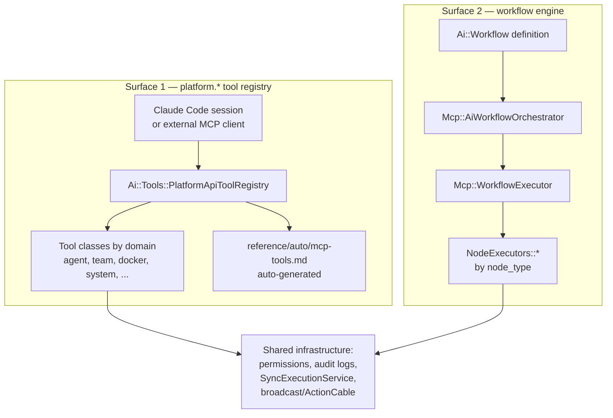
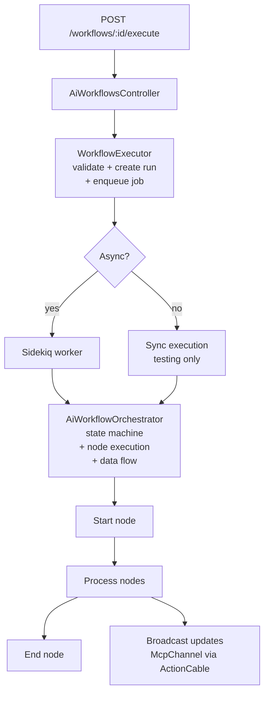
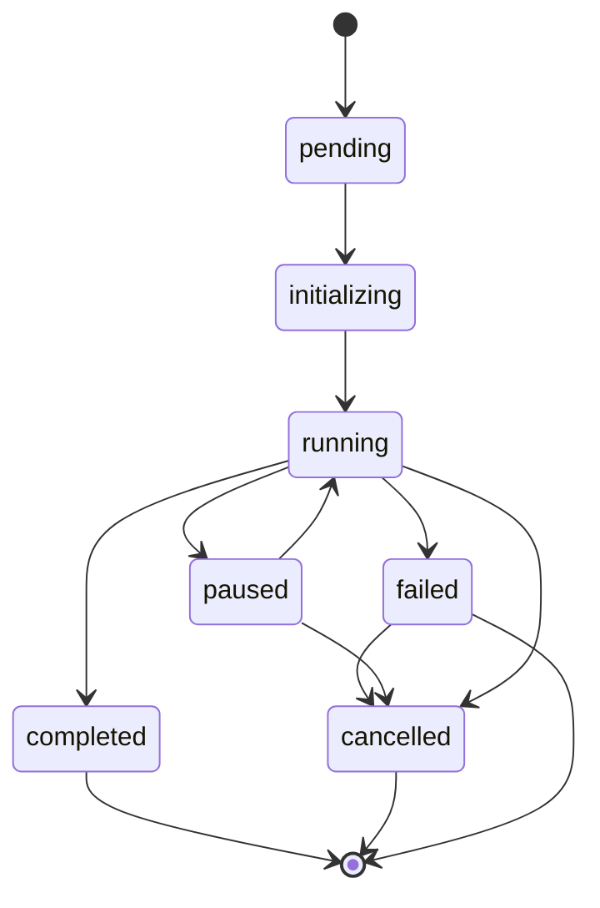
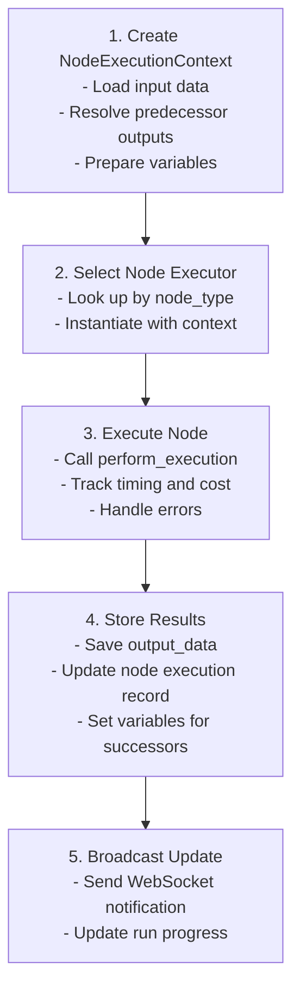

# MCP and Tools

> Model Context Protocol — how AI sessions invoke `platform.*` tools, how workflows dispatch nodes, and where the tool registry lives.

## Table of Contents

- [What this concept covers](#what-this-concept-covers)
- [Two MCP surfaces](#two-mcp-surfaces)
- [`platform.*` tool registry](#platform-tool-registry)
- [Claude Code integration](#claude-code-integration)
- [Workflow MCP architecture](#workflow-mcp-architecture)
- [Node execution pipeline](#node-execution-pipeline)
- [State management](#state-management)
- [Error recovery](#error-recovery)
- [Telemetry and monitoring](#telemetry-and-monitoring)
- [Adding a new tool](#adding-a-new-tool)
- [Tool catalog](#tool-catalog)
- [Related concepts](#related-concepts)
- [Materials previously at](#materials-previously-at)

## What this concept covers

MCP (Model Context Protocol) is how external AI sessions (Claude Code, custom agents, the chat concierge) reach into Powernode to invoke platform capabilities. The platform exposes its surface as `platform.*` tool actions — every action a session can take, from agent execution to Docker container lifecycle, is a registered tool with a JSON Schema, permission gate, and audit trail.

Internally, the same protocol also drives **workflows**: graph-based pipelines composed of typed nodes (AI agent calls, conditions, loops, API calls, content management) executed by `Mcp::AiWorkflowOrchestrator`. The two surfaces share infrastructure but serve different audiences: the registry is for external AI sessions; the workflow engine is for authored execution graphs.

This document covers both. For the live action catalog (every tool, every parameter, every example), see [`reference/auto/mcp-tools.md`](../reference/auto/mcp-tools.md) — that file is auto-generated from `Ai::Tools::PlatformApiToolRegistry::TOOLS` and is the only source of truth for what's currently registered. Do not inline counts; query the catalog.

## Two MCP surfaces



| Surface | Purpose | Entry Point |
|---------|---------|-------------|
| Tool registry | External AI sessions invoke platform capabilities | `Ai::Tools::PlatformApiToolRegistry` |
| Workflow engine | Authored execution graphs of typed nodes | `Mcp::AiWorkflowOrchestrator` |

## `platform.*` tool registry

The platform exposes its capability surface through `Ai::Tools::PlatformApiToolRegistry`, which maps action names (`platform.create_agent`, `platform.docker_list_containers`, etc.) to tool classes that handle parameter validation, permission checks, execution, and audit logging.

### Tool class structure

```ruby
# server/app/services/ai/tools/<domain>_tool.rb
class Ai::Tools::AgentTool
  ACTIONS = {
    "create_agent" => :create_agent,
    "list_agents"  => :list_agents,
    # ...
  }.freeze

  def action_definitions
    {
      "create_agent" => {
        description: "Create a new AI agent with provider and model config",
        parameters: { ... }  # JSON Schema
      },
      # ...
    }
  end

  def create_agent(params)
    # Permission check
    # Execute via service
    # Audit log
    # Return structured result
  end
end
```

### Registry composition

```ruby
# server/app/services/ai/tools/platform_api_tool_registry.rb
class Ai::Tools::PlatformApiToolRegistry
  TOOLS = {
    "agent"   => Ai::Tools::AgentTool,
    "team"    => Ai::Tools::TeamTool,
    "docker"  => Ai::Tools::DockerTool,
    "system"  => Ai::Tools::SystemTool,
    # ... etc
  }.freeze
end
```

### Tool categories

Tools are organized by domain. For the live catalog with full parameter schemas, see [`reference/auto/mcp-tools.md`](../reference/auto/mcp-tools.md). Categories include:

- **Discovery & context** — `search_knowledge`, `query_learnings`, `discover_skills`, `search_memory`, `get_api_reference`, `code_semantic_search`
- **Knowledge contribution** — `create_learning`, `create_knowledge`, `extract_to_knowledge_graph`, `create_skill`
- **Quality & reinforcement** — `verify_learning`, `reinforce_learning`, `rate_knowledge`, `resolve_contradiction`
- **Agent management** — `create_agent`, `list_agents`, `execute_agent`
- **Team management** — `create_team`, `add_team_member`, `execute_team`
- **Knowledge graph** — `get_graph_node`, `search_knowledge_graph`, `reason_knowledge_graph`
- **Memory** — `write_shared_memory`, `read_shared_memory`, `consolidate_memory`
- **RAG** — `query_knowledge_base`, `add_document`, `process_document`
- **AI autonomy & safety** — `emergency_halt`, `kill_switch_status`, `create_proposal`, `escalate`
- **Codebase intelligence** — `code_context_tree`, `code_blast_radius`, `code_static_analysis`
- **DevOps & CI/CD** — `dispatch_to_runner`, `trigger_pipeline`, `get_pipeline_status`
- **Docker management** — `docker_list_containers`, `docker_deploy_stack`, `docker_node_promote`
- **System extension** — `system_*` actions when the system extension is enabled

### Regenerating the catalog

```bash
cd server
bundle exec rails mcp:generate_tool_catalog
```

This rake task introspects `Ai::Tools::PlatformApiToolRegistry::TOOLS`, calls `action_definitions` on each tool class, and writes `docs/reference/auto/mcp-tools.md`. The catalog regenerates automatically on tool-class change and is the only source for action counts and parameter shapes.

## Claude Code integration

Claude Code invokes `platform.*` tools directly via the streamable-HTTP MCP server registered in `.claude/settings.json`. The relevant entry points at `http://localhost:3000/api/v1/mcp/message`. No external daemon, no helper scripts — Claude Code calls the tool by name and the Rails MCP controller dispatches through the registry.

The session lifecycle:

| Phase | Behavior |
|-------|----------|
| Connect | Claude Code opens streamable-HTTP session; server creates `McpSession` row |
| Authenticate | OAuth handshake; session bound to a Powernode `User` and `Account` |
| Discovery | Claude Code lists available tools via `tools/list` MCP method |
| Invocation | Claude Code calls `tools/call` with action name and params; server validates permission, dispatches to tool class, returns structured result |
| Reconnect | Lost connections reuse the same session if within the 10-minute grace window — agent state survives reconnects |
| Cleanup | A daily job at 3 AM cleans up expired sessions |

For configuring Claude Code itself, see [`getting-started/01-quickstart.md`](../getting-started/01-quickstart.md) and the `.claude/settings.json` reference in [`guides/devops.md`](../guides/devops.md).

## Workflow MCP architecture

The workflow engine executes graph-based pipelines composed of typed nodes. It supports AI agents, integrations, conditional branching, loops, and DevOps automation, with saga-style compensation, circuit breakers for provider resilience, checkpointing for long-running workflows, and real-time WebSocket updates.

### Directory layout

```
server/app/services/mcp/
├── # Core orchestration
├── ai_workflow_orchestrator.rb    # Main orchestrator
├── workflow_executor.rb           # Execution entry point
├── workflow_state_machine.rb      # State transitions
├── saga_coordinator.rb            # Transaction management
│
├── # Node execution
├── node_executors/                # Node type executors
│   ├── base.rb                    # Base executor class
│   └── ...                        # Individual node types
├── node_execution_context.rb      # Execution context
├── conditional_evaluator.rb       # Condition evaluation
│
├── # State & recovery
├── workflow_state_manager.rb      # State persistence
├── workflow_checkpoint_manager.rb # Checkpointing
├── advanced_error_recovery_service.rb
│
├── # Protocol services
├── protocol_service.rb            # MCP protocol handling
├── transport_service.rb           # Transport layer
├── security_service.rb            # Security & auth
├── permission_validator.rb        # Permission checks
│
├── # Integration services
├── prompt_service.rb              # Prompt management
├── resource_service.rb            # Resource access
├── registry_service.rb            # Tool registry
├── oauth_service.rb               # OAuth integration
│
├── # Monitoring
├── telemetry_service.rb           # Metrics & tracing
├── execution_tracer.rb            # Execution tracing
├── workflow_monitor.rb            # Health monitoring
├── broadcast_service.rb           # WebSocket broadcasts
│
└── # Events & analytics
    ├── workflow_event_store.rb
    ├── execution_event_store.rb
    └── workflow_analytics_engine.rb
```

### Execution flow



### Component responsibilities

| Component | Responsibility |
|-----------|---------------|
| `WorkflowExecutor` | Entry point, validation, job dispatch |
| `AiWorkflowOrchestrator` | Node traversal, data flow, error handling |
| `WorkflowStateMachine` | State transitions, validations |
| `NodeExecutors::*` | Individual node type logic |
| `SagaCoordinator` | Transaction management, compensation |
| `BroadcastService` | Real-time WebSocket updates |

### State machine



Implemented by `Mcp::WorkflowStateMachine`:

```ruby
STATES = %i[pending initializing running paused completed failed cancelled].freeze

def transition_to(new_state)
def can_transition_to?(new_state)
def valid_transitions
```

## Node execution pipeline



### NodeExecutionContext

```ruby
class Mcp::NodeExecutionContext
  attr_reader :node, :workflow_run, :input_data, :previous_results, :variables

  def initialize(node:, workflow_run:, orchestrator:)
    @input_data = build_input_data
    @previous_results = load_predecessor_outputs
    @variables = merge_variables
  end

  def get_variable(name)
    @variables[name.to_s] || @variables[name.to_sym]
  end

  def set_variable(name, value)
    @variables[name.to_s] = value
  end
end
```

### Executor selection

```ruby
def select_executor(node)
  executor_class = case node.node_type
  when 'start'    then NodeExecutors::Start
  when 'end'      then NodeExecutors::End
  when 'ai_agent' then NodeExecutors::AiAgent
  when 'condition' then NodeExecutors::Condition
  when 'loop'     then NodeExecutors::Loop
  when 'api_call' then NodeExecutors::ApiCall
  # ... additional node types
  else
    raise UnknownNodeTypeError, "Unknown node type: #{node.node_type}"
  end

  executor_class.new(
    node: node,
    node_execution: node_execution,
    node_context: context,
    orchestrator: self
  )
end
```

### Data flow between nodes

Predecessor outputs auto-wire into successor input data:

```ruby
def auto_wire_predecessor_outputs
  incoming_edges.each do |edge|
    predecessor_result = @previous_results[edge.source_node_id]

    if edge.data_mapping.present?
      # Apply explicit mapping
      apply_data_mapping(edge.data_mapping, predecessor_result)
    else
      # Auto-merge output, data, result keys
      @input_data.merge!(predecessor_result[:output_data] || {})
    end
  end
end
```

## State management

### Saga pattern

`SagaCoordinator` implements the saga pattern for distributed transactions:

```ruby
class Mcp::SagaCoordinator
  def initialize(workflow_run)
    @workflow_run = workflow_run
    @completed_steps = []
    @compensation_handlers = {}
  end

  def execute_step(step_name, &block)
    result = yield
    @completed_steps << { name: step_name, result: result }
    result
  rescue StandardError => e
    compensate
    raise
  end

  def register_compensation(step_name, &handler)
    @compensation_handlers[step_name] = handler
  end

  def compensate
    @completed_steps.reverse.each do |step|
      handler = @compensation_handlers[step[:name]]
      handler&.call(step[:result])
    end
  end
end
```

### Workflow state persistence

```ruby
# Save state after each node
def save_execution_state
  state = {
    current_node_id: @current_node&.id,
    completed_nodes: @completed_nodes.map(&:id),
    variables: @variables,
    results: serialize_results(@node_results)
  }

  WorkflowStateManager.save_state(@workflow_run, state)
end

# Restore from checkpoint
def restore_from_checkpoint(checkpoint_id)
  checkpoint = WorkflowCheckpointManager.restore_from_checkpoint(
    @workflow_run,
    checkpoint_id
  )

  @current_node = find_node(checkpoint.node_id)
  @variables = checkpoint.variables
  @node_results = deserialize_results(checkpoint.results)
end
```

## Error recovery

`Mcp::AdvancedErrorRecoveryService` chooses a recovery strategy per error type:

```ruby
RECOVERY_STRATEGIES = %i[retry skip fallback compensate escalate].freeze

def determine_strategy(error)
  case error
  when Timeout::Error, Net::OpenTimeout then :retry
  when ValidationError                   then :skip
  when ProviderError                     then :fallback
  when CriticalError                     then :compensate
  else                                        :escalate
  end
end
```

### Retry with exponential backoff

```ruby
def retry_with_backoff
  max_retries = @node.configuration['max_retries'] || 3
  base_delay = @node.configuration['retry_delay'] || 1

  @node_execution.retry_count.times do |attempt|
    return if attempt >= max_retries

    delay = base_delay * (2 ** attempt) + rand(0.0..0.5)
    sleep(delay)

    begin
      return execute_node(@node)
    rescue StandardError => e
      @logger.warn "Retry #{attempt + 1} failed: #{e.message}"
    end
  end

  raise MaxRetriesExceeded, "Node failed after #{max_retries} retries"
end
```

## Telemetry and monitoring

### TelemetryService

Collects execution metrics — workflow ID, run ID, timing, cost, per-node detail, completion status.

```ruby
service.record_execution_start(workflow_run)
service.record_node_execution(node_execution)
service.record_execution_complete(status)
```

### BroadcastService

Real-time WebSocket updates push state changes to subscribed UI components:

```ruby
ActionCable.server.broadcast(
  "ai_orchestration:workflow_run:#{workflow_run.id}",
  {
    event: 'workflow.status_changed',
    payload: {
      run_id: workflow_run.id,
      old_status: old_status,
      new_status: new_status,
      updated_at: Time.current.iso8601
    }
  }
)
```

See [`concepts/chat-and-realtime.md`](./chat-and-realtime.md) for the channel layout.

### WorkflowMonitor

Health and performance monitoring:

```ruby
service.check_health
# => { status: 'healthy', active_runs: N, stuck_runs: 0,
#      avg_execution_time: ms, error_rate: rate_last_hour }

service.detect_stuck_runs
# => Runs in 'initializing' or 'running' for > 30 minutes
```

## Adding a new tool

1. **Create the tool class** in `server/app/services/ai/tools/`:

   ```ruby
   class Ai::Tools::MyDomainTool
     ACTIONS = { "my_action" => :my_action }.freeze

     def action_definitions
       {
         "my_action" => {
           description: "What this does",
           parameters: { /* JSON Schema */ }
         }
       }
     end

     def my_action(params)
       # validation
       # permission check
       # execution
       # audit log
     end
   end
   ```

2. **Add action→class mapping** to `PlatformApiToolRegistry::TOOLS`

3. **Define `action_definitions`** with descriptions and parameter schemas

4. **Regenerate the catalog**:

   ```bash
   cd server && bundle exec rails mcp:generate_tool_catalog
   ```

5. **Update relevant concept docs** if the tool is part of a documented capability

6. **Create a learning** via `platform.create_learning` category `pattern` documenting the new tool — feeds future agent sessions

### Deprecating a tool

1. Add a deprecation notice to the `action_definitions` description
2. Create a learning via `platform.create_learning` category `best_practice` documenting the replacement
3. Remove from concept docs after the migration period

### Best practices for tool implementation

```ruby
class Ai::Tools::MyTool
  def my_action(params)
    # 1. Validate configuration
    validate_params!(params)

    # 2. Permission check
    require_permission(current_user, "my.domain.action")

    # 3. Execute via service
    result = MyDomainService.new(account: account).execute(params)

    # 4. Audit log
    AuditLog.create!(action: "my.action", payload: params, result: result.summary)

    # 5. Return structured format
    {
      success: true,
      data: result,
      metadata: { action: "my_action", executed_at: Time.current.iso8601 }
    }
  end

  private

  def validate_params!(params)
    raise ArgumentError, "Required field missing" unless params[:required_field]
  end
end
```

## Tool catalog

The live tool catalog — every action, parameter, example, and permission — lives at [`reference/auto/mcp-tools.md`](../reference/auto/mcp-tools.md). It is auto-generated from `Ai::Tools::PlatformApiToolRegistry::TOOLS` and regenerates via `cd server && bundle exec rails mcp:generate_tool_catalog`.

**Do not inline action counts, tool class counts, or per-domain numbers in concept or guide docs.** Always link to the catalog. Counts drift; the auto-generated reference is the source of truth.

## Related concepts

- [`concepts/agents-and-autonomy.md`](./agents-and-autonomy.md) — how agents use MCP tools
- [`concepts/knowledge-and-memory.md`](./knowledge-and-memory.md) — knowledge/memory tools
- [`concepts/chat-and-realtime.md`](./chat-and-realtime.md) — channels broadcasting tool execution events
- [`reference/auto/mcp-tools.md`](../reference/auto/mcp-tools.md) — live tool catalog
- [`reference/node-executors.md`](../reference/node-executors.md) — workflow node executor reference
- [`guides/backend.md`](../guides/backend.md) — adding tools and node executors

## Materials previously at

This concept consolidates content from:

- `docs/platform/MCP_INTEGRATION_GUIDE.md`
- `docs/platform/MCP_CONFIGURATION.md`

_Last verified: 2026-05-17_
