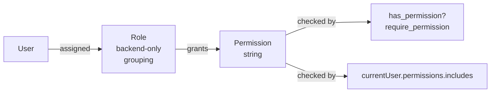
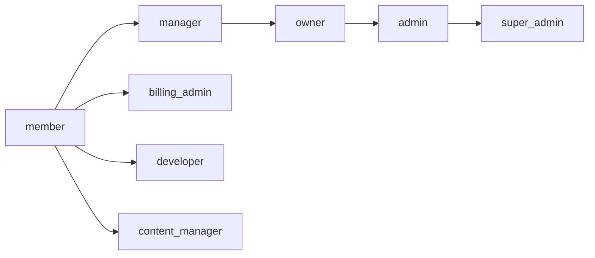

# Permissions

> Permission-based access control. Frontend uses permissions only; roles exist purely as backend permission groupings.

## Table of Contents

- [What this concept covers](#what-this-concept-covers)
- [Core principle](#core-principle)
- [Naming convention](#naming-convention)
- [Backend authorization](#backend-authorization)
- [Frontend access control](#frontend-access-control)
- [Permission categories](#permission-categories)
- [Roles (backend permission groupings)](#roles-backend-permission-groupings)
- [Three-tier permission system](#three-tier-permission-system)
- [Forbidden patterns](#forbidden-patterns)
- [Database schema](#database-schema)
- [Migration history](#migration-history)
- [Agent-Specific Permission Examples](#agent-specific-permission-examples)
- [Related concepts](#related-concepts)
- [Materials previously at](#materials-previously-at)

## What this concept covers

Powernode access control follows one absolute mandate: **use permissions, never roles**. Roles exist only in the backend, only as a mechanism to group permissions for assignment. The frontend never checks a user's role; it checks individual permission strings.

This concept doc explains why, defines the naming convention, shows the correct backend and frontend patterns, walks through the three-tier permission structure (resource / admin / system), and documents the role catalog. The canonical permission registry — the live list of every permission with its description and current role assignments — lives at [`reference/permissions.md`](../reference/permissions.md).

Permission counts and category totals reflect the most recent audit; for current numbers, run `cd server && rails runner "puts Permission.count"` or query `platform.search_knowledge` for "permission system".

## Core principle



**Three-layer rule:**

1. **Database** stores roles and permissions; roles join to permissions through `role_permissions`
2. **Backend** authorizes actions by calling `current_user.has_permission?('resource.action')` — never by inspecting roles
3. **Frontend** authorizes UI by checking `currentUser?.permissions?.includes('resource.action')` — never by inspecting roles

The frontend has no concept of "admin"; it has the concept of "user with `admin.access` permission". This means access can be granted granularly without inventing new roles, and reading the codebase tells you exactly what each user can do.

## Naming convention

All permissions follow a consistent singular-resource convention:

```
namespace.resource.action
```

Where:

| Component | Notes |
|-----------|-------|
| `namespace` | Optional prefix — `admin`, `system`, `ai`, etc. |
| `resource` | **Singular** resource name (`user`, not `users`) |
| `action` | Operation — `view`, `create`, `edit`, `delete`, `manage`, ... |

### Examples

```
# Resource permissions (singular)
user.view, user.edit_self, user.delete_self
team.view, team.invite, team.remove, team.assign_roles
billing.view, billing.update, billing.cancel
invoice.view, invoice.download
page.create, page.view, page.edit, page.delete, page.publish
webhook.view, webhook.create, webhook.edit, webhook.delete
report.view, report.generate, report.export
audit.view, audit.export

# Admin permissions
admin.user.view, admin.user.create, admin.user.edit, admin.user.delete, admin.user.impersonate
admin.role.view, admin.role.create, admin.role.edit, admin.role.delete, admin.role.assign
admin.account.view, admin.account.create, admin.account.edit, admin.account.delete
admin.worker.view, admin.worker.create, admin.worker.edit, admin.worker.delete
admin.billing.view, admin.billing.override, admin.billing.refund
admin.audit.view, admin.audit.export, admin.audit.delete

# System permissions
system.worker.register, system.worker.heartbeat, system.worker.execute
system.webhook.process, system.webhook.retry
system.cache.read, system.cache.write, system.cache.clear
```

### Special case: settings

Settings remain plural because they represent a collection of configuration options:

```
admin.settings.view, admin.settings.edit, admin.settings.email, admin.settings.security
```

### Common patterns

```
# CRUD pattern
resource.create, resource.read, resource.update, resource.delete

# Management shortcut
resource.manage  (implies full CRUD)

# Admin scoped
admin.resource.read, admin.resource.update, admin.resource.delete
```

## Backend authorization

### `has_permission?` method

```ruby
# CORRECT — Using has_permission? method
if current_user.has_permission?('users.manage')
  # Allow access
end
```

### Controller pattern

```ruby
class Api::V1::UsersController < ApplicationController
  before_action -> { require_permission('users.read') }, only: [:index, :show]
  before_action -> { require_permission('users.manage') }, only: [:create, :update, :destroy]

  def sensitive_action
    unless current_user.has_permission?('admin.access')
      return render_forbidden("Access denied")
    end
    # Proceed with action
  end
end
```

### `require_permission` helper

```ruby
def require_permission(permission)
  render_unauthorized unless current_user.has_permission?(permission)
end
```

## Frontend access control

### Component-level checks

```typescript
// Check single permission
const canManageUsers = currentUser?.permissions?.includes('users.manage');
const canViewBilling = currentUser?.permissions?.includes('billing.read');

// Component access control
const canAccessAdminPanel = currentUser?.permissions?.includes('admin.access');
if (!canAccessAdminPanel) return <AccessDenied />;

// UI element control
<Button disabled={!currentUser?.permissions?.includes('users.create')}>
  Create User
</Button>

// Conditional rendering
{currentUser?.permissions?.includes('analytics.read') && (
  <AnalyticsDashboard />
)}
```

### Permission helper utility

```typescript
export const hasPermissions = (user: User, permissions: string[]): boolean => {
  if (!user?.permissions) return false;
  return permissions.every(permission => user.permissions.includes(permission));
};

// Component permission gate
const ProtectedComponent: React.FC = () => {
  const { user } = useAuth();
  const canManageUsers = hasPermissions(user, ['users.manage']);

  if (!canManageUsers) {
    return <AccessDenied />;
  }

  return <UserManagementPanel />;
};
```

### Navigation filtering

```typescript
// Navigation item definition
{
  id: 'billing',
  name: 'Billing',
  permissions: ['admin.billing.view'],
  href: '/app/business/billing'
}

// Filter items by user's permissions
const filteredNavItems = navigationItems.filter(item => {
  if (!item.permissions?.length) return true;
  return hasPermissions(currentUser, item.permissions);
});
```

### API response format

User objects returned from API include the permissions array:

```ruby
# In UserSerializer
def permission_names
  object.permissions.pluck(:name)
end
```

```json
{
  "data": {
    "id": "...",
    "email": "user@example.com",
    "permissions": ["users.read", "billing.read", "analytics.read"]
  }
}
```

## Permission categories

Permissions are organized by prefix. The major categories:

| Category | Description |
|----------|-------------|
| `admin.*` | Admin panel access — accounts, AI, audit, billing, DevOps, Docker, files, Git, marketplace |
| `ai.*` | AI features — agents, workflows, memory, knowledge, conversations, providers, autonomy |
| `system.*` | System-level — admin, monitoring, health, configuration |
| `supply_chain.*` | Supply chain management (supply-chain extension) |
| `devops.*` | DevOps — pipelines, providers, repositories, templates |
| `swarm.*` | Docker Swarm operations |
| `git.*` | Git — approvals, credentials, pipelines, providers, repositories |
| `docker.*` | Docker container management |
| `marketing.*` | Marketing campaigns (marketing extension) |
| `integrations.*` | Third-party integrations |
| `app.*` | App marketplace |
| `files.*` | File management |
| `kb.*` | Knowledge base articles |
| `mcp.*` | MCP protocol operations |
| `subscription.*` | Subscription lifecycle |
| `page.*` | CMS pages |
| `review.*` | Code reviews |
| `storage.*` | Storage backends |
| `listing.*` | Marketplace listings |
| `team.*` | Team management |
| `webhook.*` | Webhook management |
| `api.*` | API key management |
| `audit.*` | Audit logs |
| `billing.*` | Billing operations |
| `plans.*` | Plan management |
| `report.*` | Reports |
| `user.*` | User management |
| `invoice.*` | Invoice management |
| `marketplace.*` | Marketplace access |

### AI autonomy permissions

| Permission | Description |
|------------|-------------|
| `ai.kill_switch.manage` | Activate and deactivate the AI emergency kill switch |
| `ai.goals.manage` | Create, update, and delete AI agent goals |
| `ai.intervention_policies.manage` | Configure AI intervention policies and notification preferences |
| `ai.proposals.view` | View AI agent proposals |
| `ai.proposals.review` | Approve or reject AI agent proposals |
| `ai.escalations.view` | View AI agent escalations |
| `ai.escalations.resolve` | Acknowledge and resolve AI agent escalations |
| `ai.feedback.submit` | Submit feedback on AI agent performance |
| `ai.feedback.view` | View AI agent feedback history |
| `ai.autonomy.manage` | Manage AI agent autonomous behavior and duty cycles |

**Role assignments:** `ai.kill_switch.manage` is automatically assigned to `owner` and `admin` roles.

For the live, complete list of every permission with current role assignments, see [`reference/permissions.md`](../reference/permissions.md).

## Roles (backend permission groupings)

Roles exist solely as a backend mechanism to assign groups of permissions to users. The frontend never checks them.

### User roles (account-scoped)

| Role | Purpose | Typical Permissions |
|------|---------|---------------------|
| `member` | Basic account member with standard access | `analytics.view`, `api.read`, `invoice.view`, `subscription.cancel`, `team.view`, `user.edit_self`, `webhook.view`, basic admin views |
| `manager` | Team manager with content and team management | Member permissions + app/listing/review management, content publishing, API management, team management |
| `billing_admin` | Financial operations specialist | `billing.*`, `admin.billing.*`, `plans.*`, `invoice.*` |
| `developer` | Marketplace application development | `app.*`, `listing.*`, marketplace operations, API management |
| `owner` | Full account management authority | All resource permissions + selected admin permissions for account management |
| `content_manager` | Knowledge base content management | `kb.view`, `kb.write`, `kb.manage` |

### Admin roles (system-wide)

| Role | Purpose |
|------|---------|
| `admin` | Full system administration (excludes maintenance operations) |
| `super_admin` | Ultimate system authority with programmatic access to all permissions |

#### Super admin programmatic grant

`super_admin` does not need explicit `role_permissions` rows; it gets all permissions programmatically:

```ruby
# User model
def has_permission?(permission_name)
  return true if super_admin?  # Bypasses all checks
  permissions.exists?(name: permission_name)
end

def permissions
  if super_admin?
    Permission.all
  else
    Permission.joins(:roles).where(roles: { id: role_ids })
  end
end
```

**Benefits:** Universal access without explicit storage; automatic inclusion of new permissions; simplified permission management.

**Considerations:** Programmatic grants bypass detailed permission-usage logging; tests require special handling.

### System roles (automation)

| Role | Purpose |
|------|---------|
| `system_worker` | Full automation with system-level operations — background workers, maintenance automation. Holds all `system.*` permissions (database, jobs, health, cache, storage, services) |
| `task_worker` | Limited task execution — restricted worker processes, specific task automation. Holds basic operations: `worker.*`, `jobs.process`, `health.report`, `api.internal` |

### Role progression



User roles progress: `member → manager → owner`. Specialized roles (`billing_admin`, `developer`, `content_manager`) provide focused capabilities laterally. Administrative escalation: `owner → admin → super_admin`.

## Three-tier permission system

### Resource permissions

- **Format:** `resource.action` (e.g., `user.edit`, `billing.view`)
- **Scope:** Account-level operations
- **Usage:** Direct user interactions, business operations

### Admin permissions

- **Format:** `admin.resource.action` (e.g., `admin.user.create`, `admin.billing.override`)
- **Scope:** System-wide administrative operations
- **Usage:** Platform management, cross-account operations

### System permissions

- **Format:** `system.resource.action` (e.g., `system.worker.execute`, `system.database.backup`)
- **Scope:** Infrastructure and automation
- **Usage:** Background jobs, system maintenance, service control

## Forbidden patterns

### Frontend — never do this

```typescript
// FORBIDDEN — Role-based access control
const canManage = currentUser?.roles?.includes('account.manager');
const isSystemAdmin = currentUser?.role === 'system.admin';
if (user.roles.includes('billing.manager')) { return <AdminPanel />; }

// FORBIDDEN — Mixed role/permission checks
const hasAccess = user.roles.includes('admin') || user.permissions.includes('read');

// FORBIDDEN — Hardcoded role checks
if (currentUser?.roles?.some(r => r.includes('admin'))) { ... }
```

### Backend — never do this

```ruby
# FORBIDDEN — Using .include? on permissions collection (returns objects, not strings)
if current_user.permissions.include?('users.manage')  # WRONG — won't work

# FORBIDDEN — Role-based authorization
if current_user.roles.any? { |r| r.name == 'admin' }  # WRONG
```

The first pattern fails because `current_user.permissions` returns ActiveRecord objects, not strings. Always use `has_permission?('name')`.

## Database schema

```sql
CREATE TABLE roles (
  id UUID PRIMARY KEY DEFAULT gen_ulid(),
  name VARCHAR UNIQUE NOT NULL,
  display_name VARCHAR,
  description TEXT,
  role_type VARCHAR CHECK (role_type IN ('user', 'admin', 'system'))
);

CREATE TABLE permissions (
  id UUID PRIMARY KEY DEFAULT gen_ulid(),
  name VARCHAR UNIQUE NOT NULL,
  resource VARCHAR NOT NULL,
  action VARCHAR NOT NULL,
  category VARCHAR CHECK (category IN ('resource', 'admin', 'system'))
);

CREATE TABLE role_permissions (
  id UUID PRIMARY KEY DEFAULT gen_ulid(),
  role_id UUID REFERENCES roles(id),
  permission_id UUID REFERENCES permissions(id)
);
```

Defense in depth: every protected operation validates permissions at the controller layer (`before_action`), the model layer (business logic), and the service layer (background operations). Frontend checks gate UI; backend checks gate effects.

## Migration history

- **2025-08-22**: Standardized all permissions to use singular resource naming. Previously mixed plural/singular (e.g., `users.manage`); now consistent singular throughout (`user.manage`, `webhook.create`)
- Subsequent additions extend the catalog without breaking the convention

## Agent-Specific Permission Examples

Recap: every protected agent operation goes through `current_user.has_permission?('name')` on the backend and `currentUser?.permissions?.includes('name')` on the frontend. The AI subsystem uses the `ai.*` namespace, with one permission per resource cluster (agents, skills, missions, ralph loops, autonomy, ...). The strings below are the ones actually used in the backend tool registry, controllers, and `db/seeds/ai_autonomy_permissions.rb`.

### Common agent operations → required permission

| Agent operation | Required permission |
|-----------------|---------------------|
| List or get agents | `ai.agents.read` |
| Create or update an agent | `ai.agents.update` (or `ai.agents.create` for new records) |
| Execute an agent (`platform.execute_agent`, `Ai::Tools::AgentManagementTool`) | `ai.agents.execute` |
| Archive, pause, resume, clone, test, or delete an agent | `ai.agents.archive` / `pause` / `resume` / `clone` / `test` / `delete` |
| Promote / demote autonomy tier (kill switch, intervention policies, duty cycles) | `ai.autonomy.manage` |
| Approve a pending autonomy action | `ai.autonomy.approve` |
| Attach or detach a skill from an agent (`platform.attach_skill_to_agent`) | `ai.skills.read` (the SkillTool's `REQUIRED_PERMISSION`) plus `ai.skills.update` to mutate the skill definition |
| Manage missions (`platform.get_mission_status`, mission lifecycle endpoints) | `ai.missions.manage`; read-only views need `ai.missions.read` |
| Manage Ralph Loops (start, pause, resume, run iteration, update tasks) | `ai.ralph_loops.update` plus the operation-specific permission (`ai.ralph_loops.start`, `ai.ralph_loops.pause`, `ai.ralph_loops.run_iteration`, ...) |
| Manage approval chains | `ai.approval_chains.manage` (assigned to `owner` + `admin` by default) |

For the canonical list of every `ai.*` permission with its current role assignments, see [`reference/permissions.md`](../reference/permissions.md) — these examples are the developer-facing subset.

### Worked example — just-enough perms to manage Ralph Loops

An operator who runs the daily Ralph Loop schedule but should not be able to flip the kill switch or rewrite autonomy policy needs the following narrow grant. Create a role (e.g. `ralph_operator`) and attach exactly these permissions:

```ruby
# frozen_string_literal: true

%w[
  ai.agents.read
  ai.ralph_loops.read
  ai.ralph_loops.start
  ai.ralph_loops.pause
  ai.ralph_loops.resume
  ai.ralph_loops.run_iteration
  ai.ralph_loops.update_task
].each { |name| role.permissions << Permission.find_by!(name: name) }
```

This keeps the operator out of `ai.autonomy.manage`, `ai.autonomy.approve`, `ai.kill_switch.manage`, and `ai.approval_chains.manage` — the four permissions that gate full autonomy control.

## Related concepts

- [`reference/permissions.md`](../reference/permissions.md) — canonical live permission registry
- [`concepts/architecture.md`](./architecture.md) — controller `require_permission` pattern
- [`guides/backend.md`](../guides/backend.md) — backend implementation patterns
- [`guides/frontend.md`](../guides/frontend.md) — frontend permission-based UI patterns
- [`guides/security.md`](../guides/security.md) — broader security architecture

## Materials previously at

This concept consolidates content from:

- `docs/platform/PERMISSION_NAMING_CONVENTION.md`
- `docs/platform/PERMISSION_SYSTEM_REFERENCE.md`
- `docs/platform/ROLES_PERMISSIONS_COMPREHENSIVE_ANALYSIS.md`

_Last verified: 2026-05-17_
