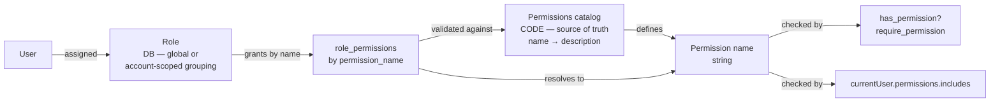
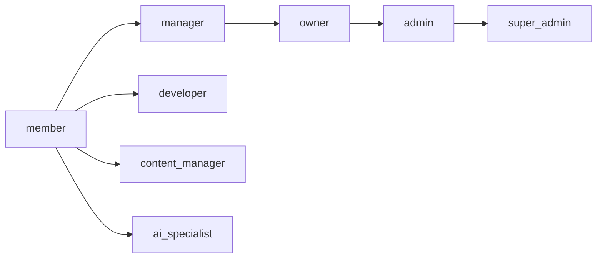

# Permissions

> Status: active

> Permission-based access control. Permissions are code-defined (a static catalog, no DB table); roles live in the DB (global or account-scoped) and group permissions by name. The frontend uses permissions only, never roles.

## Table of Contents

- [What this concept covers](#what-this-concept-covers)
- [Core principle](#core-principle)
- [Naming convention](#naming-convention)
- [Backend authorization](#backend-authorization)
- [Frontend access control](#frontend-access-control)
- [Permission categories](#permission-categories)
- [Roles (global vs account-scoped)](#roles-global-vs-account-scoped)
- [Three-tier permission system](#three-tier-permission-system)
- [Forbidden patterns](#forbidden-patterns)
- [Database schema](#database-schema)
- [Migration history](#migration-history)
- [Agent-Specific Permission Examples](#agent-specific-permission-examples)
- [Related concepts](#related-concepts)
- [Materials previously at](#materials-previously-at)

## What this concept covers

Powernode access control follows one absolute mandate: **use permissions, never roles**. Roles exist only in the backend, only as a mechanism to group permissions for assignment. The frontend never checks a user's role; it checks individual permission strings.

This concept doc explains why, defines the naming convention, shows the correct backend and frontend patterns, walks through the three-tier permission structure (resource / admin / system), and documents the role catalog. The canonical permission registry — the live list of every permission with its description and current role assignments — lives at [`reference/permissions.md`](../reference/permissions.md).

Permissions are **code-defined and static** — the `Permissions` catalog (`server/config/permissions.rb` plus the programmatic DSL in `server/config/permissions/catalog.rb`) is the single source of truth. There is **no `permissions` database table and no `Permission` ActiveRecord model**; a permission is just a `name => description` entry in the catalog. The catalog ships a core-only constant `Permissions::CORE_PERMISSIONS`, and the runtime set is the dynamic union `Permissions.all_permissions` (core ∪ every enabled extension's registered permissions). Because the total depends on which extensions are loaded, the count is **dynamic** — roughly ~687 in full mode. Never hardcode it; to get the current number run:

```bash
cd server && rails runner "puts Permissions.all_permissions.size"
```

or query `platform.search_knowledge` for "permission system".

## Core principle



**Three-layer rule:**

1. **Code (catalog)** defines the permissions — the `Permissions` catalog enumerates every permission name and its description. The database does **not** store permissions.
2. **Database** stores roles and their grants: `roles` rows plus `role_permissions(role_id, permission_name)` rows that reference a catalog permission **by name** (validated against the catalog). It is the assignment layer, not the definition layer.
3. **Backend** authorizes actions by calling `current_user.has_permission?('resource.action')` — never by inspecting roles.
4. **Frontend** authorizes UI by checking `currentUser?.permissions?.includes('resource.action')` — never by inspecting roles.

The frontend has no concept of "admin"; it has the concept of "user with `admin.access` permission". This means access can be granted granularly without inventing new roles, and reading the codebase tells you exactly what each user can do.

## Naming convention

All permissions follow a consistent singular-resource convention:

```
namespace.resource.action
```

Where:

| Component | Notes |
|-----------|-------|
| `namespace` | Optional prefix — `admin`, `system`, `ai`, etc. |
| `resource` | **Singular** resource name (`user`, not `users`) |
| `action` | Operation — `view`, `create`, `edit`, `delete`, `manage`, ... |

### Examples

```
# Resource permissions (singular)
user.view, user.edit_self, user.delete_self
team.view, team.invite, team.remove, team.assign_roles
billing.view, billing.update, billing.cancel
invoice.view, invoice.download
page.create, page.view, page.edit, page.delete, page.publish
webhook.view, webhook.create, webhook.edit, webhook.delete
report.view, report.generate, report.export
audit.view, audit.export

# Admin permissions
admin.user.view, admin.user.create, admin.user.edit, admin.user.delete, admin.user.impersonate
admin.role.view, admin.role.create, admin.role.edit, admin.role.delete, admin.role.assign
admin.account.view, admin.account.create, admin.account.edit, admin.account.delete
admin.worker.view, admin.worker.create, admin.worker.edit, admin.worker.delete
admin.billing.view, admin.billing.override, admin.billing.refund
admin.audit.view, admin.audit.export, admin.audit.delete

# System permissions
system.worker.register, system.worker.heartbeat, system.worker.execute
system.webhook.process, system.webhook.retry
system.cache.read, system.cache.write, system.cache.clear
```

### Special case: settings

Settings remain plural because they represent a collection of configuration options:

```
admin.settings.view, admin.settings.edit, admin.settings.email, admin.settings.security
```

### Common patterns

```
# CRUD pattern
resource.create, resource.read, resource.update, resource.delete

# Management shortcut
resource.manage  (implies full CRUD)

# Admin scoped
admin.resource.read, admin.resource.update, admin.resource.delete
```

## Backend authorization

### `has_permission?` method

```ruby
# CORRECT — Using has_permission? method
if current_user.has_permission?('users.manage')
  # Allow access
end
```

### Controller pattern

```ruby
class Api::V1::UsersController < ApplicationController
  before_action -> { require_permission('users.read') }, only: [:index, :show]
  before_action -> { require_permission('users.manage') }, only: [:create, :update, :destroy]

  def sensitive_action
    unless current_user.has_permission?('admin.access')
      return render_forbidden("Access denied")
    end
    # Proceed with action
  end
end
```

### `require_permission` helper

```ruby
def require_permission(permission)
  render_unauthorized unless current_user.has_permission?(permission)
end
```

## Frontend access control

### Component-level checks

```typescript
// Check single permission
const canManageUsers = currentUser?.permissions?.includes('users.manage');
const canViewBilling = currentUser?.permissions?.includes('billing.read');

// Component access control
const canAccessAdminPanel = currentUser?.permissions?.includes('admin.access');
if (!canAccessAdminPanel) return <AccessDenied />;

// UI element control
<Button disabled={!currentUser?.permissions?.includes('users.create')}>
  Create User
</Button>

// Conditional rendering
{currentUser?.permissions?.includes('analytics.read') && (
  <AnalyticsDashboard />
)}
```

### Permission helper utility

```typescript
export const hasPermissions = (user: User, permissions: string[]): boolean => {
  if (!user?.permissions) return false;
  return permissions.every(permission => user.permissions.includes(permission));
};

// Component permission gate
const ProtectedComponent: React.FC = () => {
  const { user } = useAuth();
  const canManageUsers = hasPermissions(user, ['users.manage']);

  if (!canManageUsers) {
    return <AccessDenied />;
  }

  return <UserManagementPanel />;
};
```

### Navigation filtering

```typescript
// Navigation item definition
{
  id: 'billing',
  name: 'Billing',
  permissions: ['admin.billing.view'],
  href: '/app/business/billing'
}

// Filter items by user's permissions
const filteredNavItems = navigationItems.filter(item => {
  if (!item.permissions?.length) return true;
  return hasPermissions(currentUser, item.permissions);
});
```

### API response format

User objects returned from API include the permissions array. The serializer (`app/controllers/concerns/user_serialization.rb`) reads `User#permission_names` — the catalog-resolved set of grant names (a `system.admin` grant expands to `Permissions.all_permissions.keys`):

```ruby
# In UserSerialization concern
def user_permissions(user)
  user.permission_names   # Array<String> of catalog permission names
end
```

`User#permissions` is an alias that returns the same **array of permission name strings** (not ActiveRecord objects):

```json
{
  "data": {
    "id": "...",
    "email": "user@example.com",
    "permissions": ["users.read", "billing.read", "analytics.read"]
  }
}
```

## Permission categories

Permissions are organized by prefix. The major categories:

Core categories (always present):

| Category | Description |
|----------|-------------|
| `admin.*` | Admin panel access — accounts, AI, audit, DevOps, files, Git, integrations, settings |
| `ai.*` | AI features — agents, workflows, memory, knowledge, conversations, providers, autonomy |
| `system.*` | System-level — admin, workers, jobs, monitoring, CI workers, disk-image publication |
| `devops.*` | DevOps — pipelines, providers, repositories, templates, containers |
| `git.*` | Git — approvals, credentials, pipelines, providers, repositories, runners |
| `integrations.*` | Third-party integrations |
| `files.*` | File management |
| `storage.*` | Storage backends |
| `kb.*` | Knowledge base articles |
| `mcp.*` | MCP protocol operations |
| `page.*` | CMS pages |
| `team.*` | Team management |
| `webhook.*` | Webhook management |
| `api.*` | API key management |
| `audit.*` | Audit logs |
| `report.*` | Reports |
| `analytics.*` | Analytics dashboards / exports |
| `user.*` / `users.*` | User management (account-scoped) |

Extension-prefixed categories (present only when the extension is loaded):

| Category | Description |
|----------|-------------|
| `business.*` | Marketplace, billing, plans, invoices, subscriptions, reviews, and developer marketplace-apps — e.g. `business.marketplace.read`, `business.billing.manage`, `business.plans.manage`, `business.app.*` (private business extension) |
| `supply_chain.*` | Supply chain management — attestations, container-image scanning/signing, SBOMs (supply-chain extension) |
| `system.sdwan.*` | SD-WAN / networking control plane (system extension) |
| `marketing.*` | Marketing campaigns, content, calendars, email lists (marketing extension) |

> **Deferred (not currently defined):** `docker.*`, `swarm.*`, and `kubernetes.*` container-plane permissions are **not** in the catalog today — they are reserved for a planned container-plane epic. Do not treat them as live categories; container orchestration is currently expressed through `devops.containers.*` / `devops.container_templates.*`.

> **Migrated to `business.*`:** the marketplace/billing surface that earlier docs listed under bare `marketplace.*`, `app.*`, `listing.*`, `subscription.*`, `review.*`, `billing.*`, `plans.*`, and `invoice.*` prefixes now lives entirely under the `business.*` namespace in the private business extension. Those bare prefixes are no longer registered by core.

### AI autonomy permissions

| Permission | Description |
|------------|-------------|
| `ai.kill_switch.manage` | Activate and deactivate the AI emergency kill switch |
| `ai.goals.manage` | Create, update, and delete AI agent goals |
| `ai.intervention_policies.manage` | Configure AI intervention policies and notification preferences |
| `ai.proposals.view` | View AI agent proposals |
| `ai.proposals.review` | Approve or reject AI agent proposals |
| `ai.escalations.view` | View AI agent escalations |
| `ai.escalations.resolve` | Acknowledge and resolve AI agent escalations |
| `ai.feedback.submit` | Submit feedback on AI agent performance |
| `ai.feedback.view` | View AI agent feedback history |
| `ai.autonomy.manage` | Manage AI agent autonomous behavior and duty cycles |

**Role assignments:** `ai.kill_switch.manage` is automatically assigned to `owner` and `admin` roles.

For the live, complete list of every permission with current role assignments, see [`reference/permissions.md`](../reference/permissions.md).

## Roles (global vs account-scoped)

Roles are the backend mechanism that groups catalog permissions for assignment to users. The frontend never checks them. Roles live in the database, and there are now **two kinds**, distinguished by the nullable `roles.account_id` column:

| Kind | `account_id` | Defined by | Editable? | Scope |
|------|-------------|-----------|-----------|-------|
| **Global role** | `NULL` | The code catalog (`Permissions::ROLES`), seeded by `Role.sync_from_config!` | **Read-only in the UI** — change them by changing the catalog | Shared across all accounts |
| **Account-scoped (custom) role** | set to an account id | Created at runtime by an account's admins via the roles API | Fully editable / deletable | Isolated to that one account |

Key rules:

- **Global roles** are the standard code-defined set below. They are seeded from the catalog and are read-only through the API — `PATCH`/`DELETE` on a role with `account_id IS NULL` returns `403`. The `super_admin` global role is additionally immutable.
- **Account-scoped roles** are created by `POST /api/v1/roles`, which always stamps the acting user's `account_id`. Two different accounts may each define a custom role with the **same name**; a custom role may **not** shadow a global role's name (enforced by a model validation).
- **Cross-account isolation:** a user may only hold global roles or roles owned by their own account (`UserRole` validation), and the roles controller only ever exposes `global + the current account's` roles (`Role.for_account`).
- **No privilege escalation:** when an account admin grants permissions to a custom role, they may only grant permissions **they themselves hold**, and **never** any `system.*` (SYSTEM-tier) permission. This is implemented by `User#grantable_permission_names` (own `permission_names` minus everything under `system.`) and `User#can_grant_permission?(name)`, and enforced in the roles controller's `apply_permission_names`.

### Global user roles

| Role | Purpose | Typical Permissions |
|------|---------|---------------------|
| `member` | Basic account member with standard access | `analytics.read`, `api.read`, `team.read`, `user.edit_self`, `webhook.read`, read-only AI views, basic file management |
| `manager` | Team manager with content and team management | Member permissions + content publishing, API/key management, team management, full AI/DevOps/Git/integration management |
| `developer` | App developer focused on marketplace publishing | `user.edit_self`, `api.*`, `webhook.*`, `kb.*`, plus `business.app.*` / `business.marketplace.*` when the business extension is loaded |
| `owner` | Full account management authority | All resource-tier permissions (`*RESOURCE_PERMISSIONS.keys`) + selected account-management admin permissions |
| `content_manager` | Knowledge base content management | `kb.read`, `kb.create`, `kb.update`, `kb.delete`, `kb.publish`, `kb.manage`, `kb.moderate` |
| `ai_specialist` | AI power user | Full `ai.*` management surface + templates publishing + supporting Git/DevOps/integration permissions |

> `billing_admin` is **not** a core role. The private business extension may seed its own financial role(s) granting `business.billing.*` / `business.plans.*`; these are absent in core mode.

### Global admin roles

| Role | Purpose |
|------|---------|
| `admin` | Full system administration — all resource permissions + all admin permissions except `admin.maintenance.*` |
| `super_admin` | Ultimate system authority. Holds only the `system.admin` permission, which programmatically grants every permission. Immutable (cannot be edited or deleted) |

#### Universal-access (`system.admin`) programmatic grant

Universal access is granted when any of a user's roles **grants the `system.admin` permission by name** — **not** via a `super_admin?` role check. A role carrying `system.admin` gets all permissions programmatically, without explicit `role_permissions` rows for every permission:

```ruby
# User model — grants are checked by NAME against role_permissions
def has_permission?(permission_name)
  # Any role granting the system.admin permission bypasses all checks
  return true if roles.joins(:role_permissions).exists?(role_permissions: { permission_name: "system.admin" })

  # Otherwise the user has it if any of their roles grants it
  roles.joins(:role_permissions).exists?(role_permissions: { permission_name: permission_name })
end

def permission_names
  # system.admin expands to the entire (dynamic) catalog
  if roles.joins(:role_permissions).exists?(role_permissions: { permission_name: "system.admin" })
    Permissions.all_permissions.keys.sort
  else
    roles.joins(:role_permissions).pluck("role_permissions.permission_name").uniq.sort
  end
end
```

The `super_admin?` method exists (`has_role?('super_admin')`) but is **not** what grants universal access; the `system.admin` permission is.

**Benefits:** Universal access without explicit storage; automatic inclusion of new permissions; simplified permission management.

**Considerations:** Programmatic grants bypass detailed permission-usage logging; tests require special handling.

### Global system roles (automation)

| Role | Purpose |
|------|---------|
| `system_worker` | Full automation with system-level operations — background workers, maintenance automation. Holds all `system.*` permissions (database, jobs, integrations, AI, Git) plus AI execution permissions |
| `task_worker` | Limited task execution — restricted worker processes. Holds basic worker operations: `system.worker.*`, `system.jobs.process`, `system.api.internal` |
| `ci_worker` | External CI runner authorized **only** to register disk-image builds (`system.platforms.publish_disk_image` + worker auth basics). `role_type: "user"` so it's assignable per-account; deliberately minimal so a leaked token can't escalate |

All of the above are **global** roles (catalog-defined, `account_id IS NULL`). `ai_specialist` is also catalog-defined and is listed under the global user roles above.

### Role progression



The global roles above are the code-defined standard set. User roles progress: `member → manager → owner`; specialized roles (`developer`, `content_manager`, `ai_specialist`) provide focused capabilities laterally; administrative escalation runs `owner → admin → super_admin`. Accounts that need anything outside this set create **account-scoped custom roles** via the API (subject to the no-escalation guard above) rather than editing the catalog.

## Three-tier permission system

### Resource permissions

- **Format:** `resource.action` (e.g., `user.edit`, `billing.view`)
- **Scope:** Account-level operations
- **Usage:** Direct user interactions, business operations

### Admin permissions

- **Format:** `admin.resource.action` (e.g., `admin.user.create`, `admin.billing.override`)
- **Scope:** System-wide administrative operations
- **Usage:** Platform management, cross-account operations

### System permissions

- **Format:** `system.resource.action` (e.g., `system.worker.execute`, `system.database.backup`)
- **Scope:** Infrastructure and automation
- **Usage:** Background jobs, system maintenance, service control

## Forbidden patterns

### Frontend — never do this

```typescript
// FORBIDDEN — Role-based access control
const canManage = currentUser?.roles?.includes('account.manager');
const isSystemAdmin = currentUser?.role === 'system.admin';
if (user.roles.includes('billing.manager')) { return <AdminPanel />; }

// FORBIDDEN — Mixed role/permission checks
const hasAccess = user.roles.includes('admin') || user.permissions.includes('read');

// FORBIDDEN — Hardcoded role checks
if (currentUser?.roles?.some(r => r.includes('admin'))) { ... }
```

### Backend — never do this

```ruby
# FORBIDDEN — Role-based authorization
if current_user.roles.any? { |r| r.name == 'admin' }  # WRONG
if current_user.has_role?('admin')                     # WRONG — authorize on permissions, not roles
```

Authorize on permissions, never on roles. The canonical check is `current_user.has_permission?('name')` — it consults the by-name `role_permissions` grants **and** transparently honors the `system.admin` wildcard (a `system.admin` grant returns `true` for every permission). `has_permission?` is what controllers' `require_permission` calls under the hood.

> Note: the old caveat "`current_user.permissions` returns ActiveRecord objects, so never call `.include?`" is **obsolete**. `current_user.permissions` is now an alias for `permission_names` and returns a plain **array of permission name strings** (a `system.admin` grant expands it to the entire catalog), so a string `.include?` check works. Even so, prefer `has_permission?('name')`: it expresses intent, is the path `require_permission` uses, and avoids materializing the full catalog array just to test one name.

## Database schema

Permissions are **code-defined** — there is **no `permissions` table** (and no `Permission` model). The database stores only roles and their by-name grants:

```sql
-- Roles: global (account_id NULL) OR account-scoped (account_id set)
CREATE TABLE roles (
  id UUID PRIMARY KEY DEFAULT uuidv7(),
  account_id UUID,                          -- NULL = global (catalog) role; set = account-scoped custom role
  name VARCHAR(100) NOT NULL,
  display_name VARCHAR(100),
  description TEXT,
  role_type VARCHAR(20) CHECK (role_type IN ('user', 'admin', 'system')),
  is_system BOOLEAN NOT NULL DEFAULT false,
  immutable BOOLEAN NOT NULL DEFAULT false
);
-- Global role names are globally unique; account role names are unique per account.
CREATE UNIQUE INDEX index_roles_on_name_global
  ON roles (name) WHERE account_id IS NULL;
CREATE UNIQUE INDEX index_roles_on_account_id_and_name
  ON roles (account_id, name) WHERE account_id IS NOT NULL;

-- Grants reference a catalog permission BY NAME (string), not a foreign key.
CREATE TABLE role_permissions (
  role_id UUID NOT NULL REFERENCES roles(id),
  permission_name VARCHAR(100) NOT NULL,    -- validated against the Permissions catalog
  granted_at TIMESTAMP NOT NULL DEFAULT CURRENT_TIMESTAMP
);
CREATE UNIQUE INDEX index_role_permissions_on_role_id_and_permission_name
  ON role_permissions (role_id, permission_name);

-- Account delegations grant permissions the same way — by name.
CREATE TABLE delegation_permissions (
  id UUID PRIMARY KEY DEFAULT uuidv7(),
  account_delegation_id UUID NOT NULL,
  permission_name VARCHAR(100) NOT NULL     -- catalog name; must be within the delegation's role
);
CREATE UNIQUE INDEX idx_on_account_delegation_id_permission_name
  ON delegation_permissions (account_delegation_id, permission_name);
```

Both `role_permissions.permission_name` and `delegation_permissions.permission_name` are validated against `Permissions.permission_exists?` — an unknown name is rejected and stale grants (for a name later removed from the catalog) are pruned on the next `Role.sync_from_config!`.

Defense in depth: every protected operation validates permissions at the controller layer (`before_action`), the model layer (business logic), and the service layer (background operations). Frontend checks gate UI; backend checks gate effects.

## Migration history

- **2025-08-22**: Standardized all permissions to use singular resource naming. Previously mixed plural/singular (e.g., `users.manage`); now consistent singular throughout (`user.manage`, `webhook.create`)
- **2026-06-20**: Permissions removed from the database — the code catalog (`Permissions`) is now the single source of truth (no `permissions` table, no `Permission` model). `role_permissions` and `delegation_permissions` were re-keyed from `permission_id` foreign keys to a validated `permission_name` string. Roles gained a nullable `account_id`, splitting them into **global** (catalog-defined, read-only) and **account-scoped** custom roles; account roles are customizable through the API behind a no-privilege-escalation guard (you can only grant permissions you hold, never `system.*`).
- Subsequent additions extend the catalog without breaking the convention

## Agent-Specific Permission Examples

Recap: every protected agent operation goes through `current_user.has_permission?('name')` on the backend and `currentUser?.permissions?.includes('name')` on the frontend. The AI subsystem uses the `ai.*` namespace, with one permission per resource cluster (agents, skills, missions, ralph loops, autonomy, ...). The strings below are the ones actually used in the backend tool registry, controllers, and the `Permissions` catalog (`server/config/permissions.rb`).

### Common agent operations → required permission

| Agent operation | Required permission |
|-----------------|---------------------|
| List or get agents | `ai.agents.read` |
| Create or update an agent | `ai.agents.update` (or `ai.agents.create` for new records) |
| Execute an agent (`platform.execute_agent`, `Ai::Tools::AgentManagementTool`) | `ai.agents.execute` |
| Archive, pause, resume, clone, test, or delete an agent | `ai.agents.archive` / `pause` / `resume` / `clone` / `test` / `delete` |
| Promote / demote autonomy tier (kill switch, intervention policies, duty cycles) | `ai.autonomy.manage` |
| Approve a pending autonomy action | `ai.autonomy.approve` |
| Attach or detach a skill from an agent (`platform.attach_skill_to_agent`) | `ai.skills.read` (the SkillTool's `REQUIRED_PERMISSION`) plus `ai.skills.update` to mutate the skill definition |
| Manage missions (`platform.get_mission_status`, mission lifecycle endpoints) | `ai.missions.manage`; read-only views need `ai.missions.read` |
| Manage Ralph Loops (start, pause, resume, run iteration, update tasks) | `ai.ralph_loops.update` plus the operation-specific permission (`ai.ralph_loops.start`, `ai.ralph_loops.pause`, `ai.ralph_loops.run_iteration`, ...) |
| Manage approval chains | `ai.approval_chains.manage` (assigned to `owner` + `admin` by default) |

For the canonical list of every `ai.*` permission with its current role assignments, see [`reference/permissions.md`](../reference/permissions.md) — these examples are the developer-facing subset.

### Worked example — just-enough perms to manage Ralph Loops

An operator who runs the daily Ralph Loop schedule but should not be able to flip the kill switch or rewrite autonomy policy needs the following narrow grant. Create an **account-scoped custom role** (e.g. `ralph_operator`) — typically via `POST /api/v1/roles`, which applies the no-escalation guard — and grant exactly these catalog permissions **by name**:

```ruby
# frozen_string_literal: true

# Grants are by permission NAME (validated against the catalog) — there is no
# Permission model. role.add_permission is idempotent; it creates a
# role_permissions(role_id, permission_name) row.
%w[
  ai.agents.read
  ai.ralph_loops.read
  ai.ralph_loops.start
  ai.ralph_loops.pause
  ai.ralph_loops.resume
  ai.ralph_loops.run_iteration
  ai.ralph_loops.update_task
].each { |name| role.add_permission(name) }
# Equivalent low-level form:
#   names.each { |n| role.role_permissions.create!(permission_name: n) }
```

This keeps the operator out of `ai.autonomy.manage`, `ai.autonomy.approve`, `ai.kill_switch.manage`, and `ai.approval_chains.manage` — the four permissions that gate full autonomy control.

## Related concepts

- [`reference/permissions.md`](../reference/permissions.md) — canonical live permission registry
- [`concepts/architecture.md`](./architecture.md) — controller `require_permission` pattern
- [`guides/backend.md`](../guides/backend.md) — backend implementation patterns
- [`guides/frontend.md`](../guides/frontend.md) — frontend permission-based UI patterns
- [`guides/security.md`](../guides/security.md) — broader security architecture

## Materials previously at

This concept consolidates content from:

- `docs/platform/PERMISSION_NAMING_CONVENTION.md`
- `docs/platform/PERMISSION_SYSTEM_REFERENCE.md`
- `docs/platform/ROLES_PERMISSIONS_COMPREHENSIVE_ANALYSIS.md`

_Last verified: 2026-06-20_
