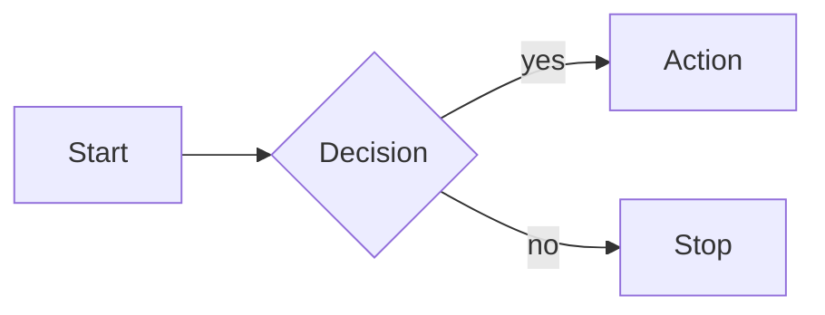

# Documentation Conventions

> Rules of the road for writing, moving, archiving, and auto-generating docs in this repo.

> Status: active

This page captures the conventions that came out of the 2026-05 docs modernization. Following them keeps `docs/` shallow, scannable, and machine-verifiable as the platform grows.

## Table of Contents

- [Layout principles](#layout-principles)
- [No in-tree archive](#no-in-tree-archive)
- [The auto-gen rule](#the-auto-gen-rule)
- [Mermaid diagrams](#mermaid-diagrams)
- [Footer: last verified](#footer-last-verified)
- [Materials previously at](#materials-previously-at)
- [Status banners](#status-banners)
- [Verification harness](#verification-harness)
- [Cross-linking conventions](#cross-linking-conventions)
- [What goes where](#what-goes-where)

## Layout principles

The `docs/` tree is organized by audience and intent (Divio-inspired):

```
docs/
├── README.md            <- one-screen visitor index
├── getting-started/     <- numbered tutorials, fastest path
├── concepts/            <- design rationale and mental models
├── guides/              <- role-themed how-to docs
├── reference/           <- API contracts, schemas, theme tokens, registries
│   └── auto/            <- AUTO-GENERATED; never hand-edit
├── operations/          <- runbooks for production
├── contributing/        <- contributor handbook (you are here)
└── .verify/             <- broken-link + drift detection
```

When in doubt, ask: "who reads this and why?" Visitors get `getting-started/`. New contributors get `contributing/`. Operators get `operations/`. Architects get `concepts/`. Everyone else gets `reference/`.

## No in-tree archive

Point-in-time records (audits, completed plans, phase reports) are **not** kept in the docs tree — git history is the archive. Don't create a `history/` directory under `docs/`. If you need to reference a past state, link to the relevant commit. Docs that live in the tree should describe the platform as it is today; anything that has become a "we did X on this date" record belongs in the commit/PR that did it, not in `docs/`.

## The auto-gen rule

Auto-generated reference material lives under `docs/reference/auto/`. Each file MUST begin with:

```markdown
<!-- AUTO-GENERATED — DO NOT EDIT — see reference/auto/manifest.yml -->
```

The manifest at `docs/reference/auto/manifest.yml` is the machine-readable source of truth: filename → generator command → source code/data → regeneration cadence. When you add a new auto-gen file, add a manifest entry in the same PR.

Generators currently in use:

| Filename | Generator | Source |
|----------|-----------|--------|
| `mcp-tools.md` | `bundle exec rails mcp:generate_tool_catalog` | `Ai::Tools::PlatformApiToolRegistry.all_tools` |
| `skills.md` | `bundle exec rails mcp:sync_docs` | `ai_skills` |
| `knowledge-base.md` | `bundle exec rails mcp:sync_docs` | `ai_shared_knowledges` |
| `knowledge-graph.md` | `bundle exec rails mcp:sync_docs` | `ai_knowledge_graph_nodes` + edges |
| `learnings.md` | `bundle exec rails mcp:sync_docs` | `ai_compound_learnings` |
| `todo.md` | `bundle exec rails mcp:sync_docs` | `ai_shared_knowledges` (tagged "todo") |

`check-auto-gen-headers.sh` fails if any file under `docs/reference/auto/` is missing the header.

## Mermaid diagrams

We use Mermaid for diagrams that benefit from being source-controlled (sequence diagrams, decision trees, state machines). Avoid for layouts that look better as a screenshot.

GitHub renders Mermaid natively. Gitea renders Mermaid in recent versions but the matrix is documented in `docs/.verify/RENDER_PARITY.md` — confirm any exotic diagram type renders on both before relying on it.

Style:

```markdown

```

Keep node labels short. If you need long descriptions, use a separate caption paragraph below the diagram.

## Footer: last verified

Every doc — hand-written or otherwise — MUST end with:

```markdown
_Last verified: YYYY-MM-DD_
```

This signals to a future reader when the page was last reconciled with reality. When you update a doc, bump the date. If you only touched a single section, you can refine to `_Last verified: 2026-05-17 (sections X, Y); 2025-12-03 (rest)_`.

The harness does not currently enforce the footer (it's advisory), but reviewers should flag missing ones in PR review.

## Materials previously at

When a doc absorbs content from one or more prior files, add a "Materials previously at" footer listing the absorbed paths:

```markdown
---

## Materials previously at

- `docs/old-path-a.md`
- `docs/old-path-b.md`

_Last verified: 2026-05-17_
```

This footer stays in place for one release cycle, then gets pruned by a maintainer. Its job is to give grep-based search a bridge from the old path to the new one.

## Status banners

Every doc has a status banner near the top, immediately after the title and one-line purpose:

```markdown
> Status: active
> Status: stub — expand as the platform matures
```

The first is the default. The second is for placeholder docs we intend to grow.

## Verification harness

`docs/.verify/` contains the doc-CI harness. Run it locally before opening a docs PR:

```bash
bash docs/.verify/check-links.sh           # broken-link gate (REQUIRED)
bash docs/.verify/check-auto-gen-headers.sh # auto-gen header enforcement
bash docs/.verify/check-counts.sh          # advisory: catches likely-to-drift numbers
bash docs/.verify/check-code-refs.sh       # opt-in: validates backtick path-shaped strings
bash docs/.verify/check-mcp-actions.sh     # opt-in: validates MCP action references
```

`check-links.sh` runs in pre-push via `scripts/install-git-hooks.sh`. The others are opt-in for now.

## Cross-linking conventions

- Relative links only (`../concepts/architecture.md`), never absolute URLs back into the repo.
- Anchor links use the GitHub-style slug derived from the section heading.
- When linking out to a third-party doc, prefer permalinks (versioned URLs) over latest-style links.
- Reference auto-gen files by their `docs/reference/auto/` path, not by the generator output URL.

## What goes where

| If your content is... | Put it in... |
|------------------------|--------------|
| A 10-minute "first install" path | `getting-started/` |
| Mental model, design rationale, architecture reasoning | `concepts/` |
| Role-themed how-to ("everything a frontend dev needs") | `guides/` |
| API contract, schema dump, registry, theme tokens | `reference/` |
| Hand-written reference | `reference/<topic>.md` |
| Generated reference | `reference/auto/<topic>.md` |
| Production runbook | `operations/` |
| Contributor handbook (this page, conventions, release process) | `contributing/` |

If your content is a one-off discovery memo or "we did X on this date" report, it belongs in the commit/PR that did the work (git history), not in a top-level subtree.

---

_Last verified: 2026-06-03_
