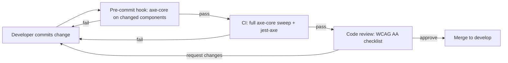

# Accessibility Guide (WCAG AA)

> Status: active

> How to keep the Powernode platform's frontend accessible. These standards are normative — they gate PRs.

## Table of Contents

- [What this guide covers](#what-this-guide-covers)
- [Prerequisites](#prerequisites)
- [Compliance target](#compliance-target)
- [Color contrast](#color-contrast)
- [Focus management](#focus-management)
- [Semantic HTML and ARIA](#semantic-html-and-aria)
- [Forms](#forms)
- [Tables](#tables)
- [Keyboard navigation](#keyboard-navigation)
- [Custom components](#custom-components)
- [Error handling and feedback](#error-handling-and-feedback)
- [Status announcements](#status-announcements)
- [Skip links](#skip-links)
- [Reduced motion and high contrast](#reduced-motion-and-high-contrast)
- [Automated testing](#automated-testing)
- [Manual testing checklist](#manual-testing-checklist)
- [Enforcement](#enforcement)
- [Related guides](#related-guides)
- [Materials previously at](#materials-previously-at)

## What this guide covers

This document establishes the **mandatory** accessibility standards for the Powernode platform. WCAG 2.1 Level AA compliance is non-negotiable for any UI shipped on `master` — pre-commit hooks, CI checks, and code reviews all validate the rules below.

The audience is every frontend engineer. The rules apply uniformly to admin panels, end-user surfaces, content management UI, and AI interaction surfaces.

## Prerequisites

- Read [`docs/guides/frontend.md`](frontend.md) — accessibility builds on the theme + form patterns there
- Install `@axe-core/react`, `jest-axe`, and `@testing-library/jest-dom` in your dev environment
- A screen reader for manual testing (NVDA on Windows, VoiceOver on macOS, Orca on Linux)

## Compliance target



| Standard | Target |
|---|---|
| WCAG 2.1 | Level AA |
| ARIA | 1.2 |
| Keyboard | All interactive elements operable |
| Screen readers | Full content accessible via NVDA / VoiceOver / Orca |
| Color contrast | 4.5:1 body text, 3:1 large text, 3:1 focus indicators |
| Reduced motion | Respect `prefers-reduced-motion` |

## Color contrast

### Requirements

| Surface | Minimum ratio |
|---|---|
| Body text | 4.5:1 |
| Large text (18pt+ or 14pt+ bold) | 3:1 |
| Interactive element focus states | 3:1 |
| Meaningful graphical elements | 3:1 |

### Implementation via theme classes

The theme system is designed to meet these ratios automatically. Use theme classes — never raw Tailwind colors:

```tsx
// CORRECT — theme classes guarantee contrast
const styles = {
  primaryText:     'text-theme-primary',       // 4.5:1+ on theme-surface
  secondaryText:   'text-theme-secondary',     // 4.5:1+ on theme-surface
  inputBase:       'bg-theme-surface text-theme-primary',
  errorText:       'text-theme-danger',
  successText:     'text-theme-success',
  warningText:     'text-theme-warning',
};

// FORBIDDEN — no contrast guarantee
const forbidden = [
  'text-yellow-400 on bg-yellow-100',   // poor contrast
  'text-gray-400 on bg-white',          // below 4.5:1
  'text-blue-300 on bg-blue-100',       // insufficient
];
```

### Form input contrast

```tsx
const AccessibleInput: React.FC<InputProps> = ({ error, ...props }) => (
  <input
    className={cn(
      'w-full px-3 py-2 rounded-md border',
      'bg-theme-surface text-theme-primary',
      'placeholder:text-theme-muted',
      'border-theme-primary focus:border-theme-primary',
      'focus:ring-2 focus:ring-theme-primary focus:ring-offset-0',
      error && 'border-theme-danger focus:border-theme-danger focus:ring-theme-danger',
      'disabled:opacity-50 disabled:bg-theme-background disabled:text-theme-secondary',
    )}
    {...props}
  />
);
```

## Focus management

### Visible focus indicators

Every interactive element MUST display a visible focus indicator of at least 2px with 3:1 contrast against its background:

```tsx
const focusStyles = {
  standard: 'focus:ring-2 focus:ring-theme-primary focus:ring-offset-2 focus:outline-none',
  critical: 'focus:ring-2 focus:ring-theme-primary focus:ring-offset-2 focus:outline-none focus:bg-theme-primary/10',
  input:    'focus:ring-2 focus:ring-theme-primary focus:border-theme-primary focus:ring-offset-0',
  button:   'focus-visible:outline-none focus-visible:ring-2 focus-visible:ring-offset-2 focus-visible:ring-theme-primary',
};
```

Use `focus-visible:` for buttons and clickable elements so the ring appears only on keyboard focus (not mouse focus, which is visually noisy).

### Focus trap for modals

```tsx
const FocusTrap: React.FC<{ children: React.ReactNode; active: boolean }> = ({ children, active }) => {
  const trapRef = useRef<HTMLDivElement>(null);

  useEffect(() => {
    if (!active) return;

    const handleKeyDown = (e: KeyboardEvent) => {
      if (e.key !== 'Tab') return;

      const focusables = trapRef.current?.querySelectorAll<HTMLElement>(
        'button, [href], input, select, textarea, [tabindex]:not([tabindex="-1"])',
      );
      if (!focusables?.length) return;

      const first = focusables[0];
      const last  = focusables[focusables.length - 1];

      if (e.shiftKey && document.activeElement === first) {
        e.preventDefault();
        last.focus();
      } else if (!e.shiftKey && document.activeElement === last) {
        e.preventDefault();
        first.focus();
      }
    };

    document.addEventListener('keydown', handleKeyDown);
    return () => document.removeEventListener('keydown', handleKeyDown);
  }, [active]);

  return <div ref={trapRef}>{children}</div>;
};
```

### Restore focus on close

When a modal closes, focus must return to the element that opened it. The shared `Modal` component handles this — call it via `<Modal onClose={...} returnFocusTo={triggerRef}>`.

## Semantic HTML and ARIA

### Heading hierarchy

Use exactly one `<h1>` per page. Subsections use `<h2>`, sub-subsections `<h3>`, etc. Never skip levels (`h2` → `h4` is a bug).

```tsx
<main>
  <h1>Admin Settings</h1>

  <section aria-labelledby="rate-limit-heading">
    <h2 id="rate-limit-heading">Rate Limiting</h2>

    <div role="group" aria-labelledby="emergency-controls">
      <h3 id="emergency-controls">Emergency Controls</h3>
      {/* ... */}
    </div>
  </section>
</main>
```

Section + `aria-labelledby` is required for any region of related content.

### Landmark roles

Every page must use HTML5 landmarks: `<main>`, `<nav>`, `<aside>`, `<header>`, `<footer>`. Custom landmarks via `role="search"`, `role="status"`, etc.

### ARIA only when needed

Use native HTML elements when possible (`<button>`, `<a href>`, `<input>`). ARIA is for filling gaps the native HTML can't cover — never as a substitute for proper semantic markup.

## Forms

### Label associations (MANDATORY)

Every form input MUST have an associated label, via `htmlFor` matching the input's `id`:

```tsx
<form>
  <label htmlFor="disable-duration" className="block text-sm font-medium text-theme-primary mb-1">
    Disable Duration (minutes)
    <span className="text-theme-danger ml-1" aria-label="required">*</span>
  </label>
  <input
    id="disable-duration"
    type="number" min="1" max="480" required
    aria-describedby="disable-help"
    className="..."
  />
  <p id="disable-help" className="mt-1 text-sm text-theme-secondary">
    Temporarily disable rate limiting for maintenance (1-480 minutes)
  </p>

  <fieldset className="border border-theme-primary rounded-lg p-4">
    <legend className="px-2 text-sm font-medium text-theme-primary">
      Rate Limit Categories
    </legend>
    {/* checkboxes / radios live inside the fieldset */}
  </fieldset>
</form>
```

The shared `useForm` hook (see [frontend guide](frontend.md#forms)) wires `id`, `aria-describedby`, and `aria-invalid` automatically when you spread `form.fieldProps(name)`.

### Required fields

- Add `required` attribute to the input
- Visually mark with `*` AND `aria-label="required"`
- Validate client-side AND server-side; display inline errors

### Error states

```tsx
<input
  id="email"
  type="email"
  aria-invalid={!!errors.email}
  aria-describedby={errors.email ? 'email-error' : undefined}
  className={cn(
    'w-full px-3 py-2 border rounded-md',
    errors.email
      ? 'border-theme-danger focus:ring-theme-danger'
      : 'border-theme-primary focus:ring-theme-primary',
  )}
/>
{errors.email && (
  <p id="email-error" role="alert" className="mt-1 text-sm text-theme-danger">
    {errors.email}
  </p>
)}
```

## Tables

Data tables MUST use `<table>`, `<caption>`, `<thead>` + `<th scope="col">`, and `<tbody>`. Action columns must have `aria-label` on icon-only buttons:

```tsx
<table className="w-full" aria-labelledby="violations-heading">
  <caption id="violations-heading" className="text-lg font-medium mb-4">
    Recent Rate Limiting Violations
  </caption>
  <thead>
    <tr>
      <th scope="col" className="text-left px-4 py-2">Endpoint</th>
      <th scope="col" className="text-left px-4 py-2">Identifier</th>
      <th scope="col" className="text-left px-4 py-2">Count/Limit</th>
      <th scope="col" className="text-left px-4 py-2">Actions</th>
    </tr>
  </thead>
  <tbody>
    {violations.map(v => (
      <tr key={v.id}>
        <td className="px-4 py-2">{v.endpoint}</td>
        <td className="px-4 py-2">{v.identifier}</td>
        <td className="px-4 py-2">{v.count}/{v.limit}</td>
        <td className="px-4 py-2">
          <button onClick={() => clearLimits(v.identifier)} aria-label={`Clear limits for ${v.identifier}`}>
            <Trash2 className="w-4 h-4" aria-hidden="true" />
          </button>
        </td>
      </tr>
    ))}
  </tbody>
</table>
```

Decorative icons inside buttons need `aria-hidden="true"`. The button's accessible name comes from `aria-label`.

## Keyboard navigation

### Required keyboard support

Every interactive element MUST be operable via keyboard:

| Key | Expected behavior |
|---|---|
| `Tab` / `Shift+Tab` | Move focus forward / backward |
| `Enter` / `Space` | Activate buttons, submit forms |
| `Escape` | Close modals, dismiss overlays, cancel pending actions |
| `Arrow keys` | Navigate within custom components (menus, dropdowns, tab lists) |
| `Home` / `End` | Jump to first / last in lists |

### Tab order

Tab order follows visual layout. Avoid manual `tabIndex` values except `tabIndex={-1}` (programmatically focusable but not in tab order) and `tabIndex={0}` (in tab order). Never use positive `tabIndex` values — they break the natural order and confuse screen reader users.

### Skip link

Provide a "Skip to main content" link as the first focusable element on every page:

```tsx
<a
  href="#main-content"
  className="sr-only focus:not-sr-only focus:absolute focus:top-4 focus:left-4 focus:z-50
             bg-theme-primary text-theme-inverse px-4 py-2 rounded"
>
  Skip to main content
</a>
<main id="main-content">{/* page */}</main>
```

The `sr-only` class hides the link until it receives focus.

## Custom components

When you build a custom dropdown, tab list, autocomplete, or combobox, you MUST implement keyboard support and ARIA roles per the WAI-ARIA Authoring Practices.

### Combobox/dropdown example

```tsx
const AccessibleDropdown: React.FC<DropdownProps> = ({ options, onSelect }) => {
  const [isOpen, setIsOpen]         = useState(false);
  const [activeIndex, setActiveIndex] = useState(-1);

  const handleKeyDown = (e: KeyboardEvent<HTMLDivElement>) => {
    switch (e.key) {
      case 'Enter':
      case ' ':
        e.preventDefault();
        if (activeIndex >= 0) {
          onSelect(options[activeIndex]);
          setIsOpen(false);
        } else {
          setIsOpen(prev => !prev);
        }
        break;
      case 'ArrowDown':
        e.preventDefault();
        setActiveIndex(i => (i + 1) % options.length);
        break;
      case 'ArrowUp':
        e.preventDefault();
        setActiveIndex(i => (i <= 0 ? options.length - 1 : i - 1));
        break;
      case 'Escape':
        setIsOpen(false);
        setActiveIndex(-1);
        break;
      case 'Home':
        e.preventDefault();
        setActiveIndex(0);
        break;
      case 'End':
        e.preventDefault();
        setActiveIndex(options.length - 1);
        break;
    }
  };

  return (
    <div className="relative" onKeyDown={handleKeyDown}
         role="combobox" aria-expanded={isOpen} aria-haspopup="listbox">
      {/* ... */}
    </div>
  );
};
```

## Error handling and feedback

Error summaries at the top of a form trigger an `aria-live="assertive"` announcement; inline field errors use `role="alert"`:

```tsx
{errors.length > 0 && (
  <div role="alert" aria-live="assertive"
       className="mb-6 p-4 bg-theme-danger-background border border-theme-danger rounded-lg">
    <h3 className="text-lg font-medium text-theme-danger mb-2">
      Please correct the following errors:
    </h3>
    <ul className="list-disc list-inside space-y-1">
      {errors.map((err, i) => (
        <li key={i} className="text-theme-danger">{err}</li>
      ))}
    </ul>
  </div>
)}
```

## Status announcements

Use `aria-live` regions to announce status changes that aren't focus-related (background save success, async operation complete, etc.):

```tsx
<div role="status" aria-live="polite" aria-atomic="true" className="sr-only">
  {statusMessage && `Status: ${statusMessage}`}
</div>
```

- `aria-live="polite"` — waits until current speech is done; use for non-critical updates
- `aria-live="assertive"` — interrupts current speech; use only for errors and time-critical alerts

## Skip links

In addition to "Skip to main content," provide:

- Skip past navigation
- Skip to footer / utility links
- Skip past complex repeating regions (e.g., long table headers)

## Reduced motion and high contrast

### Respect `prefers-reduced-motion`

```tsx
const reducedMotion = useMediaQuery('(prefers-reduced-motion: reduce)');
const transitionClasses = reducedMotion ? '' : 'transition-all duration-200';
```

Disable non-essential animations (page transitions, parallax, auto-play) when the user prefers reduced motion. Loading spinners are essential — keep them, but cap to 1Hz pulse.

### Respect `prefers-contrast`

The theme provider exposes a high-contrast variant. The user's OS-level preference flows into the theme automatically; you don't need to override.

## Automated testing

### Component tests with jest-axe

```typescript
import { render } from '@testing-library/react';
import { axe, toHaveNoViolations } from 'jest-axe';
expect.extend(toHaveNoViolations);

describe('SettingsForm', () => {
  it('has no a11y violations', async () => {
    const { container } = render(<SettingsForm />);
    expect(await axe(container)).toHaveNoViolations();
  });

  it('inputs have labels', () => {
    const { getByLabelText } = render(<SettingsForm />);
    expect(getByLabelText(/disable duration/i)).toBeInTheDocument();
  });

  it('errors announce to screen readers', () => {
    const { getByRole } = render(<SettingsForm initialErrors={['Required']} />);
    expect(getByRole('alert')).toHaveAttribute('aria-live', 'assertive');
  });
});
```

### Pre-commit script

A pre-commit script runs axe-core on changed components and fails the commit on violations.

### Continuous monitoring

```bash
# Generate accessibility scorecard
npm run a11y:scorecard

# Track over time
npm run a11y:metrics

# Validate theme contrast compliance
npm run theme:a11y-check
```

## Manual testing checklist

Before merging significant UI changes, walk through:

### Keyboard

- [ ] Every interactive element reachable via Tab
- [ ] Logical tab order matches visual layout
- [ ] Escape closes modals / dismisses overlays
- [ ] Arrow keys navigate custom components
- [ ] Enter/Space activates buttons and controls
- [ ] Focus indicators visible on every element

### Screen reader

- [ ] Headings form a logical outline
- [ ] Form inputs have labels and descriptions
- [ ] Error messages announced
- [ ] Status changes announced via `aria-live`
- [ ] Tables have captions and column headers
- [ ] Interactive elements have descriptive names

### Contrast

- [ ] Text meets 4.5:1
- [ ] Large text meets 3:1
- [ ] Focus indicators meet 3:1
- [ ] Error states remain readable
- [ ] Theme switching preserves all ratios

## Enforcement

Accessibility is enforced at three layers:

| Layer | Mechanism |
|---|---|
| Pre-commit | axe-core runs on changed components; commits fail on violations |
| CI | Full axe-core sweep on every PR; PRs blocked on regressions |
| Code review | Manual review of new patterns against this guide |

User testing (real assistive-tech users walking through new flows) runs ad-hoc per major release.

## Related guides

- [Frontend](frontend.md) — patterns this accessibility guide builds on
- [Testing](testing.md) — broader testing strategy
- [`docs/reference/theme-system.md`](../reference/theme-system.md) — theme tokens engineered for contrast

## Materials previously at

This guide consolidates content from these legacy paths (preserved in git history for one release cycle):

- `docs/platform/ACCESSIBILITY_COMPLIANCE_STANDARDS.md`

_Last verified: 2026-06-03_
