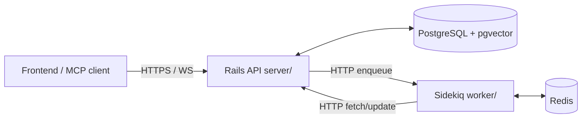
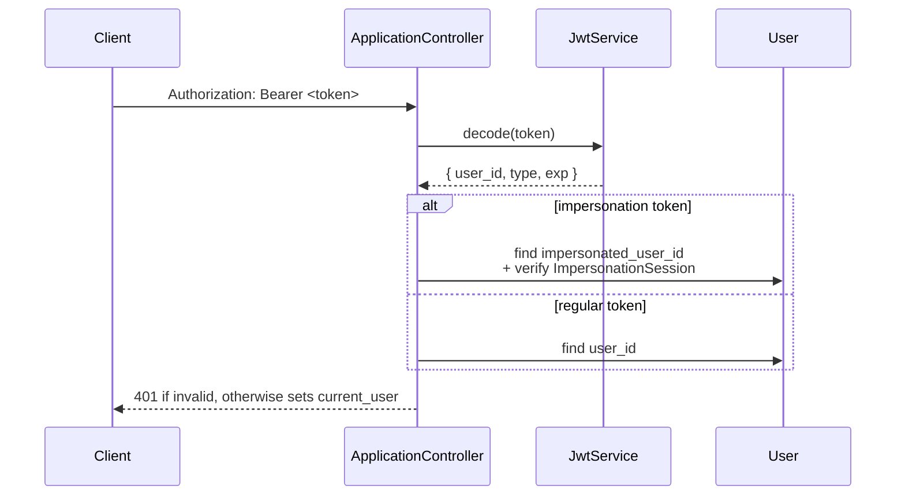
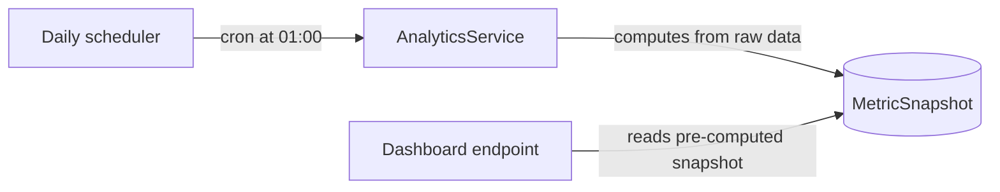

# Backend Development Guide

> How to build Rails APIs, ActiveRecord models, background jobs, and analytics for the Powernode platform.

> Status: active

## Table of Contents

- [What this guide covers](#what-this-guide-covers)
- [Prerequisites](#prerequisites)
- [Architecture at a glance](#architecture-at-a-glance)
- [Conventions](#conventions)
- [Controllers and API responses](#controllers-and-api-responses)
- [Authentication and permissions](#authentication-and-permissions)
- [Models, migrations, and data design](#models-migrations-and-data-design)
- [Services and the worker boundary](#services-and-the-worker-boundary)
- [Background jobs (worker)](#background-jobs-worker)
- [Realtime via ActionCable](#realtime-via-actioncable)
- [Analytics and reporting](#analytics-and-reporting)
- [Webhooks (inbound)](#webhooks-inbound)
- [Billing pointer (extensions/private/business)](#billing-pointer)
- [Related guides](#related-guides)
- [Materials previously at](#materials-previously-at)

## What this guide covers

The Powernode platform's backend is a Rails 8 API (`./server`) paired with a standalone Sidekiq worker (`./worker`). The two communicate over HTTP only — the worker has no ActiveRecord models. This guide is for **backend engineers** building API endpoints, ActiveRecord models, migrations, background jobs, and analytics inside the core platform.

Read this guide if you are adding a model, exposing a new endpoint under `Api::V1`, scheduling a job, or building a reporting service. If you are wiring an AI agent, working in an extension, or doing front-end work, see the related guides at the bottom.

This is a **patterns and conventions** reference — not an architecture tour. For "why the platform looks this way," see [`docs/concepts/architecture.md`](../concepts/architecture.md). For tool counts and live model/controller/service inventories, see [`docs/reference/auto/`](../reference/auto/).

## Prerequisites

- Ruby 3.2.8, Rails 8.1, PostgreSQL with pgvector
- Familiarity with the platform's UUIDv7 + namespaced models pattern
- A running dev environment per [`docs/getting-started/01-quickstart.md`](../getting-started/01-quickstart.md)
- Read the root [`CLAUDE.md`](../../CLAUDE.md) "Backend Patterns" table at least once

## Architecture at a glance



Key invariants the rest of this guide assumes:

- The **server** (`server/`) owns ActiveRecord, controllers, and ActionCable. It does **not** run Sidekiq.
- The **worker** (`worker/`) is a separate Sidekiq process. It has no Rails models and talks to the server exclusively through `BackendApiClient`.
- All routes live under `Api::V1` (and sub-namespaces) and inherit from `ApplicationController`.
- All primary keys are UUIDv7. There is no integer-PK fallback.

## Conventions

| Layer | Rule |
|---|---|
| Ruby files | `# frozen_string_literal: true` pragma required |
| Logging | `Rails.logger` only — never `puts`/`print` |
| Controllers | `Api::V1` namespace, inherit `ApplicationController`, kept under 300 lines |
| Responses | Mandatory `render_success` / `render_error` helpers (see [API responses](#controllers-and-api-responses)) |
| Migrations | `t.references` auto-creates an index — never add `add_index` for FK columns |
| Namespaces | Always `::` in `class_name:` (`Ai::AgentTeam`, not `AiAgentTeam`) |
| FK naming | `Ai::` → `ai_*_id`, `Devops::` → `devops_*_id`, `BaaS::` → `baas_*_id` |
| JSON columns | Lambda defaults: `attribute :config, :json, default: -> { {} }` |
| Eager loading | Always `.includes()` when iterating associations — never bare `.all` + `.map` |
| Webhook receivers | Return 200/202 on processing errors — never 500 |
| Access control | `current_user.has_permission?('name')` — never `permissions.include?()` (returns objects) |
| Worker jobs | Inherit `BaseJob`, override `execute`, API-only — never ActiveRecord |
| Seeds | After modifying seeds, run `cd server && rails db:seed` and verify |

Run the syntax check after Ruby edits:

```bash
cd server && bundle exec ruby -c app/path/to/file.rb
```

## Controllers and API responses

### Standard CRUD controller

```ruby
# frozen_string_literal: true

class Api::V1::WidgetsController < ApplicationController
  include WidgetSerialization

  before_action :set_widget, only: %i[show update destroy]
  before_action -> { require_permission('widgets.view') },   only: %i[index show]
  before_action -> { require_permission('widgets.create') }, only: :create
  before_action -> { require_permission('widgets.update') }, only: :update
  before_action -> { require_permission('widgets.delete') }, only: :destroy

  def index
    widgets = current_account.widgets.includes(:owner).page(pagination_params[:page])
    render_paginated(widgets, serializer: WidgetSerializer)
  end

  def show
    render_success(widget_data(@widget))
  end

  def create
    widget = current_account.widgets.build(widget_params)
    if widget.save
      render_created(widget_data(widget))
    else
      render_validation_error(widget.errors)
    end
  end

  def update
    if @widget.update(widget_params)
      render_success(widget_data(@widget))
    else
      render_validation_error(@widget.errors)
    end
  end

  def destroy
    @widget.destroy!
    render_no_content
  end

  private

  def set_widget
    @widget = current_account.widgets.find(params[:id])
  end

  def widget_params
    params.require(:widget).permit(:name, :status)
  end
end
```

### ApiResponse concern

`ApplicationController` includes `ApiResponse`. Use the helpers — never hand-render JSON:

```ruby
# Success
render_success(data, meta: { ... }, status: :ok)
render_created(data)
render_no_content
render_paginated(collection, serializer: MySerializer)
render_bulk_response(successful: [...], failed: [...])

# Errors
render_error(message, status: :bad_request, code: 'CODE', details: { ... })
render_validation_error(model.errors)
render_not_found("Widget")
render_unauthorized
render_forbidden
render_internal_error(exception: e)
```

Every response is `{ success: bool, data?: ..., meta?: ..., error?: ..., details?: ... }`. Frontend code relies on this contract — see [`docs/concepts/architecture.md`](../concepts/architecture.md) for the rationale.

### Pagination

```ruby
def pagination_params
  {
    page:     [params[:page]&.to_i || 1, 1].max,
    per_page: [[params[:per_page]&.to_i || 20, 1].max, 100].min
  }
end
```

`render_paginated` adds a `meta.pagination` block to the response.

### Controller size limit

Controllers must stay under 300 lines. When you approach the limit, extract:

- **Query logic** → service classes under `app/services/`
- **Serialization** → controller concerns (e.g., `WidgetSerialization`)
- **Complex orchestration** → command service objects returning `ServiceResult`

## Authentication and permissions

### JWT request flow



`Authentication` concern (`app/controllers/concerns/authentication.rb`) handles all token decoding. The login endpoint is `POST /api/v1/auth/login` and returns `{ user, account, access_token, expires_at }` in the body, with the refresh token delivered as an httpOnly cookie (not in the JSON body). The access-token field name is `access_token`, not `token`.

### Permission-based access control (HARD RULE)

**Backend** uses `current_user.has_permission?('name')` — never `permissions.include?()` (returns Permission objects, not strings).

**Frontend** uses permissions only — never roles. See [`docs/concepts/permissions.md`](../concepts/permissions.md) for the full registry.

```ruby
# Controller
before_action -> { require_permission('billing.manage') }, only: :create

# Model lookup (cached per request)
class User < ApplicationRecord
  def has_permission?(name)
    all_permissions.include?(name)
  end

  def all_permissions
    @all_permissions ||= roles.flat_map(&:permissions).map(&:name).uniq
  end
end
```

### Account scoping

Every account-scoped query MUST start from `current_account`:

```ruby
current_account.widgets.find(params[:id])     # CORRECT
Widget.find(params[:id])                      # WRONG — leaks across accounts
```

Shared example `'scopes to current account'` (in `spec/support/shared_examples/`) verifies this for every resource.

## Models, migrations, and data design

### Required model structure

```ruby
# frozen_string_literal: true

class Widget < ApplicationRecord
  # 1. Authentication (has_secure_password, etc.)
  # 2. Concerns / includes
  include AuditLoggable

  # 3. Associations
  belongs_to :account
  belongs_to :owner, class_name: 'User', foreign_key: 'user_id'
  has_many :widget_logs, dependent: :destroy

  # 4. Validations
  validates :name, presence: true, length: { maximum: 200 }
  validates :status, inclusion: { in: %w[active archived] }

  # 5. Scopes
  scope :active,   -> { where(status: 'active') }
  scope :recent,   -> { order(created_at: :desc) }

  # 6. Callbacks
  before_validation :normalize_name

  # 7. Instance methods
  def archive!
    update!(status: 'archived', archived_at: Time.current)
  end

  private

  # 8. Private methods
  def normalize_name
    self.name = name&.strip
  end
end
```

### UUIDv7 primary keys

All tables use `gen_random_uuid()` defaults. Use `UUID7.generate` (uuid7 gem, already in `server/Gemfile`) for persistent fallbacks in Ruby code — never `SecureRandom.uuid_v7` (Ruby 3.3+ only; repo pins 3.2.8) or `SecureRandom.uuid` (v4).

See [`docs/concepts/data-model.md`](../concepts/data-model.md) for the UUID strategy rationale.

### Migration template

```ruby
# frozen_string_literal: true

class CreateWidgets < ActiveRecord::Migration[8.1]
  def change
    create_table :widgets, id: :uuid do |t|
      t.references :account, null: false, foreign_key: true, type: :uuid
      t.references :user,    null: false, foreign_key: true, type: :uuid
      t.string  :name,   null: false
      t.string  :status, null: false, default: 'active'
      t.jsonb   :config, null: false, default: {}
      t.timestamps
    end

    # Custom indexes only — t.references already indexed account_id + user_id
    add_index :widgets, %i[account_id status]
    add_index :widgets, :created_at
  end
end
```

**Never** add `add_index :widgets, :account_id` after a `t.references :account` — `t.references` already created it. Customize the auto-index via the declaration itself:

```ruby
t.references :account, null: false, foreign_key: true, type: :uuid,
             index: { unique: true, name: 'idx_widgets_account_unique' }
```

### Namespaces

Always use `::` in `class_name:` — `Ai::AgentTeam`, not `AiAgentTeam`. Always pair `class_name:` with `foreign_key:`:

```ruby
belongs_to :provider, class_name: 'Ai::Provider', foreign_key: 'ai_provider_id'
```

FK prefix conventions:

| Namespace | FK prefix | Example |
|---|---|---|
| `Ai::` | `ai_` | `ai_agent_id`, `ai_provider_id` |
| `Devops::` | `devops_` | `devops_pipeline_id` |
| `BaaS::` | `baas_` | `baas_customer_id` |
| Others | (explicit FK or omit if unambiguous) | `user_id`, `account_id` |

### JSON column defaults

Always use lambda defaults — never literal hashes (shared mutable state bug):

```ruby
attribute :config, :json, default: -> { {} }       # CORRECT
attribute :config, :json, default: {}              # WRONG
```

### Query optimization

```ruby
# Always use .includes() for associations you'll iterate
accounts = Account.includes(:users, :subscription).active

# Joins for filtering
admins = User.joins(roles: :permissions).where(permissions: { name: 'users.manage' })

# Composite indexes for common access patterns
add_index :subscriptions, %i[account_id status]
add_index :payments,      %i[subscription_id created_at]
```

## Services and the worker boundary

### Service object pattern

> **Note:** `BaseService` and `ServiceResult` below are a *recommended* convention teams may introduce — they are not shipped shared infrastructure today (no top-level `BaseService`/`ServiceResult` exists in `server/app/services`; only namespaced base classes like `RateLimiting::BaseService`). Treat this as a teaching example, not an importable API.

```ruby
# frozen_string_literal: true

class BaseService
  include ActiveModel::Model
  include ActiveModel::Attributes
  include ActiveModel::Validations

  def self.call(*args, **kwargs)
    new(*args, **kwargs).call
  end

  def call
    raise NotImplementedError, "#{self.class} must implement #call"
  end

  protected

  def success(data = {}, message = nil)
    ServiceResult.new(success: true, data: data, message: message)
  end

  def failure(error, details = {})
    ServiceResult.new(success: false, error: error, details: details)
  end
end

class ServiceResult
  attr_reader :data, :error, :message, :details

  def initialize(success:, data: {}, error: nil, message: nil, details: {})
    @success, @data, @error, @message, @details = success, data, error, message, details
  end

  def success?; @success; end
  def failure?; !@success; end
end
```

Use service objects when:

- The operation spans 2+ models
- Controller logic exceeds ~30 lines
- The same logic is invoked from a controller and a job
- You need a clear transactional boundary

### Critical: server vs. worker

The server is a Rails API. It does NOT run Sidekiq.

```ruby
# ❌ NEVER do this in server/
class MyJob < ApplicationJob   # No ApplicationJob in server/
  def perform; end
end

# ❌ NEVER add sidekiq to server/Gemfile
```

Server-side, "enqueueing" means calling the worker over HTTP:

```ruby
# server/app/services/worker_job_service.rb
class WorkerJobService
  # The real class exposes a generic enqueue_job plus dozens of specific
  # enqueue_* helpers (enqueue_ai_agent_execution, enqueue_notification_email,
  # enqueue_devops_pipeline_execution, …). There is NO generic `enqueue`.
  def self.enqueue_job(job_class, options = {})
    # POSTs to /api/v1/jobs with { job_class:, args: } on the worker HTTP API
  end
end

# Prefer the specific helper for known job types:
WorkerJobService.enqueue_notification_email('subscription_renewed', subscription_id: id)
# Or the generic form for ad-hoc dispatch:
WorkerJobService.enqueue_job('Billing::SubscriptionRenewalJob', args: { subscription_id: id })
```

## Background jobs (worker)

### BaseJob (worker/app/jobs/base_job.rb)

```ruby
require 'sidekiq'

class BaseJob
  include Sidekiq::Job

  sidekiq_options retry: 3, dead: true, queue: 'default'

  sidekiq_retry_in do |count, exception|
    case exception
    when BackendApiClient::ApiError then [30, 60, 180][count - 1] || 300
    else (count**4) + 15 + (rand(30) * (count + 1))
    end
  end

  def perform(*args)
    @started_at = Time.current
    logger.info "Starting #{self.class.name} with args: #{args.inspect}"
    execute(*args)
    logger.info "Completed #{self.class.name} in #{(Time.current - @started_at).round(2)}s"
  rescue StandardError => e
    logger.error "Failed #{self.class.name}: #{e.message}"
    raise
  end

  protected

  def execute(*args)
    raise NotImplementedError, "Subclasses must implement #execute"
  end

  def api_client
    @api_client ||= BackendApiClient.new
  end

  def logger
    PowernodeWorker.application.logger
  end

  def with_api_retry(max_attempts: 3)
    attempts = 0
    begin
      attempts += 1
      yield
    rescue BackendApiClient::ApiError => e
      raise unless attempts < max_attempts && retryable_error?(e)
      sleep(2**attempts)
      retry
    end
  end

  private

  def retryable_error?(e)
    [408, 429, 500, 502, 503, 504].include?(e.status)
  end
end
```

### Job rules

1. **NO ActiveRecord** — never `require` models in `worker/`
2. **API-only data access** — all reads/writes via `api_client`
3. **Inherit BaseJob** — never `ApplicationJob`
4. **Override `execute`, not `perform`** — `perform` provides lifecycle wrapping
5. **Workers run independently** — survive Rails restarts and vice versa

### Example job

```ruby
class Billing::SubscriptionRenewalJob < BaseJob
  sidekiq_options queue: 'high', retry: 5

  def execute(args)
    subscription_id = args['subscription_id']

    with_api_retry(max_attempts: 3) do
      result = api_client.post("/subscriptions/#{subscription_id}/renew", {})
      raise StandardError, result['error'] unless result['success']

      api_client.post('/notifications', {
        type: 'subscription_renewed',
        subscription_id: subscription_id,
        amount: result.dig('data', 'amount')
      })
    end
  end
end
```

### Queue priorities

```yaml
# worker/config/sidekiq.yml
:queues:
  - [critical, 10]
  - [high, 5]
  - [default, 3]
  - [low, 1]
  - [batch, 1]
```

Use `critical` only for security responses and kill-switch handlers. Renewals and payments go on `high`, analytics on `default`, cleanup and reporting on `low`.

### Scheduled jobs (cron)

```ruby
# worker/config/initializers/sidekiq.rb (excerpt)
Sidekiq.configure_server do |config|
  config.on(:startup) do
    Sidekiq::Cron::Job.load_from_hash({
      'rotate_secrets' => { 'cron' => '0 2 * * *', 'class' => 'SecretsRotationJob', 'queue' => 'low' },
      'health_check'   => { 'cron' => '*/5 * * * *', 'class' => 'SystemHealthCheckJob', 'queue' => 'low' }
    })
  end
end
```

For scheduled jobs that are part of the platform's autonomy loop (decay, consolidation, etc.), see [`docs/concepts/agents-and-autonomy.md`](../concepts/agents-and-autonomy.md). The full live cron schedule is in `worker/config/sidekiq.yml`.

### Job lifecycle observability

Every job logs start/complete/failure with class name and duration via `BaseJob#perform`, and records attempt/success/failure counters into Redis through the `record_execution_*` helpers.

> **Status: not yet implemented** — Today `BaseJob#perform` only does start/complete/failure logging plus the `record_execution_*` Redis counters. The metrics middleware and dead-set notification below are planned: `JobMetricsMiddleware`, the `death_handlers` block, and `JobFailureNotificationService` do not exist in `worker/` or `server/` yet.

For metrics, mount `JobMetricsMiddleware` in the server-middleware chain. Failed jobs route to a dead set; the `death_handlers` block notifies via `JobFailureNotificationService`.

## Realtime via ActionCable

ActionCable lives in the server. Channels stream per-account or per-resource. The connection identifies users via JWT in the WebSocket query params (`?token=...`).

```ruby
# app/channels/application_cable/connection.rb
module ApplicationCable
  class Connection < ActionCable::Connection::Base
    identified_by :current_user

    def connect
      self.current_user = find_verified_user
    end

    private

    def find_verified_user
      token = request.params[:token]
      decoded = token && Security::JwtService.decode(token)
      User.find(decoded[:user_id]) if decoded
    rescue ActiveRecord::RecordNotFound
      reject_unauthorized_connection
    end
  end
end

# app/channels/widget_channel.rb
class WidgetChannel < ApplicationCable::Channel
  def subscribed
    stream_from "widget_#{current_user.account_id}"
  end
end
```

Server-side broadcast:

```ruby
ActionCable.server.broadcast("widget_#{account.id}", { event: 'created', widget: data })
```

See [`docs/concepts/chat-and-realtime.md`](../concepts/chat-and-realtime.md) for the full channel inventory and frontend integration patterns.

## Analytics and reporting

The platform tracks operational metrics (agent execution, knowledge quality, cost attribution) and optionally business metrics when the business extension is loaded. Backend engineers build the underlying data services; visualization lives in the frontend.

### Metric snapshot pattern



Illustrative example — `Analytics::AgentExecutionMetricsService` / `Analytics::ExecutionMetricsSnapshot` are not real classes in `server/app`; they show the recommended snapshot pattern (and the `BaseService` convention from above), not shipped code.

```ruby
# app/services/analytics/agent_execution_metrics_service.rb (illustrative)
class Analytics::AgentExecutionMetricsService < BaseService
  attribute :start_date, :date
  attribute :end_date,   :date

  def call
    return failure('Invalid period') unless valid_period?

    metrics = {
      period: { start: start_date, end: end_date },
      total_executions: Ai::AgentExecution.in_period(start_date, end_date).count,
      success_rate:     calc_success_rate,
      avg_duration_ms:  calc_avg_duration,
      cost_breakdown:   calc_cost_breakdown
    }

    Analytics::ExecutionMetricsSnapshot.create!(
      metrics_data: metrics, snapshot_date: end_date
    )

    success(metrics)
  end

  private

  def calc_success_rate
    executions = Ai::AgentExecution.in_period(start_date, end_date)
    total = executions.count
    return 0 if total.zero?

    successful = executions.where(status: 'completed').count
    (successful.to_f / total * 100).round(2)
  end

  # ...
end
```

### Reporting principles

- **Compute then store, don't recompute on read.** Dashboard endpoints query `*_snapshot` tables.
- **Cohort by account.** Every analytics service must filter by account scope.
- **Cache aggressively.** Use `Rails.cache.fetch(key, expires_in: 5.minutes)` around expensive joins. Invalidate on writes.
- **Use background jobs for heavy aggregation.** Schedule via the worker; never block a request on a multi-minute report build.
- **Anonymize in exports.** Strip PII from CSV/JSON exports unless the requesting user has `analytics.export_pii`.

### A/B experiment tracking

When the business extension exposes A/B framework features, the backend records `Experiment`, `ExperimentVariant`, and `ExperimentAssignment` rows. The variant assignment is deterministic by `user_id` + `experiment_id` (hashed to keep splits stable). Results are computed offline via scheduled aggregation jobs and surfaced through a dashboard endpoint.

For business-intelligence and revenue analytics (MRR, ARR, churn), the implementation lives in the `extensions/private/business` private submodule; this guide covers only the operational analytics that ship with core.

## Webhooks (inbound)

Inbound webhook receivers (provider callbacks, GitOps push events, etc.) are first-class controllers but follow stricter rules than user-facing API endpoints:

- **Return 200 or 202 on processing errors.** Never 500 — providers will retry, causing storms.
- **Verify signatures synchronously.** Reject 401 on signature mismatch immediately.
- **Enqueue heavy work.** The controller's job is to accept, verify, and hand off:

```ruby
class Api::V1::Webhooks::GiteaController < ApplicationController
  skip_before_action :authenticate_request
  before_action :verify_gitea_signature

  def push
    WorkerJobService.enqueue_job('Git::WebhookProcessingJob', args: { event: 'push', payload: request.raw_post })
    head :accepted
  rescue StandardError => e
    Rails.logger.error("Webhook processing failed: #{e.message}")
    head :ok # Don't trigger provider retry storm
  end

  private

  def verify_gitea_signature
    expected = OpenSSL::HMAC.hexdigest('sha256', ENV['GITEA_WEBHOOK_SECRET'], request.raw_post)
    received = request.headers['X-Gitea-Signature']
    head :unauthorized unless ActiveSupport::SecurityUtils.secure_compare(expected, received)
  end
end
```

## Billing pointer

The platform's billing engine and payment provider integrations (Stripe, PayPal, dunning, invoicing) live in the **`extensions/private/business` private submodule**. Core-mode contributors should not need to touch them. If the business extension is absent, the platform runs as single-user self-hosted with all features unlocked and no billing surface.

If you do have access to the business submodule, see its `docs/` for `BillingEngineDeveloperSpecialist` and `PaymentIntegrationSpecialist` material. Backend extension hooks live in `app/services/shared/feature_gate_service.rb` (the `extension_loaded?('business')` / `capability_present?(:governance)` predicates and friends).

See [`docs/guides/extensions.md`](extensions.md) for the extension pattern itself.

## Related guides

- [Frontend](frontend.md) — React + TypeScript patterns
- [Testing](testing.md) — RSpec, request specs, worker job specs
- [E2E Testing](e2e-testing.md) — Playwright
- [DevOps](devops.md) — deployment, configuration, CI/CD
- [Security](security.md) — JWT, secrets, supply chain
- [Notifications](notifications.md) — system + user notification delivery
- [Extensions](extensions.md) — extension scaffolding and `FeatureGateService`
- [`docs/concepts/architecture.md`](../concepts/architecture.md) — design rationale
- [`docs/concepts/data-model.md`](../concepts/data-model.md) — UUID strategy and schema overview
- [`docs/concepts/permissions.md`](../concepts/permissions.md) — permission registry
- [`docs/reference/auto/`](../reference/auto/) — live model, controller, MCP tool inventories

## Materials previously at

This guide consolidates content from these legacy paths (preserved in git history for one release cycle):

- `docs/backend/RAILS_ARCHITECT_SPECIALIST.md`
- `docs/backend/API_DEVELOPER_SPECIALIST.md`
- `docs/backend/DATA_MODELER_SPECIALIST.md`
- `docs/backend/BACKGROUND_JOB_ENGINEER_SPECIALIST.md`
- `docs/services/ANALYTICS_ENGINEER.md`

The two specialist guides for billing and payments (`BILLING_ENGINE_DEVELOPER_SPECIALIST.md`, `PAYMENT_INTEGRATION_SPECIALIST.md`) and the BaaS API reference (`BAAS_API_REFERENCE.md`) moved into [`docs/guides/extensions.md`](extensions.md) because they describe extension-resident functionality. `BACKEND_SERVICE_ARCHITECTURE.md` was consolidated into [`docs/concepts/architecture.md`](../concepts/architecture.md).

_Last verified: 2026-06-04_
