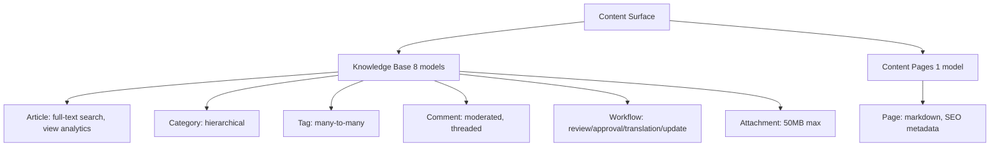
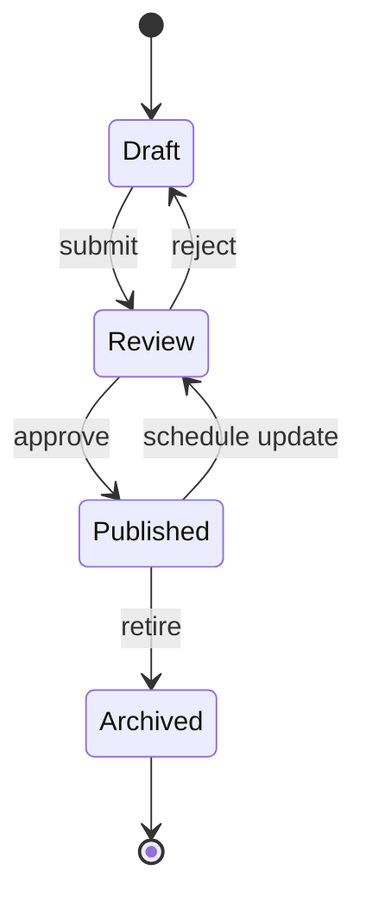
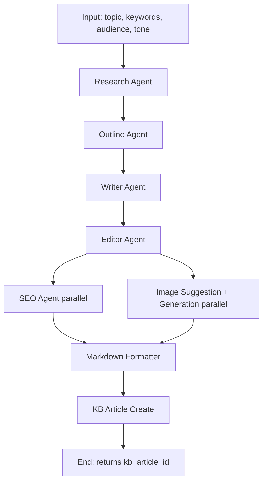

# Content Management Guide

> How to author, publish, and integrate knowledge base articles and content pages — including AI-driven content workflows.

> Status: active

## Table of Contents

- [What this guide covers](#what-this-guide-covers)
- [Prerequisites](#prerequisites)
- [Two content systems](#two-content-systems)
- [Knowledge Base](#knowledge-base)
- [Content Pages](#content-pages)
- [API surface](#api-surface)
- [Frontend feature layout](#frontend-feature-layout)
- [Content workflow lifecycle](#content-workflow-lifecycle)
- [Workflow node integration](#workflow-node-integration)
- [Blog generation pipeline (KB integration)](#blog-generation-pipeline-kb-integration)
- [Search](#search)
- [Access control](#access-control)
- [RAG and AI knowledge separation](#rag-and-ai-knowledge-separation)
- [Related guides](#related-guides)
- [Materials previously at](#materials-previously-at)

## What this guide covers

The platform ships with two distinct content systems: a full-featured **Knowledge Base** (articles, categories, tags, full-text search, editorial workflows, moderated comments, view analytics) and lighter-weight **Content Pages** (standalone markdown pages with SEO metadata). This guide is for content engineers, AI-workflow authors integrating content publishing into mission pipelines, and operators managing the editorial lifecycle.

## Prerequisites

- Familiarity with backend ([`docs/guides/backend.md`](backend.md)) and frontend ([`docs/guides/frontend.md`](frontend.md)) conventions
- Permission to author or publish: `kb.*` (knowledge base), `admin.access` (pages)
- For workflow integration: read [`docs/concepts/agents-and-autonomy.md`](../concepts/agents-and-autonomy.md)

## Two content systems



| Use Knowledge Base when... | Use Content Pages when... |
|---|---|
| Content is article-shaped and benefits from categories/tags | Content is a standalone page (about, terms, marketing) |
| You need editorial workflows (review, approval, translation) | A draft/publish toggle is sufficient |
| You want view analytics and reader engagement metrics | SEO metadata is the primary requirement |
| You need moderated comments | Comments don't apply |
| Content participates in RAG | Content is purely human-facing |

## Knowledge Base

### Models

`KnowledgeBase::Article` is the core model. Surrounding it:

| Model | Purpose |
|---|---|
| `Article` | Title, content, excerpt, slug, status, SEO metadata, view tracking |
| `Category` | Hierarchical categories with parent_id and circular-reference prevention |
| `Tag` | Slug-based tags with usage counters and color codes |
| `ArticleTag` | Join with auto-increment counter |
| `Attachment` | Files (max 50MB, stored under `public/uploads/kb/`) |
| `Comment` | Nested comments with moderation queue |
| `ArticleView` | View tracking per user/session/IP/UA |
| `Workflow` | Editorial workflows: review, approval, translation, update |

### Article statuses

`draft → review → published → archived`

- `draft` — author working
- `review` — submitted for peer review via workflow
- `published` — visible (auto-sets `published_at`)
- `archived` — retired from active use

### Article features

- PostgreSQL full-text search via `search_vector` with `ts_rank` ordering
- Slug-based URLs with uniqueness enforcement
- Auto-generated excerpts from content
- SEO metadata: `meta_title`, `meta_description`, `meta_keywords`
- View tracking with per-user deduplication (authors excluded)
- Reading time estimation (200 WPM)
- Related article discovery (tag-based + category-based)
- Permission-based access control (`kb.manage`, `kb.update`, `kb.publish`, `kb.moderate`)

### Comments

`KnowledgeBase::Comment` statuses: `pending | approved | rejected | spam`. Threading via `parent_id`. Auto-approval for users with `kb.moderate` permission; moderation queue otherwise.

### Workflows

`KnowledgeBase::Workflow` types: `review | approval | translation | update`. Lifecycle: `pending → in_progress → completed | cancelled`. Tracks due date with overdue detection, duration in-progress, cancellation reason, and assignee.

## Content Pages

`::Page` is a top-level model (NOT under the `KnowledgeBase` namespace). It provides simple standalone pages outside the KB article structure.

| Feature | Detail |
|---|---|
| Status | `draft` / `published` |
| Rendering | Markdown-to-HTML via `PageService` |
| Identity | `slug` (unique, indexed) |
| SEO | `meta_title`, `meta_description`, `meta_keywords` |
| Visibility | Published pages are public (no auth required) |

### Schema constraints

- `author_id` is NOT NULL — always assign an author
- `slug` is NOT NULL + unique — uniqueness enforced at DB level
- No `tags` column — stash tags in `metadata` JSONB instead

## API surface

### Public KB API

```
GET    /api/v1/kb/articles            # list published (with search, filters)
GET    /api/v1/kb/articles/:id        # show (records view)
GET    /api/v1/kb/categories          # list
GET    /api/v1/kb/categories/tree     # tree structure
GET    /api/v1/kb/tags                # popular
GET    /api/v1/kb/comments            # approved comments
POST   /api/v1/kb/comments            # create (enters moderation)
```

### Admin KB API

```
POST   /api/v1/kb/articles            # create
PUT    /api/v1/kb/articles/:id        # update
DELETE /api/v1/kb/articles/:id        # delete
```

### Public pages API

```
GET    /api/v1/pages                  # list published (no auth)
GET    /api/v1/pages/:slug            # show by slug (no auth)
```

### Admin pages API

Requires `admin.access`:

```
GET    /api/v1/admin/pages
POST   /api/v1/admin/pages
PUT    /api/v1/admin/pages/:id
DELETE /api/v1/admin/pages/:id
POST   /api/v1/admin/pages/:id/publish
POST   /api/v1/admin/pages/:id/unpublish
POST   /api/v1/admin/pages/:id/duplicate
```

### MCP tools

| Tool | Purpose |
|---|---|
| `platform.list_kb_articles` | List articles with pagination and filters |
| `platform.get_kb_article` | Get article content and metadata |
| `platform.create_kb_article` | Create article |
| `platform.update_kb_article` | Update article |
| `platform.list_pages` | List content pages |
| `platform.get_page` | Get page |
| `platform.create_page` | Create page |
| `platform.update_page` | Update page |

See [`docs/reference/auto/mcp-tools.md`](../reference/auto/mcp-tools.md) for parameter contracts.

## Frontend feature layout

```
frontend/src/features/content/
├── files/                  # File management
├── knowledge-base/
│   ├── components/         # Article list, detail, editor, comment thread
│   └── services/           # KB API service
├── pages/
│   ├── components/         # Page list, detail, editor
│   └── services/           # Pages API service
└── index.ts                # Feature barrel export
```

Follow the patterns in [`docs/guides/frontend.md`](frontend.md) — `PageContainer` for routes, `useForm` for editors, React Query for data fetching, theme classes only.

## Content workflow lifecycle



1. Author creates a **Draft**
2. Author submits to **Review** — a `Workflow` record is created and assigned
3. Reviewer approves (→ **Published**, auto-sets `published_at`) or rejects (→ back to **Draft** with comments)
4. Editors schedule updates by creating an `update` workflow (article stays published; new draft branch happens via revision)
5. Eventually content is **Archived** (still queryable for history, hidden from public views)

Workflows are surfaced in the admin UI under Content → Workflows. The Sidekiq cron sweeps overdue workflows daily and notifies assignees.

## Workflow node integration

AI workflows can read, create, update, search, and publish content as part of mission pipelines. Nine workflow node types ship with the platform:

### Knowledge Base nodes

| Node type | Purpose | Visual theme |
|---|---|---|
| `kb_article_create` | Create article with full metadata | Green / Plus icon |
| `kb_article_read` | Retrieve by ID or slug | Blue / Eye icon |
| `kb_article_update` | Selective field update via checkbox toggles | Orange / Edit icon |
| `kb_article_search` | Full-text search with filters and sorting | Purple / Search icon |
| `kb_article_publish` | Publish + optional public/featured | Emerald / Rocket icon |

### Page nodes

| Node type | Purpose | Visual theme |
|---|---|---|
| `page_create` | Create page with SEO metadata, auto-slug | Teal / Plus icon |
| `page_read` | Retrieve by ID or slug | Cyan / Eye icon |
| `page_update` | Selective field update | Amber / Edit icon |
| `page_publish` | Status → published | Indigo / Check icon |

### Common features

- Template variable support via `{{variable}}` syntax
- Connection orientation control (vertical/horizontal)
- Optional output variable naming
- Validation with explicit error messages

### Update node pattern (progressive disclosure)

Update nodes use checkboxes to enable/disable specific field updates — fields render only when their checkbox is checked. This prevents accidental overwrites of unchanged fields:

```
☑ Update title       [Title input]
☐ Update content
☑ Update status      [Status dropdown]
☐ Update tags
```

### Identifier flexibility

Read/Update/Publish nodes accept either `id` (UUID) or `slug` (human-readable). The executor resolves whichever is provided.

### Database vs. model validation

When extending the workflow node types, remember PostgreSQL CHECK constraints and ActiveRecord validations are separate layers — both must be updated. The original content-management nodes shipped with a CHECK constraint update but a missing `AiWorkflowNode` validation update, which caused 422 responses on save. The fix added all new node types to:

```ruby
validates :node_type, presence: true, inclusion: {
  in: %w[
    start end trigger
    ai_agent prompt_template data_processor transform
    condition loop delay merge split
    database file validator
    email notification
    api_call webhook scheduler
    human_approval sub_workflow
    kb_article_create kb_article_read kb_article_update kb_article_search kb_article_publish
    page_create page_read page_update page_publish
  ],
  message: 'must be a valid node type'
}
```

## Blog generation pipeline (KB integration)

The platform ships a reference blog generation workflow demonstrating end-to-end content automation: research → outline → draft → edit → SEO optimize → image generate → markdown format → save to KB.



### KB node configuration

```ruby
{
  'title'        => '{{markdown_formatter.seo_data.optimized_meta.title}}',
  'content'      => '{{markdown_formatter.markdown}}',
  'excerpt'      => '{{markdown_formatter.seo_data.optimized_meta.description}}',
  'category_id'  => 'blog-posts',
  'status'       => 'published',
  'tags'         => '{{markdown_formatter.seo_data.optimized_meta.keywords}}',
  'is_public'    => true,
  'is_featured'  => false,
  'slug'         => '{{markdown_formatter.seo_data.optimized_meta.url_slug}}',
  'author_id'    => '{{workflow.creator_id}}',
  'publish_date' => '{{workflow.current_timestamp}}',
  'output_variable' => 'kb_article_id',
  'orientation'  => 'vertical',
  'metadata' => {
    'source'           => 'ai_mission',
    'mission_id'       => '{{mission.id}}',
    'word_count'       => '{{editor_output.word_count}}',
    'quality_score'    => '{{editor_output.quality_score}}',
    'seo_score'        => '{{seo_output.seo_score}}',
    'has_images'       => true,
    'image_count'      => '{{image_data.total_images_recommended}}',
    'generation_model' => '{{mission.ai_provider.model}}',
    'created_at'       => '{{workflow.current_timestamp}}'
  }
}
```

### Template variable best practices

Deep nested object access works — reference by full path:

```ruby
# CORRECT
'{{markdown_formatter.seo_data.optimized_meta.title}}'

# WRONG — skips levels
'{{seo_data.title}}'
```

Arrays are serialized automatically when referenced as a whole — array index access is not supported:

```ruby
# CORRECT — KB executor handles array
'{{markdown_formatter.seo_data.optimized_meta.keywords}}'

# WRONG — array index in template
'{{keywords[0]}}'
```

Reference outputs by node ID, not display name:

```ruby
# CORRECT
'{{kb_article_1.kb_article_id}}'

# WRONG
'{{Save to Knowledge Base.article_id}}'
```

### End-node output mapping

```ruby
output_mapping: {
  markdown:      '{{markdown_formatter.markdown}}',
  metadata:      '{{markdown_formatter.metadata}}',
  seo_data:      '{{markdown_formatter.seo_data}}',
  image_data:    '{{markdown_formatter.image_data}}',
  blog_content:  '{{markdown_formatter.blog_content}}',
  kb_article_id: '{{kb_article_1.kb_article_id}}'
}
```

### Use cases

- **Content teams** — full automation from topic to published article with embedded SEO and images
- **Knowledge management** — every AI-generated article auto-organizes into the searchable repository
- **Marketing** — published articles are immediately ready for campaign integration via the API
- **Analytics** — every article carries a unique ID for performance attribution back to the mission and model that produced it

## Search

KB articles use PostgreSQL full-text search via `search_vector` (tsvector) with `plainto_tsquery` parsing and `ts_rank` relevance scoring. SQL injection protection via `connection.quote`.

```ruby
# Backend
KnowledgeBase::Article.search_by_text('deployment guide')

# MCP
platform.list_kb_articles(query: 'deployment guide')
```

## Access control

### Article visibility

| User | Can view | Can edit |
|---|---|---|
| Public (unauthenticated) | Published + `is_public` only | No |
| Author | All own articles | Own articles |
| `kb.manage` permission | All articles | All articles |
| `kb.update` permission | Published + own | All articles |

### Permission matrix

| Permission | Actions |
|---|---|
| `kb.view` | List and view published |
| `kb.create` | Create new articles |
| `kb.update` | Edit existing articles |
| `kb.manage` | Full CRUD + workflow management |
| `kb.publish` | Publish (status transition) |
| `kb.moderate` | Auto-approve comments, moderate queue |

## RAG and AI knowledge separation

KB articles are **user-facing content**. The AI subsystem maintains a separate **agent-facing knowledge** store for operational reference material:

| System | Purpose | API surface |
|---|---|---|
| KB articles | User-facing documentation, blog posts, manuals | `platform.list_kb_articles`, `platform.get_kb_article` |
| AI knowledge | Agent operational reference, learnings, procedures | `platform.search_knowledge`, `platform.create_knowledge` |

KB articles can be **ingested into the AI RAG knowledge base** to be retrievable by agents:

```ruby
# Add a published article to the AI RAG store
platform.add_document(knowledge_base_id: kb_id, document_url: article_url)
platform.process_document(document_id: doc_id)  # chunk + embed

# Then agents query
platform.query_knowledge_base(knowledge_base_id: kb_id, query: 'how do I deploy')
```

For agent-facing operational knowledge (not user-facing content), use `platform.create_knowledge` directly — it bypasses the article authoring flow.

## Related guides

- [Backend](backend.md) — model and controller patterns
- [Frontend](frontend.md) — feature layout and form patterns
- [Notifications](notifications.md) — workflow assignment notifications
- [`docs/concepts/agents-and-autonomy.md`](../concepts/agents-and-autonomy.md) — workflow execution model
- [`docs/concepts/knowledge-and-memory.md`](../concepts/knowledge-and-memory.md) — AI knowledge vs. content knowledge
- [`docs/reference/auto/mcp-tools.md`](../reference/auto/mcp-tools.md) — content management MCP tools

## Materials previously at

This guide consolidates content from these legacy paths (preserved in git history for one release cycle):

- `docs/platform/CONTENT_MANAGEMENT_GUIDE.md`
- `docs/platform/CONTENT_MANAGEMENT_NODES_IMPLEMENTATION.md`
- `docs/platform/BLOG_KB_INTEGRATION.md`

_Last verified: 2026-06-03_
