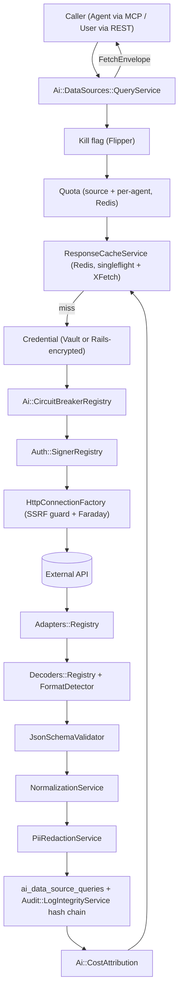

# Data Sources Guide

> How to onboard, extend, secure, query, and discover external data sources — the governed external-fetch pipeline (Phase 1), semantic discovery and effectiveness scoring (Phase 2a), per-endpoint quality, schema-drift, and contract observability (Phase 2b), pull-based change monitoring and stale-serving cache policies (Phase 3), plus the generic source framework — free-form `source_type` + `category`, protocol-selected adapters (GraphQL / RSS / Atom), and outbound pagination (Phase 4) — for the Powernode AI fleet.

> Status: active

## Table of Contents

- [What this guide covers](#what-this-guide-covers)
- [Prerequisites](#prerequisites)
- [Architecture at a glance](#architecture-at-a-glance)
- [Core models](#core-models)
- [Onboard a new REST/CSV/XML source (no code)](#onboard-a-new-restcsvxml-source-no-code)
- [Onboarding a GraphQL or RSS/Atom source (Phase 4)](#onboarding-a-graphql-or-rssatom-source-phase-4)
- [Configuring outbound pagination (Phase 4)](#configuring-outbound-pagination-phase-4)
- [Configure dynamic credential brokering (Phase 4b)](#configure-dynamic-credential-brokering-phase-4b)
- [Writing a custom adapter, decoder, or signer](#writing-a-custom-adapter-decoder-or-signer)
- [Security](#security)
- [Govern a data source (access, masking, residency, mTLS) (Phase 4b-2b)](#govern-a-data-source-access-masking-residency-mtls-phase-4b-2b)
- [Shape & preview data (transforms, dry-run, cache tags) (Phase 4b-3a)](#shape--preview-data-transforms-dry-run-cache-tags-phase-4b-3a)
- [Agent usage via MCP](#agent-usage-via-mcp)
- [How agents discover and evaluate sources over time (Phase 2a)](#how-agents-discover-and-evaluate-sources-over-time-phase-2a)
- [Enabling quality & drift per endpoint (Phase 2b)](#enabling-quality--drift-per-endpoint-phase-2b)
- [Monitoring a source for changes (Phase 3)](#monitoring-a-source-for-changes-phase-3)
- [Enabling stale-serving cache policies per endpoint (Phase 3)](#enabling-stale-serving-cache-policies-per-endpoint-phase-3)
- [Configure incremental sync on an endpoint (Phase 5)](#configure-incremental-sync-on-an-endpoint-phase-5)
- [Make a source crawl-polite (Phase 5)](#make-a-source-crawl-polite-phase-5)
- [The fetch pipeline in detail](#the-fetch-pipeline-in-detail)
- [Related guides](#related-guides)

## What this guide covers

The Powernode platform lets the AI fleet pull from external HTTP/REST APIs through a single **governed fetch pipeline**: `Ai::DataSources::QueryService`. Every fetch is rate-limited, SSRF-guarded, circuit-broken, cached, decoded into canonical records, schema-validated, normalized, redacted, audited (into a hash chain), and cost-attributed — without per-source code for the common case.

This guide is for:

- **Operators** onboarding a new source by configuration alone (sections [Onboard a new source](#onboard-a-new-restcsvxml-source-no-code) and [Security](#security)).
- **Backend engineers** extending the pipeline with a bespoke adapter, decoder, or auth signer ([Writing a custom adapter, decoder, or signer](#writing-a-custom-adapter-decoder-or-signer)).
- **Agent authors** discovering and querying sources over MCP ([Agent usage via MCP](#agent-usage-via-mcp)).

This is the **patterns and conventions** reference. For the surrounding Rails conventions see [`docs/guides/backend.md`](backend.md); for the platform-wide security posture see [`docs/guides/security.md`](security.md).

## Prerequisites

- Familiarity with backend conventions ([`docs/guides/backend.md`](backend.md)) — UUIDv7, namespaced models, `render_success`/`render_error`.
- For credential-in-Vault setups: a deployed Vault instance per [`docs/operations/production-deployment.md`](../operations/production-deployment.md).
- For agent usage: the MCP-first workflow in the root [`CLAUDE.md`](../../CLAUDE.md) and [`docs/concepts/mcp-and-tools.md`](../concepts/mcp-and-tools.md).
- Permissions: `ai.data_sources.read` to view, `ai.data_sources.query` to fetch, and `ai.data_sources.{create,update,delete}` (or the `ai.data_sources.manage` super-grant) to mutate. See [`docs/concepts/permissions.md`](../concepts/permissions.md).

## Architecture at a glance



Key invariants this guide assumes:

- **`QueryService` never raises.** Every failure path maps to a `FetchEnvelope` with `success: false` and a redacted `error`.
- **The common case needs zero code.** `rest` and `custom` protocols, the five built-in auth schemes, and the JSON/NDJSON/XML/CSV decoders cover most APIs through configuration alone.
- **Egress is guarded.** Every outbound URL (and every redirect hop) is resolved and pinned against a blocklist of private/loopback/link-local CIDRs.
- **Nothing sensitive persists verbatim.** URLs, params, error messages, and response snippets all pass through `Ai::Security::PiiRedactionService` before they touch the database.

## Core models

| Model | Table | Role |
|---|---|---|
| `Ai::DataSource` | `ai_data_sources` | The source: free-form `source_type` + `category`, `protocol`, `auth_scheme`, `auth_config`, `api_base_url`, `rate_limits`, `configuration`, quota counters (Redis) |
| `Ai::DataSourceEndpoint` | `ai_data_source_endpoints` | A callable endpoint: `http_method`, `path_template`, `query_template`, `body_template`, `response_format`, `response_schema`, `response_mapping`, `cache_ttl_seconds`, `pagination` |
| `Ai::DataSourceCredential` | `ai_data_source_credentials` | Auth material: Rails-encrypted `encrypted_api_key`/`encrypted_api_secret`, plus `vault_path` + `migrated_to_vault_at` for the Vault path |
| `Ai::DataSourceQuery` | `ai_data_source_queries` | The query/audit log — one (redacted) row per fetch, linked into the audit hash chain |

Associations: `DataSource has_many :endpoints, :queries, :credentials`. An endpoint resolves its account through its parent source (`delegate :account, to: :data_source`).

See [`docs/concepts/data-model.md`](../concepts/data-model.md) for where these sit in the wider `Ai::` namespace, and [`docs/reference/database-schema.md`](../reference/database-schema.md) for the full column list.

## Onboard a new REST/CSV/XML source (no code)

Most sources need **no Ruby at all** — they are pure configuration: one `DataSource` row, one or more `DataSourceEndpoint` rows, and (if authenticated) one `DataSourceCredential` row. The generic `RestAdapter`, the format detector, and the decoder registry do the rest.

### Step 1 — Create the source

`source_type` is **free-form** (Phase 4): any lowercase token matching `/\A[a-z0-9_-]+\z/` (max 50 chars) is accepted — there is **no** enum inclusion check, so a brand-new source kind needs no code change. The old fixed list survives only as UI hints: `Ai::DataSource::SUGGESTED_SOURCE_TYPES` (`SOURCE_TYPES` is a backward-compat alias of it):

```
noaa_ncei  noaa_gfs  noaa_observations  open_meteo  fred
yahoo_finance  espn  newsapi  custom
```

Those are *autocomplete presets*, not a constraint — `source_type: "weather_underground"` is just as valid. The optional **`category`** column (string, ≤100 chars, nullable) is the coarse grouping used by the `by_category` scope and the list filter (e.g. `weather`, `finance`, `sports`, `news`); the migration backfilled it from the legacy `source_type` tokens (`noaa_*`/`open_meteo` → `weather`, `fred`/`yahoo_finance` → `finance`, `espn` → `sports`, `newsapi` → `news`; `custom` and any later token stay NULL). `slug` must be lowercase alphanumeric with hyphens/underscores and is unique per account (auto-generated from `name` when omitted).

```bash
# POST /api/v1/ai/data_sources  (requires ai.data_sources.create)
curl -s -X POST http://localhost:3000/api/v1/ai/data_sources \
  -H "Authorization: Bearer $TOKEN" -H "Content-Type: application/json" \
  -d '{
    "data_source": {
      "name": "Open-Meteo Forecast",
      "slug": "open-meteo",
      "source_type": "open_meteo",
      "api_base_url": "https://api.open-meteo.com",
      "requires_auth": false,
      "is_active": true,
      "priority_order": 100,
      "rate_limits": {
        "requests_per_minute": 60,
        "requests_per_day": 10000,
        "per_agent": { "requests_per_minute": 10 }
      },
      "configuration": {
        "open_timeout_seconds": 5,
        "read_timeout_seconds": 20,
        "max_redirects": 5,
        "max_response_bytes": 5242880
      }
    }
  }'
```

Notes on the fields that drive behavior:

- **`api_base_url`** is validated against the SSRF egress policy at fetch time — a private/loopback/metadata host is rejected. Validate it ahead of time with `data_source_validate_config` (MCP) or the `validate_config` action.
- **`rate_limits`** — `requests_per_minute` / `requests_per_hour` / `requests_per_day` apply to the whole source; an optional nested `per_agent` block applies the same keys per requesting agent so one noisy agent cannot exhaust the source budget. Quota is enforced via Redis atomic counters.
- **`configuration`** knobs read by `HttpConnectionFactory`: `open_timeout_seconds` (default 5), `read_timeout_seconds` (default 20), `max_redirects` (default 5), and `max_response_bytes` (default and hard ceiling 10 MiB — endpoints may **lower** but never raise it).
- **`protocol`** (default `rest`) selects the adapter via `Adapters::Registry.for`. `rest`/`custom` (and any unrecognized/blank token) resolve to the generic `RestAdapter`; `graphql` → `GraphqlAdapter`; `rss`/`atom` → `RssAdapter`. See [Onboarding a GraphQL or RSS/Atom source](#onboarding-a-graphql-or-rssatom-source-phase-4) below for the non-REST protocols.
- **`category`** is the optional grouping described above — set it (`"weather"`, `"finance"`, …) so the source shows up under `?category=` filtering; leave it nil for ungrouped/custom sources.
- **`auth_scheme`** defaults to `none`. Set it (and `auth_config`) when the source needs auth — see [Authentication](#step-3--add-a-credential-when-authenticated) below.

### Step 2 — Define endpoints

Each endpoint is a template that the `RestAdapter` interpolates with caller params. Three template surfaces use single-brace `{name}` placeholders:

- `path_template` (String) — e.g. `/v1/forecast`
- `query_template` (Hash) — e.g. `{"latitude": "{lat}", "longitude": "{lon}", "hourly": "temperature_2m"}`
- `body_template` (Hash) — only sent for `POST`/`PUT`/`PATCH`

```bash
# POST /api/v1/ai/data_sources/:data_source_id/endpoints  (requires ai.data_sources.update)
curl -s -X POST http://localhost:3000/api/v1/ai/data_sources/open-meteo/endpoints \
  -H "Authorization: Bearer $TOKEN" -H "Content-Type: application/json" \
  -d '{
    "endpoint": {
      "name": "Hourly Forecast",
      "slug": "hourly-forecast",
      "http_method": "GET",
      "path_template": "/v1/forecast",
      "query_template": {
        "latitude": "{lat}",
        "longitude": "{lon}",
        "hourly": "temperature_2m"
      },
      "response_format": "json",
      "expected_content_type": "application/json",
      "cache_ttl_seconds": 300,
      "response_mapping": { "records_path": "hourly" },
      "response_schema": {}
    }
  }'
```

Interpolation rules (from `RestAdapter`):

- A value that is **exactly** one placeholder (`"{lat}"`) is replaced with the **raw, typed** param (Integer/Array/Boolean preserved) so structured bodies keep their JSON types.
- An **embedded** placeholder (`/v1/stations/{id}/obs`) is stringified and spliced in. Path placeholders are RFC 3986 path-escaped so a caller param cannot break out of its segment.
- An **unknown** placeholder (no matching param) is left intact — misconfiguration surfaces visibly instead of silently producing a malformed request.

Endpoint columns that shape the result:

| Column | Effect |
|---|---|
| `response_format` | One of `Ai::DataSourceEndpoint::RESPONSE_FORMATS`: `json xml csv ndjson rss atom html text binary`. Used as the **primary** decoder hint. May be left nil — the [format detector](#step-2-handle-a-new-response-format-a-decoder) sniffs the body. |
| `expected_content_type` | Operator's expected `Content-Type`; cross-checked against the bytes to flag a `content_type_mismatch` anomaly. |
| `cache_ttl_seconds` | Cache lifetime for this endpoint's responses (default 5 min when 0/nil). |
| `response_mapping` | Decoder hints — see the [decoder cheat-sheet](#response_mapping-cheat-sheet) below. Also drives `NormalizationService`. |
| `response_schema` | JSON Schema validated against the **decoded records array**; sets `schema_valid` in provenance. Empty `{}` means "no schema → unknown". |
| `monitorable` | Marks the endpoint for change-detection polling. |

> **`response_format` enum caveat:** the column only accepts the nine tokens above. A source whose `configuration.response_format` is something like `grib2` or `geojson` (binary/GeoJSON) is not decodable into canonical records by the built-in decoders — leave `response_format` nil/`binary` and treat such endpoints as opaque, or write a [custom decoder](#step-2-handle-a-new-response-format-a-decoder).

#### `response_mapping` cheat-sheet

The decoders read hints from `endpoint.response_mapping`:

| Decoder | Keys it honors |
|---|---|
| JSON (`Decoders::Json`) | `records_path` / `root` / `data_path` — dotted path (`"data.items"`) or JSON pointer (`"/data/items"`) to the records array. No path → top-level array is the records, a top-level object is one record. |
| NDJSON (`Decoders::Ndjson`) | `charset` (one record per line; malformed lines skipped). |
| XML/RSS/Atom/HTML (`Decoders::Xml`) | `record_xpath` (explicit XPath) or `record_node` (element name, namespace-agnostic). Auto-detects `<item>`/`<entry>` for feeds; otherwise the most-repeated sibling. |
| CSV/TSV (`Decoders::Csv`) | `delimiter` (`","`, `"\t"`, …), `headers` (`true`/`false`/Array of names), `quote_char`, `charset`. Delimiter and header presence are sniffed when not pinned. |

CSV example — the decoder turns `"city,temp\nNYC,72"` into `[{"city"=>"NYC","temp"=>"72"}]`.

### Step 3 — Add a credential (when authenticated)

Set `requires_auth: true` on the source, pick an `auth_scheme`, and supply scheme-specific knobs in `auth_config`. The five built-in schemes (`Ai::DataSources::Auth::SignerRegistry`):

| `auth_scheme` | Signer | `auth_config` knobs | Credential field used |
|---|---|---|---|
| `none` | `NoneSigner` | — | none (public endpoints) |
| `api_key` | `ApiKeySigner` | `in` (`header`\|`query`), `name`, `prefix` | `decrypted_api_key` |
| `bearer` | `BearerSigner` | `header`, `scheme` (default `Bearer`) | `decrypted_api_key` (or `token`) |
| `aws_sigv4` | `Sigv4Signer` (wraps `Aws::Sigv4::Signer`) | `region` (required), `service` (default `execute-api`), `session_token` | `decrypted_api_key` → access key id, `decrypted_api_secret` → secret |
| `hmac` | `HmacSigner` (RFC 9421, via `Security::HttpSignature`) | `components`, `algorithm`, `label`, `key_id` | `decrypted_api_secret` (+ optional `decrypted_api_key` as `keyid`) |

An unknown/blank scheme resolves to `NoneSigner` — the request goes out unsigned rather than erroring.

```ruby
# auth_scheme = "api_key", auth_config = { "in" => "header", "name" => "X-API-Key" }
# Produces:  X-API-Key: <decrypted_api_key>
#
# auth_scheme = "bearer"  (auth_config defaults)
# Produces:  Authorization: Bearer <decrypted_api_key>
```

Credentials are created through the credential surface (Rails 8 `encrypts` on `encrypted_api_key`/`encrypted_api_secret`). The first credential for a source is auto-marked default; `active_credential` prefers the active+default row. **Never** put key material in `configuration`, `auth_config`, seeds, or anywhere it would persist in plaintext — see [Security › Moving credentials to Vault](#moving-credentials-to-vault).

### Step 4 — Verify the config and run a test fetch

```bash
# Validate config (SSRF-safe base URL, known auth scheme, supported protocol)
#   MCP:  platform.data_source_validate_config  data_source_id: "open-meteo"

# Run a governed fetch through QueryService:
# POST /api/v1/ai/data_sources/:id/endpoints/:endpoint_id/query  (requires ai.data_sources.query)
curl -s -X POST \
  http://localhost:3000/api/v1/ai/data_sources/open-meteo/endpoints/hourly-forecast/query \
  -H "Authorization: Bearer $TOKEN" -H "Content-Type: application/json" \
  -d '{ "params": { "lat": 40.71, "lon": -74.01 } }'
```

A successful response carries the **`FetchEnvelope`** (see [Agent usage](#understanding-the-fetchenvelope) for the full shape): `success`, the canonical `data` records, and a `provenance` block describing exactly what happened (source URL **redacted**, declared-vs-detected content type, charset, `schema_valid`, `record_count`, `anomalies`, cache age, `response_sha256`).

## Onboarding a GraphQL or RSS/Atom source (Phase 4)

Phase 4 generalized the source model so the **protocol** — not a per-source adapter class — decides how requests are built and responses parsed. Three protocols are wired in via `Ai::DataSources::Adapters::Registry.for(data_source)`, selected purely by the source's `protocol` column:

| `protocol` | Adapter | Request | Response → canonical records |
|---|---|---|---|
| `rest` / `custom` (and anything unknown/blank) | `RestAdapter` | the templated REST request (Step 2 above) | the decoder registry |
| `graphql` | `GraphqlAdapter` | **POST** `{ query:, variables: }` JSON | unwraps the GraphQL `data` envelope |
| `rss` / `atom` | `RssAdapter` (a `RestAdapter` subclass) | **GET** the feed URL | maps `<item>`/`<entry>` to canonical feed records |

These need **no code** — onboarding is the same three-row config (source + endpoint + optional credential), only with `protocol` set and the endpoint templates shaped for the protocol.

### A GraphQL source

Set `protocol: "graphql"` on the source, then store the GraphQL operation in the **endpoint's `body_template`** under the `query` key (GraphQL is single-URL, POST-only, so `path_template` is just the gateway path and `query_template` is ignored for params):

```bash
# 1. The source carries protocol: "graphql"
curl -s -X POST http://localhost:3000/api/v1/ai/data_sources \
  -H "Authorization: Bearer $TOKEN" -H "Content-Type: application/json" \
  -d '{
    "data_source": {
      "name": "Countries GraphQL", "slug": "countries-gql",
      "source_type": "graphql_demo", "category": "reference",
      "protocol": "graphql",
      "api_base_url": "https://countries.example.com",
      "requires_auth": false, "is_active": true
    }
  }'

# 2. The endpoint stores the operation in body_template.query.
#    {var} placeholders interpolate caller params just like a REST body.
curl -s -X POST http://localhost:3000/api/v1/ai/data_sources/countries-gql/endpoints \
  -H "Authorization: Bearer $TOKEN" -H "Content-Type: application/json" \
  -d '{
    "endpoint": {
      "name": "Country by code", "slug": "country-by-code",
      "http_method": "POST", "path_template": "/graphql",
      "body_template": {
        "query": "query($code:ID!){ country(code:$code){ name capital } }",
        "variables": { "code": "{code}" }
      },
      "response_format": "json",
      "response_mapping": { "records_path": "data.country" }
    }
  }'
```

How `GraphqlAdapter` builds the request and parses the reply:

- **The document (`query`)** is sourced in order: caller `params["query"]` → `body_template["query"]` → (legacy) `query_template["query"]`. A blank document is sent as-is (the server returns an error the pipeline records) rather than raising.
- **Variables** are the union of: `body_template["variables"]` (interpolated with the same whole-value/embedded `{var}` rules as a REST body), every *other* loose caller param folded in as a top-level variable (so `{ code: "US" }` becomes a GraphQL variable without nesting under `variables`), and an explicit `params["variables"]` Hash (which wins). The reserved monitor hint key and the `query`/`variables` control keys are never leaked into the variable map.
- **Records location**: an explicit `response_mapping` `records_path` (a.k.a. `root` / `data_path`) is a dotted path / JSON pointer resolved against the **whole** document (e.g. `"data.country"`). With no path the adapter applies the default GraphQL convention — descend into top-level `data`, and when `data` is a single-key object (`{ data: { field: … } }`), unwrap that one field so the records are its value. The located value is normalized to `Array<Hash>` (array → each element, hash → one record, scalar → `{ "value" => … }`). GraphQL `errors` never raise here.

### An RSS / Atom source

Set `protocol: "rss"` (or `"atom"` — they share `RssAdapter`). The endpoint is a plain **GET**; `path_template` (joined to `api_base_url`) is the feed URL. The outbound request is identical to generic REST — the adapter only overrides parsing:

```bash
curl -s -X POST http://localhost:3000/api/v1/ai/data_sources \
  -H "Authorization: Bearer $TOKEN" -H "Content-Type: application/json" \
  -d '{
    "data_source": {
      "name": "Project Blog", "slug": "project-blog",
      "source_type": "blog_feed", "category": "news",
      "protocol": "rss",
      "api_base_url": "https://blog.example.com",
      "requires_auth": false, "is_active": true
    }
  }'

curl -s -X POST http://localhost:3000/api/v1/ai/data_sources/project-blog/endpoints \
  -H "Authorization: Bearer $TOKEN" -H "Content-Type: application/json" \
  -d '{
    "endpoint": {
      "name": "Feed", "slug": "feed",
      "http_method": "GET", "path_template": "/feed.xml",
      "response_format": "rss"
    }
  }'
```

`RssAdapter` delegates structural decoding to the existing XML decoder (which auto-locates `<item>`/`<entry>` and strips namespaces), then maps each feed item onto a **canonical record** with stable keys regardless of dialect:

| Canonical key | Sourced from (first non-blank) |
|---|---|
| `title` | `<title>` |
| `link` | RSS `<link>` text, or Atom `<link href="…">` — when multiple links exist, the `rel="alternate"` one is preferred |
| `published` | `pubDate` / `published` / `updated` / `dc:date` |
| `summary` | `description` / `summary` / `content` / `content:encoded` |
| `guid` | RSS `<guid>`, or Atom `<id>` |
| `id` | alias of `guid` (for callers keying on `id`) |
| `raw` | the full decoded item Hash — nothing is dropped (`<author>`, `<category>`, media extensions stay queryable) |

An omitted feed field is simply **absent** from the record (never a fabricated nil). An explicit `response_mapping` `record_node` / `record_xpath` still flows through to the decoder, so a non-standard item element still yields canonical records.

> **XML decoder fix (Phase 4).** Repeated sibling elements (e.g. two Atom `<link>`s on one entry) now aggregate via `Array.wrap` into an array of hashes. The previous `Array(...)` exploded a hash into `[[k,v],…]` pairs, corrupting attributed repeated nodes; the canonical `link` preference for `rel="alternate"` relies on this fix.

## Configuring outbound pagination (Phase 4)

When an upstream paginates a result set across multiple physical requests, set the endpoint's **`pagination`** config (jsonb, permitted as `pagination: {}`) and the pipeline walks the pages for you, concatenating the decoded canonical records into a **single** `FetchEnvelope` — the envelope shape is unchanged, just with more records. **Pagination is OFF by default**: an empty/blank `pagination` (the column default `{}`) runs the ordinary single request, byte-for-byte the pre-Phase-4 behavior. It turns on only when `pagination` is a non-blank Hash whose `type` is one of the four supported strategies.

`QueryService#perform_fetch` branches to the paginated walk (`Ai::DataSources::Paginator`) only when `pagination_enabled?` — a non-blank Hash with a `type` in `Paginator::SUPPORTED_TYPES`.

### The four strategies

| `type` | Extra config keys | How the next page is found |
|---|---|---|
| `offset` | `offset_param` (default `offset`), `limit_param`, `limit`/`page_size` | advance `offset` by the page size each request (or by the page's record count when no limit is set) |
| `page` | `page_param` (default `page`), `start_page` (default 1), `limit_param`, `limit`/`page_size` | increment the page number from `start_page` |
| `cursor` | `cursor_param` (default `cursor`), `cursor_path` | read the next cursor from the response **body** at `cursor_path` (dotted path / JSON pointer); stops when the cursor is absent/blank/unchanged |
| `link` | — | follow the RFC 5988 `Link` header `rel="next"` URL (no param math); stops when no `rel="next"` is present |

Plus the universal cap key: **`max_pages`** (clamped to `[1, HARD_MAX_PAGES]`; see the operational limits below).

```bash
# Offset pagination, 50 per page, at most 5 pages:
curl -s -X PATCH \
  http://localhost:3000/api/v1/ai/data_sources/my-api/endpoints/list \
  -H "Authorization: Bearer $TOKEN" -H "Content-Type: application/json" \
  -d '{
    "endpoint": {
      "pagination": {
        "type": "offset",
        "offset_param": "offset",
        "limit_param": "limit",
        "limit": 50,
        "max_pages": 5
      }
    }
  }'

# Cursor pagination — next cursor lives at meta.next_cursor in the JSON body:
#   "pagination": { "type": "cursor", "cursor_param": "after", "cursor_path": "meta.next_cursor" }
# Link-header pagination — just follow rel="next":
#   "pagination": { "type": "link" }
```

The walk halts on the first of: `max_pages` reached, a page that returned **zero** records (run off the end), the strategy's own terminator (no next cursor / no next link), the **per-page quota veto** (`check_quota!` is re-evaluated before each subsequent page — a partial result is kept), or a failed page (non-2xx / transport — the records gathered so far are returned and the real outcome is recorded). The aggregate fetch adds a `pagination` block to provenance (`type`, `pages_fetched`, `stopped_reason`, `truncated`) and `paginated_<N>_pages` (plus `pagination_truncated` when it hit the cap) to `provenance.anomalies`. Per-page operational limits are in the [operations runbook](../operations/data-sources.md#outbound-pagination-operational-limits-phase-4).

## Configure dynamic credential brokering (Phase 4b)

Static stored keys ([Step 3](#step-3--add-a-credential-when-authenticated)) and Vault-backed keys ([Moving credentials to Vault](#moving-credentials-to-vault)) both sign every fetch with a **long-lived** secret. A **credential broker** instead **exchanges** that resolved base credential — just before the signed fetch — for a **short-lived** credential from an external authority (an OAuth2 token endpoint, AWS STS, a Vault dynamic engine, an S3/Azure presigner), then hands the existing signer layer something it consumes **unchanged**. A short-lived bearer token, an `AssumeRole` session, or a self-authenticating presigned URL never persists in the platform and rotates on its own lease.

Brokering is **opt-in and additive**: with no broker configured the credential path is byte-for-byte the pre-4b behavior. It turns on when the source's `auth_config` carries a `broker` sub-object with a recognized `type`.

### Where the config lives, and the secret/config split

The broker config is a single jsonb sub-object on the **source**: `auth_config["broker"]`. `QueryService#resolve_credential` resolves the base credential first (static or Vault), then `Ai::DataSources::Credentials::Registry.for(auth_config["broker"]["type"])` brokers it. Both key levels tolerate String or Symbol spellings.

The non-negotiable rule (`BaseBroker`): **secrets live on the credential, never in `auth_config["broker"]`.** A broker reads its base secret off the resolved credential (`decrypted_api_key` / `decrypted_api_secret`, or the credential's `["session_token"]` pass-through) and reads only **non-secret knobs** from the broker config. So you still create a `DataSourceCredential` ([Step 3](#step-3--add-a-credential-when-authenticated), or push it to [Vault](#moving-credentials-to-vault)) to hold the base secret; the broker config only names *what to exchange it for*.

The supported `type` values (`Ai::DataSources::Credentials::Registry::BROKERS`):

| `type` | Broker | Exchanges base credential for | Signer that consumes it |
|---|---|---|---|
| *(unset / unknown)* | `StaticBroker` | nothing — base credential unchanged | whatever `auth_scheme` selects |
| `oauth2_client_credentials` | `Oauth2ClientCredentialsBroker` | a short-lived OAuth2 bearer `access_token` | `bearer` (`BearerSigner`) |
| `aws_sts` | `AwsStsBroker` | a 1-hour STS `AssumeRole` session | `aws_sigv4` (`Sigv4Signer`) |
| `aws_sts_web_identity` | `AwsStsWebIdentityBroker` | a keyless STS `AssumeRoleWithWebIdentity` session | `aws_sigv4` (`Sigv4Signer`) |
| `vault_dynamic` | `VaultDynamicBroker` | freshly-minted creds from a Vault dynamic engine | `bearer` / `aws_sigv4` (engine-dependent) |
| `presigned_url` | `PresignedUrlBroker` | a self-authenticating presigned URL | *none* — URL carries the auth |

Every broker **fails safe**: an unknown `type`, a misconfiguration, or an exchange error degrades to the **base credential** (it never raises into the fetch pipeline), and acquired material is cached in Redis for `lease − skew` seconds (singleflight) so a swarm at expiry collapses onto ~one exchange. A rotated base secret busts the cache automatically (the cache key folds in a one-way fingerprint of it). Nothing acquired — token, session, URL — is ever logged.

> **Set `auth_scheme` to match the broker** (the right-hand column). The broker only *produces* material in the shape that signer reads; it does not change which signer runs. E.g. `oauth2_client_credentials` produces an `access_token` exposed as `decrypted_api_key`, so the source must use `auth_scheme: "bearer"` for it to be sent as `Authorization: Bearer <access_token>`.

### `oauth2_client_credentials`

Exchanges a stored OAuth2 client for a short-lived bearer token via the RFC 6749 `client_credentials` grant. The token endpoint URL is operator config, so the POST goes through the SSRF-guarded connection (no redirects followed).

- **Secrets (on the credential):** `decrypted_api_key` → `client_id`, `decrypted_api_secret` → `client_secret`.
- **Config (`auth_config["broker"]`, non-secret):**

| Key | Required | Default | Meaning |
|---|---|---|---|
| `type` | yes | — | `"oauth2_client_credentials"` |
| `token_url` | yes | — | the OAuth2 token endpoint |
| `scope` | no | — | space-delimited scopes |
| `audience` | no | — | audience / resource (Auth0 etc.) |
| `client_auth` | no | `basic` | `basic` sends HTTP Basic `Authorization`; `body` puts `client_id`+`client_secret` in the form body |
| `skew_seconds` | no | `60` | margin trimmed off the lease before caching |

```jsonc
// auth_scheme: "bearer"  — the access_token is sent as Authorization: Bearer <token>
"auth_config": {
  "broker": {
    "type": "oauth2_client_credentials",
    "token_url": "https://auth.example.com/oauth/token",
    "scope": "reports:read prices:read",
    "audience": "https://api.example.com",
    "client_auth": "basic",
    "skew_seconds": 60
  }
}
```

The exchanged token's own `expires_in` drives the cache lease (capped at 24h); `client_id`/`client_secret` stay on the credential.

### `aws_sts`

Exchanges the base credential's long-lived AWS keys for a short-lived STS `AssumeRole` session, so a SigV4 source signs with a scoped temporary session instead of a static IAM user key. The STS call hits the fixed (regional) AWS endpoint — a config endpoint override is deliberately **not** honored.

- **Secrets (on the credential):** `decrypted_api_key` → AWS `access_key_id`, `decrypted_api_secret` → AWS `secret_access_key` (the low-privilege keys used only to call `AssumeRole`).
- **Config (`auth_config["broker"]`, non-secret):**

| Key | Required | Default | Meaning |
|---|---|---|---|
| `type` | yes | — | `"aws_sts"` |
| `role_arn` | yes | — | the role to assume |
| `session_name` | no | `powernode-ds` | `RoleSessionName` |
| `duration_seconds` | no | `3600` | clamped to STS bounds `900..43200` |
| `external_id` | no | — | confused-deputy guard (`ExternalId`) |
| `region` | no | `us-east-1` | STS client region |
| `skew_seconds` | no | `60` | margin trimmed off the lease before caching |

```jsonc
// auth_scheme: "aws_sigv4"  (set region/service in auth_config as usual)
"auth_config": {
  "region": "us-east-1",
  "service": "execute-api",
  "broker": {
    "type": "aws_sts",
    "role_arn": "arn:aws:iam::123456789012:role/powernode-reader",
    "session_name": "powernode-ds",
    "duration_seconds": 3600,
    "external_id": "powernode-tenant-42",
    "region": "us-east-1",
    "skew_seconds": 60
  }
}
```

The broker shapes the STS reply into `access_key_id` / `secret_access_key` / `session_token`, which `Sigv4Signer` reads unchanged.

### `aws_sts_web_identity`

**Keyless** workload-identity variant: exchanges an OIDC/JWT web-identity token for an STS session via `AssumeRoleWithWebIdentity`. **No static AWS keys are needed** — the base credential is ignored for the exchange (the OIDC token *is* the proof of identity). Supply **exactly one** token source; they are tried inline → file → URL.

- **Secrets:** none on the credential for the exchange. The OIDC token is short-lived and federation-scoped (never logged); when it comes from `token_url`, that fetch is SSRF-guarded.
- **Config (`auth_config["broker"]`, non-secret):**

| Key | Required | Default | Meaning |
|---|---|---|---|
| `type` | yes | — | `"aws_sts_web_identity"` |
| `role_arn` | yes | — | the role to assume |
| `web_identity_token` | one of these three | — | the raw JWT inline (e.g. injected by the runtime) |
| `token_file` | one of these three | — | absolute path to the projected token (IRSA / EKS Pod Identity / `AWS_WEB_IDENTITY_TOKEN_FILE`) |
| `token_url` | one of these three | — | HTTP endpoint returning the token in its body (fetched through the SSRF guard) |
| `token_request_method` | no | `get` | method for the `token_url` fetch (`get` or `post`) |
| `session_name` | no | `powernode-ds` | `RoleSessionName` |
| `duration_seconds` | no | `3600` | clamped to `900..43200` |
| `region` | no | `us-east-1` | STS client region |
| `skew_seconds` | no | `60` | margin trimmed off the lease before caching |

```jsonc
// auth_scheme: "aws_sigv4"  — keyless: no DataSourceCredential secret required for the exchange
"auth_config": {
  "region": "us-east-1",
  "service": "execute-api",
  "broker": {
    "type": "aws_sts_web_identity",
    "role_arn": "arn:aws:iam::123456789012:role/powernode-irsa",
    "token_file": "/var/run/secrets/eks.amazonaws.com/serviceaccount/token",
    "session_name": "powernode-ds",
    "duration_seconds": 3600,
    "region": "us-east-1",
    "skew_seconds": 60
  }
}
```

### `vault_dynamic`

Reads a Vault **dynamic secrets engine** path and hands the signer freshly-minted, lease-bound material. The base credential is irrelevant as a secret here (the engine mints its own); the broker reads the per-source mount path from config. It tolerates both engine shapes — the DB engine's `{username, password}` and the AWS engine's `{access_key, secret_key, security_token}` — normalizing them into the signer contract. The data source's account must be present (the read is account-scoped, matching the Vault credential provider).

- **Secrets:** none in config — Vault mints the material.
- **Config (`auth_config["broker"]`, non-secret):**

| Key | Required | Default | Meaning |
|---|---|---|---|
| `type` | yes | — | `"vault_dynamic"` |
| `vault_path` | yes | — | the dynamic mount path (alias key `path` also read) |
| `skew_seconds` | no | `30` | margin trimmed off Vault's advertised lease before caching |

```jsonc
// DB dynamic engine — auth_scheme typically "bearer" or whatever the upstream expects
"auth_config": {
  "broker": {
    "type": "vault_dynamic",
    "vault_path": "database/creds/readonly-role",
    "skew_seconds": 30
  }
}

// AWS dynamic engine — auth_scheme: "aws_sigv4" (engine returns access_key/secret_key/security_token)
"auth_config": {
  "region": "us-east-1",
  "broker": { "type": "vault_dynamic", "vault_path": "aws/creds/s3-reader" }
}
```

When Vault advertises no lease the material is returned **uncached** (re-read each fetch); otherwise the lease (minus skew) drives the cache TTL.

### `presigned_url`

Exchanges the base credential for a short-lived **self-authenticating presigned URL** — the URL's own query string carries the signature, so the fetch needs no `Authorization` header and **no signer at all**. `QueryService` detects the `BrokeredCredential#presigned_url` and dispatches straight to it (skipping signing) through the SSRF-guarded connection. No outbound HTTP happens during acquisition (both providers sign locally). Two providers via the `provider` key:

**`provider: "s3"` (default)** — `Aws::S3::Presigner` presigns a GET on `get_object`, targeting the fixed regional AWS endpoint (no endpoint override).

- **Secrets (on the credential):** `decrypted_api_key` → AWS `access_key_id`, `decrypted_api_secret` → AWS `secret_access_key`, optional `["session_token"]`.
- **Config (`auth_config["broker"]`, non-secret):**

| Key | Required | Default | Meaning |
|---|---|---|---|
| `type` | yes | — | `"presigned_url"` |
| `provider` | no | `s3` | `"s3"` |
| `bucket` | yes | — | the S3 bucket |
| `object_key` | yes | — | the object key (alias key `key` also read) |
| `region` | yes | — | the bucket's region |
| `expires_in` | no | `900` | URL lifetime in seconds, clamped to the S3 max `604800` (7 days) |
| `skew_seconds` | no | `0` | margin trimmed off the lifetime before caching |

```jsonc
// auth_scheme: "none"  — the presigned URL carries the auth; QueryService skips signing
"auth_config": {
  "broker": {
    "type": "presigned_url",
    "provider": "s3",
    "bucket": "reports-bucket",
    "object_key": "exports/latest.csv",
    "region": "us-east-1",
    "expires_in": 900
  }
}
```

**`provider: "azure_sas"`** — generates an Azure Blob **service SAS** (read-only) by HMAC-SHA256 over the canonical string-to-sign, using the storage account key.

- **Secrets (on the credential):** `decrypted_api_secret` → the base64 storage **account key**; `decrypted_api_key` → the storage **account name** (or set `account_name` in config).
- **Config (`auth_config["broker"]`, non-secret):**

| Key | Required | Default | Meaning |
|---|---|---|---|
| `type` | yes | — | `"presigned_url"` |
| `provider` | yes | — | `"azure_sas"` |
| `container` | yes | — | the blob container |
| `blob` | yes | — | the blob name (alias keys `object_key` / `key` also read) |
| `account_name` | no | *(base `decrypted_api_key`)* | storage account name, if not taken from the credential |
| `endpoint_suffix` | no | `core.windows.net` | storage endpoint suffix (sovereign clouds) |
| `expires_in` | no | `900` | SAS lifetime in seconds |
| `skew_seconds` | no | `0` | margin trimmed off the lifetime before caching |

```jsonc
// auth_scheme: "none"  — the SAS URL carries the auth; QueryService skips signing
"auth_config": {
  "broker": {
    "type": "presigned_url",
    "provider": "azure_sas",
    "container": "exports",
    "blob": "latest.csv",
    "endpoint_suffix": "core.windows.net",
    "expires_in": 900
  }
}
```

> For an `azure_sas` source the endpoint's `path_template` is irrelevant — the broker reconstructs the full blob URL (`https://<account>.blob.<suffix>/<container>/<blob>?<sas>`) and dispatches to it directly.

### Verify a brokered source

Brokering is transparent to the fetch surface: run the same governed fetch as [Step 4](#step-4--verify-the-config-and-run-a-test-fetch) (or `platform.data_source_query`) and inspect the `FetchEnvelope`. A broker failure does **not** surface as an error — it degrades to the base credential, so a misconfigured `role_arn` or unreachable `token_url` shows up as the *base* credential's auth result (often a `401`/`403` from the upstream), plus a non-secret `[Credentials::…] outcome=error`/`outcome=skipped` line in the Rails log. The acquired material itself never appears in logs or provenance.

## Writing a custom adapter, decoder, or signer

When configuration is not enough, extend one of the three registries. Each follows the same generic-fallback shape (static map of token → class name, normalize-with-fallback lookup, a default that never raises), so adding one is low-risk and isolated.

> **Before writing code:** run `platform.code_semantic_search` and `platform.query_learnings` for the area first (MCP-first workflow). The built-in implementations under `server/app/services/ai/data_sources/` are the canonical examples to copy.

### Step 1 — Handle a new protocol (an adapter)

An **adapter** is the protocol-aware translation layer between a stored endpoint and the bytes on the wire. It is ignorant of *dispatch* (that's `HttpConnectionFactory`/`QueryService`) and of *normalization* (that's `NormalizationService`). Subclass `Ai::DataSources::Adapters::Base` and implement `build_request`; `parse` is inherited (decoder-registry delegation) and is correct for any HTTP/REST-ish source.

```ruby
# server/app/services/ai/data_sources/adapters/graphql_adapter.rb
# frozen_string_literal: true

module Ai
  module DataSources
    module Adapters
      class GraphqlAdapter < Base
        # @return [Hash] { method:, url:, headers:, query:, body: }
        #   method  : upper-case HTTP verb String
        #   url     : path String (relative to api_base_url is fine)
        #   headers : Hash<String,String>
        #   query   : Hash of query-string params
        #   body    : Hash (dispatcher encodes it), String, or nil
        def build_request(endpoint:, params: {})
          values = stringify_params(params)
          {
            method: "POST",
            url: endpoint&.path_template.to_s,
            headers: { "Content-Type" => "application/json" },
            query: {},
            body: { "query" => values["query"], "variables" => values["variables"] }
          }
        end
      end
    end
  end
end
```

Register it by name in `Adapters::Registry::ADAPTERS` (resolved via `constantize` to sidestep autoload ordering), keyed by the source's `protocol` token:

```ruby
# adapters/registry.rb
ADAPTERS = {
  "rest"    => "Ai::DataSources::Adapters::RestAdapter",
  "custom"  => "Ai::DataSources::Adapters::RestAdapter",
  "graphql" => "Ai::DataSources::Adapters::GraphqlAdapter"   # new
}.freeze
```

Override `parse` only when the protocol needs bespoke pre-processing before decoding. The contract: `parse` returns `Array<Hash>` and **never raises** on a malformed body (return `[]`; the decoder logs, the QueryService records the anomaly).

### Step 2 — Handle a new response format (a decoder)

A **decoder** turns a raw response body into `Array<Hash>` canonical records. The registry selects one by canonical format token (with a content-type probe fallback, and JSON as the ultimate fallback). The contract:

```ruby
Decoders::Registry.for(format:, content_type:).decode(raw_body, endpoint:) # => Array<Hash>
```

To add one, write a class with a `#decode(raw_body, endpoint:)` method (use `Decoders::Registry::Charset.to_utf8(raw_body, charset:)` for uniform transcoding), then register it against a canonical format token in `Decoders::Registry::DECODERS`. If your format needs a new token, add it to `Decoders::FormatDetector` (a `*_FORMAT` constant, a `MIME_FORMAT_MAP` entry, and — if it has a recognizable byte signature — a branch in `sniff_body`) so the detector can recognize it from headers and bytes.

Decoders must be **stateless** (a fresh instance is created per lookup) and must degrade to `[]` rather than raise on garbage input.

### Step 3 — Handle a new auth scheme (a signer)

A **signer** mutates the outbound request in place to add authentication. Subclass `Ai::DataSources::Auth::BaseSigner`, which abstracts the two possible targets (a `Faraday::Connection` or the adapter's request-env Hash) behind `put_header` / `put_query` / `read_headers` / `read_url` / `read_method` / `read_body`.

```ruby
# server/app/services/ai/data_sources/auth/basic_auth_signer.rb
# frozen_string_literal: true

module Ai
  module DataSources
    module Auth
      class BasicAuthSigner < BaseSigner
        # credential: responds to #decrypted_api_key / #decrypted_api_secret (or nil)
        # config:     the data source's auth_config Hash
        def sign!(conn_or_env, credential:, config: {})
          return if credential.nil?

          user = credential.decrypted_api_key
          pass = credential.decrypted_api_secret
          return if user.blank?

          token = Base64.strict_encode64("#{user}:#{pass}")
          put_header(conn_or_env, "Authorization", "Basic #{token}")
          nil
        end
      end
    end
  end
end
```

Register it in `Auth::SignerRegistry::SIGNERS` keyed by the `auth_scheme` token. For HMAC-family schemes, reuse `Security::HttpSignature` (the shared, audited HMAC/secure-compare module also used by inbound webhook verification) rather than hand-rolling crypto.

**Signer safety rules (non-negotiable):** a signing failure must `raise` (so the fetch fails closed) but must **never** put credential material into the log or exception message — the QueryService logs only the exception class on a signing error. Never read keys into a variable that could end up in a stack trace.

### After extending: contribute the pattern back

Per the root `CLAUDE.md` knowledge lifecycle, after adding a registry entry, call `platform.create_learning` (category `pattern`) documenting the new protocol/format/scheme so the fleet discovers it. Run a Ruby syntax check (`cd server && bundle exec ruby -c <file>`) and the relevant spec before reporting done.

## Security

The data-source pipeline is, by design, the place where the AI fleet reaches **out of** the platform to arbitrary hosts. That makes it a prime target for SSRF, credential exfiltration, and log leakage. Three controls carry most of the weight.

### SSRF allowlist behavior

`Ai::DataSources::HttpConnectionFactory` is the only sanctioned way to make an outbound data-source request. It enforces **resolve-and-pin** egress control (OWASP A10:2021 SSRF; ASI08 Excessive Agency):

- `validate_url!(url)` resolves the host's DNS and **raises `Ai::DataSources::HttpConnectionFactory::SsrfError`** if any resolved address falls in a blocked CIDR, if the scheme is not `http`/`https`, or if DNS fails to resolve.
- Blocked ranges cover IPv4 and IPv6 private/loopback/link-local/unique-local space — including `127.0.0.0/8`, `10.0.0.0/8`, `172.16.0.0/12`, `192.168.0.0/16`, `169.254.0.0/16` (which contains the cloud metadata address `169.254.169.254`), CGNAT `100.64.0.0/10`, `fc00::/7`, `fe80::/10`, IPv4-mapped IPv6, and the 6to4/Teredo prefixes.
- **It is not an allowlist of hosts** — it is a denylist of internal address space. Any *public* host is reachable; any address that resolves into reserved/internal space is rejected, even if a public hostname resolves there.
- **Redirects are re-validated on every hop** (via the `follow_redirects` callback) so a public host cannot `30x`-bounce a request into the internal network.
- A response-body cap (`max_response_bytes`, default and ceiling 10 MiB) raises `ResponseTooLargeError`; both the `Content-Length` header and the materialized body are checked.

In the pipeline, an `SsrfError` maps to a `FetchEnvelope` with `status: "blocked"` and the generic error `"request blocked by egress policy"` — the internal IP is deliberately **not** echoed back to the caller.

```ruby
# This is what runs before every outbound request and every redirect hop:
Ai::DataSources::HttpConnectionFactory.validate_url!("http://169.254.169.254/latest/meta-data/")
# => raises Ai::DataSources::HttpConnectionFactory::SsrfError
```

Operators can verify a source's base URL ahead of time with the `data_source_validate_config` MCP action (or the `validate_config` controller action), which runs `validate_url!` and reports the result without making a request.

### Moving credentials to Vault

Out of the box, `Ai::DataSourceCredential` encrypts `encrypted_api_key` / `encrypted_api_secret` at rest with Rails 8 `encrypts` (application-managed keys). For production, move the secret material into HashiCorp Vault so it never lives in the application database.

The Vault path is driven by two columns on the credential and the shared `Security::VaultCredentialProvider`:

| Column | Meaning |
|---|---|
| `vault_path` | Set once the secret is stored in Vault; its presence is what makes the QueryService read from Vault. |
| `migrated_to_vault_at` | Timestamp of the migration. |

To migrate a credential, store its material through the provider — which writes to Vault and stamps `vault_path` + `migrated_to_vault_at` on the record:

```ruby
# Guide the operation through the provider — never echo the secret anywhere.
provider = Security::VaultCredentialProvider.new(account_id: credential.account_id)
provider.store_credential(
  credential_type: :data_source,             # Vault path component
  credential_id:   credential.id,
  data:            { api_key: "...", api_secret: "..." },  # supplied at call time
  record:          credential                # provider sets vault_path + migrated_to_vault_at
)
```

At fetch time, `QueryService#resolve_credential` checks for `vault_path`; when present it reads the secret via `Security::VaultCredentialProvider#get_credential(credential_type: :data_source, credential_id:, record:)` and wraps the returned Hash in a read-only `VaultCredentialView` exposing `decrypted_api_key` / `decrypted_api_secret` to the signer layer. If the Vault read fails it **falls back** to the Rails-encrypted columns, logging only the failure message (never the secret).

This obeys the platform's **Cryptographic Material Safety** rules (root `CLAUDE.md`): all key storage goes through the Vault surface, key operations are not run via ad-hoc CLI where they'd hit shell history, and key material is never passed as an argument that could surface in a log or trace. See [`docs/guides/security.md`](security.md#cryptographic-material-safety) for the full ruleset.

### The redaction chokepoint

Before **any** caller- or operator-visible string is written to `ai_data_source_queries` (or stored in cached provenance), `QueryService` routes it through a single redaction chokepoint: `Ai::Security::PiiRedactionService` (logging disabled on these calls to avoid recursive audit writes). What passes through it:

- **Source URL** — query strings carry api keys and tokens. The URL is redacted in both the persisted `redacted_url` column and the `provenance.source_url` field. On redaction failure the query string is stripped entirely rather than risk a leak.
- **Query params** — recursively redacted into `metadata.redacted_params`.
- **Response snippet** — the first 2 KB of the decoded body, kept (redacted) for forensics.
- **Error messages** — redacted before they reach the envelope or the row.

Layered on top of PII heuristics is an unconditional **sensitive-key mask**: any URL query param or top-level param whose key matches `SENSITIVE_QUERY_KEY` is masked to `[REDACTED]` regardless of whether the value looks like PII. That regex covers `api_key`, `key`, `token`/`tokens`, `access_token`, `refresh_token`, `id_token`, `secret`, `client_secret`, `auth`, `authorization`, `password`/`passwd`/`pwd`, `sig`, `signature`, `sign`, `credential`, `session`, and `cookie` (with optional `_`/`-` prefixes). So `?token=abc&sig=xyz` always persists as `?token=[REDACTED]&sig=[REDACTED]`, even when the values are opaque.

The persisted row also sets `redaction_applied: true` and `masking_applied: true`, and is sealed into the **audit hash chain** via `Audit::LogIntegrityService` (a companion `AuditLog` whose `before_create` hook assigns `sequence_number` + `previous_hash` + `integrity_hash`; the anchor is mirrored back into the query's `metadata["audit_chain"]`). Audit-chain or cost-attribution failures never break the fetch — the query row still persists.

## Govern a data source (access, masking, residency, mTLS) (Phase 4b-2b)

Phase 4b-2b layers **query-time governance** on top of the fetch pipeline. Where [Security](#security) covers the structural controls that always run (SSRF, redaction, Vault-backed credentials), governance is the **opt-in policy overlay** that decides, per request: *may this agent read this source right now?* (ABAC + compliance), *what must be stripped from the response?* (masking), and *how is the outbound TLS authenticated?* (mTLS client certs).

It is implemented by `Ai::DataSources::GovernanceService` (`authorize` + `mask_records`) and the mTLS branch of `Ai::DataSources::HttpConnectionFactory`. The design rules that shape every recipe below:

- **Migration-free.** All governance config lives in **existing jsonb columns** — `data_source.metadata["governance"]` (access classification, masking, residency) and `data_source.configuration["mtls"]` (client-cert reference). No new tables, no new policy engine.
- **Reuses existing models.** Per-agent access reuses `Ai::AgentPrivilegePolicy`; residency/consent reuses `Ai::CompliancePolicy` (`policy_type: "data_access"`); masking reuses `Ai::Security::PiiRedactionService`.
- **Off by default, fail-safe.** A source with no governance config and no agent context skips all policy resolution (byte-for-byte the pre-2b path). An **infra fault** in the policy engine fails *open* (allow + log the exception class only); an **explicit policy deny** fails *closed* (a `blocked` envelope). String OR symbol jsonb keys are tolerated throughout.
- **`authorize` runs before cache and network** (`QueryService` gate 2.5, after the kill-flag and quota gates), so a denied read never touches the cache or the upstream. **`mask_records` runs post-cache**, at envelope finalization — the cache holds RAW records, so the same cached payload can be masked differently per requester without poisoning the shared entry.

### (a) Grant or deny an agent via `Ai::AgentPrivilegePolicy`

Per-agent access is **attribute-based** (ABAC) and keyed on the resource token **`data_source:<id>`** (the source's UUID, `Ai::DataSources::GovernanceService::RESOURCE_PREFIX` = `"data_source"`). `GovernanceService#authorize_abac` resolves the applicable policies with `Ai::AgentPrivilegePolicy.applicable_to(agent.id, trust_tier)` and checks each against the resource token.

The posture is **deny-on-explicit, default-allow** (documented intentionally in the service): a request is denied **only** when an applicable policy lists the resource (or `"*"`) in **`denied_resources`**. If no applicable policy mentions the resource at all, the read is **allowed** — so authoring a permissive `allowed_resources` grant for one source does not implicitly lock out every other source.

> User/system fetches (no agent) skip ABAC entirely — the controller already authorized the human via permissions. ABAC applies to **agent-initiated** reads.

**Deny** an agent (or a whole trust tier) access to one source — put the resource token in `denied_resources`:

```ruby
# DENY: agent-scoped block of one data source.
Ai::AgentPrivilegePolicy.create!(
  account:      account,
  policy_name:  "block-untrusted-from-payroll-feed",
  policy_type:  "custom",            # system | trust_tier | custom
  agent_id:     agent.id,            # agent-scoped; OR set trust_tier: for a tier-wide rule
  active:       true,
  priority:     100,
  denied_resources: ["data_source:#{data_source.id}"]  # "*" denies ALL sources
)
```

**Grant** explicitly with `allowed_resources` (only meaningful when you intend an allow-list posture — remember a non-mentioning policy already allows by default):

```ruby
# ALLOW-LIST: this policy only grants the two named sources (+ nothing else it lists).
Ai::AgentPrivilegePolicy.create!(
  account:      account,
  policy_name:  "research-agent-source-allowlist",
  policy_type:  "custom",
  trust_tier:   "trusted",           # applies to every "trusted"-tier agent
  active:       true,
  priority:     50,
  allowed_resources: [
    "data_source:#{open_meteo.id}",
    "data_source:#{fred.id}"
  ]
)
```

Field semantics (verified against `Ai::AgentPrivilegePolicy#resource_allowed?`):

| Field | Type | Role in the data-source decision |
|---|---|---|
| `denied_resources` | jsonb array | `"*"` or `"data_source:<id>"` here is the **only** thing that produces a deny. Checked first, wins over `allowed_resources`. |
| `allowed_resources` | jsonb array | An allow-list. **Empty** = allow anything not denied (the default-allow posture). `"*"` or the token grants. |
| `agent_id` / `trust_tier` / `policy_type` | uuid / string / string | Selectors for `applicable_to(agent_id, trust_tier)` — a policy applies when its `agent_id` matches, its `trust_tier` matches the agent's tier, or it is a tier-agnostic `policy_type: "system"` policy. |
| `priority` | int | Higher first (`by_priority`); a higher-priority explicit deny is reached before lower ones. |

A denied agent fetch returns a `FetchEnvelope` with `status: "blocked"` and `enforcement: "block"` — the same shape as an SSRF block, and it never reaches cache or network.

### (b) A `data_access` `Ai::CompliancePolicy` for residency / consent

Account-wide residency/consent rules reuse `Ai::CompliancePolicy` with **`policy_type: "data_access"`** (`GovernanceService::COMPLIANCE_TYPE`). Unlike ABAC, these apply to **every** read of a matching source (agent *and*, for the residency case, governance-configured user fetches). `GovernanceService#authorize_compliance` evaluates the **active**, `data_access`, priority-ordered policies (`Ai::CompliancePolicy.active.by_type("data_access").ordered_by_priority`), keeping only those whose `applies_to?` matches the source, and calls `policy.evaluate(context)`.

A policy denies the read **only when it is blocking** (`enforcement_level == "block"`, i.e. `#blocking?` is true) **and** `evaluate` returns `allowed: false` — in which case the violation is recorded via `record_violation!` and a `blocked` envelope is returned. Non-blocking levels (`log` / `warn` / `require_approval`) are logged as advisory, never denied here.

```ruby
# Residency: BLOCK any data_access read whose region is outside the EU.
Ai::CompliancePolicy.create!(
  account:           account,
  name:              "eu-data-residency",
  policy_type:       "data_access",        # GovernanceService only evaluates this type
  status:            "active",             # only `active` policies are evaluated
  enforcement_level: "block",             # log | warn | block | require_approval; "block" => deny
  priority:          100,                  # ordered_by_priority (desc) — blocking rules first
  applies_to: {                            # optional scoping; blank = applies to every source
    "types" => ["Ai::DataSource"]
  },
  conditions: {                            # each key is matched against the eval context
    "region" => { "in" => ["eu-west-1", "eu-central-1"] }
  }
)
```

How `conditions` are matched (`CompliancePolicy#evaluate` → `matches_condition?`): each `conditions` key is looked up in the **evaluation context** and compared to the expected value. A Hash value selects an operator — **`in`** (membership), **`not_in`** (exclusion), **`max`** / **`min`** (numeric bounds); any other scalar is a direct equality check. If **any** condition is unmet, `evaluate` returns `allowed: !blocking?` — so a `block`-level policy denies, while a `warn`/`log` policy returns allowed-with-reason (advisory).

The context keys `GovernanceService#compliance_context` supplies (caller context merged on top wins) — match your `conditions` keys to these:

| Context key | Source |
|---|---|
| `region` | `metadata.governance` `region` (falls back to `residency`) |
| `residency`, `data_residency` | `metadata.governance` `residency` (falls back to `region`) |
| `classification` | `metadata.governance` `classification` |
| `agent_trust_tier` | the agent's resolved trust tier (`supervised`/`monitored`/`trusted`/`autonomous`) |
| `account_id`, `data_source_id`, `data_source_slug` | the request's account + source |
| `mtls` | boolean — whether the source has an `configuration["mtls"]` block (so a consent policy can *require* mTLS) |

```ruby
# Consent example: require the source to carry an mTLS posture, else warn (advisory).
conditions:        { "mtls" => true },
enforcement_level: "warn"     # logged, not denied — flip to "block" to hard-deny
```

So the residency/consent dimension comes from two halves: the **source** declares its region/classification in `metadata["governance"]` (next section), and the **account** authors `data_access` `CompliancePolicy` rows whose `conditions` match those context keys.

### (c) Enable response masking via `metadata["governance"]`

Masking strips PII/secret **values** out of the response records before they leave the pipeline. It is an **explicit opt-in** per source, configured on `data_source.metadata["governance"]` (string OR symbol keys tolerated). `GovernanceService#masking_enabled?` turns it on when **either**:

- `metadata.governance["mask"]` is truthy, **or**
- `metadata.governance["mask_at_classification"]` is present.

A bare `classification` label does **not** by itself enable masking — labeling a source's sensitivity (for the compliance context) and stripping values from its payload are separate decisions.

```ruby
# Enable egress masking on a source. Merge — never clobber other metadata.
data_source.update!(
  metadata: data_source.metadata.merge(
    "governance" => {
      "mask"           => true,          # the masking switch (truthy enables)
      "classification" => "confidential",# sensitivity label (feeds compliance context)
      "region"         => "eu-west-1"    # residency/region (feeds compliance context)
    }
  )
)
```

The `metadata["governance"]` fields and their roles:

| Field | Read by | Role |
|---|---|---|
| `mask` | `masking_enabled?` | Truthy turns masking ON. |
| `mask_at_classification` | `masking_enabled?` | Presence *also* turns masking ON (an alternative to `mask`). |
| `classification` | `compliance_context` | Sensitivity label surfaced as the `classification` compliance-context key (does **not** alone enable masking). |
| `region` / `residency` | `compliance_context` | Either spelling populates both the `region` and `residency`/`data_residency` context keys for residency policies. |

> **What masking actually does — it redacts ALL detected PII/secrets, regardless of level.** When ON, `mask_records` deep-walks every Hash/Array in the records and runs **every string value** through `Ai::Security::PiiRedactionService#redact(log: false)` — the **redact-all-detected** primitive that strips *every* detected PII/secret pattern. It deliberately does **not** use `apply_policy` (which would threshold-filter by classification and could let a secret slip through at a permissive level, while also writing one audit row per value). So `mask_at_classification` only governs *whether* masking runs — once on, the redaction is unconditional and pattern-complete, not a classification-scoped subset. Keys are never masked; non-string scalars pass through; the walk is capped at `MAX_MASKED_VALUES` (50,000) for pathological payloads.

Masking is reflected in the envelope: a masked response carries `masking_applied: true` and a `masked_count`. Because masking is **post-cache**, the shared cache entry stays RAW and classification-agnostic. A masking fault fails *closed on content but open on availability* — it returns the original records with `masking_applied: false` (and logs the exception class only) rather than leaking partially-masked data or breaking the response.

### (d) Outbound mTLS client certificates via `configuration["mtls"]`

When an upstream requires a **client certificate** (mutual TLS), configure it on `data_source.configuration["mtls"]` (jsonb; string OR symbol keys tolerated). `HttpConnectionFactory.build` reads this block and, when enabled, attaches a Faraday `ssl:` hash holding an `OpenSSL::X509::Certificate` + `OpenSSL::PKey` to the connection. With **no** `mtls` block (or `enabled` falsy) the build carries no `ssl:` key and is byte-for-byte the pre-mTLS connection.

> **The certificate and private key live in Vault — NEVER in the config.** `configuration["mtls"]` holds only a **Vault reference** (`vault_path` or `credential_id`) plus non-secret field-name knobs. `read_vault_secret` reads the PEM material fresh from Vault per connection build with **`cache: false`** (a client private key must never persist to Rails.cache / Redis), honoring the platform's [Cryptographic Material Safety](../guides/security.md#cryptographic-material-safety) rules. The PEM bytes are never logged or stringified — on any error the factory logs the **exception class only**.

```ruby
# Point the source at a Vault-stored client cert/key. Merge — preserve other config.
data_source.update!(
  configuration: data_source.configuration.merge(
    "mtls" => {
      "enabled"    => true,                       # OFF unless truthy
      "required"   => true,                       # true => fail closed (raise) on load failure
      "vault_path" => "secret/data/data-sources/acme-mtls"  # explicit Vault KV path (preferred)
      # cert_key / key_key / ca_key default to cert_pem / key_pem / ca_pem (see below)
    }
  )
)
```

The `configuration["mtls"]` fields, verified against `HttpConnectionFactory` (`client_ssl_options` / `load_mtls_material` / `read_vault_secret`):

| Field | Required | Default | Meaning |
|---|---|---|---|
| `enabled` | yes | `false` | mTLS is OFF unless this is truthy. |
| `required` | no | `false` | `true` => **fail closed**: a load/parse failure raises `MtlsConfigError` (mapped to an error envelope) instead of degrading to a plain-TLS attempt. `false` => optional: a load failure degrades to a normal (no client cert) connection. |
| `vault_path` (alias `path`) | one of these two | — | Explicit Vault KV path, read directly via `Security::VaultClient.read_secret(path, cache: false)`. **Preferred.** |
| `credential_id` (alias `credential_reference`) | one of these two | — | Convention lookup instead of an explicit path — resolves through `Security::VaultCredentialProvider` (account scope + `credential_id`, `credential_type: :data_source`). Requires the source's `account_id`. |
| `cert_key` | no | `cert_pem` | Field **name** of the client-cert PEM **inside the Vault secret**. |
| `key_key` | no | `key_pem` | Field **name** of the private-key PEM inside the Vault secret. |
| `ca_key` | no | `ca_pem` | Optional field name of a CA-chain PEM inside the Vault secret (written to a per-process tempfile for Faraday's `ssl.ca_file`). |

So the Vault secret at `vault_path` is a map whose keys are the `*_key` field names — by default `{ "cert_pem" => "<client cert PEM>", "key_pem" => "<private key PEM>", "ca_pem" => "<optional CA PEM>" }`. The `cert_key`/`key_key`/`ca_key` knobs only rename which fields the factory reads; they never carry the material itself.

Behavior summary: a missing/blank cert or key in the Vault secret returns no material — which, when `required: true`, raises `MtlsConfigError` (the source's fetch returns an error envelope), and when `required: false`, silently falls back to a non-mTLS connection. Malformed PEM is handled identically (fail-closed when required, degrade otherwise). The `mtls` block's mere presence is also surfaced (as a boolean) into the compliance context's `mtls` key, so a `data_access` policy can *require* a source to use mTLS (recipe (b)).

> **Store the cert/key in Vault first.** Do not generate or paste key material into config, seeds, or shell history — guide the operation through `Security::VaultCredentialProvider#store_credential` (see [Moving credentials to Vault](#moving-credentials-to-vault)) or write the KV path directly in Vault, then reference it here by `vault_path`.

## Shape & preview data (transforms, dry-run, cache tags) (Phase 4b-3a)

The fetch pipeline returns **canonical** records — the source's own shape, normalized. Phase 4b-3a adds three retrieval-ergonomics tools that sit *around* that result without changing the governed fetch itself: a per-endpoint **transform pipeline** that reshapes the records in-pipeline (so the cached/persisted/masked payload is already the shape callers want), a **dry-run** mode that returns a pre-execution cost/row estimate instead of fetching, and **surrogate-key (tag) cache invalidation** so you can flush exactly the entries you mean to.

All three are **off / additive by default**: an endpoint with a blank `transforms` ({}) runs byte-for-byte the pre-4b-3a fetch; `dry_run` defaults to `false`; and tag invalidation is an explicit operator call.

### (a) Reshape records with `endpoint.transforms`

`Ai::DataSources::TransformService` runs an **ordered pipeline** over the canonical `Array<Hash>` records (the output of `NormalizationService`). Each step is a Hash declaring an `op` plus op-specific keys; steps apply **in order**, the output of one feeding the next. The config lives in the endpoint's **`transforms`** jsonb column with exactly this shape:

```jsonc
{
  "pipeline": [
    { "op": "flatten",  "separator": "." },
    { "op": "select",   "drop": ["raw"] }
    // ...more steps, applied top-to-bottom
  ]
}
```

`endpoint.transforms?` is the on-switch and mirrors the **blank == OFF** semantics: a bare `{}`, a non-Hash, or a config whose `pipeline` is missing/empty is a **passthrough** — the records are returned unchanged. `QueryService` runs the pipeline at stage 7a — **after** normalization and **before** the cache write / persistence / masking — so the cached, persisted, and masked payload *is* the transformed shape (no per-read transform cost). It is fully rescued: a malformed step is logged and **skipped** (records flow through unchanged), and a pipeline-level fault returns the untransformed records — a bad config never breaks the fetch.

#### The five pipeline ops (verified against `TransformService`)

| `op` | Keys | Effect |
|---|---|---|
| `flatten` | `separator` (default `"."`), `only` (Array), `except` (Array) | Flatten nested hashes to dotted keys: `{"a"=>{"b"=>1}}` → `{"a.b"=>1}`. `only`/`except` scope which **top-level** keys are descended into (non-hash values pass through). Bounded at `MAX_FLATTEN_DEPTH` (32). |
| `unnest` (alias `explode`) | `field` (required), `value_key` (default `"value"`) | Emit **one record per element** of the Array at `field`. A Hash element merges over the parent's other fields; a scalar element lands under `value_key`. A record without an Array at `field` passes through unchanged. Bounded at `MAX_RECORDS` (50,000) — overflow dropped + logged. |
| `select` (alias `project`) | `fields` (keep ONLY these) **or** `drop` (remove these) | Project columns. `fields` wins if both are given; neither given → passthrough. |
| `rename` | `map` ({from => to}) | Rename matching keys; keys not in the map are untouched. |
| `computed` | `as` (required, new field name) + an inner op (see below) | Write a derived value to the `as` field using a whitelisted op over **existing** fields. A nil result (unknown/uncomputable) is still written, so the field's presence is deterministic — `select`/`drop` it afterward if you don't want it. |

> **Unknown ops are never executed.** Any other `op` token is a no-op: the step is skipped and a debug line logged. `MAX_PIPELINE_STEPS` (100) caps pipeline length; excess steps are dropped.

#### The computed inner ops

A `computed` step needs **two** things: the step **kind** (`op: "computed"`, so the pipeline dispatcher routes it to the computed handler) and the **inner operation**. `computed_op_for` reads the inner op from the step's `op` key, but when `op` is the literal `"computed"` it falls back to **`fn` / `operation` / `compute`** — so a `computed` step carries its inner op in `fn` (e.g. `{ "op": "computed", "fn": "concat", … }`). The whitelisted inner ops (an **explicit case statement — no eval/send/metaprogramming, reading only existing record fields**):

| Inner op | Keys | Result |
|---|---|---|
| `concat` | `fields`, `separator` (default `""`) | Join the named existing fields with the separator. |
| `coalesce` | `fields` | First non-nil / non-blank of the named fields. |
| `+` `-` `*` `/` | `a` + `b` (field names) **or** the first two of `fields` | Arithmetic over two numeric operands; non-numeric → nil; divide-by-zero → nil; non-finite (Infinity/NaN) → nil. |
| `upcase` / `downcase` / `strip` | `field` | String op on a single field (non-String → nil). |
| `substring` (alias `slice`) | `field`, `start`, `length` | Substring of a String field. |
| `template` (alias `format`) | `template` like `"{a}-{b}"` | Interpolate `{field}` tokens with existing field values (`{missing}` → `""`). |

> **Don't put `concat` (etc.) in a second `op` key.** A step is a JSON/Ruby Hash, so a duplicate `op` key collapses to the last value — `{ "op": "computed", …, "op": "concat" }` becomes a step whose `op` is `"concat"`, which the dispatcher does **not** recognize as a step kind, so the step is **silently skipped**. Always use `op: "computed"` for the kind and carry the inner op in **`fn`**.

#### Worked example — flatten + select + a computed concat + unnest

Suppose the canonical records for a "city report" endpoint come back nested, with a `raw` blob and a list of `readings`:

```jsonc
[
  { "city": { "name": "NYC" }, "raw": { "_huge": "…" },
    "first": "Ada", "last": "Lovelace",
    "readings": [ { "hour": 0, "temp_c": 7 }, { "hour": 1, "temp_c": 6 } ] }
]
```

This `transforms` config flattens the nested city hash, drops the bulky `raw`, computes a `reporter` full-name, then explodes one record per reading:

```jsonc
{
  "pipeline": [
    { "op": "flatten", "separator": ".", "except": ["raw"] },
    { "op": "select",  "drop": ["raw"] },
    { "op": "computed", "as": "reporter", "fn": "concat",
      "fields": ["first", "last"], "separator": " " },
    { "op": "unnest", "field": "readings" }
  ]
}
```

Step by step:

1. **`flatten`** descends `city` (but `except: ["raw"]` leaves `raw` un-descended) → `{"city.name"=>"NYC", "raw"=>{…}, "first"=>"Ada", "last"=>"Lovelace", "readings"=>[…]}`.
2. **`select`** with `drop: ["raw"]` removes the blob.
3. **`computed`** (kind `computed`, inner `fn: "concat"` of `first`+`last`, space-separated) writes `"reporter" => "Ada Lovelace"`.
4. **`unnest`** on `readings` emits one record per element, each merged with the parent's other fields:

```jsonc
[
  { "city.name": "NYC", "first": "Ada", "last": "Lovelace", "reporter": "Ada Lovelace", "hour": 0, "temp_c": 7 },
  { "city.name": "NYC", "first": "Ada", "last": "Lovelace", "reporter": "Ada Lovelace", "hour": 1, "temp_c": 6 }
]
```

The `FetchEnvelope` provenance gains a single boolean — `transforms_applied: true` — and `record_count` reflects the **post-transform** set (here 2, not 1); no anomaly is added for a clean run.

#### Where to set `transforms`

Like the Phase-2b expectations, `transforms` has **no dedicated REST/MCP write surface** — the endpoint create/update params permit `pagination` and `incremental` but **not** `transforms`, and `DataSourceTool` exposes no endpoint-mutation action. Set it at the **model layer** (a `rails runner` or a seed), keyed by the endpoint:

```ruby
# rails runner — attach a transform pipeline to an endpoint
ep = Ai::DataSource.for_account(account).find_by!(slug: "open-meteo")
       .endpoints.find_by!(slug: "hourly-forecast")

ep.update!(
  transforms: {
    "pipeline" => [
      { "op" => "flatten", "separator" => ".", "except" => ["raw"] },
      { "op" => "select",  "drop" => ["raw"] },
      { "op" => "computed", "as" => "reporter", "fn" => "concat",
        "fields" => ["first", "last"], "separator" => " " },
      { "op" => "unnest", "field" => "readings" }
    ]
  }
)
```

### (b) Preview a fetch with `dry_run` (cost/row estimate)

`Ai::DataSources::QueryService.new(..., dry_run: true)` returns a **no-side-effect preview** instead of fetching: it runs the kill-flag, quota, and governance gates, then short-circuits with a `dry_run`-status `FetchEnvelope` — **no credential resolution, no signing, no upstream dispatch, no cache write, no persistence**. The would-be request URL is assembled through the same pure `build_request` → absolute-URL path the live fetch uses and then **redacted** (no creds are resolved). `data` is empty; `provenance.estimate` carries the pre-execution numbers:

```jsonc
{
  "success": true,
  "data": [],
  "status": "dry_run",                 // NOT a DataSourceQuery status — nothing is persisted
  "duration_ms": 3,
  "bytes": 0,
  "error": null,
  "provenance": {
    // ...base provenance fields...
    "source_url": "https://api.open-meteo.com/v1/forecast?…[REDACTED]…",  // always redacted
    "anomalies": ["dry_run"],
    "estimate": {
      "would_fetch": true,             // FALSE when a fresh cache hit exists (a live call would be served from cache)
      "from_cache": false,             // true == a fresh cache entry exists right now
      "source_url": "https://api.open-meteo.com/v1/forecast?…[REDACTED]…",
      "http_method": "GET",
      "estimated_cost_usd": 0.0,       // declared cost config, else avg historical cost, else 0.0
      "estimated_rows": 24,            // avg rows over recent successful non-cached queries (nil on a cold source)
      "cache_hit_available": false     // whether a NOT-hard-expired entry exists for these params
    }
  }
}
```

How the estimate is built (`build_cost_estimate`):

- **`cache_hit_available`** probes for a *not-hard-expired* entry via `ResponseCacheService.read_stale` (a side-channel read that does **not** count toward hit/miss metrics or serve a grace-window stale entry). `would_fetch` is its inverse — `false` when a fresh entry exists (the live call would be cache-served), `true` otherwise.
- **`estimated_rows`** = the rounded average `rows_returned` over the most recent `DRY_RUN_HISTORY_SAMPLE` (20) **successful, non-cached** queries for this endpoint; `nil` when there's no history (a cold source degrades gracefully).
- **`estimated_cost_usd`** prefers the source's declared `configuration` cost (`cost_per_request_usd + cost_per_gb_usd × avg_gb`, mirroring how a real fetch is priced), else the average historical `actual_cost_usd`, else `0.0`.

> **Scope of the `dry_run` flag.** `dry_run` is a **constructor argument on `QueryService`** and is *not* currently exposed through the `data_source_query` MCP action, the REST `POST …/endpoints/:endpoint_id/query` endpoint, or `EndpointQueryRunner` — those all call `QueryService` without it. To get an estimate today, construct the service directly (e.g. a `rails runner` or a service-layer caller); guide the operation through that path rather than expecting a `dry_run` request parameter on the public fetch surfaces.

```ruby
# rails runner — preview a fetch (no upstream call, nothing persisted)
ds = Ai::DataSource.for_account(account).find_by!(slug: "open-meteo")
ep = ds.endpoints.find_by!(slug: "hourly-forecast")

envelope = Ai::DataSources::QueryService.new(
  data_source: ds, endpoint: ep,
  params: { "lat" => 40.71, "lon" => -74.01 },
  dry_run: true
).call

envelope[:status]                          # => "dry_run"
envelope[:provenance][:estimate]           # => the estimate Hash above
```

### (c) Invalidate cached responses by tag

Every cached response is written into a Redis surrogate-key (tag) index, so a single tag can flush every entry recorded under it without a keyspace SCAN. When a `write` supplies no explicit `tags`, `ResponseCacheService` applies its **default tags** so every entry is tag-addressable (`default_tags(data_source, endpoint)`):

| Default tag | Form | Addresses |
|---|---|---|
| `ds:<id>` | `ds:<data_source_id>` | every cached entry for the source |
| `endpoint:<id>` | `endpoint:<endpoint_id>` | every variant for the endpoint (omitted when caching at source granularity) |
| `slug:<slug>` | `slug:<endpoint_slug>` | the endpoint by slug (omitted at source granularity) |

Flush a tag with the **`data_source_invalidate_cache`** MCP action (an operational write — requires `ai.data_sources.update` or `.manage`; it hard-denies when unauthorized rather than filing a proposal, since invalidation is idempotent and recoverable):

```text
platform.data_source_invalidate_cache
  tag: "endpoint:<endpoint_id>"     # surrogate key — takes precedence over scope
```

`invalidate_by_tag` deletes every cache key in the tag's Redis SET, then the (now-stale) index set itself, and returns the count of entries invalidated. It is fail-open: a blank/unknown tag invalidates nothing and returns `0`, and a Redis error logs and returns `0` rather than raising. The result names the action, the permission used, and the count:

```jsonc
{
  "success": true,
  "action": "data_source_invalidate_cache",
  "permission_used": "ai.data_sources.update",
  "scope": "tag",
  "tag": "endpoint:<endpoint_id>",
  "invalidated": 7,
  "message": "Invalidated 7 cached entries for tag 'endpoint:<endpoint_id>'"
}
```

Without a `tag`, the same action invalidates **by scope** instead: `data_source_id` + `endpoint_id` clears that endpoint's param-variants; `data_source_id` alone clears every entry for the source (prefix deletes — `ResponseCacheService.invalidate`):

```text
platform.data_source_invalidate_cache
  data_source_id: "open-meteo"          # UUID or slug — required unless `tag` is given
  endpoint_id:    "hourly-forecast"     # optional; narrows the flush to one endpoint
```

```jsonc
{
  "success": true,
  "action": "data_source_invalidate_cache",
  "permission_used": "ai.data_sources.update",
  "scope": "endpoint",                   // "data_source" when endpoint_id is omitted
  "data_source": { "id": "…", "slug": "open-meteo", "name": "Open-Meteo Forecast" },
  "endpoint":    { "id": "…", "slug": "hourly-forecast", "name": "Hourly Forecast" },
  "invalidated": 3,
  "message": "Invalidated 3 cached entries"
}
```

> **When to invalidate.** After changing an endpoint's `transforms` (or `response_mapping`/schema), flush its cache so the next fetch re-runs the pipeline and re-caches the new shape — the cache holds the *transformed* payload, so a stale entry would keep serving the old shape until its TTL lapses. Tag form (`endpoint:<id>`) is the precise tool; scope form is the broader hammer.

## Agent usage via MCP

Agents discover and use data sources through the `data_source_*` MCP actions, exposed by `Ai::Tools::DataSourceTool` (registered in `PlatformApiToolRegistry`). The MCP surface has 1:1 parity with the REST controller.

### Actions and permissions

| Action | Permission | What it does |
|---|---|---|
| `data_source_list` | `ai.data_sources.read` | List sources with health + credential counts (filter by `source_type`, `is_active`) |
| `data_source_get` | `ai.data_sources.read` | One source with config, rate limits, credentials, quota summary |
| `data_source_describe` | `ai.data_sources.read` | A source's endpoints — method, path, `response_format`, schemas, mappings |
| `data_source_query` | `ai.data_sources.query` | **The governed fetch** — runs `QueryService`, returns a `FetchEnvelope` |
| `data_source_health` | `ai.data_sources.read` | Quota summary + response-cache metrics + circuit-breaker state + **trust signals** |
| `data_source_validate_config` | `ai.data_sources.read` | SSRF-safe base URL, known auth scheme, supported protocol/formats |
| `data_source_discover` | `ai.data_sources.read` | **Semantic discovery (Phase 2a)** — rank sources for a natural-language need via `SemanticDiscoveryService` |
| `data_source_provenance` | `ai.data_sources.read` | **Phase 2a** — read one `ai_data_source_queries` row's already-redacted provenance (by `query_id`/`correlation_id`/latest) |
| `data_source_impact` | `ai.data_sources.read` | **Phase 2a** — usage summary for a source (distinct agents, query counts, `last_used_at`, `effectiveness_score`, health) |
| `data_source_subscribe` | `ai.data_sources.stream` | **Phase 3** — create/update a pull-based monitoring subscription on an endpoint (idempotent on the source+endpoint pair) |
| `data_source_unsubscribe` | `ai.data_sources.stream` | **Phase 3** — remove a subscription by `subscription_id`, or every subscription for a `data_source_id`+`endpoint_id` pair |
| `data_source_create` | `ai.data_sources.create` (or `.manage`) | Create a source — **proposal fallback** when unprivileged |
| `data_source_update` | `ai.data_sources.update` (or `.manage`) | Update a source — **proposal fallback** when unprivileged |
| `data_source_delete` | `ai.data_sources.delete` (or `.manage`) | Delete a source — **proposal fallback** when unprivileged |

`ai.data_sources.manage` is a super-grant that satisfies any mutation. The tool's class-level `REQUIRED_PERMISSION` (`ai.data_sources.read`) gates visibility; finer per-action checks happen inside the call so one tool carries read, query, and mutation actions with distinct authorization.

### Discover, then query

A typical agent flow:

```text
1. platform.data_source_list                      → find a source by capability/type
2. platform.data_source_describe                  → see its endpoints + which params they take
     data_source_id: "open-meteo"
3. platform.data_source_query                     → run the governed fetch
     data_source_id: "open-meteo"
     endpoint_id:    "hourly-forecast"
     params: { lat: 40.71, lon: -74.01 }
4. platform.data_source_health                    → check quota/cache/breaker if a query is slow or blocked
```

Both `data_source_id` and `endpoint_id` accept either a UUID or a slug. The `params` object is passed straight to `QueryService` (and redacted before persistence).

### Understanding the FetchEnvelope

`data_source_query` returns the `QueryService` envelope verbatim:

```jsonc
{
  "success": true,
  "data": [ /* canonical Array<Hash> records */ ],
  "provenance": {
    "slug": "open-meteo",
    "endpoint_id": "…",
    "fetched_at": "2026-06-06T12:00:00Z",
    "from_cache": false,
    "cache_age_seconds": 0,
    "response_sha256": "…",
    "source_url": "https://api.open-meteo.com/v1/forecast?…[REDACTED]…",  // always redacted
    "declared_vs_detected_content_type": { "declared": "json", "detected": "json", "mismatch": false },
    "charset": "UTF-8",
    "applied_encoding": "UTF-8",
    "schema_valid": null,          // true/false when response_schema is set, null when none
    "record_count": 24,
    "anomalies": []                // e.g. "content_type_mismatch", "schema_invalid", "http_500", "decode_error"
  },
  "status": "success",             // success | error | timeout | rate_limited | blocked | cached
  "duration_ms": 142,
  "bytes": 4096,
  "error": null                    // redacted message on failure
}
```

The envelope is non-throwing: on failure `success` is `false`, `status` carries the classification, and `error` is a **redacted** message. Quota exhaustion returns `status: "rate_limited"` with a `retry_after`; an SSRF/kill-flag block returns `status: "blocked"`.

### Proposal fallback for unprivileged agents

When an agent's account lacks the mutation permission, `data_source_create/update/delete` **do not mutate**. Instead they file an `Ai::AgentProposal` (via `Ai::ProposalService`) describing the intended change and return a proposal-style result so a human can review and apply it:

```jsonc
{
  "success": true,
  "requires_approval": true,
  "proposal_id": "…",
  "status": "pending_review",
  "message": "Permission ai.data_sources.create required — filed proposal … for review",
  "proposed_changes": { "action": "create", "attributes": { /* … */ } }
}
```

This mirrors the established autonomy pattern used by the agent-management tools (see [`docs/concepts/agents-and-autonomy.md`](../concepts/agents-and-autonomy.md)).

### REST equivalents

For UI and service integration, the same operations live under `Api::V1::Ai::DataSourcesController` (the frontend tabs in `frontend/src/features/ai/data-sources/components/` — notably `DataSourceEndpointsTab.tsx` and `DataSourceQueryConsole.tsx` — consume these):

| REST | Action |
|---|---|
| `GET /api/v1/ai/data_sources` | index |
| `GET/POST/PATCH/DELETE /api/v1/ai/data_sources/:id` | show / create / update / destroy |
| `POST /api/v1/ai/data_sources/:id/test_connection` | lightweight reachability check |
| `GET /api/v1/ai/data_sources/:id/quota_status` | quota summary |
| `GET/POST /api/v1/ai/data_sources/:id/endpoints` | endpoint list / create |
| `PATCH/PUT/DELETE /api/v1/ai/data_sources/:id/endpoints/:endpoint_id` | endpoint update / destroy |
| `POST /api/v1/ai/data_sources/:id/endpoints/:endpoint_id/query` | governed fetch (calls `QueryService`) |
| `POST /api/v1/ai/data_sources/discover` | **Phase 2a** — semantic discovery (collection route; calls `SemanticDiscoveryService`) |
| `GET/POST /api/v1/ai/data_sources/:id/subscriptions` | **Phase 3** — monitoring subscription list / create (`subscriptions_index` `read` / `subscriptions_create` `stream`) |
| `DELETE /api/v1/ai/data_sources/:id/subscriptions/:subscription_id` | **Phase 3** — cancel a subscription (`subscriptions_destroy`; `stream`) |

The query action maps the envelope status to an HTTP status on failure (`rate_limited`→429, `blocked`→403, `timeout`→504, else 502) and returns `provenance` in the error `details`.

## How agents discover and evaluate sources over time (Phase 2a)

Phase 1 answers "fetch from *this* source". Phase 2a answers the question that comes before it — **"which source should I use, and can I trust it?"** — by giving every source a learned **effectiveness score** that accrues from real usage, and a **semantic discovery** entry point that ranks sources for a natural-language need. Nothing here is per-source code; it reuses the same knowledge-graph and embedding services that back skill discovery.

### Discovering a source by intent (MCP + REST)

Instead of `data_source_list` + eyeballing, an agent can describe the *need* and let the platform rank candidates:

```text
platform.data_source_discover
  query:  "hourly precipitation forecast for a coordinate"
  limit:  10        # optional, default 10, clamped 1..50
  rerank: false     # optional; true routes top candidates through the RAG reranker (an LLM call)
```

The REST equivalent is a **collection** route (not nested under a source):

```bash
# POST /api/v1/ai/data_sources/discover   (requires ai.data_sources.read)
curl -s -X POST http://localhost:3000/api/v1/ai/data_sources/discover \
  -H "Authorization: Bearer $TOKEN" -H "Content-Type: application/json" \
  -d '{ "query": "intraday equity prices", "limit": 5 }'
```

Both return the same ranked shape — `{ query, count, results: [ <serialized source> + score + signals ] }`:

```jsonc
{
  "query": "intraday equity prices",
  "count": 2,
  "results": [
    {
      "id": "…", "slug": "yahoo-finance", "name": "Yahoo Finance",
      "effectiveness_score": 0.81,            // also surfaced on the source itself
      "score": 0.74,                           // the blended ranking score (0..1)
      "signals": {                             // the per-signal breakdown behind `score`
        "semantic": 0.78, "effectiveness": 0.81, "health": 1.0, "recency": 0.42
      }
    }
  ]
}
```

`Ai::DataSources::SemanticDiscoveryService#discover(query:, agent: nil, limit: 10, rerank: false)` does the ranking:

1. Embeds the query with the **same** `Ai::Memory::EmbeddingService` that the bridge used to embed each source (so query and corpus share an embedding space).
2. Pulls the nearest `data_source` knowledge-graph nodes via pgvector cosine `nearest_neighbors`, maps each node back to its `Ai::DataSource`, and blends a final score from four signals — weights `semantic 0.55 / effectiveness 0.25 / health 0.10 / recency 0.10`.
3. **Degrades gracefully**: with no embedding backend (test/CI, or a source whose node never got an embedding), it falls back to keyword matching on the node name (`search_by_name`) and neutralizes the semantic signal at `0.5`, so discovery still returns ranked results.

The recommended agent flow becomes **discover → describe → query**:

```text
1. platform.data_source_discover  query: "hourly precipitation forecast"   → ranked candidates + trust signals
2. platform.data_source_describe  data_source_id: "<top result slug>"        → its endpoints + params
3. platform.data_source_query     data_source_id, endpoint_id, params        → the governed fetch (Phase 1)
```

### How effectiveness accrues from usage

Discovery ranking is only as good as the trust signals feeding it, and the dominant trust signal — `effectiveness_score` — is **learned from real fetches**, not configured.

The accrual point is `Ai::DataSources::QueryService#finalize`, which calls `data_source.record_query!(outcome:, freshness:, agent:)` **only on live fetches** — never on a cache hit, a kill-flag block, or a quota short-circuit (those didn't actually exercise the upstream, so they must not move the score). `outcome` is `"success"` / `"failure"`; `freshness` is an optional `0.0..1.0` hint about how recent the upstream data was.

`Ai::DataSource#record_query!` is deliberately cheap on the hot path — **one `update_columns` write** that bypasses the audit hash chain and the knowledge-graph re-sync (the `ai_data_source_queries` row already *is* the per-request audit log). It:

- increments `usage_count`, and `positive_usage_count` **or** `negative_usage_count` by outcome,
- stamps `last_used_at`,
- and on **every 5th** recorded outcome calls `recalculate_effectiveness!`.

`recalculate_effectiveness!(freshness: nil)` blends three normalized signals into the stored score (also via `update_columns`, off the audit/KG path):

```
effectiveness_score = (0.3 * kg_confidence
                     + 0.4 * usage_success_rate
                     + 0.3 * freshness).round(4)
```

- **`kg_confidence`** = the linked knowledge-graph node's `confidence` (its semantic standing in the graph), or `0.5` when there is no node yet.
- **`usage_success_rate`** = `positive / (positive + negative)`, or a neutral `0.5` until there is at least one outcome (so a brand-new source isn't penalized for having no history).
- **`freshness`** = the caller's hint when given, else a private `freshness_score`: a linear 7-day decay off `max(last_used_at, last_health_check_at)` — `~1.0` just-touched, `0.0` a week stale, neutral `0.5` when never used or health-checked.

New columns backing all of this: `effectiveness_score` (default `0.5`), `usage_count` / `positive_usage_count` / `negative_usage_count` (default `0`), and `last_used_at`.

> **Why every 5th?** The blend reads `kg_confidence` and recomputes the rate; doing it on a cadence keeps the write cheap on a high-volume fetch path while still tracking the trend. The counters themselves update on *every* live fetch, so no outcome is lost — only the *recompute* is batched.

### Reading the trust signals

Three read surfaces expose the accrued trust, none of which mutate anything:

| Where | What you get |
|---|---|
| The serialized source (`data_source_get`, list, discovery results, `serialize_data_source`) | `effectiveness_score`, `usage_count`, `positive_usage_count`, `negative_usage_count`, `usage_success_rate`, `last_used_at` |
| `data_source_describe` / `data_source_health` | the source summary/health payload **plus** a `trust_signals` block |
| `data_source_impact` (`data_source_id`) | distinct requesting-agent count, query-count breakdown (total / successful / failed / cached), `last_used_at`, `effectiveness_score`, `health_status`, and the `trust_signals` block |

The `trust_signals` block is the canonical reliability summary an agent reasons over:

```jsonc
{
  "effectiveness_score": 0.81,
  "usage_count": 240,
  "positive_usage_count": 222,
  "negative_usage_count": 18,
  "usage_success_rate": 0.925,
  "kg_confidence": 1.0,          // the linked KG node's confidence (nil if no node)
  "last_used_at": "2026-06-06T12:00:00Z",
  "health_status": "healthy",
  "healthy": true
}
```

For **post-hoc provenance** of a *specific* fetch (not the rolled-up source view), `data_source_provenance` reads one `ai_data_source_queries` row's **already-redacted** provenance columns — resolved by `query_id`, else `correlation_id`, else the latest query for a source (optionally scoped to an endpoint), always account-scoped. It is a read of what `QueryService` already persisted at write time — it does not re-fetch and never un-redacts.

> **All Phase 2a actions are read-only** and gated by `ai.data_sources.read` — `discover`, `provenance`, and `impact` neither mutate sources nor count against quota. The only thing that *moves* a score is a real `data_source_query` live fetch (via `record_query!`).

## Enabling quality & drift per endpoint (Phase 2b)

Phase 2a tells an agent *which* source to use and how much to trust it overall. **Phase 2b** governs *what comes back from a specific endpoint* — it adds, **per endpoint**, three opt-in observability stages to the governed fetch (schema-drift tracking, data-quality expectations, quarantine-on-failure) plus an OpenAPI importer and an aggregate contract verdict.

The headline operator fact: **all three stages are OFF by default.** The three endpoint flags (`track_schema`, `quality_checks_enabled`, `quarantine_on_failure`) default `false`, so until you flip them a fetch costs exactly what it did before Phase 2b — the `FetchEnvelope` is byte-for-byte identical to the Phase-1/2a shape, and `QueryService` runs zero extra work. You turn observability on **deliberately, one endpoint at a time.**

The backend code is `server/app/services/ai/data_sources/{schema_drift_service,quality_service,open_api_import_service,contract_service}.rb`, wired into `QueryService#apply_observability_stages` (a private stage that runs after normalization, only for endpoints that opt in). The models are `Ai::DataSourceSchemaVersion` and `Ai::DataSourceExpectation`.

### Step 1 — Set the per-endpoint flags

Three boolean columns on `Ai::DataSourceEndpoint` gate the stages (all default `false`); two more columns carry contract metadata:

| Column | Type | Effect when set |
|---|---|---|
| `track_schema` | bool | After each **live** fetch, `QueryService` infers a JSON-Schema snapshot from the records and appends a version via `SchemaDriftService#record_version!`. A `breaking` classification emits a stigmergic signal (see [operations](../operations/data-sources.md#monitoring-schema-drift-signals)). |
| `quality_checks_enabled` | bool | `QualityService#evaluate` runs the endpoint's active expectations over the records, setting `quality_score`/`quality_passed` on the query-log row and in provenance. |
| `quarantine_on_failure` | bool | **Requires `quality_checks_enabled`.** When an otherwise-successful fetch *fails* quality (an error-severity rule), the bad batch is replaced with the last-known-good cached payload and the bad payload is not cached. |
| `sla_max_age_seconds` | int | Freshness budget for the contract verdict — a fetch whose `cache_age_seconds` exceeds it is `sla_exceeded`. Nil means "no SLA" (never violated). |
| `owner` | string | Free-form contract/SLA owner (team or person). Read-only metadata; see [SLA & contract ownership](../operations/data-sources.md#sla--contract-ownership). |

Set them through the normal endpoint update surface (`PATCH /api/v1/ai/data_sources/:data_source_id/endpoints/:endpoint_id`, requires `ai.data_sources.update`):

```bash
curl -s -X PATCH \
  http://localhost:3000/api/v1/ai/data_sources/open-meteo/endpoints/hourly-forecast \
  -H "Authorization: Bearer $TOKEN" -H "Content-Type: application/json" \
  -d '{
    "endpoint": {
      "track_schema": true,
      "quality_checks_enabled": true,
      "quarantine_on_failure": true,
      "sla_max_age_seconds": 600,
      "owner": "weather-platform-team"
    }
  }'
```

> **Order of stages (from `apply_observability_stages`):** schema-drift first, then quality, then — only if quality failed on a successful fetch and `quarantine_on_failure` is set — the last-known-good swap. Every stage is individually nil-safe: a stage that raises is logged and skipped, never breaking the fetch. The stages run **only on live fetches** (after decode/normalize); a cache hit, kill-flag block, or quota short-circuit never reaches them.

The stages add these keys to the `FetchEnvelope` provenance (and persist onto the `ai_data_source_queries` row columns `quality_score`/`quality_passed`/`quarantined`/`schema_drift`) **only when the matching flag is on**:

```jsonc
"provenance": {
  // ...the Phase-1 fields...
  "schema_drift": "additive",      // track_schema: initial|none|additive|breaking
  "quality_passed": true,          // quality_checks_enabled
  "quality_score": 0.95,           // quality_checks_enabled: weighted 0..1
  "quarantined": true              // present only when the batch was quarantined
}
```

Anomalies are also appended to `provenance.anomalies`: `schema_drift_<classification>` (when drift is anything but `none`), `quality_<rule_type>` per failed error-severity rule, `quality_failed`, and `quarantined`.

### Step 2 — Write `Ai::DataSourceExpectation` rules

Quality is driven by `Ai::DataSourceExpectation` rows attached to an endpoint (`endpoint.expectations`, `dependent: :destroy`). `QualityService` runs only the **active** rules (`expectations.active`). Each rule has a `rule_type`, a JSON `config`, a `severity`, and `is_active`.

**Six rule types** (`Ai::DataSourceExpectation::RULE_TYPES`, also re-exported as `Ai::DataSourceEndpoint::EXPECTATION_RULE_TYPES`):

| `rule_type` | `config` keys | Passes when |
|---|---|---|
| `required_fields` | `fields` (Array) / `field` | every record contains all the listed keys |
| `min_records` | `min` / `minimum` (default 1) | record count `>=` min |
| `max_records` | `max` / `maximum` | record count `<=` max (no-op if unset) |
| `non_null` | `fields` (Array) / `field` | the listed fields are present **and** non-blank on every record |
| `allowed_values` | `field`, `values` (Array) / `allowed` | the field's value is within the allowed set (nulls are skipped) |
| `distribution` | `field`, `max_null_ratio` (default 0.5) | the field's null/blank ratio stays `<=` `max_null_ratio`. **No `field`** → degrades to a record-shape uniformity check (every record shares the most common key set) |

**Two severities** (`Ai::DataSourceExpectation::SEVERITIES`):

- **`error`** — a failure sets `passed: false` for the batch (and triggers quarantine when enabled). Error rules also weigh **double** in the score.
- **`warn`** — a failure only lowers `quality_score`; the batch still `passed: true`.

So `passed` is `false` **only** when an *error-severity* rule fails. The weighted score is `earned_weight / total_weight` (error weight 2, warn weight 1), rounded to 4 dp; an empty/zero-weight rule set scores `1.0`.

> **Built-in defaults.** When an endpoint has **no** active expectations but `quality_checks_enabled` is on, two WARN-severity defaults run so a quality signal still exists: `non_empty` (`min_records >= 1`) and `uniform_shape` (the `distribution` shape check). Being WARN, they shape the score but never fail the batch — so quarantine needs at least one explicit *error* rule to ever trigger.

There is no dedicated REST/MCP CRUD surface for expectations in Phase 2b — create them at the model layer (e.g. a `rails runner` or a seed), keyed by `ai_data_source_endpoint_id`:

```ruby
# rails runner — attach quality rules to an endpoint
ep = Ai::DataSource.for_account(account).find_by!(slug: "open-meteo")
       .endpoints.find_by!(slug: "hourly-forecast")

# Hard rule: every record must carry a timestamp + temperature (fails + quarantines).
ep.expectations.create!(
  name: "core fields present", rule_type: "required_fields",
  config: { "fields" => %w[time temperature_2m] }, severity: "error", is_active: true
)
# Soft rule: warn if the forecast comes back unusually short.
ep.expectations.create!(
  name: "min 12 hours", rule_type: "min_records",
  config: { "min" => 12 }, severity: "warn", is_active: true
)
```

Read the configured rules and the latest outcome over REST (`GET .../endpoints/:endpoint_id/quality`, requires `ai.data_sources.read`) or the `data_source_quality` MCP action — see [reading a contract verdict](#step-4--read-a-contract-verdict). Tuning guidance (when to use `error` vs `warn`, ratcheting) is in the [operations runbook](../operations/data-sources.md#tuning-quality-expectations).

### Step 3 — Import endpoints from an OpenAPI spec

Rather than hand-authoring an endpoint per operation, import an OpenAPI 3 document. `Ai::DataSources::OpenApiImportService#import(spec, dry_run:)` walks `paths × {get,post,put,patch,delete,head}` and builds one `DataSourceEndpoint` per operation: `name` from `operationId` → `summary` → `"METHOD path"`, `http_method`, `path_template` = the path, and `response_schema` resolved from the 2xx (then `default`) JSON response content with recursive `$ref` resolution against `#/components`.

The surface is `POST /api/v1/ai/data_sources/:id/introspect` — **gated by `ai.data_sources.manage`** because it is a write surface (even a `dry_run` preview requires `manage`). The MCP analogue is `data_source_introspect` (also `manage`-gated). Pass the spec **inline** as `spec` (a parsed Hash) or as a **URL** via `spec_url`/`url` (fetched server-side through the SSRF-guarded `HttpConnectionFactory`):

```bash
# Preview only — see what would be created, persist nothing.
curl -s -X POST http://localhost:3000/api/v1/ai/data_sources/open-meteo/introspect \
  -H "Authorization: Bearer $TOKEN" -H "Content-Type: application/json" \
  -d '{ "spec_url": "https://api.example.com/openapi.json", "dry_run": true }'

# Persist the import.
curl -s -X POST http://localhost:3000/api/v1/ai/data_sources/open-meteo/introspect \
  -H "Authorization: Bearer $TOKEN" -H "Content-Type: application/json" \
  -d '{ "spec_url": "https://api.example.com/openapi.json", "dry_run": false }'
```

The result is `{ created: [...], preview: [...], errors: [...], dry_run: <bool> }`:

- **`dry_run: true`** → `created` is empty; `preview` lists the endpoint attributes that *would* be created.
- **`dry_run: false`** → `created` lists the persisted endpoints; `preview` still mirrors the full set.
- **Duplicate slugs are skipped, not errored** — both against slugs already on the source (so a re-import is safe/idempotent) and slugs produced earlier in the same batch (two operations resolving to the same slug). A per-operation failure (e.g. validation) lands in `errors` and does not abort the rest.

Imported endpoints come in with the Phase-2b flags **off** — enable `track_schema`/`quality_checks_enabled` per endpoint (Step 1) after reviewing the import.

### Step 4 — Read a contract verdict

A **contract verdict** is the single "is the data contract met?" answer for an endpoint, combining the three Phase-2b signals: `schema_valid`, `quality_passed`, and `within_sla`. `Ai::DataSources::ContractService#validate(data_source:, endpoint:, envelope:)` returns:

```jsonc
{
  "met": true,                  // all ASSERTED signals hold
  "schema_valid": true,         // from provenance; nil when no response_schema configured
  "quality_passed": true,       // from envelope/provenance, else a fresh QualityService run
  "within_sla": true,           // cache_age_seconds <= sla_max_age_seconds; true when no SLA
  "violations": []              // any of: schema_invalid, quality_failed, sla_exceeded
}
```

The semantics that matter:

- **A `nil` signal is "not asserted"** — it is *not* a violation. So an endpoint with no `response_schema` (schema_valid nil), no quality verdict, and no SLA produces a **vacuously met** contract (`met: true`, empty `violations`).
- **`within_sla` is `true` when `sla_max_age_seconds` is unset** (an unset budget can't be exceeded); it is `nil` only when an SLA *is* set but the cache age is unknown.
- **`met` = every asserted signal is true** — i.e. `violations` is empty.

Read it without triggering a fetch over REST (`GET .../endpoints/:endpoint_id/contract`, requires `ai.data_sources.read`) or the `data_source_contract` MCP action. Both build the verdict from the endpoint's **most recent recorded query-log row** (a GET must not make an outbound request), so with no prior query the verdict is vacuously met:

```bash
curl -s -H "Authorization: Bearer $TOKEN" \
  http://localhost:3000/api/v1/ai/data_sources/open-meteo/endpoints/hourly-forecast/contract
# Fresh endpoint, no prior query → vacuously met (every signal "not asserted"):
# => { "success": true, "data": { "met": true, "schema_valid": null, "quality_passed": null, "within_sla": true, "violations": [] } }
```

The related read-only surfaces complete the picture:

| Read | REST | MCP | What you get |
|---|---|---|---|
| Schema history | `GET .../endpoints/:id/schema_history` | `data_source_schema_history` | Every recorded version newest-first (`version`, `classification`, `schema`, `diff`, `checksum`) + a `latest` pointer |
| Quality | `GET .../endpoints/:id/quality` | `data_source_quality` | The flags, the latest quality outcome (score/passed/quarantined/drift/results/anomalies) distilled from the most recent query-log row, and the configured expectations |
| Contract | `GET .../endpoints/:id/contract` | `data_source_contract` | The aggregate verdict above |

All three reads are gated by `ai.data_sources.read` and never make an outbound call — they surface what tracked fetches already persisted.

## Monitoring a source for changes (Phase 3)

Phases 1/2 are **pull-on-demand** — a fetch happens because an agent or user asked for one. **Phase 3** adds the inverse: a **pull-based monitor** that polls a chosen endpoint on a cadence, change-detects the result, and emits a `data_source_changed` stigmergic signal so autonomous agents react to fresh upstream data without re-fetching it themselves. Nothing here is new fetch code — the monitor runs the *same* governed `QueryService` pipeline (kill flag, quota, cache, breaker, SSRF guard, decode/normalize/redact/audit); it just drives it on a schedule and records the outcome on a **subscription** row.

The operational side (the worker cron, `due_for_poll` auto-recovery, quota-aware polling, the change signal) is in the [operations runbook](../operations/data-sources.md#monitoring-a-source-for-changes-phase-3). This section is the author/operator side: how to create a subscription and what its cadence + status mean.

### The subscription model

A subscription is one `Ai::DataSourceSubscription` row (table `ai_data_source_subscriptions`) binding a `data_source` + `endpoint` (and optionally an `agent`) to a poll cadence:

| Field | Role |
|---|---|
| `poll_frequency` | Cadence — one of `Ai::DataSourceSubscription::POLL_FREQUENCIES`: `manual 5min hourly daily weekly monthly realtime`. `manual` never auto-polls; `realtime` polls on every monitor tick (interval 0). |
| `status` | One of `STATUSES`: `active paused error`. `active` polls on cadence; `paused` is operator-set and **never** polls; `error` is set automatically after repeated failures but **keeps** polling so it can self-heal. |
| `params` | The per-poll variables (jsonb) passed straight into the governed fetch — same `{name}` template params an interactive query takes. |
| `next_poll_at` | When the next poll is due. Seeded on create for any non-manual cadence (`before_create`), advanced by `schedule_next_poll!` after each poll. |
| `last_polled_at` / `last_checksum` / `last_etag` | The last poll time and change fingerprint (a canonical SHA-256 of the payload, plus the upstream ETag when present). |
| `consecutive_failures` | Failure counter; the subscription flips to `error` at `>= 5`. Reset to 0 by any successful poll. |

The cadence values reuse `Ai::DataConnector`'s sync-frequency set plus two finer monitor-grade tiers (`5min`, `realtime`).

### Create a subscription (MCP)

Subscriptions are created over MCP via `data_source_subscribe` (and removed via `data_source_unsubscribe`). **Both require the `ai.data_sources.stream` permission** — a new grant added for Phase 3 (registered in `permissions.rb` and granted to the `member`, `manager`, and `ai_specialist` roles). They are **idempotent on the (source, endpoint) pair**: a second subscribe to the same endpoint updates the existing subscription's cadence/params rather than creating a duplicate (`find_or_initialize_by` on the endpoint).

```text
platform.data_source_subscribe
  data_source_id: "open-meteo"          # UUID or slug
  endpoint_id:    "hourly-forecast"     # UUID or slug
  poll_frequency: "5min"                # default "hourly" when omitted
  params: { lat: 40.71, lon: -74.01 }   # per-poll fetch variables

platform.data_source_unsubscribe
  subscription_id: "…"                   # delete one specific subscription
  # — OR — delete every subscription for a (source, endpoint) pair:
  # data_source_id: "open-meteo"  endpoint_id: "hourly-forecast"
```

`data_source_subscribe` returns the subscription summary; `data_source_unsubscribe` returns a delete confirmation (a `subscription_id`, or a `removed_count` for the pair form). When called with an `agent` context, the subscription is attributed to that agent (`agent_id`).

### Create a subscription (REST)

The same operations live as nested routes under a source (consumed by the frontend `DataSourceMonitoringTab.tsx` via `DataSourcesApiService.getSubscriptions/createSubscription/deleteSubscription`):

| REST | Action | Permission |
|---|---|---|
| `GET /api/v1/ai/data_sources/:data_source_id/subscriptions` | `subscriptions_index` — `{ items: [summary], count }` | `ai.data_sources.read` |
| `POST /api/v1/ai/data_sources/:data_source_id/subscriptions` | `subscriptions_create` — body `endpoint_id` + `poll_frequency` + `params`; returns `{ subscription: summary }` | `ai.data_sources.stream` |
| `DELETE /api/v1/ai/data_sources/:data_source_id/subscriptions/:subscription_id` | `subscriptions_destroy` | `ai.data_sources.stream` |

```bash
# Create / update a subscription (idempotent on the endpoint).
curl -s -X POST \
  http://localhost:3000/api/v1/ai/data_sources/open-meteo/subscriptions \
  -H "Authorization: Bearer $TOKEN" -H "Content-Type: application/json" \
  -d '{
    "subscription": {
      "endpoint_id": "hourly-forecast",
      "poll_frequency": "5min",
      "params": { "lat": 40.71, "lon": -74.01 }
    }
  }'
```

The subscription summary (identical across the REST and MCP surfaces, and the `AiDataSourceSubscription` frontend type) is:

```jsonc
{
  "id": "…",
  "data_source_id": "…",
  "endpoint_id": "…",
  "poll_frequency": "5min",
  "status": "active",                 // active | paused | error
  "params": { "lat": 40.71, "lon": -74.01 },
  "next_poll_at": "2026-06-06T12:05:00Z",
  "last_polled_at": "2026-06-06T12:00:00Z",
  "last_checksum": "…",               // canonical SHA-256 of the last payload
  "last_etag": "…",                   // upstream ETag, when the source returns one
  "consecutive_failures": 0,
  "agent_id": null                    // owning agent when subscribed in an agent context
}
```

### What the monitor does on each poll

On every tick `Ai::DataSources::MonitorService` walks the **due** subscriptions (`due_for_poll`) and, for each, runs the governed fetch and compares the result against the stored `last_checksum`/`last_etag`:

- **Changed** → it warms *only that param-variant's* cache entry with the fresh payload (no blanket endpoint invalidate, so sibling subscriptions and interactive reads keep their cache), emits the `data_source_changed` signal, and records the poll (`record_poll!(changed: true)`, updating the checksum/etag and scheduling the next poll).
- **Unchanged** → records the poll (`record_poll!(changed: false)`) and schedules the next.
- **Failed fetch** → `record_failure!`, which bumps `consecutive_failures`, flips the status to `error` at `>= 5`, and **still** schedules the next poll so a transient upstream fault self-heals.

The first successful poll always registers as "changed" (no prior checksum), so the initial payload is cached and signalled. A matching ETag on both sides short-circuits to "unchanged" regardless of checksum (304-style revalidation). See the [operations runbook](../operations/data-sources.md#monitoring-a-source-for-changes-phase-3) for the cron cadence, the `due_for_poll` semantics, quota-aware deferral, and how to perceive the signal.

## Enabling stale-serving cache policies per endpoint (Phase 3)

Alongside monitoring, Phase 3 adds two **opt-in, per-endpoint** cache policies that let a fetch serve *slightly stale* data instead of paying full latency (SWR) or hard-failing on a transient upstream fault (stale-if-error). Two nullable columns on `Ai::DataSourceEndpoint` gate them; **both default `nil` (OFF)**, and when both are nil the cache is byte-for-byte the legacy Phase-1 behavior (the `FetchEnvelope` is unchanged) — you turn them on deliberately, one endpoint at a time.

| Column | Type | Policy when set (> 0) |
|---|---|---|
| `stale_while_revalidate_seconds` | int | **SWR.** After the hard TTL expires, `fetch` may serve the now-stale cached entry (flagged) for up to this many seconds while a **background refresh** repopulates it, so the *next* caller gets a fresh value. The stale serve is non-blocking. |
| `stale_if_error_seconds` | int | **Stale-if-error.** When a *live* fetch fails with a **transient** fault (`error`/`timeout` — never `blocked`/`rate_limited`), serve the last-known-good cached entry (flagged) instead of failing, within this window. |

Set them through the normal endpoint update surface (`PATCH /api/v1/ai/data_sources/:data_source_id/endpoints/:endpoint_id`, requires `ai.data_sources.update`):

```bash
curl -s -X PATCH \
  http://localhost:3000/api/v1/ai/data_sources/open-meteo/endpoints/hourly-forecast \
  -H "Authorization: Bearer $TOKEN" -H "Content-Type: application/json" \
  -d '{
    "endpoint": {
      "stale_while_revalidate_seconds": 60,
      "stale_if_error_seconds": 600
    }
  }'
```

How they behave (full mechanics in the [operations runbook](../operations/data-sources.md#stale-while-revalidate--stale-if-error)):

- **The Redis key is kept alive past the hard expiry** by `max(swr, sie)` seconds (the "grace window") while the **hard-expiry epoch** stays fixed. So an entry can be *physically present but logically stale* — the policies decide whether to serve it. Both nil ⇒ grace 0 ⇒ Redis TTL equals the hard TTL (legacy).
- **SWR** (`ResponseCacheService.fetch`): a hard-expired entry inside the SWR window is returned immediately and a single NX-locked detached background thread runs `MonitorService#refresh!` to re-warm it (the thread checks out its own AR connection). Outside the window Redis has already evicted the key, so you never serve beyond the grace.
- **Stale-if-error** (`QueryService`): only kicks in *after* a live fetch returns `error`/`timeout` (not a policy rejection like `blocked`/`rate_limited`), via `ResponseCacheService.read_stale`, and only within `stale_if_error_seconds` measured from when the entry went stale. The served result is flagged `success: true`, `status: "cached"`, `served_stage: "stale_if_error"`, with `provenance.stale_if_error: true` — an honest "served stale on error", and it never re-writes the cache.
- `ResponseCacheService.read_stale` is the shared primitive both policies use. It returns `{ payload:, stale:, hard_expired:, age_seconds:, stale_age_seconds: }` (or nil) and, unlike `fetch`/`read`, does **not** count toward hit/miss metrics — it is a side-channel read for the stale policies only.

## Configure incremental sync on an endpoint (Phase 5)

A monitored endpoint normally re-fetches the **whole** result set on every poll and change-detects against the stored checksum. **Incremental sync** lets the monitor instead pass a **high-watermark cursor** to the upstream so each poll asks only for rows *newer than last time* — cheaper polls, smaller payloads. It is an opt-in layer on top of a [Phase-3 subscription](#monitoring-a-source-for-changes-phase-3): the cursor only advances on the background monitor loop, never on an interactive `data_source_query`.

Two columns carry it, both verified against `Ai::DataSourceEndpoint` / `Ai::DataSourceSubscription`:

| Column | Model / type | Role |
|---|---|---|
| `incremental` | `Ai::DataSourceEndpoint` (jsonb, default `{}`) | The cursor config — `{ cursor_param, cursor_path, mode }`. **Blank `{}` == OFF** (no cursor injection, the poll path is byte-for-byte the non-incremental behavior). `endpoint.incremental?` is just `incremental.present?`. |
| `sync_cursor` | `Ai::DataSourceSubscription` (string, limit 500, nullable) | The per-subscription high-watermark. `nil` ⇒ no watermark yet (the first poll runs a full fetch and *seeds* it). Advanced only via `record_poll!(cursor:)`; a blank extracted cursor leaves it untouched (a response that omits the cursor never clobbers progress). |

The `incremental` jsonb has exactly three keys (`Ai::DataSources::IncrementalSync`):

- **`cursor_param`** — the outbound query/body param name the stored cursor is stamped onto *before* the next fetch (e.g. `since`, `after`, `updated_since`). `apply_cursor` merges `params[cursor_param] = sync_cursor` only when both a `cursor_param` and a non-blank cursor exist.
- **`cursor_path`** — a **dotted path** to the *next* cursor in the response. Segments split on `.`; each hop digs a Hash by string-or-symbol key, or an Array by **integer index** (negative indexes supported — `-1` is the last element). A malformed/unresolvable path yields `nil` (never raises).
- **`mode`** — `"cursor"` or `"timestamp"`. **Advisory only** — both modes dig the same `cursor_path` identically. Use it as documentation of intent (an opaque paging token vs. a timestamp/record watermark); the extraction logic does not branch on it.

> **There is no REST/MCP surface for `incremental`** — it is not in the endpoint strong-params permit list (only `pagination`, `query_template`, `body_template`, `response_mapping`, `response_schema`, `metadata` are the permitted endpoint jsonb fields) and is not returned by any serializer. Set it at the **model layer** (a `rails runner` or seed), the same way [`Ai::DataSourceExpectation` rules](#step-2--write-aidatasourceexpectation-rules) are configured.

### How the cursor flows through one poll

Driven by `Ai::DataSources::MonitorService#poll_subscription`, for an endpoint where `incremental?` is true:

1. **Before the fetch** (`apply_sync_cursor`): when the subscription already holds a `sync_cursor`, it is stamped onto the outbound params under `cursor_param`. With no cursor yet, params are unchanged — so the *first* incremental poll is a full fetch that seeds the watermark.
2. **After a successful fetch** (`extract_sync_cursor` → `IncrementalSync.extract_cursor`): the next watermark is dug out of the `FetchEnvelope` and persisted via `record_poll!(cursor:)`.

Extraction tries three locations in order, taking the first non-blank **scalar** (a Hash/Array is never a valid cursor):

1. **`provenance["incremental_cursor"]`** — the cursor `QueryService` already dug from the **raw response body** at fetch time (see the top-level-token example below).
2. **`cursor_path` against `provenance`**.
3. **`cursor_path` against `data`** (the canonical records array — e.g. the last row's timestamp).

### Worked example A — top-level cursor token

Upstream returns the next-page token at the top level, alongside the records:

```jsonc
{ "meta": { "next_cursor": "eyJpZCI6OTAwfQ" }, "items": [ /* records */ ] }
```

Here the endpoint's `response_mapping.records_path` is `"items"`, so the JSON decoder unwraps to the `items` array — which means `meta.next_cursor` is **discarded from the records** and unreachable from `data`. This is exactly the case `QueryService` handles by calling `IncrementalSync.cursor_from_body` on the **raw, pre-unwrap** body and stashing the result into `provenance["incremental_cursor"]`, where `extract_cursor` finds it first. Config:

```ruby
# rails runner — incremental sync off a top-level paging token
ep = Ai::DataSource.for_account(account).find_by!(slug: "my-api")
       .endpoints.find_by!(slug: "list")

ep.update!(
  response_mapping: { "records_path" => "items" },   # records live under "items"
  incremental: {
    "cursor_param" => "after",          # outbound:  ...&after=<sync_cursor>
    "cursor_path"  => "meta.next_cursor", # dug from the RAW body (survives the unwrap)
    "mode"         => "cursor"           # advisory: this is an opaque token
  }
)
```

On each poll the monitor sends `?after=<last sync_cursor>`, reads `meta.next_cursor` from the raw body, and saves it as the new `sync_cursor`.

### Worked example B — timestamp/record-embedded watermark

Upstream has no paging envelope — the watermark is a field on the records themselves, and you key off the **last** record's timestamp:

```jsonc
[ { "id": 1, "updated_at": "2026-06-06T11:00:00Z" },
  { "id": 2, "updated_at": "2026-06-06T11:30:00Z" } ]
```

```ruby
# rails runner — incremental sync off the last record's timestamp
ep.update!(
  incremental: {
    "cursor_param" => "updated_since",  # outbound:  ...&updated_since=<last updated_at>
    "cursor_path"  => "-1.updated_at",  # last array element (-1), its updated_at field
    "mode"         => "timestamp"        # advisory: this is a watermark, not a token
  }
)
```

With no top-level token, `provenance["incremental_cursor"]` is absent and the `cursor_path` falls through to the `data` records: `-1` selects the last record, `.updated_at` its timestamp. That value (`"2026-06-06T11:30:00Z"`) becomes the next `sync_cursor`, sent as `?updated_since=2026-06-06T11:30:00Z` on the following poll. (Use `"0.updated_at"` instead if the upstream returns newest-first.)

### Verifying the watermark advances

`sync_cursor` is **not** in the subscription summary (`serialize_subscription` / the MCP `subscription_summary` expose `last_polled_at` / `last_checksum` / `last_etag` / `consecutive_failures` but *not* `sync_cursor`), so confirm it on the model directly after the monitor has run a poll or two:

```ruby
# rails console — watch the high-watermark move across polls
sub = Ai::DataSourceSubscription.for_endpoint(ep).first
sub.sync_cursor        # nil before the first poll (full fetch seeds it)
# …after a monitor tick…
sub.reload.sync_cursor # => "2026-06-06T11:30:00Z" (example B) — advances each poll
sub.last_polled_at     # confirms a poll actually ran
```

If it stays `nil` after a poll, the response carried no value at `cursor_path` (extraction returned blank, so `record_poll!` left it untouched) — re-check `cursor_path` against the actual payload shape, and remember a top-level token must be reachable in the **raw** body via `cursor_path`, not under `records_path`.

## Make a source crawl-polite (Phase 5)

For sources you do not own — public sites, third-party feeds — the platform can honor `robots.txt` and a crawl delay so background monitoring stays a good citizen. Two columns on `Ai::DataSource` (the **source**, not the endpoint) turn it on, both **OFF by default** so existing sources incur zero overhead:

| Column | Model / type | Effect |
|---|---|---|
| `respect_robots` | `Ai::DataSource` (boolean, `null: false`, default `false`) | When `true`, the source's `robots.txt` is fetched, parsed for our User-Agent, and consulted before fetches (interactive **and** monitored), and its `Crawl-delay` is honored. |
| `crawl_delay_seconds` | `Ai::DataSource` (integer, nullable) | A minimum interval between requests to the source's host on the **background monitor loop**. Used directly when `respect_robots` is off; when on, the `robots.txt` `Crawl-delay` takes precedence and this is the fallback. |

> Like `incremental`, neither column is in the source strong-params permit list or any serializer — set them at the **model layer**:
>
> ```ruby
> # rails runner — make a source crawl-polite
> ds = Ai::DataSource.for_account(account).find_by!(slug: "project-blog")
> ds.update!(respect_robots: true, crawl_delay_seconds: 5)
> ```

### What behavior to expect

**Deferred polls (per-host pacing).** Politeness is enabled when `respect_robots` is `true` **OR** `crawl_delay_seconds` is positive. When enabled, `MonitorService` checks `Ai::DataSources::HostPacer` *before* polling a due subscription: if the source's host was hit within its effective min-interval, the poll is **deferred** — rescheduled to a later tick via `schedule_next_poll!`, with **no failure counted** (`consecutive_failures` is untouched; it is not an error, the host is just busy). The effective min-interval is `max(effective_crawl_delay, 1s)` — the `HostPacer` floor is 1 second. The effective crawl-delay itself is the `robots.txt` `Crawl-delay` when `respect_robots` is on (falling back to `crawl_delay_seconds`), else `crawl_delay_seconds`. The host's last-request time is stamped (`HostPacer.touch`) only **after a successful poll**.

Pacing is achieved by **deferring work across monitor ticks — never by sleeping.** `HostPacer` is a stateless Redis timestamp check (`ready?`) plus a stamp (`touch`); it never blocks a thread, so the synchronous interactive `QueryService` path is never slowed by pacing (per-host pacing applies to the background monitor only).

**Robots-blocked queries.** When `respect_robots` is on, `QueryService#perform_fetch` resolves the absolute request URL and gates it through `RobotsService#allowed?` **before any dispatch** (covering both single and paginated fetches). If a successfully fetched `robots.txt` explicitly **disallows** that path for our User-Agent, the fetch short-circuits to a blocked `FetchEnvelope` — `success: false`, `status: "blocked"`, `error: "robots_disallowed"`, with `robots_disallowed` appended to `provenance.anomalies` — mirroring the kill-flag / SSRF blocked paths. No request goes out, so no upstream/credential failure is recorded; the blocked row is still persisted + cost-attributed through `finalize`. This gate runs on **interactive queries too**, not only monitored polls. Path matching follows the de-facto Google/Bing rules: longest matching rule wins, `Allow` beats `Disallow` on a length tie, `*` wildcards and a trailing `$` anchor are honored, and an empty `Disallow:` value means "allow everything".

**robots.txt fetching.** The `robots.txt` is fetched through the **same SSRF-guarded `HttpConnectionFactory`** as a real fetch (same egress pinning, size cap, timeout), using the same contactable User-Agent the factory advertises (longest-matching User-Agent group, then `*`). Parsed rules are cached in Redis per host for 24h (a fetch-failure/missing result is negatively cached for 15 min) so a realtime monitor does not refetch on every tick.

### The default-allow safety guarantee

Robots is **advisory politeness, never a hard gate that can wedge a source on an unrelated network blip.** Every failure mode resolves to **allowed**: a missing `robots.txt` (404 / any 4xx), an empty body, a fetch failure (timeout / transport / SSRF rejection / oversized), or a Redis fault all default to allowed inside `RobotsService`. The **only** thing that returns `false` is a `robots.txt` that loads and explicitly `Disallow`s the path. The `QueryService` gate fails open on top of that — any error in the robots check is logged and treated as not-disallowed — and `HostPacer` is likewise fail-open (a Redis fault makes `ready?` return `true`, degrading to "no pacing" rather than stalling the monitor). The net guarantee: enabling `respect_robots` can only ever make the platform fetch **less**, and never breaks a fetch because of a robots-side fault.

## The fetch pipeline in detail

`Ai::DataSources::QueryService.new(data_source:, endpoint:, params:, agent:, user:).call` composes every stage. The order is load-bearing — each stage short-circuits to a `FetchEnvelope` rather than raising:

1. **Kill flag** — a per-source Flipper flag (`data_source.<slug>.enabled`) acts as a kill switch. Unset = enabled (fail-open); only a present-and-false flag disables, yielding `status: "blocked"`.
2. **Quota** — `data_source.check_quota!` (whole-source Redis counters) then a per-agent namespaced check from `rate_limits["per_agent"]`. Over-limit yields `status: "rate_limited"` + `retry_after`.
3. **Cache** — `ResponseCacheService.fetch` with singleflight (Redis `SET NX PX` recompute lock) and probabilistic early refresh (XFetch). A hit returns the stored `{data, provenance}` payload with `from_cache: true`; a Redis fault transparently falls through to a live fetch. Per-source cache kill flag: `data_source_response_caching`.
4. **Credential** — Vault when `vault_path` is set, else the Rails-encrypted columns.
5. **Protected dispatch** — wrapped in `Ai::CircuitBreakerRegistry.protect` (keyed `data_source:<id>`): build the request via the adapter, sign it, `validate_url!` (SSRF), then send via the SSRF-guarded Faraday connection. Idempotent verbs get one transient-failure retry; `POST` is retried only with an explicit `idempotency_key`.
6. **Decode** — `FormatDetector.detect` cross-checks declared vs. sniffed format (flags `content_type_mismatch`); `adapter.parse` → `Decoders::Registry` produces canonical records.
7. **Validate + normalize** — `JsonSchemaValidator` against `response_schema` (sets `schema_valid`); `NormalizationService` coerces dates to UTC ISO-8601, strings to Unicode NFC, and currency to canonical ISO-4217 major-unit decimals, emitting per-field provenance.
8. **Account** — record source + per-agent request usage and credential success/failure counters.
9. **Persist + audit + cost** — redact everything, persist one `ai_data_source_queries` row sealed into the audit hash chain, emit one `Ai::CostAttribution` row.
10. **Cache write** — only on a fresh success (never re-write a hit, never cache an error); return the `FetchEnvelope`.

Circuit-breaker state, response-cache metrics, and quota are all surfaced through `data_source_health`.

## Related guides

- [Backend](backend.md) — Rails patterns, services, migrations the pipeline is built on
- [Security](security.md) — platform-wide security posture, cryptographic material safety, Vault
- [`docs/concepts/data-model.md`](../concepts/data-model.md) — where the data-source models sit in the `Ai::` namespace
- [`docs/concepts/mcp-and-tools.md`](../concepts/mcp-and-tools.md) — the MCP tool model the `data_source_*` actions follow
- [`docs/concepts/agents-and-autonomy.md`](../concepts/agents-and-autonomy.md) — the proposal/escalation pattern the mutation fallback uses
- [`docs/concepts/permissions.md`](../concepts/permissions.md) — the `ai.data_sources.*` permission registry
- [`docs/guides/mcp-tool-development.md`](mcp-tool-development.md) — adding/modifying MCP tool actions
- [`docs/reference/database-schema.md`](../reference/database-schema.md) — full column inventory
- [`docs/operations/data-sources.md`](../operations/data-sources.md) — operating discovery + effectiveness (2a), quality/drift/quarantine/contracts (2b), and monitoring + stale-cache policies (3): monitoring scores and drift signals, backfilling KG nodes, ranking-weight operations, tuning expectations, SLA/contract ownership, the monitor/health cron, `due_for_poll` auto-recovery, and SWR/stale-if-error behavior

_Last verified: 2026-06-06_
