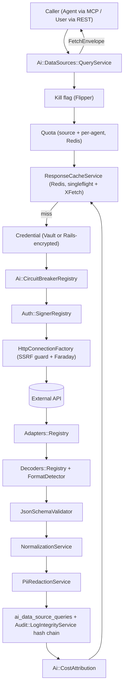

# Data Sources Guide

> How to onboard, extend, secure, query, and discover external data sources — the governed external-fetch pipeline (Phase 1), semantic discovery and effectiveness scoring (Phase 2a), per-endpoint quality, schema-drift, and contract observability (Phase 2b), plus pull-based change monitoring and stale-serving cache policies (Phase 3) for the Powernode AI fleet.

> Status: active

## Table of Contents

- [What this guide covers](#what-this-guide-covers)
- [Prerequisites](#prerequisites)
- [Architecture at a glance](#architecture-at-a-glance)
- [Core models](#core-models)
- [Onboard a new REST/CSV/XML source (no code)](#onboard-a-new-restcsvxml-source-no-code)
- [Writing a custom adapter, decoder, or signer](#writing-a-custom-adapter-decoder-or-signer)
- [Security](#security)
- [Agent usage via MCP](#agent-usage-via-mcp)
- [How agents discover and evaluate sources over time (Phase 2a)](#how-agents-discover-and-evaluate-sources-over-time-phase-2a)
- [Enabling quality & drift per endpoint (Phase 2b)](#enabling-quality--drift-per-endpoint-phase-2b)
- [Monitoring a source for changes (Phase 3)](#monitoring-a-source-for-changes-phase-3)
- [Enabling stale-serving cache policies per endpoint (Phase 3)](#enabling-stale-serving-cache-policies-per-endpoint-phase-3)
- [The fetch pipeline in detail](#the-fetch-pipeline-in-detail)
- [Related guides](#related-guides)

## What this guide covers

The Powernode platform lets the AI fleet pull from external HTTP/REST APIs through a single **governed fetch pipeline**: `Ai::DataSources::QueryService`. Every fetch is rate-limited, SSRF-guarded, circuit-broken, cached, decoded into canonical records, schema-validated, normalized, redacted, audited (into a hash chain), and cost-attributed — without per-source code for the common case.

This guide is for:

- **Operators** onboarding a new source by configuration alone (sections [Onboard a new source](#onboard-a-new-restcsvxml-source-no-code) and [Security](#security)).
- **Backend engineers** extending the pipeline with a bespoke adapter, decoder, or auth signer ([Writing a custom adapter, decoder, or signer](#writing-a-custom-adapter-decoder-or-signer)).
- **Agent authors** discovering and querying sources over MCP ([Agent usage via MCP](#agent-usage-via-mcp)).

This is the **patterns and conventions** reference. For the surrounding Rails conventions see [`docs/guides/backend.md`](backend.md); for the platform-wide security posture see [`docs/guides/security.md`](security.md).

## Prerequisites

- Familiarity with backend conventions ([`docs/guides/backend.md`](backend.md)) — UUIDv7, namespaced models, `render_success`/`render_error`.
- For credential-in-Vault setups: a deployed Vault instance per [`docs/operations/production-deployment.md`](../operations/production-deployment.md).
- For agent usage: the MCP-first workflow in the root [`CLAUDE.md`](../../CLAUDE.md) and [`docs/concepts/mcp-and-tools.md`](../concepts/mcp-and-tools.md).
- Permissions: `ai.data_sources.read` to view, `ai.data_sources.query` to fetch, and `ai.data_sources.{create,update,delete}` (or the `ai.data_sources.manage` super-grant) to mutate. See [`docs/concepts/permissions.md`](../concepts/permissions.md).

## Architecture at a glance



Key invariants this guide assumes:

- **`QueryService` never raises.** Every failure path maps to a `FetchEnvelope` with `success: false` and a redacted `error`.
- **The common case needs zero code.** `rest` and `custom` protocols, the five built-in auth schemes, and the JSON/NDJSON/XML/CSV decoders cover most APIs through configuration alone.
- **Egress is guarded.** Every outbound URL (and every redirect hop) is resolved and pinned against a blocklist of private/loopback/link-local CIDRs.
- **Nothing sensitive persists verbatim.** URLs, params, error messages, and response snippets all pass through `Ai::Security::PiiRedactionService` before they touch the database.

## Core models

| Model | Table | Role |
|---|---|---|
| `Ai::DataSource` | `ai_data_sources` | The source: `protocol`, `auth_scheme`, `auth_config`, `api_base_url`, `rate_limits`, `configuration`, quota counters (Redis) |
| `Ai::DataSourceEndpoint` | `ai_data_source_endpoints` | A callable endpoint: `http_method`, `path_template`, `query_template`, `body_template`, `response_format`, `response_schema`, `response_mapping`, `cache_ttl_seconds` |
| `Ai::DataSourceCredential` | `ai_data_source_credentials` | Auth material: Rails-encrypted `encrypted_api_key`/`encrypted_api_secret`, plus `vault_path` + `migrated_to_vault_at` for the Vault path |
| `Ai::DataSourceQuery` | `ai_data_source_queries` | The query/audit log — one (redacted) row per fetch, linked into the audit hash chain |

Associations: `DataSource has_many :endpoints, :queries, :credentials`. An endpoint resolves its account through its parent source (`delegate :account, to: :data_source`).

See [`docs/concepts/data-model.md`](../concepts/data-model.md) for where these sit in the wider `Ai::` namespace, and [`docs/reference/database-schema.md`](../reference/database-schema.md) for the full column list.

## Onboard a new REST/CSV/XML source (no code)

Most sources need **no Ruby at all** — they are pure configuration: one `DataSource` row, one or more `DataSourceEndpoint` rows, and (if authenticated) one `DataSourceCredential` row. The generic `RestAdapter`, the format detector, and the decoder registry do the rest.

### Step 1 — Create the source

The `source_type` column is constrained to a fixed allow-list (`Ai::DataSource::SOURCE_TYPES`):

```
noaa_ncei  noaa_gfs  noaa_observations  open_meteo  fred
yahoo_finance  espn  newsapi  custom
```

For any source not in that list, use **`custom`** — it is the catch-all and behaves identically. `slug` must be lowercase alphanumeric with hyphens/underscores and is unique per account (auto-generated from `name` when omitted).

```bash
# POST /api/v1/ai/data_sources  (requires ai.data_sources.create)
curl -s -X POST http://localhost:3000/api/v1/ai/data_sources \
  -H "Authorization: Bearer $TOKEN" -H "Content-Type: application/json" \
  -d '{
    "data_source": {
      "name": "Open-Meteo Forecast",
      "slug": "open-meteo",
      "source_type": "open_meteo",
      "api_base_url": "https://api.open-meteo.com",
      "requires_auth": false,
      "is_active": true,
      "priority_order": 100,
      "rate_limits": {
        "requests_per_minute": 60,
        "requests_per_day": 10000,
        "per_agent": { "requests_per_minute": 10 }
      },
      "configuration": {
        "open_timeout_seconds": 5,
        "read_timeout_seconds": 20,
        "max_redirects": 5,
        "max_response_bytes": 5242880
      }
    }
  }'
```

Notes on the fields that drive behavior:

- **`api_base_url`** is validated against the SSRF egress policy at fetch time — a private/loopback/metadata host is rejected. Validate it ahead of time with `data_source_validate_config` (MCP) or the `validate_config` action.
- **`rate_limits`** — `requests_per_minute` / `requests_per_hour` / `requests_per_day` apply to the whole source; an optional nested `per_agent` block applies the same keys per requesting agent so one noisy agent cannot exhaust the source budget. Quota is enforced via Redis atomic counters.
- **`configuration`** knobs read by `HttpConnectionFactory`: `open_timeout_seconds` (default 5), `read_timeout_seconds` (default 20), `max_redirects` (default 5), and `max_response_bytes` (default and hard ceiling 10 MiB — endpoints may **lower** but never raise it).
- **`protocol`** defaults to `rest`. Both `rest` and `custom` use the generic `RestAdapter`; an unrecognized protocol degrades to it too.
- **`auth_scheme`** defaults to `none`. Set it (and `auth_config`) when the source needs auth — see [Authentication](#step-3--add-a-credential-when-authenticated) below.

### Step 2 — Define endpoints

Each endpoint is a template that the `RestAdapter` interpolates with caller params. Three template surfaces use single-brace `{name}` placeholders:

- `path_template` (String) — e.g. `/v1/forecast`
- `query_template` (Hash) — e.g. `{"latitude": "{lat}", "longitude": "{lon}", "hourly": "temperature_2m"}`
- `body_template` (Hash) — only sent for `POST`/`PUT`/`PATCH`

```bash
# POST /api/v1/ai/data_sources/:data_source_id/endpoints  (requires ai.data_sources.update)
curl -s -X POST http://localhost:3000/api/v1/ai/data_sources/open-meteo/endpoints \
  -H "Authorization: Bearer $TOKEN" -H "Content-Type: application/json" \
  -d '{
    "endpoint": {
      "name": "Hourly Forecast",
      "slug": "hourly-forecast",
      "http_method": "GET",
      "path_template": "/v1/forecast",
      "query_template": {
        "latitude": "{lat}",
        "longitude": "{lon}",
        "hourly": "temperature_2m"
      },
      "response_format": "json",
      "expected_content_type": "application/json",
      "cache_ttl_seconds": 300,
      "response_mapping": { "records_path": "hourly" },
      "response_schema": {}
    }
  }'
```

Interpolation rules (from `RestAdapter`):

- A value that is **exactly** one placeholder (`"{lat}"`) is replaced with the **raw, typed** param (Integer/Array/Boolean preserved) so structured bodies keep their JSON types.
- An **embedded** placeholder (`/v1/stations/{id}/obs`) is stringified and spliced in. Path placeholders are RFC 3986 path-escaped so a caller param cannot break out of its segment.
- An **unknown** placeholder (no matching param) is left intact — misconfiguration surfaces visibly instead of silently producing a malformed request.

Endpoint columns that shape the result:

| Column | Effect |
|---|---|
| `response_format` | One of `Ai::DataSourceEndpoint::RESPONSE_FORMATS`: `json xml csv ndjson rss atom html text binary`. Used as the **primary** decoder hint. May be left nil — the [format detector](#step-2-handle-a-new-response-format-a-decoder) sniffs the body. |
| `expected_content_type` | Operator's expected `Content-Type`; cross-checked against the bytes to flag a `content_type_mismatch` anomaly. |
| `cache_ttl_seconds` | Cache lifetime for this endpoint's responses (default 5 min when 0/nil). |
| `response_mapping` | Decoder hints — see the [decoder cheat-sheet](#response_mapping-cheat-sheet) below. Also drives `NormalizationService`. |
| `response_schema` | JSON Schema validated against the **decoded records array**; sets `schema_valid` in provenance. Empty `{}` means "no schema → unknown". |
| `monitorable` | Marks the endpoint for change-detection polling. |

> **`response_format` enum caveat:** the column only accepts the nine tokens above. A source whose `configuration.response_format` is something like `grib2` or `geojson` (binary/GeoJSON) is not decodable into canonical records by the built-in decoders — leave `response_format` nil/`binary` and treat such endpoints as opaque, or write a [custom decoder](#step-2-handle-a-new-response-format-a-decoder).

#### `response_mapping` cheat-sheet

The decoders read hints from `endpoint.response_mapping`:

| Decoder | Keys it honors |
|---|---|
| JSON (`Decoders::Json`) | `records_path` / `root` / `data_path` — dotted path (`"data.items"`) or JSON pointer (`"/data/items"`) to the records array. No path → top-level array is the records, a top-level object is one record. |
| NDJSON (`Decoders::Ndjson`) | `charset` (one record per line; malformed lines skipped). |
| XML/RSS/Atom/HTML (`Decoders::Xml`) | `record_xpath` (explicit XPath) or `record_node` (element name, namespace-agnostic). Auto-detects `<item>`/`<entry>` for feeds; otherwise the most-repeated sibling. |
| CSV/TSV (`Decoders::Csv`) | `delimiter` (`","`, `"\t"`, …), `headers` (`true`/`false`/Array of names), `quote_char`, `charset`. Delimiter and header presence are sniffed when not pinned. |

CSV example — the decoder turns `"city,temp\nNYC,72"` into `[{"city"=>"NYC","temp"=>"72"}]`.

### Step 3 — Add a credential (when authenticated)

Set `requires_auth: true` on the source, pick an `auth_scheme`, and supply scheme-specific knobs in `auth_config`. The five built-in schemes (`Ai::DataSources::Auth::SignerRegistry`):

| `auth_scheme` | Signer | `auth_config` knobs | Credential field used |
|---|---|---|---|
| `none` | `NoneSigner` | — | none (public endpoints) |
| `api_key` | `ApiKeySigner` | `in` (`header`\|`query`), `name`, `prefix` | `decrypted_api_key` |
| `bearer` | `BearerSigner` | `header`, `scheme` (default `Bearer`) | `decrypted_api_key` (or `token`) |
| `aws_sigv4` | `Sigv4Signer` (wraps `Aws::Sigv4::Signer`) | `region` (required), `service` (default `execute-api`), `session_token` | `decrypted_api_key` → access key id, `decrypted_api_secret` → secret |
| `hmac` | `HmacSigner` (RFC 9421, via `Security::HttpSignature`) | `components`, `algorithm`, `label`, `key_id` | `decrypted_api_secret` (+ optional `decrypted_api_key` as `keyid`) |

An unknown/blank scheme resolves to `NoneSigner` — the request goes out unsigned rather than erroring.

```ruby
# auth_scheme = "api_key", auth_config = { "in" => "header", "name" => "X-API-Key" }
# Produces:  X-API-Key: <decrypted_api_key>
#
# auth_scheme = "bearer"  (auth_config defaults)
# Produces:  Authorization: Bearer <decrypted_api_key>
```

Credentials are created through the credential surface (Rails 8 `encrypts` on `encrypted_api_key`/`encrypted_api_secret`). The first credential for a source is auto-marked default; `active_credential` prefers the active+default row. **Never** put key material in `configuration`, `auth_config`, seeds, or anywhere it would persist in plaintext — see [Security › Moving credentials to Vault](#moving-credentials-to-vault).

### Step 4 — Verify the config and run a test fetch

```bash
# Validate config (SSRF-safe base URL, known auth scheme, supported protocol)
#   MCP:  platform.data_source_validate_config  data_source_id: "open-meteo"

# Run a governed fetch through QueryService:
# POST /api/v1/ai/data_sources/:id/endpoints/:endpoint_id/query  (requires ai.data_sources.query)
curl -s -X POST \
  http://localhost:3000/api/v1/ai/data_sources/open-meteo/endpoints/hourly-forecast/query \
  -H "Authorization: Bearer $TOKEN" -H "Content-Type: application/json" \
  -d '{ "params": { "lat": 40.71, "lon": -74.01 } }'
```

A successful response carries the **`FetchEnvelope`** (see [Agent usage](#understanding-the-fetchenvelope) for the full shape): `success`, the canonical `data` records, and a `provenance` block describing exactly what happened (source URL **redacted**, declared-vs-detected content type, charset, `schema_valid`, `record_count`, `anomalies`, cache age, `response_sha256`).

## Writing a custom adapter, decoder, or signer

When configuration is not enough, extend one of the three registries. Each follows the same generic-fallback shape (static map of token → class name, normalize-with-fallback lookup, a default that never raises), so adding one is low-risk and isolated.

> **Before writing code:** run `platform.code_semantic_search` and `platform.query_learnings` for the area first (MCP-first workflow). The built-in implementations under `server/app/services/ai/data_sources/` are the canonical examples to copy.

### Step 1 — Handle a new protocol (an adapter)

An **adapter** is the protocol-aware translation layer between a stored endpoint and the bytes on the wire. It is ignorant of *dispatch* (that's `HttpConnectionFactory`/`QueryService`) and of *normalization* (that's `NormalizationService`). Subclass `Ai::DataSources::Adapters::Base` and implement `build_request`; `parse` is inherited (decoder-registry delegation) and is correct for any HTTP/REST-ish source.

```ruby
# server/app/services/ai/data_sources/adapters/graphql_adapter.rb
# frozen_string_literal: true

module Ai
  module DataSources
    module Adapters
      class GraphqlAdapter < Base
        # @return [Hash] { method:, url:, headers:, query:, body: }
        #   method  : upper-case HTTP verb String
        #   url     : path String (relative to api_base_url is fine)
        #   headers : Hash<String,String>
        #   query   : Hash of query-string params
        #   body    : Hash (dispatcher encodes it), String, or nil
        def build_request(endpoint:, params: {})
          values = stringify_params(params)
          {
            method: "POST",
            url: endpoint&.path_template.to_s,
            headers: { "Content-Type" => "application/json" },
            query: {},
            body: { "query" => values["query"], "variables" => values["variables"] }
          }
        end
      end
    end
  end
end
```

Register it by name in `Adapters::Registry::ADAPTERS` (resolved via `constantize` to sidestep autoload ordering), keyed by the source's `protocol` token:

```ruby
# adapters/registry.rb
ADAPTERS = {
  "rest"    => "Ai::DataSources::Adapters::RestAdapter",
  "custom"  => "Ai::DataSources::Adapters::RestAdapter",
  "graphql" => "Ai::DataSources::Adapters::GraphqlAdapter"   # new
}.freeze
```

Override `parse` only when the protocol needs bespoke pre-processing before decoding. The contract: `parse` returns `Array<Hash>` and **never raises** on a malformed body (return `[]`; the decoder logs, the QueryService records the anomaly).

### Step 2 — Handle a new response format (a decoder)

A **decoder** turns a raw response body into `Array<Hash>` canonical records. The registry selects one by canonical format token (with a content-type probe fallback, and JSON as the ultimate fallback). The contract:

```ruby
Decoders::Registry.for(format:, content_type:).decode(raw_body, endpoint:) # => Array<Hash>
```

To add one, write a class with a `#decode(raw_body, endpoint:)` method (use `Decoders::Registry::Charset.to_utf8(raw_body, charset:)` for uniform transcoding), then register it against a canonical format token in `Decoders::Registry::DECODERS`. If your format needs a new token, add it to `Decoders::FormatDetector` (a `*_FORMAT` constant, a `MIME_FORMAT_MAP` entry, and — if it has a recognizable byte signature — a branch in `sniff_body`) so the detector can recognize it from headers and bytes.

Decoders must be **stateless** (a fresh instance is created per lookup) and must degrade to `[]` rather than raise on garbage input.

### Step 3 — Handle a new auth scheme (a signer)

A **signer** mutates the outbound request in place to add authentication. Subclass `Ai::DataSources::Auth::BaseSigner`, which abstracts the two possible targets (a `Faraday::Connection` or the adapter's request-env Hash) behind `put_header` / `put_query` / `read_headers` / `read_url` / `read_method` / `read_body`.

```ruby
# server/app/services/ai/data_sources/auth/basic_auth_signer.rb
# frozen_string_literal: true

module Ai
  module DataSources
    module Auth
      class BasicAuthSigner < BaseSigner
        # credential: responds to #decrypted_api_key / #decrypted_api_secret (or nil)
        # config:     the data source's auth_config Hash
        def sign!(conn_or_env, credential:, config: {})
          return if credential.nil?

          user = credential.decrypted_api_key
          pass = credential.decrypted_api_secret
          return if user.blank?

          token = Base64.strict_encode64("#{user}:#{pass}")
          put_header(conn_or_env, "Authorization", "Basic #{token}")
          nil
        end
      end
    end
  end
end
```

Register it in `Auth::SignerRegistry::SIGNERS` keyed by the `auth_scheme` token. For HMAC-family schemes, reuse `Security::HttpSignature` (the shared, audited HMAC/secure-compare module also used by inbound webhook verification) rather than hand-rolling crypto.

**Signer safety rules (non-negotiable):** a signing failure must `raise` (so the fetch fails closed) but must **never** put credential material into the log or exception message — the QueryService logs only the exception class on a signing error. Never read keys into a variable that could end up in a stack trace.

### After extending: contribute the pattern back

Per the root `CLAUDE.md` knowledge lifecycle, after adding a registry entry, call `platform.create_learning` (category `pattern`) documenting the new protocol/format/scheme so the fleet discovers it. Run a Ruby syntax check (`cd server && bundle exec ruby -c <file>`) and the relevant spec before reporting done.

## Security

The data-source pipeline is, by design, the place where the AI fleet reaches **out of** the platform to arbitrary hosts. That makes it a prime target for SSRF, credential exfiltration, and log leakage. Three controls carry most of the weight.

### SSRF allowlist behavior

`Ai::DataSources::HttpConnectionFactory` is the only sanctioned way to make an outbound data-source request. It enforces **resolve-and-pin** egress control (OWASP A10:2021 SSRF; ASI08 Excessive Agency):

- `validate_url!(url)` resolves the host's DNS and **raises `Ai::DataSources::HttpConnectionFactory::SsrfError`** if any resolved address falls in a blocked CIDR, if the scheme is not `http`/`https`, or if DNS fails to resolve.
- Blocked ranges cover IPv4 and IPv6 private/loopback/link-local/unique-local space — including `127.0.0.0/8`, `10.0.0.0/8`, `172.16.0.0/12`, `192.168.0.0/16`, `169.254.0.0/16` (which contains the cloud metadata address `169.254.169.254`), CGNAT `100.64.0.0/10`, `fc00::/7`, `fe80::/10`, IPv4-mapped IPv6, and the 6to4/Teredo prefixes.
- **It is not an allowlist of hosts** — it is a denylist of internal address space. Any *public* host is reachable; any address that resolves into reserved/internal space is rejected, even if a public hostname resolves there.
- **Redirects are re-validated on every hop** (via the `follow_redirects` callback) so a public host cannot `30x`-bounce a request into the internal network.
- A response-body cap (`max_response_bytes`, default and ceiling 10 MiB) raises `ResponseTooLargeError`; both the `Content-Length` header and the materialized body are checked.

In the pipeline, an `SsrfError` maps to a `FetchEnvelope` with `status: "blocked"` and the generic error `"request blocked by egress policy"` — the internal IP is deliberately **not** echoed back to the caller.

```ruby
# This is what runs before every outbound request and every redirect hop:
Ai::DataSources::HttpConnectionFactory.validate_url!("http://169.254.169.254/latest/meta-data/")
# => raises Ai::DataSources::HttpConnectionFactory::SsrfError
```

Operators can verify a source's base URL ahead of time with the `data_source_validate_config` MCP action (or the `validate_config` controller action), which runs `validate_url!` and reports the result without making a request.

### Moving credentials to Vault

Out of the box, `Ai::DataSourceCredential` encrypts `encrypted_api_key` / `encrypted_api_secret` at rest with Rails 8 `encrypts` (application-managed keys). For production, move the secret material into HashiCorp Vault so it never lives in the application database.

The Vault path is driven by two columns on the credential and the shared `Security::VaultCredentialProvider`:

| Column | Meaning |
|---|---|
| `vault_path` | Set once the secret is stored in Vault; its presence is what makes the QueryService read from Vault. |
| `migrated_to_vault_at` | Timestamp of the migration. |

To migrate a credential, store its material through the provider — which writes to Vault and stamps `vault_path` + `migrated_to_vault_at` on the record:

```ruby
# Guide the operation through the provider — never echo the secret anywhere.
provider = Security::VaultCredentialProvider.new(account_id: credential.account_id)
provider.store_credential(
  credential_type: :data_source,             # Vault path component
  credential_id:   credential.id,
  data:            { api_key: "...", api_secret: "..." },  # supplied at call time
  record:          credential                # provider sets vault_path + migrated_to_vault_at
)
```

At fetch time, `QueryService#resolve_credential` checks for `vault_path`; when present it reads the secret via `Security::VaultCredentialProvider#get_credential(credential_type: :data_source, credential_id:, record:)` and wraps the returned Hash in a read-only `VaultCredentialView` exposing `decrypted_api_key` / `decrypted_api_secret` to the signer layer. If the Vault read fails it **falls back** to the Rails-encrypted columns, logging only the failure message (never the secret).

This obeys the platform's **Cryptographic Material Safety** rules (root `CLAUDE.md`): all key storage goes through the Vault surface, key operations are not run via ad-hoc CLI where they'd hit shell history, and key material is never passed as an argument that could surface in a log or trace. See [`docs/guides/security.md`](security.md#cryptographic-material-safety) for the full ruleset.

### The redaction chokepoint

Before **any** caller- or operator-visible string is written to `ai_data_source_queries` (or stored in cached provenance), `QueryService` routes it through a single redaction chokepoint: `Ai::Security::PiiRedactionService` (logging disabled on these calls to avoid recursive audit writes). What passes through it:

- **Source URL** — query strings carry api keys and tokens. The URL is redacted in both the persisted `redacted_url` column and the `provenance.source_url` field. On redaction failure the query string is stripped entirely rather than risk a leak.
- **Query params** — recursively redacted into `metadata.redacted_params`.
- **Response snippet** — the first 2 KB of the decoded body, kept (redacted) for forensics.
- **Error messages** — redacted before they reach the envelope or the row.

Layered on top of PII heuristics is an unconditional **sensitive-key mask**: any URL query param or top-level param whose key matches `SENSITIVE_QUERY_KEY` is masked to `[REDACTED]` regardless of whether the value looks like PII. That regex covers `api_key`, `key`, `token`/`tokens`, `access_token`, `refresh_token`, `id_token`, `secret`, `client_secret`, `auth`, `authorization`, `password`/`passwd`/`pwd`, `sig`, `signature`, `sign`, `credential`, `session`, and `cookie` (with optional `_`/`-` prefixes). So `?token=abc&sig=xyz` always persists as `?token=[REDACTED]&sig=[REDACTED]`, even when the values are opaque.

The persisted row also sets `redaction_applied: true` and `masking_applied: true`, and is sealed into the **audit hash chain** via `Audit::LogIntegrityService` (a companion `AuditLog` whose `before_create` hook assigns `sequence_number` + `previous_hash` + `integrity_hash`; the anchor is mirrored back into the query's `metadata["audit_chain"]`). Audit-chain or cost-attribution failures never break the fetch — the query row still persists.

## Agent usage via MCP

Agents discover and use data sources through the `data_source_*` MCP actions, exposed by `Ai::Tools::DataSourceTool` (registered in `PlatformApiToolRegistry`). The MCP surface has 1:1 parity with the REST controller.

### Actions and permissions

| Action | Permission | What it does |
|---|---|---|
| `data_source_list` | `ai.data_sources.read` | List sources with health + credential counts (filter by `source_type`, `is_active`) |
| `data_source_get` | `ai.data_sources.read` | One source with config, rate limits, credentials, quota summary |
| `data_source_describe` | `ai.data_sources.read` | A source's endpoints — method, path, `response_format`, schemas, mappings |
| `data_source_query` | `ai.data_sources.query` | **The governed fetch** — runs `QueryService`, returns a `FetchEnvelope` |
| `data_source_health` | `ai.data_sources.read` | Quota summary + response-cache metrics + circuit-breaker state + **trust signals** |
| `data_source_validate_config` | `ai.data_sources.read` | SSRF-safe base URL, known auth scheme, supported protocol/formats |
| `data_source_discover` | `ai.data_sources.read` | **Semantic discovery (Phase 2a)** — rank sources for a natural-language need via `SemanticDiscoveryService` |
| `data_source_provenance` | `ai.data_sources.read` | **Phase 2a** — read one `ai_data_source_queries` row's already-redacted provenance (by `query_id`/`correlation_id`/latest) |
| `data_source_impact` | `ai.data_sources.read` | **Phase 2a** — usage summary for a source (distinct agents, query counts, `last_used_at`, `effectiveness_score`, health) |
| `data_source_subscribe` | `ai.data_sources.stream` | **Phase 3** — create/update a pull-based monitoring subscription on an endpoint (idempotent on the source+endpoint pair) |
| `data_source_unsubscribe` | `ai.data_sources.stream` | **Phase 3** — remove a subscription by `subscription_id`, or every subscription for a `data_source_id`+`endpoint_id` pair |
| `data_source_create` | `ai.data_sources.create` (or `.manage`) | Create a source — **proposal fallback** when unprivileged |
| `data_source_update` | `ai.data_sources.update` (or `.manage`) | Update a source — **proposal fallback** when unprivileged |
| `data_source_delete` | `ai.data_sources.delete` (or `.manage`) | Delete a source — **proposal fallback** when unprivileged |

`ai.data_sources.manage` is a super-grant that satisfies any mutation. The tool's class-level `REQUIRED_PERMISSION` (`ai.data_sources.read`) gates visibility; finer per-action checks happen inside the call so one tool carries read, query, and mutation actions with distinct authorization.

### Discover, then query

A typical agent flow:

```text
1. platform.data_source_list                      → find a source by capability/type
2. platform.data_source_describe                  → see its endpoints + which params they take
     data_source_id: "open-meteo"
3. platform.data_source_query                     → run the governed fetch
     data_source_id: "open-meteo"
     endpoint_id:    "hourly-forecast"
     params: { lat: 40.71, lon: -74.01 }
4. platform.data_source_health                    → check quota/cache/breaker if a query is slow or blocked
```

Both `data_source_id` and `endpoint_id` accept either a UUID or a slug. The `params` object is passed straight to `QueryService` (and redacted before persistence).

### Understanding the FetchEnvelope

`data_source_query` returns the `QueryService` envelope verbatim:

```jsonc
{
  "success": true,
  "data": [ /* canonical Array<Hash> records */ ],
  "provenance": {
    "slug": "open-meteo",
    "endpoint_id": "…",
    "fetched_at": "2026-06-06T12:00:00Z",
    "from_cache": false,
    "cache_age_seconds": 0,
    "response_sha256": "…",
    "source_url": "https://api.open-meteo.com/v1/forecast?…[REDACTED]…",  // always redacted
    "declared_vs_detected_content_type": { "declared": "json", "detected": "json", "mismatch": false },
    "charset": "UTF-8",
    "applied_encoding": "UTF-8",
    "schema_valid": null,          // true/false when response_schema is set, null when none
    "record_count": 24,
    "anomalies": []                // e.g. "content_type_mismatch", "schema_invalid", "http_500", "decode_error"
  },
  "status": "success",             // success | error | timeout | rate_limited | blocked | cached
  "duration_ms": 142,
  "bytes": 4096,
  "error": null                    // redacted message on failure
}
```

The envelope is non-throwing: on failure `success` is `false`, `status` carries the classification, and `error` is a **redacted** message. Quota exhaustion returns `status: "rate_limited"` with a `retry_after`; an SSRF/kill-flag block returns `status: "blocked"`.

### Proposal fallback for unprivileged agents

When an agent's account lacks the mutation permission, `data_source_create/update/delete` **do not mutate**. Instead they file an `Ai::AgentProposal` (via `Ai::ProposalService`) describing the intended change and return a proposal-style result so a human can review and apply it:

```jsonc
{
  "success": true,
  "requires_approval": true,
  "proposal_id": "…",
  "status": "pending_review",
  "message": "Permission ai.data_sources.create required — filed proposal … for review",
  "proposed_changes": { "action": "create", "attributes": { /* … */ } }
}
```

This mirrors the established autonomy pattern used by the agent-management tools (see [`docs/concepts/agents-and-autonomy.md`](../concepts/agents-and-autonomy.md)).

### REST equivalents

For UI and service integration, the same operations live under `Api::V1::Ai::DataSourcesController` (the frontend tabs in `frontend/src/features/ai/data-sources/components/` — notably `DataSourceEndpointsTab.tsx` and `DataSourceQueryConsole.tsx` — consume these):

| REST | Action |
|---|---|
| `GET /api/v1/ai/data_sources` | index |
| `GET/POST/PATCH/DELETE /api/v1/ai/data_sources/:id` | show / create / update / destroy |
| `POST /api/v1/ai/data_sources/:id/test_connection` | lightweight reachability check |
| `GET /api/v1/ai/data_sources/:id/quota_status` | quota summary |
| `GET/POST /api/v1/ai/data_sources/:id/endpoints` | endpoint list / create |
| `PATCH/PUT/DELETE /api/v1/ai/data_sources/:id/endpoints/:endpoint_id` | endpoint update / destroy |
| `POST /api/v1/ai/data_sources/:id/endpoints/:endpoint_id/query` | governed fetch (calls `QueryService`) |
| `POST /api/v1/ai/data_sources/discover` | **Phase 2a** — semantic discovery (collection route; calls `SemanticDiscoveryService`) |
| `GET/POST /api/v1/ai/data_sources/:id/subscriptions` | **Phase 3** — monitoring subscription list / create (`subscriptions_index` `read` / `subscriptions_create` `stream`) |
| `DELETE /api/v1/ai/data_sources/:id/subscriptions/:subscription_id` | **Phase 3** — cancel a subscription (`subscriptions_destroy`; `stream`) |

The query action maps the envelope status to an HTTP status on failure (`rate_limited`→429, `blocked`→403, `timeout`→504, else 502) and returns `provenance` in the error `details`.

## How agents discover and evaluate sources over time (Phase 2a)

Phase 1 answers "fetch from *this* source". Phase 2a answers the question that comes before it — **"which source should I use, and can I trust it?"** — by giving every source a learned **effectiveness score** that accrues from real usage, and a **semantic discovery** entry point that ranks sources for a natural-language need. Nothing here is per-source code; it reuses the same knowledge-graph and embedding services that back skill discovery.

### Discovering a source by intent (MCP + REST)

Instead of `data_source_list` + eyeballing, an agent can describe the *need* and let the platform rank candidates:

```text
platform.data_source_discover
  query:  "hourly precipitation forecast for a coordinate"
  limit:  10        # optional, default 10, clamped 1..50
  rerank: false     # optional; true routes top candidates through the RAG reranker (an LLM call)
```

The REST equivalent is a **collection** route (not nested under a source):

```bash
# POST /api/v1/ai/data_sources/discover   (requires ai.data_sources.read)
curl -s -X POST http://localhost:3000/api/v1/ai/data_sources/discover \
  -H "Authorization: Bearer $TOKEN" -H "Content-Type: application/json" \
  -d '{ "query": "intraday equity prices", "limit": 5 }'
```

Both return the same ranked shape — `{ query, count, results: [ <serialized source> + score + signals ] }`:

```jsonc
{
  "query": "intraday equity prices",
  "count": 2,
  "results": [
    {
      "id": "…", "slug": "yahoo-finance", "name": "Yahoo Finance",
      "effectiveness_score": 0.81,            // also surfaced on the source itself
      "score": 0.74,                           // the blended ranking score (0..1)
      "signals": {                             // the per-signal breakdown behind `score`
        "semantic": 0.78, "effectiveness": 0.81, "health": 1.0, "recency": 0.42
      }
    }
  ]
}
```

`Ai::DataSources::SemanticDiscoveryService#discover(query:, agent: nil, limit: 10, rerank: false)` does the ranking:

1. Embeds the query with the **same** `Ai::Memory::EmbeddingService` that the bridge used to embed each source (so query and corpus share an embedding space).
2. Pulls the nearest `data_source` knowledge-graph nodes via pgvector cosine `nearest_neighbors`, maps each node back to its `Ai::DataSource`, and blends a final score from four signals — weights `semantic 0.55 / effectiveness 0.25 / health 0.10 / recency 0.10`.
3. **Degrades gracefully**: with no embedding backend (test/CI, or a source whose node never got an embedding), it falls back to keyword matching on the node name (`search_by_name`) and neutralizes the semantic signal at `0.5`, so discovery still returns ranked results.

The recommended agent flow becomes **discover → describe → query**:

```text
1. platform.data_source_discover  query: "hourly precipitation forecast"   → ranked candidates + trust signals
2. platform.data_source_describe  data_source_id: "<top result slug>"        → its endpoints + params
3. platform.data_source_query     data_source_id, endpoint_id, params        → the governed fetch (Phase 1)
```

### How effectiveness accrues from usage

Discovery ranking is only as good as the trust signals feeding it, and the dominant trust signal — `effectiveness_score` — is **learned from real fetches**, not configured.

The accrual point is `Ai::DataSources::QueryService#finalize`, which calls `data_source.record_query!(outcome:, freshness:, agent:)` **only on live fetches** — never on a cache hit, a kill-flag block, or a quota short-circuit (those didn't actually exercise the upstream, so they must not move the score). `outcome` is `"success"` / `"failure"`; `freshness` is an optional `0.0..1.0` hint about how recent the upstream data was.

`Ai::DataSource#record_query!` is deliberately cheap on the hot path — **one `update_columns` write** that bypasses the audit hash chain and the knowledge-graph re-sync (the `ai_data_source_queries` row already *is* the per-request audit log). It:

- increments `usage_count`, and `positive_usage_count` **or** `negative_usage_count` by outcome,
- stamps `last_used_at`,
- and on **every 5th** recorded outcome calls `recalculate_effectiveness!`.

`recalculate_effectiveness!(freshness: nil)` blends three normalized signals into the stored score (also via `update_columns`, off the audit/KG path):

```
effectiveness_score = (0.3 * kg_confidence
                     + 0.4 * usage_success_rate
                     + 0.3 * freshness).round(4)
```

- **`kg_confidence`** = the linked knowledge-graph node's `confidence` (its semantic standing in the graph), or `0.5` when there is no node yet.
- **`usage_success_rate`** = `positive / (positive + negative)`, or a neutral `0.5` until there is at least one outcome (so a brand-new source isn't penalized for having no history).
- **`freshness`** = the caller's hint when given, else a private `freshness_score`: a linear 7-day decay off `max(last_used_at, last_health_check_at)` — `~1.0` just-touched, `0.0` a week stale, neutral `0.5` when never used or health-checked.

New columns backing all of this: `effectiveness_score` (default `0.5`), `usage_count` / `positive_usage_count` / `negative_usage_count` (default `0`), and `last_used_at`.

> **Why every 5th?** The blend reads `kg_confidence` and recomputes the rate; doing it on a cadence keeps the write cheap on a high-volume fetch path while still tracking the trend. The counters themselves update on *every* live fetch, so no outcome is lost — only the *recompute* is batched.

### Reading the trust signals

Three read surfaces expose the accrued trust, none of which mutate anything:

| Where | What you get |
|---|---|
| The serialized source (`data_source_get`, list, discovery results, `serialize_data_source`) | `effectiveness_score`, `usage_count`, `positive_usage_count`, `negative_usage_count`, `usage_success_rate`, `last_used_at` |
| `data_source_describe` / `data_source_health` | the source summary/health payload **plus** a `trust_signals` block |
| `data_source_impact` (`data_source_id`) | distinct requesting-agent count, query-count breakdown (total / successful / failed / cached), `last_used_at`, `effectiveness_score`, `health_status`, and the `trust_signals` block |

The `trust_signals` block is the canonical reliability summary an agent reasons over:

```jsonc
{
  "effectiveness_score": 0.81,
  "usage_count": 240,
  "positive_usage_count": 222,
  "negative_usage_count": 18,
  "usage_success_rate": 0.925,
  "kg_confidence": 1.0,          // the linked KG node's confidence (nil if no node)
  "last_used_at": "2026-06-06T12:00:00Z",
  "health_status": "healthy",
  "healthy": true
}
```

For **post-hoc provenance** of a *specific* fetch (not the rolled-up source view), `data_source_provenance` reads one `ai_data_source_queries` row's **already-redacted** provenance columns — resolved by `query_id`, else `correlation_id`, else the latest query for a source (optionally scoped to an endpoint), always account-scoped. It is a read of what `QueryService` already persisted at write time — it does not re-fetch and never un-redacts.

> **All Phase 2a actions are read-only** and gated by `ai.data_sources.read` — `discover`, `provenance`, and `impact` neither mutate sources nor count against quota. The only thing that *moves* a score is a real `data_source_query` live fetch (via `record_query!`).

## Enabling quality & drift per endpoint (Phase 2b)

Phase 2a tells an agent *which* source to use and how much to trust it overall. **Phase 2b** governs *what comes back from a specific endpoint* — it adds, **per endpoint**, three opt-in observability stages to the governed fetch (schema-drift tracking, data-quality expectations, quarantine-on-failure) plus an OpenAPI importer and an aggregate contract verdict.

The headline operator fact: **all three stages are OFF by default.** The three endpoint flags (`track_schema`, `quality_checks_enabled`, `quarantine_on_failure`) default `false`, so until you flip them a fetch costs exactly what it did before Phase 2b — the `FetchEnvelope` is byte-for-byte identical to the Phase-1/2a shape, and `QueryService` runs zero extra work. You turn observability on **deliberately, one endpoint at a time.**

The backend code is `server/app/services/ai/data_sources/{schema_drift_service,quality_service,open_api_import_service,contract_service}.rb`, wired into `QueryService#apply_observability_stages` (a private stage that runs after normalization, only for endpoints that opt in). The models are `Ai::DataSourceSchemaVersion` and `Ai::DataSourceExpectation`.

### Step 1 — Set the per-endpoint flags

Three boolean columns on `Ai::DataSourceEndpoint` gate the stages (all default `false`); two more columns carry contract metadata:

| Column | Type | Effect when set |
|---|---|---|
| `track_schema` | bool | After each **live** fetch, `QueryService` infers a JSON-Schema snapshot from the records and appends a version via `SchemaDriftService#record_version!`. A `breaking` classification emits a stigmergic signal (see [operations](../operations/data-sources.md#monitoring-schema-drift-signals)). |
| `quality_checks_enabled` | bool | `QualityService#evaluate` runs the endpoint's active expectations over the records, setting `quality_score`/`quality_passed` on the query-log row and in provenance. |
| `quarantine_on_failure` | bool | **Requires `quality_checks_enabled`.** When an otherwise-successful fetch *fails* quality (an error-severity rule), the bad batch is replaced with the last-known-good cached payload and the bad payload is not cached. |
| `sla_max_age_seconds` | int | Freshness budget for the contract verdict — a fetch whose `cache_age_seconds` exceeds it is `sla_exceeded`. Nil means "no SLA" (never violated). |
| `owner` | string | Free-form contract/SLA owner (team or person). Read-only metadata; see [SLA & contract ownership](../operations/data-sources.md#sla--contract-ownership). |

Set them through the normal endpoint update surface (`PATCH /api/v1/ai/data_sources/:data_source_id/endpoints/:endpoint_id`, requires `ai.data_sources.update`):

```bash
curl -s -X PATCH \
  http://localhost:3000/api/v1/ai/data_sources/open-meteo/endpoints/hourly-forecast \
  -H "Authorization: Bearer $TOKEN" -H "Content-Type: application/json" \
  -d '{
    "endpoint": {
      "track_schema": true,
      "quality_checks_enabled": true,
      "quarantine_on_failure": true,
      "sla_max_age_seconds": 600,
      "owner": "weather-platform-team"
    }
  }'
```

> **Order of stages (from `apply_observability_stages`):** schema-drift first, then quality, then — only if quality failed on a successful fetch and `quarantine_on_failure` is set — the last-known-good swap. Every stage is individually nil-safe: a stage that raises is logged and skipped, never breaking the fetch. The stages run **only on live fetches** (after decode/normalize); a cache hit, kill-flag block, or quota short-circuit never reaches them.

The stages add these keys to the `FetchEnvelope` provenance (and persist onto the `ai_data_source_queries` row columns `quality_score`/`quality_passed`/`quarantined`/`schema_drift`) **only when the matching flag is on**:

```jsonc
"provenance": {
  // ...the Phase-1 fields...
  "schema_drift": "additive",      // track_schema: initial|none|additive|breaking
  "quality_passed": true,          // quality_checks_enabled
  "quality_score": 0.95,           // quality_checks_enabled: weighted 0..1
  "quarantined": true              // present only when the batch was quarantined
}
```

Anomalies are also appended to `provenance.anomalies`: `schema_drift_<classification>` (when drift is anything but `none`), `quality_<rule_type>` per failed error-severity rule, `quality_failed`, and `quarantined`.

### Step 2 — Write `Ai::DataSourceExpectation` rules

Quality is driven by `Ai::DataSourceExpectation` rows attached to an endpoint (`endpoint.expectations`, `dependent: :destroy`). `QualityService` runs only the **active** rules (`expectations.active`). Each rule has a `rule_type`, a JSON `config`, a `severity`, and `is_active`.

**Six rule types** (`Ai::DataSourceExpectation::RULE_TYPES`, also re-exported as `Ai::DataSourceEndpoint::EXPECTATION_RULE_TYPES`):

| `rule_type` | `config` keys | Passes when |
|---|---|---|
| `required_fields` | `fields` (Array) / `field` | every record contains all the listed keys |
| `min_records` | `min` / `minimum` (default 1) | record count `>=` min |
| `max_records` | `max` / `maximum` | record count `<=` max (no-op if unset) |
| `non_null` | `fields` (Array) / `field` | the listed fields are present **and** non-blank on every record |
| `allowed_values` | `field`, `values` (Array) / `allowed` | the field's value is within the allowed set (nulls are skipped) |
| `distribution` | `field`, `max_null_ratio` (default 0.5) | the field's null/blank ratio stays `<=` `max_null_ratio`. **No `field`** → degrades to a record-shape uniformity check (every record shares the most common key set) |

**Two severities** (`Ai::DataSourceExpectation::SEVERITIES`):

- **`error`** — a failure sets `passed: false` for the batch (and triggers quarantine when enabled). Error rules also weigh **double** in the score.
- **`warn`** — a failure only lowers `quality_score`; the batch still `passed: true`.

So `passed` is `false` **only** when an *error-severity* rule fails. The weighted score is `earned_weight / total_weight` (error weight 2, warn weight 1), rounded to 4 dp; an empty/zero-weight rule set scores `1.0`.

> **Built-in defaults.** When an endpoint has **no** active expectations but `quality_checks_enabled` is on, two WARN-severity defaults run so a quality signal still exists: `non_empty` (`min_records >= 1`) and `uniform_shape` (the `distribution` shape check). Being WARN, they shape the score but never fail the batch — so quarantine needs at least one explicit *error* rule to ever trigger.

There is no dedicated REST/MCP CRUD surface for expectations in Phase 2b — create them at the model layer (e.g. a `rails runner` or a seed), keyed by `ai_data_source_endpoint_id`:

```ruby
# rails runner — attach quality rules to an endpoint
ep = Ai::DataSource.for_account(account).find_by!(slug: "open-meteo")
       .endpoints.find_by!(slug: "hourly-forecast")

# Hard rule: every record must carry a timestamp + temperature (fails + quarantines).
ep.expectations.create!(
  name: "core fields present", rule_type: "required_fields",
  config: { "fields" => %w[time temperature_2m] }, severity: "error", is_active: true
)
# Soft rule: warn if the forecast comes back unusually short.
ep.expectations.create!(
  name: "min 12 hours", rule_type: "min_records",
  config: { "min" => 12 }, severity: "warn", is_active: true
)
```

Read the configured rules and the latest outcome over REST (`GET .../endpoints/:endpoint_id/quality`, requires `ai.data_sources.read`) or the `data_source_quality` MCP action — see [reading a contract verdict](#step-4--read-a-contract-verdict). Tuning guidance (when to use `error` vs `warn`, ratcheting) is in the [operations runbook](../operations/data-sources.md#tuning-quality-expectations).

### Step 3 — Import endpoints from an OpenAPI spec

Rather than hand-authoring an endpoint per operation, import an OpenAPI 3 document. `Ai::DataSources::OpenApiImportService#import(spec, dry_run:)` walks `paths × {get,post,put,patch,delete,head}` and builds one `DataSourceEndpoint` per operation: `name` from `operationId` → `summary` → `"METHOD path"`, `http_method`, `path_template` = the path, and `response_schema` resolved from the 2xx (then `default`) JSON response content with recursive `$ref` resolution against `#/components`.

The surface is `POST /api/v1/ai/data_sources/:id/introspect` — **gated by `ai.data_sources.manage`** because it is a write surface (even a `dry_run` preview requires `manage`). The MCP analogue is `data_source_introspect` (also `manage`-gated). Pass the spec **inline** as `spec` (a parsed Hash) or as a **URL** via `spec_url`/`url` (fetched server-side through the SSRF-guarded `HttpConnectionFactory`):

```bash
# Preview only — see what would be created, persist nothing.
curl -s -X POST http://localhost:3000/api/v1/ai/data_sources/open-meteo/introspect \
  -H "Authorization: Bearer $TOKEN" -H "Content-Type: application/json" \
  -d '{ "spec_url": "https://api.example.com/openapi.json", "dry_run": true }'

# Persist the import.
curl -s -X POST http://localhost:3000/api/v1/ai/data_sources/open-meteo/introspect \
  -H "Authorization: Bearer $TOKEN" -H "Content-Type: application/json" \
  -d '{ "spec_url": "https://api.example.com/openapi.json", "dry_run": false }'
```

The result is `{ created: [...], preview: [...], errors: [...], dry_run: <bool> }`:

- **`dry_run: true`** → `created` is empty; `preview` lists the endpoint attributes that *would* be created.
- **`dry_run: false`** → `created` lists the persisted endpoints; `preview` still mirrors the full set.
- **Duplicate slugs are skipped, not errored** — both against slugs already on the source (so a re-import is safe/idempotent) and slugs produced earlier in the same batch (two operations resolving to the same slug). A per-operation failure (e.g. validation) lands in `errors` and does not abort the rest.

Imported endpoints come in with the Phase-2b flags **off** — enable `track_schema`/`quality_checks_enabled` per endpoint (Step 1) after reviewing the import.

### Step 4 — Read a contract verdict

A **contract verdict** is the single "is the data contract met?" answer for an endpoint, combining the three Phase-2b signals: `schema_valid`, `quality_passed`, and `within_sla`. `Ai::DataSources::ContractService#validate(data_source:, endpoint:, envelope:)` returns:

```jsonc
{
  "met": true,                  // all ASSERTED signals hold
  "schema_valid": true,         // from provenance; nil when no response_schema configured
  "quality_passed": true,       // from envelope/provenance, else a fresh QualityService run
  "within_sla": true,           // cache_age_seconds <= sla_max_age_seconds; true when no SLA
  "violations": []              // any of: schema_invalid, quality_failed, sla_exceeded
}
```

The semantics that matter:

- **A `nil` signal is "not asserted"** — it is *not* a violation. So an endpoint with no `response_schema` (schema_valid nil), no quality verdict, and no SLA produces a **vacuously met** contract (`met: true`, empty `violations`).
- **`within_sla` is `true` when `sla_max_age_seconds` is unset** (an unset budget can't be exceeded); it is `nil` only when an SLA *is* set but the cache age is unknown.
- **`met` = every asserted signal is true** — i.e. `violations` is empty.

Read it without triggering a fetch over REST (`GET .../endpoints/:endpoint_id/contract`, requires `ai.data_sources.read`) or the `data_source_contract` MCP action. Both build the verdict from the endpoint's **most recent recorded query-log row** (a GET must not make an outbound request), so with no prior query the verdict is vacuously met:

```bash
curl -s -H "Authorization: Bearer $TOKEN" \
  http://localhost:3000/api/v1/ai/data_sources/open-meteo/endpoints/hourly-forecast/contract
# Fresh endpoint, no prior query → vacuously met (every signal "not asserted"):
# => { "success": true, "data": { "met": true, "schema_valid": null, "quality_passed": null, "within_sla": true, "violations": [] } }
```

The related read-only surfaces complete the picture:

| Read | REST | MCP | What you get |
|---|---|---|---|
| Schema history | `GET .../endpoints/:id/schema_history` | `data_source_schema_history` | Every recorded version newest-first (`version`, `classification`, `schema`, `diff`, `checksum`) + a `latest` pointer |
| Quality | `GET .../endpoints/:id/quality` | `data_source_quality` | The flags, the latest quality outcome (score/passed/quarantined/drift/results/anomalies) distilled from the most recent query-log row, and the configured expectations |
| Contract | `GET .../endpoints/:id/contract` | `data_source_contract` | The aggregate verdict above |

All three reads are gated by `ai.data_sources.read` and never make an outbound call — they surface what tracked fetches already persisted.

## Monitoring a source for changes (Phase 3)

Phases 1/2 are **pull-on-demand** — a fetch happens because an agent or user asked for one. **Phase 3** adds the inverse: a **pull-based monitor** that polls a chosen endpoint on a cadence, change-detects the result, and emits a `data_source_changed` stigmergic signal so autonomous agents react to fresh upstream data without re-fetching it themselves. Nothing here is new fetch code — the monitor runs the *same* governed `QueryService` pipeline (kill flag, quota, cache, breaker, SSRF guard, decode/normalize/redact/audit); it just drives it on a schedule and records the outcome on a **subscription** row.

The operational side (the worker cron, `due_for_poll` auto-recovery, quota-aware polling, the change signal) is in the [operations runbook](../operations/data-sources.md#monitoring-a-source-for-changes-phase-3). This section is the author/operator side: how to create a subscription and what its cadence + status mean.

### The subscription model

A subscription is one `Ai::DataSourceSubscription` row (table `ai_data_source_subscriptions`) binding a `data_source` + `endpoint` (and optionally an `agent`) to a poll cadence:

| Field | Role |
|---|---|
| `poll_frequency` | Cadence — one of `Ai::DataSourceSubscription::POLL_FREQUENCIES`: `manual 5min hourly daily weekly monthly realtime`. `manual` never auto-polls; `realtime` polls on every monitor tick (interval 0). |
| `status` | One of `STATUSES`: `active paused error`. `active` polls on cadence; `paused` is operator-set and **never** polls; `error` is set automatically after repeated failures but **keeps** polling so it can self-heal. |
| `params` | The per-poll variables (jsonb) passed straight into the governed fetch — same `{name}` template params an interactive query takes. |
| `next_poll_at` | When the next poll is due. Seeded on create for any non-manual cadence (`before_create`), advanced by `schedule_next_poll!` after each poll. |
| `last_polled_at` / `last_checksum` / `last_etag` | The last poll time and change fingerprint (a canonical SHA-256 of the payload, plus the upstream ETag when present). |
| `consecutive_failures` | Failure counter; the subscription flips to `error` at `>= 5`. Reset to 0 by any successful poll. |

The cadence values reuse `Ai::DataConnector`'s sync-frequency set plus two finer monitor-grade tiers (`5min`, `realtime`).

### Create a subscription (MCP)

Subscriptions are created over MCP via `data_source_subscribe` (and removed via `data_source_unsubscribe`). **Both require the `ai.data_sources.stream` permission** — a new grant added for Phase 3 (registered in `permissions.rb` and granted to the `member`, `manager`, and `ai_specialist` roles). They are **idempotent on the (source, endpoint) pair**: a second subscribe to the same endpoint updates the existing subscription's cadence/params rather than creating a duplicate (`find_or_initialize_by` on the endpoint).

```text
platform.data_source_subscribe
  data_source_id: "open-meteo"          # UUID or slug
  endpoint_id:    "hourly-forecast"     # UUID or slug
  poll_frequency: "5min"                # default "hourly" when omitted
  params: { lat: 40.71, lon: -74.01 }   # per-poll fetch variables

platform.data_source_unsubscribe
  subscription_id: "…"                   # delete one specific subscription
  # — OR — delete every subscription for a (source, endpoint) pair:
  # data_source_id: "open-meteo"  endpoint_id: "hourly-forecast"
```

`data_source_subscribe` returns the subscription summary; `data_source_unsubscribe` returns a delete confirmation (a `subscription_id`, or a `removed_count` for the pair form). When called with an `agent` context, the subscription is attributed to that agent (`agent_id`).

### Create a subscription (REST)

The same operations live as nested routes under a source (consumed by the frontend `DataSourceMonitoringTab.tsx` via `DataSourcesApiService.getSubscriptions/createSubscription/deleteSubscription`):

| REST | Action | Permission |
|---|---|---|
| `GET /api/v1/ai/data_sources/:data_source_id/subscriptions` | `subscriptions_index` — `{ items: [summary], count }` | `ai.data_sources.read` |
| `POST /api/v1/ai/data_sources/:data_source_id/subscriptions` | `subscriptions_create` — body `endpoint_id` + `poll_frequency` + `params`; returns `{ subscription: summary }` | `ai.data_sources.stream` |
| `DELETE /api/v1/ai/data_sources/:data_source_id/subscriptions/:subscription_id` | `subscriptions_destroy` | `ai.data_sources.stream` |

```bash
# Create / update a subscription (idempotent on the endpoint).
curl -s -X POST \
  http://localhost:3000/api/v1/ai/data_sources/open-meteo/subscriptions \
  -H "Authorization: Bearer $TOKEN" -H "Content-Type: application/json" \
  -d '{
    "subscription": {
      "endpoint_id": "hourly-forecast",
      "poll_frequency": "5min",
      "params": { "lat": 40.71, "lon": -74.01 }
    }
  }'
```

The subscription summary (identical across the REST and MCP surfaces, and the `AiDataSourceSubscription` frontend type) is:

```jsonc
{
  "id": "…",
  "data_source_id": "…",
  "endpoint_id": "…",
  "poll_frequency": "5min",
  "status": "active",                 // active | paused | error
  "params": { "lat": 40.71, "lon": -74.01 },
  "next_poll_at": "2026-06-06T12:05:00Z",
  "last_polled_at": "2026-06-06T12:00:00Z",
  "last_checksum": "…",               // canonical SHA-256 of the last payload
  "last_etag": "…",                   // upstream ETag, when the source returns one
  "consecutive_failures": 0,
  "agent_id": null                    // owning agent when subscribed in an agent context
}
```

### What the monitor does on each poll

On every tick `Ai::DataSources::MonitorService` walks the **due** subscriptions (`due_for_poll`) and, for each, runs the governed fetch and compares the result against the stored `last_checksum`/`last_etag`:

- **Changed** → it warms *only that param-variant's* cache entry with the fresh payload (no blanket endpoint invalidate, so sibling subscriptions and interactive reads keep their cache), emits the `data_source_changed` signal, and records the poll (`record_poll!(changed: true)`, updating the checksum/etag and scheduling the next poll).
- **Unchanged** → records the poll (`record_poll!(changed: false)`) and schedules the next.
- **Failed fetch** → `record_failure!`, which bumps `consecutive_failures`, flips the status to `error` at `>= 5`, and **still** schedules the next poll so a transient upstream fault self-heals.

The first successful poll always registers as "changed" (no prior checksum), so the initial payload is cached and signalled. A matching ETag on both sides short-circuits to "unchanged" regardless of checksum (304-style revalidation). See the [operations runbook](../operations/data-sources.md#monitoring-a-source-for-changes-phase-3) for the cron cadence, the `due_for_poll` semantics, quota-aware deferral, and how to perceive the signal.

## Enabling stale-serving cache policies per endpoint (Phase 3)

Alongside monitoring, Phase 3 adds two **opt-in, per-endpoint** cache policies that let a fetch serve *slightly stale* data instead of paying full latency (SWR) or hard-failing on a transient upstream fault (stale-if-error). Two nullable columns on `Ai::DataSourceEndpoint` gate them; **both default `nil` (OFF)**, and when both are nil the cache is byte-for-byte the legacy Phase-1 behavior (the `FetchEnvelope` is unchanged) — you turn them on deliberately, one endpoint at a time.

| Column | Type | Policy when set (> 0) |
|---|---|---|
| `stale_while_revalidate_seconds` | int | **SWR.** After the hard TTL expires, `fetch` may serve the now-stale cached entry (flagged) for up to this many seconds while a **background refresh** repopulates it, so the *next* caller gets a fresh value. The stale serve is non-blocking. |
| `stale_if_error_seconds` | int | **Stale-if-error.** When a *live* fetch fails with a **transient** fault (`error`/`timeout` — never `blocked`/`rate_limited`), serve the last-known-good cached entry (flagged) instead of failing, within this window. |

Set them through the normal endpoint update surface (`PATCH /api/v1/ai/data_sources/:data_source_id/endpoints/:endpoint_id`, requires `ai.data_sources.update`):

```bash
curl -s -X PATCH \
  http://localhost:3000/api/v1/ai/data_sources/open-meteo/endpoints/hourly-forecast \
  -H "Authorization: Bearer $TOKEN" -H "Content-Type: application/json" \
  -d '{
    "endpoint": {
      "stale_while_revalidate_seconds": 60,
      "stale_if_error_seconds": 600
    }
  }'
```

How they behave (full mechanics in the [operations runbook](../operations/data-sources.md#stale-while-revalidate--stale-if-error)):

- **The Redis key is kept alive past the hard expiry** by `max(swr, sie)` seconds (the "grace window") while the **hard-expiry epoch** stays fixed. So an entry can be *physically present but logically stale* — the policies decide whether to serve it. Both nil ⇒ grace 0 ⇒ Redis TTL equals the hard TTL (legacy).
- **SWR** (`ResponseCacheService.fetch`): a hard-expired entry inside the SWR window is returned immediately and a single NX-locked detached background thread runs `MonitorService#refresh!` to re-warm it (the thread checks out its own AR connection). Outside the window Redis has already evicted the key, so you never serve beyond the grace.
- **Stale-if-error** (`QueryService`): only kicks in *after* a live fetch returns `error`/`timeout` (not a policy rejection like `blocked`/`rate_limited`), via `ResponseCacheService.read_stale`, and only within `stale_if_error_seconds` measured from when the entry went stale. The served result is flagged `success: true`, `status: "cached"`, `served_stage: "stale_if_error"`, with `provenance.stale_if_error: true` — an honest "served stale on error", and it never re-writes the cache.
- `ResponseCacheService.read_stale` is the shared primitive both policies use. It returns `{ payload:, stale:, hard_expired:, age_seconds:, stale_age_seconds: }` (or nil) and, unlike `fetch`/`read`, does **not** count toward hit/miss metrics — it is a side-channel read for the stale policies only.

## The fetch pipeline in detail

`Ai::DataSources::QueryService.new(data_source:, endpoint:, params:, agent:, user:).call` composes every stage. The order is load-bearing — each stage short-circuits to a `FetchEnvelope` rather than raising:

1. **Kill flag** — a per-source Flipper flag (`data_source.<slug>.enabled`) acts as a kill switch. Unset = enabled (fail-open); only a present-and-false flag disables, yielding `status: "blocked"`.
2. **Quota** — `data_source.check_quota!` (whole-source Redis counters) then a per-agent namespaced check from `rate_limits["per_agent"]`. Over-limit yields `status: "rate_limited"` + `retry_after`.
3. **Cache** — `ResponseCacheService.fetch` with singleflight (Redis `SET NX PX` recompute lock) and probabilistic early refresh (XFetch). A hit returns the stored `{data, provenance}` payload with `from_cache: true`; a Redis fault transparently falls through to a live fetch. Per-source cache kill flag: `data_source_response_caching`.
4. **Credential** — Vault when `vault_path` is set, else the Rails-encrypted columns.
5. **Protected dispatch** — wrapped in `Ai::CircuitBreakerRegistry.protect` (keyed `data_source:<id>`): build the request via the adapter, sign it, `validate_url!` (SSRF), then send via the SSRF-guarded Faraday connection. Idempotent verbs get one transient-failure retry; `POST` is retried only with an explicit `idempotency_key`.
6. **Decode** — `FormatDetector.detect` cross-checks declared vs. sniffed format (flags `content_type_mismatch`); `adapter.parse` → `Decoders::Registry` produces canonical records.
7. **Validate + normalize** — `JsonSchemaValidator` against `response_schema` (sets `schema_valid`); `NormalizationService` coerces dates to UTC ISO-8601, strings to Unicode NFC, and currency to canonical ISO-4217 major-unit decimals, emitting per-field provenance.
8. **Account** — record source + per-agent request usage and credential success/failure counters.
9. **Persist + audit + cost** — redact everything, persist one `ai_data_source_queries` row sealed into the audit hash chain, emit one `Ai::CostAttribution` row.
10. **Cache write** — only on a fresh success (never re-write a hit, never cache an error); return the `FetchEnvelope`.

Circuit-breaker state, response-cache metrics, and quota are all surfaced through `data_source_health`.

## Related guides

- [Backend](backend.md) — Rails patterns, services, migrations the pipeline is built on
- [Security](security.md) — platform-wide security posture, cryptographic material safety, Vault
- [`docs/concepts/data-model.md`](../concepts/data-model.md) — where the data-source models sit in the `Ai::` namespace
- [`docs/concepts/mcp-and-tools.md`](../concepts/mcp-and-tools.md) — the MCP tool model the `data_source_*` actions follow
- [`docs/concepts/agents-and-autonomy.md`](../concepts/agents-and-autonomy.md) — the proposal/escalation pattern the mutation fallback uses
- [`docs/concepts/permissions.md`](../concepts/permissions.md) — the `ai.data_sources.*` permission registry
- [`docs/guides/mcp-tool-development.md`](mcp-tool-development.md) — adding/modifying MCP tool actions
- [`docs/reference/database-schema.md`](../reference/database-schema.md) — full column inventory
- [`docs/operations/data-sources.md`](../operations/data-sources.md) — operating discovery + effectiveness (2a), quality/drift/quarantine/contracts (2b), and monitoring + stale-cache policies (3): monitoring scores and drift signals, backfilling KG nodes, ranking-weight operations, tuning expectations, SLA/contract ownership, the monitor/health cron, `due_for_poll` auto-recovery, and SWR/stale-if-error behavior

_Last verified: 2026-06-06_
