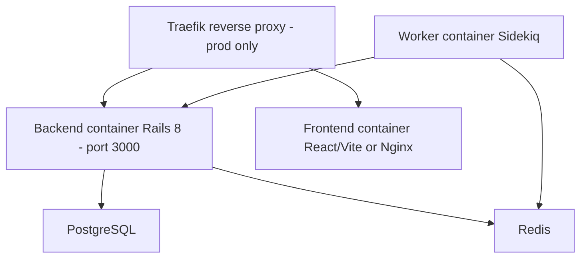
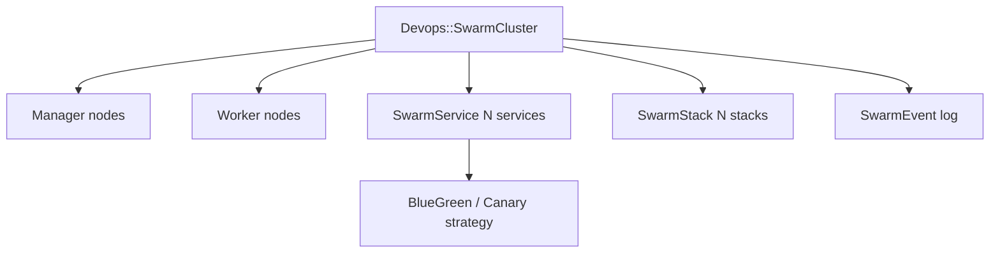

# DevOps Guide

> How to deploy, configure, and operate the Powernode platform — including the built-in CI/CD subsystem and Docker/Swarm orchestration.

> Status: active

## Table of Contents

- [What this guide covers](#what-this-guide-covers)
- [Prerequisites](#prerequisites)
- [Service topology](#service-topology)
- [Configuration management](#configuration-management)
- [Multi-instance services](#multi-instance-services)
- [Secrets](#secrets)
- [Docker deployment](#docker-deployment)
- [Health checks](#health-checks)
- [The built-in CI/CD subsystem](#the-built-in-cicd-subsystem)
- [Pipeline architecture](#pipeline-architecture)
- [Git provider integration](#git-provider-integration)
- [Container orchestration](#container-orchestration)
- [Docker Swarm](#docker-swarm)
- [Deployment strategies](#deployment-strategies)
- [Database operations](#database-operations)
- [Observability](#observability)
- [Related guides](#related-guides)
- [Materials previously at](#materials-previously-at)

## What this guide covers

This is the operator's guide for running Powernode in development and production. It covers systemd-managed service deployment, Docker / Docker Compose, Swarm orchestration, the built-in CI/CD subsystem (Pipelines, Container Instances, Git providers, Runners), secrets management, and the operational health surfaces.

The platform's distinguishing feature in this space is its **integrated DevOps subsystem** — pipelines, container instances, runners, deployment strategies, and git provider abstractions all live as first-class platform models, not external tools.

## Prerequisites

- Linux host (Ubuntu 24.04 or similar), root access for systemd
- Docker 24+, optionally Docker Swarm initialized
- PostgreSQL with pgvector
- Redis 7+
- Familiarity with the platform's [architecture](../concepts/architecture.md) and [backend](backend.md) conventions

## Service topology

The platform runs as a `powernode.target` systemd unit composing per-service templated units:

```mermaid
flowchart TB
    Target[powernode.target]
    Backend[powernode-backend@default Rails API :3000]
    Worker[powernode-worker@default Sidekiq]
    WorkerWeb[powernode-worker-web@default Sidekiq Web :4567]
    Frontend[powernode-frontend@default Vite/Nginx :3001]
    Postgres[(PostgreSQL)]
    Redis[(Redis)]

    Target --> Backend
    Target --> Worker
    Target --> WorkerWeb
    Target --> Frontend
    Backend --> Postgres
    Backend --> Redis
    Worker --> Backend
    Worker --> Redis
    Frontend --> Backend
```

### Service operations reference

| Service | Unit name | Port | Restart behavior |
|---|---|---|---|
| Rails API | `powernode-backend@default` | 3000 | SIGUSR2 reload (~30ms) via `scripts/reload-backend.sh` |
| Sidekiq worker | `powernode-worker@default` | — | Full restart (~28s drain). Wait 30s before checking status |
| Sidekiq Web | `powernode-worker-web@default` | 4567 | Restart THIS service if port 4567 refuses connections |
| Frontend | `powernode-frontend@default` | 3001 | Full restart |

```bash
# Initial install
sudo scripts/systemd/powernode-installer.sh install

# Start / stop the full stack
sudo systemctl start powernode.target
sudo systemctl stop  powernode.target

# Individual service control
sudo systemctl restart powernode-backend@default
sudo systemctl status  powernode-worker@default

# Show all services at once
sudo scripts/systemd/powernode-installer.sh status

# Tail logs
journalctl -u powernode-backend@default -f
```

**Never** start the platform with `rails server`, `sidekiq`, or `npm start` directly — those bypass systemd, the per-instance config files, and the supervised restart semantics.

### Worker restart gotchas

- Wait 30s after worker restart before checking status — "deactivating" during drain is normal.
- If worker is draining >30s, use `sudo systemctl stop ...@default && sudo systemctl start ...@default` (separate stop + start, not restart).
- Never restart the worker multiple times in quick succession. Batch code changes, ONE restart at end.

## Configuration management

### Configuration hierarchy

```
/etc/powernode/
├── powernode.conf                 # Global settings (paths, Ruby/Node versions)
├── backend-default.conf           # Backend instance "default"
├── backend-api2.conf              # Backend instance "api2" (if added)
├── worker-default.conf            # Worker instance "default"
├── worker-ai-heavy.conf           # High-concurrency AI worker (if added)
├── worker-web-default.conf        # Sidekiq Web dashboard
└── frontend-default.conf          # Frontend instance "default"
```

The systemd templated units read `<service>-<instance>.conf` to populate environment variables for that instance.

### Backend environment variables

| Variable | Default | Description |
|---|---|---|
| `RAILS_ENV` | `development` | Rails environment |
| `PORT` | `3000` | Server port |
| `DATABASE_URL` | (from database.yml) | PostgreSQL connection string |
| `REDIS_URL` | `redis://localhost:6379/0` | Redis (cache + ActionCable) |
| `SECRET_KEY_BASE` | (generated) | Rails secret |
| `JWT_SECRET_KEY` | (generated) | JWT signing key (the app reads `JWT_SECRET_KEY`, not `JWT_SECRET`) |
| `JWT_EXPIRATION` | `24` | JWT expiry (hours) |
| `CORS_ORIGINS` | `http://localhost:3001` | Comma-separated allowed origins |

### Worker environment variables

| Variable | Default | Description |
|---|---|---|
| `WORKER_ENV` | `development` | Worker environment |
| `REDIS_URL` | `redis://localhost:6379/1` | Redis (Sidekiq DB) |
| `WORKER_CONCURRENCY` | `5` | Sidekiq threads |
| `BACKEND_API_URL` | `http://localhost:3000` | Backend API URL |
| `WORKER_API_TOKEN` | (configured) | Service-to-service auth |

### Frontend environment variables

| Variable | Default | Description |
|---|---|---|
| `VITE_API_URL` | `http://localhost:3000` | Backend API URL |
| `VITE_WS_URL` | `ws://localhost:3000/cable` | ActionCable WebSocket URL |
| `PORT` | `3001` | Dev server port |

### Redis database allocation

| DB | Use |
|---|---|
| 0 | Rails cache, ActionCable |
| 1 | Sidekiq queues + job data |

### Key configuration files

| File | Purpose |
|---|---|
| `server/config/database.yml` | PostgreSQL connection config |
| `server/config/cable.yml` | ActionCable config |
| `server/config/puma.rb` | Puma web server config |
| `worker/config/sidekiq.yml` | Sidekiq queues and scheduling |
| `frontend/.env.development` | Frontend dev environment |
| `frontend/vite.config.ts` | Vite build configuration |

## Multi-instance services

Add additional service instances when you need horizontal scaling or workload isolation:

```bash
# Add a second backend on port 3002
sudo scripts/systemd/powernode-installer.sh add-instance backend api2
# Edit /etc/powernode/backend-api2.conf -> PORT=3002
sudo systemctl enable --now powernode-backend@api2

# Add a high-concurrency worker for AI workloads
sudo scripts/systemd/powernode-installer.sh add-instance worker ai-heavy
# Edit /etc/powernode/worker-ai-heavy.conf -> WORKER_CONCURRENCY=15
sudo systemctl enable --now powernode-worker@ai-heavy
```

Each instance is a fully independent systemd unit with its own log stream, restart policy, and environment.

## Secrets

### Development

- `server/config/credentials.yml.enc` — Rails encrypted credentials
- `.env.development` files — local overrides (gitignored)
- `test-credentials.json` — test users (gitignored, generated by `rails db:seed`)

### Production

```bash
# Set up production secrets
scripts/deployment/setup-secrets.sh

# Edit production credentials
EDITOR=vim rails credentials:edit --environment production
```

### Credential rotation

- JWT secrets rotate with a 24-hour grace period
- Worker API tokens live in `/etc/powernode/worker-*.conf`
- AI provider keys are encrypted in the database via `Security::CredentialEncryptionService`
- Provider-level credentials can also be stored in Vault via `VaultCredential` concern — see [security guide](security.md)

### Hard rules

- **Never** output, log, or echo private keys, API secrets, or signing material in any form.
- **Never** generate private keys via CLI commands where they could appear in shell history (`rails runner`, `irb`, `rake`).
- **Vault-only key storage** — keys originate inside Vault or `WalletKeyService` (which writes to Vault).
- **Audit all key operations** — every generate/import/revoke/sign goes to `Trading::AuditLog`.

## Docker deployment



### Dockerfiles

| Service | Production | Development |
|---|---|---|
| Backend | `server/Dockerfile` | `server/Dockerfile.dev` |
| Frontend | `frontend/Dockerfile` | `frontend/Dockerfile.dev` |
| Worker | `worker/Dockerfile` | `worker/Dockerfile.dev` |

All production Dockerfiles are multi-stage for minimal final image size. The worker image additionally bundles `ffmpeg` and `imagemagick` for media processing.

### Compose files

| File | Purpose |
|---|---|
| `docker/docker-compose.yml` | Local development with bind-mounted source for live reload |
| `docker/docker-compose.prod.yml` | Production with Traefik + health checks + resource limits |
| `docker/docker-compose.mcp.yml` | MCP server development |

```bash
# Dev
cd docker && docker compose up -d

# Production
cd docker && docker compose -f docker-compose.prod.yml up -d
```

Production compose includes:

- Traefik reverse proxy with automatic SSL/TLS via ACME
- Health checks on all services
- Resource limits (CPU + memory)
- Log rotation

### Build scripts

```bash
# Build all images
./scripts/docker/powernode-build.sh

# Deploy via compose
./scripts/docker/powernode-deploy.sh

# Package images for distribution
./scripts/docker/powernode-package.sh
```

### Docker build policy

ALWAYS use CI/CD pipelines (Gitea Actions) for building production Docker images. Never build manually for production. The Gitea runner has Docker socket access and pushes to the container registry via `.gitea/workflows/docker-build.yml`.

## Health checks

| Endpoint | Description |
|---|---|
| `/up` | Root-level basic liveness (`rails/health#show` — 200 if the app boots) |
| `/api/v1/health` | Basic check (200 if process up) |
| `/api/v1/health/detailed` | Subsystem status (DB, Redis, providers) |
| `/api/v1/health/ready` | Readiness probe (Kubernetes/Swarm) |
| `/api/v1/health/live` | Liveness probe |

Health checks verify database connectivity, Redis connectivity, memory usage, and disk space.

## The built-in CI/CD subsystem

Unlike traditional setups that depend on external CI/CD tools, Powernode includes an **integrated DevOps platform** as a first-class subsystem. Pipelines, container instances, git provider integrations, runners, and deployment strategies are all platform models under the `Devops::` namespace. See [`docs/reference/auto/`](../reference/auto/) for the live model inventory.

| Capability | Components |
|---|---|
| CI/CD pipelines | Multi-step pipelines, AI-powered steps, approval gates, scheduling |
| Container orchestration | Docker host management, container templates, resource quotas |
| Docker Swarm | Cluster, service, stack, and deployment management |
| Git integration | GitHub, GitLab, Gitea, Bitbucket with webhooks and managed runners |
| Integration framework | Template marketplace for CI/CD, monitoring, notifications |

## Pipeline architecture

### Pipeline model

`Devops::Pipeline` defines CI/CD workflows.

| Attribute | Purpose |
|---|---|
| `pipeline_type` | `review`, `implement`, `security`, `deploy`, `custom` |
| `triggers` | JSON configuration for event-based triggering |
| `is_system` | System pipelines are immutable |
| `allow_concurrent` | Whether multiple runs can execute simultaneously |
| `timeout_minutes` | Max 360 |
| `runner_labels` | Target runner selection |

**Trigger types:**

- `pull_request` — PR opened/closed/synchronized
- `push` — Branch push with glob pattern matching
- `issue` / `issue_comment` — Issue lifecycle
- `release` — Release creation/publication
- `schedule` — Cron-based
- `manual` / `workflow_dispatch` — User-initiated

### Pipeline steps

`Devops::PipelineStep` records execute sequentially in a run. Each step has a type, position, inputs, outputs, and conditional execution.

| Step type | Purpose |
|---|---|
| `checkout` | Clone/checkout repository |
| `claude_execute` | AI-powered step using prompt templates |
| `post_comment` | Post comment to PR/issue |
| `create_pr` | Create a pull request |
| `create_branch` | Create a branch |
| `upload_artifact` / `download_artifact` | Artifact management |
| `run_tests` | Execute test suites |
| `deploy` | Deployment step |
| `notify` | Send notifications |
| `code_factory_gate` | Code Factory approval gate |
| `custom` | Custom handler |

**Expression references:** Steps reference previous outputs with `${{ steps.previous.outputs.result }}`.

**Approval gates:** Steps can require approval via `requires_approval` with configurable timeout, recipients, and comment requirements.

### Pipeline runs

`Devops::PipelineRun` records track status (`pending` → `queued` → `running` → `success`/`failure`/`cancelled`), timing, and outputs. Runs broadcast real-time updates via the `DevopsPipelineChannel` ActionCable channel.

### Pipeline templates

`Devops::PipelineTemplate` provides reusable pipeline definitions for the marketplace, with versioning, ratings, install counts, and category/difficulty metadata. Templates publish through `draft → published → archived` states.

## Git provider integration

### API-driven architecture

The worker NEVER executes Docker operations directly, SSHs into servers, or performs direct filesystem operations on remote hosts. It orchestrates exclusively through git provider APIs:

- Triggers workflows
- Updates commit statuses
- Creates pull requests and comments
- Calls deployment webhooks and APIs

### Provider abstraction

```ruby
# Same interface across providers
provider = Devops::GitProviders::ProviderFactory.from_record(git_provider)
git_ops  = Devops::GitOperationsService.new(provider_config: config)

git_ops.update_status(repo: 'org/repo', sha: 'abc123', state: 'success',
                      context: 'ci/powernode', description: 'All checks passed')

git_ops.create_pull_request(repo: 'org/repo',
                            title: 'feat: add foo',
                            head: 'feature/foo', base: 'main',
                            body: '## Summary\n\nThis PR adds ...')

git_ops.upsert_comment(repo: 'org/repo', number: 42,
                       body: 'Build status: passed',
                       marker: 'powernode-ci-status')

git_ops.trigger_workflow(repo: 'org/repo', workflow: 'deploy.yml',
                         ref: 'main', inputs: { environment: 'production' })
```

### Webhook normalization

```ruby
normalizer = Devops::GitProviders::WebhookNormalizer.new
payload = normalizer.normalize(raw_payload, headers)
# => { provider: :gitea, event_type: :push, repository: 'org/repo', ref: 'refs/heads/main', ... }
```

The normalizer flattens GitHub, GitLab, Gitea, and Bitbucket payloads into a single shape so downstream pipeline trigger logic doesn't branch on provider.

### Provider capabilities

| Provider | Capabilities |
|---|---|
| GitHub | repos, branches, commits, pull_requests, issues, webhooks, devops |
| GitLab | repos, branches, commits, merge_requests, issues, webhooks, devops |
| Gitea | repos, branches, commits, pull_requests, issues, webhooks, devops, act_runner |
| Bitbucket | repos, branches, commits, pull_requests, issues, webhooks, pipelines |

### Repositories

`Devops::GitRepository` records synced repositories with branch filter types (`none`, `exact`, `wildcard`, `regex`), webhook configuration, language detection, topic tracking, and pipeline statistics.

### Runners

`Devops::GitRunner` records managed CI/CD runners with health monitoring. Runners self-register via tokens issued from the platform; the runner heartbeat and capability advertisement let the dispatcher pick targets via `runner_labels`.

## Container orchestration

### Container instances

`Devops::ContainerInstance` tracks individual container executions with full lifecycle management.

**Statuses:** `pending` → `provisioning` → `running` → `completed`/`failed`/`cancelled`/`timeout`

**Features:**

- Vault token integration for secrets
- A2A task linking (container results update linked AI tasks)
- Resource tracking (CPU, memory, storage, network)
- Security violation recording
- Log streaming with 100KB truncation
- Artifact collection

### Container templates

`Devops::ContainerTemplate` provides reusable container configurations (image, resources, environment, security settings).

### Resource quotas

`Devops::ResourceQuota` enforces per-account resource limits.

### Docker hosts

`Devops::DockerHost` records managed Docker daemon endpoints with TLS support and auto-sync.

| State | Meaning |
|---|---|
| `pending` | Newly created, not yet contacted |
| `connected` | Healthy |
| `disconnected` | Heartbeat lost |
| `error` | Auto-set after 5 consecutive failures |
| `maintenance` | Operator-paused |

Each host tracks Docker version, OS, architecture, kernel, memory, CPU, and storage. Container, image, event, and activity collections are scoped per host.

The Docker service layer lives in `server/app/services/devops/docker/`: `ApiClient`, `ContainerManager`, `HostManager`, `ImageManager`, `NetworkManager`, `VolumeManager`, `HealthMonitor`, `RegistryService`, `SecretManager`, `ServiceManager`, `StackManager`, `SwarmManager`, `NodeManager`.

## Docker Swarm



`Devops::SwarmCluster` manages Docker Swarm cluster endpoints with TLS-encrypted API communication, environment tagging (staging/production/development), auto-sync, and health monitoring.

| Resource | Purpose |
|---|---|
| `SwarmNode` | Individual node in a cluster |
| `SwarmService` | Service with scaling configuration |
| `SwarmStack` | Compose-based stack deployment |
| `SwarmDeployment` | Deployment tracking per service |
| `SwarmEvent` | Cluster and service event log |

The full set of operator MCP tools for Docker / Swarm management is in [`docs/reference/auto/mcp-tools.md`](../reference/auto/mcp-tools.md) (search for `docker_`).

## Deployment strategies

Services in `server/app/services/devops/deployment_strategies/`:

### Workflow trigger (default)

```yaml
- type: deploy
  config:
    strategy: workflow
    workflow: deploy.yml
    environment: production
    inputs:
      target: production-cluster
```

### Webhook

```yaml
- type: deploy
  config:
    strategy: webhook
    webhook_url: https://deploy.example.com/trigger
    webhook_secret: ${DEPLOY_SECRET}
    environment: staging
```

### API

```yaml
- type: deploy
  config:
    strategy: api
    api_url: https://api.example.com/deployments
    api_token: ${DEPLOY_TOKEN}
    environment: production
```

### Command (legacy)

```yaml
- type: deploy
  config:
    strategy: command
    command: ./scripts/deploy.sh production
    timeout_minutes: 15
```

### Blue/green and canary

`BlueGreenStrategy` performs zero-downtime swap by deploying to the inactive color, smoke-testing, then flipping the router. `CanaryStrategy` performs gradual rollout with metric gates between percentage tiers (1% → 10% → 50% → 100%).

## Database operations

| Operation | Command |
|---|---|
| Create + migrate + seed | `cd server && rails db:create db:migrate db:seed` |
| Run migrations | `rails db:migrate` |
| Migration status | `rails db:migrate:status` |
| Rollback | `rails db:rollback STEP=1` |
| Reset (drop + create + migrate + seed) | `rails db:reset` |
| Schema dump | `rails db:schema:dump` |

After a database reset that recreates the system worker, update `worker/.env` with the new token.

For backup, recovery, and migration runbooks, see [`docs/operations/production-deployment.md`](../operations/production-deployment.md).

## Observability

### Logs

- All services log to journalctl: `journalctl -u powernode-backend@default -f`
- Application logs are structured JSON with request_id, user_id, and account_id tags
- Sentry captures unhandled exceptions (set `SENTRY_DSN` to enable)

### Metrics

- Sidekiq Web UI at `:4567` (auth via platform JWT access token or email+password — `SidekiqWebAuth` middleware, validated against the backend session API; the port is `SIDEKIQ_WEB_PORT`, default 4567)

> **Status: not yet implemented** — the Prometheus exporter is force-disabled in `server/config/initializers/metrics.rb` (`if Rails.env.test? || true`) and there is no root-level `/metrics` route, so no Prometheus metrics are exported today. Planned: a `/metrics` Prometheus surface served by a separate `prometheus_exporter` process once the `|| true` disable is removed.

> **Status: not yet implemented** — Skylight APM (`SKYLIGHT_AUTHENTICATION` env var) is not wired: the `skylight` gem is loaded `require: false` with no initializer or `skylight.yml`. Planned as an optional APM integration. (Sentry, by contrast, is wired via `SENTRY_DSN`.)

### Alerting

The platform has built-in alert delivery via the notifications subsystem. Configure intervention policies for autonomy operations and integration health checks for external services. See [`docs/guides/notifications.md`](notifications.md).

## Related guides

- [Backend](backend.md) — the API the worker drives via HTTP
- [Security](security.md) — secrets, supply chain, signing
- [Extensions](extensions.md) — extension-specific deployment considerations
- [`docs/operations/production-deployment.md`](../operations/production-deployment.md) — production runbook
- [`docs/operations/docker-swarm.md`](../operations/docker-swarm.md) — Swarm operator guide
- [`docs/reference/scripts.md`](../reference/scripts.md) — script inventory
- [`docs/reference/auto/mcp-tools.md`](../reference/auto/mcp-tools.md) — live Docker / Swarm MCP tool catalog

## Materials previously at

This guide consolidates content from these legacy paths (preserved in git history for one release cycle):

- `docs/infrastructure/DEVOPS_ENGINEER_SPECIALIST.md`
- `docs/infrastructure/DOCKER_DEPLOYMENT.md`
- `docs/infrastructure/CONFIGURATION_MANAGEMENT.md`
- `docs/platform/DEVOPS_PLATFORM_GUIDE.md`
- `docs/worker/CI_CD_ARCHITECTURE.md`

_Last verified: 2026-06-04_
