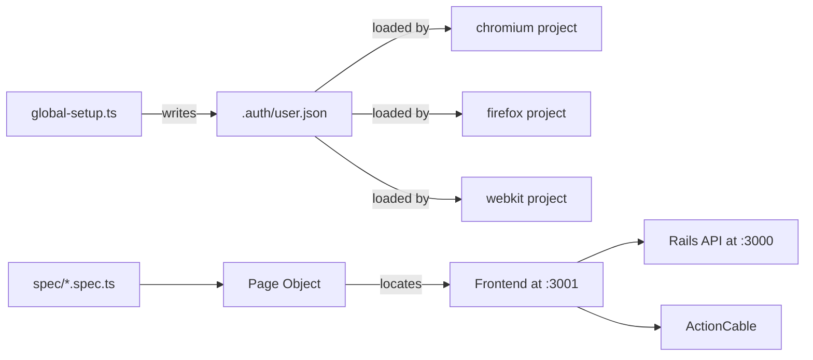

# End-to-End Testing Guide

> Status: active

> How to write and run Playwright browser tests against the Powernode platform.

## Table of Contents

- [What this guide covers](#what-this-guide-covers)
- [Prerequisites](#prerequisites)
- [Directory layout](#directory-layout)
- [Quick start](#quick-start)
- [Running tests](#running-tests)
- [Authentication strategy](#authentication-strategy)
- [Writing tests](#writing-tests)
- [Page objects](#page-objects)
- [Selector strategy](#selector-strategy)
- [Test data and fixtures](#test-data-and-fixtures)
- [Debugging](#debugging)
- [CI integration](#ci-integration)
- [Best practices](#best-practices)
- [Troubleshooting](#troubleshooting)
- [Related guides](#related-guides)
- [Materials previously at](#materials-previously-at)

## What this guide covers

End-to-end browser tests exercise the full stack — Rails API, Sidekiq worker, React frontend, ActionCable WebSockets, and real AI providers — in a headless or headed browser. Playwright is the supported framework; older Cypress specs remain in `frontend/cypress/` for reference only during migration.

This guide is for engineers writing or running cross-browser E2E coverage of platform features. It expects you already understand the platform's [backend](backend.md), [frontend](frontend.md), and [testing](testing.md) conventions.

## Prerequisites

- Working local environment: `sudo systemctl start powernode.target`
- Playwright browsers installed: `npx playwright install`
- Test credentials in `test-credentials.json` (created by `cd server && rails db:seed`)
- Optionally: `TEST_USER_EMAIL` and `TEST_USER_PASSWORD` environment variables for custom credentials

## Directory layout

```
e2e/
├── fixtures/
│   ├── auth.ts                        # Authentication helpers
│   ├── assertions.ts                  # Shared assertion helpers
│   └── test-data.ts                   # Test data constants and uniqueness helpers
├── pages/                             # Page Object Models, organized by feature domain
│   ├── auth/                          # login.page.ts, register.page.ts
│   ├── account/                       # profile, team, billing
│   ├── admin/                         # users, roles, settings
│   ├── ai/                            # providers, agents, conversations, agent-teams, monitoring, ...
│   ├── devops/                        # pipelines, repositories, runners, containers, ...
│   ├── system/                        # health, modules, audit-logs
│   ├── business/                      # plans, customers, analytics (business extension)
│   ├── supply-chain/                  # dashboard (supply-chain extension)
│   └── dashboard.page.ts
├── ai/                                # AI test specs (providers, agents, conversations, ...)
├── devops/, system/, account/, ...    # spec dirs mirror the page-object domains
├── global-setup.ts                    # Auth state setup (writes e2e/.auth/user.json)
└── .auth/                             # Cached auth state (gitignored)
```

Page objects are grouped by feature domain under `e2e/pages/<domain>/`, and the spec directories mirror those domains. The full set tracks the app's feature surface — list the current layout with `find e2e/pages -name '*.page.ts'`.



## Quick start

```bash
# 1. Install browsers (one-time)
npx playwright install

# 2. Start services
sudo systemctl start powernode.target

# 3. Run all tests
npm run test:e2e

# 4. Run with UI (interactive mode)
npm run test:e2e:ui

# 5. View HTML report
npm run test:e2e:report
```

## Running tests

```bash
# All specs
npm run test:e2e

# Single file
npm run test:e2e -- e2e/ai/providers.spec.ts

# Filter by name pattern
npm run test:e2e -- --grep "providers"

# Per-browser
npm run test:e2e:chromium
npm run test:e2e:firefox
npm run test:e2e:webkit

# Headed (visible browser)
npm run test:e2e:headed

# Step-debugger
npm run test:e2e:debug
```

## Authentication strategy

To avoid logging in for every test:

1. `global-setup.ts` runs once at the start of the suite, logs in as the test user, and writes the storage state to `e2e/.auth/user.json`.
2. Every browser project loads this storage state before running specs, so each spec starts authenticated.

To force a re-login (after a password change or schema reset):

```bash
rm -rf e2e/.auth/
npm run test:e2e
```

The `setup` project must always be listed as a dependency of the browser projects in `playwright.config.ts`.

## Writing tests

### Basic pattern

```typescript
import { test, expect } from '@playwright/test';
import { ProvidersPage } from '../pages/ai/providers.page';

test.describe('AI Providers', () => {
  let providersPage: ProvidersPage;

  test.beforeEach(async ({ page }) => {
    // Suppress unhandled page errors — they don't fail the test but they're noisy
    page.on('pageerror', () => {});

    providersPage = new ProvidersPage(page);
    await providersPage.goto();
    await providersPage.waitForReady();
  });

  test('tests provider connection', async () => {
    await providersPage.testConnection('Ollama');
    await providersPage.verifyConnectionSuccess();
  });
});
```

### Using fixtures

```typescript
import { TEST_AGENT, uniqueTestData } from '../fixtures/test-data';

test('creates an agent', async () => {
  const testAgent = uniqueTestData(TEST_AGENT);  // appends unique suffix to name
  await agentsPage.createAgent(testAgent);
  await agentsPage.verifyAgentExists(testAgent.name);
});
```

Available fixtures in `e2e/fixtures/test-data.ts`:

| Constant | Purpose |
|---|---|
| `TEST_PROVIDER` | Provider creation payload |
| `TEST_AGENT` | Agent creation payload |
| `TEST_CONVERSATION` | Conversation seed data |
| `TEST_AGENT_TEAM` | Team composition |
| `TEST_CONTEXT` | Context/memory entries |
| `ROUTES` | Frontend route map |
| `API_ENDPOINTS` | API endpoint map |
| `uniqueTestData(template)` | Returns template with unique-suffix name to avoid test collisions |

## Page objects

Page objects encapsulate page interactions so specs stay declarative and brittle selectors live in one place.

```typescript
// e2e/pages/ai/agents.page.ts
import { Page, expect } from '@playwright/test';

export class AgentsPage {
  constructor(private page: Page) {}

  async goto() {
    await this.page.goto('/app/ai/agents');
  }

  async waitForReady() {
    await this.page.waitForLoadState('networkidle');
  }

  async createAgent(data: AgentTestData) {
    await this.page.getByRole('button', { name: /new agent/i }).click();
    await this.page.getByLabel('Name').fill(data.name);
    await this.page.getByLabel('Description').fill(data.description);
    await this.page.getByLabel('Provider').selectOption(data.providerId);
    await this.page.getByRole('button', { name: /create/i }).click();
  }

  async verifyAgentExists(name: string) {
    await expect(this.page.getByText(name)).toBeVisible();
  }
}
```

**Rules:**

- One page object per route.
- No assertions inside page methods (except verifiers like `verifyAgentExists`).
- All hard-coded selectors live in the page object — specs never reach raw locators.
- Page methods return primitives or void, never `Locator` objects.

## Selector strategy

Prefer the most stable selector available, in this order:

1. **Role + accessible name** — `getByRole('button', { name: /save/i })`. Most stable, exercises a11y.
2. **Label** — `getByLabel('Email')`. Good for form fields.
3. **Test ID** — `getByTestId('widget-card')`. Add `data-testid` to new components when the above don't work.
4. **Class fragment** — `page.locator('[class*="card"]')`. Avoid; tied to CSS implementation.
5. **Raw text** — `getByText('Save')`. Only when nothing else fits.

Add `data-testid` attributes to new components proactively. They cost nothing in production bundles (Vite strips them in production by default) and they make E2E tests resilient to copy or styling changes.

### Handling optional elements

```typescript
const editButton = page.getByRole('button', { name: /edit/i });
if (await editButton.count() > 0) {
  await editButton.click();
}
```

Don't fail a test because an optional UI element wasn't present — guard with `count()` first.

## Test data and fixtures

### Unique test data

Every spec that creates resources MUST use `uniqueTestData()` so tests don't collide when running in parallel:

```typescript
const agent = uniqueTestData(TEST_AGENT);  // { name: 'Test Agent 1736887234123', ... }
```

### Cleanup

By default, fixtures don't clean up after themselves — the test database is recreated per suite. If a spec needs to verify deletion semantics, it should explicitly delete the resource and assert the result.

### Real AI execution

AI specs hit a real provider (Ollama or remote). Set the provider URL via environment variables or `test-credentials.json`. Allow longer timeouts (60s+) for model inference:

```typescript
await page.waitForSelector('[data-testid="agent-response"]', { timeout: 60_000 });
```

## Debugging

### Step debugger

```bash
npm run test:e2e:debug
```

Opens Playwright Inspector with breakpoint support and step-through DOM inspection.

### Traces

For failed tests, traces are saved to `test-results/`:

```bash
npx playwright show-trace test-results/path/to/trace.zip
```

The trace viewer shows DOM, network, console, screenshots, and per-step timing.

### Screenshots and videos

Configured via `playwright.config.ts`:

```typescript
use: {
  trace: 'on-first-retry',
  screenshot: 'only-on-failure',
  video: 'on-first-retry',
}
```

### VS Code extension

Install "Playwright Test for VS Code" for:

- Run/debug tests inline in the editor
- Set breakpoints with full source maps
- View traces without leaving the IDE

## CI integration

Sample workflow step (works with Gitea Actions and GitHub Actions):

```yaml
- name: Install Playwright
  run: npx playwright install --with-deps

- name: Run E2E Tests
  run: npm run test:e2e
  env:
    CI: 'true'

- name: Upload Report
  uses: actions/upload-artifact@v4
  if: always()
  with:
    name: playwright-report
    path: playwright-report/
    retention-days: 14
```

CI mode automatically:

- Enables 2 retries per failing test
- Drops to 1 worker (parallel can mask race conditions)
- Captures trace on first retry
- Outputs HTML report to `playwright-report/`

## Best practices

### Wait for state, not time

```typescript
// GOOD
await page.waitForSelector('[data-testid="response"]');

// BAD
await page.waitForTimeout(2000);
```

Timeouts that pass occasionally fail intermittently. Always wait for a concrete condition (selector, network idle, response).

### Respect long timeouts for AI

AI operations are slow. Don't set a 5-second timeout on an LLM response — set 60 seconds:

```typescript
await page.waitForSelector('[data-testid="agent-response"]', { timeout: 60_000 });
```

### Suppress noisy page errors

```typescript
test.beforeEach(async ({ page }) => {
  page.on('pageerror', () => {});  // don't fail the test on unrelated errors
});
```

### Guard optional UI

```typescript
const empty = await page.locator(':text("No agents")').count() > 0;
const list  = await page.locator('[data-testid="agent-card"]').count() > 0;
expect(empty || list).toBe(true);
```

### Use page objects

If you find yourself writing the same `page.locator(...)` twice, lift it into a page object method.

### Cross-browser parity

Run the full suite across Chromium, Firefox, and WebKit at least weekly. WebKit catches Safari-specific issues that other browsers miss.

## Troubleshooting

### Tests fail only on CI

- Increase per-test timeout (`test.setTimeout(60_000)`)
- Set `workers: 1` to eliminate parallel race conditions
- Verify the API and frontend services finish booting before tests start — the `webServer` block in `playwright.config.ts` polls the Rails health endpoint (`http://localhost:3000/up`) and the frontend before the suite runs

### Authentication fails

- Delete `e2e/.auth/` and re-run
- Verify `test-credentials.json` has the expected user (re-run `rails db:seed` if it doesn't)
- Check the login page object's selectors haven't drifted

### Flaky tests

- Replace `waitForTimeout` with `waitForSelector` or `waitForLoadState('networkidle')`
- Add explicit waits before assertions that depend on async UI updates
- Check for unhandled promise rejections in spec code

### Browser install issues

```bash
# Reinstall all
npx playwright install --force

# Only one browser
npx playwright install chromium
```

## Related guides

- [Testing](testing.md) — unit/integration testing (RSpec, Jest)
- [Frontend](frontend.md) — patterns the E2E tests exercise
- [Backend](backend.md) — API contracts the E2E tests assume

## Materials previously at

This guide consolidates content from:

- `docs/testing/PLAYWRIGHT_E2E_TESTING.md`

_Last verified: 2026-06-03_
