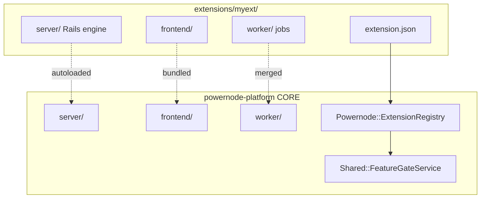
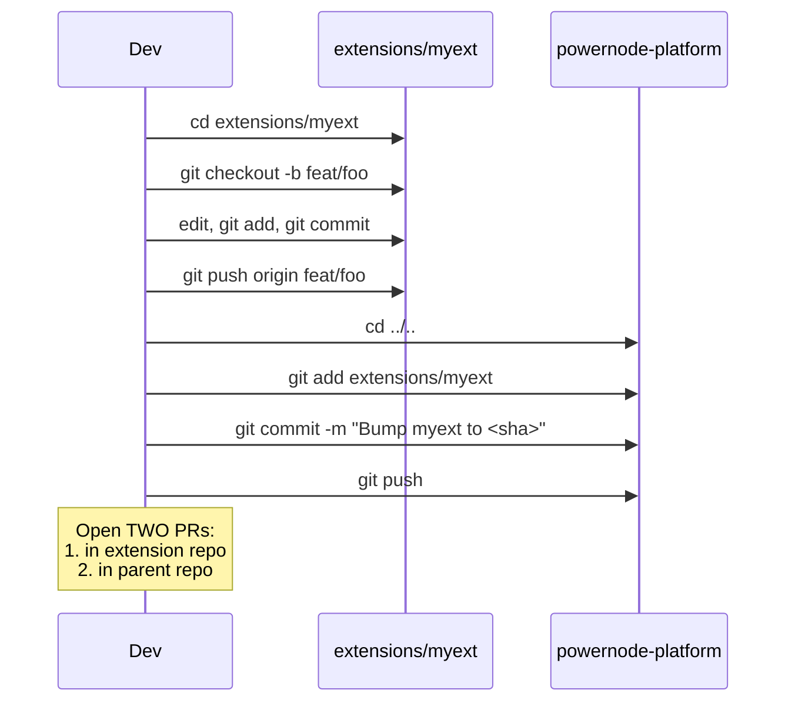

# Writing a Powernode Extension

> Status: active

> How to scaffold, register, and ship a new extension that plugs into the core platform.

## Table of Contents

- [What this guide covers](#what-this-guide-covers)
- [Prerequisites](#prerequisites)
- [What an extension is](#what-an-extension-is)
- [The extension layout](#the-extension-layout)
- [Manifest and feature flags](#manifest-and-feature-flags)
- [Core mode vs. extension mode](#core-mode-vs-extension-mode)
- [Backend integration](#backend-integration)
- [Frontend integration](#frontend-integration)
- [Worker integration](#worker-integration)
- [Submodule mechanics](#submodule-mechanics)
- [Built-in extensions](#built-in-extensions)
- [Billing and payment specialists](#billing-and-payment-specialists)
- [BaaS API surface](#baas-api-surface)
- [Related guides](#related-guides)
- [Materials previously at](#materials-previously-at)

## What this guide covers

Powernode's core platform stays small. Domain functionality — fleet ops, marketing automation, supply chain, billing, trading — lives in **extensions**: self-contained submodules that mount into the core Rails app, frontend, and worker. This guide is for **extension authors**: developers building a new vertical on top of the platform.

You will learn the manifest contract, the feature-gate predicate, the directory layout extensions follow, the submodule workflow, and the gotchas that bite first-timers.

## Prerequisites

- You have a working core platform per [`docs/getting-started/01-quickstart.md`](../getting-started/01-quickstart.md)
- You have read [`docs/guides/backend.md`](backend.md) and [`docs/guides/frontend.md`](frontend.md) — extensions follow the same conventions
- You have an upstream git repo (Gitea private, GitHub mirror for OSS extensions)

## What an extension is

An extension is a separate git repository, mounted into `powernode-platform` as a submodule under `extensions/<slug>/`. It can contribute any combination of:

- A Rails engine (`server/`) that adds models, controllers, services, and migrations
- A frontend bundle (`frontend/`) that adds pages, components, and nav entries
- Worker jobs (`worker/`) executed by the shared Sidekiq process



The core platform stays runnable with **zero extensions loaded** — that's "core mode." Extensions are opt-in.

## The extension layout

```
extensions/<slug>/
├── extension.json                      <- manifest (required)
├── README.md
├── CONTRIBUTING.md
├── server/
│   ├── lib/powernode_<slug>/
│   │   └── engine.rb                   <- Rails engine
│   ├── app/{models,controllers,services,channels}/
│   ├── config/
│   │   └── routes.rb
│   └── db/
│       ├── migrate/
│       └── seeds/<slug>_seed.rb
├── frontend/
│   ├── src/
│   │   ├── components/
│   │   ├── pages/
│   │   ├── features/
│   │   └── index.ts                    <- mount point
│   ├── tsconfig.json
│   └── package.json                    <- optional
└── worker/
    └── app/jobs/<slug>/
```

The `server/`, `frontend/`, and `worker/` subtrees mirror the core platform's layout — same directory names, same conventions. The Rails autoloader, the frontend build, and Sidekiq each discover their extension contributions automatically (within the constraints of the manifest).

## Manifest and feature flags

Every extension MUST have an `extension.json` at its root:

```json
{
  "name": "Marketing",
  "slug": "marketing",
  "version": "0.1.0",
  "description": "Marketing campaigns, content calendar, email lists, social media, campaign analytics.",
  "author": "Your Name",
  "homepage": "https://example.com",
  "feature_flag": "marketing_mode",
  "capabilities": ["campaigns", "content_calendar", "email_lists"],
  "components": {
    "server": true,
    "frontend": true,
    "worker": true
  },
  "dependencies": []
}
```

| Field | Purpose |
|---|---|
| `slug` | Filesystem name; used as namespace prefix (`marketing` → `Marketing::Campaign`) |
| `feature_flag` | Optional, informational only. `Shared::FeatureGateService` always derives the Flipper flag as `<slug>_mode` regardless of this field, so it can be omitted (the shipped `marketing` manifest does; the `system` manifest sets `system_mode` for documentation). Used for runtime enable/disable without restart |
| `capabilities` | Optional list of feature strings the extension provides; used by `Shared::FeatureGateService.available?` |
| `components` | Which subtrees the extension contributes (drop the key if you ship none of that layer) |
| `dependencies` | Other extension slugs required to be loaded first |

### Three gates govern whether an extension is active

```mermaid
flowchart LR
    A[Manifest on disk?] -->|no| Off1[OFF]
    A -->|yes| B[Listed in<br/>extensions_state.json<br/>disabled[]?]
    B -->|yes| Off2[OFF - load-time gate]
    B -->|no| C[Flipper flag<br/>slug_mode enabled?]
    C -->|no| Off3[OFF - runtime gate]
    C -->|yes| On[ON]
```

`config/extensions_state.json` is the **load-time** gate (requires a restart to flip). The Flipper flag is the **runtime** gate (no restart). The manifest presence is the **install** gate.

`Shared::FeatureGateService` exposes the predicates:

```ruby
Shared::FeatureGateService.extension_loaded?('marketing')   # autoloaded into this process
Shared::FeatureGateService.extension_enabled?('marketing')  # loaded + state + flag
Shared::FeatureGateService.available?('campaigns', account: acct)  # capability available
Shared::FeatureGateService.business_loaded?                 # specific predicate for business
Shared::FeatureGateService.core_mode?                       # zero extensions loaded
```

Frontend gating uses the build-time `__EXTENSIONS__` array (the list of active slugs) injected at bundle time; nav entries are gated by `__EXTENSIONS__.includes('<slug>')`.

## Core mode vs. extension mode

| Mode | Description | Use case |
|---|---|---|
| **Core mode** | Zero extensions loaded; single-user self-hosted | Solo developer running the platform locally; OSS deployment without commercial features |
| **Extension mode** | One or more extensions loaded | Hosted SaaS, multi-tenant, billing-enabled, fleet-managed |

Core mode is the **OSS default**. Every feature in the core repo MUST work in core mode (no billing surface, no multi-tenancy). Features that require an extension MUST fail open in core mode — return `nil`, return an empty collection, return "feature unavailable" gracefully — never raise.

A typical guard:

```ruby
class Api::V1::AdvancedReportsController < ApplicationController
  before_action :require_business_loaded

  private

  def require_business_loaded
    return if Shared::FeatureGateService.business_loaded?
    render_error('Advanced reporting requires the business extension', status: :not_found)
  end
end
```

## Dependency loading (public-only lockfile)

Extensions are Ruby path gems: `server/Gemfile` discovers each `extensions/<slug>/server` and declares `powernode_<slug>` (see `extensions_loader_helper.rb`). Discovery is **visibility-aware** — public extensions (those listed in `.gitmodules`) are always declared, while **private** extensions (present on disk but not in `.gitmodules`, e.g. `business`/`trading`) are **excluded by default**.

That keeps the committed `server/Gemfile.lock` public-only: a maintainer with the private submodules on disk still produces a lock that CI and public clones resolve cleanly. To declare and load the private extensions for full-mode dev, opt in:

```bash
POWERNODE_INCLUDE_PRIVATE_EXTENSIONS=1 bundle install   # in server/
```

Set the same variable in the server's runtime environment so the engines load at boot. Your working lock will then list the private gems — keep it unstaged; the `check-lockfile-public-only` pre-commit hook validates only the *staged* lock. Regenerate a clean public lock anytime with `scripts/regen-public-lockfile.sh`.

## Backend integration

### Rails engine

```ruby
# extensions/myext/server/lib/powernode_myext/engine.rb
module PowernodeMyext
  class Engine < ::Rails::Engine
    isolate_namespace PowernodeMyext

    config.generators.api_only = true

    initializer 'powernode_myext.assets' do |app|
      # any engine-level config
    end
  end
end
```

The core platform autoloads engines from `extensions/<slug>/server/lib/powernode_<slug>/engine.rb` if the extension is enabled.

### Models and namespacing

All models live under your namespace. Use `::` in `class_name:` (see [backend guide](backend.md#models-migrations-and-data-design) for the rules):

```ruby
module Myext
  class Campaign < ApplicationRecord
    belongs_to :account
    belongs_to :owner, class_name: 'User', foreign_key: 'user_id'
    # ...
  end
end
```

FK prefix follows the namespace: `myext_campaign_id`, `myext_message_id`. Migrations go in `extensions/<your-extension>/server/db/migrate/` and the platform's `db:migrate` picks them up.

### Routes

```ruby
# extensions/myext/server/config/routes.rb
Rails.application.routes.draw do
  namespace :api do
    namespace :v1 do
      namespace :myext do
        resources :campaigns
      end
    end
  end
end
```

The core router mounts each enabled extension's routes automatically.

### Cross-extension boundaries

**Hard rule:** core never depends on extensions; extensions depend on core, never on each other directly. If two extensions need to coordinate, the integration goes through a core service interface or an event bus.

## Frontend integration

### Path aliases

Each extension defines its own path alias to avoid colliding with the core's `@/`:

| Extension | Alias |
|---|---|
| business | `@business/` |
| trading | `@trading/` |
| marketing | `@marketing/` |
| supply-chain | `@supply-chain/` |
| system | `@system/` |

Core imports always use `@/`. Intra-extension imports use the extension's alias. Cross-extension imports are forbidden.

### Build flags

Vite injects build-time flags for each loaded extension. Use them to dead-code-eliminate extension-only sections:

```typescript
if (__EXTENSIONS__.includes('business')) {
  // billing UI only rendered when business loaded
}
```

`__EXTENSIONS__` is the build-time array of active slugs (and `__DISABLED_EXTENSIONS__` lists removed ones); gate any extension section with `__EXTENSIONS__.includes('<slug>')`.

### Nav entries

Nav items declared in extension code carry a feature marker:

```typescript
export const marketingNavItems: NavItem[] = [
  {
    label: 'Campaigns',
    href: '/marketing/campaigns',
    icon: MegaphoneIcon,
    extensionOnly: 'marketing', // hidden when extension not loaded
  },
];
```

## Worker integration

Worker jobs follow the same `BaseJob` pattern as core (see [backend guide](backend.md#background-jobs-worker)). Place them under `extensions/<your-extension>/worker/app/jobs/<your-extension>/`. Sidekiq autoloads them.

Cron schedules from extensions merge into the worker's Sidekiq-cron config at boot. Use a dedicated queue per extension to allow operators to pause extension work independently:

```ruby
class Myext::CampaignDispatchJob < BaseJob
  sidekiq_options queue: 'myext', retry: 3

  def execute(args)
    # API-only — never load extension models in worker
    api_client.post('/api/v1/myext/campaigns/dispatch', args)
  end
end
```

## Submodule mechanics

Extensions are git submodules. Every committer hits the same workflow:



**Hard rules:**

1. Always run `git rev-parse --show-toplevel` before `git add`/`commit` to verify which repo you're in.
2. Commit inside the submodule FIRST, then bump the parent pointer.
3. Never run `git add extensions/myext/some/file` from the parent — it only stages a pointer change.
4. `extensions/business` and `extensions/trading` are NOT committed to the public parent — their upstream is private. Maintainers add them manually via `git submodule add`.
5. `extensions/system`, `extensions/marketing`, `extensions/supply-chain` are dual-remoted (private Gitea origin + public GitHub mirror). Push to both on release.
6. Do NOT run `git submodule sync` on dual-remoted extensions — it overwrites local config and drops the private upstream.

## Built-in extensions

The platform ships with five extensions; you can study any of them as exemplars.

| Slug | Visibility | Purpose |
|---|---|---|
| `system` | Public (MIT, GitHub) | Node lifecycle, fleet autonomy, modules, SDWAN, container runtimes, on-node Go agent |
| `marketing` | Public (MIT, GitHub) | Campaigns, content calendar, email lists, social media |
| `supply-chain` | Public (MIT, GitHub) | SBOM management, vulnerability scanning, attestations, container/license compliance |
| `business` | Private | Billing, BaaS, reseller, AI publisher |
| `trading` | Private (currently disabled) | Trading strategies, market data |

The `system` extension is the most heavily-developed exemplar — see its [`CONTRIBUTING.md`](https://github.com/nodealchemy/powernode-system/blob/master/CONTRIBUTING.md) for production-grade extension scaffolding.

## Billing and payment specialists

The platform's **billing engine and payment provider integrations** (Stripe, PayPal, dunning, invoicing) live in the `extensions/business` **private submodule**. They are **not** part of the open-source core.

If you have access to the business submodule, see its docs for the historical specialist guides:

- `BillingEngineDeveloperSpecialist` — subscription lifecycle, plan management, invoice generation
- `PaymentIntegrationSpecialist` — Stripe/PayPal webhook receivers, payment retries, PCI-aware patterns

Core-mode contributors **do not need these guides**. The platform runs as single-user self-hosted with all features unlocked and no billing surface when the business extension is absent.

If you are building a third-party billing extension on top of core, you have two integration paths:

1. **Implement against the BaaS API surface** (described below) — the business extension exposes a multi-tenant billing API you can call from your extension or from external services.
2. **Provide your own billing engine** as a separate extension — register your `Billing::` namespace, your provider adapters, and your invoicing controllers; gate them behind your extension's feature flag.

## BaaS API surface

When the business extension is loaded, the platform exposes a Billing-as-a-Service API for multi-tenant subscription management. This is the public contract third-party billing consumers integrate against.

### Base URL

```
/api/v1/baas
```

### Authentication

All BaaS requests require an API key:

```http
Authorization: Bearer <api_key>
X-Tenant-ID: <tenant_id>    # Optional; derived from API key
```

API keys can be scoped: `customers`, `subscriptions`, `invoices`, `usage`.

### Resource surface

| Resource | Endpoints |
|---|---|
| Tenant | `GET /tenant`, `PATCH /tenant`, `GET /tenant/dashboard`, `GET /tenant/limits`, `GET/PATCH /tenant/billing_configuration` |
| Customers | `GET/POST /customers`, `GET/PATCH/DELETE /customers/:id` |
| Subscriptions | `GET/POST /subscriptions`, `GET/PATCH/DELETE /subscriptions/:id`, `POST /subscriptions/:id/{cancel,pause,resume}` |
| Invoices | `GET/POST /invoices`, `GET/PATCH/DELETE /invoices/:id`, `POST /invoices/:id/{finalize,pay,void}`, `POST/DELETE /invoices/:id/line_items` |
| Usage | `POST /usage_events`, `POST /usage_events/batch` (max 1000), `GET /usage`, `GET /usage/summary`, `GET /usage/aggregate`, `GET /usage/analytics` |

### Standard response envelope

```json
{
  "success": true,
  "data": { ... },
  "meta": { "pagination": { "current_page": 1, "total_pages": 5, "total_count": 150 } }
}
```

Errors:

```json
{ "success": false, "error": "Customer not found" }
{ "success": false, "errors": ["Field1 is required", "Field2 must be a valid email"] }
```

### Webhook events

The BaaS layer emits webhooks for the full billing lifecycle:

| Event | Trigger |
|---|---|
| `customer.created` / `customer.updated` | Customer mutations |
| `subscription.created` / `subscription.updated` / `subscription.canceled` | Subscription lifecycle |
| `invoice.created` / `invoice.finalized` / `invoice.paid` / `invoice.past_due` | Invoice lifecycle |
| `usage.threshold_reached` | Usage limit warning |

Payload shape:

```json
{
  "id": "evt_abc123",
  "type": "subscription.created",
  "created_at": "2025-01-30T10:30:00Z",
  "data": { "object": { ... } }
}
```

Verify the `X-Webhook-Signature: sha256=...` header against your tenant webhook secret. See [`docs/guides/backend.md`](backend.md#webhooks-inbound) for the standard webhook receiver pattern.

### Rate limits

| Tier | Requests/minute | Burst |
|---|---|---|
| Starter | 100 | 20 |
| Growth | 1,000 | 100 |
| Business | 10,000 | 1,000 |

Headers: `X-RateLimit-Limit`, `X-RateLimit-Remaining`, `X-RateLimit-Reset`.

### Idempotency

Usage event POSTs accept an `idempotency_key` — re-sending the same key returns the original event without double-counting.

## Related guides

- [Backend](backend.md) — Rails patterns extensions follow
- [Frontend](frontend.md) — React patterns and the alias system
- [DevOps](devops.md) — deploying with extensions enabled
- [Security](security.md) — supply chain and signing for extensions
- [`docs/getting-started/03-extensions.md`](../getting-started/03-extensions.md) — quick tour for first-time users
- [`docs/concepts/architecture.md`](../concepts/architecture.md) — why the extension model exists
- [`docs/reference/auto/`](../reference/auto/) — live capability inventories

## Materials previously at

This guide consolidates content from these legacy paths (preserved in git history for one release cycle):

- `docs/backend/BAAS_API_REFERENCE.md`
- `docs/backend/BILLING_ENGINE_DEVELOPER_SPECIALIST.md` — content not merged here; lives in `extensions/business`
- `docs/backend/PAYMENT_INTEGRATION_SPECIALIST.md` — content not merged here; lives in `extensions/business`

_Last verified: 2026-06-04_
