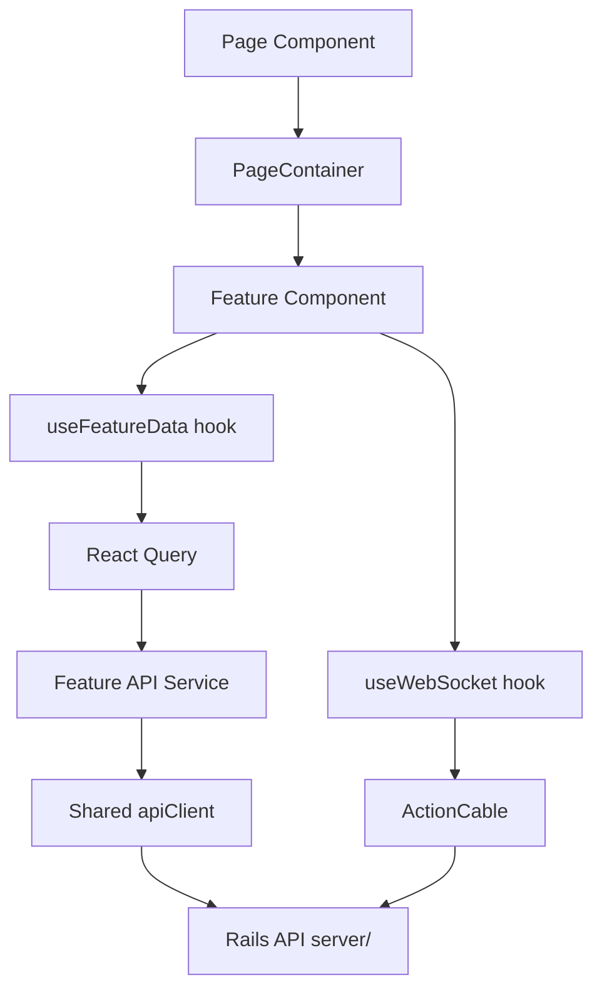
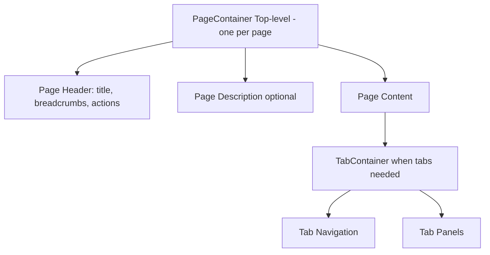
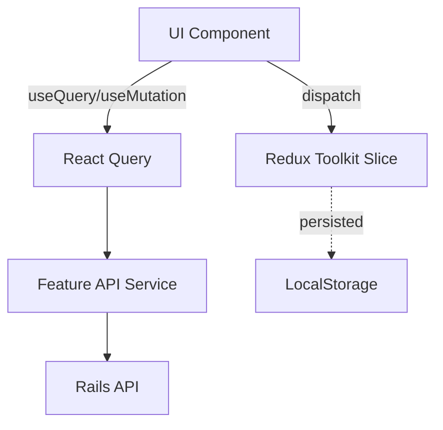
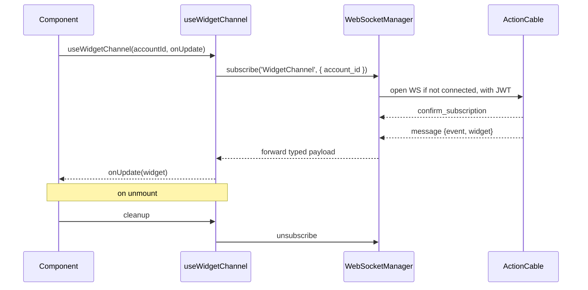

# Frontend Development Guide

> How to build React + TypeScript pages, components, hooks, and dashboards in the Powernode platform.

> Status: active

## Table of Contents

- [What this guide covers](#what-this-guide-covers)
- [Prerequisites](#prerequisites)
- [Stack and architecture](#stack-and-architecture)
- [Conventions](#conventions)
- [Feature-based layout](#feature-based-layout)
- [Routing and pages](#routing-and-pages)
- [Containers](#containers)
- [Component patterns](#component-patterns)
- [Forms](#forms)
- [State management](#state-management)
- [API integration](#api-integration)
- [WebSockets and realtime](#websockets-and-realtime)
- [Dashboards and charts](#dashboards-and-charts)
- [Admin panels and bulk operations](#admin-panels-and-bulk-operations)
- [Reliability UI components](#reliability-ui-components)
- [Accessibility, theming, and i18n](#accessibility-theming-and-i18n)
- [Related guides](#related-guides)
- [Materials previously at](#materials-previously-at)

## What this guide covers

This is the working frontend engineer's reference for the Powernode platform. It covers project layout, the React + TypeScript stack, the canonical patterns for routing, state, forms, API calls, real-time subscriptions, dashboards, and admin surfaces — and the conventions you must follow to stay shippable.

If you're building a new feature, start at [Feature-based layout](#feature-based-layout). If you're modifying an existing page, the [Conventions](#conventions) table tells you the rules.

## Prerequisites

- Node 20+, a running platform (`docs/getting-started/01-quickstart.md`)
- Familiarity with React 19, TypeScript 6, Tailwind CSS 4
- Read the root [`CLAUDE.md`](../../CLAUDE.md) "Frontend Patterns" table at least once

## Stack and architecture

| Layer | Tech |
|---|---|
| Framework | React 19 |
| Bundler | Vite 7 |
| Language | TypeScript 6 |
| Styling | Tailwind CSS 4 (theme classes only) |
| Global state | Redux Toolkit |
| Server state | TanStack Query (React Query) |
| Routing | React Router |
| HTTP | axios (shared client with interceptors) |
| Realtime | ActionCable singleton + typed hooks |
| Forms | `useForm` hook (custom) |
| Charts | Chart.js + react-chartjs-2 |
| Tests | Jest + Testing Library, Playwright for E2E |



## Conventions

| Pattern | Rule |
|---|---|
| **Colors** | Theme classes only: `bg-theme-*`, `text-theme-*` — never raw Tailwind colors |
| **Navigation** | Flat structure — no submenus |
| **Actions** | ALL page actions in `PageContainer` header — none in page content |
| **State** | Global notifications only — no local success/error toasts |
| **Imports** | Path aliases (`@/shared/`, `@/features/`) for cross-feature; relative within a feature |
| **Logging** | `import { logger } from '@/shared/utils/logger'` — never `console.log` in production |
| **Types** | No `any`. No `as` casts. Proper TypeScript types required. |
| **Access control** | Permissions only — `currentUser?.permissions?.includes('users.manage')`. Never roles. |
| **Tabs** | Per-segment URL paths (`/compute/nodes`) — never `?tab=` query params, never internal state |
| **Lists** | Infinite scroll (`useInfiniteResourceList` + sentinel) — never Previous/Next pagination |
| **Submitting changes** | Run `cd frontend && npx tsc --noEmit` before commit |

### Theme class catalog (no surprises)

The valid theme class roots are:

- `bg-theme-{primary,surface,background,background-secondary,success,warning,danger,info}`
- `text-theme-{primary,secondary,muted,inverse,success,warning,danger,info}`
- `border-theme-{primary,secondary,muted,success,warning,danger}`

**These do NOT exist** (caught a 91-file white-on-white bug in 2026-05-04):

- `bg-theme-secondary`, `bg-theme-tertiary`
- `bg-theme-*-bg` (the `-bg` suffix is wrong)

When in doubt, grep the codebase for working examples before inventing a class name.

## Feature-based layout

```
frontend/src/
├── app/                       # App-level config, router, store
├── features/                  # Self-contained feature domains
│   ├── account/
│   ├── admin/
│   ├── ai/
│   ├── billing/
│   ├── chat/
│   ├── devops/
│   ├── knowledge/
│   ├── settings/
│   └── ...
├── shared/                    # Cross-feature primitives
│   ├── components/            # PageContainer, TabContainer, modals, buttons
│   ├── hooks/                 # useForm, useWebSocket, useInfiniteResourceList
│   ├── services/              # apiClient, auth helpers
│   ├── utils/                 # logger, formatters
│   └── types/
└── theme/                     # Theme provider, design tokens
```

Each feature is **self-contained**: its own components, hooks, services, types, and tests. Cross-feature dependencies go through `@/shared/` only.

```
features/widgets/
├── components/                # Widget-specific React components
├── hooks/                     # useWidget, useWidgetMutations
├── services/                  # widgetsApiService.ts
├── types/                     # Widget, WidgetCreatePayload
├── pages/                     # WidgetsListPage, WidgetDetailPage
├── __tests__/
└── index.ts                   # Public surface for the feature
```

The `index.ts` file is the feature's public API. Don't deep-import from another feature (`@/features/widgets/components/Internal`); always go through the feature's `index.ts`.

## Routing and pages

Routes mirror the URL hierarchy and use per-segment paths for tabs. Use React Router's nested routes with a wildcard parent and `<Routes>` + `<Link>` + `useLocation` for tab sections.

```typescript
// app/router.tsx (excerpt)
<Route path="/compute/*" element={<ComputePage />} />

// features/compute/pages/ComputePage.tsx
import { Routes, Route, Link, useLocation } from 'react-router-dom';

export const ComputePage = () => {
  const { pathname } = useLocation();
  return (
    <PageContainer
      title="Compute"
      actions={[<NewNodeButton key="new" />]}
    >
      <TabContainer
        tabs={[
          { label: 'Nodes',     href: '/compute/nodes',     active: pathname.startsWith('/compute/nodes') },
          { label: 'Clusters',  href: '/compute/clusters',  active: pathname.startsWith('/compute/clusters') },
          { label: 'Templates', href: '/compute/templates', active: pathname.startsWith('/compute/templates') },
        ]}
      >
        <Routes>
          <Route path="nodes/*"     element={<NodesSection />} />
          <Route path="clusters/*"  element={<ClustersSection />} />
          <Route path="templates/*" element={<TemplatesSection />} />
        </Routes>
      </TabContainer>
    </PageContainer>
  );
};
```

Canonical exemplar: `AdminSettingsPage.tsx`.

## Containers



### PageContainer

`PageContainer` provides page-level structure: title, breadcrumbs, and **consolidated actions**. Every routable page uses it.

```typescript
<PageContainer
  title="Widgets"
  description="Manage organization widgets"
  breadcrumbs={[{ label: 'Home', href: '/' }, { label: 'Widgets' }]}
  actions={[
    <Button key="new" onClick={openCreate}>New Widget</Button>,
    <Button key="export" variant="secondary" onClick={exportCSV}>Export</Button>,
  ]}
>
  {/* Page content */}
</PageContainer>
```

**Hard rule:** all page-level actions live in `PageContainer.actions`. Never put action buttons in page content (creates visual clutter and inconsistent placement).

### TabContainer

`TabContainer` wraps tabbed sections. Tabs are URL-driven (per-segment paths) — never component-state-driven.

```typescript
<TabContainer
  tabs={[
    { label: 'Overview', href: '/widgets/overview' },
    { label: 'History',  href: '/widgets/history' },
  ]}
>
  <Routes>
    <Route path="overview" element={<Overview />} />
    <Route path="history"  element={<History />} />
  </Routes>
</TabContainer>
```

## Component patterns

### Composition over inheritance

Components compose props, slots, and render-prop children. No class components, no inheritance hierarchies.

### Naming

- Components in PascalCase: `WidgetCard`, `WidgetDetailPanel`
- Hooks in camelCase with `use` prefix: `useWidget`, `useWidgetMutations`
- Files match their default export: `WidgetCard.tsx` exports `WidgetCard`

### Permission-aware rendering

```typescript
const { currentUser } = useCurrentUser();
const canEdit = currentUser?.permissions?.includes('widgets.update');

return (
  <Card>
    <CardBody>{widget.name}</CardBody>
    {canEdit && <Button onClick={openEdit}>Edit</Button>}
  </Card>
);
```

Wrap repeated patterns in a `<PermissionGate permission="widgets.update">...</PermissionGate>` helper.

## Forms

### useForm hook

`useForm` provides values, errors, touched state, validation, submission handling, accessibility attributes, and integration with global notifications.

```typescript
import { useForm } from '@/shared/hooks/useForm';

interface WidgetForm {
  name: string;
  description?: string;
  status: 'active' | 'archived';
}

const CreateWidgetForm = () => {
  const form = useForm<WidgetForm>({
    initialValues: { name: '', description: '', status: 'active' },
    validate: (values) => {
      const errors: Partial<Record<keyof WidgetForm, string>> = {};
      if (!values.name.trim()) errors.name = 'Name is required';
      if (values.name.length > 200) errors.name = 'Name is too long';
      return errors;
    },
    onSubmit: async (values) => {
      await widgetsApiService.create(values);
    },
    successMessage: 'Widget created',
  });

  return (
    <form onSubmit={form.handleSubmit}>
      <TextInput {...form.fieldProps('name')} label="Name" required />
      <TextArea  {...form.fieldProps('description')} label="Description" />
      <Select    {...form.fieldProps('status')} label="Status"
                 options={[{ value: 'active', label: 'Active' }, { value: 'archived', label: 'Archived' }]} />
      <Button type="submit" loading={form.isSubmitting} disabled={!form.isValid}>
        Create
      </Button>
    </form>
  );
};
```

### Form rules

- Use `useForm` for every multi-field form. Don't roll your own state.
- Use validation per-field via the `validate` callback — never `onChange` validators on individual inputs.
- Errors are surfaced inline AND via global notification on submit failure.
- Success messages are surfaced via global notification — don't render local success banners.
- ARIA attributes (`aria-invalid`, `aria-describedby`) flow from `fieldProps` automatically.

### Form components

The shared form primitives (`TextInput`, `TextArea`, `Select`, `Checkbox`, `RadioGroup`, `FileInput`, `DatePicker`) all accept the props returned by `form.fieldProps(name)`. Don't pass raw `value`/`onChange` separately — that breaks accessibility wiring.

## State management

Powernode uses a **dual state** model:

| State type | Tool | Examples |
|---|---|---|
| Global app state | Redux Toolkit | Auth (current user, token), UI prefs (theme, sidebar), feature flags |
| Server state | React Query (TanStack) | API data, mutations, optimistic updates, caching |



### Redux slice

```typescript
// features/auth/slice.ts
const authSlice = createSlice({
  name: 'auth',
  initialState: { user: null, accessToken: null, status: 'idle' },
  reducers: {
    setCredentials: (state, { payload }: PayloadAction<Credentials>) => {
      state.user = payload.user;
      state.accessToken = payload.accessToken;
    },
    logout: (state) => {
      state.user = null;
      state.accessToken = null;
    },
  },
});
```

### React Query usage

```typescript
// features/widgets/hooks/useWidget.ts
export const useWidget = (id: string) =>
  useQuery({
    queryKey: ['widget', id],
    queryFn: () => widgetsApiService.get(id),
    staleTime: 60_000,
  });

export const useUpdateWidget = (id: string) => {
  const qc = useQueryClient();
  return useMutation({
    mutationFn: (patch: Partial<Widget>) => widgetsApiService.update(id, patch),
    onSuccess: () => {
      qc.invalidateQueries({ queryKey: ['widget', id] });
      qc.invalidateQueries({ queryKey: ['widgets'] });
    },
  });
};
```

### Selectors

Always select narrowly — never select an entire slice if you only need one field:

```typescript
// GOOD
const userName = useSelector((s: RootState) => s.auth.user?.name);

// BAD — re-renders on every auth change
const auth = useSelector((s: RootState) => s.auth);
```

For derived state, use `createSelector` from Reselect to memoize.

## API integration

### Shared client

```typescript
// shared/services/apiClient.ts
import axios from 'axios';

export const apiClient = axios.create({
  baseURL: import.meta.env.VITE_API_BASE || '/api/v1',
  withCredentials: false,
});

apiClient.interceptors.request.use((config) => {
  const token = store.getState().auth.accessToken;
  if (token) config.headers.Authorization = `Bearer ${token}`;
  return config;
});

apiClient.interceptors.response.use(
  (r) => r,
  async (err) => {
    if (err.response?.status === 401) await store.dispatch(refreshSession());
    return Promise.reject(err);
  },
);
```

### Feature service

```typescript
// features/widgets/services/widgetsApiService.ts
import { apiClient } from '@/shared/services/apiClient';
import type { Widget, WidgetCreatePayload, WidgetUpdatePayload } from '../types';
import type { ApiResponse, ApiPaginated } from '@/shared/types/api';

export const widgetsApiService = {
  list: async (params?: { page?: number; per_page?: number }) => {
    const { data } = await apiClient.get<ApiPaginated<Widget>>('/widgets', { params });
    return data;
  },
  get: async (id: string) => {
    const { data } = await apiClient.get<ApiResponse<Widget>>(`/widgets/${id}`);
    return data.data;
  },
  create: async (payload: WidgetCreatePayload) => {
    const { data } = await apiClient.post<ApiResponse<Widget>>('/widgets', { widget: payload });
    return data.data;
  },
  update: async (id: string, payload: WidgetUpdatePayload) => {
    const { data } = await apiClient.patch<ApiResponse<Widget>>(`/widgets/${id}`, { widget: payload });
    return data.data;
  },
  destroy: (id: string) => apiClient.delete(`/widgets/${id}`),
};
```

### Response handling rules

- The backend envelope is `{ success: boolean, data?: any, error?: string, details?: any, meta?: { pagination } }` — see [backend guide](backend.md#controllers-and-api-responses).
- Services extract `.data` (the inner data) before returning to hooks.
- Errors from axios interceptors surface to React Query, which fires `onError` — handle them through React Query's error boundary or a `useMutation` `onError` callback.
- Global notifications fire from the API client's response interceptor for unexpected errors. Per-field validation errors get returned to the form via `useForm`.

### Infinite scroll lists

```typescript
const { items, fetchMore, isLoading, sentinelRef } = useInfiniteResourceList({
  queryKey: ['widgets'],
  fetchPage: (page) => widgetsApiService.list({ page, per_page: 30 }),
});

return (
  <List>
    {items.map((w) => <WidgetCard key={w.id} widget={w} />)}
    <div ref={sentinelRef} />
    {isLoading && <Spinner />}
  </List>
);
```

## WebSockets and realtime

The frontend has a singleton `WebSocketManager` that wraps ActionCable. Domain hooks (`useChatChannel`, `useFleetChannel`, etc.) consume it with typed payloads.



### Hook pattern

```typescript
// features/widgets/hooks/useWidgetChannel.ts
export const useWidgetChannel = (
  accountId: string,
  onMessage: (msg: WidgetChannelMessage) => void,
) => {
  useEffect(() => {
    const sub = wsManager.subscribe<WidgetChannelMessage>('WidgetChannel', { account_id: accountId }, onMessage);
    return () => sub.unsubscribe();
  }, [accountId, onMessage]);
};
```

### Connection management

- Singleton — opening N WebSockets per page is forbidden.
- Auto-reconnect with exponential backoff (max 30s).
- On 401, the manager calls `refreshSession()` and re-opens.
- Subscriptions are reference-counted — closing the last subscriber unsubs the channel; opening on an already-subscribed channel reuses.

### React StrictMode gotcha

`useEffect` runs twice in StrictMode dev mode. Always pair `subscribe` with `unsubscribe` in the cleanup function (the example above does this correctly). The manager's reference counting absorbs the double-subscribe so no duplicate WS frames hit the wire.

## Dashboards and charts

### Chart wrapper

Wrap Chart.js in a typed React component so the rest of the codebase never imports `chart.js` directly:

```typescript
// shared/components/charts/LineChart.tsx
import { Line } from 'react-chartjs-2';
import { Chart, CategoryScale, LinearScale, PointElement, LineElement, Tooltip, Legend } from 'chart.js';
Chart.register(CategoryScale, LinearScale, PointElement, LineElement, Tooltip, Legend);

export const LineChart = ({ data, options }: LineChartProps) => (
  <div className="bg-theme-surface p-4 rounded-lg">
    <Line data={data} options={{ responsive: true, maintainAspectRatio: false, ...options }} />
  </div>
);
```

### Dashboard composition

```typescript
const RevenueDashboard = () => {
  const { data, isLoading } = useRevenueMetrics({ period: '30d' });
  if (isLoading) return <DashboardSkeleton />;

  return (
    <Grid cols={3} gap="md">
      <KPICard title="MRR"   value={formatMoney(data.mrr)}   delta={data.mrr_delta} />
      <KPICard title="ARR"   value={formatMoney(data.arr)}   delta={data.arr_delta} />
      <KPICard title="Churn" value={`${data.churn_rate}%`}    delta={-data.churn_delta} />
      <Card className="col-span-3">
        <CardHeader>Revenue Trend</CardHeader>
        <LineChart data={data.trend_chart} options={{ scales: { y: { beginAtZero: true } } }} />
      </Card>
    </Grid>
  );
};
```

### Real-time updates

Subscribe to the relevant channel (`useMetricsChannel`) and invalidate the React Query cache on inbound message — the dashboard re-renders automatically.

### Performance for large datasets

- Server-side aggregate; never ship 10,000 raw points to the client.
- Use `react-window` for long lists.
- Memoize `chartData` with `useMemo` keyed on the metric snapshot.

## Admin panels and bulk operations

Admin surfaces are permission-gated (`admin.*`), use complex tables with filters and bulk actions, and route through the same `PageContainer` pattern as the rest of the app.

### Bulk action safety

Bulk operations affecting more than 5 items require an explicit confirmation modal stating the exact count. Show the first 3 and last 1 items for verification. Never silently auto-approve training decisions, permission grants, or financial operations.

```typescript
const handleBulkArchive = async () => {
  const confirmed = await confirm({
    title: `Archive ${selectedIds.length} widgets?`,
    description: `This will archive: ${samples.join(', ')}, ..., ${last}.`,
    confirmLabel: 'Archive all',
    danger: true,
  });
  if (!confirmed) return;

  await bulkArchive.mutateAsync(selectedIds);
};
```

### Advanced filters

```typescript
const { filters, setFilter, clearFilters } = useFilterState({
  status: 'active',
  created_after: null,
  owner_id: null,
});

const { data } = useWidgets({ ...filters });
```

Filters live in URL query params so reloads preserve state and the filter URL is shareable.

## Reliability UI components

The reliability surface exposes retry configuration, checkpoint history, circuit-breaker state, and recovery operations to operators.

| Component | Purpose |
|---|---|
| `RetryConfigurationPanel` | Configure exponential / linear / fixed / custom retry strategies with visual schedule preview, jitter toggle, retryable error types, and workflow-default override |
| `CheckpointHistoryViewer` | Browse workflow execution checkpoints with diff view and replay-from-here action |
| `CircuitBreakerDashboard` | Live status per breaker (closed/open/half-open) with manual reset, with metrics: failure rate, time-in-state, last error |
| `RecoveryActionPanel` | Trigger replay, skip, abort recovery for failed workflow runs |
| `WorkflowExecutionTimeline` | Per-node timeline with retry attempts visualized, latency bars, error overlay |

### Integration with workflow editor

Retry configuration is exposed at two levels:

1. **Workflow default** — set on the workflow itself, inherited by all nodes
2. **Node override** — per-node retry config that overrides the workflow default

The panel highlights when a node is using the workflow default vs. an override, and a "Reset to workflow default" button clears the override.

### Real-time updates

The reliability surfaces consume `useWorkflowExecutionChannel` for live updates as nodes retry, recover, or trip breakers. Backend broadcasts state transitions; the UI reflects them within ~100ms.

## Accessibility, theming, and i18n

### Accessibility

All components MUST meet WCAG AA. The shared component library bakes in ARIA roles, keyboard navigation, focus management, and screen-reader labels. See [`docs/guides/accessibility.md`](accessibility.md) for the full compliance standards.

### Theming

Two themes ship (light, dark). Theme classes are the only allowed color references. Custom theme overrides are configured at the Account level — frontend reads the active theme from the auth context and applies the corresponding CSS variable set.

### Internationalization

The platform is timezone-agnostic. The server stores all timestamps in UTC; the frontend formats them in the user's local timezone via the `formatLocal()` helper from `@/shared/utils/datetime`. Never reference timezones explicitly in code or copy.

## Related guides

- [Backend](backend.md) — Rails API patterns this frontend consumes
- [Testing](testing.md) — Jest, RTL, Storybook
- [E2E Testing](e2e-testing.md) — Playwright
- [Accessibility](accessibility.md) — WCAG AA standards
- [`docs/concepts/chat-and-realtime.md`](../concepts/chat-and-realtime.md) — channel inventory
- [`docs/reference/theme-system.md`](../reference/theme-system.md) — theme tokens

## Materials previously at

This guide consolidates content from these legacy paths (preserved in git history for one release cycle):

- `docs/frontend/REACT_ARCHITECT_SPECIALIST.md`
- `docs/frontend/UI_COMPONENT_DEVELOPER_SPECIALIST.md`
- `docs/frontend/DASHBOARD_SPECIALIST.md`
- `docs/frontend/ADMIN_PANEL_DEVELOPER_SPECIALIST.md`
- `docs/frontend/CONTAINER_PATTERNS.md`
- `docs/frontend/FORM_PATTERNS.md`
- `docs/frontend/STATE_MANAGEMENT_GUIDE.md`
- `docs/frontend/WEBSOCKET_INTEGRATION.md`
- `docs/frontend/API_INTEGRATION_PATTERNS.md`
- `docs/frontend/FEATURE_DEVELOPMENT_GUIDE.md`
- `docs/frontend/RELIABILITY_UI_COMPONENTS.md`

_Last verified: 2026-06-03_
