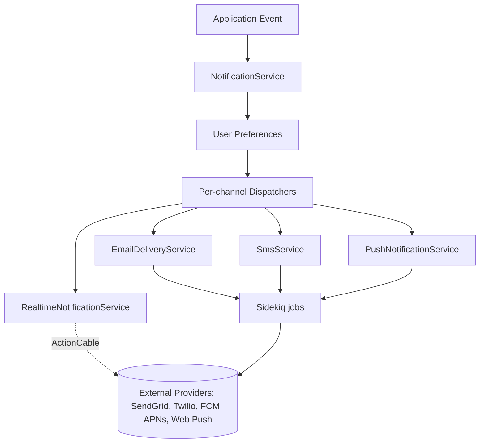
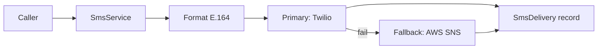
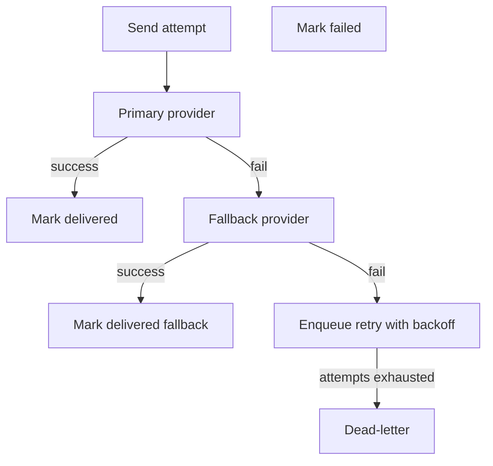

# Notifications Guide

> How to send and receive notifications across email, SMS, in-app, push, and real-time channels on the Powernode platform.

## Table of Contents

- [What this guide covers](#what-this-guide-covers)
- [Prerequisites](#prerequisites)
- [Channels and architecture](#channels-and-architecture)
- [Notification model](#notification-model)
- [Email](#email)
- [SMS](#sms)
- [In-app realtime](#in-app-realtime)
- [Web/mobile push](#webmobile-push)
- [User preferences](#user-preferences)
- [Templates](#templates)
- [Delivery tracking](#delivery-tracking)
- [Failover and retry](#failover-and-retry)
- [Privacy and compliance](#privacy-and-compliance)
- [Related guides](#related-guides)
- [Materials previously at](#materials-previously-at)

## What this guide covers

The platform supports five notification channels — **email**, **SMS**, **in-app realtime**, **web/mobile push**, and **system status broadcasts** — coordinated by a single notification subsystem. This guide is for engineers wiring new notification types, integrating with downstream providers, and operating the delivery pipeline.

The notification system is designed to be **provider-agnostic** (swap SendGrid for Mailgun, Twilio for AWS SNS) and **failure-tolerant** (primary/fallback providers, retry with backoff, dead-letter handling).

## Prerequisites

- Familiarity with backend ([`docs/guides/backend.md`](backend.md)) and worker patterns
- Provider credentials configured (see [`docs/guides/devops.md`](devops.md) for secrets)
- For realtime/in-app: read the ActionCable section in [`docs/concepts/chat-and-realtime.md`](../concepts/chat-and-realtime.md)

## Channels and architecture



Heavy work (template render + provider HTTP) runs in the worker. The server records the notification, computes the channel set, and enqueues a job per channel. The worker hits providers via API client and updates delivery records on success/failure.

## Notification model

The `Notification` model is the canonical record for any cross-channel event. Per-channel delivery records (`EmailDelivery`, `SmsDelivery`, `PushNotificationDelivery`) link back to it.

| Field | Purpose |
|---|---|
| `user_id` | Recipient |
| `account_id` | Account scope (for multi-tenant) |
| `title`, `message` | Display content |
| `notification_type` | `system | billing | security | feature | social` |
| `priority` | `low | medium | high | critical` |
| `action_url`, `action_label` | Optional CTA |
| `metadata` | JSON for type-specific data |
| `read_at` | NULL until user marks read |

Notification types carry display defaults:

| Type | Icon | Color | Default priority |
|---|---|---|---|
| `system` | wrench | blue | medium |
| `billing` | card | green | high |
| `security` | lock | red | critical |
| `feature` | sparkle | purple | low |
| `social` | people | orange | low |

## Email

### Multi-provider configuration

Email supports a primary + fallback provider per email category. Transactional (auth, billing, security) and marketing emails can use different providers:

```ruby
EMAIL_PROVIDERS = {
  transactional: {
    primary:  :sendgrid,
    fallback: :mailgun,
  },
  marketing: {
    primary:  :mailchimp,
    fallback: :sendgrid,
  },
}.freeze
```

Provider credentials live in Rails encrypted credentials — never in code or env files.

### Sending email

```ruby
EmailDeliveryService.deliver_email(
  to_email:      user.email,
  from_email:    'noreply@example.com',
  from_name:     'Powernode',
  subject:       'Welcome',
  template_id:   'welcome_v2',
  template_data: { first_name: user.first_name, account_name: account.name },
  type:          :transactional,
  priority:      :high,
)
```

`EmailDeliveryService` creates an `EmailDelivery` record, attempts delivery with the primary provider, falls back on failure, and updates the record with the message ID and provider response.

### Delivery priorities

| Priority | Max retries | Initial retry delay |
|---|---|---|
| `critical` | 5 | 1 minute |
| `high` | 3 | 5 minutes |
| `medium` | 2 | 15 minutes |
| `low` | 1 | 1 hour |

Retry uses exponential backoff with jitter (handled by the worker's `BaseJob` retry policy — see [`docs/guides/backend.md`](backend.md#background-jobs-worker)).

### Webhook receivers

Email providers send delivery status webhooks (delivered, bounced, opened, clicked). Receivers live at:

- `/webhooks/sendgrid`
- `/webhooks/mailgun`
- `/webhooks/mailchimp`

Each verifies signature, updates the `EmailDelivery` record, and returns 200/202 (never 500 — see [security guide](security.md#webhook-security)).

## SMS



### Sending SMS

```ruby
SmsService.send_sms(user.phone, "Your verification code is 123456", {
  type:    'verification',
  user_id: user.id,
  expires_at: 10.minutes.from_now,
})

# Convenience methods
SmsService.send_verification_code(user, code)
SmsService.send_security_alert(user, 'New login from unknown device')
```

### Phone number normalization

```ruby
"+1 (555) 123-4567" → "+15551234567"
```

E.164 format is enforced before any provider call. US country code is assumed for 10-digit numbers; explicit country code is required for international.

### Provider selection

Twilio primary, AWS SNS fallback. Both stored in Rails encrypted credentials. Switch providers by editing the `SMS_PROVIDERS` constant — no client code change required.

### 160-character limit

Single SMS is 160 chars. Messages exceeding this split into multiple parts (provider handles segmentation, but cost scales). Templates warn at render time if output exceeds 160:

```ruby
SmsTemplateManager.render_sms_template(:verification, code: '123456', app_name: 'Powernode', expiry_minutes: 10)
# => "Your Powernode verification code is: 123456. This code expires in 10 minutes."
```

## In-app realtime

In-app notifications stream over ActionCable. The `NotificationChannel` subscribes the user to a personal channel (`notifications:user:<id>`) and optionally an account-wide channel if they have `account.notifications` permission.

### Channel subscription

```ruby
class NotificationChannel < ApplicationCable::Channel
  def subscribed
    stream_from "notifications:user:#{current_user.id}"
    if current_user.has_permission?('account.notifications')
      stream_from "notifications:account:#{current_user.account_id}"
    end
    NotificationPresenceService.mark_online(current_user)
  end

  def unsubscribed
    NotificationPresenceService.mark_offline(current_user)
  end

  def mark_as_read(data)
    Notification.where(id: data['notification_ids'], user_id: current_user.id, read_at: nil)
                .update_all(read_at: Time.current, updated_at: Time.current)
    broadcast_unread_count(current_user)
  end
end
```

### Server-side broadcast

```ruby
RealtimeNotificationService.broadcast_notification(user, {
  title:        'Subscription renewed',
  message:      "Your #{plan.name} subscription has been renewed.",
  type:         'billing',
  priority:     'high',
  action_url:   '/billing/invoices/latest',
  action_label: 'View invoice',
})

# Account-wide
RealtimeNotificationService.broadcast_account_notification(account, {
  title:   'Scheduled maintenance',
  message: 'Maintenance window 2026-05-20 02:00 UTC.',
  type:    'system',
})
```

The service writes to `Notification` then broadcasts via ActionCable. If the user is **offline** (per presence service) AND the type qualifies for push, it additionally enqueues a push delivery.

### Frontend integration

The frontend's `useNotifications()` hook subscribes to the channel, dispatches Redux state on new notifications, and exposes mark-as-read mutations. See [frontend guide](frontend.md#websockets-and-realtime).

## Web/mobile push

Push delivery covers three platforms:

| Platform | Protocol |
|---|---|
| Web | Web Push (VAPID) |
| iOS | APNs |
| Android | FCM |

### Subscription registration

```ruby
PushNotificationService.register_push_subscription(user, {
  platform: 'web',
  endpoint: 'https://fcm.googleapis.com/wp/...',
  keys: { p256dh: 'key', auth: 'auth' }
})
```

Subscriptions are scoped per-user with a unique endpoint. Re-registering the same endpoint replaces the old subscription.

### Sending push

`PushNotificationService.send_push_notification(user, notification)` iterates the user's active subscriptions and sends per-platform:

- Web Push uses the VAPID keypair from credentials, sends the JSON payload through `WebPush.payload_send`
- APNs is keyed by APNs auth key + bundle ID
- FCM is keyed by server key

### Subscription health

Failed deliveries that report permanent failure (subscription expired or revoked) deactivate the subscription:

```ruby
subscription.update!(active: false, deactivated_at: Time.current)
```

A delivery record is created either way (`PushNotificationDelivery`) for analytics and debugging.

## User preferences

Each user has a `notification_preferences` JSONB field controlling per-type, per-channel delivery:

```json
{
  "billing":  { "email": true,  "sms": true,  "push": true,  "in_app": true  },
  "security": { "email": true,  "sms": true,  "push": true,  "in_app": true  },
  "feature":  { "email": true,  "sms": false, "push": false, "in_app": true  },
  "social":   { "email": false, "sms": false, "push": false, "in_app": true  }
}
```

`NotificationService.deliver(user:, type:, payload:)` consults preferences before dispatching. Security and critical-priority notifications bypass preferences (cannot be opted out).

### Default policy

- Critical priority: deliver on all enabled channels (preferences ignored)
- High priority: deliver per preference; default to email+in-app if no preference exists
- Medium/low: deliver per preference; default to in-app only

## Templates

### Email templates

`EmailTemplate` records are categorized:

| Category | Examples |
|---|---|
| `authentication` | welcome, email_verification, password_reset, account_locked |
| `billing` | payment_successful, payment_failed, subscription_created, subscription_cancelled, invoice_generated |
| `notifications` | account_activity, feature_announcement, maintenance_notice, security_alert |

Each template specifies an engine (Liquid, ERB, or Handlebars for SendGrid dynamic templates), subject template, HTML body, and text fallback.

```ruby
EmailTemplateManager.create_template(:authentication, :welcome, {
  subject:      'Welcome to {{app_name}}, {{user_first_name}}!',
  html_content: load_template_content('welcome.html.liquid'),
  text_content: load_template_content('welcome.txt.liquid'),
  engine:       'liquid',
  variables:    %w[user_first_name app_name app_url account_name],
})

EmailTemplateManager.render_template(:welcome, user, account_name: account.name)
```

### SMS templates

Short, variable-substituted strings. Length validated at render time:

```ruby
SMS_TEMPLATES = {
  verification:    'Your {{app_name}} verification code is: {{code}}. Expires in {{expiry_minutes}} min.',
  payment_failed:  '{{app_name}} alert: Your payment of ${{amount}} failed. Update at {{payment_url}}',
  security_alert:  '{{app_name}} security alert: {{alert_message}}. Contact support if this was not you.',
  # ...
}
```

### In-app

In-app notifications use the `Notification.title` + `message` fields directly. No template engine — payloads are computed at the call site (caller is responsible for localization).

## Delivery tracking

Each channel writes its own delivery record:

| Record | Tracks |
|---|---|
| `EmailDelivery` | Provider used, status (pending/sent/delivered/bounced), opens, clicks, message ID, response payload |
| `SmsDelivery` | Provider used, status, message ID, response |
| `PushNotificationDelivery` | Subscription used, status, error message |
| `Notification.read_at` | When the recipient read the in-app notification |

These records power the admin "Notification Activity" surface and feed into analytics queries (delivery rate, open rate, time-to-read).

### Per-event audit

For security-relevant notifications, the platform also writes an `AuditLog` entry (`event_type: 'notification.sent'`) capturing notification ID, recipient, channels used, and request context.

## Failover and retry



The worker's retry policy (see [backend guide](backend.md#background-jobs-worker)) handles transient errors. Permanent failures (e.g., 4xx from provider with "invalid subscription") deactivate the subscription and don't retry.

Dead-letter handling routes failed jobs to a separate queue for operator inspection — never silently lose a notification.

## Privacy and compliance

### PII

- Never log notification content at info level
- The `SensitiveData` log filter redacts known PII fields from request/response logs
- Notification metadata is treated as PII; access requires `notifications.view_metadata` permission

### Opt-out

- Marketing email respects the platform's unsubscribe footer (one-click unsubscribe per CAN-SPAM / GDPR)
- Transactional email cannot be opted out via the unsubscribe link (it's contractually required) but per-type preferences still apply
- SMS supports `STOP`/`HELP` keywords per provider compliance requirements
- Push notifications: user can revoke browser/OS permission at any time; the subscription deactivates on next delivery failure

### Retention

- `Notification`: retained 1 year, then archived
- `EmailDelivery` / `SmsDelivery` / `PushNotificationDelivery`: retained 90 days for analytics, then aggregated
- Webhook payloads: retained 30 days for debugging, then purged

## Related guides

- [Backend](backend.md) — service objects and worker boundary
- [Frontend](frontend.md) — `useNotifications` hook and real-time integration
- [Security](security.md) — webhook signature verification, PII handling
- [Accessibility](accessibility.md) — accessible notification UI (toast announcements via `aria-live`)
- [`docs/concepts/chat-and-realtime.md`](../concepts/chat-and-realtime.md) — ActionCable channel inventory
- [`docs/reference/auto/mcp-tools.md`](../reference/auto/mcp-tools.md) — notification MCP tools (`send_proactive_notification`, `dismiss_notification`)

## Materials previously at

This guide consolidates content from:

- `docs/services/NOTIFICATION_ENGINEER.md`

_Last verified: 2026-05-17_
