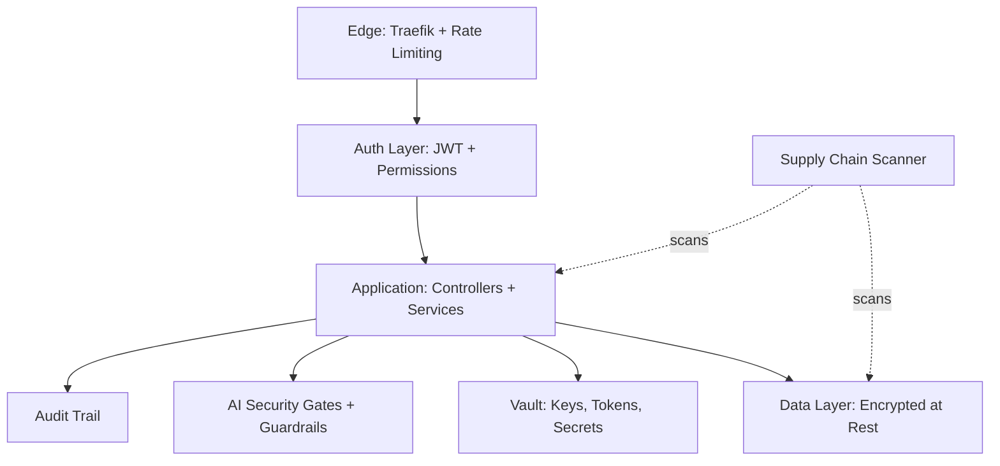
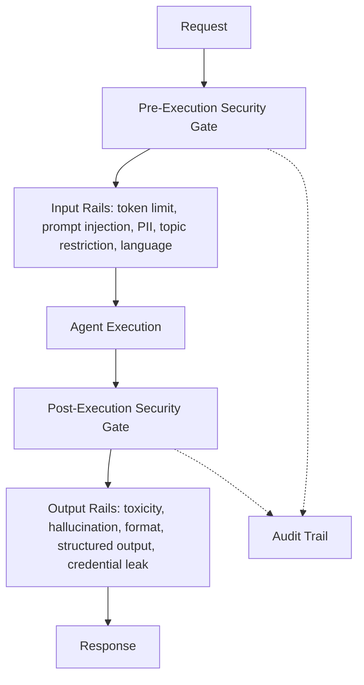
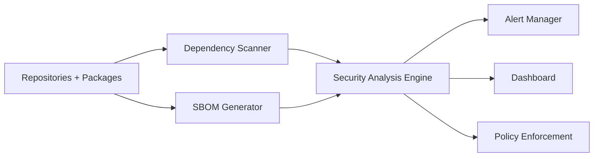

# Security Guide

> How to keep the Powernode platform — including its AI agent fleet — secure end to end.

> Status: active

## Table of Contents

- [What this guide covers](#what-this-guide-covers)
- [Prerequisites](#prerequisites)
- [Security model](#security-model)
- [Authentication](#authentication)
- [Session security](#session-security)
- [Permissions and authorization](#permissions-and-authorization)
- [Cryptographic material safety](#cryptographic-material-safety)
- [Data protection](#data-protection)
- [Webhook security](#webhook-security)
- [Audit logging](#audit-logging)
- [Network security and rate limiting](#network-security-and-rate-limiting)
- [AI security guardrails](#ai-security-guardrails)
- [Quarantine system](#quarantine-system)
- [Supply chain security](#supply-chain-security)
- [SBOM and license compliance](#sbom-and-license-compliance)
- [Incident response](#incident-response)
- [Compliance posture](#compliance-posture)
- [Related guides](#related-guides)
- [Materials previously at](#materials-previously-at)

## What this guide covers

This is the working security reference for engineers and operators of the Powernode platform. It covers application security (JWT, sessions, permissions), data protection (encryption, key management, PII), AI-specific security (guardrails, anomaly detection, quarantine, security gates), and supply chain security (dependency scanning, SBOM, license compliance).

PCI-relevant material (payment processing, cardholder data) lives in the `extensions/business` private submodule — this guide covers only the core platform's security posture.

## Prerequisites

- Familiarity with backend ([`docs/guides/backend.md`](backend.md)) and devops ([`docs/guides/devops.md`](devops.md)) conventions
- For Vault integration: a deployed Vault instance per [`docs/operations/production-deployment.md`](../operations/production-deployment.md)
- For AI guardrails: understanding the agent execution model in [`docs/concepts/agents-and-autonomy.md`](../concepts/agents-and-autonomy.md)

## Security model



Defense-in-depth: each layer assumes the layer in front of it has been bypassed and protects against the next class of failure.

## Authentication

### JWT configuration

```ruby
JWT_CONFIG = {
  algorithm: 'HS256',
  access_token_expiry:  15.minutes,
  refresh_token_expiry: 7.days,
  issuer:   'powernode-api',
  audience: ['powernode-frontend', 'powernode-mobile'],

  require_iss: true,
  require_aud: true,
  require_exp: true,
  require_nbf: true,
  leeway: 10.seconds,

  # Key rotation
  kid: -> { TokenService.current_key_id },
  verify_iss: true,
  verify_aud: true,
}.freeze
```

Tokens carry `kid` (key ID) so the platform can rotate signing keys without invalidating outstanding tokens — see [`docs/operations/production-deployment.md`](../operations/production-deployment.md) for the rotation runbook.

### Token types

- **Access token** — short-lived (15min), carries user_id + account_id + permissions claims
- **Refresh token** — long-lived (7d), used to mint new access tokens; revocable per session
- **Impersonation token** — admin-only, references an `ImpersonationSession` that must be active and not expired
- **Worker API token** — service-to-service, stored in `/etc/powernode/worker-*.conf`

### Multi-factor authentication

TOTP with backup codes:

> **Status: illustrative** — `MfaService` is a representative example, not a shipped class (no `MfaService` exists in the codebase yet). It shows the intended TOTP + backup-code shape.

```ruby
class MfaService
  TOTP_SETTINGS = {
    digest: 'sha1', digits: 6, interval: 30,
    drift_ahead: 15, drift_behind: 15
  }.freeze

  def self.generate_backup_codes(user)
    codes = 10.times.map { SecureRandom.alphanumeric(8).upcase }
    user.update!(backup_codes: codes.map { |c| BCrypt::Password.create(c) })
    codes
  end

  def self.verify_backup_code(user, code)
    user.backup_codes.any? { |hashed| BCrypt::Password.new(hashed) == code }
  end
end
```

## Session security

> **Status: illustrative** — the `session_security.rb` initializer shown below is representative; that initializer is not present in the codebase today (the shipped initializer covering cross-origin/edge config is `server/config/initializers/cors.rb`). The session-hardening behavior described under "Session middleware additionally" is the intended shape.

```ruby
# config/initializers/session_security.rb
Rails.application.config.session_store :cookie_store,
  key:          '_powernode_session',
  domain:       Rails.env.production? ? '.powernode.example.com' : nil,
  secure:       Rails.env.production?,
  httponly:     true,
  same_site:    :strict,
  expire_after: 4.hours
```

Session middleware additionally:

- Clears sessions containing suspicious patterns (XSS payloads, admin/system probes)
- Rate-limits per-session at 100 requests/hour
- Logs session anomalies to the audit trail

## Permissions and authorization

The platform uses **permission-based access control**, never role-based. Roles are containers for permissions; controllers check permissions.

```ruby
# Controller
before_action -> { require_permission('widgets.update') }, only: :update

# Model
class User < ApplicationRecord
  def has_permission?(name)
    all_permissions.include?(name)
  end

  def all_permissions
    @all_permissions ||= roles.flat_map(&:permissions).map(&:name).uniq
  end
end
```

**Frontend** uses `currentUser?.permissions?.includes('foo.bar')` — never `roles.includes('admin')`. **Backend** uses `current_user.has_permission?('foo.bar')` — never `permissions.include?()` (returns objects, not strings).

See [`docs/concepts/permissions.md`](../concepts/permissions.md) for the registry.

### Account scoping

Every account-scoped query MUST start from `current_account`. Shared example `'scopes to current account'` (in `spec/support/shared_examples/`) verifies this for every resource. Cross-account data leaks are gated at the spec level — adding a new index for testability isn't optional.

## Cryptographic material safety

These rules are **absolute** — they override convenience, they override speed, they override "just this once":

| Rule | Detail |
|---|---|
| **No key output** | NEVER output, log, display, echo, or transmit private keys, API secrets, seed phrases, mnemonics, or signing material in any form |
| **No keys in code** | NEVER store keys, secrets, or credentials in source code files, scripts, configs, env files, or documentation |
| **No CLI key generation** | NEVER generate private keys via CLI commands (`rails runner`, `rake`, `irb`) where they could appear in shell history |
| **Vault-only storage** | ALL key generation MUST happen inside Vault or `WalletKeyService` (which stores directly to Vault) |
| **Audit all key ops** | ALL key operations (generate, import, revoke, sign) MUST be logged to the audit log |
| **No key arguments in logs** | NEVER pass private keys as function arguments that could appear in logs, error messages, or exception traces |
| **Guide, don't handle** | When assisting with wallet setup, guide the user through the UI/API — never handle key material directly |

If you find yourself wanting to violate one of these rules, stop and route through the existing key management surface instead. There is no scenario where Claude or a human contributor should be staring at a private key in a terminal.

## Data protection

### Encryption at rest

Sensitive data is encrypted with AES-256-GCM and a context-specific key derived from the master key via PBKDF2 (10,000 iterations, SHA-256):

> **Status: illustrative** — `DataEncryptionService` below is a representative example of the AES-256-GCM scheme, not a shipped class. The real encryption service is `Security::CredentialEncryptionService` (`server/app/services/security/credential_encryption_service.rb`).

```ruby
class DataEncryptionService
  ENCRYPTION_ALGORITHM = 'AES-256-GCM'.freeze

  class << self
    def encrypt_sensitive_data(data, context: nil)
      return nil if data.nil?

      cipher = OpenSSL::Cipher.new(ENCRYPTION_ALGORITHM)
      cipher.encrypt
      cipher.key = derive_key_for_context(context)

      iv = SecureRandom.random_bytes(16)
      cipher.iv = iv

      encrypted = cipher.update(data.to_s) + cipher.final
      auth_tag = cipher.auth_tag
      Base64.strict_encode64(iv + auth_tag + encrypted)
    end

    def decrypt_sensitive_data(encrypted_data, context: nil)
      return nil if encrypted_data.nil?

      data = Base64.strict_decode64(encrypted_data)
      iv, auth_tag, encrypted = data[0..15], data[16..31], data[32..]

      cipher = OpenSSL::Cipher.new(ENCRYPTION_ALGORITHM)
      cipher.decrypt
      cipher.key = derive_key_for_context(context)
      cipher.iv = iv
      cipher.auth_tag = auth_tag

      cipher.update(encrypted) + cipher.final
    end

    private

    def derive_key_for_context(context)
      base_key = Rails.application.credentials.master_key
      salt     = Rails.application.credentials.encryption_salt
      OpenSSL::PKCS5.pbkdf2_hmac("#{base_key}:#{context}", salt, 10_000, 32, OpenSSL::Digest::SHA256.new)
    end
  end
end
```

The real encryption surface is `Security::CredentialEncryptionService`. `Ai::ProviderCredential` uses it directly — it stores ciphertext in `encrypted_credentials` (+ `encryption_key_id`) and encrypts/decrypts via the service rather than a per-attribute macro:

```ruby
class Ai::ProviderCredential < ApplicationRecord
  include Auditable

  # Persisted: encrypted_credentials, encryption_key_id

  def credentials_hash
    Security::CredentialEncryptionService.decrypt(encrypted_credentials)
  end

  def store_credentials!(hash)
    update!(
      encrypted_credentials: Security::CredentialEncryptionService.encrypt(hash, namespace: "ai"),
      encryption_key_id:     Security::CredentialEncryptionService.current_key_id("ai")
    )
  end
end
```

For provider-level secrets that should live in Vault instead of the database, use the `VaultCredential` concern's real surface: set `self.vault_credential_type = "..."` on the model and call `store_in_vault(data)` / `migrate_to_vault!` (there is no `vault_credential :attr` class macro).

### PII handling

- Never log PII (emails, phone numbers, credit card fragments) at info level
- Use the `SensitiveData` log filter to redact known PII fields from request/response logs
- PII in user-supplied input passes through the AI guardrail pipeline's `pii_detection` rail
- Export endpoints strip PII unless the requesting user has `analytics.export_pii`

## Webhook security

Inbound webhooks (provider callbacks, GitOps push, third-party integrations) MUST verify their signature before processing and MUST return 200/202 on processing failures — never 500.

```ruby
class Api::V1::Webhooks::ProviderController < ApplicationController
  skip_before_action :authenticate_request
  before_action :verify_signature

  def receive
    WorkerJobService.enqueue_job('ProviderEventJob', args: [request.raw_post])
    head :accepted
  rescue StandardError => e
    Rails.logger.error("Webhook processing failed: #{e.message}")
    head :ok # avoid retry storm
  end

  private

  def verify_signature
    expected = OpenSSL::HMAC.hexdigest('sha256', ENV['PROVIDER_WEBHOOK_SECRET'], request.raw_post)
    received = request.headers['X-Provider-Signature']
    head :unauthorized unless ActiveSupport::SecurityUtils.secure_compare(expected, received)
  end
end
```

Returning a 500 to a webhook provider triggers exponential-backoff retries — they pile up, exhaust your workers, and break the system. ALWAYS return 200/202 even when processing fails.

## Audit logging

The platform maintains structured audit logs across multiple subsystems:

- `AuditLog` — application-wide audit events, including key material handling and sensitive operations (CRUD operations, admin actions)
- `Ai::SecurityAuditTrail` — agent execution security decisions
- `Devops::*Activity` — Docker/Swarm/pipeline operations

Each entry captures: timestamp, user_id, account_id, ip_address, request_id, action, resource, before/after diff (for mutations), and outcome.

### Querying audit logs

Audit logs surface in the admin UI under Activity Feed, are queryable via MCP tools (see [`docs/reference/auto/mcp-tools.md`](../reference/auto/mcp-tools.md)), and are retained per the platform's data retention policy.

## Network security and rate limiting

### Rack::Attack

```ruby
class Rack::Attack
  # 60 req/min per IP
  throttle('req/ip', limit: 60, period: 1.minute) { |req| req.ip }

  # 5 login attempts per minute per IP
  throttle('login/ip', limit: 5, period: 1.minute) do |req|
    req.ip if req.path == '/api/v1/auth/login' && req.post?
  end

  # 1000 API req/hour per authenticated user
  throttle('api/user', limit: 1000, period: 1.hour) do |req|
    req.env['current_user']&.id if req.path.start_with?('/api/')
  end

  blocklist('malicious-ips') do |req|
    Rails.cache.read("blocked_ip:#{req.ip}")
  end
end
```

### Security headers

> **Status: illustrative** — `SecurityHeadersMiddleware` is a representative example showing the intended response headers, not a shipped class (no such middleware exists yet).

```ruby
class SecurityHeadersMiddleware
  def call(env)
    status, headers, response = @app.call(env)
    headers['X-Frame-Options']           = 'DENY'
    headers['X-Content-Type-Options']    = 'nosniff'
    headers['X-XSS-Protection']          = '1; mode=block'
    headers['Referrer-Policy']           = 'strict-origin-when-cross-origin'
    headers['Content-Security-Policy']   = "default-src 'self'"
    headers['Strict-Transport-Security'] = 'max-age=31536000; includeSubDomains'
    [status, headers, response]
  end
end
```

## AI security guardrails

The AI subsystem ships with a multi-layered security pipeline. Every agent execution passes through:



### Pre-execution gate

`Ai::Security::SecurityGateService.pre_execution_gate` runs six checks:

| Check | ASI ref | Criticality | What it does |
|---|---|---|---|
| `quarantine_gate` | ASI08 | Hard | Blocks if agent is quarantined |
| `anomaly_precheck` | ASI01 | Hard | Behavioral fingerprint anomaly |
| `privilege_check` | ASI05 | Hard | Action vs. privilege policy |
| `conformance_check` | ASI03 | Soft | Event sequence rules |
| `prompt_injection` | ASI02 | Hard | Pattern-based injection detection |
| `pii_input_scan` | ASI04 | Flag | Records but doesn't block |

Criticality levels: `hard` blocks execution; `soft` logs warning and marks degraded; `flag` records for audit only.

### Post-execution gate

| Check | ASI ref | Criticality | What it does |
|---|---|---|---|
| `pii_output_redact` | ASI04 | Hard | Redacts PII from output |
| `output_safety` | ASI09 | Hard | Validates output safety |

### Guardrail pipeline

`Ai::Guardrails::Pipeline` applies configurable input, output, and retrieval rails.

**Input rails:** `token_limit`, `prompt_injection`, `pii_detection`, `topic_restriction`, `language_detection`

**Output rails:** `token_limit`, `toxicity`, `pii_detection`, `hallucination_check`, `format_validation`, `structured_output`, `credential_leak`

**Retrieval rails:** apply input rails to each retrieved document — prevents poisoned retrieval results.

### Configuration

Per-account or per-agent guardrail config:

```ruby
Ai::GuardrailConfig.create!(
  account: account,
  agent:   agent,           # nil for account-wide default
  name:    'Production Guardrails',
  toxicity_threshold: 0.7,
  pii_sensitivity:    0.9,
  max_input_tokens:   8000,
  max_output_tokens:  4000,
  protected_branches: ['main', 'master', 'release/*'],
  is_active: true
)
```

### Audit trail

```ruby
Ai::SecurityAuditTrail.log!(
  action: 'agent_execution',
  outcome: 'allowed',
  account: account,
  agent_id: agent.id,
  asi_reference: 'ASI05',
  csa_pillar:    'identity',
  risk_score:    0.2,
  severity:      'info',
  source_service: 'SecurityGateService',
  context: { tool_name: 'read_file' },
  details: { checks_passed: 6 }
)
```

Outcomes: `allowed | denied | blocked | quarantined | escalated`. Severities: `info | warning | critical`. ASI references: ASI01–ASI10. CSA pillars: `identity | behavior | data_governance | segmentation | incident_response`.

### Key files

| File | Path |
|---|---|
| Security Gate Service | `server/app/services/ai/security/security_gate_service.rb` |
| Guardrail Pipeline | `server/app/services/ai/guardrails/pipeline.rb` |
| Input Rail | `server/app/services/ai/guardrails/input_rail.rb` |
| Output Rail | `server/app/services/ai/guardrails/output_rail.rb` |
| Guardrail Config Model | `server/app/models/ai/guardrail_config.rb` |
| Audit Trail Model | `server/app/models/ai/security_audit_trail.rb` |
| Quarantine Record Model | `server/app/models/ai/quarantine_record.rb` |
| Anomaly Detection | `server/app/services/ai/security/agent_anomaly_detection_service.rb` |
| PII Redaction | `server/app/services/ai/security/pii_redaction_service.rb` |
| Privilege Enforcement | `server/app/services/ai/security/privilege_enforcement_service.rb` |
| Quarantine Service | `server/app/services/ai/security/quarantine_service.rb` |

## Quarantine system

`Ai::QuarantineRecord` isolates misbehaving agents from execution. Severities `low | medium | high | critical`. Statuses `active | escalated | restored | expired`. Triggers `anomaly_detection | manual | policy_violation | budget_exceeded`.

```ruby
record = Ai::QuarantineRecord.create!(
  agent: agent,
  severity: 'high',
  status:   'active',
  trigger_reason: 'Anomalous tool usage pattern',
  trigger_source: 'anomaly_detection',
  cooldown_minutes: 60,
  scheduled_restore_at: 1.hour.from_now
)

record.past_cooldown?    # true once cooldown elapsed
record.auto_restorable?  # true if active and past scheduled_restore_at
```

> **Status: not yet implemented** — there is no `AiQuarantineRestoreJob` and no scheduled entry in `worker/config/sidekiq.yml`; nothing runs the restore sweep on a schedule today. The logic exists only as service methods: `Ai::Security::QuarantineService#auto_restore_expired!` (with `#restorable_records`), which must be invoked manually. Planned: a nightly job that sweeps `restorable` records and lifts the quarantine if no further incidents are recorded during cooldown.

## Supply chain security



### Dependency scanning

```typescript
class SecurityScannerService {
  async scanDependencies(config: ScanConfig): Promise<ScanResult>
  async getVulnerabilities(filters?: VulnerabilityFilters): Promise<Vulnerability[]>
  async getDependencyTree(packageName?: string): Promise<Dependency[]>
}

interface ScanConfig {
  scanType: 'full' | 'quick' | 'targeted';
  includeDevDependencies: boolean;
  severityThreshold: 'critical' | 'high' | 'medium' | 'low';
  autoFix: boolean;
  ignoredVulnerabilities: string[];
  repositories: string[];
}
```

### Severity classification

| Severity | CVSS | Response time | Example |
|---|---|---|---|
| Critical | 9.0-10.0 | Immediate | RCE, data exfiltration |
| High | 7.0-8.9 | 24 hours | Privilege escalation |
| Medium | 4.0-6.9 | 1 week | Information disclosure |
| Low | 0.1-3.9 | 30 days | Minor issues |

### Secret scanning

The platform uses `gitleaks` configured via `.gitleaks.toml`. Scans run:

- Pre-commit hook (gates local commits)
- `scripts/validate.sh` (pre-push)
- Full history scan in CI on release-candidate tags

When gitleaks reports a true positive, rotate the leaked credential immediately and rewrite git history if it's recent enough to scrub without breaking downstream consumers.

## SBOM and license compliance

### SBOM generation

```typescript
interface SBOM {
  format: 'cyclonedx' | 'spdx';
  version: string;
  createdAt: string;
  components: SBOMComponent[];
}

interface SBOMComponent {
  type: 'library' | 'application' | 'framework';
  name: string;
  version: string;
  purl: string;
  licenses: string[];
  hashes: { algorithm: string; value: string }[];
}

async generateSBOM(format: 'cyclonedx' | 'spdx'): Promise<SBOM>;
```

SBOMs are signed and stored per release tag for downstream consumers and compliance audits.

### License compliance

The license scanner produces a `LicenseReport` covering total packages, license breakdown, incompatible licenses (with reason), and an overall compliance score. The OSS policy bans GPL/AGPL in production paths and warns on weak copyleft (LGPL, MPL).

### Policy enforcement

`SecurityPolicy` records define rules (license restrictions, severity thresholds, EOL package detection) and actions (block install, warn, auto-fix). The pre-commit hook and CI both evaluate active policies and gate builds accordingly.

## Incident response

When a security incident is detected:

1. **Triage** — Determine scope: data exfiltration, unauthorized access, key compromise, dependency vulnerability
2. **Contain** — Revoke compromised credentials/tokens, quarantine affected agents, isolate affected hosts
3. **Investigate** — Pull audit trails, correlate with `Ai::SecurityAuditTrail` and `AuditLog`, capture forensics
4. **Remediate** — Apply patch, rotate keys, update guardrail policies, blocklist offending IPs
5. **Report** — File issue with `[SEC]` prefix, notify affected users if data was exposed
6. **Post-mortem** — Document root cause, update threat model, add detection coverage

The escalation surface is the platform's `Escalation` model and intervention policies — see [`docs/concepts/agents-and-autonomy.md`](../concepts/agents-and-autonomy.md) for the autonomy/intervention flow.

## Compliance posture

The core platform's compliance posture covers:

- **GDPR / privacy** — PII detection and redaction, export-with-consent, data subject access rights via admin tools
- **SOC 2 Type II** — Audit logging, access control, incident response procedures
- **Supply chain (SLSA)** — Build provenance, signed releases, SBOM generation

PCI DSS compliance (for payment processing) lives in `extensions/business` — when that extension is loaded, additional PCI-specific guardrails activate (tokenized PAN storage, HMAC-signed payment requests, restricted audit log access). See the business submodule's docs for the PCI matrix.

## Related guides

- [Backend](backend.md) — Rails patterns and authentication flow
- [DevOps](devops.md) — secrets management, Vault deployment
- [Extensions](extensions.md) — extension-level security boundaries
- [`docs/concepts/permissions.md`](../concepts/permissions.md) — permission registry
- [`docs/concepts/agents-and-autonomy.md`](../concepts/agents-and-autonomy.md) — agent execution model the guardrails protect
- [`docs/reference/auto/mcp-tools.md`](../reference/auto/mcp-tools.md) — security-related MCP tools

## Materials previously at

This guide consolidates content from these legacy paths (preserved in git history for one release cycle):

- `docs/infrastructure/SECURITY_SPECIALIST.md`
- `docs/platform/AI_SECURITY_GUARDRAILS.md`
- `docs/platform/SUPPLY_CHAIN_SECURITY.md`

_Last verified: 2026-06-04_
