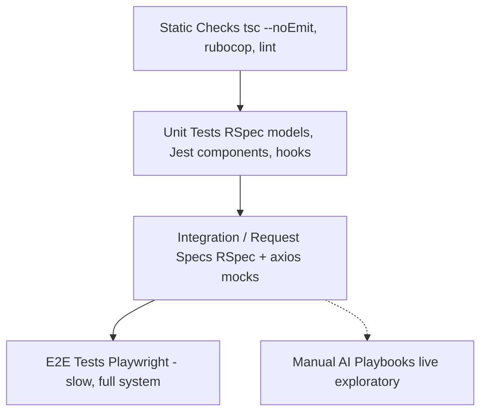

# Testing Guide

> How to write and run automated and manual tests across the Powernode platform's backend, frontend, and AI surfaces.

> Status: active

## Table of Contents

- [What this guide covers](#what-this-guide-covers)
- [Prerequisites](#prerequisites)
- [Test pyramid](#test-pyramid)
- [Running tests](#running-tests)
- [Backend testing (RSpec)](#backend-testing-rspec)
- [Worker job specs](#worker-job-specs)
- [Frontend testing (Jest + RTL)](#frontend-testing-jest--rtl)
- [Manual AI testing playbooks](#manual-ai-testing-playbooks)
- [Concurrency and isolation](#concurrency-and-isolation)
- [CI integration](#ci-integration)
- [Related guides](#related-guides)
- [Materials previously at](#materials-previously-at)

## What this guide covers

This guide is for engineers writing or running automated tests (RSpec, Jest, Testing Library) and operators running manual AI smoke tests against a live platform. It covers the canonical patterns: factories, request specs, worker job specs, component tests, mocking strategies, and the AI-functionality manual test playbooks.

For end-to-end browser tests, see the separate [`docs/guides/e2e-testing.md`](e2e-testing.md). For test patterns specific to a feature area, see the relevant area guide.

## Prerequisites

- Local dev environment per [`docs/getting-started/01-quickstart.md`](../getting-started/01-quickstart.md)
- All systemd services healthy (`sudo scripts/systemd/powernode-installer.sh status`)
- For AI manual playbooks: at least one configured provider (Ollama or remote) and an agent
- Familiarity with backend ([`docs/guides/backend.md`](backend.md)) and frontend ([`docs/guides/frontend.md`](frontend.md)) conventions

## Test pyramid



Run thousands of unit tests cheaply, hundreds of request/component tests, dozens of E2E flows, and a small number of manual AI playbook walkthroughs per release. Static checks (TypeScript, Ruby syntax) gate every commit.

## Running tests

### Backend RSpec

```bash
cd server

# Full suite — use --format json for parseable output, never tail
bundle exec rspec --format json > /tmp/rspec.json 2>&1

# Single file
bundle exec rspec spec/models/account_spec.rb

# Single example
bundle exec rspec spec/models/account_spec.rb:42

# By tag
bundle exec rspec --tag focus
```

**Never** pipe `rspec` through `tail` — output is lost and you miss the structured failure data.

### Frontend Jest

```bash
cd frontend
CI=true npm test                                            # full suite
CI=true npm test -- src/features/widgets/__tests__/Widget.test.tsx
CI=true npm test -- --watch                                 # interactive
```

`CI=true` disables watch mode and ensures deterministic output.

### TypeScript check

```bash
cd frontend && npx tsc --noEmit
```

Run this **before every commit** that touches TypeScript.

### Ruby syntax check

```bash
cd server && bundle exec ruby -c app/path/to/file.rb
```

### Targeted vs. full suite

The full backend suite is slow. Run only the specs touching the files you changed during development. The full suite runs in CI on every PR.

## Backend testing (RSpec)

### Project layout

```
server/spec/
├── factories/                          # FactoryBot
│   ├── accounts.rb
│   ├── users.rb
│   ├── ai/                             # namespaced factories
│   └── ...
├── models/                             # model specs
├── requests/                           # request specs (per-controller)
│   └── api/v1/
├── services/                           # service object specs
├── support/                            # shared examples, helpers, matchers
│   ├── shared_examples/
│   ├── ai_matchers.rb
│   ├── ai_test_helpers.rb
│   └── permission_test_helpers.rb
├── spec_helper.rb
└── rails_helper.rb
```

### Factories

Use FactoryBot for all test data. Each factory should support traits for common state variants:

```ruby
# spec/factories/widgets.rb
FactoryBot.define do
  factory :widget do
    account
    user
    sequence(:name) { |n| "Widget #{n}" }
    status { 'active' }

    trait :archived  do; status { 'archived' };  end
    trait :paused    do; status { 'paused' };    end
    trait :with_logs do
      after(:create) { |w| create_list(:widget_log, 3, widget: w) }
    end
  end
end

# Usage
let(:widget) { create(:widget, :archived, account: account) }
```

### User and permission setup

Use `permission_test_helpers.rb`:

```ruby
let(:user)    { user_with_permissions('widgets.view', 'widgets.create') }
let(:headers) { auth_headers_for(user) }
```

Never create users manually in specs — the helpers ensure permissions are properly assigned through roles, which exercises the full access-control chain.

### Request specs

```ruby
require 'rails_helper'

RSpec.describe 'Widgets API', type: :request do
  let(:account) { create(:account) }
  let(:user)    { user_with_permissions('widgets.view', 'widgets.create', account: account) }
  let(:headers) { auth_headers_for(user) }

  describe 'GET /api/v1/widgets' do
    let!(:widget) { create(:widget, account: account) }

    it 'returns widgets scoped to the user account' do
      get '/api/v1/widgets', headers: headers

      expect_success_response
      expect(json_response_data.size).to eq(1)
      expect(json_response_data.first['id']).to eq(widget.id)
    end

    include_examples 'requires authentication'
    include_examples 'requires permission', 'widgets.view'
    include_examples 'scopes to current account'
  end

  describe 'POST /api/v1/widgets' do
    let(:params) { { widget: { name: 'New Widget' } } }

    it 'creates a widget' do
      expect { post '/api/v1/widgets', params: params, headers: headers }
        .to change(Widget, :count).by(1)
      expect(response).to have_http_status(:created)
    end

    it 'returns validation errors on invalid input' do
      post '/api/v1/widgets', params: { widget: { name: '' } }, headers: headers
      expect_error_response('Validation failed', :unprocessable_entity)
    end
  end
end
```

### Shared examples

| Example | Verifies |
|---|---|
| `'requires authentication'` | Endpoint returns 401 without a valid JWT |
| `'requires permission', 'foo.bar'` | Endpoint returns 403 when user lacks the named permission |
| `'scopes to current account'` | Endpoint never returns rows from another account |
| `'paginated'` | Endpoint accepts `?page=` and `?per_page=` and returns `meta.pagination` |
| `'returns standard envelope'` | Response is `{ success: bool, data?, error?, meta? }` |

Include the examples after your endpoint-specific tests. They are zero-cost coverage — the chronic regressions they catch (auth bypass, cross-account leak) are catastrophic.

### Response helpers

| Helper | Purpose |
|---|---|
| `json_response` | Parsed response body |
| `json_response_data` | `json_response['data']` |
| `expect_success_response(data = nil)` | Asserts `success: true` and optional data |
| `expect_error_response(msg, status)` | Asserts `success: false`, message, and status |

### Model specs

Test the public surface: validations, scopes, instance methods, callback side effects. Don't test ActiveRecord internals.

```ruby
RSpec.describe Widget, type: :model do
  describe 'validations' do
    it { is_expected.to validate_presence_of(:name) }
    it { is_expected.to validate_inclusion_of(:status).in_array(%w[active archived paused]) }
  end

  describe '.active scope' do
    let!(:active)   { create(:widget) }
    let!(:archived) { create(:widget, :archived) }

    it 'returns only active widgets' do
      expect(Widget.active).to contain_exactly(active)
    end
  end

  describe '#archive!' do
    let(:widget) { create(:widget) }

    it 'flips status and stamps archived_at' do
      expect { widget.archive! }.to change(widget, :status).from('active').to('archived')
      expect(widget.archived_at).to be_within(1.second).of(Time.current)
    end
  end
end
```

### Service specs

Test the success and failure paths of your service object:

```ruby
RSpec.describe Widgets::CreateService do
  let(:account) { create(:account) }
  let(:user)    { create(:user, account: account) }

  context 'with valid params' do
    let(:result) { described_class.call(account: account, user: user, name: 'Foo') }

    it { expect(result).to be_success }
    it { expect(result.data[:widget]).to be_a(Widget) }
  end

  context 'with invalid params' do
    let(:result) { described_class.call(account: account, user: user, name: '') }

    it { expect(result).to be_failure }
    it { expect(result.error).to eq('Validation failed') }
  end
end
```

### AI matchers and helpers

For specs touching the AI subsystem:

| Matcher / Helper | Use |
|---|---|
| `be_a_valid_ai_response` | Asserts response shape (data, citations, finish_reason) |
| `have_execution_status(:status)` | Asserts agent execution status |
| `create_audit_log(:action)` | Asserts `Trading::AuditLog` or `Ai::AuditLog` entry created |
| `ProviderHelpers`, `AgentHelpers`, `WorkflowHelpers`, `SecurityHelpers` | Setup helpers — see `spec/support/ai_test_helpers.rb` |

## Worker job specs

The worker is a separate process. Its specs live in `worker/spec/` and use Sidekiq's test mode:

```ruby
# worker/spec/jobs/widget_dispatch_job_spec.rb
require 'spec_helper'

RSpec.describe WidgetDispatchJob do
  subject { described_class }  # required for shared examples
  let(:job_args) { { 'widget_id' => 'widget-uuid' } }

  it_behaves_like 'a base job'

  describe '#execute' do
    before do
      stub_api(:post, '/widgets/widget-uuid/dispatch',
               response: { 'success' => true, 'data' => { 'dispatched' => true } })
    end

    it 'calls the dispatch endpoint via api_client' do
      described_class.new.execute(job_args)
      expect(api_stub).to have_been_requested
    end

    it 'raises on api failure to trigger retry' do
      stub_api(:post, '/widgets/widget-uuid/dispatch', status: 500, response: { 'error' => 'boom' })
      expect { described_class.new.execute(job_args) }.to raise_error(BackendApiClient::ApiError)
    end
  end
end
```

Notes:

- `subject { described_class }` and `let(:job_args)` are required by the shared examples.
- Never reach into ActiveRecord in worker specs — stub the API surface instead.

## Frontend testing (Jest + RTL)

### Setup

```typescript
// jest.config.ts
import type { Config } from 'jest';

const config: Config = {
  preset: 'ts-jest',
  testEnvironment: 'jsdom',
  setupFilesAfterEach: ['<rootDir>/jest.setup.ts'],
  moduleNameMapper: {
    '^@/(.*)$': '<rootDir>/src/$1',
    '\\.(css|scss)$': 'identity-obj-proxy',
  },
};
export default config;
```

### Component testing pattern

```typescript
import { render, screen, fireEvent, waitFor } from '@testing-library/react';
import userEvent from '@testing-library/user-event';
import { QueryClient, QueryClientProvider } from '@tanstack/react-query';
import { Provider } from 'react-redux';
import { WidgetCard } from '../components/WidgetCard';
import { makeStore } from '@/app/store';

const renderWithProviders = (ui: React.ReactElement) => {
  const qc = new QueryClient({ defaultOptions: { queries: { retry: false } } });
  return render(
    <Provider store={makeStore()}>
      <QueryClientProvider client={qc}>{ui}</QueryClientProvider>
    </Provider>,
  );
};

describe('WidgetCard', () => {
  const widget = { id: '1', name: 'Foo', status: 'active' };

  it('renders the widget name', () => {
    renderWithProviders(<WidgetCard widget={widget} />);
    expect(screen.getByText('Foo')).toBeInTheDocument();
  });

  it('hides Edit button when user lacks widgets.update permission', () => {
    renderWithProviders(<WidgetCard widget={widget} />);
    expect(screen.queryByRole('button', { name: /edit/i })).not.toBeInTheDocument();
  });

  it('shows Edit button when user has permission', async () => {
    // Set permissions via the Redux store helper
    renderWithProviders(<WidgetCard widget={widget} />, { permissions: ['widgets.update'] });
    expect(screen.getByRole('button', { name: /edit/i })).toBeInTheDocument();
  });
});
```

### Test rules

- **Query by role first**, then by label, then by test-id. Avoid querying by class or by raw text when accessible alternatives exist.
- **Use `userEvent`**, not `fireEvent`, for interactions — it triggers the events a real user would in the correct order.
- **Wrap with providers** that match production — the test fails to surface React Query, Redux, or Theme-related bugs otherwise.
- **Mock API calls** through MSW or by stubbing `axios` directly; don't hit real endpoints.
- **No snapshot soup**. Targeted assertions beat 500-line snapshots — they describe intent.

### Hook testing

```typescript
import { renderHook, waitFor } from '@testing-library/react';
import { useWidget } from '../hooks/useWidget';

describe('useWidget', () => {
  it('returns the widget when fetched', async () => {
    const { result } = renderHook(() => useWidget('widget-1'), {
      wrapper: ({ children }) => <QueryClientProvider client={new QueryClient()}>{children}</QueryClientProvider>,
    });
    await waitFor(() => expect(result.current.isSuccess).toBe(true));
    expect(result.current.data?.name).toBe('Foo');
  });
});
```

### Accessibility tests

Use `@axe-core/react` or `jest-axe` for automated a11y checks:

```typescript
import { axe, toHaveNoViolations } from 'jest-axe';
expect.extend(toHaveNoViolations);

it('has no a11y violations', async () => {
  const { container } = renderWithProviders(<WidgetForm />);
  expect(await axe(container)).toHaveNoViolations();
});
```

See [`docs/guides/accessibility.md`](accessibility.md) for the full standards.

## Manual AI testing playbooks

Some AI surfaces are too dynamic or too costly to fully automate. The platform maintains two living manual test playbooks for them:

### Backend playbook

Comprehensive backend coverage across the AI subsystem — providers, agents, missions, teams, ralph loops, memory, autonomy, RAG, knowledge graph, model routing.

**Prerequisites:**

- Dev environment running (`sudo systemctl start powernode.target`)
- Ollama (or remote) provider configured and healthy
- At least one configured agent

**Scope summary:**

| Area | Covers |
|---|---|
| Agent system | Agent lifecycle, trust scores, performance, budget |
| Missions | Mission creation, decomposition, approval, execution |
| Teams | Team composition, member roles, execution orchestration |
| Ralph loops | Recurring task loops, iteration tracking, pause/resume |
| Memory/context | STM/LTM, shared pools, consolidation, search |
| Providers | Provider health, credential rotation, model sync |
| A2A protocol | Agent-to-agent messaging, conversation continuity |
| Data sources | DataSource configuration, credential rotation, rate limits |
| Daily summaries | Auto-generated summary delivery and content |
| Autonomy/governance | Goals, observations, proposals, escalations, kill switch, intervention policies |
| RAG/knowledge | KB ingestion, chunking, embedding, retrieval |
| Knowledge graph | Node/edge creation, multi-hop reasoning |
| Monitoring | Health endpoints, alert thresholds |
| Sandboxes | Sandbox provisioning, resource limits |
| Model routing | Empirical feedback, supported_models JSONB, AgentExecution after_update hook |

Each phase contains numbered tests with expected outcomes. Walk through them in order during release qualification.

### Frontend playbook

UI-driven counterpart to the backend playbook. Every test is executable through the UI at `/app/ai/*` routes with real AI execution against the configured provider.

**Test format:**

| Test | Steps | Expected |
|---|---|---|
| 1.1 Verify provider | Navigate to providers → locate configured provider | Provider card visible with configured URL |
| 1.2 Check credentials | Click provider → Credentials tab | Credential configured, default checkmark visible |
| 1.3 Test connection | Click "Test Connection" | Green success, response time shown |
| 1.4 Sync models | Click "Sync Models" | Model list populated |

The frontend playbook walks through Providers → Agents → Teams → Conversations → Missions → Ralph Loops → Autonomy → Knowledge Graph → Monitoring. Each section has a table of tests with steps and expected outcomes.

### When to run the manual playbooks

- Before every release-candidate tag (`release/x.y.z`)
- After any architectural change to providers, model routing, or autonomy
- After any new agent or skill is added
- When automated suite is green but you suspect a high-level integration issue

Failing tests get filed as platform issues with the test number prefixed (e.g., `[AI-MANUAL-Backend-3.2]`).

## Concurrency and isolation

The test database uses `DatabaseCleaner` with the `:deletion` strategy — this avoids `TRUNCATE` deadlocks between concurrent processes. Consequences:

- **You can** run frontend tests (`CI=true npm test`) and TypeScript checks concurrently with backend specs.
- **You cannot** run multiple single-process rspec instances simultaneously on the same database. Use the parallel test gem if you need parallel rspec.
- **Worker job specs** run in Sidekiq test mode and don't touch the real database — safe to parallelize.

### Test data hygiene

- Every test creates the data it needs. No globally-seeded fixtures.
- Use `let!` only when the data must exist before the example runs. Otherwise use `let` to lazy-evaluate.
- Use `before(:each)` for setup; `before(:all)` is forbidden — leaks state.
- Time-sensitive tests use `travel_to` (ActiveSupport::Testing::TimeHelpers).

## CI integration

CI runs:

1. Ruby syntax check + `rubocop`
2. `tsc --noEmit`
3. Backend RSpec full suite
4. Frontend Jest full suite
5. Pattern validation scripts (see `scripts/pattern-validation.sh`)
6. (Conditionally) Playwright E2E suite on flagged PRs

Pull requests are gated on all of the above being green. Manual playbooks are not gated by CI — they're release qualification.

## Related guides

- [E2E Testing](e2e-testing.md) — Playwright
- [Backend](backend.md) — Rails patterns being tested
- [Frontend](frontend.md) — React patterns being tested
- [Accessibility](accessibility.md) — a11y test standards
- [`docs/concepts/agents-and-autonomy.md`](../concepts/agents-and-autonomy.md) — what the manual AI playbooks exercise

## Materials previously at

This guide consolidates content from these legacy paths (preserved in git history for one release cycle):

- `docs/testing/BACKEND_TEST_ENGINEER_SPECIALIST.md`
- `docs/testing/FRONTEND_TEST_ENGINEER_SPECIALIST.md`
- `docs/testing/AI_FUNCTIONALITY_MANUAL_TESTING_BACKEND.md`
- `docs/testing/AI_FUNCTIONALITY_MANUAL_TESTING_FRONTEND.md`

E2E testing moved to its own guide: [`docs/guides/e2e-testing.md`](e2e-testing.md).

_Last verified: 2026-06-03_
