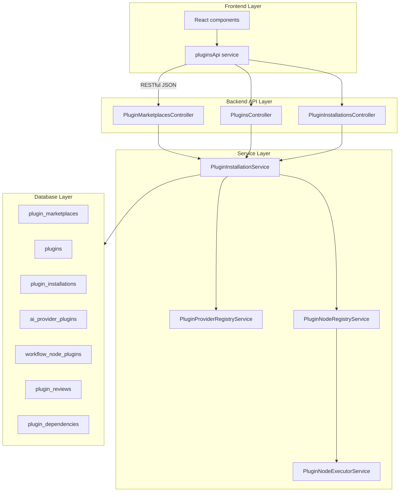

# Plugin System Reference

> **ARCHIVED 2026-06-03** — Preserved for historical context. The universal plugin
> system has been **completely removed** from the codebase. All seven tables
> (`plugins`, `plugin_marketplaces`, `plugin_installations`, `plugin_reviews`,
> `plugin_dependencies`, `ai_provider_plugins`, `workflow_node_plugins`) were
> dropped (migration `20260201200001_drop_plugin_system_tables`, which is
> explicitly irreversible) and the associated models, services, controllers, and
> frontend components no longer exist. See current docs for current state.

> Historical reference for the (now removed) universal plugin system: AI providers, workflow nodes, integrations.

## Table of Contents

- [Overview](#overview)
- [Architecture](#architecture)
- [Database Schema](#database-schema)
- [Plugin Manifest](#plugin-manifest)
- [Backend Reference](#backend-reference)
- [Frontend Reference](#frontend-reference)
- [Security](#security)
- [Workflow Integration](#workflow-integration)
- [Plugin Authoring Examples](#plugin-authoring-examples)

## Overview

The plugin system provides a platform-agnostic mechanism to extend Powernode with new AI providers, workflow nodes, and integrations without rebuilding the platform. Plugins can be installed per-account from marketplaces (git / npm / local / URL) and are hot-reloadable.

**Design principles**:

1. **Platform-agnostic** — not tied to any specific AI model or external service.
2. **Hot-reload capable** — install / uninstall without service restart.
3. **Sandboxed execution** — plugins run in isolated contexts.
4. **Dynamic discovery** — plugins register capabilities at runtime.
5. **Marketplace ecosystem** — multiple marketplaces with version management.

## Architecture



## Database Schema

### `plugin_marketplaces`

Collections of plugins from various sources.

```
id (uuid, PK)
account_id, creator_id (FKs)
name, slug, owner, description
marketplace_type ('public', 'private', 'team')
source_type ('git', 'npm', 'local', 'url')
source_url, visibility
plugin_count, average_rating
configuration (jsonb), metadata (jsonb)
```

### `plugins`

Universal plugin definitions.

```
id (uuid, PK)
account_id, creator_id, source_marketplace_id (FKs)
plugin_id (unique, e.g. 'com.example.plugin')
name, slug, description, version, author, homepage, license
plugin_types (array: ['ai_provider', 'workflow_node', ...])
source_type, source_url, source_ref
status ('available', 'installed', 'error', 'deprecated')
is_verified, is_official
manifest (jsonb)
capabilities (jsonb array)
configuration, metadata (jsonb)
install_count, download_count, average_rating, rating_count
```

### `plugin_installations`

Installed plugins per account.

```
id (uuid, PK)
account_id, plugin_id, installed_by_id (FKs)
status ('active', 'inactive', 'error', 'updating')
installed_at, last_activated_at, last_used_at
configuration (jsonb) — user-specific overrides
credentials (jsonb) — encrypted credentials
installation_metadata (jsonb)
execution_count, total_cost
```

### `ai_provider_plugins`

AI provider-specific data.

```
id (uuid, PK)
plugin_id (FK)
provider_type ('openai_compatible', 'anthropic_compatible', 'custom')
supported_capabilities (jsonb array)
models (jsonb array)
authentication_schema (jsonb)
default_configuration (jsonb)
```

### `workflow_node_plugins`

Workflow node-specific data.

```
id (uuid, PK)
plugin_id (FK)
node_type (unique identifier)
node_category ('data', 'logic', 'integration', 'ai', 'custom')
input_schema, output_schema, configuration_schema (jsonb)
ui_configuration (jsonb) — icon, color, layout
```

## Plugin Manifest

```json
{
  "manifest_version": "1.0.0",
  "plugin": {
    "id": "com.example.my-provider",
    "name": "My Custom AI Provider",
    "version": "1.2.3",
    "author": "Company Name",
    "description": "Custom AI provider integration",
    "homepage": "https://example.com/plugin",
    "license": "MIT",
    "tags": ["ai-provider", "llm", "custom"],
    "icon": "https://example.com/icon.png"
  },

  "compatibility": {
    "powernode_version": ">=1.0.0",
    "platform": ["linux", "darwin", "win32"],
    "dependencies": {
      "required": [],
      "optional": []
    }
  },

  "plugin_types": ["ai_provider"],

  "ai_provider": {
    "provider_type": "custom_llm",
    "capabilities": ["text_generation", "streaming", "function_calling", "embeddings"],
    "models": [
      {
        "id": "custom-model-v1",
        "name": "Custom Model V1",
        "context_window": 4096,
        "max_tokens": 2048,
        "pricing": { "input_per_1k": 0.001, "output_per_1k": 0.002 }
      }
    ],
    "authentication": {
      "type": "api_key",
      "fields": [
        { "name": "api_key", "label": "API Key", "type": "secret", "required": true },
        { "name": "base_url", "label": "Base URL", "type": "url", "required": false,
          "default": "https://api.example.com/v1" }
      ]
    },
    "configuration": {
      "default_model": "custom-model-v1",
      "timeout_seconds": 30,
      "max_retries": 3
    }
  },

  "workflow_nodes": [
    {
      "node_type": "custom_processor",
      "name": "Custom Data Processor",
      "description": "Processes data with custom logic",
      "category": "data",
      "icon": "processor",
      "color": "#6366f1",
      "input_schema": {
        "type": "object",
        "properties": { "data": {"type": "string"}, "options": {"type": "object"} },
        "required": ["data"]
      },
      "output_schema": {
        "type": "object",
        "properties": { "result": {"type": "string"}, "metadata": {"type": "object"} }
      },
      "configuration_schema": {
        "type": "object",
        "properties": {
          "mode": { "type": "string", "enum": ["fast", "accurate"], "default": "fast" }
        }
      }
    }
  ],

  "permissions": ["network.http", "storage.read", "ai.execute"],

  "lifecycle": {
    "install": "scripts/install.js",
    "uninstall": "scripts/uninstall.js",
    "activate": "scripts/activate.js",
    "deactivate": "scripts/deactivate.js"
  },

  "endpoints": {
    "health_check": "/health",
    "provider_execute": "/ai/execute",
    "node_execute": "/workflow/execute"
  }
}
```

## Backend Reference

### File Layout

```
server/
├── db/migrate/
│   └── *_create_universal_plugin_system.rb
├── app/
│   ├── models/
│   │   ├── plugin.rb
│   │   ├── plugin_marketplace.rb
│   │   ├── plugin_installation.rb
│   │   ├── ai_provider_plugin.rb
│   │   ├── workflow_node_plugin.rb
│   │   ├── plugin_review.rb
│   │   └── plugin_dependency.rb
│   ├── services/
│   │   ├── plugin_installation_service.rb
│   │   ├── plugin_provider_registry_service.rb
│   │   ├── plugin_node_registry_service.rb
│   │   └── plugin_node_executor_service.rb
│   └── controllers/api/v1/
│       ├── plugin_marketplaces_controller.rb
│       ├── plugins_controller.rb
│       └── plugin_installations_controller.rb
```

### API Endpoints

**Plugin Marketplaces:**

```
GET    /api/v1/plugin_marketplaces
POST   /api/v1/plugin_marketplaces
GET    /api/v1/plugin_marketplaces/:id
PATCH  /api/v1/plugin_marketplaces/:id
DELETE /api/v1/plugin_marketplaces/:id
POST   /api/v1/plugin_marketplaces/:id/sync
```

**Plugins:**

```
GET    /api/v1/plugins
POST   /api/v1/plugins
GET    /api/v1/plugins/:id
PATCH  /api/v1/plugins/:id
DELETE /api/v1/plugins/:id
POST   /api/v1/plugins/:id/install
DELETE /api/v1/plugins/:id/uninstall
GET    /api/v1/plugins/search?q=query
GET    /api/v1/plugins/by_capability?capability=text_generation
```

**Plugin Installations:**

```
GET    /api/v1/plugin_installations
GET    /api/v1/plugin_installations/:id
PATCH  /api/v1/plugin_installations/:id
POST   /api/v1/plugin_installations/:id/activate
POST   /api/v1/plugin_installations/:id/deactivate
PATCH  /api/v1/plugin_installations/:id/configure
POST   /api/v1/plugin_installations/:id/set_credential
```

## Frontend Reference

### File Layout

```
frontend/src/
├── shared/
│   ├── types/plugin.ts
│   └── services/ai/
│       ├── PluginsApiService.ts
│       └── index.ts
└── features/ai/components/
    ├── PluginMarketplaceManager.tsx
    ├── PluginBrowser.tsx
    └── PluginInstaller.tsx
```

### TypeScript Types

Defined in `shared/types/plugin.ts`:

- `PluginMarketplace`
- `Plugin`
- `PluginInstallation`
- `PluginManifest`
- `AiProviderConfig`
- `WorkflowNodeConfig`
- Request / response types for the above

### API Service Usage

```typescript
import { pluginsApi } from '@/shared/services/ai';

// List available plugins
const plugins = await pluginsApi.listPlugins();

// Install a plugin
const installation = await pluginsApi.installPlugin(pluginId, {
  configuration: { /* custom config */ }
});

// Configure credentials
await pluginsApi.setInstallationCredential(installationId, {
  credential_key: 'api_key',
  credential_value: 'sk-...'
});
```

## Security

### Credential Encryption

```ruby
def encrypt_credential(value)
  Rails.application.message_encryptor(:plugins).encrypt_and_sign(value)
end

def decrypt_credential(encrypted_value)
  Rails.application.message_encryptor(:plugins).decrypt_and_verify(encrypted_value)
end
```

### Permission Enforcement

```typescript
const canManagePlugins = currentUser?.permissions?.includes('plugins.manage');
```

```ruby
before_action :require_permission('plugins.manage'),
              only: %i[create update destroy]
```

### Sandboxing (Future Enhancement)

- Resource limits (CPU, memory, network)
- Filesystem access restrictions
- API rate limiting per plugin
- Execution timeout enforcement

## Workflow Integration

### Plugin-Based Workflow Nodes

1. Plugin nodes appear in the workflow node palette after installation.
2. Drag-and-drop onto the canvas.
3. Configure using the plugin's configuration schema.
4. Execute as part of a workflow run.

```ruby
# In workflow execution service
if node.plugin_id.present?
  executor = PluginNodeExecutorService.new(
    node_execution: node_execution,
    account: account
  )
  result = executor.execute(input_data)
end

# When a plugin is installed
registry = PluginNodeRegistryService.new(account: account)
registry.register_node_plugin(installation)
```

## Plugin Authoring Examples

### AI Provider Plugin

**1. Create manifest** (`plugin.json`):

```json
{
  "manifest_version": "1.0.0",
  "plugin": {
    "id": "com.example.groq-provider",
    "name": "Groq AI Provider",
    "version": "1.0.0",
    "author": "Example Corp"
  },
  "plugin_types": ["ai_provider"],
  "ai_provider": {
    "provider_type": "openai_compatible",
    "capabilities": ["text_generation", "streaming"],
    "models": [{ "id": "llama2-70b", "name": "Llama 2 70B" }],
    "authentication": {
      "type": "api_key",
      "fields": [{ "name": "api_key", "type": "secret", "required": true }]
    }
  }
}
```

**2. Register**

```ruby
plugin = Plugin.create!(
  account: account,
  creator: user,
  plugin_id: 'com.example.groq-provider',
  name: 'Groq AI Provider',
  version: '1.0.0',
  plugin_types: ['ai_provider'],
  manifest: manifest_json
)
```

**3. Install**

```ruby
service = PluginInstallationService.new
installation = service.install_plugin(plugin, account, user)
```

**4. Provide credentials**

```ruby
installation.set_credential('api_key', 'gsk_...')
```

**5. Use** — the provider appears in AI agent node configuration automatically.

### Workflow Node Plugin

**1. Manifest:**

```json
{
  "plugin_types": ["workflow_node"],
  "workflow_nodes": [{
    "node_type": "json_transformer",
    "name": "JSON Transformer",
    "category": "data",
    "input_schema": {"type": "object"},
    "output_schema": {"type": "object"}
  }]
}
```

**2. Install:**

```typescript
const installation = await pluginsApi.installPlugin(pluginId);
```

**3. Use in workflow builder** — the new "JSON Transformer" node appears in the palette.

### Tracked Metrics

- Installation count per plugin
- Execution count per installation
- Cost tracking (for AI provider plugins)
- Usage patterns
- Error rates

### Health Monitoring

```ruby
installation.status            # 'active', 'inactive', 'error'
installation.last_used_at
installation.execution_count
installation.total_cost
```

### Testing

```bash
# Backend
cd server && bundle exec rspec spec/models/plugin_spec.rb
cd server && bundle exec rspec spec/services/plugin_*_spec.rb
cd server && bundle exec rspec spec/controllers/api/v1/plugin*_spec.rb

# Frontend
cd frontend && CI=true npm test PluginsApiService.test.ts
```

---

## Related docs

- [node-executors.md](node-executors.md) — Built-in workflow node executors (also archived; removed subsystem)
- [../../concepts/mcp-and-tools.md](../../concepts/mcp-and-tools.md) — MCP tools sibling system
- [../../guides/extensions.md](../../guides/extensions.md) — Writing extensions

## Materials previously at

- `docs/platform/UNIVERSAL_PLUGIN_SYSTEM.md`

_Last verified: 2026-06-03_
