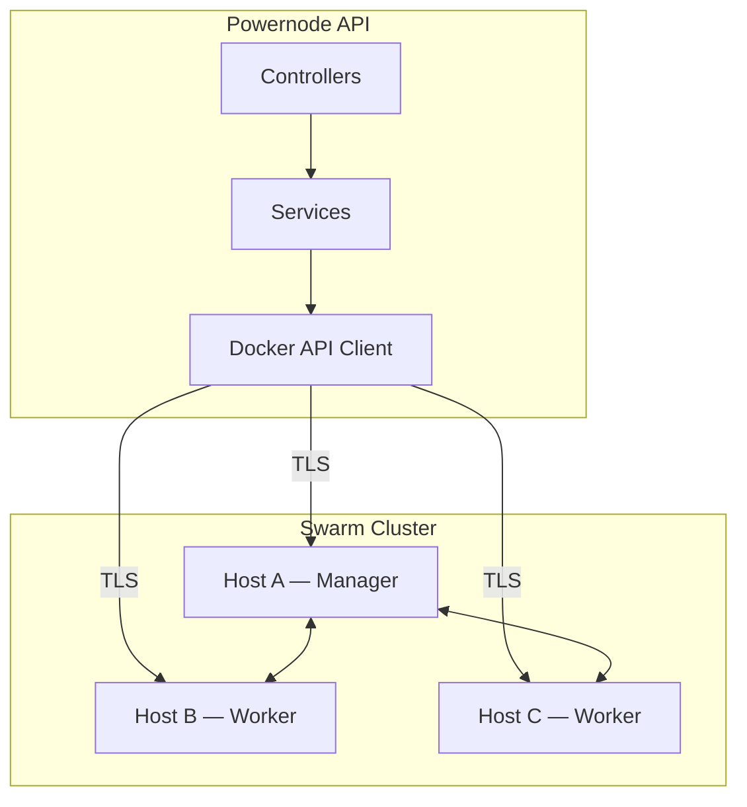

# Docker Swarm Operations

> Status: active
>
> When to use this runbook: operating Docker hosts and Swarm clusters that Powernode manages via its DevOps API.

## Table of Contents

- [Prerequisites](#prerequisites)
- [When to use this](#when-to-use-this)
- [Architecture](#architecture)
- [Docker Host Management](#docker-host-management)
- [Swarm Cluster Operations](#swarm-cluster-operations)
- [Deployment Strategies](#deployment-strategies)
- [Service Layer Reference](#service-layer-reference)
- [API Endpoints](#api-endpoints)
- [Procedure — Adding a New Docker Host](#procedure--adding-a-new-docker-host)
- [Procedure — Deploying to Swarm](#procedure--deploying-to-swarm)
- [Procedure — Container Execution Lifecycle](#procedure--container-execution-lifecycle)
- [Verification](#verification)
- [Rollback](#rollback)
- [Monitoring](#monitoring)
- [Security](#security)
- [Troubleshooting](#troubleshooting)

## Prerequisites

- Docker Engine on every managed host (TLS-enabled API recommended)
- Network reachability from the Powernode backend to each host's Docker API endpoint (default port 2376)
- For Swarm: at least one manager node, ideally three for quorum
- `devops.docker.manage` / `devops.swarm.manage` permissions on the user invoking actions
- HashiCorp Vault reachable from the backend (for container secret provisioning)

## When to use this

- Onboarding a new Docker host into the managed fleet
- Setting up or expanding a Docker Swarm cluster
- Deploying or rolling back a stack
- Investigating a failed host sync or stuck container instance

## Architecture



Powernode supports:

- **Standalone Docker hosts** — individual Docker daemon management
- **Swarm clusters** — multi-node cluster orchestration
- **Hybrid deployments** — mix of standalone and clustered hosts

## Docker Host Management

### Registering a Host

Required fields:

- `name` — unique per account
- `api_endpoint` — Docker Engine API URL (e.g. `https://docker.example.com:2376`)
- `environment` — `staging`, `production`, `development`, or `custom`

TLS configuration:

- `tls_verify` — enable TLS verification
- Encrypted TLS credentials stored via `encrypted_tls_credentials`

### Host Sync

Hosts auto-sync on configurable intervals (30s–3600s):

- Container inventory
- Image inventory
- System info (Docker version, OS, architecture, resources)
- Event stream

Health monitoring:

- Consecutive failures tracked
- Auto-transitions to `error` status after 5 consecutive failures
- Manual recovery via `record_success!`

### Host Statuses

| Status | Description |
|--------|-------------|
| `pending` | Newly registered, not yet connected |
| `connected` | Active and syncing |
| `disconnected` | Connection lost, not syncing |
| `error` | Multiple consecutive failures |
| `maintenance` | Manually taken offline |

## Swarm Cluster Operations

Swarm clusters are registered similarly to Docker hosts but represent the manager node endpoint.

Auto-sync capabilities:

- Node inventory and status
- Service definitions and replica counts
- Stack deployments
- Cluster events

### Cluster Resources

**Nodes (`Devops::SwarmNode`):**

- Manager and worker node tracking
- Availability and status monitoring
- Resource capacity reporting

**Services (`Devops::SwarmService`):**

- Service definition management
- Replica scaling
- Update and rollback configuration

**Stacks (`Devops::SwarmStack`):**

- Docker Compose-based stack deployment
- Multi-service orchestration
- Stack-level health monitoring

**Deployments (`Devops::SwarmDeployment`):**

- Deployment history tracking
- Rollback support
- Blue / green and canary deployment strategies

## Deployment Strategies

### Blue-Green

`Devops::DeploymentStrategies::BlueGreenStrategy`

1. Deploy new version alongside existing (blue → green)
2. Run health checks on the green deployment
3. Switch traffic from blue to green
4. Keep blue available for instant rollback

### Canary

`Devops::DeploymentStrategies::CanaryStrategy`

1. Deploy new version to a subset of nodes
2. Monitor error rates and performance
3. Gradually increase traffic to the new version
4. Full rollout or automatic rollback on failures

## Service Layer Reference

### Docker API Client (`Devops::Docker::ApiClient`)

Low-level Docker Engine API communication with TLS support.

### Manager Services

| Service | Operations |
|---------|-----------|
| `ContainerManager` | create, start, stop, restart, remove, logs, exec |
| `HostManager` | register, connect, disconnect, sync, health check |
| `ImageManager` | pull, build, tag, push, remove, inspect |
| `NetworkManager` | create, remove, connect, disconnect, inspect |
| `VolumeManager` | create, remove, inspect, prune |
| `ServiceManager` | create, update, scale, remove, logs |
| `StackManager` | deploy, remove, list services, status |
| `SwarmManager` | init, join, leave, update, inspect |
| `NodeManager` | list, inspect, update, promote, demote |
| `SecretManager` | create, update, remove, inspect |
| `HealthMonitor` | host / container / cluster health |

### Container Orchestration Service

`Devops::ContainerOrchestrationService` provides high-level container lifecycle management:

- Template-based container creation
- Resource quota enforcement via `QuotaService`
- Vault token provisioning for secrets
- Execution timeout management
- Cleanup and resource reclamation

## API Endpoints

Every operation below is also exposed as a `docker_*` MCP tool (containers, services, stacks, clusters/nodes, secrets/configs, hosts, images, networks, volumes) for agent-driven orchestration. For the full per-tool parameter list see the auto-generated catalog: [reference/auto/mcp-tools.md](../reference/auto/mcp-tools.md).

### Docker Endpoints

```
GET    /api/v1/devops/docker/hosts
POST   /api/v1/devops/docker/hosts
GET    /api/v1/devops/docker/hosts/:id
PUT    /api/v1/devops/docker/hosts/:id
DELETE /api/v1/devops/docker/hosts/:id

# Sub-resources are nested under a host (hosts/:host_id/...)
GET    /api/v1/devops/docker/hosts/:host_id/containers
GET    /api/v1/devops/docker/hosts/:host_id/images
GET    /api/v1/devops/docker/hosts/:host_id/networks
GET    /api/v1/devops/docker/hosts/:host_id/volumes
GET    /api/v1/devops/docker/hosts/:host_id/events
GET    /api/v1/devops/docker/hosts/:host_id/activities
```

### Swarm Endpoints

```
GET    /api/v1/devops/swarm/clusters
POST   /api/v1/devops/swarm/clusters
GET    /api/v1/devops/swarm/clusters/:id
PUT    /api/v1/devops/swarm/clusters/:id
DELETE /api/v1/devops/swarm/clusters/:id

# Sub-resources are nested under a cluster (clusters/:cluster_id/...)
GET    /api/v1/devops/swarm/clusters/:cluster_id/nodes
GET    /api/v1/devops/swarm/clusters/:cluster_id/services
GET    /api/v1/devops/swarm/clusters/:cluster_id/stacks
GET    /api/v1/devops/swarm/clusters/:cluster_id/deployments
GET    /api/v1/devops/swarm/clusters/:cluster_id/events
GET    /api/v1/devops/swarm/clusters/:cluster_id/networks
GET    /api/v1/devops/swarm/clusters/:cluster_id/volumes
GET    /api/v1/devops/swarm/clusters/:cluster_id/secrets
GET    /api/v1/devops/swarm/clusters/:cluster_id/configs
```

## Procedure — Adding a New Docker Host

1. Register the host via API:
   ```bash
   curl -X POST https://api.powernode.example.com/api/v1/devops/docker/hosts \
     -H "Authorization: Bearer <jwt>" \
     -H "Content-Type: application/json" \
     -d '{
       "host": {
         "name": "docker-prod-1",
         "api_endpoint": "https://10.0.0.10:2376",
         "environment": "production",
         "tls_verify": true,
         "tls_credentials": { /* ca / cert / key — encrypted on save */ }
       }
     }'
   ```
2. System verifies connectivity (status transitions to `connected`).
3. Initial sync pulls container / image inventory.
4. Auto-sync begins at the configured interval.

## Procedure — Deploying to Swarm

1. Register the Swarm cluster with the manager node endpoint.
2. The system discovers nodes, services, and stacks.
3. Deploy a stack via API or pipeline step.
4. Monitor deployment via events and service status.

## Procedure — Container Execution Lifecycle

1. Create a `ContainerInstance` from template or direct config.
2. `pending` → Vault token provisioned → `provisioning`
3. Container started on target host → `running`
4. Resource usage tracked during execution
5. On completion: output captured, Vault token revoked → `completed` / `failed`
6. Linked A2A tasks updated with results.

## Verification

After each operation:

- `GET /api/v1/devops/docker/hosts/:id` → `status: connected`
- `GET /api/v1/devops/swarm/clusters/:id/health` → no failing nodes / quorum loss
- Container instance `status` is `running` and `container_id` populated
- No new `Devops::DockerEvent` records of severity `error` since the operation start

## Rollback

### Rolling Back a Swarm Service

```bash
curl -X POST https://api.powernode.example.com/api/v1/devops/swarm/clusters/:cluster_id/services/:id/rollback \
  -H "Authorization: Bearer <jwt>"
```

Or via Docker CLI directly on a manager:

```bash
docker service rollback <service-id>
```

### Rolling Back a Stack Deployment

There is no dedicated `redeploy` route for `deployments` (the deployments resource is read-only — `index`/`show` — and exists for history tracking). To roll back a stack, re-deploy the previous known-good Compose file via the stack `deploy` member action. Look up the prior Compose source from `Devops::SwarmDeployment` history, then:

```bash
curl -X POST https://api.powernode.example.com/api/v1/devops/swarm/clusters/:cluster_id/stacks/:id/deploy \
  -H "Authorization: Bearer <jwt>" \
  -H "Content-Type: application/json" \
  -d '{ "compose_file": "<previous compose YAML>" }'
```

## Monitoring

### Health Checks

`HealthMonitor` performs:

- Docker daemon connectivity checks
- Container health status aggregation
- Resource utilisation monitoring
- Swarm cluster quorum verification

### Event Tracking

- `Devops::DockerEvent` — container, image, network, volume events
- `Devops::DockerActivity` — user-initiated operations
- `Devops::SwarmEvent` — cluster-level events

### Resource Tracking

Container instances track:

- `memory_used_mb` / `cpu_used_millicores`
- `storage_used_bytes`
- `network_bytes_in` / `network_bytes_out`

Hosts track:

- `container_count` / `image_count`
- `memory_bytes` / `cpu_count` / `storage_bytes`
- Docker version, OS type, architecture

## Security

### TLS Communication

All Docker API communication supports TLS with:

- Encrypted credential storage
- Certificate verification toggle
- Per-host TLS configuration

### Vault Integration

Container instances integrate with HashiCorp Vault:

- Token provisioning on container creation
- Automatic token revocation on completion
- `cleanup_vault_token!` for manual cleanup

### Security Violations

Container instances record security violations:

- Violation details with detection timestamps
- `has_security_violations?` check
- Violations accessible via the instance details API

### Secrets Management

- Docker Swarm secrets via `SecretManager`
- `Devops::SecretReference` for secret tracking
- Encrypted credential storage for integrations

## Troubleshooting

| Symptom | Likely cause | First action |
|---------|--------------|--------------|
| Host stuck in `pending` | API endpoint unreachable | Verify network / firewall + curl the endpoint manually |
| Repeated `error` status | Bad TLS credentials | Re-upload credentials; check daemon TLS config |
| Stack deploy fails with "service convergence" | Image pull failure on workers | Pre-pull image on every node; check registry auth |
| Lost Swarm quorum | Manager nodes < majority | Bring lost managers back if you can; otherwise `docker swarm init --force-new-cluster` on a surviving manager (Swarm keeps its own Raft store under `/var/lib/docker/swarm` — there is no etcd to restore from), then re-join the others |
| Container `provisioning` → never `running` | Vault token issuance failure | Check Vault reachability / policy; `cleanup_vault_token!` and retry |

---

## Related runbooks

- [production-deployment.md](production-deployment.md) — Initial platform deployment
- [worker-operations.md](worker-operations.md) — Sidekiq worker that drives Docker sync
- [performance-tuning.md](performance-tuning.md) — Sizing and throughput guidance

## Materials previously at

- `docs/infrastructure/DOCKER_SWARM_OPERATIONS.md`

_Last verified: 2026-06-04_
