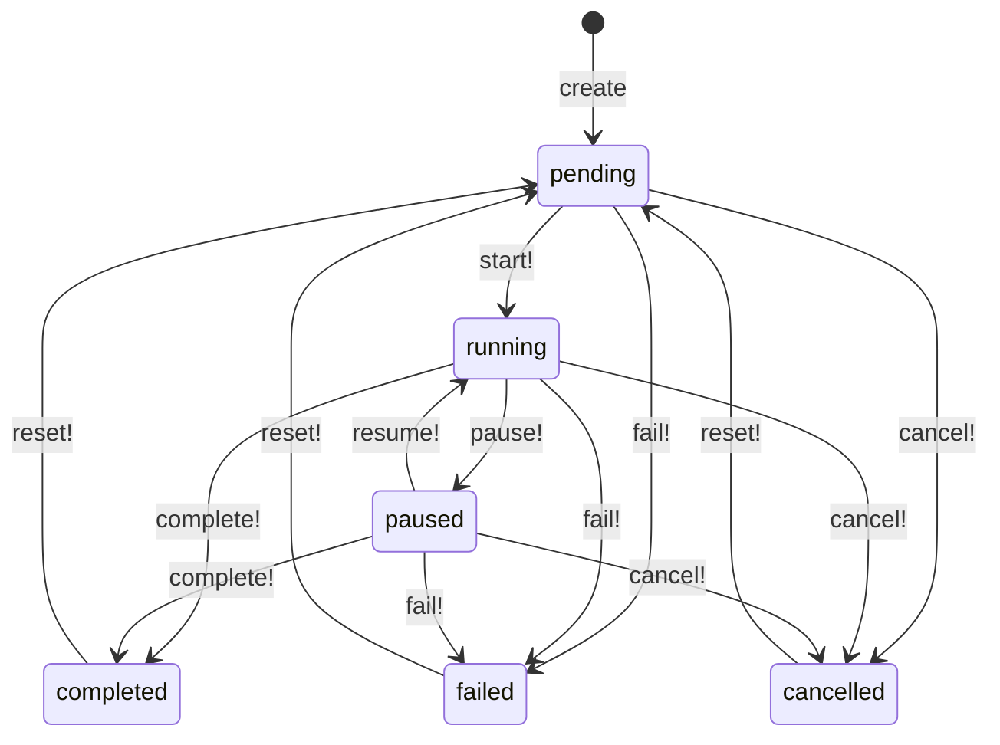

# Ralph Loops

> Status: active

When to use this runbook: monitoring, pausing, recovering, and decommissioning Ralph Loops - the repeating goal-driven loops that drive autonomous agent duty cycles (Fleet Autonomy, SDWAN Manager, CVE Responder, Trading Overseer, etc.).

## Table of Contents

- [Prerequisites](#prerequisites)
- [What are Ralph Loops?](#what-are-ralph-loops)
- [Loop lifecycle](#loop-lifecycle)
- [Scheduling modes](#scheduling-modes)
- [Procedure - Creating a Ralph Loop](#procedure---creating-a-ralph-loop)
- [Procedure - Monitoring iteration health](#procedure---monitoring-iteration-health)
- [Procedure - Pause and resume](#procedure---pause-and-resume)
- [Procedure - Failure recovery](#procedure---failure-recovery)
- [Procedure - Decommissioning a loop](#procedure---decommissioning-a-loop)
- [Common patterns](#common-patterns)
- [Verification](#verification)
- [Rollback](#rollback)
- [Troubleshooting](#troubleshooting)
- [Related runbooks](#related-runbooks)

## Prerequisites

- `ai.workflows.read` permission (read), `ai.workflows.create` (create), `ai.workflows.execute` (start/pause/resume/cancel), `ai.workflows.delete` (destroy)
- `ai.agents.update` permission (required by the `platform.*_ralph_loop` MCP tools - see `Ai::Tools::RalphLoopTool::REQUIRED_PERMISSION`)
- A configured default agent for the loop (Ralph loops fail to start without one)
- Worker running and reachable - check with `sudo scripts/systemd/powernode-installer.sh status` (look for `powernode-worker@default` active)
- For event-triggered loops: an inbound webhook reachable at the platform's public hostname

A Ralph Loop ties together a goal, a default agent, a scheduling mode, and a series of iterations that run worker jobs against a PRD or duty-cycle spec. Loops are how autonomous agents take repeating actions on their own - the Fleet Autonomy agent, for example, runs as a 60-second autonomous loop that perceives signals, gates actions, and extracts learnings. See [`../concepts/agents-and-autonomy.md#ralph-loops`](../concepts/agents-and-autonomy.md#ralph-loops) for the conceptual model.

## What are Ralph Loops?

Ralph (Recursive Agent Learning & Planning Harness) is the agentic execution engine that powers autonomous duty cycles. Each `Ai::RalphLoop` row holds:

- A `default_agent` - the agent that runs iterations when no specific agent is bound to a task
- A `scheduling_mode` - one of `manual`, `scheduled`, `continuous`, `event_triggered`, or `autonomous`
- A `status` (lifecycle state) - one of `pending`, `running`, `paused`, `completed`, `failed`, `cancelled`
- A `schedule_paused` boolean - distinct from status; pauses scheduling without state-machine transition
- Configuration: `max_iterations`, `current_iteration`, `daily_iteration_count`, `next_scheduled_at`, `schedule_config` JSON

Loops emit `AiOrchestrationChannel` ActionCable broadcasts on every state change so the dashboard updates in real time. Iterations and tasks are independent records (`Ai::RalphIteration`, `Ai::RalphTask`) so failures can be re-queued one at a time without affecting the loop.

## Loop lifecycle

State transitions are defined in `Ai::RalphLoopConcerns::StateMachine`. A loop starts in `pending`, advances to `running` via `start!`, may be `paused` (state-machine pause, not schedule-paused), and reaches one of three terminal states: `completed`, `failed`, `cancelled`.



`reset!` is the only way back from a terminal state - it clears iteration history and resets task statuses, then leaves the loop in `pending`.

The `schedule_paused` boolean is orthogonal to status. A `running` loop with `schedule_paused: true` keeps any in-flight iteration but won't start new ones. Use this when you need to keep the loop "warm" for instant resume without going through `pause!` -> `resume!`.

## Scheduling modes

Each mode has different semantics for when iterations fire. The enumeration lives in `Ai::RalphLoop::SCHEDULING_MODES`.

| Mode | Trigger | Required config | Notes |
|------|---------|-----------------|-------|
| `manual` | Operator invocation only | none | Use for one-shot loops driven by a Mission |
| `scheduled` | Cron expression matches | `schedule_config.cron_expression` | Cron parsed by Fugit; timezone defaults to UTC |
| `continuous` | Every N seconds | `schedule_config.iteration_interval_seconds` (min 60) | Use for low-latency reconcilers |
| `event_triggered` | Inbound webhook hit | none (a `webhook_token` is auto-generated on create) | Webhook endpoint: `POST /api/v1/ai/ralph_loops/webhook/:token` |
| `autonomous` | Every N minutes (duty cycle) | `duty_cycle_config.frequency_minutes` (min 5) | The Fleet Autonomy and other monitor agents run in this mode |

Daily iteration limits apply across all scheduled modes: set `schedule_config.max_iterations_per_day` and `due_for_execution` will skip the loop until tomorrow once the cap is reached.

## Procedure - Creating a Ralph Loop

There is no `platform.create_ralph_loop` MCP tool. Loops are created via the REST API at `POST /api/v1/ai/ralph_loops` because they require a PRD payload that doesn't fit cleanly into the MCP parameter schema. Once created, all subsequent operations use MCP.

```bash
TOKEN=$(curl -s -X POST http://localhost:3000/api/v1/auth/login \
  -H "Content-Type: application/json" \
  -d '{"email":"admin@powernode.org","password":"..."}' \
  | python3 -c "import sys,json; print(json.load(sys.stdin)['data']['access_token'])")

curl -s -X POST -H "Authorization: Bearer $TOKEN" \
  -H "Content-Type: application/json" \
  -d '{
    "ralph_loop": {
      "name": "Nightly fleet drift sweep",
      "description": "Detect and remediate module drift across all nodes",
      "default_agent_id": "<agent_uuid>",
      "scheduling_mode": "continuous",
      "max_iterations": 0,
      "schedule_config": {
        "iteration_interval_seconds": 300,
        "max_iterations_per_day": 24,
        "skip_if_running": true
      }
    }
  }' \
  "http://localhost:3000/api/v1/ai/ralph_loops" | jq .
```

`max_iterations: 0` means unlimited (don't cap on cumulative iterations); `max_iterations_per_day: 24` rate-limits to 24 iterations per UTC day. `skip_if_running: true` (the default) prevents pile-up if an iteration runs longer than the interval.

For a fully autonomous monitor agent (the Fleet Autonomy pattern), use `scheduling_mode: "autonomous"` with `duty_cycle_config.frequency_minutes`:

```json
{
  "ralph_loop": {
    "name": "Fleet Autonomy reconciler",
    "default_agent_id": "<fleet_autonomy_uuid>",
    "scheduling_mode": "autonomous",
    "max_iterations": 0,
    "configuration": { "duty_cycle_config": { "frequency_minutes": 1 } }
  }
}
```

After creation, start the loop:

```bash
curl -s -X POST -H "Authorization: Bearer $TOKEN" \
  "http://localhost:3000/api/v1/ai/ralph_loops/<loop_id>/start" | jq .
```

The start endpoint dispatches the first iteration to the worker; subsequent iterations are queued by the scheduler's tick.

## Procedure - Monitoring iteration health

Two MCP tools cover most monitoring: `platform.get_ralph_loop` for one loop, `platform.get_ralph_loop_statistics` for the fleet view.

Inspect a single loop:

```
platform.get_ralph_loop(loop_id: "Fleet Autonomy reconciler")
```

Returned fields to watch:

| Field | What it tells you |
|-------|-------------------|
| `status` | Lifecycle state (`running` is healthy for autonomous loops) |
| `schedule_paused` | `true` means scheduling is paused even if `status: running` |
| `daily_iteration_count` | Today's iterations - watch against `max_iterations_per_day` |
| `next_scheduled_at` | Should be in the near future for active loops; `null` for manual loops |
| `cycle_interval_minutes` | Effective interval (pulled from `schedule_config` or `duty_cycle_config`) |
| `recent_iterations` | Last 5 iterations with status, started_at, completed_at |

Fleet-wide statistics:

```
platform.get_ralph_loop_statistics()
```

Returns total loops, count by status, count of paused loops, today's total iterations, and a per-loop summary. Use this on the daily sweep to spot loops that are silently paused or stuck below their target iteration rate.

Real-time updates stream over `AiOrchestrationChannel` - the autonomy dashboard subscribes by default. Subscribe pattern:

```javascript
useWebSocket({
  channel: 'AiOrchestrationChannel',
  onMessage: (msg) => {
    if (msg.event === 'ralph_loop_progress') updateLoopState(msg.payload);
  }
});
```

## Procedure - Pause and resume

There are two pause concepts and they are not interchangeable. Use the one that matches your intent.

**Schedule pause** (`schedule_paused: true`) - keeps the loop's `status: running` but stops scheduling new iterations. In-flight iterations complete. Use for short maintenance windows or when you want zero-latency resume.

```
platform.pause_ralph_loop(loop_id: "Fleet Autonomy reconciler", reason: "Database upgrade window")
```

```
platform.resume_ralph_loop(loop_id: "Fleet Autonomy reconciler")
```

The response includes `next_scheduled_at` so you can confirm the schedule has been recalculated relative to now.

**State-machine pause** (`status: paused`) - moves the loop out of the `running` set. Use when you need to remove a loop from the autonomy fleet without deleting it. There is no MCP wrapper for state-machine pause; use the REST endpoint:

```bash
curl -s -X POST -H "Authorization: Bearer $TOKEN" \
  "http://localhost:3000/api/v1/ai/ralph_loops/<loop_id>/pause" | jq .
```

The dashboard surfaces both states distinctly. If `schedule_paused: true` and `status: running`, the UI shows "Schedule paused"; if `status: paused`, it shows "Loop paused".

## Procedure - Failure recovery

A loop typically fails in one of three ways: the worker is unreachable, the default agent is below trust threshold, or an iteration's worker job raised. The recovery procedure follows the same diagnostic path.

1. Get the loop status:

```
platform.get_ralph_loop(loop_id: "<loop_id>")
```

Note the `status` and `recent_iterations[0].status`.

2. Read worker logs for the failed iteration:

```bash
journalctl -u powernode-worker@default --since "1 hour ago" | grep "RalphTask\|RalphIteration\|<loop_id>"
```

Patterns to watch for: `WorkerJobService::WorkerServiceError` (worker unreachable), `Ai::Autonomy::ExecutionGateService` denial (trust score blocked the action), `ActiveRecord::RecordInvalid` (config drift between loop and current code).

3. List stuck tasks from a Rails console session:

```ruby
loop_record = Ai::RalphLoop.find(loop_id)
loop_record.ralph_tasks.where(status: "failed").pluck(:id, :name, :error_message, :execution_attempts)
```

4. Re-queue a single failed task by resetting its status and dispatching:

```ruby
task = Ai::RalphTask.find(task_id)
task.update!(status: "pending", error_message: nil, execution_attempts: 0)
WorkerJobService.enqueue_ai_ralph_task(task.id)
```

5. Restart the loop. If the loop is in `failed` state, use `reset!` then `start_loop`:

```bash
curl -s -X POST -H "Authorization: Bearer $TOKEN" \
  "http://localhost:3000/api/v1/ai/ralph_loops/<loop_id>/reset"

curl -s -X POST -H "Authorization: Bearer $TOKEN" \
  "http://localhost:3000/api/v1/ai/ralph_loops/<loop_id>/start"
```

6. For repeated failures from the same agent, check trust score and intervention policies:

```
platform.agent_introspect(agent_id: "<default_agent_id>")
platform.list_intervention_policies(agent_id: "<default_agent_id>")
```

If the agent has been demoted, see [agent-autonomy-operations.md#procedure---demoting-an-agent](agent-autonomy-operations.md#procedure---demoting-an-agent) for the restore path.

## Procedure - Decommissioning a loop

`platform.delete_ralph_loop` is idempotent at the controller boundary (404 on already-deleted) and cascades via `dependent: :destroy` to all `Ai::RalphTask`, `Ai::RalphIteration`, and notification records.

```
platform.delete_ralph_loop(loop_id: "Nightly fleet drift sweep")
```

The REST endpoint enforces an additional safety check: a running loop cannot be deleted directly. Cancel it first:

```bash
curl -s -X POST -H "Authorization: Bearer $TOKEN" \
  "http://localhost:3000/api/v1/ai/ralph_loops/<loop_id>/cancel"

# Then either MCP delete or REST delete:
curl -s -X DELETE -H "Authorization: Bearer $TOKEN" \
  "http://localhost:3000/api/v1/ai/ralph_loops/<loop_id>"
```

Cascade behavior:

- `Ai::RalphTask` records: destroyed
- `Ai::RalphIteration` records: destroyed (these hold execution output, token usage, learnings)
- ActionCable subscriptions on `AiOrchestrationChannel` for this loop: cleaned up on next tick

Audit log entry `ai.ralph_loops.delete` is recorded against `Audit::Event` before destruction.

## Common patterns

**Continuous self-improvement loop** (Fleet Autonomy pattern):

```json
{
  "ralph_loop": {
    "name": "Self-improvement reconciler",
    "default_agent_id": "<monitor_agent_uuid>",
    "scheduling_mode": "autonomous",
    "max_iterations": 0,
    "configuration": { "duty_cycle_config": { "frequency_minutes": 5 } }
  }
}
```

Loop runs every 5 minutes; the agent perceives signals, picks an action category, runs it through intervention policies, and extracts a learning if anything changed.

**Scheduled audit loop** (CVE Responder pattern):

```json
{
  "ralph_loop": {
    "name": "Hourly CVE feed sweep",
    "default_agent_id": "<cve_responder_uuid>",
    "scheduling_mode": "scheduled",
    "max_iterations": 0,
    "schedule_config": {
      "cron_expression": "0 * * * *",
      "timezone": "UTC",
      "max_iterations_per_day": 24
    }
  }
}
```

Cron expression runs hourly; the agent ingests CVE feeds, matches against the platform's SBOM, and surfaces critical exposures.

**Webhook-triggered repo loop** (Code Factory / Mission pattern):

```json
{
  "ralph_loop": {
    "name": "PR remediation loop",
    "default_agent_id": "<remediation_agent_uuid>",
    "scheduling_mode": "event_triggered",
    "max_iterations": 3,
    "repository_url": "https://git.ipnode.org/account/repo.git",
    "branch": "feature/remediation"
  }
}
```

`webhook_token` is auto-generated on create. Configure the upstream webhook (Gitea push, GitHub PR review, etc.) to `POST /api/v1/ai/ralph_loops/webhook/<token>` with the event payload; each hit dispatches a new iteration up to `max_iterations`.

## Verification

After any intervention:

- `platform.get_ralph_loop(loop_id: ...)` returns expected `status` and `schedule_paused`
- `platform.get_ralph_loop_statistics` shows the loop in the correct bucket
- `GET /api/v1/ai/monitoring/health` returns `data.healthy: true`
- Worker is consuming jobs: `journalctl -u powernode-worker@default --since "5 minutes ago" | grep -c RalphTask` should increase if iterations are firing
- `sudo scripts/systemd/powernode-installer.sh status` reports all services active

For scheduled loops, confirm `next_scheduled_at` is in the future and within one interval of `Time.current`.

## Rollback

**Stop an unhealthy loop without deleting:**

```
platform.pause_ralph_loop(loop_id: "<loop_id>", reason: "Investigating runaway iterations")
```

This stops scheduling within milliseconds. In-flight iterations complete normally.

**Halt every autonomous loop on the platform** (emergency stop - this halts the entire AI plane, not just Ralph):

```
platform.emergency_halt()
```

`AiSuspensionCheckConcern` in worker jobs checks the kill switch before each Ralph task executes; halted state causes tasks to exit gracefully without consuming budget or producing partial state. Confirm the halt:

```
platform.kill_switch_status()
```

Resume once the issue is resolved:

```
platform.emergency_resume()
```

See [agent-autonomy-operations.md#rollback](agent-autonomy-operations.md#rollback) for the full kill switch flow.

## Troubleshooting

| Symptom | Likely cause | First action |
|---------|--------------|--------------|
| Loop status `running` but no recent iterations | `schedule_paused: true` or daily limit reached | `platform.get_ralph_loop(loop_id:)`; check `daily_iteration_count` vs `max_iterations_per_day` |
| `next_scheduled_at` is null on a `continuous` loop | `schedule_config.iteration_interval_seconds` missing or below 60s minimum | `platform.update_ralph_loop` to set `cycle_interval_minutes`; or fix the schedule_config via REST |
| Iterations fail with `Ai::Autonomy::ExecutionGateService` denial | Default agent below trust threshold for the action category | Check `platform.agent_introspect(agent_id:)` and update trust score or intervention policy |
| Loop won't start - "default_agent must be present" | `default_agent_id` not set on create, or agent was deleted | `platform.update_ralph_loop(loop_id:, default_agent_id:)` to repoint to a live agent |
| Cron loop fires multiple times per minute | `cron_expression` is `* * * * *` (every minute) and iterations finish faster than the scheduler ticks | Tighten cron to a sane interval; add `max_iterations_per_day` cap |

For stuck tasks in Sidekiq:

```bash
# From the worker host
journalctl -u powernode-worker@default -f | grep -i "RalphTask\|stuck\|timeout"

# Or via Sidekiq HTTP API (worker-web service)
curl -s http://localhost:4567/queues.json | jq '.queues | map(select(.queue == "ai_execution"))'
```

## Related runbooks

- [agent-autonomy-operations.md](agent-autonomy-operations.md) - trust scores and tier management for loop agents
- [../guides/intervention-policies-guide.md](../guides/intervention-policies-guide.md) - per-action policies that gate loop iterations
- [ai-operations.md](ai-operations.md) - daily AI ops checklist
- [worker-operations.md](worker-operations.md) - worker job dispatch, queue depth, restart safety
- [../concepts/agents-and-autonomy.md](../concepts/agents-and-autonomy.md) - Ralph Loops conceptual model

_Last verified: 2026-05-19_
