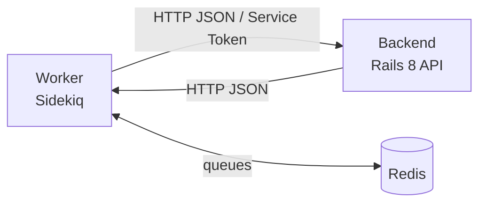

# Worker Operations

> Status: active
>
> When to use this runbook: operating the standalone Sidekiq worker that powers asynchronous platform jobs.

## Table of Contents

- [Prerequisites](#prerequisites)
- [When to use this](#when-to-use-this)
- [Architecture](#architecture)
- [Job Categories](#job-categories)
- [Queue Configuration](#queue-configuration)
- [Service Management](#service-management)
- [Scheduled Jobs](#scheduled-jobs)
- [Worker Services](#worker-services)
- [Job Pattern](#job-pattern)
- [Verification](#verification)
- [Rollback](#rollback)
- [Troubleshooting](#troubleshooting)

## Prerequisites

- Worker service installed via `sudo scripts/systemd/powernode-installer.sh install`
- Backend API reachable from the worker host
- Redis reachable at the configured URL (default `redis://localhost:6379/1`)
- `WORKER_TOKEN` matches the value the backend expects
- For ad-hoc operations: SSH access + sudo on the worker host

## When to use this

- Diagnosing a stuck or backed-up queue
- Adding capacity for AI / DevOps workloads
- Verifying scheduled jobs after a release
- Rolling back a faulty job class without taking down the platform

## Architecture



**Critical rules:**

- Jobs belong in `worker/app/jobs/` — NEVER `server/app/jobs/`
- Worker communicates via HTTP API only — no direct DB access
- Never add Sidekiq gems to `server/Gemfile`

## Job Categories

### AI Jobs

The largest category — covers the entire AI platform. Selected examples:

| Job | Queue | Description |
|-----|-------|-------------|
| `AiAgentExecutionJob` | `ai_agents` | Execute AI agent with provider orchestration |
| `AiTeamExecutionJob` | `ai_execution` | Multi-agent team orchestration |
| `AiChatResponseJob` | `ai_conversations` | AI conversation response generation |
| `AiChatAttachmentProcessingJob` | `ai_conversations` | Process chat attachments |
| `AiMissionAnalyzeJob` | `ai_agents` | Mission analysis stage (Ralph) |
| `AiMissionPlanJob` | `ai_agents` | Mission planning stage |
| `AiMissionExecuteJob` | `ai_agents` | Mission execution stage |
| `AiMissionTestJob` | `ai_agents` | Mission testing stage |
| `AiMissionReviewJob` | `ai_agents` | Mission review stage |
| `AiMissionDeployJob` | `ai_agents` | Mission deployment stage |
| `AiMissionMergeJob` | `ai_agents` | Mission merge stage |
| `AiMissionCleanupJob` | `ai_agents` | Mission cleanup |
| `AiMemoryMaintenanceJob` | `ai_orchestration` | Memory pool maintenance |
| `AiMemoryPoolCleanupJob` | `ai_orchestration` | Pool cleanup |
| `AiConsolidateMemoryEntryJob` | `ai_orchestration` | Individual entry consolidation |
| `AiCompoundLearningMaintenanceJob` | `ai_orchestration` | Learning decay and maintenance |
| `AiDedupLearningJob` | `ai_orchestration` | Learning deduplication |
| `AiPromoteLearningJob` | `ai_orchestration` | Learning promotion to shared |
| `AiSharedKnowledgeMaintenanceJob` | `ai_orchestration` | Shared knowledge quality maintenance |
| `AiKnowledgeDocSyncJob` | `ai_orchestration` | Knowledge → doc sync |
| `AiKnowledgeGraphMaintenanceJob` | `ai_orchestration` | Graph maintenance |
| `AiUpdateGraphNodeJob` | `ai_orchestration` | Graph node updates |
| `AiSkillSyncJob` | `ai_orchestration` | Skill synchronisation |
| `AiSkillConflictCheckJob` | `ai_orchestration` | Skill conflict detection |
| `AiSkillLifecycleMaintenanceJob` | `ai_orchestration` | Skill decay and re-embedding |
| `AiToolDiscoveryIndexJob` | `ai_orchestration` | Tool discovery indexing |
| `AiToolHealthCheckJob` | `ai_orchestration` | Tool health checks |
| `AiDiscoveryScanJob` | `ai_orchestration` | Agent discovery scanning |
| `AiProviderHealthCheckJob` | `ai_orchestration` | Provider health monitoring |
| `AiProviderModelSyncJob` | `ai_orchestration` | Provider model sync |
| `AiPricingSyncJob` | `ai_orchestration` | Model pricing sync |
| `AiTrustDecayJob` | `ai_orchestration` | Agent trust score decay |
| `AiContextCompressionJob` | `ai_orchestration` | Context compression |
| `AiContextRotDetectionJob` | `ai_orchestration` | Stale context detection |
| `AiGuardrailEvaluationJob` | `ai_orchestration` | Safety guardrail evaluation |
| `AiMonitoringAnalysisJob` | `ai_orchestration` | AI usage analysis |
| `AiMonitoringHealthCheckJob` | `ai_orchestration` | AI health monitoring |
| `AiPredictiveMonitorJob` | `ai_orchestration` | Predictive monitoring |
| `AiTeamMessageCleanupJob` | `ai_orchestration` | Team message cleanup |
| `AiTeamOptimizeJob` | `ai_orchestration` | Team optimisation |
| `AiTrajectoryBuildJob` | `ai_orchestration` | Execution trajectory building |
| `AiA2aExternalTaskJob` | `ai_agents` | A2A external task handling |
| `AiA2aTaskExecutionJob` | `ai_agents` | A2A task execution |
| `AiBudgetReconciliationJob` | `ai_orchestration` | Cost budget reconciliation |
| `AiBudgetRolloverJob` | `ai_orchestration` | Monthly budget rollover |
| `AiWebhookDeliveryJob` | `ai_orchestration` | AI webhook delivery |
| `AiWorkspaceResponseJob` | `ai_conversations` | Workspace response handling |
| `AiConversationResponseJob` | `ai_conversations` | Conversation response generation |
| `AiEscalationTimeoutJob` | `ai_orchestration` | Autonomy escalation timeout enforcement |
| `AiGoalMaintenanceJob` | `maintenance` | Agent goal lifecycle maintenance |
| `AiInterventionPolicyTuningJob` | `maintenance` | Auto-tune intervention policies from approval patterns |
| `AiObservationCleanupJob` | `maintenance` | Clean expired agent observations |
| `AiObservationPipelineJob` | `ai_orchestration` | Collect sensor data for autonomous agent monitoring |
| `AiProposalExpiryJob` | `maintenance` | Expire unreviewed agent proposals |
| `AiSelfHealingMonitorJob` | `ai_orchestration` | Autonomous self-healing monitor |
| `AiTrajectoryAnalysisJob` | `ai_orchestration` | Execution trajectory analysis |
| `AiConflictDetectionJob` | `ai_execution` | Worktree conflict detection |
| `AiMergeExecutionJob` | `ai_execution` | Mission merge execution |
| `AiRalphLoopRunAllJob` | `ai_execution` | Ralph loop batch runner |
| `AiRalphLoopSchedulerJob` | `ai_orchestration` | Ralph loop scheduling |
| `AiRunnerDispatchPollJob` | `ai_execution` | Runner dispatch polling |
| `AiWorktreeCleanupJob` | `ai_execution` | Worktree cleanup |
| `AiWorktreeProvisioningJob` | `ai_execution` | Worktree provisioning |
| `AiWorktreePushAndPrJob` | `ai_execution` | Worktree push and PR creation |
| `AiWorktreeTimeoutJob` | `ai_execution` | Worktree session timeout |

### Analytics

| Job | Queue | Description |
|-----|-------|-------------|
| `Analytics::LiveMetricsJob` | `analytics` | Real-time metrics updates |
| `Analytics::MetricsAggregationJob` | `analytics` | Periodic metrics aggregation |
| `Analytics::RecalculateAnalyticsJob` | `analytics` | Full analytics recalculation |

### Compliance

| Job | Queue | Description |
|-----|-------|-------------|
| `Compliance::AccountTerminationJob` | `compliance` | GDPR account termination |
| `Compliance::DataDeletionJob` | `compliance` | Right to be forgotten |
| `Compliance::DataExportJob` | `compliance` | Data portability export |
| `Compliance::DataRetentionEnforcementJob` | `compliance` | Retention policy enforcement |

### DevOps

| Job | Queue | Description |
|-----|-------|-------------|
| `Devops::ApprovalExpiryJob` | `devops_high` | Deployment approval expiry |
| `Devops::ApprovalNotificationJob` | `devops_high` | Deployment approval notification |
| `Devops::ClaudeInvokeJob` | `devops_default` | Claude Code invocation |
| `Devops::DeploymentJob` | `devops_high` | Deployment execution |
| `Devops::ProviderSyncJob` | `devops_default` | Provider synchronisation |
| `Devops::ScheduleTriggerJob` | `devops_default` | Scheduled pipeline triggers |
| `Devops::SecurityScanJob` | `devops_default` | Security scanning |
| `Devops::StepExecutionJob` | `devops_default` | Pipeline step execution |
| `Devops::WebhookHandlerJob` | `devops_webhooks` | DevOps webhook processing |

### Docker

| Job | Queue | Description |
|-----|-------|-------------|
| `Docker::EventCleanupJob` | `maintenance` | Docker event cleanup |
| `Docker::HealthCheckJob` | `devops_default` | Docker host health checks |
| `Docker::HostSyncJob` | `devops_default` | Docker host synchronisation |

### Git

| Job | Queue | Description |
|-----|-------|-------------|
| `Git::CredentialSetupJob` | `devops_default` | Git credential provisioning |
| `Git::JobLogsSyncJob` | `devops_default` | Pipeline job log sync |
| `Git::PipelineApprovalExpiryJob` | `devops_default` | Pipeline approval timeout |
| `Git::PipelineSyncJob` | `devops_default` | Pipeline state sync |
| `Git::RepositorySyncJob` | `devops_default` | Repository metadata sync |
| `Git::RunnerHealthCheckJob` | `devops_default` | Runner health monitoring |
| `Git::RunnerSyncJob` | `devops_default` | Runner state sync |
| `Git::ScheduledPipelineJob` | `devops_default` | Cron-triggered pipelines |
| `Git::WebhookProcessingJob` | `devops_webhooks` | Git webhook processing |

### MCP

| Job | Queue | Description |
|-----|-------|-------------|
| `Mcp::McpServerConnectionJob` | `mcp` | MCP server connection |
| `Mcp::McpServerHealthCheckJob` | `mcp` | Server health monitoring |
| `Mcp::McpToolCacheRefreshJob` | `mcp` | Tool cache refresh |
| `Mcp::McpToolDiscoveryJob` | `mcp` | Tool discovery |
| `Mcp::McpToolExecutionJob` | `mcp` | Tool execution |

### Notifications

| Job | Queue | Description |
|-----|-------|-------------|
| `Notifications::BulkEmailJob` | `email` | Bulk email delivery |
| `Notifications::EmailDeliveryJob` | `email` | Individual email delivery |
| `Notifications::PushNotificationJob` | `notifications` | Push notification delivery |
| `Notifications::ReviewNotificationJob` | `notifications` | Review notifications |
| `Notifications::SmsDeliveryJob` | `notifications` | SMS delivery |
| `Notifications::TransactionalEmailJob` | `email` | Transactional email |

### Other Categories

| Category | Queue | Description |
|----------|-------|-------------|
| File Processing | `file_processing` | Virus scanning |
| Integrations | `integrations` | Execution, health, credential rotation |
| Maintenance | `maintenance` | Database backup/restore, scheduled tasks |
| Marketing | `marketing` | Campaigns, email batches, social media |
| Reports | `reports` | Report generation, scheduled reports |
| Services | `services` | Health checks, service discovery, config |
| Swarm | `maintenance` | Docker Swarm cluster management |
| Webhooks | `webhooks` | Inbound provider webhook processing, outbound delivery |

## Queue Configuration

`worker/config/sidekiq.yml` declares **31 weighted-priority queues** (higher weight = higher priority). Queues marked _(ext)_ only carry traffic when the matching extension worker is loaded; in core mode they stay empty:

| Priority | Queues |
|----------|--------|
| **3 (Critical)** | `critical`, `high`, `subscription_lifecycle` _(business ext)_, `devops_high`, `system` _(system ext)_ |
| **2 (Standard)** | `ai_agents`, `ai_conversations`, `ai_execution`, `ai_orchestration`, `ai_testing`, `devops_default`, `devops_webhooks`, `file_processing`, `services`, `compliance`, `email`, `reports`, `integrations`, `mcp`, `billing` _(business ext)_, `billing_scheduler` _(business ext)_ |
| **1 (Low)** | `notifications`, `analytics`, `schedules`, `webhooks`, `maintenance`, `default` |

> **Extension queues:** `compliance` (GDPR jobs) ships with core. `system` carries System-extension fleet jobs (`WorkerDispatch`'s default queue). `billing` / `billing_scheduler` belong to the **business** extension — the business worker also contributes its own cron block via `extensions/private/business/worker/config/sidekiq_billing.yml`, which loads only when the business worker is enabled.

> **`code_intel` capsule:** the long-running codebase-intelligence jobs (`AiCodebaseIndexJob`, `AiCodeAnalysisJob`) run on a **dedicated Sidekiq capsule** defined in `worker/config/application.rb`, **not** in the 31-queue list above. The capsule has its own isolated, low-concurrency thread pool (`CODE_INTEL_CONCURRENCY`, default `1`) so multi-minute, embedding-heavy index/prune scans never head-of-line-block the main queues or contend on the pgvector HNSW index.

Defaults:

```yaml
concurrency: 25       # Override via WORKER_CONCURRENCY env var
timeout: 300          # 5 minutes global timeout
redis: redis://localhost:6379/1
```

Jobs needing longer timeouts use circuit breakers:

- AI providers: 600s (`with_ai_provider_circuit_breaker`)
- Backend API: 120s (`with_backend_api_circuit_breaker`)

## Service Management

```bash
# Start / stop worker
sudo systemctl start powernode-worker@default
sudo systemctl stop  powernode-worker@default

# View worker logs
journalctl -u powernode-worker@default -f

# Sidekiq Web dashboard
sudo systemctl start powernode-worker-web@default
# Access at http://localhost:4567

# Add high-concurrency AI worker instance
sudo scripts/systemd/powernode-installer.sh add-instance worker ai-heavy
# Edit /etc/powernode/worker-ai-heavy.conf → WORKER_CONCURRENCY=15
```

> **Stuck worker:** if the worker is draining for more than 30 seconds, use stop+start (not restart):
>
> ```bash
> sudo systemctl stop  powernode-worker@default
> sudo systemctl start powernode-worker@default
> ```
>
> Wait 30 seconds before checking status. "deactivating" is normal during drain.

> **Port 4567 connection refused:** restart `powernode-worker-web@default`, not `powernode-worker@default`.

## Scheduled Jobs

All cron schedules live in `worker/config/sidekiq.yml`.

| Schedule | Job | Queue | Description |
|----------|-----|-------|-------------|
| Every 10m | `Docker::HostSyncJob` | `devops_default` | Sync Docker host state |
| Every 5m | `Swarm::ClusterSyncJob` | `devops_default` | Sync Swarm cluster state |
| Every 10m | `Docker::HealthCheckJob` | `devops_default` | Docker host health |
| Every 10m | `Swarm::HealthCheckJob` | `devops_default` | Swarm cluster health |
| Every 10m | `Git::RunnerHealthCheckJob` | `devops_default` | Git runner health |
| Every 10m | `AiProviderHealthCheckJob` | `ai_orchestration` | AI provider health |
| Hourly :00 | `Devops::ApprovalExpiryJob` | `default` | Expire DevOps approvals |
| Hourly | `AiBudgetRolloverJob` | `ai_orchestration` | Roll over expired budgets |
| Every 6h | `AiProviderModelSyncJob` | `ai_orchestration` | Sync provider models |
| Every 6h | `Compliance::AccountTerminationJob` | `compliance` | Process account terminations |
| Every 6h | `ChatSessionCleanupJob` | `maintenance` | Clean stale chat sessions |
| Daily 1 AM | `AiPricingSyncJob` | `ai_orchestration` | Sync model pricing |
| Daily 2 AM | `AiTrustDecayJob` | `ai_orchestration` | Decay idle agent trust scores |
| Daily 2 AM | `Maintenance::ScheduledBackupJob` (full) | `maintenance` | Full database backup |
| Daily 2 AM | `Compliance::DataRetentionEnforcementJob` | `compliance` | Enforce retention policies |
| Daily 3:30 AM | `AiMemoryPoolCleanupJob` | `ai_orchestration` | Clean expired memory pools |
| Daily 3:45 AM | `AiCompoundLearningMaintenanceJob` | `ai_orchestration` | Learning decay / promotion |
| Daily 4:00 AM | `AiMemoryMaintenanceJob` | `ai_orchestration` | Memory consolidation, decay, rot detection |
| Daily 4:00 AM | `AiTeamMessageCleanupJob` | `ai_orchestration` | Team message cleanup |
| Daily 4:00 AM | `AiBudgetReconciliationJob` | `ai_orchestration` | Budget reconciliation |
| Daily 4:00 AM | `Maintenance::BackupCleanupJob` | `maintenance` | Remove expired backups |
| Daily 4:15 AM | `AiSkillLifecycleMaintenanceJob` (daily) | `ai_orchestration` | Skill conflict scan, stale decay |
| Daily 4:30 AM | `AiSharedKnowledgeMaintenanceJob` | `ai_orchestration` | Knowledge quality maintenance |
| Daily 4:45 AM | `AiKnowledgeGraphMaintenanceJob` | `ai_orchestration` | Graph confidence decay |
| Daily 5:00 AM | `Swarm::EventCleanupJob` | `maintenance` | Clean Swarm events |
| Daily 5:15 AM | `Docker::EventCleanupJob` | `maintenance` | Clean Docker events |
| Daily 5:30 AM | `AiKnowledgeDocSyncJob` | `maintenance` | Sync knowledge to markdown |
| Sunday 3 AM | `Maintenance::ScheduledBackupJob` (schema) | `maintenance` | Weekly schema backup |
| Sunday 5 AM | `AiSkillLifecycleMaintenanceJob` (weekly) | `ai_orchestration` | Prompt refinement, gap detection |
| 1st of month 3 AM | `AiSkillLifecycleMaintenanceJob` (monthly) | `ai_orchestration` | Re-embed skills, health report |
| Every 15 min | `AiEscalationTimeoutJob` | `ai_orchestration` | Auto-escalate overdue escalations |
| Every 30 min | `AiObservationPipelineJob` | `ai_orchestration` | Collect sensor data for autonomous agents |
| Every hour | `AiProposalExpiryJob` | `maintenance` | Expire unreviewed proposals |
| Every 6h | `AiGoalMaintenanceJob` | `maintenance` | Agent goal lifecycle maintenance |
| Daily | `AiObservationCleanupJob` | `maintenance` | Clean expired observations |
| Weekly | `AiInterventionPolicyTuningJob` | `maintenance` | Analyse approval patterns, tune policies |

## Worker Services

### API Clients

| Service | Purpose |
|---------|---------|
| `BackendApiClient` | Primary server HTTP client (CRUD, AI, DevOps) |
| `WebAuthApiClient` | Sidekiq Web auth (separate circuit breaker) |
| `LlmProxyClient` | AI model proxy through server LLM endpoints |

### Core Services

| Service | Purpose |
|---------|---------|
| `BaseWorkerService` | Base class for worker services |
| `WorkerJwt` | JWT token generation for service auth |
| `PrimaryServiceAuth` | Standard service authentication |
| `SystemWorkerAuth` | Elevated system-level auth |
| `McpSecurityService` | MCP credential decryption |

### Domain Services

| Service | Purpose |
|---------|---------|
| `EmailDeliveryWorkerService` | Email delivery |
| `EmailConfigurationService` | Email provider config |
| `FileProcessingService` | File upload processing |
| `PdfReportWorkerService` | PDF report generation |
| `FirebaseService` | Push notifications (Firebase) |
| `TwilioService` | SMS delivery (Twilio) |

### DevOps Services

| Service | Purpose |
|---------|---------|
| `Devops::DeploymentService` | Deployment execution |
| `Devops::GitOperationsService` | Git operations |
| `Devops::GitProviders::BaseProvider` | Base Git provider |
| `Devops::GitProviders::GiteaProvider` | Gitea API client |
| `Devops::GitProviders::GithubProvider` | GitHub API client |
| `Devops::GitProviders::GitlabProvider` | GitLab API client |
| `Devops::GitProviders::ProviderFactory` | Provider instantiation |
| `Devops::GitProviders::WebhookNormalizer` | Cross-provider webhook normalisation |
| `Devops::StepHandlers::*` | Pipeline step handlers: checkout, deploy, create PR, post comment, run command, Claude execute, policy gate, SBOM, vulnerability scan, sign artifact, upload artifact, generic |

## Job Pattern

All jobs inherit from `BaseJob`:

```ruby
class MyJob < BaseJob
  sidekiq_options queue: 'default', retry: 3

  def execute(*args)
    # Communicate with server via HTTP API
    result = api_client.get("/api/v1/resource/#{args[0]}")
    api_client.post("/api/v1/resource", data: result)
  end
end
```

Shared concerns in `worker/app/jobs/concerns/` provide:

- `ai_jobs_concern.rb` — Common AI job helpers
- `ai_llm_proxy_concern.rb` — LLM proxy integration
- `ai_cost_calculation_concern.rb` — AI cost tracking
- `chat_streaming_concern.rb` — Chat response streaming
- `health_check_steps_concern.rb` / `health_data_fetchers_concern.rb` — Health check helpers
- `reports/*.rb` — CSV / PDF / XLSX report generation concerns

## Verification

```bash
sudo scripts/systemd/powernode-installer.sh status
systemctl is-active powernode-worker@default        # → active
curl -s http://localhost:4567/dashboard.json | jq '.processes_size'

# Inspect queue depth
docker exec -it redis redis-cli LLEN queue:ai_orchestration
```

Health expectations:

- `enqueued + retry + scheduled` ≤ 1000 under steady state
- `latency` per queue < the queue's SLO (typically < 60s)
- No crashed processes in Sidekiq dashboard

## Rollback

To roll back a problematic job class:

1. Revert the Git commit on the worker branch.
2. Redeploy the worker (image rebuild + service restart).
3. Drain in-flight work:
   ```bash
   sudo systemctl stop  powernode-worker@default
   sudo systemctl start powernode-worker@default
   ```
4. Confirm via Sidekiq dashboard that retries are not piling up.

## Troubleshooting

| Symptom | Likely cause | First action |
|---------|--------------|--------------|
| Queue backlog growing | Concurrency too low | Bump `WORKER_CONCURRENCY` or add a worker instance |
| Repeated `502` from worker → backend | Backend SIGUSR2 mid-flight | Wait; circuit breaker will recover |
| `Sidekiq::Limiter` rate errors | AI provider throttling | Inspect provider quota usage; lower request rate |
| `connection refused localhost:4567` | Worker-web stopped | Restart `powernode-worker-web@default`, not `powernode-worker@default` |
| Scheduled job never runs | sidekiq-cron not loaded | Verify `worker/config/sidekiq.yml` schedule block, then restart worker |

---

## Related runbooks

- [ai-operations.md](ai-operations.md) — AI-specific operational procedures
- [production-deployment.md](production-deployment.md) — Service install
- [docker-swarm.md](docker-swarm.md) — Worker fleet via Swarm

## Materials previously at

- `docs/worker/WORKER_OPERATIONS_GUIDE.md`

_Last verified: 2026-06-04_
