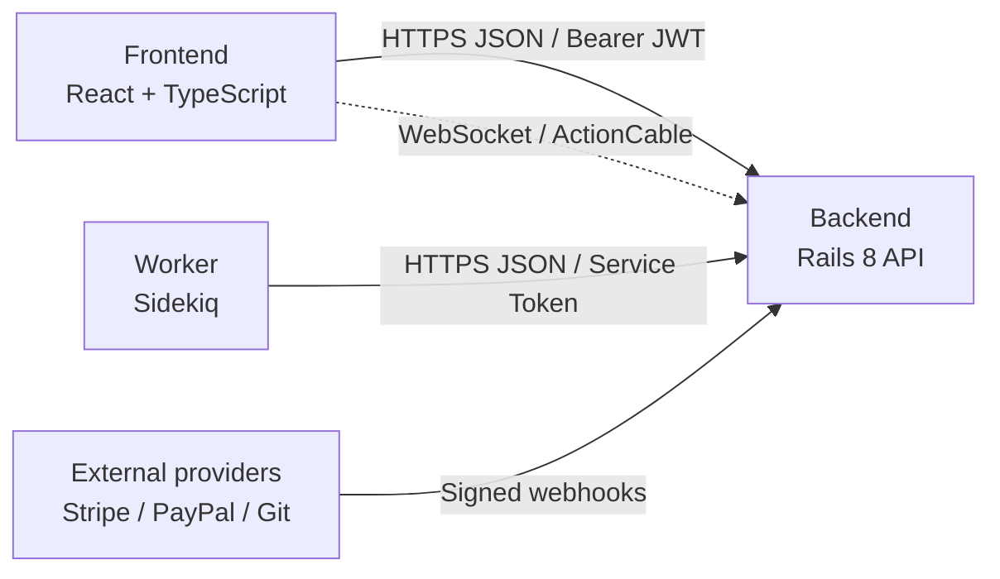

# API Overview

> Status: active
>
> Authoritative reference for the Powernode HTTP API surface.

## Table of Contents

- [Overview](#overview)
- [Communication Architecture](#communication-architecture)
- [Response Format](#response-format)
- [Authentication](#authentication)
- [Frontend → Backend Endpoints](#frontend--backend-endpoints)
- [Worker → Backend Endpoints](#worker--backend-endpoints)
- [External Webhooks](#external-webhooks)
- [Forbidden Patterns](#forbidden-patterns)

## Overview

Powernode exposes a JSON HTTP API under `/api/v1` from the Rails backend (`server/`). All endpoints follow a unified response envelope, use JWT bearer tokens, and serve three classes of caller: the React frontend, the standalone Sidekiq worker, and external integrators. Real-time channels live on the same host via ActionCable; see [websocket.md](websocket.md). AI orchestration endpoints (80 controllers under `/api/v1/ai/`) are catalogued in [ai.md](ai.md).

## Communication Architecture



There is **no direct Frontend → Worker communication**. All worker operations flow through the backend, which enqueues Sidekiq jobs. Workers report progress back to the backend, which broadcasts updates over ActionCable to the frontend.

## Response Format

All API endpoints MUST return responses using the `ApiResponse` controller concern. Manual `render json:` calls are forbidden.

### Success

```ruby
render_success(data, status: :ok)
render_success(data, message: "Operation completed")
```

```json
{
  "success": true,
  "data": { },
  "message": "Optional message"
}
```

> **kwarg-collision gotcha:** `render_success` declares `status:` as an HTTP-status kwarg and collects all other kwargs as data via `**extra_data`. If your payload has a field literally named `status` (health status, subscription status, order status, etc.), wrap it in `data: { ... }` — otherwise the value becomes the HTTP status code.
>
> ```ruby
> # BROKEN: `status: "healthy"` is captured as HTTP status → coerced to 0
> render_success(id: x, healthy: true, status: "healthy")
>
> # CORRECT: wrap in data:
> render_success(data: { id: x, healthy: true, status: "healthy" })
> ```
>
> Since 2026-04-17, `render_success` / `render_error` raise `ArgumentError` at call time for any `status:` that isn't an Integer 100-599 or a Rack status symbol, so this footgun now fails loudly.

### Error

```ruby
render_error("Error message", status: :bad_request)
render_error("Not found", status: :not_found)
```

```json
{
  "success": false,
  "error": "Error message",
  "code": "error_code"
}
```

### Validation Error

```ruby
render_validation_error(record.errors)
```

```json
{
  "success": false,
  "error": "Validation failed",
  "errors": {
    "field_name": ["error message"]
  }
}
```

### Paginated

```ruby
render_paginated(collection, serializer: ItemSerializer)
```

```json
{
  "success": true,
  "data": [ ],
  "meta": {
    "current_page": 1,
    "total_pages": 10,
    "total_count": 100,
    "per_page": 10
  }
}
```

### ApiResponse Method Reference

| Method | Purpose | Default Status |
|--------|---------|----------------|
| `render_success(data, opts)` | Successful response | 200 |
| `render_created(data, opts)` | Resource created | 201 |
| `render_error(message, opts)` | Error response | 400 |
| `render_not_found(message)` | Resource not found | 404 |
| `render_unauthorized(message)` | Authentication failed | 401 |
| `render_forbidden(message)` | Authorization failed | 403 |
| `render_validation_error(errors)` | Validation errors | 422 |
| `render_paginated(collection, opts)` | Paginated list | 200 |

## Authentication

| Caller | Mechanism | Token |
|--------|-----------|-------|
| Frontend → Backend | Bearer token | JWT — 15 min access, 7 day refresh |
| Worker → Backend | Bearer token | Long-lived service token (`WORKER_TOKEN` env) |
| External webhooks | Signature verification | Provider-specific (Stripe signature header, PayPal cert) |
| WebSocket | Query param | JWT access token |

Worker base URL is configured via `BACKEND_API_URL` (default `http://localhost:3000`). Default timeout is 120 seconds, with 3 retries on exponential backoff for transient failures (408, 429, 500, 502, 503, 504).

## Frontend → Backend Endpoints

The endpoint catalogue below summarises the surfaces the React frontend consumes. All paths are prefixed with `/api/v1` unless noted.

### Authentication & Session

| Endpoint | Method | Purpose | Auth |
|----------|--------|---------|------|
| `/auth/register` | POST | User registration with account creation | No |
| `/auth/login` | POST | User login, returns JWT tokens | No |
| `/auth/logout` | POST | Logout, blacklist tokens | Yes |
| `/auth/refresh` | POST | Refresh access token using refresh token | No |
| `/auth/me` | GET | Get current authenticated user + permissions | Yes |
| `/auth/forgot-password` | POST | Initiate password reset flow | No |
| `/auth/reset-password` | POST | Complete password reset with token | No |
| `/auth/verify-email` | POST | Verify email with token | No |
| `/auth/resend-verification` | POST | Resend email verification | Yes |
| `/auth/verify-2fa` | POST | Verify 2FA code during login | No |

```json
{
  "success": true,
  "data": {
    "user": { "id": "uuid", "email": "...", "permissions": [] },
    "access_token": "jwt...",
    "refresh_token": "jwt...",
    "expires_in": 900
  }
}
```

### Two-Factor Authentication

| Endpoint | Method | Purpose |
|----------|--------|---------|
| `/two_factor/status` | GET | Check 2FA enrolment status |
| `/two_factor/enable` | POST | Generate 2FA secret and QR code |
| `/two_factor/verify_setup` | POST | Verify 2FA setup with code |
| `/two_factor/disable` | DELETE | Disable 2FA with verification |
| `/two_factor/backup_codes` | GET | Retrieve backup codes |
| `/two_factor/regenerate_backup_codes` | POST | Generate new backup codes |

### Accounts & Users

| Endpoint | Method | Purpose |
|----------|--------|---------|
| `/accounts/current` | GET/PUT | Get/update current account |
| `/accounts/usage` | GET | Account usage metrics |
| `/users` | GET/POST | List/create users in account |
| `/users/{id}` | GET/PUT/DELETE | User CRUD |
| `/users/{id}/suspend` | PUT | Suspend user |
| `/users/{id}/activate` | PUT | Activate suspended user |
| `/users/{id}/reset_password` | POST | Admin-triggered password reset |
| `/users/{id}/unlock` | PUT | Unlock locked account |
| `/users/stats` | GET | User statistics |

### Roles & Permissions

| Endpoint | Method | Purpose |
|----------|--------|---------|
| `/roles` | GET/POST | List/create roles |
| `/roles/{id}` | GET/PUT/DELETE | Role CRUD |
| `/roles/{id}/users` | GET | Users assigned to role |
| `/roles/assignable` | GET | Roles current user can assign |
| `/permissions` | GET | All available permissions |
| `/users/{id}/roles/{role_id}` | POST/DELETE | Assign/remove role |

### Invitations & Delegations

| Endpoint | Method | Purpose |
|----------|--------|---------|
| `/invitations` | GET/POST | List/send invitations |
| `/invitations/{id}/resend` | POST | Resend invitation email |
| `/invitations/{id}` | DELETE | Cancel invitation |
| `/invitations/{token}/accept` | POST | Accept invitation (public) |
| `/accounts/current/delegations` | GET/POST | List/create delegations |
| `/accounts/current/delegations/{id}` | GET/PATCH/DELETE | Delegation CRUD |
| `/accounts/current/delegations/{id}/activate` | PATCH | Activate delegation |
| `/accounts/current/delegations/{id}/revoke` | PATCH | Revoke delegation |

### Billing & Subscriptions (extension-gated)

These endpoints are available when the `business` extension is loaded; in core mode the platform runs in single-user self-hosted form without billing.

| Endpoint | Method | Purpose |
|----------|--------|---------|
| `/billing` | GET | Billing overview dashboard |
| `/billing/subscription` | GET | Subscription details |
| `/billing/invoices` | GET/POST | List/create invoices |
| `/billing/payment-methods` | GET/POST | Payment method management |
| `/billing/payment-methods/{id}` | DELETE | Remove payment method |
| `/billing/payment-methods/{id}/default` | PUT | Set default |
| `/billing/payment-intent` | POST | Create payment intent |
| `/billing/history` | GET | Billing history |
| `/subscriptions` | GET/POST | List/create subscriptions |
| `/subscriptions/{id}` | GET/PATCH/DELETE | Subscription CRUD |
| `/plans` | GET | List plans |
| `/public/plans` | GET | Public plan list (no auth) |
| `/plans/{id}` | GET | Plan details |

### Payment Gateways (extension-gated)

| Endpoint | Method | Purpose |
|----------|--------|---------|
| `/payment_gateways` | GET | List configured gateways |
| `/payment_gateways/{gateway}` | GET/PUT | Gateway config CRUD |
| `/payment_gateways/{gateway}/test_connection` | POST | Test gateway (async job) |
| `/gateway_connection_jobs/{id}` | GET | Check test job status |
| `/payment_gateways/{gateway}/webhook_events` | GET | Webhook event history |
| `/payment_gateways/{gateway}/transactions` | GET | Transaction history |
| `/payment_methods` | GET/POST/DELETE | Payment method CRUD |
| `/payment_methods/setup_intent` | POST | Create Stripe setup intent |
| `/payment_methods/{id}/set_default` | PUT | Set default method |

### Outbound Webhooks (account-managed)

| Endpoint | Method | Purpose |
|----------|--------|---------|
| `/webhooks` | GET/POST | List/create webhook endpoints |
| `/webhooks/{id}` | GET/PUT/DELETE | Webhook CRUD |
| `/webhooks/{id}/test` | POST | Test webhook delivery |
| `/webhooks/{id}/toggle_status` | POST | Enable/disable webhook |
| `/webhooks/available_events` | GET | Available event types |
| `/webhooks/deliveries` | GET | Delivery history |
| `/webhooks/stats` | GET | Webhook statistics |
| `/webhooks/retry_failed` | POST | Retry failed deliveries |

### API Keys

| Endpoint | Method | Purpose |
|----------|--------|---------|
| `/api_keys` | GET/POST | List/create API keys |
| `/api_keys/{id}` | GET/PUT/DELETE | API key CRUD |
| `/api_keys/{id}/regenerate` | POST | Regenerate key |
| `/api_keys/{id}/toggle_status` | POST | Enable/revoke key |
| `/api_keys/usage` | GET | Usage statistics |
| `/api_keys/scopes` | GET | Available scopes |
| `/api_keys/validate` | POST | Validate key |

### Audit Logs

| Endpoint | Method | Purpose |
|----------|--------|---------|
| `/audit_logs` | GET | Query audit logs (filtered) |
| `/audit_logs/{id}` | GET | Specific audit log entry |
| `/audit_logs/security_summary` | GET | Security analytics |
| `/audit_logs/compliance_summary` | GET | Compliance metrics |
| `/audit_logs/activity_timeline` | GET | Activity timeline |
| `/audit_logs/risk_analysis` | GET | Risk assessment |
| `/audit_logs/stats` | GET | Log statistics |
| `/audit_logs/export` | POST | Export logs |
| `/audit_logs/cleanup` | DELETE | Cleanup old logs |

### Admin Settings & System

| Endpoint | Method | Purpose |
|----------|--------|---------|
| `/admin_settings` | GET/PUT | Admin dashboard overview / update settings |
| `/admin_settings/metrics` | GET | System metrics |
| `/admin_settings/users` | GET | All users (admin) |
| `/admin_settings/accounts` | GET | All accounts (admin) |
| `/admin_settings/system_logs` | GET | System logs |
| `/admin_settings/suspend_account` | POST | Suspend account |
| `/admin_settings/activate_account` | POST | Activate account |
| `/admin_settings/health` | GET | System health |
| `/admin_settings/security` | GET/PUT | Security configuration |
| `/admin_settings/security/regenerate_jwt_secret` | POST | Rotate JWT secret |

### Rate Limiting (Admin)

| Endpoint | Method | Purpose |
|----------|--------|---------|
| `/admin/rate_limiting/statistics` | GET | Rate limiting stats |
| `/admin/rate_limiting/violations` | GET | Violation history |
| `/admin/rate_limiting/status` | GET | Current status |
| `/admin/rate_limiting/limits/{identifier}` | GET/DELETE | Per-user limits |
| `/admin/rate_limiting/disable` | POST | Temporarily disable |
| `/admin/rate_limiting/enable` | POST | Re-enable |

### Impersonation

| Endpoint | Method | Purpose |
|----------|--------|---------|
| `/impersonations` | POST/DELETE | Start/stop impersonation |
| `/impersonations` | GET | Active sessions |
| `/impersonations/history` | GET | Impersonation history |
| `/impersonations/users` | GET | Impersonatable users |
| `/impersonations/validate` | POST | Validate impersonation token |

### Analytics & Reporting

| Endpoint | Method | Purpose |
|----------|--------|---------|
| `/analytics/live` | GET | Live analytics dashboard |
| `/analytics/revenue` | GET | Revenue metrics |
| `/analytics/growth` | GET | Growth analytics |
| `/analytics/churn` | GET | Churn analysis |
| `/analytics/cohorts` | GET | Cohort analysis |
| `/analytics/customers` | GET | Customer analytics |
| `/analytics/export` | GET/POST | Export analytics |
| `/reports` | GET/POST | Report management |
| `/reports/requests/{id}` | GET | Report request status |

### Workers & Services

| Endpoint | Method | Purpose |
|----------|--------|---------|
| `/workers` | GET/POST | List/register workers |
| `/workers/{id}` | GET/PATCH/DELETE | Worker CRUD |
| `/workers/{id}/regenerate_token` | POST | Rotate worker token |
| `/workers/{id}/suspend` | POST | Suspend worker |
| `/workers/{id}/activate` | POST | Activate worker |
| `/workers/{id}/health_check` | POST | Health check |
| `/workers/{id}/test_worker` | POST | Test worker |
| `/workers/{id}/activities` | GET | Worker activity log |
| `/workers/{id}/config` | GET/PUT | Worker configuration |
| `/workers/stats` | GET | Worker statistics |
| `/admin/services` | GET/POST/PATCH/DELETE | Service management |

### Content Management

| Endpoint | Method | Purpose |
|----------|--------|---------|
| `/pages` | GET | List public pages |
| `/pages/{slug}` | GET | Get public page |
| `/admin/pages` | GET/POST/PUT/DELETE | Admin page CRUD |
| `/admin/pages/{id}/publish` | POST | Publish page |
| `/admin/pages/{id}/duplicate` | POST | Duplicate page |
| `/kb/articles` | GET/POST/PUT/DELETE | KB articles |
| `/kb/categories` | GET/POST/PUT/DELETE | KB categories |
| `/kb/comments` | GET/POST/PUT/DELETE | Article comments |

### File Storage

| Endpoint | Method | Purpose |
|----------|--------|---------|
| `/storage` | GET | List storage providers |
| `/storage/{id}` | GET/PUT/DELETE | Provider CRUD |
| `/storage` | POST | Create provider |
| `/storage/{id}/test` | POST | Test connection |
| `/storage/{id}/set_default` | POST | Set default |

### Marketplace & Apps

| Endpoint | Method | Purpose |
|----------|--------|---------|
| `/apps` | GET/POST | List/create apps |
| `/apps/{id}` | GET/PUT/DELETE | App CRUD |
| `/apps/{id}/publish` | POST | Publish to marketplace |
| `/apps/{id}/unpublish` | POST | Remove from marketplace |
| `/apps/{id}/analytics` | GET | App analytics |
| `/apps/{id}/app_plans` | GET/POST/PUT/DELETE | App pricing plans |
| `/apps/{id}/app_features` | GET/POST/PUT/DELETE | App features |
| `/apps/{id}/app_endpoints` | GET/POST/PUT/DELETE | App endpoints |
| `/apps/{id}/app_webhooks` | GET/POST/PUT/DELETE | App webhooks |
| `/marketplace_listings` | GET | Public marketplace |
| `/app_subscriptions` | GET/POST/PATCH/DELETE | App subscriptions |
| `/app_reviews` | GET/POST/PUT/DELETE | App reviews |

### AI Orchestration

See [ai.md](ai.md) for the full AI orchestration surface (80 controllers under `/api/v1/ai/`).

## Worker → Backend Endpoints

The worker authenticates with a service bearer token and posts back via the same JSON envelope used by the frontend.

```
Authorization: Bearer <WORKER_TOKEN>
```

### Account & Subscription Operations

| Endpoint | Method | Purpose |
|----------|--------|---------|
| `/accounts/{id}` | GET | Get account details |
| `/accounts/{id}/subscription` | GET | Get account subscription |
| `/accounts/{id}/payment_methods` | GET | Get payment methods |
| `/accounts` | GET | List active accounts |
| `/subscriptions` | GET | Query subscriptions for renewal |
| `/subscriptions/{id}` | GET/PATCH | Get/update subscription |

### Billing & Payment

| Endpoint | Method | Purpose |
|----------|--------|---------|
| `/billing/generate_invoice` | POST | Generate renewal invoice |
| `/billing/process_payment` | POST | Process payment on invoice |
| `/billing/process_renewal` | POST | Process subscription renewal |
| `/invoices` | GET/POST | Invoice operations |
| `/payments` | POST | Process payment |

### Payment Reconciliation

| Endpoint | Method | Purpose |
|----------|--------|---------|
| `/reconciliation/stripe_payments` | GET | Local Stripe payments |
| `/reconciliation/paypal_payments` | GET | Local PayPal payments |
| `/reconciliation/report` | POST | Submit reconciliation report |
| `/reconciliation/corrections` | POST | Create correction for missing |
| `/reconciliation/flags` | POST | Flag discrepancies |
| `/reconciliation/investigations` | POST | Flag amount mismatches |

### Webhook Processing (Inbound)

Workers normalise inbound provider webhooks and re-emit to internal endpoints.

| Endpoint | Method | Purpose |
|----------|--------|---------|
| `/webhooks/payment_succeeded` | POST | Successful payment |
| `/webhooks/payment_failed` | POST | Failed payment |
| `/webhooks/subscription_updated` | POST | Subscription update |
| `/webhooks/subscription_cancelled` | POST | Cancellation |
| `/webhooks/subscription_activated` | POST | Activation |
| `/webhooks/payment_method_attached` | POST | New payment method |
| `/webhooks/payment_intent_succeeded` | POST | Payment intent success |
| `/webhooks/payment_intent_failed` | POST | Payment intent failure |

> **Webhook receivers MUST return 2xx on processing errors** — never 5xx (causes provider retry storms). Surface failures via internal monitoring instead.

### Reports & Analytics

| Endpoint | Method | Purpose |
|----------|--------|---------|
| `/reports/requests/{id}` | GET/PATCH | Status updates |
| `/analytics/export` | GET | Analytics data |
| `/analytics/update_revenue_snapshots` | POST | Update revenue snapshots |
| `/reports/scheduled` | GET | Due scheduled reports |

### AI Mission & Ralph Execution

| Endpoint | Method | Purpose |
|----------|--------|---------|
| `/ai/missions/{id}` | GET | Mission state |
| `/ai/missions/{id}/advance` | POST | Advance after phase completion |
| `/ai/missions/{id}/deploy_callback` | POST | Deployment result callback |
| `/ai/ralph_loops/{id}` | GET | Loop state |
| `/ai/ralph_loops/{id}/run_iteration` | POST | Kick off next iteration |
| `/ai/ralph_loops/process_scheduled` | POST | Process scheduled loops |

### File Processing

| Endpoint | Method | Purpose |
|----------|--------|---------|
| `/worker/processing_jobs/{id}` | GET/PATCH | Processing job lifecycle |
| `/worker/files/{id}` | GET/PATCH | File object metadata |
| `/worker/files/{id}/download` | GET | Download file content |
| `/worker/files/{id}/processed` | POST | Upload processed file |

### Notifications & Audit

| Endpoint | Method | Purpose |
|----------|--------|---------|
| `/notifications` | POST | Log notification |
| `/audit_logs` | POST | Create audit entry |
| `/alerts` | POST | Create system alert |

### Internal (Worker-Only)

| Endpoint | Method | Purpose |
|----------|--------|---------|
| `/internal/users/{id}` | GET | User data for emails |
| `/internal/accounts/{id}` | GET | Account data for emails |
| `/internal/invitations/{id}` | GET | Invitation data |
| `/internal/workers/{id}/test_results` | POST | Report test completion |
| `/internal/jobs/{id}` | GET/PATCH | Track background job status |
| `/health` | GET | Backend health check |

### Worker Resilience

```ruby
# Backend API circuit breaker
failure_threshold: 5
recovery_timeout: 60 seconds
request_timeout: 120 seconds

# AI provider circuit breaker
failure_threshold: 5
recovery_timeout: 120 seconds
request_timeout: 600 seconds

# Mission phase execution circuit breaker
failure_threshold: 3
recovery_timeout: 30 seconds
request_timeout: 300 seconds
```

Retry strategy:
- API client: 3 retries, exponential backoff (0.5s base, 2x multiplier)
- Job level: 3 attempts, 2^attempt seconds sleep
- Sidekiq: 3 retries, exponential backoff with jitter
- Retryable status codes: 408, 429, 500, 502, 503, 504

## External Webhooks

| Endpoint | Method | Source | Purpose |
|----------|--------|--------|---------|
| `/webhooks/stripe` | POST | Stripe | Payment lifecycle events |
| `/webhooks/paypal` | POST | PayPal | Payment lifecycle events |

Inbound flow:
1. Webhook received at endpoint
2. Signature verified (Stripe `Stripe-Signature` header / PayPal certificate)
3. Event enqueued to Sidekiq
4. Worker processes event via `/api/v1/webhooks/*` endpoints

## Forbidden Patterns

```ruby
# NEVER do this — manual JSON responses
render json: { success: true, data: user }
render json: { error: "Not found" }, status: :not_found

# NEVER include ApiResponse in controllers (already inherited)
class MyController < ApplicationController
  include ApiResponse  # WRONG — already included via ApplicationController inheritance
end
```

## Controller Template

```ruby
# frozen_string_literal: true

module Api
  module V1
    class UsersController < ApplicationController
      before_action :authenticate_user!
      before_action :set_user, only: %i[show update destroy]

      def index
        users = current_account.users.includes(:roles, :permissions)
        render_paginated(users, serializer: UserSerializer)
      end

      def show
        render_success(UserSerializer.new(@user))
      end

      def create
        user = current_account.users.build(user_params)
        if user.save
          render_created(UserSerializer.new(user))
        else
          render_validation_error(user.errors)
        end
      end

      def update
        if @user.update(user_params)
          render_success(UserSerializer.new(@user))
        else
          render_validation_error(@user.errors)
        end
      end

      def destroy
        @user.destroy
        render_success(nil, message: "User deleted")
      end

      private

      def set_user
        @user = current_account.users.find(params[:id])
      rescue ActiveRecord::RecordNotFound
        render_not_found("User not found")
      end

      def user_params
        params.require(:user).permit(:email, :name, :role_id)
      end
    end
  end
end
```

## Frontend Consumption

```typescript
interface ApiResponse<T> {
  success: boolean;
  data?: T;
  error?: string;
  message?: string;
}

interface PaginatedResponse<T> extends ApiResponse<T[]> {
  meta: {
    current_page: number;
    total_pages: number;
    total_count: number;
    per_page: number;
  };
}

const response = await apiClient.get<User>('/api/v1/users/1');
if (response.success) {
  setUser(response.data);
} else {
  showError(response.error);
}
```

---

## Related docs

- [api/ai.md](ai.md) — AI orchestration controllers
- [api/websocket.md](websocket.md) — ActionCable channels
- [../../concepts/architecture.md](../../concepts/architecture.md) — Service boundaries
- [../../guides/backend.md](../../guides/backend.md) — Controller patterns and conventions
- [../../guides/devops.md](../../guides/devops.md) — Worker job conventions

## Materials previously at

- `docs/platform/API_COMMUNICATIONS.md`
- `docs/platform/API_RESPONSE_STANDARDS.md`

_Last verified: 2026-06-03_
