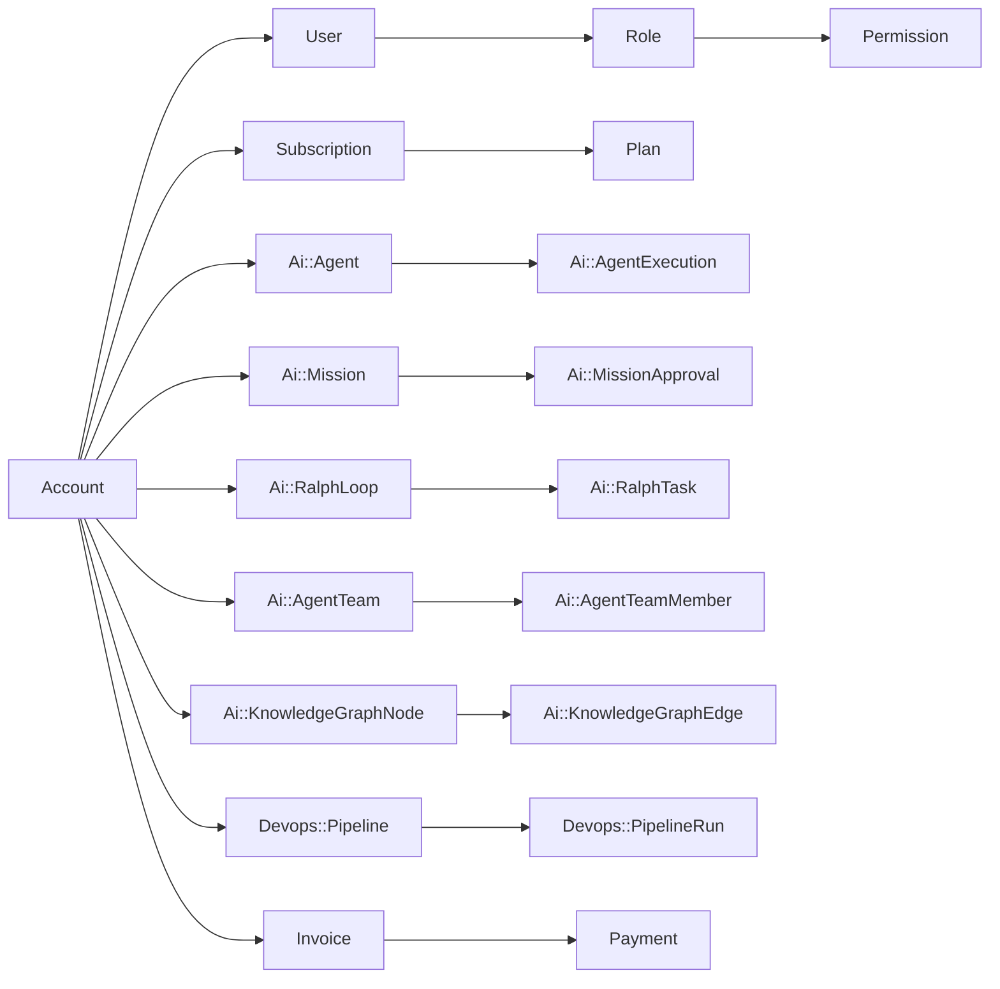

# Database Schema Reference

> Authoritative reference for the Powernode PostgreSQL schema: model namespaces, key tables, conventions.

## Table of Contents

- [Overview](#overview)
- [Model Namespaces](#model-namespaces)
- [Key Relationships](#key-relationships)
- [Database Conventions](#database-conventions)

## Overview

The Powernode backend uses PostgreSQL with UUIDv7 primary keys across all tables. Models are organised into namespaces that reflect feature domains. This reference catalogues every namespace, summarises the tables per area, and documents the schema conventions that controllers, migrations, and seeds must follow.

## Model Namespaces

### Top-Level Models

Core platform models not in a namespace.

| Model | Description |
|-------|-------------|
| `User` | Platform users with authentication and permissions |
| `Account` | Multi-tenant account (one per organisation) |
| `Role` | Permission grouping (system.admin, account.manager, etc.) |
| `Permission` | Individual permission entry — see [permissions.md](permissions.md) |
| `RolePermission` | Role-to-permission join table |
| `Plan` | Subscription plan with features/limits (extension-gated) |
| `Subscription` | Account subscription, AASM state machine with 8 states (extension-gated) |
| `Invoice` | Billing invoices with line items (extension-gated) |
| `Payment` | Payment records (extension-gated) |
| `Invitation` | User invitations with email workflow |
| `AuditLog` | Comprehensive activity tracking |
| `Notification` | User notifications |
| `ApiKey` / `ApiKeyUsage` | API key management and usage tracking |
| `AdminSetting` | System configuration key-value store |
| `BlacklistedToken` / `JwtBlacklist` | Token revocation |
| `PasswordHistory` | Password reuse prevention |
| `Page` | CMS content pages |
| `OauthApplication` | OAuth2 provider applications |
| `ImpersonationSession` | Admin impersonation tracking |
| `McpServer` / `McpTool` / `McpSession` / `McpToolExecution` | MCP protocol infrastructure |
| `CommunityAgent` / `CommunityAgentRating` / `CommunityAgentReport` | Agent marketplace |
| `ExternalAgent` / `FederationPartner` | A2A external agents |
| `ReportRequest` | Async report generation |
| `EmailDelivery` | Email delivery tracking |
| `BackgroundJob` | Job status tracking |

### `Ai::` Namespace

The largest namespace — covers the entire AI platform.

| Area | Examples |
|------|----------|
| Agents | `Agent`, `AgentExecution`, `AgentExecutionStep`, `AgentCapability`, `AgentConfiguration` |
| Teams | `AgentTeam`, `AgentTeamMember`, `TeamExecution`, `TeamChannel`, `TeamMessage` |
| Missions | `Mission`, `MissionApproval` |
| Ralph | `RalphLoop`, `RalphTask`, `RalphIteration`, `RalphLearning` |
| Providers | `Provider`, `ProviderModel`, `ModelRoutingRule`, `ProviderHealthCheck` |
| Data Sources | `DataSource`, `DataSourceCredential` |
| Knowledge | `KnowledgeGraphNode`, `KnowledgeGraphEdge`, `CompoundLearning`, `SharedKnowledge` |
| Memory | `MemoryEntry`, `MemoryPool`, `ContextEntry`, `ContextGroup`, `AgentShortTermMemory` |
| Skills | `Skill`, `SkillExecution`, `AgentSkill`, `SkillMutation`, `SkillChallenge` |
| Tools | `Tool`, `ToolExecution`, `ToolCategory` |
| Code Factory | `CodeFactoryRun`, `CodeFactoryContract`, `CodeFactoryTask`, `RiskContract`, `ReviewState` |
| Autonomy | `AgentTrustScore`, `DelegationPolicy`, `AgentPrivilegePolicy`, `BehavioralFingerprint`, `KillSwitchEvent`, `AgentGoal`, `AgentObservation`, `AgentProposal`, `AgentEscalation`, `InterventionPolicy`, `AgentFeedback` |
| Conversations | `Conversation`, `Message`, `Attachment` |
| Monitoring | `CostTracking`, `UsageMetric`, `BudgetAlert` |
| Templates | `SystemPromptTemplate` |
| Trust & Safety | `TrustScore`, `Guardrail`, `GuardrailEvaluation` |
| Worktree | `Worktree`, `WorktreeSession`, `WorktreeEvent` |

### `Devops::` Namespace

| Area | Examples |
|------|----------|
| Pipelines | `Pipeline`, `PipelineRun`, `PipelineStep`, `PipelineStepExecution` |
| Git | `GitProvider`, `GitRepository`, `GitRunner`, `GitPipelineJob` |
| Docker | `DockerHost`, `DockerContainer`, `SwarmService`, `SwarmStack` |
| Deployments | `Deployment`, `DeploymentTarget`, `DeploymentEnvironment` |
| Templates | `IntegrationTemplate`, `ContainerTemplate` |

### `KnowledgeBase::` Namespace

| Model | Description |
|-------|-------------|
| `Article` | KB articles with Markdown content |
| `Category` | Article categorisation |
| `Tag` | Article tagging |
| `ArticleTag` | Article-to-tag join |
| `Comment` | Article comments |
| `Attachment` | Article file attachments |
| `ArticleView` | View tracking |
| `Workflow` | Article workflow states |

### `Chat::` Namespace

| Model | Description |
|-------|-------------|
| `Conversation` | Chat conversation container |
| `Message` | Individual messages |
| `Attachment` | Message attachments |
| `Session` | Active chat sessions |
| `Participant` | Conversation participants |

### `FileManagement::` Namespace

| Model | Description |
|-------|-------------|
| `FileUpload` | Uploaded file records |
| `StorageBackend` | Storage provider configuration |
| `FileVersion` | File versioning |
| `FileShare` | Shared file access |
| `VirusScanResult` | Antivirus scan results |
| `FileQuota` | Storage quota tracking |
| `FileAuditLog` | File access audit trail |

### `Account::` Namespace

| Model | Description |
|-------|-------------|
| `Delegation` | Cross-account access delegation |
| `Setting` | Account-specific settings |
| `Feature` | Account feature flags |

### `DataManagement::` Namespace

| Model | Description |
|-------|-------------|
| `RetentionPolicy` | Data retention rules |
| `SanitizationRule` | PII sanitisation |
| `DataExport` | GDPR data export records |

### `Database::` Namespace

| Model | Description |
|-------|-------------|
| `Connection` | External database connections |
| `QueryHistory` | Query execution history |

### `Monitoring::` Namespace

| Model | Description |
|-------|-------------|
| `HealthCheck` | Service health check records |
| `ServiceStatus` | Service availability status |

### `Shared::` Namespace

| Model | Description |
|-------|-------------|
| `FeatureGate` | Extension feature gating |

## Key Relationships

## Database Conventions

| Convention | Detail |
|------------|--------|
| Primary keys | UUIDv7 (chronologically sortable) — generate via `UUID7.generate` |
| Foreign keys | `t.references` with type `:uuid` (index included automatically — never `add_index` separately) |
| Namespaced FK prefix | `Ai::` → `ai_`, `Devops::` → `devops_`, `BaaS::` → `baas_` |
| Timestamps | `created_at`, `updated_at` on all tables |
| Soft delete | `discarded_at` on applicable models (Discard gem) |
| JSON columns | Lambda defaults — `attribute :config, :json, default: -> { {} }` |
| Vectors | pgvector with HNSW indexes for embedding columns |

Association requirements:
- Always pair `class_name:` with `foreign_key:` — e.g. `belongs_to :provider, class_name: "Ai::Provider", foreign_key: "ai_provider_id"`.
- All namespaced models MUST use `::` separator in `class_name:` — e.g. `class_name: "Ai::AgentTeam"`, never `"AiAgentTeam"`.

Migration patterns:
- `t.references` automatically creates an index; never add `add_index` for reference columns. Customise via the declaration itself: `t.references :account, index: { unique: true }`.

After modifying seeds, run `cd server && rails db:seed` and verify completion.

---

## Related docs

- [permissions.md](permissions.md) — Permission registry
- [../concepts/data-model.md](../concepts/data-model.md) — Design rationale, UUIDv7 reasoning
- [api/overview.md](api/overview.md) — How tables surface as endpoints
- [../guides/backend.md](../guides/backend.md) — Rails patterns

## Materials previously at

- `docs/backend/DATABASE_SCHEMA_REFERENCE.md`

_Last verified: 2026-05-17_
